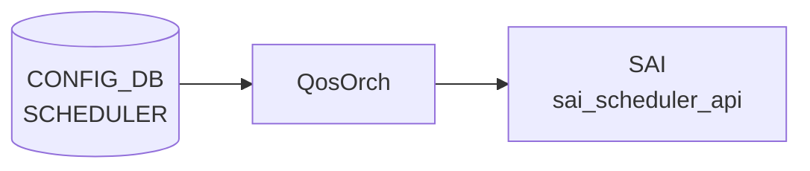

# SCHEDULER — QosOrch SchedulerOrch コード由来デフォルト詳解

## 概要

`orchagent` の `QosOrch::handleSchedulerTable()` が [CONFIG_DB](../../reference/glossary.md#term-config_db) `SCHEDULER` テーブルを処理する。各フィールドは**存在する場合のみ** [SAI](../../reference/glossary.md#term-sai) 属性リストに追加され、省略時は [SAI](../../reference/glossary.md#term-sai) 実装のベンダーデフォルトに委ねられる。[YANG](../../reference/glossary.md#term-yang) で宣言された `default` 値は qosorch が参照しない点が重要である[^1]。

本ページは [`SCHEDULER テーブル`](scheduler.md) の [orchagent](../../reference/glossary.md#term-orchagent) 処理詳解ページである。テーブル全体の概要・key 構造・フィールド一覧は [`SCHEDULER テーブル`](scheduler.md) を参照。

<!-- cdb-mermaid -->
### データフロー (自動生成)



!!! note "凡例"
    CONFIG_DB から SAI までの典型経路を `docs/reference/config-db-orch-map.md` から機械生成したミニ図。詳細・例外は本ページ本文と対応表を参照。
<!-- /cdb-mermaid -->

<!-- defaults -->
## コード由来のデフォルト・暗黙挙動 (Phase A)

> **調査根拠**: `sonic-swss/orchagent/qosorch.cpp` `handleSchedulerTable()` L1347–1509 全行精読 + `qosorch.h` L22, 44–53 定数定義確認 + `sonic-scheduler.yang` 照合 (2026-05-15)

| フィールド | YANG default | qosorch 実装の実効デフォルト | 備考 |
|-----------|-------------|--------------------------|------|
| `type` | `WRR` | **[SAI](../../reference/glossary.md#term-sai) ベンダー依存**（省略時 SAI 属性送信なし） | YANG default は qosorch 未参照 |
| `weight` | `1` | **SAI ベンダー依存**（省略時 SAI 属性送信なし） | `(uint8_t)stoi()` キャスト、YANG `range "1..100"` 未検証 |
| `priority` | なし | **dead field — エントリ全破棄** | 処理分岐が存在しない。SET すると `Unknown field:priority` → `task_invalid_entry` で**全フィールドが SAI 未反映** |
| `meter_type` | `bytes` | **SAI ベンダー依存**（省略時）; 不正値で **[orchagent](../../reference/glossary.md#term-orchagent) クラッシュ** | `scheduler_meter_map.at()` が `std::out_of_range` 未キャッチ |
| `cir` / `cbs` / `pir` / `pbs` | なし | 省略時 SAI デフォルト相当（0 = 無制限） | 存在時のみ設定。YANG `must` 制約はコード未検証 |

### `type` フィールドの詳細

```cpp
// qosorch.cpp L1378–1397
if (fvField(*i) == scheduler_algo_type_field_name)   // "type"
{
    attr.id = SAI_SCHEDULER_ATTR_SCHEDULING_TYPE;
    if      (fvValue(*i) == scheduler_algo_DWRR)   attr.value.s32 = SAI_SCHEDULING_TYPE_DWRR;
    else if (fvValue(*i) == scheduler_algo_WRR)    attr.value.s32 = SAI_SCHEDULING_TYPE_WRR;
    else if (fvValue(*i) == scheduler_algo_STRICT) attr.value.s32 = SAI_SCHEDULING_TYPE_STRICT;
    else {
        SWSS_LOG_ERROR("Unknown scheduler type value:%s", fvField(*i).c_str());
        return task_process_status::task_invalid_entry;  // エントリ全体が破棄される
    }
    sai_attr_list.push_back(attr);
}
```

- **省略時**: `SAI_SCHEDULER_ATTR_SCHEDULING_TYPE` は SAI attr リストに追加されない → SAI ベンダーデフォルト（保証なし）
- **未知の値**: `task_invalid_entry` を返し、`sai_attr_list` に積まれた他フィールドの属性も **SAI に反映されない**

### dead field 詳細: `priority`

`sonic-scheduler.yang` に `leaf priority { type uint8 { range "0..9"; } }` が定義されているが、`qosorch.h` には対応する定数が存在しない[^2]:

```
// qosorch.h L44–53 に scheduler_priority_field_name 定数なし
const string scheduler_algo_type_field_name     = "type";
const string scheduler_algo_DWRR                = "DWRR";
const string scheduler_algo_WRR                 = "WRR";
const string scheduler_algo_STRICT              = "STRICT";
const string scheduler_weight_field_name        = "weight";
const string scheduler_meter_type_field_name    = "meter_type";
const string scheduler_min_bandwidth_rate_field_name       = "cir";
const string scheduler_min_bandwidth_burst_rate_field_name = "cbs";
const string scheduler_max_bandwidth_rate_field_name       = "pir";
const string scheduler_max_bandwidth_burst_rate_field_name = "pbs";
// ← priority が存在しない
```

`handleSchedulerTable` の if-else チェーン (L1378–1438) に `priority` の処理分岐がなく、最後の `else` ブランチ (L1436–1439) にフォールスルーする:

```cpp
// qosorch.cpp L1436–1439
else {
    SWSS_LOG_ERROR("Unknown field:%s", fvField(*i).c_str());
    return task_process_status::task_invalid_entry;
}
```

> **重要**: `priority` フィールドを含む SCHEDULER エントリを CONFIG_DB に SET すると `Unknown field:priority` エラーで `task_invalid_entry` が返り、そのエントリの `type` / `weight` / `meter_type` 等を含む**全フィールドが SAI に反映されない**。回避策は CONFIG_DB から `priority` フィールドを除外すること。

### `meter_type` クラッシュリスク

```cpp
// qosorch.cpp L1407
sai_meter_type_t meter_value = scheduler_meter_map.at(fvValue(*i));
```

`scheduler_meter_map` は `{"packets": SAI_METER_TYPE_PACKETS, "bytes": SAI_METER_TYPE_BYTES}` のみ。`"packets"` / `"bytes"` 以外の値を渡すと `std::map::at()` が `std::out_of_range` 例外をスロー。**例外はキャッチされておらず [orchagent](../../reference/glossary.md#term-orchagent) プロセスがクラッシュする**。

`type` フィールドが graceful エラー処理 (`task_invalid_entry` を返す) をしているのと対照的な危険な挙動。YANG enum で 2 値のみが許可されているため通常経路では発生しないが、`sonic-db-cli` 等で直接 CONFIG_DB に書き込む際は要注意。

### 新規作成 vs 更新の挙動差異

| 状況 | SAI 呼び出し | 省略フィールドの扱い |
|------|------------|-------------------|
| 新規作成（SAI オブジェクトなし） | `create_scheduler()` に全属性まとめて渡す | SAI 作成時のベンダーデフォルトが適用 |
| 既存更新（SAI オブジェクトあり） | `set_scheduler_attribute()` を属性ごとに個別呼び出し | 省略フィールドは現在の SAI 属性値を保持（変更なし） |

!!! warning "更新時の注意"
    既存オブジェクトを更新する場合、省略したフィールドは変更されない。`type` を `WRR` → `STRICT` に変更するだけであれば `type` フィールドのみ SET すれば足りるが、`meter_type` を意図せず変更したくない場合は省略で安全。

### 削除保護ロジック

```cpp
// qosorch.cpp L1483–1488
if (gQosOrch->isObjectBeingReferenced(QosOrch::getTypeMap(), qos_map_type_name, qos_object_name))
{
    SWSS_LOG_NOTICE("Can't remove object %s due to being referenced (%s)", ...);
    (*(m_qos_maps[qos_map_type_name]))[qos_object_name].m_pendingRemove = true;
    return task_process_status::task_need_retry;
}
```

QUEUE 等から参照中の SCHEDULER を削除しようとすると `task_need_retry` を返し `m_pendingRemove = true` にセット。参照が解除されると次回 retry 時に自動削除される。

<!-- /defaults -->

<!-- ordering -->
## 書込み順依存 (Phase B)

### ADD 時: SCHEDULER → QUEUE の順が必須

`QUEUE` エントリの `scheduler` フィールドを書き込む前に、参照先の `SCHEDULER|<name>` エントリが CONFIG_DB に存在していなければならない。`handleQueueTable()`（`qosorch.cpp`）は `resolveFieldRefValue()` で参照先オブジェクトを解決し、SCHEDULER が未登録の場合は `task_need_retry` を返す。SCHEDULER SAI オブジェクトが生成されるまで QUEUE の SAI バインドは保留される[^3]。

```
SCHEDULER|<name>  ──SET──>  QUEUE|<port>|<idx>  (scheduler: <name>)
```

### DEL 時: QUEUE 参照解除 → SCHEDULER 削除の順が必須

`handleSchedulerTable()` の DEL ハンドラは、削除前に `isObjectBeingReferenced()` でその SCHEDULER を参照している QUEUE が存在しないかを確認する。参照が残っている場合は `m_pendingRemove = true` をセットして `task_need_retry` を返す。SAI scheduler profile は参照が解除されるまで削除されない[^3]。

```
QUEUE|<port>|<idx> の scheduler 参照を解除  ──DEL──>  SCHEDULER|<name>
```

### 再設定時: pending 状態に注意

DEL が `m_pendingRemove` 状態のまま同一名の SET を発行すると、SET も `task_need_retry` で保留される。QUEUE 参照の解除 → DEL の完了（SAI destroy 成功）を待ってから SET を発行すること[^3]。

### `config qos reload` では自動担保

`config qos reload` が使用する `qos_config.j2` テンプレートは SCHEDULER ブロック（`scheduler` セクション）を QUEUE ブロック（`queue` セクション）より先に展開するため、CLI 経由の一括適用では順序問題は発生しない。個別エントリを `sonic-db-cli` 等で直接投入する場合のみ上記の順序制約を意識する必要がある[^3]。

[^3]: QosOrch 実装 `handleSchedulerTable()` / `handleQueueTable()` / `isObjectBeingReferenced()`: `sonic-swss/orchagent/qosorch.cpp`. <https://github.com/sonic-net/sonic-swss/blob/4305596156d70e9797e8a881b3d19b46de0bce0d/orchagent/qosorch.cpp>

<!-- /ordering -->

<!-- cross-refs -->
## 暗黙参照テーブル (Phase C)

`SCHEDULER` エントリが処理される際に `QosOrch` が暗黙的に関与する他テーブルの依存関係を示す。

| 依存方向 | 参照元フィールド / 参照元 | 参照先テーブル | 参照先キー形式 | 依存内容 | 証跡 |
|---------|------------------------|--------------|--------------|---------|------|
| 逆参照（被参照） | `QUEUE.<port>\|<idx>.scheduler` | `SCHEDULER`（本テーブル） | `SCHEDULER\|<name>` | `handleQueueTable()` が `resolveFieldRefValue()` で SCHEDULER SAI オブジェクトを解決。SCHEDULER 未登録の場合は `task_need_retry` を返し QUEUE の SAI バインドを保留。YANG `sonic-queue.yang` でも `leafref path "...SCHEDULER_LIST/name"` として宣言 | `qosorch.cpp:1822-1852`, `sonic-queue.yang:84-87`, `sonic-queue.yang:132-135` |
| 逆参照（削除ガード） | `QUEUE.*` が参照中 | `SCHEDULER`（本テーブル） | `SCHEDULER\|<name>` | SCHEDULER DEL 時に `isObjectBeingReferenced()` で確認。QUEUE から参照中の場合は `m_pendingRemove = true` をセットして `task_need_retry`。参照解除後に自動 DEL が実行される | `qosorch.cpp:1483-1491` |
| 起動ガード | `PortsOrch::allPortsReady()` | PORT テーブル（PortsOrch 管理） | `PORT\|<port_name>` | `QosOrch::doTask(Consumer&)` 冒頭で `gPortsOrch->allPortsReady()` が偽の間は全 [QoS](../../reference/glossary.md#term-qos) タスク（SCHEDULER 含む）が処理されない。PortsOrch による全ポート初期化完了まで SAI オブジェクトは生成されない | `qosorch.cpp:2258-2261` |
| 実行時依存（QUEUE 経由） | `handleQueueTable()` → `applySchedulerToQueueSchedulerGroup()` | SCHEDULER_GROUP（SAI 管理） | SAI OID（DB なし） | QUEUE に SCHEDULER が紐付く際、`getSchedulerGroup()` でキュー→スケジューラグループ ID を検索し `SAI_SCHEDULER_GROUP_ATTR_SCHEDULER_PROFILE_ID` をセット。SAI 内部のスケジューラグループツリーに依存（DB テーブルなし） | `qosorch.cpp:1630-1710` |

### 解決タイミング

- **QUEUE → SCHEDULER 参照**: `handleQueueTable()` の SET 処理時に `resolveFieldRefValue()` で即座に確認。未解決（`not_resolved`）は `task_need_retry` で `m_toSync` に残留し、SCHEDULER の SAI 登録後の次回 `doTask()` で再評価される（`qosorch.cpp:1828-1833`）。
- **SCHEDULER DEL ガード**: DEL 処理時に `isObjectBeingReferenced()` でリアルタイム確認。参照カウンタがゼロになった次の `task_need_retry` サイクルで自動 DEL が実行される（`qosorch.cpp:1483-1491`）。
- **PortsOrch ガード**: PortsOrch の `allPortsReady()` フラグが立つまで全 [QoS](../../reference/glossary.md#term-qos) 処理は doorbell 待ち。この間は SCHEDULER エントリが CONFIG_DB に存在しても SAI には送信されない（`qosorch.cpp:2258-2261`）。

!!! note "SCHEDULER は「被参照専用」テーブル"
    SCHEDULER エントリ自体は他の CONFIG_DB テーブルを参照しない（leafref なし）。依存の方向は常に外部テーブル → SCHEDULER であり、SCHEDULER を先に投入してから参照側テーブルを投入するのが正しい順序である。

<!-- /cross-refs -->

<!-- failure -->
## 失敗挙動マトリクス (Phase D)

`handleSchedulerTable()`（`sonic-swss/orchagent/qosorch.cpp`）における SET / DEL 失敗条件と結果を網羅する。

<!-- evidence: meta/_intermediate/cdb-flow/scheduler-orch-failure.md -->

### SET 失敗マトリクス（新規作成 / 既存更新）

| 失敗条件 | 検出箇所 | 結果 | ログ出力 | evidence |
|---|---|---|---|---|
| 既存オブジェクトが `m_pendingRemove == true` の状態で SET | `qosorch.cpp:1366-1369` | `task_need_retry` — `m_toSync` に残留し次回再試行 | `"Entry %s %s is pending remove, need retry"` (NOTICE) | `qosorch.cpp:1368` |
| `type` に未知値（`DWRR`/`WRR`/`STRICT` 以外） | `qosorch.cpp:1393-1396` | `task_invalid_entry` — **エントリ全体が SAI 未反映** | `"Unknown scheduler type value:%s"` (ERROR) | `qosorch.cpp:1394` |
| `meter_type` に未知値（`packets`/`bytes` 以外） | `qosorch.cpp:1407` | `std::out_of_range` 例外 → **orchagent クラッシュ**（例外未キャッチ） | なし（シグナル終了） | `qosorch.cpp:1407` |
| `priority` フィールドを含む SET | `qosorch.cpp:1436-1438` | `task_invalid_entry` — **エントリ全体が SAI 未反映** | `"Unknown field:priority"` (ERROR) | `qosorch.cpp:1437` |
| その他の未知フィールド | `qosorch.cpp:1436-1438` | `task_invalid_entry` — **エントリ全体が SAI 未反映** | `"Unknown field:%s"` (ERROR) | `qosorch.cpp:1437` |
| SAI `create_scheduler()` 失敗（新規作成時） | `qosorch.cpp:1460-1469` | `handleSaiCreateStatus()` に委ねる（`task_failed` または `task_need_retry`） | `"Failed to create scheduler profile [%s:%s], rv:%d"` (ERROR) | `qosorch.cpp:1463` |
| SAI `set_scheduler_attribute()` 失敗（既存更新時） | `qosorch.cpp:1447-1454` | `handleSaiSetStatus()` に委ねる（`task_failed` または `task_need_retry`） | `"fail to set scheduler attribute, id:%d"` (ERROR) | `qosorch.cpp:1449` |

### DEL 失敗マトリクス

| 失敗条件 | 検出箇所 | 結果 | ログ出力 | evidence |
|---|---|---|---|---|
| 存在しないオブジェクトへの DEL | `qosorch.cpp:1478-1481` | `task_invalid_entry` — ノーオペレーション | `"Object with name:%s not found."` (ERROR) | `qosorch.cpp:1480` |
| QUEUE から参照中の SCHEDULER を DEL | `qosorch.cpp:1483-1488` | `m_pendingRemove = true` + `task_need_retry` — 参照解除後に自動 DEL | `"Can't remove object %s due to being referenced (%s)"` (NOTICE) | `qosorch.cpp:1486-1488` |
| SAI `remove_scheduler()` 失敗 | `qosorch.cpp:1491-1498` | `handleSaiRemoveStatus()` に委ねる（`task_failed` または `task_need_retry`） | `"Failed to remove scheduler profile. db name:%s ..."` (ERROR) | `qosorch.cpp:1492` |

### 補足

- **`task_invalid_entry`** はエントリを `m_toSync` から破棄し再試行しない。CONFIG_DB への SET は成功しているが SAI 反映はゼロとなる。`priority` フィールドによる誤投入は特に気づきにくい。
- **`task_need_retry`** はエントリを `m_toSync` に残留させ次の `doTask()` で再評価する。自動回復するが完了タイミングは不確定。
- **`meter_type` クラッシュ**は YANG enum バリデーションが機能している通常経路では発生しない。`sonic-db-cli` 等で直接投入する場合のみリスクがある（Phase A 参照）。

<!-- /failure -->

<!-- constants -->
## ハードコード定数 (Phase E)

> 証跡: `meta/_intermediate/cdb-flow/scheduler-orch-constants.md`

### フィールド名定数 (qosorch.h)

`handleSchedulerTable()` が CONFIG_DB フィールドを識別するために使用する文字列定数。YANG スキーマと一致している必要があるが、コード上の定数とスキーマは独立して管理されており、片方の変更がもう片方に自動反映されない点に注意する。

| 定数名 | 値 | 定義 | 用途 |
|--------|----|------|------|
| `scheduler_algo_type_field_name` | `"type"` | `qosorch.h:44` | スケジューリングアルゴリズム種別フィールド識別子 |
| `scheduler_algo_DWRR` | `"DWRR"` | `qosorch.h:45` | `type` フィールドの [DWRR](../../reference/glossary.md#term-dwrr) 値文字列 |
| `scheduler_algo_WRR` | `"WRR"` | `qosorch.h:46` | `type` フィールドの WRR 値文字列 |
| `scheduler_algo_STRICT` | `"STRICT"` | `qosorch.h:47` | `type` フィールドの STRICT 値文字列 |
| `scheduler_weight_field_name` | `"weight"` | `qosorch.h:48` | スケジューリング重みフィールド識別子 |
| `scheduler_meter_type_field_name` | `"meter_type"` | `qosorch.h:49` | メータタイプフィールド識別子 |
| `scheduler_min_bandwidth_rate_field_name` | `"cir"` | `qosorch.h:50` | CIR (Committed Information Rate) フィールド識別子 |
| `scheduler_min_bandwidth_burst_rate_field_name` | `"cbs"` | `qosorch.h:51` | CBS (Committed Burst Size) フィールド識別子 |
| `scheduler_max_bandwidth_rate_field_name` | `"pir"` | `qosorch.h:52` | PIR (Peak Information Rate) フィールド識別子 |
| `scheduler_max_bandwidth_burst_rate_field_name` | `"pbs"` | `qosorch.h:53` | PBS (Peak Burst Size) フィールド識別子 |

### meter_type 許容値マップ (qosorch.cpp)

`scheduler_meter_map` は `"packets"` と `"bytes"` の 2 値のみを保持する。これ以外の値に対しては `std::map::at()` が `std::out_of_range` 例外を送出し、orchagent がクラッシュする（Phase D 参照）。

```cpp
// qosorch.cpp L75–78
map<string, sai_meter_type_t> scheduler_meter_map = {
    {"packets", SAI_METER_TYPE_PACKETS},
    {"bytes",   SAI_METER_TYPE_BYTES}
};
```

YANG `sonic-scheduler.yang` の enum も同じ 2 値（`bytes` / `packets`）を定義しており、通常経路では CONFIG_DB バリデーション済みの値のみが到達する。`sonic-db-cli` 等で直接投入する場合のみリスクが顕在化する。

### 型変換の暗黙的な制約

| フィールド | 変換関数 | 暗黙的な制約 | 異常入力時の挙動 |
|-----------|----------|------------|----------------|
| `weight` | `(uint8_t)stoi(fvValue(*i))` | 数値文字列, 1〜255 範囲（YANG `range "1..100"` は未検証） | `stoi()` 失敗時は `std::invalid_argument` → orchagent クラッシュ |
| `cir` / `cbs` / `pir` / `pbs` | `stoull(fvValue(*i))` | 数値文字列, 非負整数 | `stoull()` 失敗時は `std::invalid_argument` → orchagent クラッシュ |

!!! note "`priority` フィールドの定数欠如"
    YANG `sonic-scheduler.yang` に `leaf priority { type uint8 { range "0..9"; } }` が定義されているが、`qosorch.h` に対応する定数 `scheduler_priority_field_name` は存在しない。`handleSchedulerTable()` の if-else チェーンにも `priority` の処理分岐がないため、このフィールドは dead field となる（Phase A 参照）。

<!-- /constants -->

<!-- side-effects -->
## 副次 DB 書込 (Phase F)

> 詳細証跡: `meta/_intermediate/cdb-flow/scheduler-orch-side-effects.md`

`QosOrch::handleSchedulerTable()` の SET/DEL は [APPL_DB](../../reference/glossary.md#term-appl_db)・[STATE_DB](../../reference/glossary.md#term-state_db)・[COUNTERS_DB](../../reference/glossary.md#term-counters_db)・[FLEX_COUNTER_DB](../../reference/glossary.md#term-flex_counter_db) への直接書き込みを行わない。副次書き込みは SAI API 経由の **[ASIC_DB](../../reference/glossary.md#term-asic_db) のみ** である。

| 操作 | SAI API / 属性 | [ASIC_DB](../../reference/glossary.md#term-asic_db) 書込先 | 証跡 |
|------|--------------|--------------|------|
| SET（新規） | `sai_scheduler_api->create_scheduler()` | `ASIC_STATE:SAI_OBJECT_TYPE_SCHEDULER:<new_oid>` 新規作成 | `qosorch.cpp:1460` |
| SET（更新） | `sai_scheduler_api->set_scheduler_attribute()` | `ASIC_STATE:SAI_OBJECT_TYPE_SCHEDULER:<oid>` 属性更新 | `qosorch.cpp:1446` |
| DEL | `sai_scheduler_api->remove_scheduler()` | `ASIC_STATE:SAI_OBJECT_TYPE_SCHEDULER:<oid>` 削除 | `qosorch.cpp:1490` |
| QUEUE バインド（副次） | `sai_scheduler_group_api->set_scheduler_group_attribute(SAI_SCHEDULER_GROUP_ATTR_SCHEDULER_PROFILE_ID)` | `ASIC_STATE:SAI_OBJECT_TYPE_SCHEDULER_GROUP:<group_oid>` 属性更新 | `qosorch.cpp:1690–1695` |

### QUEUE バインドによる副次書込

SCHEDULER が作成されると、QUEUE テーブルの `scheduler` フィールドが当該 SCHEDULER 名を参照したタイミングで `handleQueueTable()` から `applySchedulerToQueueSchedulerGroup()` が呼ばれ、SCHEDULER_GROUP SAI オブジェクトのスケジューラプロファイル属性が更新される。

```cpp
// qosorch.cpp:1688–1695
attr.id = SAI_SCHEDULER_GROUP_ATTR_SCHEDULER_PROFILE_ID;
attr.value.oid = scheduler_profile_id;
sai_status = sai_scheduler_group_api->set_scheduler_group_attribute(group_id, &attr);
```

- QUEUE DEL 時は `scheduler_profile_id = SAI_NULL_OBJECT_ID` を渡してバインドを解除する。
- VoQ モード (`gMySwitchType == "voq"`) でリモートシステムポート宛のキューの場合はスキップされる。

!!! note "APPL_DB / STATE_DB への書き込みなし"
    `handleSchedulerTable()` の SET/DEL パスに `ProducerStateTable`・`Table::set()` 等の DB 書き込み呼び出しは存在しない。SCHEDULER テーブルは純粋に SAI 経由で ASIC_DB に書き込む一方向の処理である。

<!-- /side-effects -->

<!-- pubsub -->
## Redis 通知メカニズム (Phase G)

### 購読方式: SubscriberStateTable + Keyspace Notification

`QosOrch` は `Orch::addConsumer()` 経由で CONFIG_DB（DB 4）の `SCHEDULER` テーブルを **`SubscriberStateTable`** で購読する（`orchdaemon.cpp:384`, `orch.cpp:1186-1190`）。

`SubscriberStateTable` はコンストラクタ内で [Redis](../../reference/glossary.md#term-redis) の **Keyspace Notification** チャネルを `PSUBSCRIBE` する:

```
PSUBSCRIBE __keyspace@4__:SCHEDULER|*
```

CONFIG_DB の `SCHEDULER|<name>` エントリに対して `SET` / `DEL` / `HSET` / `HDEL` 等の書き込みが発生すると、[Redis](../../reference/glossary.md#term-redis) が当該チャネルへ通知を発行する（`subscriberstatetable.cpp:20-24`）。

| 項目 | 内容 |
|------|------|
| 購読 DB | CONFIG_DB（DB 4） |
| チャネルパターン | `__keyspace@4__:SCHEDULER\|*` |
| 購読クラス | `swss::SubscriberStateTable` |
| 通知発火条件 | `SCHEDULER\|<name>` キーへの任意の書き込み操作（SET / DEL / HSET / HDEL 等） |

### orchagent メインループ — epoll ベースの select

`OrchDaemon::orchMain()` は `swss::Select`（Linux epoll ラッパー）に全 Orch のセレクタを登録し、`SELECT_TIMEOUT`（1000 ms）を指定して永続ループする（`orchdaemon.cpp:943-959`）:

```cpp
// orchdaemon.cpp:959
ret = m_select->select(&s, SELECT_TIMEOUT);
```

[Redis](../../reference/glossary.md#term-redis) Keyspace Notification が到着すると epoll が wakeup し、対応する `SubscriberStateTable` がセレクタ `s` として返る。`OrchDaemon` は `s->execute()` → `Consumer::execute()` → `QosOrch::doTask(Consumer&)` → `handleSchedulerTable()` の呼び出しチェーンで処理する。

### イベント到達タイムライン（SCHEDULER SET 時）

```
redis-server: SCHEDULER|scheduler.0 HSET (type=WRR weight=10)
    ↓ Keyspace Notification 発行
    PUBLISH __keyspace@4__:SCHEDULER|scheduler.0  hset
        ↓
orchagent SubscriberStateTable::readData() が pmessage を受信
    ↓
swss::Select::select() が epoll_wait() から wakeup
    ↓
OrchDaemon::orchMain() → Consumer::execute()
    ↓
QosOrch::doTask(Consumer&) → m_qos_handler_map["SCHEDULER"]
    ↓
QosOrch::handleSchedulerTable() → sai_scheduler_api->create_scheduler() / set_scheduler_attribute()
    ↓
ASIC_DB への SAI 書き込み
```

### 通知の遅延・バッチ処理

- `SubscriberStateTable::pops()` は 1 回の readData() 呼び出しで複数の pmessage をバッファに積む（`subscriberstatetable.cpp:58-73`）。複数キーへの連続書き込みがあった場合、次の `select()` サイクルでまとめて処理される。
- `SELECT_TIMEOUT`（1000 ms）以内にイベントがない場合は `TIMEOUT` を返し、`flush()` による SAI パイプラインのフラッシュを行う。タイムアウトは SCHEDULER 処理の遅延上限に影響しない（通常はイベント到着即時処理）。
- `allPortsReady()` が `false` の間は `doTask()` の冒頭チェックでスキップされ、イベントは `m_toSync` に蓄積される（`qosorch.cpp:2258-2261`）。PortsOrch が全ポート初期化を完了した時点で再処理が走る。

> **参照ソース**: `orchestagent/orchdaemon.cpp:384, 943-959`（メインループ・addConsumer）、`orchagent/orch.cpp:1186-1190`（addConsumer / SubscriberStateTable 選択）、`common/subscriberstatetable.cpp:17-24`（PSUBSCRIBE 発行）、`common/subscriberstatetable.cpp:45-73`（readData / バッファリング）

<!-- /pubsub -->

<!-- platform -->
## プラットフォーム差 (Phase H)

> 証跡: `meta/_intermediate/cdb-flow/scheduler-orch-platform.md`

`QosOrch::handleSchedulerTable()` のコード自体に ASIC ベンダー・`platform` / `sub_platform` 文字列・`gMySwitchType` に依存する処理分岐は**存在しない**。プラットフォーム差は SAI 層での属性サポート有無という形で間接的に現れる。

### 実装コードは ASIC 非依存

| 観点 | 影響 | 根拠 |
|------|------|------|
| ASIC ベンダー (Broadcom / Mellanox / Marvell / Cisco / Barefoot) | コード分岐なし — 同一パスを通る | `handleSchedulerTable()` L1347–1509 に `platform` 条件式ゼロ (`qosorch.cpp` 全文 grep) |
| `sub_platform` (broadcom-dnx 等) | 影響なし | `qosorch.h` に `BRCM_DNX_PLATFORM_SUBSTRING` 等の参照なし |
| multi-asic / namespace | SCHEDULER テーブルはホスト CONFIG_DB で namespace 統一。各 ASIC の orchagent が独立して処理するため名前空間間で SAI オブジェクト ID は分離 | `orchdaemon.cpp:384` — namespace ごとに addConsumer |
| [SmartSwitch](../../reference/glossary.md#term-smartswitch) [DPU](../../reference/glossary.md#term-dpu) | 影響なし — QosOrch は [DPU](../../reference/glossary.md#term-dpu) 固有の capability を参照しない | `qosorch.cpp` に `DPU` / `dpuorch` 参照なし |

### VoQ モードの唯一の分岐（SCHEDULER 自体ではなく QUEUE バインド時）

`gMySwitchType == "voq"` の条件分岐は `applySchedulerToQueueSchedulerGroup()` と `handleQueueTable()` に存在する（`qosorch.cpp:1637, 1715, 1772`）。VoQ モードでリモートシステムポート宛のキューには SAI スケジューラグループへのバインドがスキップされるが、**SCHEDULER SAI オブジェクトの作成（`create_scheduler()`）はスキップされない**。つまり SCHEDULER エントリは VoQ モードでも通常通り SAI に反映される。

### SAI 層で現れるプラットフォーム差

`handleSchedulerTable()` は SAI 属性をそのまま投入するため、ASIC が特定属性をサポートしない場合は SAI エラーとして返る:

| フィールド / SAI 属性 | 代表的なプラットフォーム差 |
|----------------------|--------------------------|
| `type=DWRR` → `SAI_SCHEDULING_TYPE_DWRR` | 一部 ASIC（Marvell-Prestera 等）では [DWRR](../../reference/glossary.md#term-dwrr) 未サポートで `SAI_STATUS_NOT_SUPPORTED` → `handleSaiCreateStatus()` / `handleSaiSetStatus()` 経由で `task_failed` / `task_need_retry` |
| `type=STRICT` → `SAI_SCHEDULING_TYPE_STRICT` | 全段 [Strict Priority](../../reference/glossary.md#term-strict-priority) を制限する ASIC で `SAI_STATUS_NOT_SUPPORTED` の可能性あり |
| `cir/pir/cbs/pbs` → `SAI_SCHEDULER_ATTR_MIN/MAX_BANDWIDTH_RATE/BURST_RATE` | 帯域制御系属性を SAI レベルで未実装の ASIC では set_scheduler_attribute() が `SAI_STATUS_NOT_IMPLEMENTED` を返す場合がある |

!!! note "orchagent ログで確認"
    SAI 非サポートが原因で SCHEDULER 設定が反映されない場合、`/var/log/swss/orchagent.log` に `fail to set scheduler attribute, id:<attr_id>` または `Failed to create scheduler profile` が記録される。ASIC SDK リリースノートで各属性のサポート状況を確認すること。

<!-- /platform -->

## YANG-実装 Discrepancy まとめ

| フィールド | YANG 定義 | qosorch 実装 | 分類 |
|-----------|---------|-------------|------|
| `type` | `default WRR` | 省略時 SAI ベンダー依存 | YANG default 不適用 |
| `weight` | `default 1; range "1..100"` | 省略時 SAI ベンダー依存; range 未検証 | YANG default 不適用 + バリデーション欠如 |
| `priority` | `uint8 { range "0..9"; }` | **dead field**（Unknown field → task_invalid_entry） | YANG 定義あり、実装なし — 重大乖離 |
| `meter_type` | `default bytes` | 省略時 SAI ベンダー依存; 不正値でクラッシュ | YANG default 不適用 + クラッシュリスク |
| `cir/cbs/pir/pbs` | `must` 制約あり | 存在時のみ設定; `must` 制約未検証 | YANG 制約不適用（CONFIG_DB バリデーション層のみ） |

## 購読者

- `QosOrch`: `CFG_SCHEDULER_TABLE_NAME` を `SubscriberStateTable` で購読し `handleSchedulerTable()` でハンドリング[^1]

## 関連 CONFIG_DB / YANG / CLI

- 関連 [CONFIG_DB](../../reference/glossary.md#term-config_db): `QUEUE`（`scheduler` leafref）、`PORT_QOS_MAP`
- 関連 CLI: なし（`config qos reload` 経由のバルク投入のみ）
- 関連 [YANG](../../reference/glossary.md#term-yang): `sonic-scheduler`

<!-- ref-triangle:start -->

## 関連リファレンス

- [CONFIG_DB](../../reference/glossary.md#term-config_db): [`SCHEDULER テーブル`](scheduler.md)
- [YANG](../../reference/glossary.md#term-yang): [`sonic-scheduler`](../yang/sonic-scheduler.md)

<!-- ref-triangle:end -->

## 引用元

[^1]: QosOrch 実装 `handleSchedulerTable()`: `sonic-swss/orchagent/qosorch.cpp`. <https://github.com/sonic-net/sonic-swss/blob/4305596156d70e9797e8a881b3d19b46de0bce0d/orchagent/qosorch.cpp>
[^2]: フィールド名定数定義 `qosorch.h`: `sonic-swss/orchagent/qosorch.h`. <https://github.com/sonic-net/sonic-swss/blob/4305596156d70e9797e8a881b3d19b46de0bce0d/orchagent/qosorch.h>

<!-- ops-hint -->
## 運用ヒント

### priority フィールドに関する注意

YANG スキーマに `priority` リーフが定義されているため、設定ツールが自動生成するエントリに `priority` が含まれる場合がある。この場合 QosOrch は `Unknown field:priority` エラーでエントリ全体を破棄する。`sonic-db-cli CONFIG_DB hgetall 'SCHEDULER|<name>'` で既存エントリを確認し、`priority` フィールドが存在する場合は `hdel` で削除した後に再設定する。

### 確認コマンド

```bash
# SCHEDULER エントリ一覧
sonic-db-cli CONFIG_DB keys 'SCHEDULER|*'

# 特定エントリの確認（priority フィールドの有無を確認）
sonic-db-cli CONFIG_DB hgetall 'SCHEDULER|scheduler.0'

# orchagent のエラーログ確認
sudo grep -i "Unknown field\|scheduler" /var/log/swss/orchagent.log | tail -20
```
<!-- /ops-hint -->

<!-- glossary-links-injected: d7049e1d7cc3 -->
