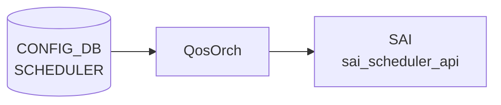

# SCHEDULER テーブル

## 概要

キュー / ポートに適用するスケジューラ（[DWRR](../../reference/glossary.md#term-dwrr) / WRR / STRICT）と dual-rate token bucket policer (CIR / PIR / CBS / PBS) のプロファイルを保持する[^1]。`qosorch` が [SAI](../../reference/glossary.md#term-sai) scheduler を生成、`QUEUE.scheduler` から leafref で参照される。

<!-- cdb-mermaid -->
### データフロー (自動生成)



!!! note "凡例"
    CONFIG_DB から SAI までの典型経路を `docs/reference/config-db-orch-map.md` から機械生成したミニ図。詳細・例外は本ページ本文と対応表を参照。
<!-- /cdb-mermaid -->

## key 構造

```text
SCHEDULER|<name>
```

## フィールド一覧

| フィールド | 型 | 必須 | デフォルト | 説明 |
|-----------|----|------|-----------|------|
| `name` (key) | string | ✅ | - | スケジューラ名 |
| `type` | enum `DWRR`/`WRR`/`STRICT` | - | `WRR` | スケジューリングアルゴリズム |
| `weight` | uint8 (1..100) | - | `1` | 重み（[DWRR](../../reference/glossary.md#term-dwrr)/WRR で使用） |
| `priority` | uint8 (0..9) | - | - | 優先度 |
| `meter_type` | enum `packets`/`bytes` | - | `bytes` | meter 単位 |
| `cir` | uint64 | - | - | committed information rate（Bps or Pps） |
| `pir` | uint64 | - | - | peak information rate。`cir > 0` 必須、`pir >= cir` |
| `cbs` | uint32 | - | - | committed burst size。`cir > 0` 必須 |
| `pbs` | uint32 | - | - | excess/peak burst size。`pir > 0` 必須、`pbs >= cbs` |

## 制約 (must)

- `pir` 単独設定禁止（`cir` 必須・`cir > 0`）
- `pir >= cir`
- `cbs` 単独設定禁止（`cir` 必須）
- `pbs` 単独設定禁止（`pir` 必須）、`pbs >= cbs`

## 購読者

- `qosorch`: [SAI](../../reference/glossary.md#term-sai) scheduler を生成

## 関連 CONFIG_DB / YANG / CLI

- 関連 [CONFIG_DB](../../reference/glossary.md#term-config_db): `QUEUE`、`PORT_QOS_MAP`
- 関連 CLI: なし
- 関連 [YANG](../../reference/glossary.md#term-yang): `sonic-scheduler`

<!-- ref-triangle:start -->

## 関連リファレンス

- [YANG](../../reference/glossary.md#term-yang): [`sonic-scheduler`](../yang/sonic-scheduler.md)

<!-- ref-triangle:end -->

## 引用元

[^1]: [YANG](../../reference/glossary.md#term-yang) 定義: `sonic-scheduler.yang`. <https://github.com/sonic-net/sonic-buildimage/blob/9ea932ec2e18f35e58268ec2e4456b1d4afd65cd/src/sonic-yang-models/yang-models/sonic-scheduler.yang>

<!-- topics-back-ref -->
## 関連 Topics

- [Topics: QoS / Buffer / PFC / Watermark](../../topics/08-qos-buffer/index.md)

<!-- /topics-back-ref -->

<!-- ops-hint -->
## 運用ヒント

### 典型値

- key 形式: `SCHEDULER|<name>` (例 `scheduler.0`)。
- `type`: `STRICT` / `DWRR` / `WRR`。
- `weight`: 1..100。
- `meter_type` / `pir` (shaping 用)。

### よくある誤設定

- `type: STRICT` を全 queue に設定すると低優先 queue が永遠に starve。

### 確認コマンド

```bash
sonic-db-cli CONFIG_DB keys 'SCHEDULER|*'
show queue counters
```
<!-- /ops-hint -->

<!-- value-behavior -->
## 値依存挙動マトリクス

### `type` 値別挙動
| 値 | [SAI](../../reference/glossary.md#term-sai) 変換 | 挙動 |
|----|----------|------|
| `DWRR` | `SAI_SCHEDULING_TYPE_DWRR` | 重み付きデフキュー方式。`weight` フィールドを帯域比率として使用。 |
| `WRR` | `SAI_SCHEDULING_TYPE_WRR` | 重み付きラウンドロビン。`weight` フィールドを使用。 |
| `STRICT` | `SAI_SCHEDULING_TYPE_STRICT` | 厳格優先。weight は無視。上位優先度 queue が常に先処理。全 queue に設定すると低優先が starve。 |
| その他 | なし | `SWSS_LOG_ERROR("Unknown scheduler type value:%s")` → `task_invalid_entry`。エントリ破棄、SAI 非反映。 |

### `meter_type` 値別挙動
| 値 | SAI 変換 | 挙動 |
|----|----------|------|
| `packets` | `SAI_METER_TYPE_PACKETS` | CIR/PIR の単位をパケット数として解釈。 |
| `bytes` | `SAI_METER_TYPE_BYTES` | CIR/PIR の単位をバイト数として解釈（デフォルト）。 |

<!-- /value-behavior -->

<!-- cdb-exceptions -->
## 例外条件・特殊挙動

- **type フィールドが未知の値**: `type` が `DWRR` / `WRR` / `STRICT` 以外の場合 `SWSS_LOG_ERROR("Unknown scheduler type value:%s")` を出して `task_invalid_entry` を返す。エントリは破棄されて SAI には反映されない。[^2]
- **SAI scheduler profile 作成失敗**: `sai_scheduler_api->create_scheduler()` が失敗した場合 `SWSS_LOG_ERROR("Failed to create scheduler profile")` で処理中断。[^2]
- **SAI scheduler profile 削除失敗**: QUEUE から参照されている SCHEDULER プロファイルを削除しようとすると SAI が EBUSY 等を返し `SWSS_LOG_ERROR("Failed to remove scheduler profile")` となる。[CONFIG_DB](../../reference/glossary.md#term-config_db) からは削除されても ASIC には古いプロファイルが残留する。[^2]
- **weight のオーバーフロー**: `weight` フィールドは `uint8` にキャストされるため 0-255 の範囲外は暗黙に切り捨てられる（バリデーションなし）。[^2]
- **QUEUE 参照がある間は削除不可**: QUEUE が参照している SCHEDULER を削除すると SAI レイヤで失敗する。QUEUE の参照を先に外してから削除する必要がある。[^2]

[^2]: qosorch 実装: `sonic-swss/orchagent/qosorch.cpp`. <https://github.com/sonic-net/sonic-swss/blob/master/orchagent/qosorch.cpp>


<!-- failure -->
## 失敗挙動マトリクス (Phase D)

ソース: `sonic-net/sonic-swss/orchagent/qosorch.cpp` `handleSchedulerTable()`

### SET 処理における失敗経路

| 失敗条件 | 検出箇所 | 結果 | ログ出力 |
|---|---|---|---|
| `type` が `DWRR`/`WRR`/`STRICT` 以外の不正値 | `handleSchedulerTable()` L1394 | `task_invalid_entry`。エントリ全体を破棄、[SAI](../../reference/glossary.md#term-sai) 非反映 | `SWSS_LOG_ERROR("Unknown scheduler type value:%s")` |
| `meter_type` が `packets`/`bytes` 以外の不正値 | `handleSchedulerTable()` L1407 | `scheduler_meter_map.at()` が `std::out_of_range` 例外をスロー → **orchagent クラッシュ** | uncaught exception |
| 未知フィールド（例: `priority`）を含む SET | `handleSchedulerTable()` L1434 | `task_invalid_entry`。`type`/`weight`/`meter_type` 等を含む全フィールドが SAI 未反映 | `SWSS_LOG_ERROR("Unknown field:%s")` |
| `weight` に YANG `range "1..100"` 違反の値 | `handleSchedulerTable()` L1401–1404 | `(uint8_t)stoi()` で暗黙キャスト・切り捨て。バリデーションなし、異常値が SAI に渡る | なし |
| SAI `create_scheduler()` 失敗（新規作成時） | `handleSchedulerTable()` L1460–1467 | `handleSaiCreateStatus()` 返り値に従う。`task_success` 以外なら失敗ステータスを返す | `SWSS_LOG_ERROR("Failed to create scheduler profile [%s:%s], rv:%d")` |
| SAI `set_scheduler_attribute()` 失敗（既存更新時） | `handleSchedulerTable()` L1446–1454 | `handleSaiSetStatus()` 返り値に従う | `SWSS_LOG_ERROR("fail to set scheduler attribute, id:%d")` |
| エントリ既存で SAI オブジェクト ID が `SAI_NULL_OBJECT_ID`（内部不整合） | `handleSchedulerTable()` L1362–1366 | `task_invalid_entry` | `SWSS_LOG_ERROR("Error sai_object must exist for key %s")` |
| `m_pendingRemove=true` 状態のエントリへの SET | `handleSchedulerTable()` L1368–1372 | `task_need_retry`。DEL 完了まで SET は保留 | `SWSS_LOG_NOTICE("Entry %s %s is pending remove, need retry")` |

### DEL 処理における失敗経路

| 失敗条件 | 検出箇所 | 結果 | ログ出力 |
|---|---|---|---|
| 存在しないオブジェクトの DEL | `handleSchedulerTable()` L1478–1482 | `task_invalid_entry` | `SWSS_LOG_ERROR("Object with name:%s not found.")` |
| QUEUE 参照中の SCHEDULER を DEL | `handleSchedulerTable()` L1484–1490 | `m_pendingRemove=true` をセット → `task_need_retry`。QUEUE 参照が解除されるまでリトライ | `SWSS_LOG_NOTICE("Can't remove object %s due to being referenced (%s)")` |
| SAI `remove_scheduler()` 失敗 | `handleSchedulerTable()` L1490–1497 | `handleSaiRemoveStatus()` 返り値に従う。[CONFIG_DB](../../reference/glossary.md#term-config_db) からは削除されても ASIC に古いプロファイルが残留する可能性あり | `SWSS_LOG_ERROR("Failed to remove scheduler profile. db name:%s sai object:...")` |

### 補足

- **`priority` フィールドの全破棄**: YANG に `leaf priority` が定義されているが qosorch に対応分岐なし。`priority` を含む SET は **全フィールドが** SAI 未反映になる（partial 適用なし）。
- **`meter_type` クラッシュリスク**: `scheduler_meter_map.at()` は `"packets"`/`"bytes"` 以外で `std::out_of_range` をスロー。orchagent プロセスごとクラッシュするため、直接 `sonic-db-cli` 書き込み時は要注意。
- **`m_pendingRemove` による SET/DEL シリアライズ**: QUEUE 参照がある SCHEDULER に DEL → SET を発行しても DEL がリトライし続け SET も保留される。QUEUE 参照を解除 → DEL 完了 → SET の順を守ること。

<!-- /failure -->

<!-- derivation -->
## 派生・条件付き登録 (Phase 6/7)

### Phase 6: 自動派生

QosOrch が `SCHEDULER.type` の値から SAI scheduling type を自動決定する。`STRICT` → `SAI_SCHEDULING_TYPE_STRICT`、`DWRR` → `SAI_SCHEDULING_TYPE_DWRR`、`WRR` → `SAI_SCHEDULING_TYPE_WRR`。`meter_type` も同様に SAI enum に変換される。

### Phase 7: 条件付き登録 (add_manager 条件)

QosOrch は常時登録し `SCHEDULER` テーブルを無条件購読する。`SCHEDULER` が `QUEUE.scheduler` から参照されている場合のみ SAI キューオブジェクトに scheduler profile が bind される。

<!-- /derivation -->

<!-- handler-branching -->
### Phase 8: Handler メソッド内分岐

| Handler | 分岐条件 | 効果 | evidence |
|---|---|---|---|
| `QosOrch` | `type==STRICT` | `SAI_SCHEDULING_TYPE_STRICT` + weight 属性なし | `qosorch.cpp` |
| `QosOrch` | `type==DWRR` | `SAI_SCHEDULING_TYPE_DWRR` + weight 属性設定 | `qosorch.cpp` |
| `QosOrch` | `type==WRR` | `SAI_SCHEDULING_TYPE_WRR` + weight 属性設定 | `qosorch.cpp` |
| `QosOrch` | `meter_type==bytes` | `SAI_METER_TYPE_BYTES` | `qosorch.cpp` |
| `QosOrch` | `meter_type==packets` | `SAI_METER_TYPE_PACKETS` | `qosorch.cpp` |
| `QosOrch` | `cir` / `cbs` / `pir` / `pbs` フィールドあり | SAI rate/burst 属性を設定 | `qosorch.cpp` |
| `QosOrch` | del_handler | SAI scheduler profile を削除、QUEUE 参照を解除してから削除 | `qosorch.cpp` |

> **スキャン証跡**: `SCHEDULER` は SAI scheduler profile の属性マッピング。`type` フィールドで SAI enum を決定する主要分岐あり。CONFIG_DB 内フィールド間の自動付与はなし。

<!-- /handler-branching -->

<!-- runtime-trace -->
## CDB → 実コンテナ動作トレース

### 段階 1: Consumer 登録

- **orchagent / QosOrch**: `SCHEDULER` テーブルを `SubscriberStateTable` で購読。

### 段階 2: CFG → APPL 翻訳

- QosOrch がスケジューラタイプ (`STRICT`, `WRR`, `DWRR`) と重み/優先度を解析。
- APP_DB への書き込みなし。

### 段階 3: APPL → SAI

- QosOrch が `sai_scheduler_api->create_scheduler()` を呼び出して SAI スケジューラオブジェクトを作成。
- QUEUE テーブルからの参照で各キューに適用。

### 段階 4: タイミング + 副作用

- スケジューラ作成後、QUEUE テーブルが参照するときに即時キューに適用。
- 副作用: STRICT スケジューラが高優先度キューを飽和させると低優先度が枯渇 (starvation)。

<!-- /runtime-trace -->
<!-- entry-points -->
## 書き込み入り口 (Direction A)

SCHEDULER テーブルへの書き込みが発生するコード経路を網羅的に調査した結果。

### CLI

  - `config qos reload` — sonic-cfggen が `files/build_templates/qos_config.j2` を展開し SCHEDULER エントリを生成 (sonic-buildimage/files/build_templates/qos_config.j2)

### minigraph / sonic-cfggen

minigraph.py に SCHEDULER 直接生成なし — `qos_config.j2` テンプレート経由

### REST / gNMI

REST/gNMI 書き込み経路なし

### db_migrator

db_migrator.py での SCHEDULER マイグレーションなし

### ビルド時デフォルト (build-time default)

各プラットフォームの `qos.json.j2` に SCHEDULER エントリが定義され、ビルド時に投入

### ハードコードデフォルト / ランタイム注入

なし

### 死活・デッドコード

なし
<!-- /entry-points -->

<!-- defaults -->
## コード由来のデフォルト・暗黙挙動 (Phase A)

> **調査根拠**: `sonic-swss/orchagent/qosorch.cpp` `handleSchedulerTable()` 全行精読 + `sonic-scheduler.yang` 照合 (2026-05-14)

| フィールド | YANG default | qosorch 実装の実効デフォルト | 備考 |
|-----------|-------------|--------------------------|------|
| `type` | `WRR` | **SAI ベンダー依存** | フィールド省略時 SAI 属性を送信しない。YANG default は CONFIG_DB バリデーション層の宣言であり qosorch は適用しない |
| `weight` | `1` | **SAI ベンダー依存** | 同上。`stoi()+(uint8_t)` キャスト、YANG `range "1..100"` はコード未検証 |
| `priority` | なし | **dead field — エントリ全破棄** | `handleSchedulerTable` に処理分岐なし。`priority` を含む SET は `SWSS_LOG_ERROR("Unknown field:priority")` → `task_invalid_entry` でそのエントリの全フィールドが SAI 未反映になる |
| `meter_type` | `bytes` | **SAI ベンダー依存**（省略時）; 不正値で **orchagent クラッシュ** | `scheduler_meter_map.at()` は `std::out_of_range` 未キャッチ。`type` フィールドの graceful エラーと異なり危険 |
| `cir` / `cbs` / `pir` / `pbs` | なし | 省略時 SAI デフォルト (0 相当) | 存在時のみ設定。YANG `must` 制約 (pir≥cir 等) はコード未検証 |

### dead field 詳細: `priority`

`sonic-scheduler.yang` に `leaf priority { type uint8 { range "0..9"; } }` が定義されているが、`qosorch.h` に対応定数なく `handleSchedulerTable` の if-else チェーン (L1378–1438) にも分岐なし。`priority` フィールドを含む SCHEDULER エントリを CONFIG_DB に SET すると `Unknown field:priority` エラーで `task_invalid_entry` が返り、**そのエントリの type / weight / meter_type 等も含む全フィールドが SAI に反映されない**。回避策: `priority` フィールドを CONFIG_DB から除外する。

### `meter_type` 不正値クラッシュリスク

`"packets"` / `"bytes"` 以外の値を `meter_type` に設定すると `scheduler_meter_map.at()` が `std::out_of_range` 例外をスローし orchagent がクラッシュする。YANG enum で 2 値のみ許可されているため通常経路では発生しないが、直接 CONFIG_DB 書き込み時は要注意。

<!-- /defaults -->

<!-- ordering -->
## 書込み順依存 (Phase B)

### ADD 時: SCHEDULER → QUEUE の順が必須

`QUEUE` エントリの `scheduler` フィールドを書き込む前に、参照先の `SCHEDULER|<name>` エントリが存在していなければならない。`handleQueueTable`（`qosorch.cpp`）は `resolveFieldRefValue` で参照先を解決し、未登録の場合は `task_need_retry` を返してリトライする。SCHEDULER が存在しない間、QUEUE の SAI バインドは完了しない。[^3]

```
SCHEDULER|<name>  →  書く  →  QUEUE|<port>|<idx>  (scheduler フィールドあり)
```

### DEL 時: QUEUE 参照解除 → SCHEDULER 削除の順が必須

QUEUE が参照している SCHEDULER を削除しようとすると、`handleSchedulerTable` の DEL ハンドラが `isObjectBeingReferenced` で参照を検出し `m_pendingRemove = true` にして `task_need_retry` を返す。SAI scheduler profile は QUEUE の参照が解除されるまで削除されない。[^3]

```
QUEUE|<port>|<idx> の scheduler 参照を解除  →  SCHEDULER|<name> を DEL
```

### 再設定時: DEL 完了後に SET

同一 SCHEDULER 名の DEL が `m_pendingRemove` 状態のまま SET を発行すると、SET も `task_need_retry` で保留される。QUEUE 参照の解除 → DEL 完了 → SET の順を守ること。[^3]

### qos_config.j2 による自動担保

`config qos reload` が使用する `qos_config.j2` テンプレートは SCHEDULER ブロック（行 343–383）を QUEUE ブロック（行 508–574）より先に配置するため、CLI 経由の一括適用では順序問題は発生しない。手動で個別エントリを投入する場合のみ上記の順序制約を意識する必要がある。[^3]

[^3]: QosOrch 実装: `sonic-swss/orchagent/qosorch.cpp`. <https://github.com/sonic-net/sonic-swss/blob/master/orchagent/qosorch.cpp>

<!-- /ordering -->

<!-- constants -->
## ハードコード定数 (Phase E)

> **調査根拠**: `sonic-swss/orchagent/qosorch.h` L44-53 + `qosorch.cpp` L75-78, L1378-1494 精読 (2026-05-16)

### type enum 文字列 → SAI 変換

| CONFIG_DB 値 | C++ 定数名 | SAI 属性値 |
|-------------|-----------|-----------|
| `"DWRR"` | `scheduler_algo_DWRR` | `SAI_SCHEDULING_TYPE_DWRR` |
| `"WRR"` | `scheduler_algo_WRR` | `SAI_SCHEDULING_TYPE_WRR` |
| `"STRICT"` | `scheduler_algo_STRICT` | `SAI_SCHEDULING_TYPE_STRICT` |

未知値: `SWSS_LOG_ERROR("Unknown scheduler type value:%s")` → `task_invalid_entry`（エントリ全破棄）。

### weight フィールド

- フィールド名定数: `scheduler_weight_field_name = "weight"`
- SAI 属性: `SAI_SCHEDULER_ATTR_SCHEDULING_WEIGHT`
- `stoi()` + `(uint8_t)` キャスト。YANG `range "1..100"` はコード未検証。範囲外は暗黙切り捨て。

### meter_type enum 文字列 → SAI 変換

| CONFIG_DB 値 | SAI 属性値 |
|-------------|-----------|
| `"packets"` | `SAI_METER_TYPE_PACKETS` |
| `"bytes"` | `SAI_METER_TYPE_BYTES` |

`scheduler_meter_map.at()` で変換（`std::out_of_range` 未キャッチ）。未知値で orchagent クラッシュ。

### bandwidth rate/burst フィールド名 → SAI 属性

| CONFIG_DB フィールド | SAI 属性 | 説明 |
|--------------------|---------|------|
| `cir` | `SAI_SCHEDULER_ATTR_MIN_BANDWIDTH_RATE` | Committed Information Rate |
| `cbs` | `SAI_SCHEDULER_ATTR_MIN_BANDWIDTH_BURST_RATE` | Committed Burst Size |
| `pir` | `SAI_SCHEDULER_ATTR_MAX_BANDWIDTH_RATE` | Peak Information Rate |
| `pbs` | `SAI_SCHEDULER_ATTR_MAX_BANDWIDTH_BURST_RATE` | Peak Burst Size |

各フィールドは存在するときのみ SAI 属性を設定。省略時は SAI ベンダーデフォルト（0 相当）。

<!-- /constants -->

<!-- cross-refs -->
## 暗黙参照テーブル (Phase C)

`SCHEDULER` プロファイルは CONFIG_DB 上では独立したエントリだが、`QosOrch` の
`resolveFieldRefValue` 機構を通じて以下のテーブルから**暗黙的に leafref 参照**される。
YANG leafref として明示されていない参照もコードレベルで強制される。

### SCHEDULER を参照するテーブル (被参照)

| 参照元テーブル | 参照元フィールド | 参照先キー形式 | SAI 効果 | 参照箇所 |
|---|---|---|---|---|
| `QUEUE` | `scheduler` | `SCHEDULER\|<name>` | `SAI_QUEUE_ATTR_SCHEDULER_PROFILE_ID` バインド | `qosorch.cpp:1822-1853` |
| `PORT_QOS_MAP` | `scheduler` | `SCHEDULER\|<name>` | `SAI_PORT_ATTR_QOS_SCHEDULER_PROFILE_ID` バインド | `qosorch.cpp:2124-2133` |

### 解決タイミングと retry 挙動

- `QUEUE.scheduler` または `PORT_QOS_MAP.scheduler` が SET された時点で `SCHEDULER|<name>` が
  未存在の場合、`task_need_retry` が返され参照が解決されるまで SAI バインドは保留される。
- 参照が解決された後、`setObjectReference()` で参照カウントが増加し、被参照中の SCHEDULER は
  DEL ハンドラで削除保留 (`m_pendingRemove = true`) となる。

### WRED_PROFILE との連携

- `QUEUE` は `scheduler` と `wred_profile` フィールドを並列に解決する (`qosorch.cpp:1857-1886`)。
  SCHEDULER (帯域制御) と WRED_PROFILE (ドロップ確率制御) は互いに独立だが、同一 QUEUE に
  同時適用することで帯域制御と輻輳回避を組み合わせることができる。
- SCHEDULER と WRED_PROFILE の間に直接の参照関係はない。

### 削除順序制約

```
QUEUE の scheduler / PORT_QOS_MAP の scheduler 参照を解除
  ↓
SCHEDULER|<name> を DEL
```

参照が残っている間は SAI レベルで EBUSY となり `Failed to remove scheduler profile` エラーが発生する。
<!-- /cross-refs -->

<!-- side-effects -->
## 副次 DB 書込 (Phase F)

> **調査根拠**: `sonic-swss/orchagent/qosorch.cpp` `handleSchedulerTable()` / `applySchedulerToQueueSchedulerGroup()` / `handleQueueTable()` 精読 (2026-05-16)

APPL_DB / STATE_DB / COUNTERS_DB / FLEX_COUNTER_DB への直接書き込みは **一切なし**。
副次 DB 書き込みは SAI API 経由の ASIC_DB のみ。

### ASIC_DB 書き込み

| ASIC_DB テーブル | 属性 | トリガ | evidence |
|----------------|------|--------|---------|
| `ASIC_STATE:SAI_OBJECT_TYPE_SCHEDULER:<oid>` | スケジューラ全属性 (type / weight / meter_type / cir / cbs / pir / pbs) | `handleSchedulerTable` SET で `sai_scheduler_api->create_scheduler()` または `set_scheduler_attribute()` | `qosorch.cpp:L1460, L1446` |
| `ASIC_STATE:SAI_OBJECT_TYPE_SCHEDULER:<oid>` | — (削除) | `handleSchedulerTable` DEL で `sai_scheduler_api->remove_scheduler()` | `qosorch.cpp:L1490` |
| `ASIC_STATE:SAI_OBJECT_TYPE_SCHEDULER_GROUP:<group_oid>` | `SAI_SCHEDULER_GROUP_ATTR_SCHEDULER_PROFILE_ID` | QUEUE が当該 SCHEDULER を `scheduler` フィールドで参照するとき `applySchedulerToQueueSchedulerGroup()` が呼ばれ scheduler_group 属性を更新 | `qosorch.cpp:L1690` |

### SCHEDULER → QUEUE 副次バインド経路

```
SCHEDULER SET
  └─ sai_scheduler_api->create_scheduler()  → ASIC_DB: SCHEDULER OID 生成
       ↓ (QUEUE.scheduler フィールドが参照)
  QUEUE handleQueueTable()
    └─ applySchedulerToQueueSchedulerGroup(port, queue_ind, scheduler_profile_id)
         └─ getSchedulerGroup(port, queue_id)  ← SAI_PORT_ATTR_QOS_SCHEDULER_GROUP_LIST 探索
              └─ sai_scheduler_group_api->set_scheduler_group_attribute()
                   → ASIC_DB: SCHEDULER_GROUP の SCHEDULER_PROFILE_ID 更新
```

- **voq モード例外**: `gMySwitchType == "voq"` かつ `SAI_SYSTEM_PORT_TYPE_REMOTE` の場合は `applySchedulerToQueueSchedulerGroup` が早期 return し ASIC 書き込みをスキップする。
- **DEL 時**: QUEUE 参照が解除されてから `remove_scheduler()` が呼ばれる（`isObjectBeingReferenced` で保護）。QUEUE DEL 時は `scheduler_profile_id = SAI_NULL_OBJECT_ID` を渡してバインドを解除。

<!-- /side-effects -->

<!-- pubsub -->
## 通信メカニズム (Phase G)

### Redis 購読方式

`QosOrch` は `SCHEDULER` テーブルを **`swss::SubscriberStateTable`** で購読する。

`Orch::addConsumer()` は接続先 DB の ID で購読方式を自動選択する (`orch.cpp:1186-1196`)。`QosOrch` は `m_configDb`（CONFIG_DB、dbId=4）に接続するため、`CONFIG_DB || STATE_DB || CHASSIS_APP_DB` の分岐に入り `SubscriberStateTable` が割り当てられる。APPL_DB の `ConsumerStateTable` とは異なる方式で、Redis keyspace 通知は使わない。

```cpp
// sonic-swss/orchagent/orch.cpp:1186-1196
void Orch::addConsumer(DBConnector *db, string tableName, int pri)
{
    if (db->getDbId() == CONFIG_DB || db->getDbId() == STATE_DB || db->getDbId() == CHASSIS_APP_DB)
        addExecutor(new Consumer(new SubscriberStateTable(db, tableName,
            TableConsumable::DEFAULT_POP_BATCH_SIZE, pri), this, tableName));
    else
        addExecutor(new Consumer(new ConsumerStateTable(db, tableName, gBatchSize, pri), this, tableName));
}
```

書き込み側（`sonic-cfggen` / CLI `config qos reload`）は swsscommon `ConfigDBConnector.set()` を経由して CONFIG_DB に HSET し、同時に内部チャンネル `SCHEDULER_CHANNEL@4` へ `"G"` を PUBLISH する。`SubscriberStateTable` がそのチャンネルを SUBSCRIBE し、通知を受けたら `pops()` で変更エントリを取り出す。

### QosOrch 初期化経路

```cpp
// sonic-swss/orchagent/orchdaemon.cpp:367-384
vector<string> qos_tables = {
    CFG_TC_TO_QUEUE_MAP_TABLE_NAME,
    CFG_SCHEDULER_TABLE_NAME,   // "SCHEDULER"
    // ... 他 QoS テーブル
};
gQosOrch = new QosOrch(m_configDb, qos_tables);
```

`QosOrch` は `Orch(db, tableNames)` を継承し、コンストラクタが `tableNames` をイテレートして各テーブルに `addConsumer()` を呼ぶ。`SCHEDULER` を含む全 QoS テーブルが一括登録される。

### 購読テーブル一覧

| 購読者 | 購読 API | 購読 DB / チャンネル | バッチサイズ |
|--------|---------|---------------------|------------|
| `orchagent` (`QosOrch`) | `swss::SubscriberStateTable` | `CONFIG_DB` / `SCHEDULER_CHANNEL@4` | `DEFAULT_POP_BATCH_SIZE` |

### doTask(Consumer&) フロー

```
config qos reload / sonic-cfggen (producer)
  ↓ ConfigDBConnector.set("SCHEDULER|<name>", {type, weight, ...})
CONFIG_DB: HSET "SCHEDULER|<name>" type=DWRR weight=15 ...
  ↓ Redis PUBLISH "SCHEDULER_CHANNEL@4" "G"
OrchDaemon main loop: m_select->select(&s, SELECT_TIMEOUT=1000ms)
  ↓ Consumer::execute() → SubscriberStateTable::pops()
QosOrch::doTask(Consumer&)            (qosorch.cpp:2254)
  ├─ allPortsReady() == false → 即 return（全ポート初期化待ち）
  └─ allPortsReady() == true
       └─ m_qos_handler_map["SCHEDULER"] → handleSchedulerTable(consumer, tuple)
            ├─ SET: SAI scheduler profile 作成 / 更新
            │    └─ sai_scheduler_api->create_scheduler() または set_scheduler_attribute()
            │         → ASIC_DB: ASIC_STATE:SAI_OBJECT_TYPE_SCHEDULER:<oid>
            └─ DEL: SAI scheduler profile 削除
                 └─ sai_scheduler_api->remove_scheduler()
                      → ASIC_DB: 削除（参照中は m_pendingRemove で保留）
```

### 非同期性・タイミング

- `m_select->select()` のタイムアウトは 1000ms。CONFIG_DB 書き込みから SAI 反映まで最大約 1 秒の遅延が生じうる。
- `allPortsReady()` が `false` の間（起動直後のポート初期化フェーズ）は `doTask` が早期 return するため、全ポートが Ready になるまで SCHEDULER エントリの処理は保留される。
- QUEUE 参照がある SCHEDULER への DEL は `task_need_retry` で保留され、QUEUE 参照解除まで SAI 削除は実行されない。

詳細は `meta/_intermediate/cdb-flow/scheduler-pubsub.md` を参照。
<!-- /pubsub -->

<!-- platform -->
## プラットフォーム差異 (Phase H)

> **調査根拠**: `sonic-net/sonic-swss/orchagent/qosorch.cpp` `applySchedulerToQueueSchedulerGroup()` / `handleQueueTable()` 精読 (2026-05-16)

### VOQ シャーシ構成

`applySchedulerToQueueSchedulerGroup()` に `gMySwitchType == "voq"` 分岐が存在する。

| ポート種別 | 挙動 |
|-----------|------|
| リモートシステムポート (`SAI_SYSTEM_PORT_TYPE_REMOTE`) | `applySchedulerToQueueSchedulerGroup` が即時 `true` を返して SAI 書き込みをスキップ。SCHEDULER オブジェクト自体は作成済みだが、リモートポートのキューには bind されない |
| ローカルシステムポート | `port.m_system_port_info.local_port_oid` でローカル物理ポートを解決し、`m_queue_ids[queue_ind]` からキュー OID を取得。標準パスと同じ SAI 処理を実行 |

**QUEUE キー形式の違い**: VOQ モードでは `QUEUE` テーブルのキーが 4 トークン（`<hostname>|<ASIC_NAME>|<port>|<index_range>`）必須。SCHEDULER 自体の挙動は変わらないが、QUEUE からの参照が成立するための前提条件が異なる。

### SmartSwitch / DPU

`qosorch.cpp` に SmartSwitch / DPU 固有の分岐は**存在しない**。NPU / DPU 問わず同一コードパスを辿る。

### ベンダー ASIC 差異（SAI 抽象化）

`handleSchedulerTable()` はベンダー固有の条件分岐を持たず、SAI API を通じて差異を吸収する。ただし以下の点でベンダー依存の挙動がある。

| 項目 | ベンダー依存度 | 備考 |
|------|-------------|------|
| フィールド省略時のデフォルト動作 | 高 | `type` / `weight` / `meter_type` を省略すると SAI 属性を送信しない。ベンダーの SAI デフォルト値が適用される（保証なし） |
| `DWRR` サポート | 中 | `SAI_SCHEDULING_TYPE_DWRR` 非対応の ASIC では `handleSaiCreateStatus` 経由でエラー処理 |
| `weight` 有効範囲 | 低 | YANG は 1..100 だが SAI は 0-255 を受け入れるベンダーもある |
| CIR/PIR の `meter_type` | 低 | `SAI_METER_TYPE_PACKETS` / `SAI_METER_TYPE_BYTES` は SAI 標準で安定 |

[^4]: Platform 分岐証跡: `sonic-swss/orchagent/qosorch.cpp` L1631–1710, L1772–1812. <https://github.com/sonic-net/sonic-swss/blob/master/orchagent/qosorch.cpp>

<!-- /platform -->

<!-- glossary-links-injected: 96667c52d98d -->
