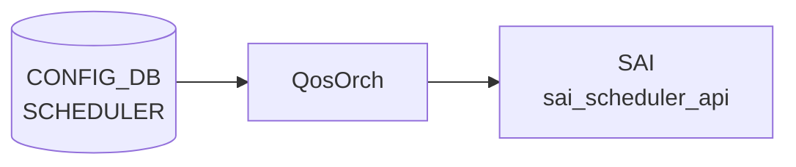

# SCHEDULER テーブル

## 概要

キュー / ポートに適用するスケジューラ（[DWRR](../../reference/glossary.md#term-dwrr) / WRR / STRICT）と dual-rate token bucket policer (CIR / PIR / CBS / PBS) のプロファイルを保持する[^1]。`qosorch` が [SAI](../../reference/glossary.md#term-sai) scheduler を生成、`QUEUE.scheduler` から leafref で参照される。

<!-- cdb-mermaid -->
### データフロー (自動生成)



!!! note "凡例"
    CONFIG_DB から SAI までの典型経路を `docs/reference/config-db-orch-map.md` から機械生成したミニ図。詳細・例外は本ページ本文と対応表を参照。
<!-- /cdb-mermaid -->

## key 構造

```text
SCHEDULER|<name>
```

## フィールド一覧

| フィールド | 型 | 必須 | デフォルト | 説明 |
|-----------|----|------|-----------|------|
| `name` (key) | string | ✅ | - | スケジューラ名 |
| `type` | enum `DWRR`/`WRR`/`STRICT` | - | `WRR` | スケジューリングアルゴリズム |
| `weight` | uint8 (1..100) | - | `1` | 重み（[DWRR](../../reference/glossary.md#term-dwrr)/WRR で使用） |
| `priority` | uint8 (0..9) | - | - | 優先度 |
| `meter_type` | enum `packets`/`bytes` | - | `bytes` | meter 単位 |
| `cir` | uint64 | - | - | committed information rate（Bps or Pps） |
| `pir` | uint64 | - | - | peak information rate。`cir > 0` 必須、`pir >= cir` |
| `cbs` | uint32 | - | - | committed burst size。`cir > 0` 必須 |
| `pbs` | uint32 | - | - | excess/peak burst size。`pir > 0` 必須、`pbs >= cbs` |

## 制約 (must)

- `pir` 単独設定禁止（`cir` 必須・`cir > 0`）
- `pir >= cir`
- `cbs` 単独設定禁止（`cir` 必須）
- `pbs` 単独設定禁止（`pir` 必須）、`pbs >= cbs`

## 購読者

- `qosorch`: [SAI](../../reference/glossary.md#term-sai) scheduler を生成

## 関連 CONFIG_DB / YANG / CLI

- 関連 [CONFIG_DB](../../reference/glossary.md#term-config_db): `QUEUE`、`PORT_QOS_MAP`
- 関連 CLI: なし
- 関連 [YANG](../../reference/glossary.md#term-yang): `sonic-scheduler`

<!-- ref-triangle:start -->

## 関連リファレンス

- [YANG](../../reference/glossary.md#term-yang): [`sonic-scheduler`](../yang/sonic-scheduler.md)

<!-- ref-triangle:end -->

## 引用元

[^1]: [YANG](../../reference/glossary.md#term-yang) 定義: `sonic-scheduler.yang`. <https://github.com/sonic-net/sonic-buildimage/blob/9ea932ec2e18f35e58268ec2e4456b1d4afd65cd/src/sonic-yang-models/yang-models/sonic-scheduler.yang>

<!-- topics-back-ref -->
## 関連 Topics

- [Topics: QoS / Buffer / PFC / Watermark](../../topics/08-qos-buffer/index.md)

<!-- /topics-back-ref -->

<!-- ops-hint -->
## 運用ヒント

### 典型値

- key 形式: `SCHEDULER|<name>` (例 `scheduler.0`)。
- `type`: `STRICT` / `DWRR` / `WRR`。
- `weight`: 1..100。
- `meter_type` / `pir` (shaping 用)。

### よくある誤設定

- `type: STRICT` を全 queue に設定すると低優先 queue が永遠に starve。

### 確認コマンド

```bash
sonic-db-cli CONFIG_DB keys 'SCHEDULER|*'
show queue counters
```
<!-- /ops-hint -->

<!-- glossary-links-injected: 3bdddda32f9d -->
