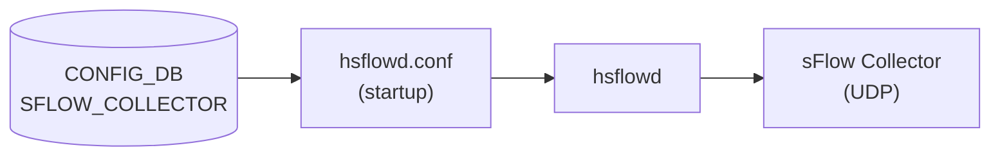

# SFLOW_COLLECTOR テーブル

## 概要

sFlow コレクタ宛先 (IP アドレス / UDP ポート / VRF) を定義するテーブル。最大 2 エントリ (`max-elements 2`) まで登録可能。`hsflowd` (sflowd container) が `/etc/hsflowd.conf` を介して参照し、収集したサンプルを UDP で転送する[^1]。

<!-- cdb-mermaid -->
### データフロー (自動生成)



!!! note "凡例"
    CONFIG_DB から sFlow コレクタまでの経路。詳細は本ページ本文を参照。
<!-- /cdb-mermaid -->

## key / 構造

```text
SFLOW_COLLECTOR|<name>   # コレクタ名 (1..64 文字)
```

## フィールド

| フィールド | 型 | 既定 | 必須 | 説明 |
|-----------|----|------|------|------|
| `collector_ip` | ip-address | - | yes | コレクタの IPv4 / IPv6 アドレス |
| `collector_port` | inet:port-number | 6343 | no | コレクタへの UDP 宛先ポート |
| `collector_vrf` | `mgmt`/`default` | - | no | コレクタへ到達する [VRF](../../reference/glossary.md#term-vrf) |

- `collector_vrf = 'mgmt'`: `MGMT_VRF_CONFIG.vrf_global.mgmtVrfEnabled = 'true'` のときのみ YANG `must` 制約で許容。
- `collector_vrf` 未指定: デフォルト VRF を使用。
- 最大 2 コレクタ (`max-elements 2`)。CLI も 2 エントリ上限をチェック (`config/main.py:9354`)。

## 購読者

**注意**: 現在の sflowmgrd (C++) は SFLOW_COLLECTOR テーブルを直接購読しない (`sflowmgrd.cpp` の TableConnector リストに SFLOW_COLLECTOR なし)。HLD では「sflowmgrd が SFLOW_COLLECTOR を監視して `/etc/hsflowd.conf` を更新する」と記述されているが、実装では直接購読はない。コレクタ設定は hsflowd の起動時に `/etc/hsflowd.conf` として読み込まれる[^2]。

- `hsflowd` (sflowd container): 起動時に CONFIG_DB の SFLOW_COLLECTOR エントリから生成された設定ファイルを読み込み、UDP ソケットを開く。

## 関連 CONFIG_DB / YANG / CLI

- 関連 [CONFIG_DB](../../reference/glossary.md#term-config_db): `SFLOW`（グローバル制御・hsflowd 起動）、`MGMT_VRF_CONFIG`（`mgmt` VRF 有効化）
- 関連 CLI: `config sflow collector add/del`
- 関連 [YANG](../../reference/glossary.md#term-yang): `sonic-sflow` (SFLOW_COLLECTOR container)

<!-- ref-triangle:start -->

## 関連リファレンス

- [CONFIG_DB](../../reference/glossary.md#term-config_db): [`SFLOW`](sflow.md)
- [YANG](../../reference/glossary.md#term-yang): [`sonic-sflow`](../yang/sonic-sflow.md)
- CLI: [`config sflow`](../cli/config-sflow.md)

<!-- ref-triangle:end -->

## 引用元

[^1]: [YANG](../../reference/glossary.md#term-yang) 定義: `sonic-sflow.yang`. <https://github.com/sonic-net/sonic-buildimage/blob/9ea932ec2e18f35e58268ec2e4456b1d4afd65cd/src/sonic-yang-models/yang-models/sonic-sflow.yang>

[^2]: sflowmgrd 実装: `sonic-swss/cfgmgr/sflowmgr.cpp`, `sflowmgrd.cpp`. <https://github.com/sonic-net/sonic-swss/blob/master/cfgmgr/sflowmgrd.cpp>

<!-- topics-back-ref -->
## 関連 Topics

- [Topics: Telemetry / SNMP / Observability](../../topics/09-telemetry-snmp/index.md)

<!-- /topics-back-ref -->

<!-- ordering -->
## 書込み順依存 (Phase B)

SFLOW_COLLECTOR テーブルを CONFIG_DB へ書き込む際の **必須・推奨順序** を実装コードから導出した。

> **調査根拠**: `sonic-swss/cfgmgr/sflowmgr.cpp`, `sflowmgrd.cpp` 全行精読 + `sonic-utilities/config/main.py` sflow 周辺 + `sonic-sflow.yang` 精読 (2026-05-17)
> 詳細証跡: `meta/_intermediate/cdb-flow/sflow-collector-ordering.md`

### O1: `MGMT_VRF_CONFIG|vrf_global` → `SFLOW_COLLECTOR` (条件付き必須)

`sonic-sflow.yang:86-88`: `collector_vrf = 'mgmt'` を指定する場合、`MGMT_VRF_CONFIG.vrf_global.mgmtVrfEnabled = 'true'` が先行必須。YANG `must` 制約が違反時に `"Must condition not satisfied. Try enable Management VRF."` エラーを返す。`collector_vrf = 'default'` または未指定の場合、この制約は不要。

```
MGMT_VRF_CONFIG|vrf_global (mgmtVrfEnabled=true)  →  SFLOW_COLLECTOR|<name> (collector_vrf=mgmt)
```

### O2: コレクタ上限 (最大 2 エントリ)

`config/main.py:9352-9355`: CLI が `SFLOW_COLLECTOR` テーブルのエントリ数をチェックし、2 つ既存かつ新規名の場合に書き込みを拒否する (`"Only 2 collectors can be configured, please delete one"`)。YANG `max-elements 2` でも同様の制限あり。3 つ目のコレクタ追加前に既存エントリを削除必須。

### O3: `SFLOW|global (admin_state=up)` → コレクタ変更の実効 (推奨)

`sflowmgr.cpp:457-459`: sflowmgrd は `SFLOW.admin_state` 変更時に `sflowHandleService(enable)` を呼び `service hsflowd restart/stop` を実行する。SFLOW_COLLECTOR の変更は sflowmgrd の購読外であるため、コレクタ追加・変更・削除後に hsflowd を再起動しなければ反映されない。SFLOW global admin_state のトグル (down→up) が最も確実な再起動トリガーとなる。

```
SFLOW_COLLECTOR|<name>  SET  →  (hsflowd 再起動) → 反映
```

### 推奨書込み順序（総合）

```
1. MGMT_VRF_CONFIG|vrf_global    (mgmtVrfEnabled=true, mgmt VRF 使用時のみ)
2. SFLOW_COLLECTOR|<name>        (collector_ip / collector_port / collector_vrf)
3. SFLOW|global (admin_state=up) (hsflowd 起動 → /etc/hsflowd.conf 読込み)
```

ステップ 1 なしに `collector_vrf=mgmt` を書くと YANG バリデーションエラー。
ステップ 3 (hsflowd 起動) より前にコレクタを書いた場合、hsflowd が /etc/hsflowd.conf を読み込む際に反映される。既に hsflowd が稼働中のときは再起動が必要。

<!-- /ordering -->

<!-- cross-refs -->
## 暗黙参照（テーブル間依存）(Phase C)

SFLOW_COLLECTOR テーブルを処理する際に暗黙的に依存するテーブル・コンポーネントを実装コードから導出した。

> **調査根拠**: `sonic-swss/cfgmgr/sflowmgrd.cpp`, `sflowmgr.cpp`, `sonic-buildimage/src/sonic-yang-models/yang-models/sonic-sflow.yang`, `sonic-utilities/config/main.py` 全行精読 (2026-05-17)  
> 詳細証跡: `meta/_intermediate/cdb-flow/sflow-collector-cross-refs.md`

### MGMT_VRF_CONFIG（`collector_vrf = 'mgmt'` 時の必須依存）

`sonic-sflow.yang:86-88`: `collector_vrf` フィールドに `'mgmt'` を指定する場合、YANG `must` 制約により `MGMT_VRF_CONFIG|vrf_global.mgmtVrfEnabled = 'true'` が必須。この制約は YANG バリデーション時に評価され、`ValidatedConfigDBConnector` 経由の書き込み（`config sflow collector add --vrf mgmt`）で検査される。違反時のエラーメッセージ: `"Must condition not satisfied. Try enable Management VRF."`。

```
MGMT_VRF_CONFIG|vrf_global (mgmtVrfEnabled=true) ←── 必須参照 ── SFLOW_COLLECTOR|<name> (collector_vrf=mgmt)
```

`collector_vrf = 'default'` または未指定の場合はこの依存なし。

### SFLOW（グローバル有効化 — 実効化の間接依存）

`sflowmgr.cpp:456-459`: sflowmgrd は `SFLOW|global.admin_state` の変化を検出すると `sflowHandleService(enable)` を呼び `service hsflowd restart/stop` を実行する。SFLOW_COLLECTOR の変更は sflowmgrd の購読対象外であるため、コレクタ追加・変更・削除の実効化には hsflowd 再起動が必要。`SFLOW|global` の admin_state トグルがそのトリガとなる。

### sflowmgrd — SFLOW_COLLECTOR を購読しない（重要な非依存）

`sflowmgrd.cpp:31-41`: sflowmgrd の TableConnector リストは `PORT`・`STATE_DB PORT`・`SFLOW`・`SFLOW_SESSION` の 4 テーブルのみ。`SFLOW_COLLECTOR` は含まれない。コレクタ設定は hsflowd 起動時に `/etc/hsflowd.conf` として読み込まれ、hsflowd が稼働中は動的変更を検知しない。

| 参照先 | 参照種別 | 条件 | コード箇所 |
|--------|---------|------|-----------|
| `MGMT_VRF_CONFIG\|vrf_global` | YANG must 制約（必須） | `collector_vrf = 'mgmt'` のとき | `sonic-sflow.yang:86-88` |
| `SFLOW\|global` | 間接依存（hsflowd 再起動トリガ） | SFLOW_COLLECTOR 変更の実効化 | `sflowmgr.cpp:456-459` |
| `sflowmgrd` | 非購読（購読対象外） | SFLOW_COLLECTOR は TableConnector 外 | `sflowmgrd.cpp:36-41` |

<!-- /cross-refs -->

<!-- failure -->
## 失敗挙動マトリクス (Phase D)

> **調査根拠**: `sonic-swss/cfgmgr/sflowmgr.cpp`, `sflowmgrd.cpp`, `sonic-buildimage/src/sonic-yang-models/yang-models/sonic-sflow.yang`, `sonic-utilities/config/main.py`, `sonic-mgmt-common/translib/transformer/xfmr_sflow.go` 全行精読 (2026-05-17)  
> 詳細証跡: `meta/_intermediate/cdb-flow/sflow-collector-failure.md`

### SET 処理における失敗経路

| ID | 失敗条件 | 検出層 | 結果 | エラーメッセージ |
|----|---------|-------|------|----------------|
| F1 | `collector_vrf='mgmt'` + `MGMT_VRF_CONFIG.vrf_global.mgmtVrfEnabled` が `'true'` でない | YANG `must` 制約 (`sonic-sflow.yang:86-88`) | CONFIG_DB 書き込み拒否 | `"Must condition not satisfied. Try enable Management VRF."` |
| F2 | コレクタ名が 16 文字超え | CLI `is_valid_collector_info()` (`config/main.py:9316`) | CLI 拒否・CONFIG_DB 書き込みなし (YANG は 64 文字まで許容: CLI/YANG 不整合) | `"Collector name must not exceed 16 characters"` |
| F3 | 3 件目以降のコレクタ追加 (既存 2 件 + 新規名) | CLI (`config/main.py:9352-9355`) + YANG `max-elements 2` | 書き込み拒否 | `"Only 2 collectors can be configured, please delete one"` |
| F4 | 無効な IP アドレス | CLI + YANG `inet:ip-address` 型 | CLI 拒否 | `"Invalid IP address"` |
| F5 | `mgmt`/`default` 以外の VRF 名 | CLI (`config/main.py:9325-9327`) + YANG `pattern "mgmt\|default"` | CLI 拒否 | `"Only 'default' and 'mgmt' VRF are supported"` |

### DEL 処理における失敗経路

| ID | 失敗条件 | 検出層 | 結果 |
|----|---------|-------|------|
| F6 | 存在しないコレクタ名を指定した DEL (`ADHOC_VALIDATION=True` 時のみ) | CLI (`config/main.py:9374-9378`) | 警告表示・Redis では存在しないキーへの DEL が silent no-op |

### hsflowd サービス起動失敗

| ID | 失敗条件 | 検出箇所 | 結果 | ログ |
|----|---------|---------|------|------|
| F7 | `service hsflowd restart` / `service hsflowd stop` が非ゼロ終了 | `sflowmgr.cpp:67-70` | `SWSS_LOG_ERROR` のみ・例外なし・CONFIG_DB と hsflowd 稼働状態が乖離 | `"Command '%s' failed with rc %d"` |

**重要**: sflowmgrd は SFLOW_COLLECTOR テーブルを購読していない (`sflowmgrd.cpp:36-41`)。コレクタ追加・変更後に hsflowd が自動で再起動されないため、変更はコールド再起動 (`service hsflowd restart`) まで反映されない。F7 はその再起動も失敗するケース。

### REST/gNMI 経由の失敗経路

| ID | 失敗条件 | 検出箇所 | 結果 |
|----|---------|---------|------|
| F8 | REST/gNMI で `/collectors/collector/config` サブツリーへの DELETE | `xfmr_sflow.go:283-284` | `"Delete operation not supported for this xpath"` エラーを返す。`/collectors/collector` レベルで DELETE する必要あり |

<!-- /failure -->

<!-- constants -->
## ハードコード定数 (Phase E)

`SFLOW_COLLECTOR` テーブルに関連するハードコード定数を YANG モデルおよびソースコードから抽出した。

> **調査根拠**: `sonic-buildimage/src/sonic-yang-models/yang-models/sonic-sflow.yang`, `sonic-utilities/config/main.py` 全行精読 (2026-05-17)
> 詳細証跡: `meta/_intermediate/cdb-flow/sflow-collector-constants.md`

### YANG 由来の定数

| 定数 | 値 | 用途 | ソース |
|------|----|------|--------|
| `collector_port` デフォルト | `6343` (UDP) | IANA 割当 sFlow UDP ポート。省略時の宛先ポート | `sonic-sflow.yang` L81: `default 6343` |
| コレクタ最大数 | `2` | YANG `max-elements 2`。3 件目追加は YANG バリデーション拒否 | `sonic-sflow.yang` SFLOW_COLLECTOR_LIST |
| `collector_vrf` 許容値 | `"mgmt"` または `"default"` | VRF 指定は 2 値のみ (`pattern "mgmt\|default"`) | `sonic-sflow.yang` L91 |
| コレクタ名最大長 (YANG) | 64 文字 | `length 1..64` で YANG バリデーション | `sonic-sflow.yang` SFLOW_COLLECTOR_LIST.name |

### CLI 由来の定数 (sonic-utilities)

| 定数 | 値 | 用途 | ソース |
|------|----|------|--------|
| コレクタ名最大長 (CLI) | **16 文字** | `is_valid_collector_info()` のハードコード上限。YANG (64 文字) より厳しい | `config/main.py:9315` |
| `collector_port` CLI デフォルト | `6343` | Click `--port` オプションのデフォルト値。YANG と一致 | `config/main.py:9337` |
| `collector_vrf` CLI デフォルト | `"default"` | Click `--vrf` オプションのデフォルト値 | `config/main.py:9340` |
| コレクタ最大数 (CLI チェック) | `2` | `len(collector_tbl) == 2` で追加を拒否 | `config/main.py:9354` |

### CLI / YANG 不整合（注意事項）

| 項目 | CLI 上限 | YANG 上限 | 実効値 |
|------|---------|---------|--------|
| コレクタ名最大長 | 16 文字 | 64 文字 | CLI 経由は 16 文字制限。直接 ConfigDB 書き込みは 64 文字まで可 |

<!-- /constants -->

<!-- side-effects -->
## 副作用・波及変更 (Phase F)

`SFLOW_COLLECTOR` テーブルへの書き込み・削除が引き起こす downstream への副作用を実装コードから導出した。

> **調査根拠**: `sonic-swss/cfgmgr/sflowmgr.cpp`, `sflowmgrd.cpp`, `sonic-utilities/config/main.py`, `sonic-utilities/show/sflow.py`, `sonic-mgmt-common/translib/transformer/xfmr_sflow.go` 全行精読 (2026-05-17)
> 詳細証跡: `meta/_intermediate/cdb-flow/sflow-collector-side-effects.md`

### SE1: 直接副作用 — CONFIG_DB 書き込みのみ（即時・非同期なし）

`config sflow collector add` は `config_db.mod_entry('SFLOW_COLLECTOR', name, {...})` を呼ぶだけで、CONFIG_DB へのエントリ書き込み以外の即時副作用はない (`config/main.py:9358-9363`)。`sflowmgrd` は `SFLOW_COLLECTOR` テーブルを購読していないため (`sflowmgrd.cpp:36-41`)、書き込み直後に downstream プロセスは何も起動しない。

### SE2: 間接副作用 — hsflowd 設定ファイル再生成 + プロセス再起動（遅延）

SFLOW_COLLECTOR の変更が hsflowd に届くまでの経路:

```
SFLOW_COLLECTOR|<name> SET/DEL  →  (sflowmgrd 非購読 → 即時反映なし)
   ↓ 後続操作が必要
SFLOW|global admin_state トグル (down→up)
   ↓  sflowmgr.cpp:456-459
sflowHandleService(enable=true)
   ↓
service hsflowd restart  →  /etc/hsflowd.conf 再読込み  →  新コレクタ設定が有効化
```

`sflowmgr.cpp:60` の `cmd << "service hsflowd restart"` がトリガーとなる唯一の経路であり、SFLOW_COLLECTOR の変更単体ではトリガーされない。

### SE3: APPL_DB への波及なし

SFLOW_COLLECTOR テーブルのエントリは APPL_DB に複製されない。APPL_DB への sFlow 書き込みは `SFLOW|global` および `SFLOW_SESSION` の変化時に `m_appSflowTable.set()` / `m_appSflowSessionTable.set()` を通じて発生するが、SFLOW_COLLECTOR は対象外 (`sflowmgr.cpp:468` の `m_appSflowTable.set` は `CFG_SFLOW_TABLE_NAME` ハンドラのみ)。

### SE4: gNMI/REST 経由の制約

`xfmr_sflow.go:282-285`: REST/gNMI で `/collectors/collector/config` サブパスへの DELETE は拒否される。`/collectors/collector` レベルでの DELETE のみ許容。また、gNMI 経由で書き込む際のキー形式は `<ip>_<port>_<vrf>` の自動生成であり (`makeColKey()`)、CLI の任意 `name` とは異なる。

### 副作用マトリクス

| 操作 | CONFIG_DB | APPL_DB | hsflowd プロセス | 備考 |
|------|-----------|---------|-----------------|------|
| SET (CLI / gNMI) | 書き込み | 変化なし | 変化なし | hsflowd 再起動まで未反映 |
| DEL (CLI / gNMI `/collector`) | 削除 | 変化なし | 変化なし | hsflowd 再起動まで未反映 |
| DEL (gNMI `/collector/config`) | エラー返却 | 変化なし | 変化なし | `"Delete operation not supported"` |
| `SFLOW\|global` admin_state up (後続) | 変化なし | `SFLOW_TABLE` 更新 | restart → conf 再読込 | SE2 のトリガー |

<!-- /side-effects -->

<!-- pubsub -->
## 通信メカニズム (Phase G)

### Redis 購読方式

`SFLOW_COLLECTOR` テーブルを購読するプロセスは **存在しない**。`sflowmgrd.cpp:31-41` の `TableConnector` リストは `PORT`（CONFIG_DB）・`PORT_TABLE`（STATE_DB）・`SFLOW`・`SFLOW_SESSION` の 4 テーブルのみで、`SFLOW_COLLECTOR` は含まれない。

| TableConnector | DB | 購読 API | 通知方式 |
|---------------|----|---------|---------|
| `CFG_PORT_TABLE_NAME` | CONFIG_DB | `swss::SubscriberStateTable` | keyspace 通知 `__keyspace@4__:PORT\|*` |
| `STATE_PORT_TABLE_NAME` | STATE_DB | `swss::SubscriberStateTable` | keyspace 通知 `__keyspace@6__:PORT_TABLE\|*` |
| `CFG_SFLOW_TABLE_NAME` | CONFIG_DB | `swss::SubscriberStateTable` | keyspace 通知 `__keyspace@4__:SFLOW\|*` |
| `CFG_SFLOW_SESSION_TABLE_NAME` | CONFIG_DB | `swss::SubscriberStateTable` | keyspace 通知 `__keyspace@4__:SFLOW_SESSION\|*` |
| `SFLOW_COLLECTOR` | (未登録) | **なし** | **購読なし** |

購読されている 4 テーブルは `Orch::addConsumer()` が CONFIG_DB / STATE_DB では `SubscriberStateTable`（Redis keyspace 通知 `PSUBSCRIBE __keyspace@<dbId>__:<TABLE>|*`）を使い、通知受信後に `HGETALL` で値を再取得する。APPL_DB 側は `ConsumerStateTable`（channel ベース PUBLISH/SUBSCRIBE）を使うが、SFLOW_COLLECTOR には APPL_DB コピーも存在しない。CONFIG_DB は永続前提のため TTL は設定されない。

### keyspace 通知 → ハンドラ呼び出しの流れ

`sflowmgrd` のメインループ (`sflowmgrd.cpp:56-71`) は SELECT_TIMEOUT = 1000 ms でポーリングし、keyspace 通知到着で即座に wake up して `Consumer::execute()` を呼ぶ。`doTask(Consumer&)` はテーブル名で分岐する:

```
SFLOW_COLLECTOR|<name> SET/DEL (CLI / gNMI 書き込み)
  ↓ CONFIG_DB: HSET / DEL (keyspace 通知発生)
  ↓ ★ sflowmgrd は SFLOW_COLLECTOR を購読していないため通知を受信しない
  → hsflowd は直ちに何も検知しない
  
後続: SFLOW|global admin_state 変化
  ↓ keyspace 通知 "__keyspace@4__:SFLOW|global" "hset"
sflowmgrd: doTask(CFG_SFLOW_TABLE_NAME)
  ↓ admin_state 変化検出 → sflowHandleService(enable=true)
     (sflowmgr.cpp:456-459)
  ↓ swss::exec("service hsflowd restart")
     (sflowmgr.cpp:60)
  ↓ hsflowd 起動 → /etc/hsflowd.conf 再読込み → 新コレクタ設定が有効化
```

- `service hsflowd restart` が失敗した場合 `SWSS_LOG_ERROR("Command '%s' failed with rc %d", ...)` のみ。例外送出なし (`sflowmgr.cpp:67-71`)。
- hsflowd は起動時に CONFIG_DB の SFLOW_COLLECTOR エントリを `/etc/hsflowd.conf` として生成し読み込む。稼働中の hsflowd は SFLOW_COLLECTOR の変更を検知しない。

### サービス再起動トリガー

| 契機 | 操作 | コード |
|------|------|--------|
| `SFLOW\|global.admin_state` が `down→up` に変化 | `service hsflowd restart` | `sflowmgr.cpp:456-460` |
| `SFLOW\|global.admin_state` が `up→down` に変化 | `service hsflowd stop` | `sflowmgr.cpp:456-460` |
| `SFLOW_COLLECTOR` の SET / DEL のみ | **なし（再起動されない）** | `sflowmgrd.cpp:36-41` |

> **Evidence**: `sonic-swss/cfgmgr/sflowmgrd.cpp:15-16,31-41,56-75` (SELECT_TIMEOUT / TableConnector リスト / メインループ)、`sonic-swss/cfgmgr/sflowmgr.cpp:51-78,403-414,456-470` (`sflowHandleService` / doTask テーブル分岐 / admin_state 処理)、`sonic-swss/cfgmgr/sflowmgr.h:31-60` (SflowMgr クラス定義)；詳細分析 `meta/_intermediate/cdb-flow/sflow-collector-pubsub.md`
<!-- /pubsub -->

<!-- platform -->
## プラットフォーム差異 (Phase H)

**プラットフォーム差なし**: `SFLOW_COLLECTOR` は [SAI](../../reference/glossary.md#term-sai) を経由しない。CONFIG_DB への書き込みと hsflowd 設定ファイル再生成のみで完結するため、[ASIC](../../reference/glossary.md#term-asic) 種別・multi-asic / VOQ chassis 構成・ベンダーに依らない。

| 観点 | 結果 | 根拠 |
|------|------|------|
| [ASIC](../../reference/glossary.md#term-asic) 種別 (Broadcom / Mellanox / Marvell / Innovium 等) | 影響なし | [SAI](../../reference/glossary.md#term-sai) 非経由。`sfloworch.cpp` に SFLOW_COLLECTOR 参照なし。CONFIG_DB 書き込み → hsflowd conf 再生成のみ |
| multi-asic (`is_multi_npu` 環境) | 影響なし | `sflowmgrd.cpp:28-31`: `DBConnector("CONFIG_DB", 0)` で host-scope CONFIG_DB のみ接続。asicN namespace を iterate するコードなし |
| VOQ chassis (supervisor + line cards) | 影響なし | VOQ 固有コードパスなし。chassis 集中コレクタ管理機構は未実装 |
| `collector_vrf = 'mgmt'` | mgmt VRF 有効化が前提 | kernel routing table のソフトウェア制約。ASIC 非依存。`sonic-utilities/config/main.py:9327-9329` で CLI がチェック |
| IPv6 コレクタ | CONFIG_DB 経路は同一 | YANG `inet:ip-address` で IPv4/IPv6 両対応。hsflowd 実装依存だが DB 経路は ASIC 非依存 |

> **Evidence**: `sonic-swss/cfgmgr/sflowmgrd.cpp:28-41`（DB 接続・TableConnector リスト）、`sonic-swss/orchagent/sfloworch.cpp`（SFLOW_COLLECTOR 参照なし）、`sonic-utilities/config/main.py:9314-9331`（CLI VRF 制約）、`sonic-buildimage/src/sonic-yang-models/yang-models/sonic-sflow.yang`（YANG must / max-elements）；詳細分析 `meta/_intermediate/cdb-flow/sflow-collector-platform.md`
<!-- /platform -->
