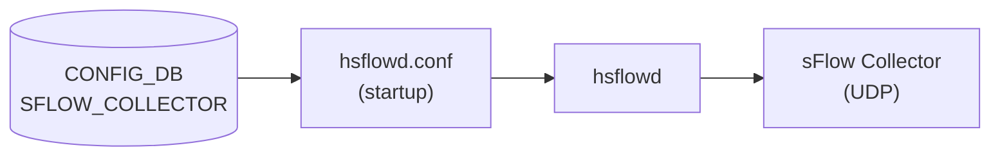

# SFLOW_COLLECTOR テーブル

## 概要

sFlow コレクタ宛先 (IP アドレス / UDP ポート / VRF) を定義するテーブル。最大 2 エントリ (`max-elements 2`) まで登録可能。`hsflowd` (sflowd container) が `/etc/hsflowd.conf` を介して参照し、収集したサンプルを UDP で転送する[^1]。

<!-- cdb-mermaid -->
### データフロー (自動生成)



!!! note "凡例"
    CONFIG_DB から sFlow コレクタまでの経路。詳細は本ページ本文を参照。
<!-- /cdb-mermaid -->

## key / 構造

```text
SFLOW_COLLECTOR|<name>   # コレクタ名 (1..64 文字)
```

## フィールド

| フィールド | 型 | 既定 | 必須 | 説明 |
|-----------|----|------|------|------|
| `collector_ip` | ip-address | - | yes | コレクタの IPv4 / IPv6 アドレス |
| `collector_port` | inet:port-number | 6343 | no | コレクタへの UDP 宛先ポート |
| `collector_vrf` | `mgmt`/`default` | - | no | コレクタへ到達する [VRF](../../reference/glossary.md#term-vrf) |

- `collector_vrf = 'mgmt'`: `MGMT_VRF_CONFIG.vrf_global.mgmtVrfEnabled = 'true'` のときのみ YANG `must` 制約で許容。
- `collector_vrf` 未指定: デフォルト VRF を使用。
- 最大 2 コレクタ (`max-elements 2`)。CLI も 2 エントリ上限をチェック (`config/main.py:9354`)。

## 購読者

**注意**: 現在の sflowmgrd (C++) は SFLOW_COLLECTOR テーブルを直接購読しない (`sflowmgrd.cpp` の TableConnector リストに SFLOW_COLLECTOR なし)。HLD では「sflowmgrd が SFLOW_COLLECTOR を監視して `/etc/hsflowd.conf` を更新する」と記述されているが、実装では直接購読はない。コレクタ設定は hsflowd の起動時に `/etc/hsflowd.conf` として読み込まれる[^2]。

- `hsflowd` (sflowd container): 起動時に CONFIG_DB の SFLOW_COLLECTOR エントリから生成された設定ファイルを読み込み、UDP ソケットを開く。

## 関連 CONFIG_DB / YANG / CLI

- 関連 [CONFIG_DB](../../reference/glossary.md#term-config_db): `SFLOW`（グローバル制御・hsflowd 起動）、`MGMT_VRF_CONFIG`（`mgmt` VRF 有効化）
- 関連 CLI: `config sflow collector add/del`
- 関連 [YANG](../../reference/glossary.md#term-yang): `sonic-sflow` (SFLOW_COLLECTOR container)

<!-- ref-triangle:start -->

## 関連リファレンス

- [CONFIG_DB](../../reference/glossary.md#term-config_db): [`SFLOW`](sflow.md)
- [YANG](../../reference/glossary.md#term-yang): [`sonic-sflow`](../yang/sonic-sflow.md)
- CLI: [`config sflow`](../cli/config-sflow.md)

<!-- ref-triangle:end -->

## 引用元

[^1]: [YANG](../../reference/glossary.md#term-yang) 定義: `sonic-sflow.yang`. <https://github.com/sonic-net/sonic-buildimage/blob/9ea932ec2e18f35e58268ec2e4456b1d4afd65cd/src/sonic-yang-models/yang-models/sonic-sflow.yang>

[^2]: sflowmgrd 実装: `sonic-swss/cfgmgr/sflowmgr.cpp`, `sflowmgrd.cpp`. <https://github.com/sonic-net/sonic-swss/blob/master/cfgmgr/sflowmgrd.cpp>

<!-- topics-back-ref -->
## 関連 Topics

- [Topics: Telemetry / SNMP / Observability](../../topics/09-telemetry-snmp/index.md)

<!-- /topics-back-ref -->

<!-- ordering -->
## 書込み順依存 (Phase B)

SFLOW_COLLECTOR テーブルを CONFIG_DB へ書き込む際の **必須・推奨順序** を実装コードから導出した。

> **調査根拠**: `sonic-swss/cfgmgr/sflowmgr.cpp`, `sflowmgrd.cpp` 全行精読 + `sonic-utilities/config/main.py` sflow 周辺 + `sonic-sflow.yang` 精読 (2026-05-17)
> 詳細証跡: `meta/_intermediate/cdb-flow/sflow-collector-ordering.md`

### O1: `MGMT_VRF_CONFIG|vrf_global` → `SFLOW_COLLECTOR` (条件付き必須)

`sonic-sflow.yang:86-88`: `collector_vrf = 'mgmt'` を指定する場合、`MGMT_VRF_CONFIG.vrf_global.mgmtVrfEnabled = 'true'` が先行必須。YANG `must` 制約が違反時に `"Must condition not satisfied. Try enable Management VRF."` エラーを返す。`collector_vrf = 'default'` または未指定の場合、この制約は不要。

```
MGMT_VRF_CONFIG|vrf_global (mgmtVrfEnabled=true)  →  SFLOW_COLLECTOR|<name> (collector_vrf=mgmt)
```

### O2: コレクタ上限 (最大 2 エントリ)

`config/main.py:9352-9355`: CLI が `SFLOW_COLLECTOR` テーブルのエントリ数をチェックし、2 つ既存かつ新規名の場合に書き込みを拒否する (`"Only 2 collectors can be configured, please delete one"`)。YANG `max-elements 2` でも同様の制限あり。3 つ目のコレクタ追加前に既存エントリを削除必須。

### O3: `SFLOW|global (admin_state=up)` → コレクタ変更の実効 (推奨)

`sflowmgr.cpp:457-459`: sflowmgrd は `SFLOW.admin_state` 変更時に `sflowHandleService(enable)` を呼び `service hsflowd restart/stop` を実行する。SFLOW_COLLECTOR の変更は sflowmgrd の購読外であるため、コレクタ追加・変更・削除後に hsflowd を再起動しなければ反映されない。SFLOW global admin_state のトグル (down→up) が最も確実な再起動トリガーとなる。

```
SFLOW_COLLECTOR|<name>  SET  →  (hsflowd 再起動) → 反映
```

### 推奨書込み順序（総合）

```
1. MGMT_VRF_CONFIG|vrf_global    (mgmtVrfEnabled=true, mgmt VRF 使用時のみ)
2. SFLOW_COLLECTOR|<name>        (collector_ip / collector_port / collector_vrf)
3. SFLOW|global (admin_state=up) (hsflowd 起動 → /etc/hsflowd.conf 読込み)
```

ステップ 1 なしに `collector_vrf=mgmt` を書くと YANG バリデーションエラー。
ステップ 3 (hsflowd 起動) より前にコレクタを書いた場合、hsflowd が /etc/hsflowd.conf を読み込む際に反映される。既に hsflowd が稼働中のときは再起動が必要。

<!-- /ordering -->

<!-- cross-refs -->
## 暗黙参照（テーブル間依存）(Phase C)

SFLOW_COLLECTOR テーブルを処理する際に暗黙的に依存するテーブル・コンポーネントを実装コードから導出した。

> **調査根拠**: `sonic-swss/cfgmgr/sflowmgrd.cpp`, `sflowmgr.cpp`, `sonic-buildimage/src/sonic-yang-models/yang-models/sonic-sflow.yang`, `sonic-utilities/config/main.py` 全行精読 (2026-05-17)  
> 詳細証跡: `meta/_intermediate/cdb-flow/sflow-collector-cross-refs.md`

### MGMT_VRF_CONFIG（`collector_vrf = 'mgmt'` 時の必須依存）

`sonic-sflow.yang:86-88`: `collector_vrf` フィールドに `'mgmt'` を指定する場合、YANG `must` 制約により `MGMT_VRF_CONFIG|vrf_global.mgmtVrfEnabled = 'true'` が必須。この制約は YANG バリデーション時に評価され、`ValidatedConfigDBConnector` 経由の書き込み（`config sflow collector add --vrf mgmt`）で検査される。違反時のエラーメッセージ: `"Must condition not satisfied. Try enable Management VRF."`。

```
MGMT_VRF_CONFIG|vrf_global (mgmtVrfEnabled=true) ←── 必須参照 ── SFLOW_COLLECTOR|<name> (collector_vrf=mgmt)
```

`collector_vrf = 'default'` または未指定の場合はこの依存なし。

### SFLOW（グローバル有効化 — 実効化の間接依存）

`sflowmgr.cpp:456-459`: sflowmgrd は `SFLOW|global.admin_state` の変化を検出すると `sflowHandleService(enable)` を呼び `service hsflowd restart/stop` を実行する。SFLOW_COLLECTOR の変更は sflowmgrd の購読対象外であるため、コレクタ追加・変更・削除の実効化には hsflowd 再起動が必要。`SFLOW|global` の admin_state トグルがそのトリガとなる。

### sflowmgrd — SFLOW_COLLECTOR を購読しない（重要な非依存）

`sflowmgrd.cpp:31-41`: sflowmgrd の TableConnector リストは `PORT`・`STATE_DB PORT`・`SFLOW`・`SFLOW_SESSION` の 4 テーブルのみ。`SFLOW_COLLECTOR` は含まれない。コレクタ設定は hsflowd 起動時に `/etc/hsflowd.conf` として読み込まれ、hsflowd が稼働中は動的変更を検知しない。

| 参照先 | 参照種別 | 条件 | コード箇所 |
|--------|---------|------|-----------|
| `MGMT_VRF_CONFIG\|vrf_global` | YANG must 制約（必須） | `collector_vrf = 'mgmt'` のとき | `sonic-sflow.yang:86-88` |
| `SFLOW\|global` | 間接依存（hsflowd 再起動トリガ） | SFLOW_COLLECTOR 変更の実効化 | `sflowmgr.cpp:456-459` |
| `sflowmgrd` | 非購読（購読対象外） | SFLOW_COLLECTOR は TableConnector 外 | `sflowmgrd.cpp:36-41` |

<!-- /cross-refs -->
