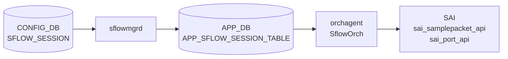

# SFLOW_SESSION テーブル

## 概要

per-port sFlow サンプリング設定を保持するテーブル。key が `'all'` の場合は全ポートへのグローバル既定として機能する。`sflowmgrd` が [CONFIG_DB](../../reference/glossary.md#term-config_db) を購読して `APP_DB` の `APP_SFLOW_SESSION_TABLE` に変換し、`orchagent` の `SflowOrch` が SAI `sai_samplepacket_api` でハードウェアサンプリングを設定する[^1]。

<!-- cdb-mermaid -->
### データフロー (自動生成)



!!! note "凡例"
    CONFIG_DB から SAI までの典型経路を `docs/reference/config-db-orch-map.md` から機械生成したミニ図。詳細・例外は本ページ本文と対応表を参照。
<!-- /cdb-mermaid -->

## key / 構造

```text
SFLOW_SESSION|<port>   # per-port 設定
SFLOW_SESSION|all      # 全ポートへのグローバル既定
```

`<port>` は `PORT.name` 参照。`'all'` キーはグローバル既定として全ポートに適用される。

## フィールド

| フィールド | 型 | 既定 | 説明 |
|-----------|----|------|------|
| `admin_state` | `up`/`down` | `up` | port ごとの sFlow 有効化。欠落時は `up` を注入。 |
| `sample_rate` | uint32 (256..8388608) | ポート速度由来 | 1/N パケットサンプリング。`port='all'` キーには YANG で定義なし。 |
| `sample_direction` | enum `rx`/`tx`/`both` | グローバル方向継承 | サンプリング方向。欠落時はグローバル `m_gDirection` を採用。 |

- `sample_rate` 未指定時: `oper_speed` (STATE_DB) 優先、なければ `cfg_speed` を使用（`sflowmgr.cpp:385-401`）。
- `sample_direction` 欠落時: グローバルまたは `SFLOW_SESSION|all` の方向を継承（`sflowmgr.cpp:374-382`）。
- `admin_state` 欠落時: `"up"` をハードコードで注入（`sflowmgr.cpp:364-368`）。

## 購読者

- `sflowmgrd` (`docker-sflow`): `SFLOW_SESSION` を購読して `APP_SFLOW_SESSION_TABLE` へ変換。グローバル `admin_state=up` が前提。
- `SflowOrch` (`orchagent`): `APP_SFLOW_SESSION_TABLE` を購読して `sai_samplepacket_api` / `sai_port_api` を呼び出す。

## 関連 CONFIG_DB / YANG / CLI

- 関連 [CONFIG_DB](../../reference/glossary.md#term-config_db): `SFLOW`（グローバル制御）、`PORT`（ポート速度）
- 関連 CLI: `config sflow interface enable/disable/sample-rate <ifname>`
- 関連 [YANG](../../reference/glossary.md#term-yang): `sonic-sflow` (SFLOW_SESSION container)

<!-- ref-triangle:start -->

## 関連リファレンス

- [CONFIG_DB](../../reference/glossary.md#term-config_db): [`SFLOW`](sflow.md)
- [YANG](../../reference/glossary.md#term-yang): [`sonic-sflow`](../yang/sonic-sflow.md)
- CLI: [`config sflow`](../cli/config-sflow.md)

<!-- ref-triangle:end -->

## 引用元

[^1]: [YANG](../../reference/glossary.md#term-yang) 定義: `sonic-sflow.yang`. <https://github.com/sonic-net/sonic-buildimage/blob/9ea932ec2e18f35e58268ec2e4456b1d4afd65cd/src/sonic-yang-models/yang-models/sonic-sflow.yang>


<!-- topics-back-ref -->
## 関連 Topics

- [Topics: Telemetry / SNMP / Observability](../../topics/09-telemetry-snmp/index.md)

<!-- /topics-back-ref -->

<!-- ordering -->
## 書込み順依存 (Phase B)

SFLOW_SESSION テーブルを CONFIG_DB へ書き込む際の **必須・推奨順序** を実装コードから導出した。

> **調査根拠**: `sonic-swss/cfgmgr/sflowmgr.cpp` 全行精読 (2026-05-17)
> 詳細証跡: `meta/_intermediate/cdb-flow/sflow-session-ordering.md`

### O1: `PORT` → `SFLOW_SESSION` (必須)

`sflowmgr.cpp:522-528`: per-port SESSION の SET イベント処理時に `m_sflowPortConfMap` にポートが未登録だと `it++; continue` で永続スキップされる（リトライなし）。`m_sflowPortConfMap` は `CFG_PORT_TABLE_NAME` の SET イベントで初期化されるため、`PORT|<port>` の SET が先行必須。

```
PORT|<port>  SET  →  SFLOW_SESSION|<port>  SET
```

### O2: `SFLOW|global` admin=up → `SFLOW_SESSION` の APP_DB 反映 (実質必須)

`sflowmgr.cpp:531-534`: `m_gEnable == false` の場合、per-port SESSION の SET を受信しても APP_DB には書かれない。グローバルを後から up にすると `sflowHandleSessionAll()` / `sflowHandleSessionLocal()` が再適用する。

```
SFLOW|global (admin_state=up)  →  SFLOW_SESSION|<port>  SET
```

### O3: `SFLOW_SESSION|all` → `SFLOW_SESSION|<port>` (推奨)

`sflowmgr.cpp:374-382`: per-port に `sample_direction` 未指定の場合、`m_gDirection` (グローバル方向) がフォールバックとして採用される。`SFLOW_SESSION|all` が先行すると `m_intfAllDir` に正しい方向が設定され、その後の per-port 設定がその値を継承する。順序が逆だと per-port の初期 direction が `m_gDirection` 固定 (`"rx"`) になる。

```
SFLOW_SESSION|all  SET  →  SFLOW_SESSION|<port>  SET
```

### O4: `APP_SFLOW_TABLE` → `APP_SFLOW_SESSION_TABLE` (SflowOrch 段・必須)

`sfloworch.cpp:365-392`: `m_sflowStatus = false` の間は SFLOW_SESSION_TABLE の全 SET を `return` でスキップする。APP_SFLOW_TABLE の SET (sflowStatusSet) が先に到着して `m_sflowStatus = true` になるまで SESSION は永続無視される。

```
APP_SFLOW_TABLE  SET  →  APP_SFLOW_SESSION_TABLE  SET
```

### O5: oper_speed 確定 → `SFLOW_SESSION` 書込み (推奨)

`sflowmgr.cpp:385-401`: `sample_rate` 未指定時は `oper_speed` (STATE_DB) 優先、なければ `cfg_speed` を使う。ポートが UP する前に SFLOW_SESSION を書くと cfg_speed ベースの暫定レートが入る。`local_rate_cfg = false` のポートは `sflowProcessOperSpeed()` が oper_speed 確定時に自動更新するため実運用上は問題が出にくいが、起動直後の一時的なレート不整合に注意。

### 推奨書込み順序（総合）

```
1. PORT|<port>              (ポート登録)
2. SFLOW|global             (admin_state=up、グローバル有効化)
3. SFLOW_SESSION|all        (全ポートデフォルト方向・admin 設定)
4. SFLOW_SESSION|<port>     (per-port 個別設定)
```

ステップ 1 より先にステップ 4 を書くとエントリが永続スキップされる（O1 違反）。
ステップ 2 より先にステップ 4 を書くと APP_DB への反映が遅延する（O2 違反）。

<!-- /ordering -->

<!-- cross-refs -->
## 暗黙参照（テーブル間依存）(Phase C)

SFLOW_SESSION テーブルを処理する際に暗黙的に依存するテーブル・コンポーネントを実装コードから導出した。

> **調査根拠**: `sonic-swss/cfgmgr/sflowmgrd.cpp`, `sflowmgr.cpp`, `orchagent/sfloworch.cpp` 全行精読 (2026-05-17)
> 詳細証跡: `meta/_intermediate/cdb-flow/sflow-session-cross-refs.md`

### PORT（必須参照 — m_sflowPortConfMap 登録）

`sflowmgrd.cpp:31` および `sflowmgr.cpp:522-528`: sflowmgrd は `CFG_PORT_TABLE_NAME` を `TableConnector` に登録し、`sflowUpdatePortInfo()` でポート SET イベントを処理して `m_sflowPortConfMap` を初期化する。per-port `SFLOW_SESSION|<port>` の SET イベントはこのマップにキーが存在する場合のみ処理される。ポートが未登録だと `it++; continue` で永続スキップ（リトライなし）。

```
PORT|<port>  SET  →  m_sflowPortConfMap 登録  →  SFLOW_SESSION|<port>  SET 処理可能
```

### STATE_DB PORT（sample_rate 自動導出参照）

`sflowmgrd.cpp:32` および `sflowmgr.cpp:167-218`: sflowmgrd は `STATE_PORT_TABLE_NAME` (STATE_DB) の `speed` フィールド変化を購読する。`sample_rate` 未指定ポートは `oper_speed` 確定時に `sflowProcessOperSpeed()` が自動的に `APP_SFLOW_SESSION_TABLE` を更新する。SFLOW_SESSION に明示的フィールドとしては現れないが、`sample_rate` の実値導出で透過的に参照される。

### SFLOW（グローバル有効化 — 実効化前提）

`sflowmgr.cpp:531-534`: `m_gEnable == false`（`SFLOW|global.admin_state != up`）の場合、per-port SESSION SET を受けても `APP_SFLOW_SESSION_TABLE` に書き込まれない。グローバルを後から up にすると `sflowHandleSessionAll()` / `sflowHandleSessionLocal()` が再適用する。SFLOW テーブルへの YANG 直接参照はないが、APP_DB 反映の実質的必須前提。

### SFLOW_SESSION|all（方向・admin のグローバルデフォルト継承）

`sflowmgr.cpp:374-382`: per-port SESSION に `sample_direction` が未指定の場合、`m_intfAllDir`（SFLOW_SESSION|all の方向）をフォールバックとして採用。`admin_state` 未指定の per-port は `m_intfAllConf`（SFLOW_SESSION|all の enable 状態）に基づいて `isPortEnabled()` が評価される。`SFLOW_SESSION|all` が先行設定されていることで per-port 継承が正しく機能する。

### APP_SFLOW_TABLE（SflowOrch 段の必須前提）

`sfloworch.cpp:365-368, 388-392`: SflowOrch は `APP_SFLOW_TABLE` の SET を受けて `m_sflowStatus = true` にする。`m_sflowStatus == false` の間は `APP_SFLOW_SESSION_TABLE` の全 SET イベントを `return` でスキップ。sflowmgrd が SESSION を APP_DB に書いても、SflowOrch 側で APP_SFLOW_TABLE が先行していないと SAI 設定まで到達しない。

### gPortsOrch（PortsOrch 初期化完了待ち）

`sfloworch.cpp:370-373`: `gPortsOrch->allPortsReady()` が false の間は `APP_SFLOW_SESSION_TABLE` 処理全体をスキップする。PortsOrch が全ポート初期化を完了するまで SflowOrch の SESSION 処理は開始されない。起動直後の SESSION エントリは PortsOrch 完了後に処理される。

| 参照先 | 参照種別 | 条件 | コード箇所 |
|--------|---------|------|-----------|
| `PORT\|<port>` | 必須参照（m_sflowPortConfMap 登録） | per-port SESSION 処理の前提 | `sflowmgr.cpp:522-528` |
| `STATE_DB PORT\|<port>` (speed) | 自動導出参照 | `sample_rate` 未指定時の oper_speed 参照 | `sflowmgr.cpp:385-401` |
| `SFLOW\|global` | 実効化前提（m_gEnable） | admin_state=up が APP_DB 書込みの必須前提 | `sflowmgr.cpp:531-534` |
| `SFLOW_SESSION\|all` | 暗黙継承（方向・admin デフォルト） | per-port direction/admin 未指定時 | `sflowmgr.cpp:374-382` |
| `APP_SFLOW_TABLE` | SflowOrch 段の前提依存 | m_sflowStatus=false の間 SESSION をスキップ | `sfloworch.cpp:388-392` |
| `gPortsOrch` | PortsOrch 初期化完了待ち | allPortsReady()=false の間 SESSION 処理なし | `sfloworch.cpp:370-373` |

<!-- /cross-refs -->

<!-- failure -->
## 失敗挙動マトリクス (Phase D)

`sflowmgrd` および `SflowOrch` の失敗経路を実装コードから導出した。

> **調査根拠**: `sonic-swss/cfgmgr/sflowmgr.cpp`, `sonic-swss/orchagent/sfloworch.cpp` 全行精読 (2026-05-17)
> 詳細証跡: `meta/_intermediate/cdb-flow/sflow-session-failure.md`

### sflowmgrd — SET 処理の失敗経路

| 失敗条件 | 結果 | ログ | コード箇所 |
|---------|------|------|-----------|
| per-port SET 時にポートが `m_sflowPortConfMap` に未登録 | `it++; continue` で永続スキップ。後から PORT が追加されても SFLOW_SESSION の再処理なし | なし | `sflowmgr.cpp:522-528` |
| `m_gEnable == false`（SFLOW\|global admin_state が up 未設定）で per-port SET | `APP_SFLOW_SESSION_TABLE` への書き込みをスキップ。グローバルが後から up になると `sflowHandleSessionAll/Local()` が再適用して回復する | なし | `sflowmgr.cpp:531-534` |
| `findSamplingRate()` が `ERROR_SPEED` を返す（ポート未登録） | `SWSS_LOG_ERROR` 出力後 `sample_rate=error` が APP_DB に書き込まれる | SWSS_LOG_ERROR ("%s not found in port configuration map") | `sflowmgr.cpp:389-393` |
| `hsflowd` restart/stop が rc != 0 で失敗 | `SWSS_LOG_ERROR` を出力。例外送出・リトライなく CONFIG_DB → APP_DB 書き込みは続行 | SWSS_LOG_ERROR ("Command '%s' failed with rc %d") | `sflowmgr.cpp:67-71` |

### sflowmgrd — DEL 処理の失敗経路

| 失敗条件 | 結果 | コード箇所 |
|---------|------|-----------|
| per-port DEL 時にポートが `m_sflowPortConfMap` に未登録 | サイレントスキップ。`erase()` も `del()` も呼ばれない | `sflowmgr.cpp:149-150` |
| `SFLOW_SESSION\|all` DEL 時に `m_intfAllConf == true`（既に true） | `sflowHandleSessionAll()` が呼ばれず DEL が実質 no-op | `sflowmgr.cpp:556-563` |

### SflowOrch — SET 処理の失敗経路

| 失敗条件 | 結果 | ログ | コード箇所 |
|---------|------|------|-----------|
| `m_sflowStatus == false`（APP_SFLOW_TABLE SET が未到着） | `return` でループ全体を抜ける。m_toSync にエントリ残留、次回 `doTask()` で再試行 | なし | `sfloworch.cpp:389-392` |
| `gPortsOrch->allPortsReady()` が false | `return` でスキップ。PortsOrch 完了後に処理再開 | なし | `sfloworch.cpp:370-373` |
| `rate == 0`（error 文字列由来）の新規ポート | `it++; continue` でスキップ。SAI 設定なし | なし | `sfloworch.cpp:410-415` |
| `sai_samplepacket_api->create_samplepacket()` が SAI エラー | `handleSaiCreateStatus()` 判定。`task_success` 以外は `it++; continue` | SWSS_LOG_ERROR ("Failed to create sample packet session with rate %d") | `sfloworch.cpp:29-39` |
| `sai_port_api->set_port_attribute()` (ingress/egress) が SAI エラー | `handleSaiSetStatus()` 判定。false で `it++; continue` | SWSS_LOG_ERROR ("Failed to set session on port") | `sfloworch.cpp:122-150` |
| 旧セッション破棄 (`sflowDestroySession()`) が SAI エラー | SWSS_LOG_ERROR のみ。`m_sflowRateSampleMap.erase()` をスキップ。SAI 上のセッションが残存する可能性あり | SWSS_LOG_ERROR ("Failed to clean old session") | `sfloworch.cpp:97-105` |

### SflowOrch — DEL 処理の失敗経路

| 失敗条件 | 結果 | コード箇所 |
|---------|------|-----------|
| DEL 時にポートが `m_sflowPortInfoMap` に未登録 | サイレントスキップ | `sfloworch.cpp:331-332` |
| `sflowDelPort()` が SAI エラーで false | `handleSflowSessionDel()` が false を返し `it++; continue` | `sfloworch.cpp:338-340` |
| `sflowDestroySession()` が SAI エラーで false（ref_count が 0 時） | `m_sflowRateSampleMap.erase()` をスキップ。SAI 上のセッションが残存 | `sfloworch.cpp:349-354` |

<!-- /failure -->

<!-- constants -->
## 定数・マジックナンバー (Phase E)

`sflowmgrd` および `SflowOrch` が使用するハードコード定数・センチネル値・YANG 制約を実装コードから導出した。

> **調査根拠**: `sonic-swss/cfgmgr/sflowmgr.h`, `sflowmgr.cpp`, `orchagent/sfloworch.cpp`, `sonic-sflow.yang` 全行精読 (2026-05-17)
> 詳細証跡: `meta/_intermediate/cdb-flow/sflow-session-constants.md`

### マクロ定数 (sflowmgr.h)

| 定数名 | 値 | 用途 |
|-------|----|------|
| `ERROR_SPEED` | `"error"` | ポートが `m_sflowPortConfMap` に未登録の場合に `findSamplingRate()` が返すセンチネル。APP_DB に `sample_rate=error` として書き込まれ、SflowOrch 側で `rate=0` と解釈されてスキップされる (`sfloworch.cpp:275-281`)。 |
| `NA_SPEED` | `"N/A"` | oper_speed が STATE_DB から未到着の状態を示すセンチネル。`oper_speed == NA_SPEED` の間は cfg_speed (PORT テーブルの speed) をサンプリングレートとして使用する (`sflowmgr.cpp:396-400`)。 |

### コンストラクタ初期値 (sflowmgr.cpp)

| 変数 | 初期値 | コード箇所 | 意味 |
|------|--------|-----------|------|
| `m_intfAllConf` | `true` | `sflowmgr.cpp:18` | 全ポートデフォルト有効フラグ。起動直後から `SFLOW_SESSION\|all` が有効扱いとなる |
| `m_gEnable` | `false` | `sflowmgr.cpp:19` | グローバル admin_state。`SFLOW\|global` の SET で `admin_state=up` になるまで false |
| `m_gDirection` | `"rx"` | `sflowmgr.cpp:20` | グローバルサンプリング方向デフォルト。YANG の `sample_direction default "rx"` と一致 |
| `m_intfAllDir` | `"rx"` | `sflowmgr.cpp:21` | `SFLOW_SESSION\|all` のデフォルト方向。per-port の方向フォールバックとして使用 |

### SflowOrch コンストラクタ初期値 (sfloworch.cpp)

| 変数 | 初期値 | コード箇所 | 意味 |
|------|--------|-----------|------|
| `m_sflowStatus` | `false` | `sfloworch.cpp:17` | 起動時は sFlow 無効。`APP_SFLOW_TABLE` の SET イベントで `true` に変わるまで SESSION 処理をスキップ |

### フォールバックリテラル (sflowmgr.cpp 処理中)

| 関数 | 箇所 | 値 | 適用条件 |
|------|------|----|---------|
| `sflowCheckAndFillValues()` | `sflowmgr.cpp:365` | `"up"` | `admin_state` 未指定ポートへの注入値 |
| `sflowCheckAndFillValues()` | `sflowmgr.cpp:377` | `m_gDirection`（デフォルト `"rx"`） | `sample_direction` 未指定ポートへのフォールバック |
| `sflowGetGlobalInfo()` | `sflowmgr.cpp:277` | `"up"` | グローバル設定から APP_DB へ書く際の admin_state ハードコード |
| `doTask()` (CFG_SFLOW) | `sflowmgr.cpp:435` | `"rx"` | SFLOW グローバル処理時の direction ローカル変数初期値 |

### YANG 制約 (sonic-sflow.yang)

| フィールド | 制約 | コード箇所 |
|-----------|------|----------|
| `sample_rate` | `uint32` 範囲 `[256..8388608]` | `sonic-sflow.yang:127-130` |
| `sample_rate` | `must "../port != 'all'"` — `SFLOW_SESSION\|all` には定義不可 | `sonic-sflow.yang:126` |
| `admin_state` (SFLOW_SESSION) | `default up` | `sonic-sflow.yang:121` |
| `sample_direction` (SFLOW_SESSION) | `default "rx"` | `sonic-sflow.yang:137` |
| `SFLOW_COLLECTOR` | `max-elements 2` — コレクタ最大 2 個 | `sonic-sflow.yang:62` |
| `collector_port` | `default 6343` — sFlow 標準ポート | `sonic-sflow.yang:81` |

### ERROR_SPEED センチネルの伝播パス

```
findSamplingRate() がポート未登録を検出
  → ERROR_SPEED ("error") を返す                    # sflowmgr.cpp:392
  → APP_SFLOW_SESSION_TABLE に sample_rate="error" を書き込む
  → SflowOrch::sflowExtractInfo() が "error" を検出  # sfloworch.cpp:275-281
  → rate = 0 に変換
  → if (rate == 0) { it++; continue } でスキップ    # sfloworch.cpp:410-415
  → SAI 設定まで到達しない
```

<!-- /constants -->
<!-- side-effects -->
## 副次 DB 書込 (Phase F)

`SFLOW_SESSION` テーブルへの書込をトリガーとして、他 DB・テーブルへ副次的に書き込まれる経路を `sflowmgr.cpp` / `sfloworch.cpp` から抽出した。

### 1. APPL_DB `SFLOW_SESSION_TABLE` への書込 (sflowmgrd)

`SFLOW_SESSION` の SET/DEL イベントを受けた `SflowMgr::doTask()` が `m_appSflowSessionTable.set()` / `.del()` を呼び出す。

#### 1a. `SFLOW_SESSION|<port>` SET 時

`sflowCheckAndFillValues()` でフィールドを補完後、グローバル admin_state が有効（`m_gEnable=true`）の場合のみ APPL_DB に書き込む (sflowmgr.cpp:531-534)。[^4]

| フィールド | 書込値 | evidence |
|-----------|-------|---------|
| `admin_state` | ローカル設定値、なければ `"up"` | sflowmgr.cpp:361-369 |
| `sample_rate` | ローカル設定値、なければ `findSamplingRate()` 結果 | sflowmgr.cpp:345-358 |
| `sample_direction` | ローカル設定値、なければ `m_gDirection` (デフォルト `"rx"`) | sflowmgr.cpp:373-382 |

#### 1b. `SFLOW_SESSION|<port>` DEL 時

`m_appSflowSessionTable.del(key)` でポートエントリを削除する (sflowmgr.cpp:567)。その後 `m_intfAllConf=true` であれば `sflowGetGlobalInfo()` でグローバル設定を同ポートに再投入する (sflowmgr.cpp:576-581)。[^4]

#### 1c. `SFLOW_SESSION|all` SET 時

`m_intfAllConf` / `m_intfAllDir` を更新し、`m_gEnable=true` のとき `sflowHandleSessionAll()` で全ポートの `SFLOW_SESSION_TABLE` を一斉更新する (sflowmgr.cpp:511-514)。ローカル設定を持つポートはローカル値を優先し、それ以外はグローバル値を使用する (sflowmgr.cpp:227-244)。[^4]

#### 1d. `SFLOW_SESSION|all` DEL 時

`m_intfAllConf=false` だった場合かつ `m_gEnable=true` であれば、`sflowHandleSessionAll(true, m_gDirection)` で全ポートを再有効化する (sflowmgr.cpp:558-563)。その後 `m_intfAllConf=true` にリセットされる。[^4]

### 2. ASIC_DB — SAI samplepacket セッション操作 (SflowOrch 経由)

SflowOrch が APPL_DB `SFLOW_SESSION_TABLE` を購読し、SAI API でハードウェアサンプリングを設定する。

#### 2a. `sai_samplepacket_api->create_samplepacket()`

新レートのセッション作成 (sfloworch.cpp:29)。セッションは `m_sflowRateSampleMap[rate]` で参照カウント管理し、同レートのポートがセッションを共有する。[^4]

```
attr.id = SAI_SAMPLEPACKET_ATTR_SAMPLE_RATE
attr.value.u32 = rate
sai_samplepacket_api->create_samplepacket(&session_id, gSwitchId, 1, &attr)
```

#### 2b. `sai_port_api->set_port_attribute()` — ポート samplepacket 設定

| 方向 | SAI 属性 | 有効化時 | 無効化時 |
|------|---------|--------|--------|
| `rx` / `both` | `SAI_PORT_ATTR_INGRESS_SAMPLEPACKET_ENABLE` | `session_id` | `SAI_NULL_OBJECT_ID` |
| `tx` / `both` | `SAI_PORT_ATTR_EGRESS_SAMPLEPACKET_ENABLE` | `session_id` | `SAI_NULL_OBJECT_ID` |

evidence: sfloworch.cpp:119–150 (`sflowAddPort`), sfloworch.cpp:161–195 (`sflowDelPort`)[^4]

#### 2c. `sai_samplepacket_api->remove_samplepacket()`

参照カウントがゼロになったとき呼び出す (sfloworch.cpp:49)。レート変更時は旧セッション destroy → 新セッション create の順で実行 (sfloworch.cpp:95-106)。[^4]

### 副次書込 サマリテーブル

| トリガー | consumer | 対象 DB | テーブル | 書込内容 | evidence |
|---------|---------|--------|---------|---------|---------|
| `SFLOW_SESSION\|<port>` SET (gEnable=true) | sflowmgrd | APPL_DB | `SFLOW_SESSION_TABLE` | admin_state / sample_rate / sample_direction | sflowmgr.cpp:533 |
| `SFLOW_SESSION\|<port>` DEL | sflowmgrd | APPL_DB | `SFLOW_SESSION_TABLE` | キー削除 | sflowmgr.cpp:567 |
| DEL 後 intfAllConf=true | sflowmgrd | APPL_DB | `SFLOW_SESSION_TABLE` | グローバル設定で再 SET | sflowmgr.cpp:578-580 |
| `SFLOW_SESSION\|all` SET (gEnable=true) | sflowmgrd | APPL_DB | `SFLOW_SESSION_TABLE` | 全ポート一斉更新 | sflowmgr.cpp:513 |
| `SFLOW_SESSION\|all` DEL (intfAllConf=false, gEnable=true) | sflowmgrd | APPL_DB | `SFLOW_SESSION_TABLE` | 全ポート再有効化 | sflowmgr.cpp:558-563 |
| APPL_DB `SFLOW_SESSION_TABLE` SET | SflowOrch | ASIC_DB | SAI samplepacket | create_samplepacket + INGRESS/EGRESS 属性 SET | sfloworch.cpp:29,122,139 |
| APPL_DB `SFLOW_SESSION_TABLE` DEL | SflowOrch | ASIC_DB | SAI samplepacket | remove_samplepacket + SAI_NULL_OBJECT_ID でポートリセット | sfloworch.cpp:49,165,183 |

[^4]: 副次書込調査: `sonic-swss/cfgmgr/sflowmgr.cpp`, `sonic-swss/orchagent/sfloworch.cpp`. <https://github.com/sonic-net/sonic-swss/blob/master/cfgmgr/sflowmgr.cpp>

<!-- /side-effects -->

<!-- pubsub -->
## 通信メカニズム (Phase G)

`SFLOW_SESSION` テーブルを中心とした購読・通知 API を `sflowmgrd.cpp`, `sflowmgr.h`, `sfloworch.cpp`, `orchdaemon.cpp` から導出した。

> **調査根拠**: `sonic-swss/cfgmgr/sflowmgrd.cpp`, `sflowmgr.h`, `orchagent/sfloworch.cpp`, `orchagent/orchdaemon.cpp` 全行精読 (2026-05-17)
> 詳細証跡: `meta/_intermediate/cdb-flow/sflow-session-pubsub.md`

### CONFIG_DB → sflowmgrd（SubscriberStateTable）

`sflowmgrd.cpp:31-34` で `TableConnector` を 4 本生成して `SflowMgr(Orch)` に渡す。

```cpp
TableConnector conf_port_table(&cfgDb, CFG_PORT_TABLE_NAME);
TableConnector state_port_table(&stateDb, STATE_PORT_TABLE_NAME);
TableConnector conf_sflow_table(&cfgDb, CFG_SFLOW_TABLE_NAME);
TableConnector conf_sflow_session_table(&cfgDb, CFG_SFLOW_SESSION_TABLE_NAME);
```

`Orch` フレームワークが各 `TableConnector` を **`SubscriberStateTable`**（Redis keyspace 通知ベース）に変換し `swss::Select` ループで多重化する。CONFIG_DB の `SFLOW_SESSION|*` に HSET / DEL が発生すると Redis keyspace 通知が届き、`SflowMgr::doTask()` が呼ばれる。書き込み側（CLI / sonic-cfggen）は `HSET` のみ実行し、明示的な `PUBLISH` は行わない。

### STATE_DB → sflowmgrd（oper_speed 変化追跡）

`sflowmgrd.cpp:32`：`STATE_PORT_TABLE_NAME`（STATE_DB）も `SubscriberStateTable` で購読する。ポートの `oper_speed` フィールド変化を検知すると `sflowProcessOperSpeed()` が呼ばれ、`sample_rate` 未指定ポートの `APPL_SFLOW_SESSION_TABLE` エントリが自動更新される。**sflowmgrd は STATE_DB への書き込みを行わない**（一方向読み取り）。

### sflowmgrd → APPL_DB（ProducerStateTable）

`sflowmgr.h:39-40`：
```cpp
ProducerStateTable  m_appSflowTable;
ProducerStateTable  m_appSflowSessionTable;
```

`m_appSflowSessionTable.set()` / `.del()` が APPL_DB `SFLOW_SESSION_TABLE` に書き込む。`ProducerStateTable` は内部で Redis Stream (`XADD`) と通知チャネルへの `PUBLISH` を自動実行する。

### APPL_DB → SflowOrch（ConsumerStateTable）

`orchdaemon.cpp:439-444`：

```cpp
vector<string> sflow_tables = {
    APP_SFLOW_TABLE_NAME,
    APP_SFLOW_SESSION_TABLE_NAME,
    APP_SFLOW_SAMPLE_RATE_TABLE_NAME
};
SflowOrch *sflow_orch = new SflowOrch(m_applDb, sflow_tables);
```

`SflowOrch` は `Orch` 基底クラス経由で 3 テーブルを **`ConsumerStateTable`** として登録し、APPL_DB の通知チャネルを待ち受ける。`SFLOW_SESSION_TABLE` への変更を受信して `SflowOrch::doTask()` を呼び出す。

### show sflow interface の APPL_DB 直接参照

`show/sflow.py:51-52`：
```python
intf_key = 'SFLOW_SESSION_TABLE:' + pname
sess_info = sess_db.get_all(sess_db.APPL_DB, intf_key)
```

`show sflow interface` は CONFIG_DB ではなく APPL_DB の `SFLOW_SESSION_TABLE` を HGETALL して表示する（pub/sub 非使用、read-through パターン）。

### 通信メカニズム サマリ

| 方向 | 送信側 | API | 受信側 | DB / テーブル |
|------|-------|-----|-------|-------------|
| CONFIG_DB → mgrd | CONFIG_DB (HSET/DEL) | Redis keyspace 通知 → `SubscriberStateTable` | sflowmgrd | `CONFIG_DB SFLOW_SESSION` |
| STATE_DB → mgrd | STATE_DB (oper_speed) | Redis keyspace 通知 → `SubscriberStateTable` | sflowmgrd | `STATE_DB PORT_TABLE` |
| mgrd → APPL_DB | sflowmgrd | `ProducerStateTable.set()` / `.del()` | SflowOrch | `APPL_DB SFLOW_SESSION_TABLE` |
| APPL_DB → orch | APPL_DB (Stream + PUBLISH) | `ConsumerStateTable` | SflowOrch | `APPL_DB SFLOW_SESSION_TABLE` |
| show CLI | show sflow interface | Redis HGETALL (read-through) | — | `APPL_DB SFLOW_SESSION_TABLE` |

`NotificationProducer` / `NotificationConsumer` は SFLOW_SESSION の経路では一切使用しない。

<!-- /pubsub -->

<!-- platform -->
## プラットフォーム差分 (Phase H)

`sflowmgrd` および `SflowOrch` の全コードを精読した結果、SFLOW_SESSION 処理に **プラットフォーム固有分岐は存在しない**。

> **調査根拠**: `sonic-swss/cfgmgr/sflowmgr.cpp`, `sonic-swss/orchagent/sfloworch.cpp` 全行精読 (2026-05-17)
> 詳細証跡: `meta/_intermediate/cdb-flow/sflow-session-platform.md`

### 静的プラットフォーム比較: なし

`sflowmgr.cpp` / `sfloworch.cpp` のいずれにも `getenv("platform")` / `getenv("sub_platform")` の呼び出しが存在しない。ACL 系が行うようなベンダー名文字列比較 (`broadcom`, `mellanox`, etc.) は一切ない。

VOQ Chassis (`is_chassis()`) / SmartSwitch DPU (`switch_type == "dpu"`) の特殊モード分岐も存在しない。

### 動的 SAI capability 照会: なし

`sfloworch.cpp` は `sai_query_attribute_capability()` を呼び出さず、以下の SAI 属性を全プラットフォーム共通で直接呼び出す:

| SAI API / 属性 | 用途 |
|---------------|------|
| `sai_samplepacket_api->create_samplepacket()` | サンプリングレートごとのセッション作成 |
| `sai_samplepacket_api->remove_samplepacket()` | セッション削除 |
| `SAI_PORT_ATTR_INGRESS_SAMPLEPACKET_ENABLE` | rx / both 方向のポートサンプリング有効化 |
| `SAI_PORT_ATTR_EGRESS_SAMPLEPACKET_ENABLE` | tx / both 方向のポートサンプリング有効化 |
| `SAI_SAMPLEPACKET_ATTR_SAMPLE_RATE` | サンプリングレート (uint32_t) |

SAI がエラーを返した場合は `handleSaiCreateStatus` / `handleSaiSetStatus` / `handleSaiRemoveStatus` 経由でログを出力し `it++; continue` でスキップする。BFD のような software fallback 経路は存在しない。

### ASIC ベンダー別傾向 (SAI 実装依存)

`sfloworch.cpp` 自体はベンダー文字列を参照しないが、SAI 実装ごとの典型的な対応状況:

| ASIC / プラットフォーム | hardware sFlow | 備考 |
|---|---|---|
| broadcom (Trident3 / Tomahawk) | あり | SAI samplepacket API 実装済み |
| broadcom-dnx (Jericho / Qumran) | 機種依存 | DNX SAI で一部制限あり |
| mellanox (Spectrum 系) | あり | Spectrum / Spectrum-2/3/4 で対応 |
| barefoot (Tofino) | 通常なし | 標準 SAI samplepacket 未実装が多い |
| cisco-8000 (Silicon One) | あり | SAI samplepacket 実装済み |
| marvell-prestera | 機種依存 | SAI 実装次第 |
| vs (Virtual Switch) | **なし** | libsai が samplepacket 未実装 — `create_samplepacket` がエラーを返しスキップされる |

!!! note "最終判定は SAI 実装"
    上表は一般的傾向であり、実際の動作可否は各ベンダーの SAI ライブラリ実装が決定する。
    vs (仮想スイッチ) では sflowmgrd / hsflowd の userspace 処理は正常動作するが、
    ハードウェアサンプリングは機能しない（SAI エラーをログ出力してスキップ）。

<!-- /platform -->
