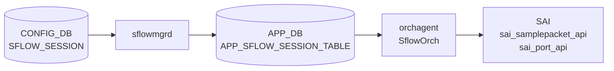

# SFLOW_SESSION テーブル

## 概要

per-port sFlow サンプリング設定を保持するテーブル。key が `'all'` の場合は全ポートへのグローバル既定として機能する。`sflowmgrd` が [CONFIG_DB](../../reference/glossary.md#term-config_db) を購読して `APP_DB` の `APP_SFLOW_SESSION_TABLE` に変換し、`orchagent` の `SflowOrch` が SAI `sai_samplepacket_api` でハードウェアサンプリングを設定する[^1]。

<!-- cdb-mermaid -->
### データフロー (自動生成)



!!! note "凡例"
    CONFIG_DB から SAI までの典型経路を `docs/reference/config-db-orch-map.md` から機械生成したミニ図。詳細・例外は本ページ本文と対応表を参照。
<!-- /cdb-mermaid -->

## key / 構造

```text
SFLOW_SESSION|<port>   # per-port 設定
SFLOW_SESSION|all      # 全ポートへのグローバル既定
```

`<port>` は `PORT.name` 参照。`'all'` キーはグローバル既定として全ポートに適用される。

## フィールド

| フィールド | 型 | 既定 | 説明 |
|-----------|----|------|------|
| `admin_state` | `up`/`down` | `up` | port ごとの sFlow 有効化。欠落時は `up` を注入。 |
| `sample_rate` | uint32 (256..8388608) | ポート速度由来 | 1/N パケットサンプリング。`port='all'` キーには YANG で定義なし。 |
| `sample_direction` | enum `rx`/`tx`/`both` | グローバル方向継承 | サンプリング方向。欠落時はグローバル `m_gDirection` を採用。 |

- `sample_rate` 未指定時: `oper_speed` (STATE_DB) 優先、なければ `cfg_speed` を使用（`sflowmgr.cpp:385-401`）。
- `sample_direction` 欠落時: グローバルまたは `SFLOW_SESSION|all` の方向を継承（`sflowmgr.cpp:374-382`）。
- `admin_state` 欠落時: `"up"` をハードコードで注入（`sflowmgr.cpp:364-368`）。

## 購読者

- `sflowmgrd` (`docker-sflow`): `SFLOW_SESSION` を購読して `APP_SFLOW_SESSION_TABLE` へ変換。グローバル `admin_state=up` が前提。
- `SflowOrch` (`orchagent`): `APP_SFLOW_SESSION_TABLE` を購読して `sai_samplepacket_api` / `sai_port_api` を呼び出す。

## 関連 CONFIG_DB / YANG / CLI

- 関連 [CONFIG_DB](../../reference/glossary.md#term-config_db): `SFLOW`（グローバル制御）、`PORT`（ポート速度）
- 関連 CLI: `config sflow interface enable/disable/sample-rate <ifname>`
- 関連 [YANG](../../reference/glossary.md#term-yang): `sonic-sflow` (SFLOW_SESSION container)

<!-- ref-triangle:start -->

## 関連リファレンス

- [CONFIG_DB](../../reference/glossary.md#term-config_db): [`SFLOW`](sflow.md)
- [YANG](../../reference/glossary.md#term-yang): [`sonic-sflow`](../yang/sonic-sflow.md)
- CLI: [`config sflow`](../cli/config-sflow.md)

<!-- ref-triangle:end -->

## 引用元

[^1]: [YANG](../../reference/glossary.md#term-yang) 定義: `sonic-sflow.yang`. <https://github.com/sonic-net/sonic-buildimage/blob/9ea932ec2e18f35e58268ec2e4456b1d4afd65cd/src/sonic-yang-models/yang-models/sonic-sflow.yang>

[^2]: sflowmgrd 実装: `sonic-swss/cfgmgr/sflowmgr.cpp`. <https://github.com/sonic-net/sonic-swss/blob/master/cfgmgr/sflowmgr.cpp>

[^3]: sfloworch 実装: `sonic-swss/orchagent/sfloworch.cpp`. <https://github.com/sonic-net/sonic-swss/blob/master/orchagent/sfloworch.cpp>

<!-- topics-back-ref -->
## 関連 Topics

- [Topics: Telemetry / SNMP / Observability](../../topics/09-telemetry-snmp/index.md)

<!-- /topics-back-ref -->

<!-- ordering -->
## 書込み順依存 (Phase B)

SFLOW_SESSION テーブルを CONFIG_DB へ書き込む際の **必須・推奨順序** を実装コードから導出した。

> **調査根拠**: `sonic-swss/cfgmgr/sflowmgr.cpp` 全行精読 (2026-05-17)
> 詳細証跡: `meta/_intermediate/cdb-flow/sflow-session-ordering.md`

### O1: `PORT` → `SFLOW_SESSION` (必須)

`sflowmgr.cpp:522-528`: per-port SESSION の SET イベント処理時に `m_sflowPortConfMap` にポートが未登録だと `it++; continue` で永続スキップされる（リトライなし）。`m_sflowPortConfMap` は `CFG_PORT_TABLE_NAME` の SET イベントで初期化されるため、`PORT|<port>` の SET が先行必須。

```
PORT|<port>  SET  →  SFLOW_SESSION|<port>  SET
```

### O2: `SFLOW|global` admin=up → `SFLOW_SESSION` の APP_DB 反映 (実質必須)

`sflowmgr.cpp:531-534`: `m_gEnable == false` の場合、per-port SESSION の SET を受信しても APP_DB には書かれない。グローバルを後から up にすると `sflowHandleSessionAll()` / `sflowHandleSessionLocal()` が再適用する。

```
SFLOW|global (admin_state=up)  →  SFLOW_SESSION|<port>  SET
```

### O3: `SFLOW_SESSION|all` → `SFLOW_SESSION|<port>` (推奨)

`sflowmgr.cpp:374-382`: per-port に `sample_direction` 未指定の場合、`m_gDirection` (グローバル方向) がフォールバックとして採用される。`SFLOW_SESSION|all` が先行すると `m_intfAllDir` に正しい方向が設定され、その後の per-port 設定がその値を継承する。順序が逆だと per-port の初期 direction が `m_gDirection` 固定 (`"rx"`) になる。

```
SFLOW_SESSION|all  SET  →  SFLOW_SESSION|<port>  SET
```

### O4: `APP_SFLOW_TABLE` → `APP_SFLOW_SESSION_TABLE` (SflowOrch 段・必須)

`sfloworch.cpp:365-392`: `m_sflowStatus = false` の間は SFLOW_SESSION_TABLE の全 SET を `return` でスキップする。APP_SFLOW_TABLE の SET (sflowStatusSet) が先に到着して `m_sflowStatus = true` になるまで SESSION は永続無視される。

```
APP_SFLOW_TABLE  SET  →  APP_SFLOW_SESSION_TABLE  SET
```

### O5: oper_speed 確定 → `SFLOW_SESSION` 書込み (推奨)

`sflowmgr.cpp:385-401`: `sample_rate` 未指定時は `oper_speed` (STATE_DB) 優先、なければ `cfg_speed` を使う。ポートが UP する前に SFLOW_SESSION を書くと cfg_speed ベースの暫定レートが入る。`local_rate_cfg = false` のポートは `sflowProcessOperSpeed()` が oper_speed 確定時に自動更新するため実運用上は問題が出にくいが、起動直後の一時的なレート不整合に注意。

### 推奨書込み順序（総合）

```
1. PORT|<port>              (ポート登録)
2. SFLOW|global             (admin_state=up、グローバル有効化)
3. SFLOW_SESSION|all        (全ポートデフォルト方向・admin 設定)
4. SFLOW_SESSION|<port>     (per-port 個別設定)
```

ステップ 1 より先にステップ 4 を書くとエントリが永続スキップされる（O1 違反）。
ステップ 2 より先にステップ 4 を書くと APP_DB への反映が遅延する（O2 違反）。

<!-- /ordering -->

<!-- cross-refs -->
## 暗黙参照（テーブル間依存）(Phase C)

SFLOW_SESSION テーブルを処理する際に暗黙的に依存するテーブル・コンポーネントを実装コードから導出した。

> **調査根拠**: `sonic-swss/cfgmgr/sflowmgrd.cpp`, `sflowmgr.cpp`, `orchagent/sfloworch.cpp` 全行精読 (2026-05-17)
> 詳細証跡: `meta/_intermediate/cdb-flow/sflow-session-cross-refs.md`

### PORT（必須参照 — m_sflowPortConfMap 登録）

`sflowmgrd.cpp:31` および `sflowmgr.cpp:522-528`: sflowmgrd は `CFG_PORT_TABLE_NAME` を `TableConnector` に登録し、`sflowUpdatePortInfo()` でポート SET イベントを処理して `m_sflowPortConfMap` を初期化する。per-port `SFLOW_SESSION|<port>` の SET イベントはこのマップにキーが存在する場合のみ処理される。ポートが未登録だと `it++; continue` で永続スキップ（リトライなし）。

```
PORT|<port>  SET  →  m_sflowPortConfMap 登録  →  SFLOW_SESSION|<port>  SET 処理可能
```

### STATE_DB PORT（sample_rate 自動導出参照）

`sflowmgrd.cpp:32` および `sflowmgr.cpp:167-218`: sflowmgrd は `STATE_PORT_TABLE_NAME` (STATE_DB) の `speed` フィールド変化を購読する。`sample_rate` 未指定ポートは `oper_speed` 確定時に `sflowProcessOperSpeed()` が自動的に `APP_SFLOW_SESSION_TABLE` を更新する。SFLOW_SESSION に明示的フィールドとしては現れないが、`sample_rate` の実値導出で透過的に参照される。

### SFLOW（グローバル有効化 — 実効化前提）

`sflowmgr.cpp:531-534`: `m_gEnable == false`（`SFLOW|global.admin_state != up`）の場合、per-port SESSION SET を受けても `APP_SFLOW_SESSION_TABLE` に書き込まれない。グローバルを後から up にすると `sflowHandleSessionAll()` / `sflowHandleSessionLocal()` が再適用する。SFLOW テーブルへの YANG 直接参照はないが、APP_DB 反映の実質的必須前提。

### SFLOW_SESSION|all（方向・admin のグローバルデフォルト継承）

`sflowmgr.cpp:374-382`: per-port SESSION に `sample_direction` が未指定の場合、`m_intfAllDir`（SFLOW_SESSION|all の方向）をフォールバックとして採用。`admin_state` 未指定の per-port は `m_intfAllConf`（SFLOW_SESSION|all の enable 状態）に基づいて `isPortEnabled()` が評価される。`SFLOW_SESSION|all` が先行設定されていることで per-port 継承が正しく機能する。

### APP_SFLOW_TABLE（SflowOrch 段の必須前提）

`sfloworch.cpp:365-368, 388-392`: SflowOrch は `APP_SFLOW_TABLE` の SET を受けて `m_sflowStatus = true` にする。`m_sflowStatus == false` の間は `APP_SFLOW_SESSION_TABLE` の全 SET イベントを `return` でスキップ。sflowmgrd が SESSION を APP_DB に書いても、SflowOrch 側で APP_SFLOW_TABLE が先行していないと SAI 設定まで到達しない。

### gPortsOrch（PortsOrch 初期化完了待ち）

`sfloworch.cpp:370-373`: `gPortsOrch->allPortsReady()` が false の間は `APP_SFLOW_SESSION_TABLE` 処理全体をスキップする。PortsOrch が全ポート初期化を完了するまで SflowOrch の SESSION 処理は開始されない。起動直後の SESSION エントリは PortsOrch 完了後に処理される。

| 参照先 | 参照種別 | 条件 | コード箇所 |
|--------|---------|------|-----------|
| `PORT\|<port>` | 必須参照（m_sflowPortConfMap 登録） | per-port SESSION 処理の前提 | `sflowmgr.cpp:522-528` |
| `STATE_DB PORT\|<port>` (speed) | 自動導出参照 | `sample_rate` 未指定時の oper_speed 参照 | `sflowmgr.cpp:385-401` |
| `SFLOW\|global` | 実効化前提（m_gEnable） | admin_state=up が APP_DB 書込みの必須前提 | `sflowmgr.cpp:531-534` |
| `SFLOW_SESSION\|all` | 暗黙継承（方向・admin デフォルト） | per-port direction/admin 未指定時 | `sflowmgr.cpp:374-382` |
| `APP_SFLOW_TABLE` | SflowOrch 段の前提依存 | m_sflowStatus=false の間 SESSION をスキップ | `sfloworch.cpp:388-392` |
| `gPortsOrch` | PortsOrch 初期化完了待ち | allPortsReady()=false の間 SESSION 処理なし | `sfloworch.cpp:370-373` |

<!-- /cross-refs -->

<!-- failure -->
## 失敗挙動マトリクス (Phase D)

`sflowmgrd` および `SflowOrch` の失敗経路を実装コードから導出した。

> **調査根拠**: `sonic-swss/cfgmgr/sflowmgr.cpp`, `sonic-swss/orchagent/sfloworch.cpp` 全行精読 (2026-05-17)
> 詳細証跡: `meta/_intermediate/cdb-flow/sflow-session-failure.md`

### sflowmgrd — SET 処理の失敗経路

| 失敗条件 | 結果 | ログ | コード箇所 |
|---------|------|------|-----------|
| per-port SET 時にポートが `m_sflowPortConfMap` に未登録 | `it++; continue` で永続スキップ。後から PORT が追加されても SFLOW_SESSION の再処理なし | なし | `sflowmgr.cpp:522-528` |
| `m_gEnable == false`（SFLOW\|global admin_state が up 未設定）で per-port SET | `APP_SFLOW_SESSION_TABLE` への書き込みをスキップ。グローバルが後から up になると `sflowHandleSessionAll/Local()` が再適用して回復する | なし | `sflowmgr.cpp:531-534` |
| `findSamplingRate()` が `ERROR_SPEED` を返す（ポート未登録） | `SWSS_LOG_ERROR` 出力後 `sample_rate=error` が APP_DB に書き込まれる | SWSS_LOG_ERROR ("%s not found in port configuration map") | `sflowmgr.cpp:389-393` |
| `hsflowd` restart/stop が rc != 0 で失敗 | `SWSS_LOG_ERROR` を出力。例外送出・リトライなく CONFIG_DB → APP_DB 書き込みは続行 | SWSS_LOG_ERROR ("Command '%s' failed with rc %d") | `sflowmgr.cpp:67-71` |

### sflowmgrd — DEL 処理の失敗経路

| 失敗条件 | 結果 | コード箇所 |
|---------|------|-----------|
| per-port DEL 時にポートが `m_sflowPortConfMap` に未登録 | サイレントスキップ。`erase()` も `del()` も呼ばれない | `sflowmgr.cpp:149-150` |
| `SFLOW_SESSION\|all` DEL 時に `m_intfAllConf == true`（既に true） | `sflowHandleSessionAll()` が呼ばれず DEL が実質 no-op | `sflowmgr.cpp:556-563` |

### SflowOrch — SET 処理の失敗経路

| 失敗条件 | 結果 | ログ | コード箇所 |
|---------|------|------|-----------|
| `m_sflowStatus == false`（APP_SFLOW_TABLE SET が未到着） | `return` でループ全体を抜ける。m_toSync にエントリ残留、次回 `doTask()` で再試行 | なし | `sfloworch.cpp:389-392` |
| `gPortsOrch->allPortsReady()` が false | `return` でスキップ。PortsOrch 完了後に処理再開 | なし | `sfloworch.cpp:370-373` |
| `rate == 0`（error 文字列由来）の新規ポート | `it++; continue` でスキップ。SAI 設定なし | なし | `sfloworch.cpp:410-415` |
| `sai_samplepacket_api->create_samplepacket()` が SAI エラー | `handleSaiCreateStatus()` 判定。`task_success` 以外は `it++; continue` | SWSS_LOG_ERROR ("Failed to create sample packet session with rate %d") | `sfloworch.cpp:29-39` |
| `sai_port_api->set_port_attribute()` (ingress/egress) が SAI エラー | `handleSaiSetStatus()` 判定。false で `it++; continue` | SWSS_LOG_ERROR ("Failed to set session on port") | `sfloworch.cpp:122-150` |
| 旧セッション破棄 (`sflowDestroySession()`) が SAI エラー | SWSS_LOG_ERROR のみ。`m_sflowRateSampleMap.erase()` をスキップ。SAI 上のセッションが残存する可能性あり | SWSS_LOG_ERROR ("Failed to clean old session") | `sfloworch.cpp:97-105` |

### SflowOrch — DEL 処理の失敗経路

| 失敗条件 | 結果 | コード箇所 |
|---------|------|-----------|
| DEL 時にポートが `m_sflowPortInfoMap` に未登録 | サイレントスキップ | `sfloworch.cpp:331-332` |
| `sflowDelPort()` が SAI エラーで false | `handleSflowSessionDel()` が false を返し `it++; continue` | `sfloworch.cpp:338-340` |
| `sflowDestroySession()` が SAI エラーで false（ref_count が 0 時） | `m_sflowRateSampleMap.erase()` をスキップ。SAI 上のセッションが残存 | `sfloworch.cpp:349-354` |

<!-- /failure -->
