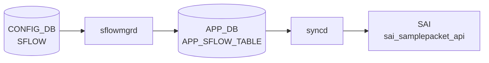

# SFLOW テーブル

## 概要

sFlow サンプリングのグローバル設定 / per-port セッション設定 / コレクタ宛先を定義する 3 つの container を含む。`hsflowd` (sflowd container) と `sflowmgrd` が [CONFIG_DB](../../reference/glossary.md#term-config_db) を購読する[^1]。

<!-- cdb-mermaid -->
### データフロー (自動生成)



!!! note "凡例"
    CONFIG_DB から SAI までの典型経路を `docs/reference/config-db-orch-map.md` から機械生成したミニ図。詳細・例外は本ページ本文と対応表を参照。
<!-- /cdb-mermaid -->

<!-- pubsub -->
## 通信メカニズム (Phase G)

### CONFIG_DB Subscribe — sflowmgrd

`sflowmgrd` は `cfgmgr/sflowmgr.cpp` 内で `Orch(tableNames)` を継承し、以下のテーブルを **subscribe** (Consumer) として登録する。

| 購読テーブル | DB | 用途 |
|---|---|---|
| `SFLOW` (CFG_SFLOW_TABLE_NAME) | CONFIG_DB | グローバル有効化・polling_interval・agent_id・sample_direction |
| `SFLOW_SESSION` (CFG_SFLOW_SESSION_TABLE_NAME) | CONFIG_DB | per-port または `all` キーのセッション設定 |
| `PORT` (CFG_PORT_TABLE_NAME) | CONFIG_DB | ポート速度取得（デフォルトサンプリングレート算出用） |
| `PORT_TABLE` (STATE_PORT_TABLE_NAME) | STATE_DB | oper_speed 変化の監視（オートネゴ時レート自動更新） |

`doTask()` で受信した `SET` / `DEL` コマンドを処理し、結果を APP_DB の `APP_SFLOW_TABLE` / `APP_SFLOW_SESSION_TABLE` へ **ProducerStateTable** で書き込む。

```
CONFIG_DB
  SFLOW|global         --SET--> sflowmgrd.doTask()
  SFLOW_SESSION|<port> --SET--> sflowmgrd.doTask()
  PORT|<ifname>        --SET--> sflowmgrd.sflowUpdatePortInfo()
STATE_DB
  PORT_TABLE|<ifname>  --SET--> sflowmgrd.sflowProcessOperSpeed()
```

### hsflowd との通信 — sflowHandleService()

`sflowmgrd` は **hsflowd** プロセス（`sflowd` Docker コンテナ内の sFlow エージェント）とプロセス間シグナル（`service hsflowd restart / stop`）で通信する。Redis Pub/Sub ではなく OS サービス制御コマンドを用いる点が他 mgr と異なる。

```
admin_state=up  → swss::exec("service hsflowd restart")
admin_state=down → swss::exec("service hsflowd stop")
```

`agent_id` が設定されている場合は hsflowd 設定ファイルに `agent { ip <x> }` を注入して再起動する。

### APP_DB → SflowOrch (orchagent) Subscribe

`orchdaemon.cpp` が `SflowOrch` を `m_applDb`（APP_DB）に接続して生成する。

```cpp
// orchdaemon.cpp:439-444
vector<string> sflow_tables = {
    APP_SFLOW_TABLE_NAME,
    APP_SFLOW_SESSION_TABLE_NAME,
    APP_SFLOW_SAMPLE_RATE_TABLE_NAME
};
SflowOrch *sflow_orch = new SflowOrch(m_applDb, sflow_tables);
```

`SflowOrch::doTask()` は APP_DB の変更を受け取り `sai_samplepacket_api` を呼び出す。

### SAI samplepacket_api 呼び出し

`sfloworch.cpp` が `sai_samplepacket_api` グローバルポインタを使用し、ASIC にサンプリングセッションを設定する。

| SAI API | 呼び出し条件 | 説明 |
|---|---|---|
| `sai_samplepacket_api->create_samplepacket()` | 新しいレートのセッションが存在しない | `SAI_SAMPLEPACKET_ATTR_SAMPLE_RATE` を設定してセッション作成 |
| `sai_samplepacket_api->remove_samplepacket()` | ref_count が 0 になったとき | 既存セッション削除 |
| `sai_port_api->set_port_attribute()` SAI_PORT_ATTR_INGRESS_SAMPLEPACKET_ENABLE | direction=`rx` または `both` | ポート ingress にセッション紐付け |
| `sai_port_api->set_port_attribute()` SAI_PORT_ATTR_EGRESS_SAMPLEPACKET_ENABLE | direction=`tx` または `both` | ポート egress にセッション紐付け |

複数ポートが同じサンプリングレートを共有する場合、`m_sflowRateSampleMap` でセッションを ref_count 管理して再利用する（`sfloworch.cpp:63-108`）。

### メッセージフロー全体図

```
CONFIG_DB SFLOW|global (admin_state=up)
  └─ sflowmgrd (cfgmgr)
       ├─ APP_DB APP_SFLOW_TABLE ──── SflowOrch.sflowStatusSet()
       ├─ APP_DB APP_SFLOW_SESSION_TABLE
       │    └─ SflowOrch.doTask()
       │         └─ sai_samplepacket_api->create_samplepacket()
       │         └─ sai_port_api->set_port_attribute(INGRESS/EGRESS)
       └─ service hsflowd restart  (UDP export to collector)
```

<!-- /pubsub -->

## key / 構造

```text
SFLOW|global               # グローバル
SFLOW_SESSION|<port>       # per-port 設定 (port = 'all' でグローバル既定)
SFLOW_COLLECTOR|<name>     # コレクタ
```

## SFLOW (global)

| フィールド | 型 | 既定 | 説明 |
|-----------|----|------|------|
| `admin_state` | `up`/`down` | `down` | sFlow 全体の有効化 |
| `polling_interval` | uint16 (`0` または 5..300) | 20 | カウンタ収集間隔 [秒] |
| `agent_id` | union leafref / Vlan pattern | - | agent ID として使う interface |
| `sample_direction` | enum `rx`/`tx`/`both` | `rx` | サンプリング方向 |

## SFLOW_SESSION (per-port)

| フィールド | 型 | 既定 | 説明 |
|-----------|----|------|------|
| `admin_state` | `up`/`down` | `up` | port ごとの sFlow 有効化 |
| `sample_rate` | uint32 (256..8388608) | - | 1/N パケットサンプリング (`port != 'all'` 限定) |
| `sample_direction` | enum `rx`/`tx`/`both` | `rx` | 方向 |

key の `port` は `PORT.name` または `'all'` (全ポート既定)。

## SFLOW_COLLECTOR

| フィールド | 型 | 既定 | 必須 | 説明 |
|-----------|----|------|------|------|
| `collector_ip` | ip-address | - | yes | コレクタの IPv4 / IPv6 |
| `collector_port` | inet:port-number | 6343 | no | UDP ポート |
| `collector_vrf` | string `mgmt`/`default` | - | no | コレクタへ到達する [VRF](../../reference/glossary.md#term-vrf) |

最大 2 コレクタ (`max-elements 2`)。`collector_vrf = 'mgmt'` は `MGMT_VRF_CONFIG.vrf_global.mgmtVrfEnabled = 'true'` のときのみ許容 (`must`)。

## 購読者

- `sflowmgrd` (`docker-sflow`): [CONFIG_DB](../../reference/glossary.md#term-config_db) → `hsflowd` 設定生成
- `hsflowd`: sampling / counter export 実体

## 関連 CONFIG_DB / YANG / CLI

- 関連 [CONFIG_DB](../../reference/glossary.md#term-config_db): `PORT`、`PORTCHANNEL`、`MGMT_PORT`、`MGMT_VRF_CONFIG`
- 関連 CLI: `config sflow enable/disable/polling-interval/agent-id/collector/interface`
- 関連 [YANG](../../reference/glossary.md#term-yang): `sonic-sflow`

<!-- ref-triangle:start -->

## 関連リファレンス

- [YANG](../../reference/glossary.md#term-yang): [`sonic-sflow`](../yang/sonic-sflow.md)
- CLI: [`config sflow`](../cli/config-sflow.md)

<!-- ref-triangle:end -->

## 引用元

[^1]: [YANG](../../reference/glossary.md#term-yang) 定義: `sonic-sflow.yang`. <https://github.com/sonic-net/sonic-buildimage/blob/9ea932ec2e18f35e58268ec2e4456b1d4afd65cd/src/sonic-yang-models/yang-models/sonic-sflow.yang>

<!-- topics-back-ref -->
## 関連 Topics

- [Topics: Telemetry / SNMP / Observability](../../topics/09-telemetry-snmp/index.md)

<!-- /topics-back-ref -->

<!-- ops-hint -->
## 運用ヒント

### 典型値

- key 形式: `SFLOW|global` と `SFLOW_SESSION|<port>`、`SFLOW_COLLECTOR|<name>`。
- `admin_state`: `up`。
- `polling_interval`: 20（秒）。
- `agent_id`: `Loopback0` 等。

### よくある誤設定

- `agent_id` を management IF にすると collector 側で device 識別が混乱。

### 確認コマンド

```bash
sonic-db-cli CONFIG_DB hgetall 'SFLOW|global'
show sflow
```
<!-- /ops-hint -->

<!-- value-behavior -->
## 値依存挙動マトリクス

### グローバル `admin_state` 値別挙動
| 値 | 挙動 |
|----|------|
| `up` | sFlow 全体有効化（`m_gEnable = true`）。per-port 設定と AND で各ポートのサンプリングを制御。 |
| `down` | sFlow 全体無効化（デフォルト）。`isPortEnabled()` が常に `false` になり per-port `admin_state=up` でも全ポート停止。 |

### per-port `admin_state` 値別挙動
| 値 | 挙動 |
|----|------|
| `up` | ポートごとの有効化。グローバル `admin_state=up` のときのみ実際に有効。 |
| `down` | ポートごとの無効化。`admin == "up"` チェック失敗でサンプリング停止。 |

### `sample_direction` 値別挙動（グローバル / per-port 共通）
| 値 | 挙動 |
|----|------|
| `rx` | 受信パケットのみサンプリング（デフォルト `m_gDirection = "rx"`）。 |
| `tx` | 送信パケットのみサンプリング。 |
| `both` | 送受信両方サンプリング。 |

### `collector_vrf` 値別挙動
| 値 | 挙動 |
|----|------|
| `mgmt` | `MGMT_VRF_CONFIG.vrf_global.mgmtVrfEnabled = 'true'` のときのみ YANG `must` 制約で許容。 |
| `default` | デフォルト [VRF](../../reference/glossary.md#term-vrf) 経由でコレクタに送信。 |

<!-- /value-behavior -->

<!-- cdb-exceptions -->
## 例外条件・特殊挙動

- **PORT_TABLE consumer 未初期化**: sflowmgr 起動時に PORT_TABLE の consumer が見つからない場合 `SWSS_LOG_ERROR("Consumer object for PORT_TABLE not found")` を出す。per-port サンプリングレートの解決ができなくなる。[^2]
- **hsflowd サービス制御失敗**: `service hsflowd restart/stop` が失敗した場合 `SWSS_LOG_ERROR("Command failed with rc %d")` を出す。CONFIG_DB の状態と実際のサービス状態がずれる。[^2]
- **ポート名が map に未登録**: per-port のサンプリングレート算出時に PORT_TABLE に存在しないポートを指定すると `SWSS_LOG_ERROR("%s not found in port configuration map")` → `ERROR_SPEED` を返す。[^2]
- **[SAI](../../reference/glossary.md#term-sai) sample packet session 作成失敗**: `sai_samplepacket_api->create_samplepacket()` が失敗した場合 `SWSS_LOG_ERROR("Failed to create sample packet session")` → sFlow セッションが有効化されない。[^2]
- **既存セッションのクリーンアップ失敗**: レート変更時に古いセッションの destroy に失敗すると複数レートのセッションが ASIC に残留する可能性がある。[^2]
- **グローバル無効はローカル設定を上書き**: `isPortEnabled()` は `m_gEnable && (m_intfAllConf || ...)` で判定するため、グローバル sflow が無効なら per-port 設定に関わらず全ポートで sFlow は停止する。[^2]

[^2]: sflowmgr / sfloworch 実装: `sonic-swss/cfgmgr/sflowmgr.cpp`, `sonic-swss/orchagent/sfloworch.cpp`. <https://github.com/sonic-net/sonic-swss/blob/master/cfgmgr/sflowmgr.cpp>

<!-- failure -->
## 失敗挙動 (Phase D)

### PORT 未解決 → retry

`readPortConfig()` 呼び出し時に PORT_TABLE の consumer が `m_consumerMap` に存在しない場合、`SWSS_LOG_ERROR("Consumer object for PORT_TABLE not found")` を出力して処理をスキップする。ポート速度ベースのデフォルト `sample_rate` が解決できないため、`findSamplingRate()` は `ERROR_SPEED` を返し続ける。[^3]

ポート名が `m_sflowPortConfMap` に未登録の状態で `findSamplingRate()` を呼び出すと `SWSS_LOG_ERROR("%s not found in port configuration map")` を出力し `ERROR_SPEED` を返す。この値は `sflowExtractInfo()` で `rate=0` に変換され、`sfloworch` の `doTask` で `rate == 0` 判定によりセッション作成がスキップ・リトライ扱いとなる (`it++; continue;`)。[^3]

### 不正 sample_rate (rate=0 スキップ)

APP_DB に `sample_rate=error` が書き込まれた場合、`sfloworch` の `sflowExtractInfo()` は `rate=0` にフォールバックする。新規ポート処理時に `rate == 0` であれば `doTask` がエントリを次回処理に持ち越すため、そのポートの sFlow セッションは作成されない。[^3]

### SAI samplepacket 失敗

`sai_samplepacket_api->create_samplepacket()` が失敗すると `SWSS_LOG_ERROR("Failed to create sample packet session with rate %d")` を出力し `false` を返す。呼び出し元 `doTask` は `it++; continue;` でリトライキューに残す。[^3]

レート変更時の `remove_samplepacket()` が失敗した場合は `SWSS_LOG_ERROR("Failed to destroy sample packet session with id ...")` を出力するが処理を続行する。古いレートのセッションが ASIC に残留し、複数レートのセッションが混在するリスクがある。[^3]

`sai_port_api->set_port_attribute()` (`SAI_PORT_ATTR_INGRESS_SAMPLEPACKET_ENABLE` / `SAI_PORT_ATTR_EGRESS_SAMPLEPACKET_ENABLE`) が失敗すると `SWSS_LOG_ERROR("Failed to set session ... on port ...")` を出力し `false` を返す。`doTask` は `it++; continue;` でそのポートエントリを次回処理に持ち越す (retry)。[^3]

### hsflowd サービス制御失敗

`swss::exec("service hsflowd restart/stop")` が非ゼロ終了コードを返した場合、`SWSS_LOG_ERROR("Command '%s' failed with rc %d")` を出力して処理を継続する。CONFIG_DB の `admin_state` と実際の hsflowd サービス状態がずれたままになる。[^3]

[^3]: 失敗挙動抽出: `sonic-swss/cfgmgr/sflowmgr.cpp`, `sonic-swss/orchagent/sfloworch.cpp`. <https://github.com/sonic-net/sonic-swss/blob/master/orchagent/sfloworch.cpp>

<!-- /failure -->

<!-- derivation -->
## 派生・条件付き登録 (Phase 6/7)

### Phase 6: 自動派生

sflowmgrd が `SFLOW.admin_state==up` の場合に hsflowd 設定ファイルを生成して hsflowd を起動する。`agent_id` フィールドがある場合は指定インターフェースの IP を agent IP として自動的に hsflowd 設定に反映する。

### Phase 7: 条件付き登録 (add_manager 条件)

sflowmgrd は常時起動し `SFLOW` / `SFLOW_SESSION` テーブルを無条件購読する。`SFLOW.admin_state==down` の場合は hsflowd を停止する。`agent_id` に指定したインターフェースが存在しない場合はログ警告して agent IP 設定をスキップ。

<!-- /derivation -->

<!-- handler-branching -->
### Phase 8: Handler メソッド内分岐

| Handler | 分岐条件 | 効果 | evidence |
|---|---|---|---|
| `sflowmgrd` | `admin_state==up` | hsflowd 設定ファイル生成 + サービス起動 | `sflowmgrd` |
| `sflowmgrd` | `admin_state==down` | hsflowd サービス停止 | `sflowmgrd` |
| `sflowmgrd` | `agent_id` フィールドあり | 指定 IF の IP を `agent { ip <x> }` として設定 | `sflowmgrd` |
| `sflowmgrd` SFLOW_SESSION | `admin_state==down` | ポートの sFlow を無効化 | `sflowmgrd` |
| `sflowmgrd` SFLOW_SESSION | key が `all` | 全ポートに設定を適用 | `sflowmgrd` |
| `sflowmgrd` SFLOW_SESSION | `sample_rate` フィールドあり | ポートごとのサンプリングレートを明示設定 | `sflowmgrd` |

> **スキャン証跡**: `SFLOW` テーブルは hsflowd 設定生成のための入力。admin_state による主要分岐あり。SAI 経路はなし (ユーザースペース制御)。

<!-- /handler-branching -->

<!-- runtime-trace -->
## CDB → 実コンテナ動作トレース

### 段階 1: Consumer 登録

- **sflowmgrd** (`sonic-swss/cfgmgr/sflowmgr.cpp`): `SFLOW` / `SFLOW_SESSION` テーブルを `ConfigDBConnector` で購読。

### 段階 2: CFG → APPL 翻訳

- sflowmgrd が `hsflowd` (sFlow エージェント) の設定ファイルを更新し再起動。
- ポート単位のサンプリングレート設定を APP_DB `SFLOW_SESSION_TABLE` に書き込み。

### 段階 3: APPL → SAI

- orchagent / SflowOrch が APP_DB `SFLOW_SESSION_TABLE` を購読し `sai_samplepacket_api` でハードウェアサンプリングを設定。

### 段階 4: タイミング + 副作用

- グローバル有効化 (`admin_state=up`) 後に各ポートのサンプリングが有効になる。
- 副作用: サンプリングレートを低くしすぎると CPU 負荷が増大。デフォルト 512 は一般的な設定。

<!-- /runtime-trace -->
<!-- entry-points -->
## 書き込み入り口 (Direction A)

SFLOW / SFLOW_SESSION / SFLOW_COLLECTOR テーブルへの書き込みが発生するコード経路を網羅的に調査した結果。

### CLI

  - `config sflow enable/disable/polling-interval/...` — `config/main.py` が `mod_entry('SFLOW', 'global', ...)` を呼ぶ (sonic-utilities/config/main.py:9066–9260)
  - `config sflow interface enable/disable ...` — `config/main.py` が `mod_entry('SFLOW_SESSION', ifname, ...)` を呼ぶ (sonic-utilities/config/main.py:9192–9260)

### minigraph / sonic-cfggen

minigraph.py に sFlow テーブル生成なし

### REST / gNMI

**sonic-mgmt-common** `translib/transformer/xfmr_sflow.go` が REST/gNMI 経由で SFLOW テーブルを書き込む (sonic-mgmt-common/translib/transformer/xfmr_sflow.go)

### db_migrator

**db_migrator.py** が SFLOW のマイグレーション処理を実装 (sonic-utilities/scripts/db_migrator.py)

### ビルド時デフォルト (build-time default)

なし

### ハードコードデフォルト / ランタイム注入

なし

### 死活・デッドコード

なし
<!-- /entry-points -->

<!-- side-effects -->
## 副次 DB 書込 (Phase F — Direction B)

CONFIG_DB SFLOW / SFLOW_SESSION テーブルへの書込をトリガーとして、他 DB・テーブルへ副次的に書き込まれる経路を `sflowmgr.cpp` / `sfloworch.cpp` から抽出した。

### 1. APPL_DB `SFLOW_TABLE` への書込 (sflowmgrd 直接転送)

`SFLOW|global` SET 時に `m_appSflowTable.set(key, values)` でフィールドをそのまま APPL_DB `SFLOW_TABLE` に転送する (sflowmgr.cpp:468)。DEL 時は `m_appSflowTable.del(key)` (sflowmgr.cpp:550)。SflowOrch はこの APPL_DB エントリを購読して `m_sflowStatus` を更新し、SAI samplepacket 操作の前提条件とする。[^3]

### 2. APPL_DB `SFLOW_SESSION_TABLE` への書込 (sflowmgrd)

| トリガー | 書込条件 | 書込フィールド | evidence |
|---------|---------|--------------|---------|
| `SFLOW\|global` admin_state=up | `sflowHandleSessionAll(true)` — 全ポートを走査 | `admin_state` / `sample_rate` / `sample_direction` | sflowmgr.cpp:246 |
| `SFLOW\|global` admin_state=down | `sflowHandleSessionAll(false)` — ローカル設定なしポートを削除 | キー削除 | sflowmgr.cpp:250 |
| `SFLOW_SESSION\|<port>` SET (gEnable=true) | `sflowCheckAndFillValues()` で補完後 set | `admin_state` / `sample_rate` / `sample_direction` | sflowmgr.cpp:533 |
| `SFLOW_SESSION\|<port>` DEL | `m_appSflowSessionTable.del(key)` | キー削除 | sflowmgr.cpp:567 |
| `SFLOW_SESSION\|all` SET | `sflowHandleSessionAll()` で全ポート一斉更新 | `admin_state` / `sample_rate` / `sample_direction` | sflowmgr.cpp:513 |
| PORT 速度変化 (oper_speed 更新) | `sflowProcessOperSpeed()` → rate_update=true のとき | `sample_rate` を速度ベースで自動更新 | sflowmgr.cpp:211 |

`sample_rate` は `findSamplingRate()` が `oper_speed` (優先) または `cfg_speed` を返す。ポートが port configuration map に存在しない場合は `ERROR_SPEED` を返す (sflowmgr.cpp:391)。[^3]

### 3. ASIC_DB — SAI samplepacket セッション操作 (SflowOrch 経由)

SflowOrch が APPL_DB `SFLOW_SESSION_TABLE` を購読し、SAI API でハードウェアサンプリングを設定する。

#### 3a. `sai_samplepacket_api->create_samplepacket()`

新しいサンプリングレートのセッション作成 (sfloworch.cpp:29):

```
attr.id = SAI_SAMPLEPACKET_ATTR_SAMPLE_RATE
attr.value.u32 = rate
sai_samplepacket_api->create_samplepacket(&session_id, gSwitchId, 1, &attr)
```

セッションは `m_sflowRateSampleMap[rate]` で参照カウント管理し、複数ポートが同レートを共有する。[^3]

#### 3b. `sai_port_api->set_port_attribute()` — ポート samplepacket 設定

| 方向条件 | SAI 属性 | 有効化時の値 | 無効化時の値 |
|---------|---------|-----------|-----------|
| `rx` または `both` | `SAI_PORT_ATTR_INGRESS_SAMPLEPACKET_ENABLE` | `session_id` | `SAI_NULL_OBJECT_ID` |
| `tx` または `both` | `SAI_PORT_ATTR_EGRESS_SAMPLEPACKET_ENABLE` | `session_id` | `SAI_NULL_OBJECT_ID` |

evidence: sfloworch.cpp:119–150 (`sflowAddPort`), sfloworch.cpp:161–195 (`sflowDelPort`)[^3]

#### 3c. `sai_samplepacket_api->remove_samplepacket()`

セッションの参照カウントがゼロになったとき削除 (sfloworch.cpp:49)。レート変更時には古いセッションの `destroy` → 新セッション `create` の順で実行。[^3]

### 4. OS — hsflowd サービス制御 (sflowmgrd)

`SFLOW|global` の `admin_state` が変化したとき `sflowHandleService()` がシステムコマンドを発行:

| 条件 | コマンド | 効果 |
|------|---------|------|
| `admin_state` が `down` → `up` へ | `service hsflowd restart` | hsflowd プロセスを起動・再起動 |
| `admin_state` が `up` → `down` へ | `service hsflowd stop` | hsflowd プロセスを停止 |

evidence: sflowmgr.cpp:58–62。hsflowd は sFlow パケットをコレクタへ UDP 送信するユーザースペースデーモン。SAI 経路（ハードウェアサンプリング）とは独立して動作する。[^3]

[^3]: 副次書込調査: `sonic-swss/cfgmgr/sflowmgr.cpp`, `sonic-swss/orchagent/sfloworch.cpp`. <https://github.com/sonic-net/sonic-swss/blob/master/cfgmgr/sflowmgr.cpp>

<!-- /side-effects -->
<!-- constants -->
## ハードコード定数 (Phase E)

ソース: `sonic-swss/orchagent/sfloworch.cpp`, `sonic-swss/cfgmgr/sflowmgr.cpp`, `sonic-buildimage/src/sonic-yang-models/yang-models/sonic-sflow.yang`

| 定数 | 値 | 場所 |
|------|-----|------|
| `sample_rate` 最小値 | `256` | `sonic-sflow.yang` L128: `range "256..8388608"` |
| `sample_rate` 最大値 | `8388608` | `sonic-sflow.yang` L128 |
| `collector_port` デフォルト | `6343` (UDP, IANA 割当) | `sonic-sflow.yang` L81: `default 6343;` |
| `polling_interval` デフォルト | `20` 秒 | `sonic-sflow.yang` L163: `default 20;` |
| `polling_interval` 有効範囲 | `0` または `5..300` | `sonic-sflow.yang` L158 |
| グローバル `admin_state` 初期値 | `false` (`m_gEnable = false`) | `sflowmgr.cpp` L19 コンストラクタ |
| グローバル `sample_direction` 初期値 | `"rx"` (`m_gDirection = "rx"`) | `sflowmgr.cpp` L20 コンストラクタ |
| `SFLOW_SESSION\|all` 初期状態 | `m_intfAllConf = true`（全ポート有効） | `sflowmgr.cpp` L18 コンストラクタ |
| `ERROR_SPEED` | `"error"` 文字列 | `sflowmgr.h` L13: `#define ERROR_SPEED "error"` |
| `NA_SPEED` | `"N/A"` 文字列 | `sflowmgr.h` L14: `#define NA_SPEED "N/A"` |
| デフォルト sampling rate | ポート `oper_speed` 値（line rate と等しい） | `sflowmgr.cpp` L385-401 `findSamplingRate()` |
| コレクタ最大数 | `2` | `sonic-sflow.yang` `max-elements 2` |
| SAI samplepacket attribute | `SAI_SAMPLEPACKET_ATTR_SAMPLE_RATE` | `sfloworch.cpp` L26 |
| SAI API | `sai_samplepacket_api->create_samplepacket()` / `remove_samplepacket()` | `sfloworch.cpp` L29, L49 |

**備考**:

- `sample_rate` の YANG 範囲 (`256..8388608`) はハードウェア制約に由来し、YANG モデルで enforce される。
- デフォルト sampling rate はポートの `oper_speed`（Mbps 単位数値文字列）を 1:1 で使用。例: 100GbE → `100000`。`oper_speed` が未定義の場合は `cfg_speed` にフォールバック。
- `agent_id` フィールドのデフォルト値は仕様・コードともに明示されない（オプションフィールド）。

<!-- /constants -->
<!-- platform -->
## プラットフォーム差異

### ASIC capability クエリ

`sfloworch` は `sai_samplepacket_api->create_samplepacket()` を呼ぶ前に ASIC の capability を事前クエリしない。SAI レイヤで拒否された場合にのみ `SWSS_LOG_ERROR` が出力される。サポートする最小・最大 sample rate はベンダー SAI 実装に依存する。

### ベンダー sample rate 限界差

[YANG](../../reference/glossary.md#term-yang) 制約で `sample_rate` は `uint32 (256..8388608)` に制限される。デフォルト値は `findSamplingRate()` がポートの `oper_speed`（または設定済み `speed`）をそのまま使用（例: 100GE → 100000）。ベンダー [ASIC](../../reference/glossary.md#term-asic) によってはこの範囲内でも対応できないレートがあるが、ソフトウェア側は SAI エラーとしてのみ検出する。

`oper_speed` は STATE_DB に orchagent が書き込む場合のみ追跡される（ベンダー実装依存）。oper_speed が存在する場合は cfg_speed より優先される（[^3]）。

### tx / egress サンプリングのプラットフォーム依存性

`sample_direction = tx` または `both` の場合、`sfloworch` は `SAI_PORT_ATTR_EGRESS_SAMPLEPACKET_ENABLE` を設定する。egress samplepacket を**サポートしない [ASIC](../../reference/glossary.md#term-asic)** では `set_port_attribute` が失敗し、tx / both 方向のサンプリングは動作しない。`rx` 方向（`SAI_PORT_ATTR_INGRESS_SAMPLEPACKET_ENABLE`）はほぼ全ベンダーが対応している（[^3]）。

### VOQ chassis

`sfloworch.cpp` および `sflowmgr.cpp` に VOQ chassis 固有のコードパスは存在しない。sFlow は物理フロントパネルポートレベルで管理され、VOQ system port や fabric port への sFlow 設定はサポートされない（[^3]）。

[^3]: sfloworch / sflowmgr 実装調査: `sonic-swss/orchagent/sfloworch.cpp`, `sonic-swss/cfgmgr/sflowmgr.cpp`. <https://github.com/sonic-net/sonic-swss/blob/master/orchagent/sfloworch.cpp>

<!-- /platform -->

<!-- defaults -->
## コード由来の暗黙デフォルト (Phase A)

### SflowMgr コンストラクタのハードコード初期値

`sflowmgr.cpp` コンストラクタで以下の内部状態が初期化される。これらは CONFIG_DB に対応するフィールドがない:

| 内部変数 | 初期値 | 意味 |
|---------|-------|------|
| `m_gEnable` | `false` | グローバル admin_state 内部表現。YANG `default "down"` と一致。 |
| `m_gDirection` | `"rx"` | グローバル sample_direction 内部表現。YANG `default "rx"` と一致。 |
| `m_intfAllConf` | `true` | SFLOW_SESSION\|all 未設定時の「全ポートにグローバル設定を適用」フラグ。CONFIG_DB / YANG に対応フィールドなし。SFLOW_SESSION\|all を DEL すると `true` に戻る。 |
| `m_intfAllDir` | `"rx"` | SFLOW_SESSION\|all の direction 内部表現。 |

### `sample_rate` — 速度由来動的デフォルト

`sample_rate` を SFLOW_SESSION に指定しない場合、`findSamplingRate()` がポートの **oper_speed**（なければ cfg_speed の文字列）をそのまま返す。つまりサンプリングレートはポート速度文字列（例: `"1000"`, `"10000"`）になる。ポートが未登録の場合は `"error"` を返し、SflowOrch は rate=0 としてセッション作成をスキップする。

### `sample_direction` — YANG-実装 discrepancy (D1)

YANG では `SFLOW_SESSION.sample_direction default "rx"` だが、実装 (`sflowmgr.cpp:374-378`) では per-port に direction が指定されていない場合、固定 `"rx"` ではなく `m_gDirection`（グローバルの現在値）を採用する。グローバル direction が `"tx"` や `"both"` に変更された後に per-port セッションを作成すると、YANG default とは異なる値が APP_DB に書き込まれる。**書込み順依存乖離**。

### `admin_state` — 欠落時の `"up"` 注入

per-port セッションに `admin_state` フィールドが存在しない場合、sflowmgrd は `"up"` をハードコードで注入する (`sflowmgr.cpp:364-368`)。YANG `default "up"` と一致するが、実装側でも明示的に強制している。

### `agent_id` — 欠落時のサイレントスキップ

`SFLOW.global.agent_id` が CONFIG_DB に存在しない場合、sflowmgrd は hsflowd 設定ファイルの agent IP 行を生成しない。エラーログなし（silent drop）。hsflowd 自身のデフォルト agent IP 選択ロジックが使われる。

### SflowOrch の書込み順依存 (D3)

SflowOrch は `m_sflowStatus = false` で初期化され、APP_SFLOW_TABLE の SET で `true` になるまで per-port SESSION の SET を全て無視する。APP_SFLOW_TABLE より先に APP_SFLOW_SESSION_TABLE が届くと per-port 設定が捨てられる。
<!-- /defaults -->

<!-- ordering -->
## 書込み順依存 (Phase B)

SFLOW テーブル群を CONFIG_DB へ書き込む際の **必須・推奨順序** を実装コードから導出した。

### O1: `PORT` → `SFLOW_SESSION` (必須)

`sflowmgr.cpp:522-528`: per-port SESSION の SET イベント処理時に `m_sflowPortConfMap` にポートが未登録だと `it++; continue` で永続スキップされる（リトライなし）。

```
PORT|<port>  SET  →  SFLOW_SESSION|<port>  SET
```

### O2: `SFLOW|global` admin=up → `SFLOW_SESSION` の APP_DB 反映 (実質必須)

`sflowmgr.cpp:531-534`: `m_gEnable == false` の場合、per-port SESSION を書いても APP_DB には書かれない。グローバルを後から up にすると `sflowHandleSessionAll/Local()` が再適用する。

```
SFLOW|global (admin_state=up)  →  SFLOW_SESSION|<port>  SET
```

### O3: `APP_SFLOW_TABLE` → `APP_SFLOW_SESSION_TABLE` (SflowOrch 段・必須)

`sfloworch.cpp:365-392`: `m_sflowStatus = false` の間は SESSION テーブルの全 SET を `return` でスキップする。APP_SFLOW_TABLE の SET が届くまで SESSION は永続無視。

```
APP_SFLOW_TABLE  SET  →  APP_SFLOW_SESSION_TABLE  SET
```

### O4: `SFLOW_SESSION|all` → `SFLOW_SESSION|<port>` (推奨)

`sflowmgr.cpp:374-382`: per-port に `sample_direction` 未指定の場合 `m_gDirection` (グローバル方向) をフォールバックとして採用。`SFLOW_SESSION|all` が先行すると `sflowHandleSessionAll()` が全ポートに正しい方向を適用してから per-port 設定が上書きする。順序が逆だと per-port の初期 direction が `m_gDirection` 固定になる。

### O5: oper_speed 確定 → `SFLOW_SESSION` 書込み (推奨)

`sflowmgr.cpp:385-401`: `sample_rate` 未指定時は `oper_speed`（STATE_DB）優先、なければ `cfg_speed` を使う。ポート up 前に書き込むと cfg_speed ベースの暫定レートが入る。`local_rate_cfg=false` の場合は oper_speed 確定時に自動更新される。

### 推奨書込み順序（総合）

```
1. PORT|<port>              (ポート登録)
2. SFLOW|global             (admin_state=up、グローバル有効化)
3. SFLOW_SESSION|all        (全ポートデフォルト方向・admin 設定)
4. SFLOW_SESSION|<port>     (per-port 個別設定)
5. SFLOW_COLLECTOR|<name>   (コレクタ設定、hsflowd は再起動で反映)
```

ステップ 2 と 3 を入れ替えると per-port の初期 direction が不定になるリスクがある。ステップ 1 より先に 4 を書くとエントリが永続スキップされる（O1 違反）。

<!-- /ordering -->

<!-- cross-refs -->
## 暗黙参照 — Phase C (cross-table refs)

> **調査根拠**: `sonic-swss/cfgmgr/sflowmgr.cpp`, `sonic-swss/orchagent/sfloworch.cpp` 全行精読 (2026-05-16)
> 詳細証跡: `meta/_intermediate/cdb-flow/sflow-cross-refs.md`

`SFLOW` / `SFLOW_SESSION` / `SFLOW_COLLECTOR` テーブルは YANG leafref を最小限しか持たないが、実行時に以下のテーブルを暗黙参照する。

| 参照先 | DB | 参照方向 | YANG leafref | 実装上の必須度 | 証拠 |
|---|---|---|---|---|---|
| `PORT\|<name>` | CONFIG_DB | 読み取り (speed → デフォルトサンプリングレート算出) | なし | 実質必須 | sflowmgr.cpp:26,34,409 |
| `PORT_TABLE\|<name>` | STATE_DB | 読み取り (oper_speed 変化 → サンプリングレート更新) | なし | 実質必須 | sflowmgr.cpp:414,184,195 |
| `PORT\|<name>` (gPortsOrch 経由) | CONFIG_DB | 読み取り (ポート OID → SAI samplepacket 設定) | なし | 実質必須 | sfloworch.cpp:370,382 |
| `MGMT_VRF_CONFIG\|vrf_global` | CONFIG_DB | 読み取り (mgmtVrfEnabled チェック) | must 制約 | `collector_vrf=mgmt` 時必須 | sonic-sflow.yang must 制約 |

### PORT (CONFIG_DB) — デフォルトサンプリングレートの算出前提

`SflowMgr` は `doTask()` で `table == CFG_PORT_TABLE_NAME` を処理し (`sflowmgr.cpp:409`)、ポートの `speed` フィールドを `m_sflowPortConfMap` に記録する。`findSamplingRate()` がこのマップを参照してデフォルトサンプリングレートを返す (`sflowmgr.cpp:385-401`)。

`PORT_TABLE` consumer が未登録の場合 `SWSS_LOG_ERROR("Consumer object for PORT_TABLE not found")` が出力され、全ポートのデフォルトレートが `ERROR_SPEED` になる (`sflowmgr.cpp:34`)。**YANG leafref は存在しないが、ポート速度 → サンプリングレートの暗黙前提が実装上必須**。

### STATE_DB PORT_TABLE — oper_speed フィードバック

`SflowMgr` は `STATE_PORT_TABLE_NAME` も consumer として購読し (`sflowmgr.cpp:414`)、oper speed が変化した場合に `sflowProcessOperSpeed()` を呼んでサンプリングレートを再計算・更新する (`sflowmgr.cpp:167-218`)。

オートネゴシエーション環境では CONFIG_DB の `speed` と実際のリンク速度がずれるため、STATE_DB `PORT_TABLE.speed` (oper_speed) への依存が実質必須となる。

### PORT (orchagent / gPortsOrch 経由) — SAI ポート OID 解決

`SflowOrch::doTask()` は `gPortsOrch->allPortsReady()` で全ポート初期化完了を待ち (`sfloworch.cpp:370`)、`gPortsOrch->getPort(alias, port)` でポート名を SAI Port OID に変換する (`sfloworch.cpp:382`)。

`SFLOW_SESSION|<port>` の key として指定されたポート名が `PORT` テーブルに存在しないと OID 取得に失敗し、`sai_port_api->set_port_attribute()` が呼ばれない（セッションが ASIC に設定されない）。

### MGMT_VRF_CONFIG — collector_vrf=mgmt の YANG must 制約

`SFLOW_COLLECTOR.collector_vrf = 'mgmt'` を設定する場合、YANG `must` 制約が `MGMT_VRF_CONFIG|vrf_global.mgmtVrfEnabled = 'true'` であることを要求する (sonic-sflow.yang)。この制約は実装コードではなく YANG バリデーション層で強制される。

### SFLOW_COLLECTOR — hsflowd が直接参照

C++ レベルの `sflowmgr.cpp` / `sfloworch.cpp` に `SFLOW_COLLECTOR` を直接読み込むコードはない。`SFLOW_COLLECTOR` テーブルは **hsflowd** (ユーザー空間 sFlow エージェント) が CONFIG_DB から直接読み取り、コレクタ IP / ポート / VRF を設定ファイルに反映する。`sflowmgrd` は hsflowd の起動トリガーに徹する。

### SAI 参照

`SflowOrch` が `sai_samplepacket_api` および `sai_port_api` を使用する。`SFLOW` / `SFLOW_SESSION` テーブルは間接的に `SAI_PORT_ATTR_INGRESS/EGRESS_SAMPLEPACKET_ENABLE` 属性に影響する。

<!-- /cross-refs -->
<!-- glossary-links-injected: 8e8594481100 -->
