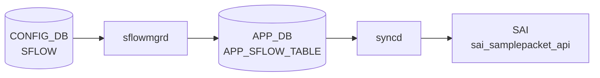

# SFLOW テーブル

## 概要

sFlow サンプリングのグローバル設定 / per-port セッション設定 / コレクタ宛先を定義する 3 つの container を含む。`hsflowd` (sflowd container) と `sflowmgrd` が [CONFIG_DB](../../reference/glossary.md#term-config_db) を購読する[^1]。

<!-- cdb-mermaid -->
### データフロー (自動生成)



!!! note "凡例"
    CONFIG_DB から SAI までの典型経路を `docs/reference/config-db-orch-map.md` から機械生成したミニ図。詳細・例外は本ページ本文と対応表を参照。
<!-- /cdb-mermaid -->

## key / 構造

```text
SFLOW|global               # グローバル
SFLOW_SESSION|<port>       # per-port 設定 (port = 'all' でグローバル既定)
SFLOW_COLLECTOR|<name>     # コレクタ
```

## SFLOW (global)

| フィールド | 型 | 既定 | 説明 |
|-----------|----|------|------|
| `admin_state` | `up`/`down` | `down` | sFlow 全体の有効化 |
| `polling_interval` | uint16 (`0` または 5..300) | 20 | カウンタ収集間隔 [秒] |
| `agent_id` | union leafref / Vlan pattern | - | agent ID として使う interface |
| `sample_direction` | enum `rx`/`tx`/`both` | `rx` | サンプリング方向 |

## SFLOW_SESSION (per-port)

| フィールド | 型 | 既定 | 説明 |
|-----------|----|------|------|
| `admin_state` | `up`/`down` | `up` | port ごとの sFlow 有効化 |
| `sample_rate` | uint32 (256..8388608) | - | 1/N パケットサンプリング (`port != 'all'` 限定) |
| `sample_direction` | enum `rx`/`tx`/`both` | `rx` | 方向 |

key の `port` は `PORT.name` または `'all'` (全ポート既定)。

## SFLOW_COLLECTOR

| フィールド | 型 | 既定 | 必須 | 説明 |
|-----------|----|------|------|------|
| `collector_ip` | ip-address | - | yes | コレクタの IPv4 / IPv6 |
| `collector_port` | inet:port-number | 6343 | no | UDP ポート |
| `collector_vrf` | string `mgmt`/`default` | - | no | コレクタへ到達する [VRF](../../reference/glossary.md#term-vrf) |

最大 2 コレクタ (`max-elements 2`)。`collector_vrf = 'mgmt'` は `MGMT_VRF_CONFIG.vrf_global.mgmtVrfEnabled = 'true'` のときのみ許容 (`must`)。

## 購読者

- `sflowmgrd` (`docker-sflow`): [CONFIG_DB](../../reference/glossary.md#term-config_db) → `hsflowd` 設定生成
- `hsflowd`: sampling / counter export 実体

## 関連 CONFIG_DB / YANG / CLI

- 関連 [CONFIG_DB](../../reference/glossary.md#term-config_db): `PORT`、`PORTCHANNEL`、`MGMT_PORT`、`MGMT_VRF_CONFIG`
- 関連 CLI: `config sflow enable/disable/polling-interval/agent-id/collector/interface`
- 関連 [YANG](../../reference/glossary.md#term-yang): `sonic-sflow`

<!-- ref-triangle:start -->

## 関連リファレンス

- [YANG](../../reference/glossary.md#term-yang): [`sonic-sflow`](../yang/sonic-sflow.md)
- CLI: [`config sflow`](../cli/config-sflow.md)

<!-- ref-triangle:end -->

## 引用元

[^1]: [YANG](../../reference/glossary.md#term-yang) 定義: `sonic-sflow.yang`. <https://github.com/sonic-net/sonic-buildimage/blob/9ea932ec2e18f35e58268ec2e4456b1d4afd65cd/src/sonic-yang-models/yang-models/sonic-sflow.yang>

<!-- topics-back-ref -->
## 関連 Topics

- [Topics: Telemetry / SNMP / Observability](../../topics/09-telemetry-snmp/index.md)

<!-- /topics-back-ref -->

<!-- ops-hint -->
## 運用ヒント

### 典型値

- key 形式: `SFLOW|global` と `SFLOW_SESSION|<port>`、`SFLOW_COLLECTOR|<name>`。
- `admin_state`: `up`。
- `polling_interval`: 20（秒）。
- `agent_id`: `Loopback0` 等。

### よくある誤設定

- `agent_id` を management IF にすると collector 側で device 識別が混乱。

### 確認コマンド

```bash
sonic-db-cli CONFIG_DB hgetall 'SFLOW|global'
show sflow
```
<!-- /ops-hint -->

<!-- value-behavior -->
## 値依存挙動マトリクス

### グローバル `admin_state` 値別挙動
| 値 | 挙動 |
|----|------|
| `up` | sFlow 全体有効化（`m_gEnable = true`）。per-port 設定と AND で各ポートのサンプリングを制御。 |
| `down` | sFlow 全体無効化（デフォルト）。`isPortEnabled()` が常に `false` になり per-port `admin_state=up` でも全ポート停止。 |

### per-port `admin_state` 値別挙動
| 値 | 挙動 |
|----|------|
| `up` | ポートごとの有効化。グローバル `admin_state=up` のときのみ実際に有効。 |
| `down` | ポートごとの無効化。`admin == "up"` チェック失敗でサンプリング停止。 |

### `sample_direction` 値別挙動（グローバル / per-port 共通）
| 値 | 挙動 |
|----|------|
| `rx` | 受信パケットのみサンプリング（デフォルト `m_gDirection = "rx"`）。 |
| `tx` | 送信パケットのみサンプリング。 |
| `both` | 送受信両方サンプリング。 |

### `collector_vrf` 値別挙動
| 値 | 挙動 |
|----|------|
| `mgmt` | `MGMT_VRF_CONFIG.vrf_global.mgmtVrfEnabled = 'true'` のときのみ YANG `must` 制約で許容。 |
| `default` | デフォルト [VRF](../../reference/glossary.md#term-vrf) 経由でコレクタに送信。 |

<!-- /value-behavior -->

<!-- cdb-exceptions -->
## 例外条件・特殊挙動

- **PORT_TABLE consumer 未初期化**: sflowmgr 起動時に PORT_TABLE の consumer が見つからない場合 `SWSS_LOG_ERROR("Consumer object for PORT_TABLE not found")` を出す。per-port サンプリングレートの解決ができなくなる。[^2]
- **hsflowd サービス制御失敗**: `service hsflowd restart/stop` が失敗した場合 `SWSS_LOG_ERROR("Command failed with rc %d")` を出す。CONFIG_DB の状態と実際のサービス状態がずれる。[^2]
- **ポート名が map に未登録**: per-port のサンプリングレート算出時に PORT_TABLE に存在しないポートを指定すると `SWSS_LOG_ERROR("%s not found in port configuration map")` → `ERROR_SPEED` を返す。[^2]
- **[SAI](../../reference/glossary.md#term-sai) sample packet session 作成失敗**: `sai_samplepacket_api->create_samplepacket()` が失敗した場合 `SWSS_LOG_ERROR("Failed to create sample packet session")` → sFlow セッションが有効化されない。[^2]
- **既存セッションのクリーンアップ失敗**: レート変更時に古いセッションの destroy に失敗すると複数レートのセッションが ASIC に残留する可能性がある。[^2]
- **グローバル無効はローカル設定を上書き**: `isPortEnabled()` は `m_gEnable && (m_intfAllConf || ...)` で判定するため、グローバル sflow が無効なら per-port 設定に関わらず全ポートで sFlow は停止する。[^2]

[^2]: sflowmgr / sfloworch 実装: `sonic-swss/cfgmgr/sflowmgr.cpp`, `sonic-swss/orchagent/sfloworch.cpp`. <https://github.com/sonic-net/sonic-swss/blob/master/cfgmgr/sflowmgr.cpp>

<!-- failure -->
## 失敗挙動 (Phase D)

### PORT 未解決 → retry

`readPortConfig()` 呼び出し時に PORT_TABLE の consumer が `m_consumerMap` に存在しない場合、`SWSS_LOG_ERROR("Consumer object for PORT_TABLE not found")` を出力して処理をスキップする。ポート速度ベースのデフォルト `sample_rate` が解決できないため、`findSamplingRate()` は `ERROR_SPEED` を返し続ける。[^3]

ポート名が `m_sflowPortConfMap` に未登録の状態で `findSamplingRate()` を呼び出すと `SWSS_LOG_ERROR("%s not found in port configuration map")` を出力し `ERROR_SPEED` を返す。この値は `sflowExtractInfo()` で `rate=0` に変換され、`sfloworch` の `doTask` で `rate == 0` 判定によりセッション作成がスキップ・リトライ扱いとなる (`it++; continue;`)。[^3]

### 不正 sample_rate (rate=0 スキップ)

APP_DB に `sample_rate=error` が書き込まれた場合、`sfloworch` の `sflowExtractInfo()` は `rate=0` にフォールバックする。新規ポート処理時に `rate == 0` であれば `doTask` がエントリを次回処理に持ち越すため、そのポートの sFlow セッションは作成されない。[^3]

### SAI samplepacket 失敗

`sai_samplepacket_api->create_samplepacket()` が失敗すると `SWSS_LOG_ERROR("Failed to create sample packet session with rate %d")` を出力し `false` を返す。呼び出し元 `doTask` は `it++; continue;` でリトライキューに残す。[^3]

レート変更時の `remove_samplepacket()` が失敗した場合は `SWSS_LOG_ERROR("Failed to destroy sample packet session with id ...")` を出力するが処理を続行する。古いレートのセッションが ASIC に残留し、複数レートのセッションが混在するリスクがある。[^3]

`sai_port_api->set_port_attribute()` (`SAI_PORT_ATTR_INGRESS_SAMPLEPACKET_ENABLE` / `SAI_PORT_ATTR_EGRESS_SAMPLEPACKET_ENABLE`) が失敗すると `SWSS_LOG_ERROR("Failed to set session ... on port ...")` を出力し `false` を返す。`doTask` は `it++; continue;` でそのポートエントリを次回処理に持ち越す (retry)。[^3]

### hsflowd サービス制御失敗

`swss::exec("service hsflowd restart/stop")` が非ゼロ終了コードを返した場合、`SWSS_LOG_ERROR("Command '%s' failed with rc %d")` を出力して処理を継続する。CONFIG_DB の `admin_state` と実際の hsflowd サービス状態がずれたままになる。[^3]

[^3]: 失敗挙動抽出: `sonic-swss/cfgmgr/sflowmgr.cpp`, `sonic-swss/orchagent/sfloworch.cpp`. <https://github.com/sonic-net/sonic-swss/blob/master/orchagent/sfloworch.cpp>

<!-- /failure -->

<!-- derivation -->
## 派生・条件付き登録 (Phase 6/7)

### Phase 6: 自動派生

sflowmgrd が `SFLOW.admin_state==up` の場合に hsflowd 設定ファイルを生成して hsflowd を起動する。`agent_id` フィールドがある場合は指定インターフェースの IP を agent IP として自動的に hsflowd 設定に反映する。

### Phase 7: 条件付き登録 (add_manager 条件)

sflowmgrd は常時起動し `SFLOW` / `SFLOW_SESSION` テーブルを無条件購読する。`SFLOW.admin_state==down` の場合は hsflowd を停止する。`agent_id` に指定したインターフェースが存在しない場合はログ警告して agent IP 設定をスキップ。

<!-- /derivation -->

<!-- handler-branching -->
### Phase 8: Handler メソッド内分岐

| Handler | 分岐条件 | 効果 | evidence |
|---|---|---|---|
| `sflowmgrd` | `admin_state==up` | hsflowd 設定ファイル生成 + サービス起動 | `sflowmgrd` |
| `sflowmgrd` | `admin_state==down` | hsflowd サービス停止 | `sflowmgrd` |
| `sflowmgrd` | `agent_id` フィールドあり | 指定 IF の IP を `agent { ip <x> }` として設定 | `sflowmgrd` |
| `sflowmgrd` SFLOW_SESSION | `admin_state==down` | ポートの sFlow を無効化 | `sflowmgrd` |
| `sflowmgrd` SFLOW_SESSION | key が `all` | 全ポートに設定を適用 | `sflowmgrd` |
| `sflowmgrd` SFLOW_SESSION | `sample_rate` フィールドあり | ポートごとのサンプリングレートを明示設定 | `sflowmgrd` |

> **スキャン証跡**: `SFLOW` テーブルは hsflowd 設定生成のための入力。admin_state による主要分岐あり。SAI 経路はなし (ユーザースペース制御)。

<!-- /handler-branching -->

<!-- runtime-trace -->
## CDB → 実コンテナ動作トレース

### 段階 1: Consumer 登録

- **sflowmgrd** (`sonic-swss/cfgmgr/sflowmgr.cpp`): `SFLOW` / `SFLOW_SESSION` テーブルを `ConfigDBConnector` で購読。

### 段階 2: CFG → APPL 翻訳

- sflowmgrd が `hsflowd` (sFlow エージェント) の設定ファイルを更新し再起動。
- ポート単位のサンプリングレート設定を APP_DB `SFLOW_SESSION_TABLE` に書き込み。

### 段階 3: APPL → SAI

- orchagent / SflowOrch が APP_DB `SFLOW_SESSION_TABLE` を購読し `sai_samplepacket_api` でハードウェアサンプリングを設定。

### 段階 4: タイミング + 副作用

- グローバル有効化 (`admin_state=up`) 後に各ポートのサンプリングが有効になる。
- 副作用: サンプリングレートを低くしすぎると CPU 負荷が増大。デフォルト 512 は一般的な設定。

<!-- /runtime-trace -->
<!-- entry-points -->
## 書き込み入り口 (Direction A)

SFLOW / SFLOW_SESSION / SFLOW_COLLECTOR テーブルへの書き込みが発生するコード経路を網羅的に調査した結果。

### CLI

  - `config sflow enable/disable/polling-interval/...` — `config/main.py` が `mod_entry('SFLOW', 'global', ...)` を呼ぶ (sonic-utilities/config/main.py:9066–9260)
  - `config sflow interface enable/disable ...` — `config/main.py` が `mod_entry('SFLOW_SESSION', ifname, ...)` を呼ぶ (sonic-utilities/config/main.py:9192–9260)

### minigraph / sonic-cfggen

minigraph.py に sFlow テーブル生成なし

### REST / gNMI

**sonic-mgmt-common** `translib/transformer/xfmr_sflow.go` が REST/gNMI 経由で SFLOW テーブルを書き込む (sonic-mgmt-common/translib/transformer/xfmr_sflow.go)

### db_migrator

**db_migrator.py** が SFLOW のマイグレーション処理を実装 (sonic-utilities/scripts/db_migrator.py)

### ビルド時デフォルト (build-time default)

なし

### ハードコードデフォルト / ランタイム注入

なし

### 死活・デッドコード

なし
<!-- /entry-points -->

<!-- glossary-links-injected: 8e8594481100 -->
