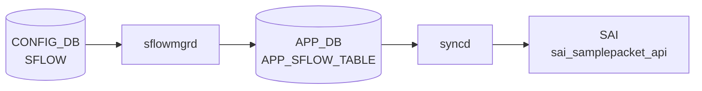

# SFLOW テーブル

## 概要

sFlow サンプリングのグローバル設定 / per-port セッション設定 / コレクタ宛先を定義する 3 つの container を含む。`hsflowd` (sflowd container) と `sflowmgrd` が CONFIG_DB を購読する[^1]。

<!-- cdb-mermaid -->
### データフロー (自動生成)



!!! note "凡例"
    CONFIG_DB から SAI までの典型経路を `docs/reference/config-db-orch-map.md` から機械生成したミニ図。詳細・例外は本ページ本文と対応表を参照。
<!-- /cdb-mermaid -->

## key / 構造

```
SFLOW|global               # グローバル
SFLOW_SESSION|<port>       # per-port 設定 (port = 'all' でグローバル既定)
SFLOW_COLLECTOR|<name>     # コレクタ
```

## SFLOW (global)

| フィールド | 型 | 既定 | 説明 |
|-----------|----|------|------|
| `admin_state` | `up`/`down` | `down` | sFlow 全体の有効化 |
| `polling_interval` | uint16 (`0` または 5..300) | 20 | カウンタ収集間隔 [秒] |
| `agent_id` | union leafref / Vlan pattern | - | agent ID として使う interface |
| `sample_direction` | enum `rx`/`tx`/`both` | `rx` | サンプリング方向 |

## SFLOW_SESSION (per-port)

| フィールド | 型 | 既定 | 説明 |
|-----------|----|------|------|
| `admin_state` | `up`/`down` | `up` | port ごとの sFlow 有効化 |
| `sample_rate` | uint32 (256..8388608) | - | 1/N パケットサンプリング (`port != 'all'` 限定) |
| `sample_direction` | enum `rx`/`tx`/`both` | `rx` | 方向 |

key の `port` は `PORT.name` または `'all'` (全ポート既定)。

## SFLOW_COLLECTOR

| フィールド | 型 | 既定 | 必須 | 説明 |
|-----------|----|------|------|------|
| `collector_ip` | ip-address | - | yes | コレクタの IPv4 / IPv6 |
| `collector_port` | inet:port-number | 6343 | no | UDP ポート |
| `collector_vrf` | string `mgmt`/`default` | - | no | コレクタへ到達する VRF |

最大 2 コレクタ (`max-elements 2`)。`collector_vrf = 'mgmt'` は `MGMT_VRF_CONFIG.vrf_global.mgmtVrfEnabled = 'true'` のときのみ許容 (`must`)。

## 購読者

- `sflowmgrd` (`docker-sflow`): CONFIG_DB → `hsflowd` 設定生成
- `hsflowd`: sampling / counter export 実体

## 関連 CONFIG_DB / YANG / CLI

- 関連 CONFIG_DB: `PORT`、`PORTCHANNEL`、`MGMT_PORT`、`MGMT_VRF_CONFIG`
- 関連 CLI: `config sflow enable/disable/polling-interval/agent-id/collector/interface`
- 関連 YANG: `sonic-sflow`

<!-- ref-triangle:start -->

## 関連リファレンス

- YANG: [`sonic-sflow`](../yang/sonic-sflow.md)
- CLI: [`config sflow`](../cli/config-sflow.md)

<!-- ref-triangle:end -->

## 引用元

[^1]: YANG 定義: `sonic-sflow.yang`. <https://github.com/sonic-net/sonic-buildimage/blob/9ea932ec2e18f35e58268ec2e4456b1d4afd65cd/src/sonic-yang-models/yang-models/sonic-sflow.yang>

<!-- topics-back-ref -->
## 関連 Topics

- [Topics: Telemetry / SNMP / Observability](../../topics/09-telemetry-snmp/index.md)

<!-- /topics-back-ref -->

<!-- ops-hint -->
## 運用ヒント

### 典型値

- key 形式: `SFLOW|global` と `SFLOW_SESSION|<port>`、`SFLOW_COLLECTOR|<name>`。
- `admin_state`: `up`。
- `polling_interval`: 20（秒）。
- `agent_id`: `Loopback0` 等。

### よくある誤設定

- `agent_id` を management IF にすると collector 側で device 識別が混乱。

### 確認コマンド

```bash
sonic-db-cli CONFIG_DB hgetall 'SFLOW|global'
show sflow
```
<!-- /ops-hint -->
