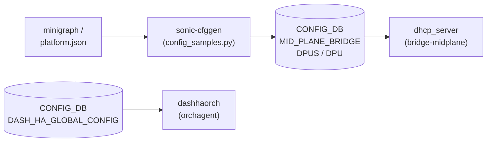

# SmartSwitch DPU テーブル群

## 概要

SmartSwitch は NPU（スイッチ本体）に DPU（Data Processing Unit）を搭載した SONiC プラットフォームである。[CONFIG_DB](../../reference/glossary.md#term-config_db) には DPU の接続・アドレス・HA（High Availability）設定を保持する複数テーブルが存在する[^1]。

テーブル一覧:

| テーブル | 役割 |
|---------|------|
| `MID_PLANE_BRIDGE` | NPU〜DPU 間ミッドプレーンブリッジの IP 設定 |
| `DPUS` | DPU 名とミッドプレーンインターフェースのマッピング |
| `DPU` | 各 DPU の詳細設定（アドレス・サービスポート等）|
| `REMOTE_DPU` | ピア SmartSwitch 上のリモート DPU 情報 |
| `VDPU` | 複数 DPU を束ねる仮想 DPU 定義 |
| `DASH_HA_GLOBAL_CONFIG` | DPU 間 HA データパス・BFD のグローバル設定 |

<!-- cdb-mermaid -->
### データフロー



!!! note "凡例"
    `sonic-cfggen` が platform.json と minigraph から DPU 設定を生成して CONFIG_DB に書き込む。DHCP サーバーはミッドプレーンブリッジ経由で各 DPU に IP を払い出す。
<!-- /cdb-mermaid -->

---

## MID_PLANE_BRIDGE テーブル

### key 構造

```text
MID_PLANE_BRIDGE|GLOBAL
```

### フィールド

| フィールド | 型 | 範囲 | デフォルト | 説明 |
|-----------|----|------|-----------|------|
| `bridge` | string | `bridge-midplane` のみ | `"bridge-midplane"` | ミッドプレーンブリッジ名（YANG で固定）|
| `ip_prefix` | IPv4 prefix | 任意 | `"169.254.200.254/24"` | ブリッジの IPv4 プレフィックス |

---

## DPUS テーブル

### key 構造

```text
DPUS|<dpu_name>
```

`<dpu_name>` は `dpu[0-9]+` パターン（例: `dpu0`, `dpu1`）。

### フィールド

| フィールド | 型 | 範囲 | デフォルト | 説明 |
|-----------|----|------|-----------|------|
| `midplane_interface` | string | `dpu[0-9]+` | `<dpu_name>` と同値 | DPU に対応するミッドプレーンインターフェース名 |

---

## DPU テーブル

### key 構造

```text
DPU|<dpu_name>
```

`<dpu_name>` は `[a-zA-Z0-9_-]+[0-9]` パターン、最大 255 文字。

### フィールド

| フィールド | 型 | 範囲 | デフォルト | 説明 |
|-----------|----|------|-----------|------|
| `state` | `admin_status` | `up` / `down` | なし | DPU の管理状態 |
| `local_port` | `interface_name` | — | なし | NPU 側の物理ポート名 |
| `vip_ipv4` | IPv4 address | — | なし | VIP IPv4（minigraph 由来）|
| `vip_ipv6` | IPv6 address | — | なし | VIP IPv6（minigraph 由来）|
| `pa_ipv4` | IPv4 address | — | なし | PA IPv4（minigraph 由来）|
| `pa_ipv6` | IPv6 address | — | なし | PA IPv6（minigraph 由来）|
| `midplane_ipv4` | IPv4 address | — | `169.254.200.(dpu_id+1)` | ミッドプレーン IPv4（platform 計算値）|
| `dpu_id` | string | `[0-7]` | なし | DPU ID（minigraph 由来）|
| `vdpu_id` | string | 1..255 文字 | なし | 所属 VDPU の guid（minigraph 由来）|
| `gnmi_port` | port-number | 1..65535 | なし（実例: `50052`）| gNMI サービスの TCP ポート |
| `orchagent_zmq_port` | port-number | 1..65535 | なし（実例: `50`）| ZMQ サービスの TCP ポート |
| `swbus_port` | port-number | 1..65535 | なし（実例: `23607`）| swbus サービスの TCP ポート |

---

## REMOTE_DPU テーブル

### key 構造

```text
REMOTE_DPU|<dpu_name>
```

ピア SmartSwitch 上の DPU を表す。`<dpu_name>` は `[a-zA-Z0-9_-]+[0-9]+` パターン。

### フィールド

| フィールド | 型 | 説明 |
|-----------|----|------|
| `type` | string 1..255 | DPU 種別 |
| `pa_ipv4` | IPv4 address | DPU の PA IPv4 |
| `pa_ipv6` | IPv6 address | DPU の PA IPv6 |
| `npu_ipv4` | IPv4 address | リモート NPU のループバック IPv4 |
| `npu_ipv6` | IPv6 address | リモート NPU のループバック IPv6 |
| `dpu_id` | string `[0-7]` | DPU ID |
| `swbus_port` | port-number | swbus サービスの TCP ポート |

---

## VDPU テーブル

### key 構造

```text
VDPU|<vdpu_id>
```

`<vdpu_id>` は VDPU の guid 文字列（1..255 文字）。

### フィールド

| フィールド | 型 | 説明 |
|-----------|----|------|
| `profile` | string 1..255 | VDPU プロファイル（将来用、現在未使用）|
| `tier` | string 1..255 | VDPU ティア（将来用、現在未使用）|
| `main_dpu_ids` | string | この VDPU に属する DPU 名（カンマ区切り）|

---

## DASH_HA_GLOBAL_CONFIG テーブル

### key 構造

```text
DASH_HA_GLOBAL_CONFIG|global
```

### フィールド

| フィールド | 型 | 実例値 | 説明 |
|-----------|----|--------|------|
| `vnet_name` | leafref (VNET) | — | **deprecated**。`dpu_vnet` を使用すること |
| `dpu_vnet` | leafref (VNET) | — | VNET トンネルルートで使用する vnet 名 |
| `dpu_vlan` | string 1..255 | — | DPU VLAN 識別子 |
| `cp_data_channel_port` | port-number | `11362` | コントロールプレーンデータチャネルポート（バルク同期用）|
| `dp_channel_dst_port` | port-number | `11368` | DPU 間データプレーンチャネルのトンネル宛先ポート |
| `dp_channel_src_port_min` | port-number | `49152` | データプレーンチャネルの最小送信元ポート |
| `dp_channel_src_port_max` | port-number | `53247` | データプレーンチャネルの最大送信元ポート |
| `dp_channel_probe_interval_ms` | uint32 | `100` | DPU 間データパスプローブ送信間隔（ミリ秒）|
| `dp_channel_probe_fail_threshold` | uint32 | `3` | データプレーンチャネル断判定に必要な連続失敗回数 |
| `dpu_bfd_probe_interval_in_ms` | uint32 | `100` | DPU BFD プローブ送信間隔（ミリ秒）|
| `dpu_bfd_probe_multiplier` | uint32 | `3` | DPU BFD プローブ失敗判定の乗数 |

---

## 暗黙デフォルト・コード由来挙動

<!-- defaults -->

### MID_PLANE_BRIDGE — 固定値の由来

`bridge` および `ip_prefix` の値は `sonic-cfggen` の `config_samples.py` でハードコードされている:

```python
# src/sonic-config-engine/config_samples.py:88-94
bridge_name = 'bridge-midplane'
data['MID_PLANE_BRIDGE'] = {
    "GLOBAL": {
        "bridge": bridge_name,
        "ip_prefix": "169.254.200.254/24"
    }
}
```

- `bridge` は YANG パターン制約 (`pattern "bridge-midplane"`) により他の値を設定不可
- `ip_prefix` の `169.254.200.254/24` は link-local ではなく APIPA 近接帯の固定アドレスブロック
- YANG の `must "(current()/../ip_prefix)"` 制約により、`ip_prefix` なしの `bridge` 設定は YANG バリデーション違反

### DPUS — midplane_interface は dpu_name と同値

YANG モデルに `must` 制約があり `midplane_interface` は必ず `dpu_name` と同値になる:

```yang
# sonic-smart-switch.yang:101
must "(current() = current()/../dpu_name)";
```

これにより `DPUS|dpu0` エントリの `midplane_interface` は常に `"dpu0"` となる。

### DPU — midplane_ipv4 のプラットフォーム計算値

Mellanox platform 実装では `midplane_ipv4` を `dpu_id` から計算する:

```python
# platform/mellanox/mlnx-platform-api/sonic_platform/module.py:490
return f"169.254.200.{int(self.dpu_id) + 1}"
# dpu_id=0 → 169.254.200.1
# dpu_id=1 → 169.254.200.2
# dpu_id=7 → 169.254.200.8
```

ゲートウェイ（NPU 側: `169.254.200.254`）と DPU 割り当て（`.1`〜`.8`）で同一 `/24` を共有する。この計算ロジックは Mellanox 固有であり、他ベンダー platform では異なる可能性がある。

DHCP サーバーへの IP 払い出しも同一規則に従う:

```python
# config_samples.py:102-103
dpu_id = int(midplane_interface.replace('dpu', ''))
dhcp_server_ports[...] = {'ips': ['{}.{}'.format(mpbr_prefix, dpu_id + 1)]}
```

### DPU — サービスポートのデフォルトなし

`gnmi_port`, `orchagent_zmq_port`, `swbus_port` は YANG に `default` 定義がなく、minigraph または `platform.json` からの書き込み値のみが有効である。テスト実例で観察される値（`gnmi_port=50052`, `orchagent_zmq_port=50`, `swbus_port=23607`）はリファレンスであり、platform・ベンダーによって異なる。

### DASH_HA_GLOBAL_CONFIG — テスト実例値の位置付け

すべてのフィールドが YANG の `default` 定義を持たない。`sonic-yang-models/tests/files/sample_config_db.json` に以下のテスト実例値が存在する:

```json
"DASH_HA_GLOBAL_CONFIG": {
  "global": {
    "cp_data_channel_port": "11362",
    "dp_channel_dst_port": "11368",
    "dp_channel_src_port_min": "49152",
    "dp_channel_src_port_max": "53247",
    "dp_channel_probe_interval_ms": "100",
    "dp_channel_probe_fail_threshold": "3",
    "dpu_bfd_probe_interval_in_ms": "100",
    "dpu_bfd_probe_multiplier": "3"
  }
}
```

`dp_channel_src_port_min: 49152` は Linux エフェメラルポート範囲開始と一致。`dp_channel_src_port_max: 53247` = 49152 + 4095（4096 ポート幅）。

### vnet_name の非推奨化

YANG revision 2025-07-20 で `dpu_vnet` が追加され、`vnet_name` は `status deprecated` に変更された。既存設定で `vnet_name` を使用している場合は `dpu_vnet` へ移行すること:

```yang
# sonic-smart-switch.yang:289-295
leaf vnet_name {
    status deprecated;
    description "Deprecated. Use dpu_vnet instead. Name of the vnet used for VNET tunnel route.";
    ...
}
```

<!-- /defaults -->

## 制約

- `MID_PLANE_BRIDGE|GLOBAL` の `bridge` は `bridge-midplane` 固定。変更不可。
- `DPUS` の `dpu_name` および `midplane_interface` は `dpu[0-9]+` パターン必須。
- `DPU` の `dpu_id` は `[0-7]`（0〜7 の 1 文字）のみ。8 以上の DPU ID は YANG バリデーション違反。
- `REMOTE_DPU` の `dpu_id` も同様に `[0-7]` 制約。
- `DASH_HA_GLOBAL_CONFIG` の `vnet_name` は deprecated であり、YANG `leafref` によって `VNET` テーブル内の既存エントリのみ参照可能。

## 書き込み入り口

### sonic-cfggen（ビルド時 / 初期設定）

```python
# config_samples.py:81-106
# generate_t1_smartswitch_switch_sample_config() が
# MID_PLANE_BRIDGE, DPUS, DHCP_SERVER_IPV4 を生成
```

- `MID_PLANE_BRIDGE|GLOBAL`、`DPUS|dpu*` はビルド時 config_samples.py が生成
- `DPU|<name>` は minigraph から `sonic-cfggen` が展開

### minigraph パーサ

`DPU` テーブルの `vip_ipv4`, `pa_ipv4`, `dpu_id`, `vdpu_id`, `gnmi_port`, `orchagent_zmq_port`, `swbus_port` は minigraph XML の DPU セクションから読み込まれる。

### 直接操作（CONFIG_DB CLI / REST）

`sonic-db-cli CONFIG_DB` または `config` CLI から手動設定も可能だが、通常は自動生成設定を使用する。

## 購読者

| コンポーネント | 購読テーブル | 処理内容 |
|--------------|------------|---------|
| `dhcp_server` | `MID_PLANE_BRIDGE`, `DPUS` | ミッドプレーンブリッジ上の DHCP サービス設定 |
| `chassisd` | `CHASSIS_MODULE` | DPU の admin state 制御（CHASSIS_MODULE テーブル経由）|
| `dashhaorch` (orchagent) | `DASH_HA_GLOBAL_CONFIG` | DASH HA データパス設定を SAI に反映 |
| `sonic-gnmi` | `DPU` | DPU gNMI エンドポイント接続 |

## 関連 CONFIG_DB / YANG

- 関連 CONFIG_DB: `CHASSIS_MODULE`（DPU の admin state）、`DEVICE_METADATA`（`subtype: SmartSwitch`）
- 関連 YANG: `sonic-smart-switch`

<!-- ref-triangle:start -->

## 関連リファレンス

- YANG: `sonic-smart-switch` (`src/sonic-yang-models/yang-models/sonic-smart-switch.yang`)
- CONFIG_DB: [`CHASSIS_MODULE`](chassis-module.md)（DPU モジュール管理状態）
- CONFIG_DB: [`DEVICE_METADATA`](device-metadata.md)（`subtype: SmartSwitch` 設定）

<!-- ref-triangle:end -->

## 引用元

[^1]: YANG 定義: `sonic-smart-switch.yang`. <https://github.com/sonic-net/sonic-buildimage/blob/9ea932ec2e18f35e58268ec2e4456b1d4afd65cd/src/sonic-yang-models/yang-models/sonic-smart-switch.yang>
