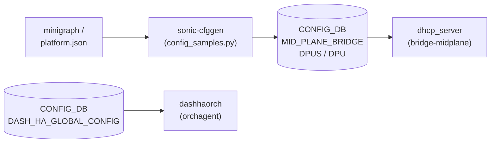

# SmartSwitch DPU テーブル群

## 概要

[SmartSwitch](../../reference/glossary.md#term-smartswitch) は [NPU](../../reference/glossary.md#term-npu)（スイッチ本体）に [DPU](../../reference/glossary.md#term-dpu)（Data Processing Unit）を搭載した [SONiC](../../reference/glossary.md#term-sonic) プラットフォームである。[CONFIG_DB](../../reference/glossary.md#term-config_db) には [DPU](../../reference/glossary.md#term-dpu) の接続・アドレス・HA（High Availability）設定を保持する複数テーブルが存在する[^1]。

テーブル一覧:

| テーブル | 役割 |
|---------|------|
| `MID_PLANE_BRIDGE` | [NPU](../../reference/glossary.md#term-npu)〜[DPU](../../reference/glossary.md#term-dpu) 間ミッドプレーンブリッジの IP 設定 |
| `DPUS` | DPU 名とミッドプレーンインターフェースのマッピング |
| `DPU` | 各 DPU の詳細設定（アドレス・サービスポート等）|
| `REMOTE_DPU` | ピア [SmartSwitch](../../reference/glossary.md#term-smartswitch) 上のリモート DPU 情報 |
| `VDPU` | 複数 DPU を束ねる仮想 DPU 定義 |
| `DASH_HA_GLOBAL_CONFIG` | DPU 間 HA データパス・[BFD](../../reference/glossary.md#term-bfd) のグローバル設定 |

<!-- cdb-mermaid -->
### データフロー



!!! note "凡例"
    `sonic-cfggen` が platform.json と minigraph から DPU 設定を生成して CONFIG_DB に書き込む。DHCP サーバはミッドプレーンブリッジ経由で各 DPU に IP を払い出す。
<!-- /cdb-mermaid -->

---

## MID_PLANE_BRIDGE テーブル

### key 構造

```text
MID_PLANE_BRIDGE|GLOBAL
```

### フィールド

| フィールド | 型 | 範囲 | デフォルト | 説明 |
|-----------|----|------|-----------|------|
| `bridge` | string | `bridge-midplane` のみ | `"bridge-midplane"` | ミッドプレーンブリッジ名（[YANG](../../reference/glossary.md#term-yang) で固定）|
| `ip_prefix` | IPv4 prefix | 任意 | `"169.254.200.254/24"` | ブリッジの IPv4 プレフィックス |

---

## DPUS テーブル

### key 構造

```text
DPUS|<dpu_name>
```

`<dpu_name>` は `dpu[0-9]+` パターン（例: `dpu0`, `dpu1`）。

### フィールド

| フィールド | 型 | 範囲 | デフォルト | 説明 |
|-----------|----|------|-----------|------|
| `midplane_interface` | string | `dpu[0-9]+` | `<dpu_name>` と同値 | DPU に対応するミッドプレーンインターフェース名 |

---

## DPU テーブル

### key 構造

```text
DPU|<dpu_name>
```

`<dpu_name>` は `[a-zA-Z0-9_-]+[0-9]` パターン、最大 255 文字。

### フィールド

| フィールド | 型 | 範囲 | デフォルト | 説明 |
|-----------|----|------|-----------|------|
| `state` | `admin_status` | `up` / `down` | なし | DPU の管理状態 |
| `local_port` | `interface_name` | — | なし | [NPU](../../reference/glossary.md#term-npu) 側の物理ポート名 |
| `vip_ipv4` | IPv4 address | — | なし | VIP IPv4（minigraph 由来）|
| `vip_ipv6` | IPv6 address | — | なし | VIP IPv6（minigraph 由来）|
| `pa_ipv4` | IPv4 address | — | なし | PA IPv4（minigraph 由来）|
| `pa_ipv6` | IPv6 address | — | なし | PA IPv6（minigraph 由来）|
| `midplane_ipv4` | IPv4 address | — | `169.254.200.(dpu_id+1)` | ミッドプレーン IPv4（platform 計算値）|
| `dpu_id` | string | `[0-7]` | なし | DPU ID（minigraph 由来）|
| `vdpu_id` | string | 1..255 文字 | なし | 所属 VDPU の guid（minigraph 由来）|
| `gnmi_port` | port-number | 1..65535 | なし（実例: `50052`）| [gNMI](../../reference/glossary.md#term-gnmi) サービスの TCP ポート |
| `orchagent_zmq_port` | port-number | 1..65535 | なし（実例: `50`）| ZMQ サービスの TCP ポート |
| `swbus_port` | port-number | 1..65535 | なし（実例: `23607`）| swbus サービスの TCP ポート |

---

## REMOTE_DPU テーブル

### key 構造

```text
REMOTE_DPU|<dpu_name>
```

ピア [SmartSwitch](../../reference/glossary.md#term-smartswitch) 上の DPU を表す。`<dpu_name>` は `[a-zA-Z0-9_-]+[0-9]+` パターン。

### フィールド

| フィールド | 型 | 説明 |
|-----------|----|------|
| `type` | string 1..255 | DPU 種別 |
| `pa_ipv4` | IPv4 address | DPU の PA IPv4 |
| `pa_ipv6` | IPv6 address | DPU の PA IPv6 |
| `npu_ipv4` | IPv4 address | リモート NPU のループバック IPv4 |
| `npu_ipv6` | IPv6 address | リモート NPU のループバック IPv6 |
| `dpu_id` | string `[0-7]` | DPU ID |
| `swbus_port` | port-number | swbus サービスの TCP ポート |

---

## VDPU テーブル

### key 構造

```text
VDPU|<vdpu_id>
```

`<vdpu_id>` は VDPU の guid 文字列（1..255 文字）。

### フィールド

| フィールド | 型 | 説明 |
|-----------|----|------|
| `profile` | string 1..255 | VDPU プロファイル（将来用、現在未使用）|
| `tier` | string 1..255 | VDPU ティア（将来用、現在未使用）|
| `main_dpu_ids` | string | この VDPU に属する DPU 名（カンマ区切り）|

---

## DASH_HA_GLOBAL_CONFIG テーブル

### key 構造

```text
DASH_HA_GLOBAL_CONFIG|global
```

### フィールド

| フィールド | 型 | 実例値 | 説明 |
|-----------|----|--------|------|
| `vnet_name` | leafref ([VNET](../../reference/glossary.md#term-vnet)) | — | **deprecated**。`dpu_vnet` を使用すること |
| `dpu_vnet` | leafref ([VNET](../../reference/glossary.md#term-vnet)) | — | [VNET](../../reference/glossary.md#term-vnet) トンネルルートで使用する vnet 名 |
| `dpu_vlan` | string 1..255 | — | DPU [VLAN](../../reference/glossary.md#term-vlan) 識別子 |
| `cp_data_channel_port` | port-number | `11362` | コントロールプレーンデータチャネルポート（バルク同期用）|
| `dp_channel_dst_port` | port-number | `11368` | DPU 間データプレーンチャネルのトンネル宛先ポート |
| `dp_channel_src_port_min` | port-number | `49152` | データプレーンチャネルの最小送信元ポート |
| `dp_channel_src_port_max` | port-number | `53247` | データプレーンチャネルの最大送信元ポート |
| `dp_channel_probe_interval_ms` | uint32 | `100` | DPU 間データパスプローブ送信間隔（ミリ秒）|
| `dp_channel_probe_fail_threshold` | uint32 | `3` | データプレーンチャネル断判定に必要な連続失敗回数 |
| `dpu_bfd_probe_interval_in_ms` | uint32 | `100` | DPU [BFD](../../reference/glossary.md#term-bfd) プローブ送信間隔（ミリ秒）|
| `dpu_bfd_probe_multiplier` | uint32 | `3` | DPU [BFD](../../reference/glossary.md#term-bfd) プローブ失敗判定の乗数 |

---

## 暗黙デフォルト・コード由来挙動

<!-- defaults -->

### MID_PLANE_BRIDGE — 固定値の由来

`bridge` および `ip_prefix` の値は `sonic-cfggen` の `config_samples.py` でハードコードされている:

```python
# src/sonic-config-engine/config_samples.py:88-94
bridge_name = 'bridge-midplane'
data['MID_PLANE_BRIDGE'] = {
    "GLOBAL": {
        "bridge": bridge_name,
        "ip_prefix": "169.254.200.254/24"
    }
}
```

- `bridge` は [YANG](../../reference/glossary.md#term-yang) パターン制約 (`pattern "bridge-midplane"`) により他の値を設定不可
- `ip_prefix` の `169.254.200.254/24` は link-local ではなく APIPA 近接帯の固定アドレスブロック
- [YANG](../../reference/glossary.md#term-yang) の `must "(current()/../ip_prefix)"` 制約により、`ip_prefix` なしの `bridge` 設定は YANG バリデーション違反

### DPUS — midplane_interface は dpu_name と同値

YANG モデルに `must` 制約があり `midplane_interface` は必ず `dpu_name` と同値になる:

```yang
# sonic-smart-switch.yang:101
must "(current() = current()/../dpu_name)";
```

これにより `DPUS|dpu0` エントリの `midplane_interface` は常に `"dpu0"` となる。

### DPU — midplane_ipv4 のプラットフォーム計算値

Mellanox platform 実装では `midplane_ipv4` を `dpu_id` から計算する:

```python
# platform/mellanox/mlnx-platform-api/sonic_platform/module.py:490
return f"169.254.200.{int(self.dpu_id) + 1}"
# dpu_id=0 → 169.254.200.1
# dpu_id=1 → 169.254.200.2
# dpu_id=7 → 169.254.200.8
```

ゲートウェイ（NPU 側: `169.254.200.254`）と DPU 割り当て（`.1`〜`.8`）で同一 `/24` を共有する。この計算ロジックは Mellanox 固有であり、他ベンダー platform では異なる可能性がある。

DHCP サーバへの IP 払い出しも同一規則に従う:

```python
# config_samples.py:102-103
dpu_id = int(midplane_interface.replace('dpu', ''))
dhcp_server_ports[...] = {'ips': ['{}.{}'.format(mpbr_prefix, dpu_id + 1)]}
```

### DPU — サービスポートのデフォルトなし

`gnmi_port`, `orchagent_zmq_port`, `swbus_port` は YANG に `default` 定義がなく、minigraph または `platform.json` からの書き込み値のみが有効である。テスト実例で観察される値（`gnmi_port=50052`, `orchagent_zmq_port=50`, `swbus_port=23607`）はリファレンスであり、platform・ベンダーによって異なる。

### DASH_HA_GLOBAL_CONFIG — テスト実例値の位置付け

すべてのフィールドが YANG の `default` 定義を持たない。`sonic-yang-models/tests/files/sample_config_db.json` に以下のテスト実例値が存在する:

```json
"DASH_HA_GLOBAL_CONFIG": {
  "global": {
    "cp_data_channel_port": "11362",
    "dp_channel_dst_port": "11368",
    "dp_channel_src_port_min": "49152",
    "dp_channel_src_port_max": "53247",
    "dp_channel_probe_interval_ms": "100",
    "dp_channel_probe_fail_threshold": "3",
    "dpu_bfd_probe_interval_in_ms": "100",
    "dpu_bfd_probe_multiplier": "3"
  }
}
```

`dp_channel_src_port_min: 49152` は Linux エフェメラルポート範囲開始と一致。`dp_channel_src_port_max: 53247` = 49152 + 4095（4096 ポート幅）。

### vnet_name の非推奨化

YANG revision 2025-07-20 で `dpu_vnet` が追加され、`vnet_name` は `status deprecated` に変更された。既存設定で `vnet_name` を使用している場合は `dpu_vnet` へ移行すること:

```yang
# sonic-smart-switch.yang:289-295
leaf vnet_name {
    status deprecated;
    description "Deprecated. Use dpu_vnet instead. Name of the vnet used for VNET tunnel route.";
    ...
}
```

<!-- /defaults -->

<!-- ordering -->
## 書込み順依存

`dhcp_cfggen` (`dhcpservd`) は `generate()` 呼び出しごとに [CONFIG_DB](../../reference/glossary.md#term-config_db) を全量読み直してミッドプレーン DHCP 設定を再生成する。このため書き込み順序がミッドプレーンブリッジの DHCP 払い出し動作に直結する。

### 他テーブル先行必須

| 先行テーブル / フィールド | 理由 | 違反時の挙動 |
|---|---|---|
| `DEVICE_METADATA\|localhost.subtype = "SmartSwitch"` | `is_smart_switch()` チェックで `False` になると `MID_PLANE_BRIDGE` / `DPUS` を完全無視 | ミッドプレーン DHCP 設定が生成されず DPU への IP 払い出し停止（`dhcp_cfggen.py:67,76`） |
| `MID_PLANE_BRIDGE\|GLOBAL` (`bridge` + `ip_prefix` 両フィールド) | `dhcp_cfggen.py:84` で両フィールドの存在を明示チェック。どちらか欠如すると `dhcp_interfaces` にブリッジが登録されない | `DPUS` エントリが存在しても処理スキップ。DPU への IP 割当なし |
| `VNET\|<vnet_name>` (→ `DASH_HA_GLOBAL_CONFIG.dpu_vnet`) | YANG `leafref` 制約。`VNET` エントリが先行していないと YANG バリデーション違反 | CLI 経由の書き込みは `ctx.fail()` で拒否 |

### 推奨書込み順序（ビルド時 / 手動設定共通）

```
# 1. デバイス種別の確定
SET DEVICE_METADATA|localhost  subtype=SmartSwitch

# 2. ミッドプレーンブリッジの定義
SET MID_PLANE_BRIDGE|GLOBAL  bridge=bridge-midplane  ip_prefix=169.254.200.254/24

# 3. DPU エントリの登録（複数ある場合は natsorted 順）
SET DPUS|dpu0  midplane_interface=dpu0
SET DPUS|dpu1  midplane_interface=dpu1
...

# 4. DHCP サーバー設定（DHCP_SERVER_IPV4 / DHCP_SERVER_IPV4_PORT）
SET DHCP_SERVER_IPV4|bridge-midplane  ...
SET DHCP_SERVER_IPV4_PORT|bridge-midplane|dpu0  ...

# 5. DASH HA 設定（VNET が先行していること）
SET DASH_HA_GLOBAL_CONFIG|global  dpu_vnet=<vnet_name>  ...
```

`config_samples.py:81-151` (`generate_t1_smartswitch_switch_sample_config`) はこの順序を自動保証している。

### ランタイム変更の反映タイミング

- `DPUS` の変更は `DpusTableEventChecker` が無条件にトリガー → dhcpservd 再生成 → kea-dhcp4 SIGHUP（最大 5000 ms ポーリング待ち）
- `MID_PLANE_BRIDGE` の変更は `MidPlaneTableEventChecker` が `bridge` フィールドを `enabled_dhcp_interfaces` と照合してから再生成をトリガー
- `DPU` / `REMOTE_DPU` / `VDPU` は dhcpservd の購読対象外。変更は dashhaorch / sonic-gnmi が別途処理する

> **Evidence**: `src/sonic-dhcp-utilities/dhcp_utilities/dhcpservd/dhcp_cfggen.py:65-100`; `common/dhcp_db_monitor.py:349-386`; `src/sonic-config-engine/config_samples.py:81-151`; `src/sonic-dhcp-utilities/dhcp_utilities/common/utils.py:153-161`
<!-- /ordering -->

<!-- cross-refs -->
## 暗黙参照

> **Evidence**: `src/sonic-yang-models/yang-models/sonic-smart-switch.yang` 全行精読; `src/sonic-dhcp-utilities/dhcp_utilities/dhcpservd/dhcp_cfggen.py:60-100`; `src/sonic-dhcp-utilities/dhcp_utilities/common/utils.py:153-161`; `src/sonic-config-engine/config_samples.py:80-157`; `sonic-platform-daemons/sonic-chassisd/scripts/chassisd:355,749,1143,1187,1245-1270` (2026-05-17)

各テーブルは YANG leafref の有無とは独立して、実装レベルで以下のテーブルを暗黙参照する。

### MID_PLANE_BRIDGE / DPUS の暗黙参照

| 参照先 | DB | 参照方向 | YANG leafref | 実装上の必須度 | 証拠 |
|---|---|---|---|---|---|
| `DEVICE_METADATA\|localhost` (`subtype`) | [CONFIG_DB](../../reference/glossary.md#term-config_db) | 読み取り (`is_smart_switch()` 判定) | なし | 必須（`"SmartSwitch"` でない場合 `MID_PLANE_BRIDGE`/`DPUS` を完全スキップ）| `dhcp_cfggen.py:65-67`; `utils.py:153-161` |
| `DHCP_SERVER_IPV4\|bridge-midplane` | CONFIG_DB | 書き込み (初期設定で自動生成) | なし | 派生（`config_samples.py` が `DPUS` エントリから自動生成）| `config_samples.py:133-143` |
| `DHCP_SERVER_IPV4_PORT\|bridge-midplane\|<dpu>` | CONFIG_DB | 書き込み (初期設定で自動生成) | なし | 派生（`DPUS` の `midplane_interface` から DPU ごとに生成）| `config_samples.py:105-109` |
| `FEATURE\|dhcp_server` | CONFIG_DB | 書き込み (初期設定で有効化) | なし | 派生（`DPUS` が存在する場合のみ生成）| `config_samples.py:113-131` |

#### DEVICE_METADATA.localhost.subtype — SmartSwitch 判定ゲート

`dhcp_cfggen.py:65-67` が `DEVICE_METADATA|localhost.subtype` を読み取り `is_smart_switch()` を呼ぶ (`utils.py:153-161`)。`subtype != "SmartSwitch"` の場合、`_parse_dpu()` が呼ばれず `MID_PLANE_BRIDGE` / `DPUS` テーブルの内容が完全に無視される。DPU への IP 払い出しは発生しない。

#### DHCP_SERVER_IPV4 / DHCP_SERVER_IPV4_PORT — DPUS から自動生成

`config_samples.py:105-143` は `DPUS` 内の各エントリから `DHCP_SERVER_IPV4_PORT|bridge-midplane|<midplane_interface>` を生成し、`DHCP_SERVER_IPV4|bridge-midplane` を `MODE=PORT` で設定する。`DPUS` が空の場合、これらのテーブルは生成されない。

---

### DASH_HA_GLOBAL_CONFIG の暗黙参照

| 参照先 | DB | 参照方向 | YANG leafref | 実装上の必須度 | 証拠 |
|---|---|---|---|---|---|
| `VNET\|<name>` | CONFIG_DB | 読み取り (`dpu_vnet` / `vnet_name` の存在確認) | **あり** (`leafref`) | 条件付き必須（[DASH](../../reference/glossary.md#term-dash) HA 設定時。不在で YANG バリデーション違反）| `sonic-smart-switch.yang:292-303` |

#### VNET — YANG leafref による強制参照

`sonic-smart-switch.yang:291-303` は `DASH_HA_GLOBAL_CONFIG.global.vnet_name`（deprecated）と `dpu_vnet` の両フィールドを `VNET` テーブルへの `leafref` として定義する。`VNET|<name>` エントリが存在しない状態で `dpu_vnet` を書き込もうとすると、YANG バリデーションエラーが発生し CLI 経由の書き込みは拒否される。

---

### DPU / REMOTE_DPU / VDPU の暗黙参照

| 参照先 | DB | 参照方向 | YANG leafref | 実装上の必須度 | 証拠 |
|---|---|---|---|---|---|
| `DEVICE_METADATA\|localhost` (`switch_type = "dpu"`) | CONFIG_DB | 書き込み (DPU 側 config_samples) | なし | DPU 専用（DPU デバイスとして識別させる）| `config_samples.py:154-157` |
| `PORT\|*` | CONFIG_DB | 読み取り (DPU 側 chassisd dataplane state 判定) | なし | DPU 側のみ（NPU 側 chassisd は不参照）| `chassisd:1265-1272` |
| `CHASSIS_MODULE\|DPU*` | CONFIG_DB | 読み書き (chassisd による DPU admin state 制御) | なし | 必須（DPU モジュール管理）| `chassisd:44,355,749` |

#### CHASSIS_MODULE — chassisd による DPU 管理

`chassisd` は `CHASSIS_MODULE` テーブル（`CHASSIS_CFG_TABLE = "CHASSIS_MODULE"`）を唯一の CONFIG_DB 参照先として DPU の admin state を制御する（`chassisd:355,749,1143`）。`DPU` / `DPUS` テーブルを直接参照しない。DPU の物理状態は `CHASSIS_STATE_DB.DPU_STATE` テーブル経由で管理される。

### SAI 参照

`MID_PLANE_BRIDGE` / `DPUS` / `DPU` / `REMOTE_DPU` / `VDPU` はいずれも [SAI](../../reference/glossary.md#term-sai) を直接操作しない。`DASH_HA_GLOBAL_CONFIG` は `dashhaorch` ([orchagent](../../reference/glossary.md#term-orchagent)) 経由で [DASH](../../reference/glossary.md#term-dash) [SAI](../../reference/glossary.md#term-sai) に設定を渡すが、[orchagent](../../reference/glossary.md#term-orchagent) の [SAI](../../reference/glossary.md#term-sai) 呼び出し詳細は [DASH](../../reference/glossary.md#term-dash) 固有実装に依存する。
<!-- /cross-refs -->

<!-- failure -->
## 異常系・無効入力時の挙動

> **Evidence**: `sonic-platform-daemons/sonic-chassisd/scripts/chassisd:82-83,106,718-720,801-840,1075-1105`; `src/sonic-dhcp-utilities/dhcp_utilities/dhcpservd/dhcp_cfggen.py:76,84,119`; `src/sonic-yang-models/yang-models/sonic-smart-switch.yang:65,69,90,98,101,160,295-306` (2026-05-17)

### YANG バリデーション失敗（書き込み拒否）

| テーブル / フィールド | 違反条件 | 結果 |
|---|---|---|
| `MID_PLANE_BRIDGE.bridge` | `"bridge-midplane"` 以外の値 | CLI が書き込み拒否（`pattern "bridge-midplane"` 制約） |
| `MID_PLANE_BRIDGE` (`bridge` のみ、`ip_prefix` 欠落) | `ip_prefix` なしで `bridge` を設定 | YANG `must` 制約違反で拒否（`must "(current()/../ip_prefix)"`) |
| `DPUS.midplane_interface` | `dpu_name` と異なる値 | YANG `must "(current() = current()/../dpu_name)"` 違反 |
| `DPU.dpu_id` | `"8"` 以上・2桁・負数 | `pattern [0-7]` 違反で書き込み拒否 |
| `DASH_HA_GLOBAL_CONFIG.dpu_vnet` | 存在しない VNET 名を指定 | YANG `leafref` 解決失敗。CLI が拒否 |

### dhcpservd — ミッドプレーン DHCP の無音失敗

以下の条件が成立するとエラーログなしで DHCP 設定生成がスキップされる。

| 条件 | コード位置 | 影響 |
|---|---|---|
| `DEVICE_METADATA.localhost.subtype != "SmartSwitch"` | `dhcp_cfggen.py:76` | `MID_PLANE_BRIDGE` / `DPUS` テーブルを完全スキップ。DPU への IP 払い出し停止 |
| `MID_PLANE_BRIDGE.GLOBAL` の `bridge` または `ip_prefix` いずれかが欠落 | `dhcp_cfggen.py:84` | ミッドプレーンブリッジが `dhcp_interfaces` に未登録。`DPUS` が存在しても IP 払い出し停止 |
| `DPUS` エントリに `midplane_interface` フィールドなし | `dhcp_cfggen.py:119` | 当該エントリをフィルタアウト。対応 DPU の IP 払い出しのみ停止 |

いずれの場合も `dhcpservd` はエラーを出力しない。症状（DPU が IP を取得できない）が唯一の手掛かりになる。

### chassisd — midplane 初期化失敗

`SmartSwitchModuleUpdater.__init__()` で `chassis.init_midplane_switch()` が `False` または例外を返した場合:

```python
# chassisd:718-720
self.midplane_initialized = try_get(chassis.init_midplane_switch, default=False)
if not self.midplane_initialized:
    self.log_error("Chassisd midplane intialization failed")
```

- `check_midplane_reachability()` の先頭で `if not self.midplane_initialized: return` となりループ全体をスキップ
- `CHASSIS_STATE_DB.DPU_STATE` の midplane 状態が更新されない
- `CONFIG_DB` は変更されない

### DPU offline 遷移時の挙動

`CHASSIS_MODULE` の oper_status が `offline` に遷移すると chassisd が以下を記録する（`DPU` / `DPUS` テーブルは変更しない）:

1. `/host/reboot-cause/module/<dpu>/prev_reboot_time.txt` にダウン時刻を記録
2. `/host/reboot-cause/module/<dpu>/history/<time>_reboot_cause.json` に原因 JSON を保存（最大 `MAX_HISTORY_FILES=10` 件でローテーション）
3. `CHASSIS_STATE_DB.REBOOT_CAUSE|<DPU>|<time>` に書き込み

midplane 疎通切断時:

```text
"Unexpected: Module <DPU> lost midplane connectivity"  # syslog WARNING
```

`CHASSIS_STATE_DB.DPU_STATE|<DPU>` の `dpu_midplane_link_state` / `dpu_control_plane_state` / `dpu_data_plane_state` を全て `"down"` にセット（`chassisd:882-884`）。CONFIG_DB の DPU 関連テーブルは変更されない。

### DPU リブート判定（MAX_DPU_REBOOT_DURATION）

DPU が online 復帰したとき、同一のリブート原因で `MAX_DPU_REBOOT_DURATION=800` 秒以内なら
`is_reboot=True` とみなしリブート原因の再書き込みをスキップする（`chassisd:830`）。
`DEFAULT_DPU_REBOOT_TIMEOUT=360` 秒は `platform.json` の `dpu_reboot_timeout` で上書き可能（`chassisd:727`）。

<!-- /failure -->

<!-- constants -->
## 数値定数・マジックナンバー

> **Evidence**: `sonic-platform-daemons/sonic-chassisd/scripts/chassisd:82-83,89-90,95,106`; `src/sonic-config-engine/config_samples.py:85-93,103,136`; `src/sonic-yang-models/yang-models/sonic-smart-switch.yang:65,90,117,160,275` (2026-05-17)

### chassisd 宣言定数

| 定数名 | 値 | 単位 | 用途 |
|---|---|---|---|
| `DEFAULT_DPU_REBOOT_TIMEOUT` | `360` | 秒 | DPU リブート完了待ちタイムアウト。`platform.json` の `dpu_reboot_timeout` キーで上書き可能（`chassisd:727`） |
| `MAX_DPU_REBOOT_DURATION` | `800` | 秒 | 同一リブート原因の重複判定ウィンドウ。この時間内の online 復帰は新規リブートとみなさない（`chassisd:830`） |
| `CHASSIS_INFO_UPDATE_PERIOD_SECS` | `10` | 秒 | chassisd メインループ周期。DPU oper state 更新間隔（`chassisd:89`） |
| `CHASSIS_DB_CLEANUP_MODULE_DOWN_PERIOD` | `30` | 分 | DPU が down 継続時に CHASSIS_STATE_DB 古エントリをクリーンアップするまでの猶予（`chassisd:90`） |
| `SELECT_TIMEOUT` | `1000` | ミリ秒 | `swsscommon.Select.select()` タイムアウト。SIGTERM ハンドリングに影響（`chassisd:95`） |
| `MAX_HISTORY_FILES` | `10` | 件 | `/host/reboot-cause/module/<dpu>/history/` に保持する最大リブート原因ファイル数（`chassisd:106`） |

### config_samples.py ハードコード値

| 値 | コード位置 | 意味 |
|---|---|---|
| `'169.254.200'` | `config_samples.py:85` | ミッドプレーンブリッジのサブネットプレフィックス (`mpbr_prefix`) |
| `'169.254.200.254'` | `config_samples.py:86` | NPU 側ブリッジ IP (`mpbr_address`)。計算式: `mpbr_prefix + ".254"` |
| `'bridge-midplane'` | `config_samples.py:88` | ブリッジ名 (`bridge_name`)。YANG `pattern "bridge-midplane"` と一致 |
| `'3600'` | `config_samples.py:136` | `DHCP_SERVER_IPV4.bridge-midplane.lease_time`（秒）。1 時間固定 |

### DPU アドレス計算式

```python
# config_samples.py:102-103
dpu_id = int(midplane_interface.replace('dpu', ''))   # "dpu0" → 0
dhcp_ip = '{}.{}'.format(mpbr_prefix, dpu_id + 1)    # "169.254.200.<dpu_id+1>"
```

具体的な割当: `dpu0`→`.1`、`dpu1`→`.2`、`dpu7`→`.8`。NPU ブリッジ IP (`.254`) との衝突なし（最大 `.8`）。

### DASH_HA_GLOBAL_CONFIG テスト実例値の由来

| フィールド | 実例値 | 由来 |
|---|---|---|
| `cp_data_channel_port` | `11362` | DASH HA [HLD](../../reference/glossary.md#term-hld) 規定値 |
| `dp_channel_dst_port` | `11368` | DASH HA [HLD](../../reference/glossary.md#term-hld) 規定値 |
| `dp_channel_src_port_min` | `49152` | Linux エフェメラルポート開始値（`ip_local_port_range` 下限） |
| `dp_channel_src_port_max` | `53247` | `49152 + 4095`（4096 ポート幅） |
| `dp_channel_probe_interval_ms` | `100` | BFD 推奨最小値（RFC 5880 準拠） |
| `dp_channel_probe_fail_threshold` | `3` | BFD 標準乗数（`DetectMult = 3`） |
| `dpu_bfd_probe_interval_in_ms` | `100` | 同上 |
| `dpu_bfd_probe_multiplier` | `3` | 同上 |

<!-- /constants -->

<!-- side-effects -->
## 書き込み副作用

> **Evidence**: `sonic-platform-daemons/sonic-chassisd/scripts/chassisd:89-90,219-256,315-335,557-562,863-889,1180-1226`; `src/sonic-config-engine/config_samples.py:96-143` (2026-05-17)

### MID_PLANE_BRIDGE + DPUS → dhcp_server がミッドプレーン DHCP プールを再構成

`MID_PLANE_BRIDGE` と `DPUS` への書き込みは `dhcp_server` サービスに通知され、`bridge-midplane` インタフェース上の DHCP プールが構成される。`DPUS|dpu*` の各エントリに対して `169.254.200.(dpu_id+1)` の DHCP リース割り当てが開始される。`DPUS|dpu*` を DEL するとそのエントリの DHCP プールが失効し、DPU のミッドプレーン IP が喪失する（DPU ミッドプレーン接続断）。

### CHASSIS_MODULE 書き込み → DPU ハードウェア電源を非同期制御

`CHASSIS_MODULE|DPU*` への SET (admin_status=up/down) は `SmartSwitchConfigManagerTask` が受け取り、別スレッドで `set_admin_state_gracefully()` を呼び出す (`chassisd:255-256`)。CONFIG_DB 書き込み完了直後には [STATE_DB](../../reference/glossary.md#term-state_db) の `oper_status` はまだ変化しない（非同期）。DEL 操作も `admin_state = MODULE_ADMIN_DOWN` として扱われ DPU がシャットダウンする (`chassisd:1224`)。

### midplane 切断 → CP_STATE / DP_STATE が連鎖的に down へ

`SmartSwitchModuleUpdater.update_dpu_state()` は DPU の midplane 到達性喪失を検知すると、`CHASSIS_STATE_DB` に `dpu_midplane_link_state: "down"` を書き込むと同時に `CP_STATE = "down"` および `DP_STATE = "down"` も設定する (`chassisd:881-884`)。midplane 復旧だけでは CP/DP は自動回復せず、個別の復旧チェックが必要。

### DASH_HA_GLOBAL_CONFIG → SAI HA 属性更新（BFD セッション再起動の可能性）

`dashhaorch` は `DASH_HA_GLOBAL_CONFIG` 変更を受けると SAI に HA グローバル属性を即時適用する。`dp_channel_src_port_min/max` や BFD プローブ間隔の変更は既存 BFD セッションを一時中断させる可能性があり、HA フェイルオーバー中の変更は避けること。

### 副作用サマリー

| CONFIG_DB 操作 | 副作用 | 波及先 |
|---|---|---|
| `MID_PLANE_BRIDGE` SET | ミッドプレーン DHCP 有効化 | `dhcp_server`、ネットワーク |
| `DPUS\|dpu*` SET | DHCP リース割り当て開始（169.254.200.x） | DPU ミッドプレーン IP |
| `DPUS\|dpu*` DEL | DHCP プール失効、DPU ミッドプレーン IP 喪失 | DPU 接続断 |
| `CHASSIS_MODULE\|DPU*` SET admin_status=down | DPU グレースフルシャットダウン（非同期） | ハードウェア、`CHASSIS_STATE_DB` |
| `CHASSIS_MODULE\|DPU*` SET admin_status=up | DPU 電源投入（非同期） | ハードウェア、`CHASSIS_STATE_DB` |
| `CHASSIS_MODULE\|DPU*` DEL | DPU シャットダウン（DEL = admin_down 扱い） | ハードウェア |
| `DASH_HA_GLOBAL_CONFIG` SET | SAI HA 属性更新、BFD セッション再起動の可能性 | `dashhaorch`、SAI、HA セッション |

<!-- /side-effects -->

<!-- pubsub -->
## 通信メカニズム

> **Evidence**: `sonic-platform-daemons/sonic-chassisd/scripts/chassisd:44,95,1147-1175,1180-1226`; `src/sonic-dhcp-utilities/dhcp_utilities/common/dhcp_db_monitor.py:20-80,349-388`; `src/sonic-dhcp-utilities/dhcp_utilities/dhcpservd/dhcpservd.py:14,25,130-148`; `src/sonic-dhcp-utilities/dhcp_utilities/dhcpservd/dhcp_cfggen.py:23,95-100`; `SONiC/doc/smart-switch/high-availability/smart-switch-ha-detailed-design.md:100-200` (2026-05-17)

### Producer / Consumer ペア

| CONFIG_DB テーブル | Producer | Consumer / 購読方式 | select タイムアウト |
|---|---|---|---|
| `CHASSIS_MODULE\|DPU*` | sonic-gnmi / CLI | `SmartSwitchConfigManagerTask` — `SubscriberStateTable` | 1000 ms |
| `MID_PLANE_BRIDGE\|GLOBAL` | [sonic-cfggen](../../reference/glossary.md#term-sonic-cfggen) / config_samples.py | `dhcpservd` — `MidPlaneTableEventChecker`（`SubscriberStateTable` 内包） | 5000 ms |
| `DPUS\|dpu*` | [sonic-cfggen](../../reference/glossary.md#term-sonic-cfggen) / config_samples.py | `dhcpservd` — `DpusTableEventChecker`（`SubscriberStateTable` 内包） | 5000 ms |
| `DASH_HA_GLOBAL_CONFIG` | ネットワークコントローラ ([gNMI](../../reference/glossary.md#term-gnmi)) | `hamgrd` — `SubscriberStateTable` | — |
| `DPU`, `VDPU` | ネットワークコントローラ ([gNMI](../../reference/glossary.md#term-gnmi)) | NPU `orchagent` / `hamgrd` — `SubscriberStateTable` | — |
| `REMOTE_DPU` | ネットワークコントローラ (gNMI) | `hamgrd` — `SubscriberStateTable` | — |

### CHASSIS_MODULE → chassisd

`SmartSwitchConfigManagerTask.task_worker()` (`chassisd:1180`) は `swsscommon.SubscriberStateTable(config_db, CHASSIS_CFG_TABLE)` を生成し、`swsscommon.Select` に登録する (`chassisd:1198-1201`)。`SELECT_TIMEOUT = 1000` ms (`chassisd:95`) でポーリングし、イベント受信時は `sst.pop()` で `(key, op, fvp)` を取得する。

- op=`SET` のとき: `fvp` から `admin_status` を取得し `up` なら `MODULE_ADMIN_UP`、それ以外は `MODULE_ADMIN_DOWN` として `module_config_update()` を呼び出す
- op=`DEL` のとき: 無条件で `MODULE_ADMIN_DOWN` を渡す（DEL = シャットダウン扱い）

`module_config_update()` 内では別スレッドで `set_admin_state_gracefully()` が呼ばれるため、CONFIG_DB 書き込み完了時点では [STATE_DB](../../reference/glossary.md#term-state_db) の `oper_status` はまだ変化しない（完全非同期）。

### MID_PLANE_BRIDGE / DPUS → dhcpservd

`dhcpservd.py` は SmartSwitch モードのとき `MidPlaneTableEventChecker` と `DpusTableEventChecker` を `sel` に追加する (`dhcpservd.py:143-144`)。両チェッカーはいずれも `ConfigDbEventChecker` 基底クラスの `enable()` メソッドで `SubscriberStateTable` を生成し `sel.addSelectable()` する (`dhcp_db_monitor.py:69-75`)。`DEFAULT_SELECT_TIMEOUT = 5000` ms でポーリング。

- `MidPlaneTableEventChecker`: イベントの `bridge` フィールドが `enabled_dhcp_interfaces` に含まれるか、または op=`DEL` のとき再生成トリガー
- `DpusTableEventChecker`: あらゆるイベントを無条件で再生成トリガーとして扱う（`_process_check()` が常に `True` を返す）

イベント検知後、`dhcp_cfggen` が DHCP 設定ファイルを再生成し、kea-dhcp-server が再起動されてミッドプレーン DHCP プールが反映される。

### DASH_HA_GLOBAL_CONFIG → hamgrd

[HLD](../../reference/glossary.md#term-hld) mermaid 図 (`smart-switch-ha-detailed-design.md:175`) では `NPU_DASH_HA_GLOBAL_CONFIG --> |SubscribeStateTable| NPU_HAMGRD` と明示されている。`hamgrd` はこのイベントを受けて HA グローバル設定を DPU 側の `DASH_HA_SET_TABLE` / `DASH_HA_SCOPE_TABLE` へ ZMQ 経由で伝播する。

### データフロー図

```
CONFIG_DB[CHASSIS_MODULE|DPU*]
  ↓ SubscriberStateTable (keyspace notification)
SmartSwitchConfigManagerTask [SELECT_TIMEOUT=1000ms]
  ↓ sst.pop() → op=SET/DEL → module_config_update()
set_admin_state_gracefully() [別スレッド・非同期]
  → ハードウェア電源制御 → CHASSIS_STATE_DB 更新

CONFIG_DB[MID_PLANE_BRIDGE|GLOBAL], CONFIG_DB[DPUS|dpu*]
  ↓ SubscriberStateTable (ConfigDbEventChecker 経由)
dhcpservd [DEFAULT_SELECT_TIMEOUT=5000ms]
  ↓ MidPlaneTableEventChecker / DpusTableEventChecker
  ↓ dhcp_cfggen 設定ファイル再生成
kea-dhcp-server 再起動 → ミッドプレーン DHCP 反映

CONFIG_DB[DASH_HA_GLOBAL_CONFIG]
  ↓ SubscriberStateTable
hamgrd → ZMQ → DPU側 DASH_HA_SET / DASH_HA_SCOPE_TABLE

CONFIG_DB[DPU], CONFIG_DB[VDPU]
  ↓ SubscriberStateTable
NPU orchagent (swss) → SAI → ASIC

CONFIG_DB[DPU], CONFIG_DB[REMOTE_DPU], CONFIG_DB[VDPU]
  ↓ SubscriberStateTable
hamgrd → ZMQ → DPU 側各テーブル
```

<!-- /pubsub -->

<!-- platform -->
## プラットフォーム差

> **Evidence**: `sonic-platform-daemons/sonic-chassisd/scripts/chassisd:82-85,302-311,717-729,1412-1420,1532-1579`; `sonic-buildimage/platform/mellanox/mlnx-platform-api/sonic_platform/module.py:261-514`; `sonic-buildimage/platform/mellanox/mlnx-platform-api/sonic_platform/device_data.py:32-378`; `sonic-buildimage/platform/mellanox/mlnx-platform-api/sonic_platform/dpuctlplat.py:87-134` (2026-05-17)

**Mellanox (NVIDIA) 固有実装あり**。CONFIG_DB テーブル構造はプラットフォーム非依存だが、chassisd と platform API の実装レベルで複数の Mellanox 固有依存が存在する。

| 差分ポイント | 影響するテーブル | 内容 |
|---|---|---|
| `get_midplane_ip()` IP 計算式 | `MID_PLANE_BRIDGE`, `DPUS` | Mellanox 固有: `169.254.200.(dpu_id+1)`。他ベンダーは異なるアドレス体系を使用する可能性がある |
| `platform.json[DPUS]` | `DPUS` 間接 | ミッドプレーンインターフェース名を解決するために必須。欠落時は `RuntimeError` が送出され midplane 疎通確認が常に `False` になる |
| `platform.json[dpu_reboot_timeout]` | `CHASSIS_MODULE` 間接 | デフォルト `360` 秒を上書きするキー。プラットフォームごとに設定可能 (`chassisd:727`) |
| `BootProgEnum.OS_RUN` による online 判定 | `CHASSIS_MODULE` 間接 | Mellanox `hw-management` ドライバが提供する `/var/run/hw-management/dpu{N}/system/boot_progress` sysfs を読み取り。値 `5` = `OS_RUN` = `MODULE_STATUS_ONLINE` |
| `mlxreg` Watchdog 判定 | `CHASSIS_STATE_DB.REBOOT_CAUSE` 間接 | Mellanox ハードウェア固有の `mlxreg --reg_name MRSI` でリブート原因を取得。他ベンダーでは代替手段を使用 |
| `DASH_HA_GLOBAL_CONFIG` / `DPU` / SAI 呼び出し | `DASH_HA_GLOBAL_CONFIG`, `DPU` | CONFIG_DB テーブル構造は非依存。SAI HA 実装は DASH ハードウェアとベンダー依存 |

### chassisd の SmartSwitch 分岐

`platform_chassis.is_smartswitch()` と `is_dpu()` の戻り値によってデーモンクラスを切り替える (`chassisd:1576-1579`):

```python
if chassis.is_smartswitch() and chassis.is_dpu():
    chassisd = DpuChassisdDaemon(...)   # DPU 側: DPU 状態ポーリング専用
else:
    chassisd = ChassisdDaemon(...)      # NPU 側 / 通常 chassis: SmartSwitchModuleUpdater + SmartSwitchConfigManagerTask
```

これらのメソッドは `sonic_platform.platform.Platform().get_chassis()` が返すオブジェクトのプラットフォーム実装に依存する。SmartSwitch でない場合は `SmartSwitchModuleUpdater` が使われず、`CHASSIS_MODULE|DPU*` の購読と DPU 電源制御が行われない。

### Mellanox `platform.json[DPUS]` の必須性

Mellanox 実装では、ミッドプレーンインターフェース名を `/usr/share/sonic/platform/platform.json` の `DPUS` セクションから解決する (`device_data.py:358-370`)。このファイルまたは `DPUS` セクションが欠落した場合 `get_midplane_interface()` が `RuntimeError` を送出し、`is_midplane_reachable()` が常に `False` を返す。CONFIG_DB の `DPUS` テーブルとは別物であることに注意。

### Mellanox `get_midplane_ip()` — アドレス体系

`module.py:490` のハードコード式 `169.254.200.(dpu_id+1)` は CONFIG_DB の `MID_PLANE_BRIDGE.ip_prefix=169.254.200.254/24` と同一サブネットを前提とする。この対応関係は Mellanox 固有の実装であり、他ベンダーの platform API は異なるアドレス体系を使用する可能性がある。

<!-- /platform -->

## 制約

- `MID_PLANE_BRIDGE|GLOBAL` の `bridge` は `bridge-midplane` 固定。変更不可。
- `DPUS` の `dpu_name` および `midplane_interface` は `dpu[0-9]+` パターン必須。
- `DPU` の `dpu_id` は `[0-7]`（0〜7 の 1 文字）のみ。8 以上の DPU ID は YANG バリデーション違反。
- `REMOTE_DPU` の `dpu_id` も同様に `[0-7]` 制約。
- `DASH_HA_GLOBAL_CONFIG` の `vnet_name` は deprecated であり、YANG `leafref` によって `VNET` テーブル内の既存エントリのみ参照可能。

## 書き込み入り口

### sonic-cfggen（ビルド時 / 初期設定）

```python
# config_samples.py:81-106
# generate_t1_smartswitch_switch_sample_config() が
# MID_PLANE_BRIDGE, DPUS, DHCP_SERVER_IPV4 を生成
```

- `MID_PLANE_BRIDGE|GLOBAL`、`DPUS|dpu*` はビルド時 config_samples.py が生成
- `DPU|<name>` は minigraph から `sonic-cfggen` が展開

### minigraph パーサ

`DPU` テーブルの `vip_ipv4`, `pa_ipv4`, `dpu_id`, `vdpu_id`, `gnmi_port`, `orchagent_zmq_port`, `swbus_port` は minigraph XML の DPU セクションから読み込まれる。

### 直接操作（CONFIG_DB CLI / REST）

`sonic-db-cli CONFIG_DB` または `config` CLI から手動設定も可能だが、通常は自動生成設定を使用する。

## 購読者

| コンポーネント | 購読テーブル | 処理内容 |
|--------------|------------|---------|
| `dhcp_server` | `MID_PLANE_BRIDGE`, `DPUS` | ミッドプレーンブリッジ上の DHCP サービス設定 |
| `chassisd` | `CHASSIS_MODULE` | DPU の admin state 制御（CHASSIS_MODULE テーブル経由）|
| `dashhaorch` ([orchagent](../../reference/glossary.md#term-orchagent)) | `DASH_HA_GLOBAL_CONFIG` | DASH HA データパス設定を SAI に反映 |
| `sonic-gnmi` | `DPU` | DPU gNMI エンドポイント接続 |

## 関連 CONFIG_DB / YANG

- 関連 CONFIG_DB: `CHASSIS_MODULE`（DPU の admin state）、`DEVICE_METADATA`（`subtype: SmartSwitch`）
- 関連 YANG: `sonic-smart-switch`

<!-- ref-triangle:start -->

## 関連リファレンス

- YANG: `sonic-smart-switch` (`src/sonic-yang-models/yang-models/sonic-smart-switch.yang`)
- CONFIG_DB: [`CHASSIS_MODULE`](chassis-module.md)（DPU モジュール管理状態）
- CONFIG_DB: [`DEVICE_METADATA`](device-metadata.md)（`subtype: SmartSwitch` 設定）

<!-- ref-triangle:end -->

## 引用元

[^1]: YANG 定義: `sonic-smart-switch.yang`. <https://github.com/sonic-net/sonic-buildimage/blob/9ea932ec2e18f35e58268ec2e4456b1d4afd65cd/src/sonic-yang-models/yang-models/sonic-smart-switch.yang>

<!-- glossary-links-injected: 74340227edcc -->
