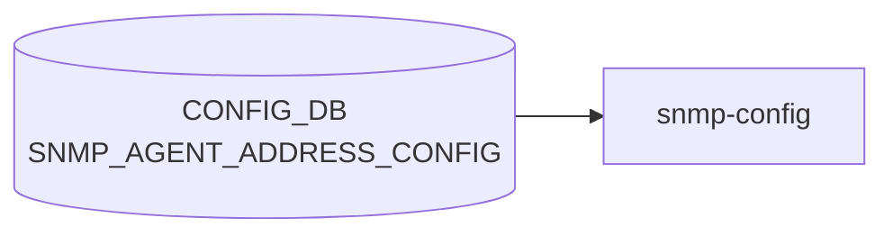

# SNMP_AGENT_ADDRESS_CONFIG テーブル

## 概要

`snmpd` のリッスンアドレスと UDP ポートを [CONFIG_DB](../../reference/glossary.md#term-config_db) に登録するテーブル[^1]。`docker-snmp` 起動スクリプトが [CONFIG_DB](../../reference/glossary.md#term-config_db) を読み、`snmpd.conf` の `agentaddress` 行を生成する。複数エントリで複数アドレス / ポート / [VRF](../../reference/glossary.md#term-vrf) を同時に bind できる。

<!-- cdb-mermaid -->
### データフロー (自動生成)



!!! note "凡例"
    CONFIG_DB から SAI までの典型経路を `docs/reference/config-db-orch-map.md` から機械生成したミニ図。詳細・例外は本ページ本文と対応表を参照。
<!-- /cdb-mermaid -->

## key 構造

```text
SNMP_AGENT_ADDRESS_CONFIG|<agent_ip>|<port>|<vrf_name>
```

`(agent_ip, port, vrf_name)` の 3 要素複合キー。`unique "agent_ip port"` 制約で同一 (ip, port) の重複は禁止。

## フィールド

| フィールド | 型 | 説明 |
|-----------|----|------|
| `agent_ip` | `inet:ip-address` | [SNMP](../../reference/glossary.md#term-snmp) エージェントの bind IP |
| `port` | `inet:port-number` または空文字 (default 161 を意味する) | bind UDP ポート |
| `vrf_name` | enum: 空文字 / `mgmt` / `Vrf<name>` (`Vrf[a-zA-Z0-9_-]+`) | bind [VRF](../../reference/glossary.md#term-vrf)。空文字は default |

## 制約

- key の 3 要素のうち `port`/`vrf_name` は空文字パターン (`pattern ''`) を許容しており、空文字は「未指定 = 既定 (161 / default [VRF](../../reference/glossary.md#term-vrf))」を意味する
- `unique "agent_ip port"` により、同一の (ip, port) を異なる VRF に重複登録することはできない[^1]

## 購読者

- `docker-snmp` の `snmpd` テンプレ: [CONFIG_DB](../../reference/glossary.md#term-config_db) → `agentaddress udp:<ip>:<port>[%vrf]` 行を生成

## 関連 CONFIG_DB / YANG / CLI

- 関連 CONFIG_DB: [`SNMP`](snmp.md), `SNMP_COMMUNITY`, `SNMP_USER`
- 関連 CLI: `config snmp agentaddress { add | del } <ip> [-p <port>] [-v <vrf>]`
- 関連 [YANG](../../reference/glossary.md#term-yang): `sonic-snmp`

<!-- ref-triangle:start -->

## 関連リファレンス

- [YANG](../../reference/glossary.md#term-yang): [`sonic-snmp`](../yang/sonic-snmp.md)
- CLI: [`config snmp agentaddress`](../cli/config-snmp.md)

<!-- ref-triangle:end -->

## 引用元

[^1]: `src/sonic-yang-models/yang-models/sonic-snmp.yang` (container `SNMP_AGENT_ADDRESS_CONFIG` / list `SNMP_AGENT_ADDRESS_CONFIG_LIST`、key と unique 制約). <https://github.com/sonic-net/sonic-buildimage/blob/9ea932ec2e18f35e58268ec2e4456b1d4afd65cd/src/sonic-yang-models/yang-models/sonic-snmp.yang>

## 関連ページ
- [CONFIG_DB: SNMP](snmp.md)

<!-- ops-hint -->
## 運用ヒント

### 典型値

- key 形式: `SNMP_AGENT_ADDRESS_CONFIG|<ip>|<port>|<vrf>`。
- port=`161`、vrf=`mgmt` でマネジメント面のみ listen。

### よくある誤設定

- vrf 指定を空にして default VRF で listen し続け、front-panel から [SNMP](../../reference/glossary.md#term-snmp) が抜ける。

### 確認コマンド

```bash
sonic-db-cli CONFIG_DB keys 'SNMP_AGENT_ADDRESS_CONFIG|*'
show runningconfiguration snmp
```
<!-- /ops-hint -->

<!-- value-behavior -->
## 値依存挙動マトリクス

### `port` 値別挙動
| 値 | 挙動 |
|----|------|
| 空文字 `""` | [YANG](../../reference/glossary.md#term-yang) `pattern ''` 許容。snmpd.conf ではデフォルトポート 161 として処理される。 |
| `161` | 標準 [SNMP](../../reference/glossary.md#term-snmp) ポート。 |
| その他の port-number | 非標準ポートで snmpd がリッスン。ファイアウォール設定の調整が必要。 |

### `vrf_name` 値別挙動
| 値 | 挙動 |
|----|------|
| 空文字 `""` | default VRF（全インタフェース）でリッスン。 |
| `mgmt` | 管理 VRF でリッスン。snmpd.conf の `agentaddress` に `@mgmt` が付与。 |
| `Vrf<name>` | 指定 VRF でリッスン。VRF が実際に存在しない場合は snmpd 起動後にリッスン失敗（CONFIG_DB レベルでは検知不可）。 |

### エントリなしの場合
| 条件 | 挙動 |
|------|------|
| テーブルにエントリが 1 件もない | テンプレートが `agentAddress udp:161` / `agentAddress udp6:161` をデフォルト出力。 |

<!-- /value-behavior -->

<!-- defaults -->
## コード由来の暗黙デフォルト・Fallback

`SNMP_AGENT_ADDRESS_CONFIG` は hostcfgd を経由せず、`docker-snmp` の Jinja2 テンプレート (`dockers/docker-snmp/snmpd.conf.j2`) が CONFIG_DB を直接読んで `snmpd.conf` を生成する。このため「コード由来デフォルト」はテンプレートのレンダリングロジックと net-snmp 既定値の組み合わせで決まる。YANG `sonic-snmp.yang` 側に `default` 宣言は無く、空文字許容 (`pattern ''`) のみ。

### `port` 空文字 → 実効 161/udp（テンプレ + net-snmp 既定）

`snmpd.conf.j2:28-29` の for ループは `:{{ port }}` で port 指定が空ならコロンサフィックスを省略する。生成される行は `agentAddress udp:[<ip>]` となり、net-snmp は port 省略時に **161/udp** にバインドする。YANG `default` 宣言は無いため、161 という値は完全にコード（テンプレ + net-snmp）由来。

### エントリ 0 件時 → `udp:161` + `udp6:161` のハードコード fallback

`snmpd.conf.j2:31-34` の `` 分岐:

```jinja

agentAddress udp:161
agentAddress udp6:161

```

テーブルにエントリが 1 件もない場合、IPv4 と IPv6 の両方で 161/udp listen が **テンプレ内ハードコード** で出力される。CONFIG_DB / YANG にこの fallback を示すフィールドは無く、ソース上はこの 2 行が唯一の真実源。

### `vrf_name` 空文字 → 実効 default VRF（テンプレ）

`snmpd.conf.j2:29` の `@{{ vrf }}` により `vrf` が空文字なら `@<vrf>` サフィックスが省略され、snmpd はカーネル default routing namespace（= default VRF）でリッスンする。「空文字 = default VRF」というセマンティクスは YANG 側に明示宣言が無く、テンプレと net-snmp の挙動でのみ担保される。ただし `MGMT_VRF_CONFIG.mgmtVrfEnabled=true` の状態では CLI (`config/main.py:4153-4157`) が `-v` 省略を **CLI 層で拒否** するため、この「vrf 空 → default」経路が成立するのは Management VRF 無効時のみ。

### プロトコル (`udp` / `udp6`) の自動選択

`snmpd.conf.j2:19-25` の `protocol(ip_addr)` macro が `agent_ip` を `split('%')[0]` した上で `|ipv6` Jinja2 フィルタで判定し、IPv6 リテラルなら `udp6`、それ以外なら `udp` を返す。CONFIG_DB / YANG にプロトコル種別フィールドは存在せず、**完全にテンプレ macro 由来の派生**。link-local アドレスの zone id (`%eth0` 等) は判定前に除去されるため誤判定しない。

### CLI 側の補助挙動

`sonic-utilities/config/main.py:4139-4140` で `-p` / `-v` には click `default=` が **宣言されておらず**、省略時は CONFIG_DB key に空文字部分 (`<ip>||` 等) が格納される。実効値はすべてテンプレ側で補完される設計。

> **Evidence**: `sonic-buildimage/dockers/docker-snmp/snmpd.conf.j2:19-34` (テンプレ macro + for/else 分岐)、`sonic-utilities/config/main.py:4137-4190` (CLI 側 click default 不在)、`sonic-host-services/scripts/hostcfgd` (grep で `SNMP_AGENT_ADDRESS` ヒット 0 件 = 非経由)。詳細は `meta/_intermediate/cdb-flow/snmp-agent-address-config-defaults.md` を参照。
<!-- /defaults -->

<!-- cdb-exceptions -->
## 例外条件・特殊挙動

- **エントリが空の場合はデフォルトリッスンアドレス**: `SNMP_AGENT_ADDRESS_CONFIG` にエントリが 1 件もない場合、snmpd.conf テンプレートは `agentAddress udp:161` / `agentAddress udp6:161` をデフォルトとして出力する。[^2]
- **VRF が実際に存在しない場合**: `vrf` フィールドを指定しても VRF が実際に存在しない場合、snmpd は起動後そのアドレスでのリッスンに失敗するが CONFIG_DB レベルでは検知されない。[^2]
- **設定変更の反映はコンテナ再起動時のみ**: テーブル変更は `docker-snmp` コンテナの再起動 / snmpd プロセスリロードまで snmpd.conf に反映されない。[^2]
- **key フォーマット**: key は `<ip>|<port>|<vrf>` または `<ip>|<port>` 形式。区切りが正しくない場合はテンプレートレンダリングエラーになる。[^2]

[^2]: snmpd.conf テンプレート: `sonic-buildimage/dockers/docker-snmp/snmpd.conf.j2`. <https://github.com/sonic-net/sonic-buildimage/blob/master/dockers/docker-snmp/snmpd.conf.j2>


<!-- derivation -->
## 派生・条件付き登録 (Phase 6/7)

### Phase 6: 自動派生

snmp-config サービスが `ip` + `port` + `interface` の組み合わせから snmpd の `agentAddress` ディレクティブを自動生成する。`interface` フィールドが mgmt VRF 名の場合は `udp:<ip>:<port>@<vrf>` 形式で VRF バインドが自動付与される。

### Phase 7: 条件付き登録 (add_manager 条件)

sonic-snmpagent サービスが有効の場合のみ `SNMP_AGENT_ADDRESS_CONFIG` を購読する snmp-config が動作する。エントリがない場合は snmpd がデフォルトの agentAddress を使用する。

<!-- /derivation -->

<!-- handler-branching -->
### Phase 8: Handler メソッド内分岐

| Handler | 分岐条件 | 効果 | evidence |
|---|---|---|---|
| `snmp-config` | `interface` フィールドあり | VRF バインド形式の agentAddress 生成 | `snmp_config` |
| `snmp-config` | `interface` フィールドなし | シンプルな `udp:<ip>:<port>` 形式 | `snmp_config` |
| `snmp-config` | `port` フィールドあり | カスタムポート使用 (デフォルト 161) | `snmp_config` |
| `snmp-config` | エントリ削除時 | snmpd 設定から対応 agentAddress 行を削除して reload | `snmp_config` |

> **スキャン証跡**: `SNMP_AGENT_ADDRESS_CONFIG` は snmpd のリッスンアドレス/ポート/VRF を設定するシンプルテーブル。`interface` フィールド有無が VRF バインドを自動決定する（Phase 6 相当）。

<!-- /handler-branching -->

<!-- runtime-trace -->
## CDB → 実コンテナ動作トレース

### 段階 1: Consumer 登録

- **hostcfgd**: `SNMP_AGENT_ADDRESS_CONFIG` テーブルを `ConfigDBConnector` で購読。

### 段階 2: CFG → APPL 翻訳

- hostcfgd が SNMP エージェント (`snmpd`) のリッスンアドレス設定を `/etc/snmp/snmpd.conf` に書き込み再起動。
- APP_DB への書き込みなし。

### 段階 3: APPL → SAI

- SAI 経由なし。snmpd がデータプレーン統計を直接 SAI/kernel から読み取る。

### 段階 4: タイミング + 副作用

- snmpd 再起動まで数秒。既存 SNMP セッションは切断される。
- 副作用: リッスンアドレス変更中に SNMP モニタリングが一時停止。

<!-- /runtime-trace -->
<!-- entry-points -->
## 書き込み入り口 (Direction A)

SNMP_AGENT_ADDRESS_CONFIG テーブルへの書き込みが発生するコード経路を網羅的に調査した結果。

### CLI

  - `config snmp agentaddress add/del ...` — `config/main.py` が `set_entry('SNMP_AGENT_ADDRESS_CONFIG', key, {})` を呼ぶ (sonic-utilities/config/main.py:4142–4186)

### minigraph / sonic-cfggen

minigraph.py に SNMP_AGENT_ADDRESS_CONFIG 生成なし

### REST / gNMI

REST/gNMI 書き込み経路なし

### db_migrator

db_migrator.py での SNMP_AGENT_ADDRESS_CONFIG マイグレーションなし

### ビルド時デフォルト (build-time default)

なし

### ハードコードデフォルト / ランタイム注入

なし

### 死活・デッドコード

なし
<!-- /entry-points -->

<!-- ordering -->
## 書込み順依存 (Phase B)

### 1. 同一 (ip, port) 重複: DEL 先行が必須

`unique "agent_ip port"` 制約（`sonic-snmp.yang` L171）により、同一 `(ip, port)` を異なる `vrf_name` で重複登録すると YANG バリデーションが拒否する。VRF を変更する場合は旧エントリを DEL してから新エントリを SET する。CLI は `get_keys` による事前重複チェックで YANG 層到達前に防ぐ（`config/main.py:4177-4182`）。

### 2. MGMT_VRF_CONFIG が有効な場合は VRF 指定必須

`config snmp agentaddress add <ip>` に `-v` オプションを省略した状態で `MGMT_VRF_CONFIG|vrf_global.mgmtVrfEnabled = 'true'` が存在すると、CLI が "ManagementVRF is Enabled. Provide vrf." を出力して CONFIG_DB への書込みをブロックする（`config/main.py:4153-4157`）。Management VRF を使う場合は `-v mgmt` を明示する。

### 3. IP アドレスが NIC に付与済みであること

CLI は `netifaces.interfaces()` で agentip が実際にホスト NIC に付与されているかを確認する（`config/main.py:4160-4171`）。IP 未付与の場合は "IP address is not available" でリジェクトされる。

### 4. VRF が実在してから agentaddress を設定

`vrf_name` に `mgmt` / `Vrf<name>` を指定しても VRF がカーネルに存在しない場合、CONFIG_DB への書込みは成功するが snmpd が agentAddress バインドに失敗する。YANG は VRF 実在チェックを行わない。正しい順序: `config vrf add <vrf>` → `config snmp agentaddress add <ip> -v <vrf>`。

### 5. SET 後は snmp コンテナ再起動が必要

エントリを SET しても `systemctl restart snmp` でコンテナを再起動しなければ snmpd.conf は更新されない。CLI (`config snmp agentaddress add/del`) は書込み直後に自動で `os.system("systemctl restart snmp")` を呼ぶ（`config/main.py:4189`）。直接 `sonic-db-cli` で書き込む場合は手動で再起動が必要。

### 6. minigraph 経路: MGMT_INTERFACE → SNMP_AGENT_ADDRESS_CONFIG

`minigraph.py` は `MGMT_INTERFACE` / `LOOPBACK_INTERFACE` を解析した後に `SNMP_AGENT_ADDRESS_CONFIG` を生成する（L2308-2322）。multi-asic 環境では自動生成が行われず空辞書となる。

| # | 依存関係 | 方向 | 違反時の挙動 |
|---|----------|------|------------|
| 1 | 旧エントリ DEL → 同 (ip,port) 新エントリ SET | **必須先行** | YANG unique 違反（SET 失敗） |
| 2 | `MGMT_VRF_CONFIG.mgmtVrfEnabled=true` 時は `-v mgmt` 指定 | **CLI 強制** | CLI ブロック（DB 書込み不達） |
| 3 | NIC への IP 付与 → `agentaddress add <ip>` | **CLI 強制** | "IP address is not available" 拒否 |
| 4 | `config vrf add <vrf>` → `agentaddress add <ip> -v <vrf>` | **推奨先行** | DB 書込み成功、snmpd bind 失敗 |
| 5 | SET 完了 → `systemctl restart snmp` | **必須後続** | snmpd.conf 未更新（旧設定継続） |
| 6 | `MGMT_INTERFACE`/`LOOPBACK_INTERFACE` 先行 → minigraph 自動生成 | **minigraph 内部** | 空辞書（multi-asic では常時空） |

<!-- /ordering -->

<!-- glossary-links-injected: 59acbdd0f2b6 -->
