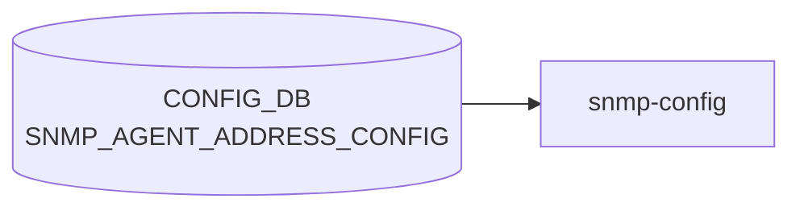

# SNMP_AGENT_ADDRESS_CONFIG テーブル

## 概要

`snmpd` のリッスンアドレスと UDP ポートを [CONFIG_DB](../../reference/glossary.md#term-config_db) に登録するテーブル[^1]。`docker-snmp` 起動スクリプトが [CONFIG_DB](../../reference/glossary.md#term-config_db) を読み、`snmpd.conf` の `agentaddress` 行を生成する。複数エントリで複数アドレス / ポート / [VRF](../../reference/glossary.md#term-vrf) を同時に bind できる。

<!-- cdb-mermaid -->
### データフロー (自動生成)



!!! note "凡例"
    CONFIG_DB から SAI までの典型経路を `docs/reference/config-db-orch-map.md` から機械生成したミニ図。詳細・例外は本ページ本文と対応表を参照。
<!-- /cdb-mermaid -->

## key 構造

```text
SNMP_AGENT_ADDRESS_CONFIG|<agent_ip>|<port>|<vrf_name>
```

`(agent_ip, port, vrf_name)` の 3 要素複合キー。`unique "agent_ip port"` 制約で同一 (ip, port) の重複は禁止。

## フィールド

| フィールド | 型 | 説明 |
|-----------|----|------|
| `agent_ip` | `inet:ip-address` | [SNMP](../../reference/glossary.md#term-snmp) エージェントの bind IP |
| `port` | `inet:port-number` または空文字 (default 161 を意味する) | bind UDP ポート |
| `vrf_name` | enum: 空文字 / `mgmt` / `Vrf<name>` (`Vrf[a-zA-Z0-9_-]+`) | bind [VRF](../../reference/glossary.md#term-vrf)。空文字は default |

## 制約

- key の 3 要素のうち `port`/`vrf_name` は空文字パターン (`pattern ''`) を許容しており、空文字は「未指定 = 既定 (161 / default [VRF](../../reference/glossary.md#term-vrf))」を意味する
- `unique "agent_ip port"` により、同一の (ip, port) を異なる VRF に重複登録することはできない[^1]

## 購読者

- `docker-snmp` の `snmpd` テンプレ: [CONFIG_DB](../../reference/glossary.md#term-config_db) → `agentaddress udp:<ip>:<port>[%vrf]` 行を生成

## 関連 CONFIG_DB / YANG / CLI

- 関連 CONFIG_DB: [`SNMP`](snmp.md), `SNMP_COMMUNITY`, `SNMP_USER`
- 関連 CLI: `config snmp agentaddress { add | del } <ip> [-p <port>] [-v <vrf>]`
- 関連 [YANG](../../reference/glossary.md#term-yang): `sonic-snmp`

<!-- ref-triangle:start -->

## 関連リファレンス

- [YANG](../../reference/glossary.md#term-yang): [`sonic-snmp`](../yang/sonic-snmp.md)
- CLI: [`config snmp agentaddress`](../cli/config-snmp.md)

<!-- ref-triangle:end -->

## 引用元

[^1]: `src/sonic-yang-models/yang-models/sonic-snmp.yang` (container `SNMP_AGENT_ADDRESS_CONFIG` / list `SNMP_AGENT_ADDRESS_CONFIG_LIST`、key と unique 制約). <https://github.com/sonic-net/sonic-buildimage/blob/9ea932ec2e18f35e58268ec2e4456b1d4afd65cd/src/sonic-yang-models/yang-models/sonic-snmp.yang>

## 関連ページ
- [CONFIG_DB: SNMP](snmp.md)

<!-- ops-hint -->
## 運用ヒント

### 典型値

- key 形式: `SNMP_AGENT_ADDRESS_CONFIG|<ip>|<port>|<vrf>`。
- port=`161`、vrf=`mgmt` でマネジメント面のみ listen。

### よくある誤設定

- vrf 指定を空にして default VRF で listen し続け、front-panel から [SNMP](../../reference/glossary.md#term-snmp) が抜ける。

### 確認コマンド

```bash
sonic-db-cli CONFIG_DB keys 'SNMP_AGENT_ADDRESS_CONFIG|*'
show runningconfiguration snmp
```
<!-- /ops-hint -->

<!-- value-behavior -->
## 値依存挙動マトリクス

### `port` 値別挙動
| 値 | 挙動 |
|----|------|
| 空文字 `""` | [YANG](../../reference/glossary.md#term-yang) `pattern ''` 許容。snmpd.conf ではデフォルトポート 161 として処理される。 |
| `161` | 標準 [SNMP](../../reference/glossary.md#term-snmp) ポート。 |
| その他の port-number | 非標準ポートで snmpd がリッスン。ファイアウォール設定の調整が必要。 |

### `vrf_name` 値別挙動
| 値 | 挙動 |
|----|------|
| 空文字 `""` | default VRF（全インタフェース）でリッスン。 |
| `mgmt` | 管理 VRF でリッスン。snmpd.conf の `agentaddress` に `@mgmt` が付与。 |
| `Vrf<name>` | 指定 VRF でリッスン。VRF が実際に存在しない場合は snmpd 起動後にリッスン失敗（CONFIG_DB レベルでは検知不可）。 |

### エントリなしの場合
| 条件 | 挙動 |
|------|------|
| テーブルにエントリが 1 件もない | テンプレートが `agentAddress udp:161` / `agentAddress udp6:161` をデフォルト出力。 |

<!-- /value-behavior -->

<!-- cdb-exceptions -->
## 例外条件・特殊挙動

- **エントリが空の場合はデフォルトリッスンアドレス**: `SNMP_AGENT_ADDRESS_CONFIG` にエントリが 1 件もない場合、snmpd.conf テンプレートは `agentAddress udp:161` / `agentAddress udp6:161` をデフォルトとして出力する。[^2]
- **VRF が実際に存在しない場合**: `vrf` フィールドを指定しても VRF が実際に存在しない場合、snmpd は起動後そのアドレスでのリッスンに失敗するが CONFIG_DB レベルでは検知されない。[^2]
- **設定変更の反映はコンテナ再起動時のみ**: テーブル変更は `docker-snmp` コンテナの再起動 / snmpd プロセスリロードまで snmpd.conf に反映されない。[^2]
- **key フォーマット**: key は `<ip>|<port>|<vrf>` または `<ip>|<port>` 形式。区切りが正しくない場合はテンプレートレンダリングエラーになる。[^2]

[^2]: snmpd.conf テンプレート: `sonic-buildimage/dockers/docker-snmp/snmpd.conf.j2`. <https://github.com/sonic-net/sonic-buildimage/blob/master/dockers/docker-snmp/snmpd.conf.j2>


<!-- runtime-trace -->
## CDB → 実コンテナ動作トレース

### 段階 1: Consumer 登録

- **hostcfgd**: `SNMP_AGENT_ADDRESS_CONFIG` テーブルを `ConfigDBConnector` で購読。

### 段階 2: CFG → APPL 翻訳

- hostcfgd が SNMP エージェント (`snmpd`) のリッスンアドレス設定を `/etc/snmp/snmpd.conf` に書き込み再起動。
- APP_DB への書き込みなし。

### 段階 3: APPL → SAI

- SAI 経由なし。snmpd がデータプレーン統計を直接 SAI/kernel から読み取る。

### 段階 4: タイミング + 副作用

- snmpd 再起動まで数秒。既存 SNMP セッションは切断される。
- 副作用: リッスンアドレス変更中に SNMP モニタリングが一時停止。

<!-- /runtime-trace -->

<!-- glossary-links-injected: 59acbdd0f2b6 -->
