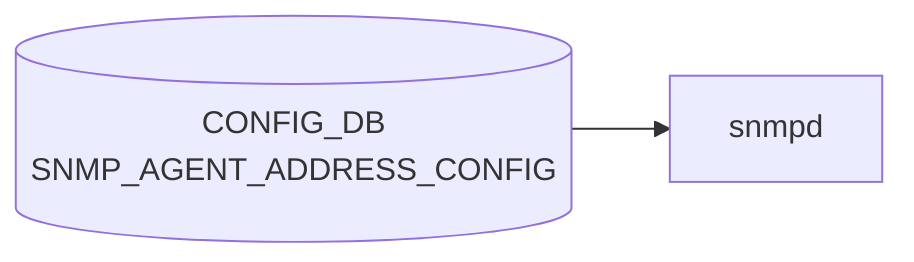

# SNMP_AGENT_ADDRESS_CONFIG テーブル

## 概要

`snmpd` のリッスンアドレスと UDP ポートを CONFIG_DB に登録するテーブル[^1]。`docker-snmp` 起動スクリプトが CONFIG_DB を読み、`snmpd.conf` の `agentaddress` 行を生成する。複数エントリで複数アドレス / ポート / VRF を同時に bind できる。

<!-- cdb-mermaid -->
### データフロー (自動生成)



!!! note "凡例"
    CONFIG_DB から SAI までの典型経路を `docs/reference/config-db-orch-map.md` から機械生成したミニ図。詳細・例外は本ページ本文と対応表を参照。
<!-- /cdb-mermaid -->

## key 構造

```
SNMP_AGENT_ADDRESS_CONFIG|<agent_ip>|<port>|<vrf_name>
```

`(agent_ip, port, vrf_name)` の 3 要素複合キー。`unique "agent_ip port"` 制約で同一 (ip, port) の重複は禁止。

## フィールド

| フィールド | 型 | 説明 |
|-----------|----|------|
| `agent_ip` | `inet:ip-address` | SNMP エージェントの bind IP |
| `port` | `inet:port-number` または空文字 (default 161 を意味する) | bind UDP ポート |
| `vrf_name` | enum: 空文字 / `mgmt` / `Vrf<name>` (`Vrf[a-zA-Z0-9_-]+`) | bind VRF。空文字は default |

## 制約

- key の 3 要素のうち `port`/`vrf_name` は空文字パターン (`pattern ''`) を許容しており、空文字は「未指定 = 既定 (161 / default VRF)」を意味する
- `unique "agent_ip port"` により、同一の (ip, port) を異なる VRF に重複登録することはできない[^1]

## 購読者

- `docker-snmp` の `snmpd` テンプレ: CONFIG_DB → `agentaddress udp:<ip>:<port>[%vrf]` 行を生成

## 関連 CONFIG_DB / YANG / CLI

- 関連 CONFIG_DB: [`SNMP`](snmp.md), `SNMP_COMMUNITY`, `SNMP_USER`
- 関連 CLI: `config snmp agentaddress { add | del } <ip> [-p <port>] [-v <vrf>]`
- 関連 YANG: `sonic-snmp`

<!-- ref-triangle:start -->

## 関連リファレンス

- YANG: [`sonic-snmp`](../yang/sonic-snmp.md)
- CLI: [`config snmp agentaddress`](../cli/config-snmp.md)

<!-- ref-triangle:end -->

## 引用元

[^1]: `src/sonic-yang-models/yang-models/sonic-snmp.yang` (container `SNMP_AGENT_ADDRESS_CONFIG` / list `SNMP_AGENT_ADDRESS_CONFIG_LIST`、key と unique 制約). <https://github.com/sonic-net/sonic-buildimage/blob/9ea932ec2e18f35e58268ec2e4456b1d4afd65cd/src/sonic-yang-models/yang-models/sonic-snmp.yang>

## 関連ページ
- [CONFIG_DB: SNMP](snmp.md)

<!-- ops-hint -->
## 運用ヒント

### 典型値

- key 形式: `SNMP_AGENT_ADDRESS_CONFIG|<ip>|<port>|<vrf>`。
- port=`161`、vrf=`mgmt` でマネジメント面のみ listen。

### よくある誤設定

- vrf 指定を空にして default VRF で listen し続け、front-panel から SNMP が抜ける。

### 確認コマンド

```bash
sonic-db-cli CONFIG_DB keys 'SNMP_AGENT_ADDRESS_CONFIG|*'
show runningconfiguration snmp
```
<!-- /ops-hint -->
