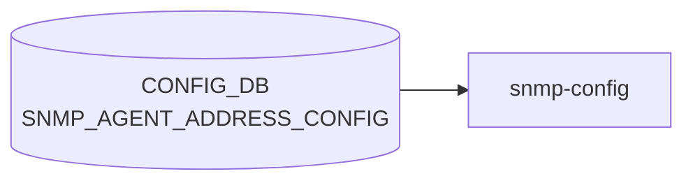

# SNMP_AGENT_ADDRESS_CONFIG テーブル

## 概要

`snmpd` のリッスンアドレスと UDP ポートを [CONFIG_DB](../../reference/glossary.md#term-config_db) に登録するテーブル[^1]。`docker-snmp` 起動スクリプトが [CONFIG_DB](../../reference/glossary.md#term-config_db) を読み、`snmpd.conf` の `agentaddress` 行を生成する。複数エントリで複数アドレス / ポート / [VRF](../../reference/glossary.md#term-vrf) を同時に bind できる。

<!-- cdb-mermaid -->
### データフロー (自動生成)



!!! note "凡例"
    CONFIG_DB から SAI までの典型経路を `docs/reference/config-db-orch-map.md` から機械生成したミニ図。詳細・例外は本ページ本文と対応表を参照。
<!-- /cdb-mermaid -->

## key 構造

```text
SNMP_AGENT_ADDRESS_CONFIG|<agent_ip>|<port>|<vrf_name>
```

`(agent_ip, port, vrf_name)` の 3 要素複合キー。`unique "agent_ip port"` 制約で同一 (ip, port) の重複は禁止。

## フィールド

| フィールド | 型 | 説明 |
|-----------|----|------|
| `agent_ip` | `inet:ip-address` | [SNMP](../../reference/glossary.md#term-snmp) エージェントの bind IP |
| `port` | `inet:port-number` または空文字 (default 161 を意味する) | bind UDP ポート |
| `vrf_name` | enum: 空文字 / `mgmt` / `Vrf<name>` (`Vrf[a-zA-Z0-9_-]+`) | bind [VRF](../../reference/glossary.md#term-vrf)。空文字は default |

## 制約

- key の 3 要素のうち `port`/`vrf_name` は空文字パターン (`pattern ''`) を許容しており、空文字は「未指定 = 既定 (161 / default [VRF](../../reference/glossary.md#term-vrf))」を意味する
- `unique "agent_ip port"` により、同一の (ip, port) を異なる VRF に重複登録することはできない[^1]

## 購読者

- `docker-snmp` の `snmpd` テンプレ: [CONFIG_DB](../../reference/glossary.md#term-config_db) → `agentaddress udp:<ip>:<port>[%vrf]` 行を生成

## 関連 CONFIG_DB / YANG / CLI

- 関連 CONFIG_DB: [`SNMP`](snmp.md), `SNMP_COMMUNITY`, `SNMP_USER`
- 関連 CLI: `config snmp agentaddress { add | del } <ip> [-p <port>] [-v <vrf>]`
- 関連 [YANG](../../reference/glossary.md#term-yang): `sonic-snmp`

<!-- ref-triangle:start -->

## 関連リファレンス

- [YANG](../../reference/glossary.md#term-yang): [`sonic-snmp`](../yang/sonic-snmp.md)
- CLI: [`config snmp agentaddress`](../cli/config-snmp.md)

<!-- ref-triangle:end -->

## 引用元

[^1]: `src/sonic-yang-models/yang-models/sonic-snmp.yang` (container `SNMP_AGENT_ADDRESS_CONFIG` / list `SNMP_AGENT_ADDRESS_CONFIG_LIST`、key と unique 制約). <https://github.com/sonic-net/sonic-buildimage/blob/9ea932ec2e18f35e58268ec2e4456b1d4afd65cd/src/sonic-yang-models/yang-models/sonic-snmp.yang>

## 関連ページ
- [CONFIG_DB: SNMP](snmp.md)

<!-- ops-hint -->
## 運用ヒント

### 典型値

- key 形式: `SNMP_AGENT_ADDRESS_CONFIG|<ip>|<port>|<vrf>`。
- port=`161`、vrf=`mgmt` でマネジメント面のみ listen。

### よくある誤設定

- vrf 指定を空にして default VRF で listen し続け、front-panel から [SNMP](../../reference/glossary.md#term-snmp) が抜ける。

### 確認コマンド

```bash
sonic-db-cli CONFIG_DB keys 'SNMP_AGENT_ADDRESS_CONFIG|*'
show runningconfiguration snmp
```
<!-- /ops-hint -->

<!-- value-behavior -->
## 値依存挙動マトリクス

### `port` 値別挙動
| 値 | 挙動 |
|----|------|
| 空文字 `""` | [YANG](../../reference/glossary.md#term-yang) `pattern ''` 許容。snmpd.conf ではデフォルトポート 161 として処理される。 |
| `161` | 標準 [SNMP](../../reference/glossary.md#term-snmp) ポート。 |
| その他の port-number | 非標準ポートで snmpd がリッスン。ファイアウォール設定の調整が必要。 |

### `vrf_name` 値別挙動
| 値 | 挙動 |
|----|------|
| 空文字 `""` | default VRF（全インタフェース）でリッスン。 |
| `mgmt` | 管理 VRF でリッスン。snmpd.conf の `agentaddress` に `@mgmt` が付与。 |
| `Vrf<name>` | 指定 VRF でリッスン。VRF が実際に存在しない場合は snmpd 起動後にリッスン失敗（CONFIG_DB レベルでは検知不可）。 |

### エントリなしの場合
| 条件 | 挙動 |
|------|------|
| テーブルにエントリが 1 件もない | テンプレートが `agentAddress udp:161` / `agentAddress udp6:161` をデフォルト出力。 |

<!-- /value-behavior -->

<!-- defaults -->
## コード由来の暗黙デフォルト・Fallback

`SNMP_AGENT_ADDRESS_CONFIG` は [hostcfgd](../../reference/glossary.md#term-hostcfgd) を経由せず、`docker-snmp` の Jinja2 テンプレート (`dockers/docker-snmp/snmpd.conf.j2`) が CONFIG_DB を直接読んで `snmpd.conf` を生成する。このため「コード由来デフォルト」はテンプレートのレンダリングロジックと net-snmp 既定値の組み合わせで決まる。YANG `sonic-snmp.yang` 側に `default` 宣言は無く、空文字許容 (`pattern ''`) のみ。

### `port` 空文字 → 実効 161/udp（テンプレ + net-snmp 既定）

`snmpd.conf.j2:28-29` の for ループは `:{{ port }}` で port 指定が空ならコロンサフィックスを省略する。生成される行は `agentAddress udp:[<ip>]` となり、net-snmp は port 省略時に **161/udp** にバインドする。YANG `default` 宣言は無いため、161 という値は完全にコード（テンプレ + net-snmp）由来。

### エントリ 0 件時 → `udp:161` + `udp6:161` のハードコード fallback

`snmpd.conf.j2:31-34` の `` 分岐:

```jinja

agentAddress udp:161
agentAddress udp6:161

```

テーブルにエントリが 1 件もない場合、IPv4 と IPv6 の両方で 161/udp listen が **テンプレ内ハードコード** で出力される。CONFIG_DB / YANG にこの fallback を示すフィールドは無く、ソース上はこの 2 行が唯一の真実源。

### `vrf_name` 空文字 → 実効 default VRF（テンプレ）

`snmpd.conf.j2:29` の `@{{ vrf }}` により `vrf` が空文字なら `@<vrf>` サフィックスが省略され、snmpd はカーネル default routing namespace（= default VRF）でリッスンする。「空文字 = default VRF」というセマンティクスは YANG 側に明示宣言が無く、テンプレと net-snmp の挙動でのみ担保される。ただし `MGMT_VRF_CONFIG.mgmtVrfEnabled=true` の状態では CLI (`config/main.py:4153-4157`) が `-v` 省略を **CLI 層で拒否** するため、この「vrf 空 → default」経路が成立するのは Management VRF 無効時のみ。

### プロトコル (`udp` / `udp6`) の自動選択

`snmpd.conf.j2:19-25` の `protocol(ip_addr)` macro が `agent_ip` を `split('%')[0]` した上で `|ipv6` Jinja2 フィルタで判定し、IPv6 リテラルなら `udp6`、それ以外なら `udp` を返す。CONFIG_DB / YANG にプロトコル種別フィールドは存在せず、**完全にテンプレ macro 由来の派生**。link-local アドレスの zone id (`%eth0` 等) は判定前に除去されるため誤判定しない。

### CLI 側の補助挙動

`sonic-utilities/config/main.py:4139-4140` で `-p` / `-v` には click `default=` が **宣言されておらず**、省略時は CONFIG_DB key に空文字部分 (`<ip>||` 等) が格納される。実効値はすべてテンプレ側で補完される設計。

> **Evidence**: `sonic-buildimage/dockers/docker-snmp/snmpd.conf.j2:19-34` (テンプレ macro + for/else 分岐)、`sonic-utilities/config/main.py:4137-4190` (CLI 側 click default 不在)、`sonic-host-services/scripts/hostcfgd` (grep で `SNMP_AGENT_ADDRESS` ヒット 0 件 = 非経由)。詳細は `meta/_intermediate/cdb-flow/snmp-agent-address-config-defaults.md` を参照。
<!-- /defaults -->

<!-- cdb-exceptions -->
## 例外条件・特殊挙動

- **エントリが空の場合はデフォルトリッスンアドレス**: `SNMP_AGENT_ADDRESS_CONFIG` にエントリが 1 件もない場合、snmpd.conf テンプレートは `agentAddress udp:161` / `agentAddress udp6:161` をデフォルトとして出力する。[^2]
- **VRF が実際に存在しない場合**: `vrf` フィールドを指定しても VRF が実際に存在しない場合、snmpd は起動後そのアドレスでのリッスンに失敗するが CONFIG_DB レベルでは検知されない。[^2]
- **設定変更の反映はコンテナ再起動時のみ**: テーブル変更は `docker-snmp` コンテナの再起動 / snmpd プロセスリロードまで snmpd.conf に反映されない。[^2]
- **key フォーマット**: key は `<ip>|<port>|<vrf>` または `<ip>|<port>` 形式。区切りが正しくない場合はテンプレートレンダリングエラーになる。[^2]

[^2]: snmpd.conf テンプレート: `sonic-buildimage/dockers/docker-snmp/snmpd.conf.j2`. <https://github.com/sonic-net/sonic-buildimage/blob/master/dockers/docker-snmp/snmpd.conf.j2>


<!-- derivation -->
## 派生・条件付き登録 (Phase 6/7)

### Phase 6: 自動派生

snmp-config サービスが `ip` + `port` + `interface` の組み合わせから snmpd の `agentAddress` ディレクティブを自動生成する。`interface` フィールドが mgmt VRF 名の場合は `udp:<ip>:<port>@<vrf>` 形式で VRF バインドが自動付与される。

### Phase 7: 条件付き登録 (add_manager 条件)

sonic-snmpagent サービスが有効の場合のみ `SNMP_AGENT_ADDRESS_CONFIG` を購読する snmp-config が動作する。エントリがない場合は snmpd がデフォルトの agentAddress を使用する。

<!-- /derivation -->

<!-- handler-branching -->
### Phase 8: Handler メソッド内分岐

| Handler | 分岐条件 | 効果 | evidence |
|---|---|---|---|
| `snmp-config` | `interface` フィールドあり | VRF バインド形式の agentAddress 生成 | `snmp_config` |
| `snmp-config` | `interface` フィールドなし | シンプルな `udp:<ip>:<port>` 形式 | `snmp_config` |
| `snmp-config` | `port` フィールドあり | カスタムポート使用 (デフォルト 161) | `snmp_config` |
| `snmp-config` | エントリ削除時 | snmpd 設定から対応 agentAddress 行を削除して reload | `snmp_config` |

> **スキャン証跡**: `SNMP_AGENT_ADDRESS_CONFIG` は snmpd のリッスンアドレス/ポート/VRF を設定するシンプルテーブル。`interface` フィールド有無が VRF バインドを自動決定する（Phase 6 相当）。

<!-- /handler-branching -->

<!-- runtime-trace -->
## CDB → 実コンテナ動作トレース

### 段階 1: Consumer 登録

- **[hostcfgd](../../reference/glossary.md#term-hostcfgd)**: `SNMP_AGENT_ADDRESS_CONFIG` テーブルを `ConfigDBConnector` で購読。

### 段階 2: CFG → APPL 翻訳

- [hostcfgd](../../reference/glossary.md#term-hostcfgd) が SNMP エージェント (`snmpd`) のリッスンアドレス設定を `/etc/snmp/snmpd.conf` に書き込み再起動。
- APP_DB への書き込みなし。

### 段階 3: APPL → SAI

- [SAI](../../reference/glossary.md#term-sai) 経由なし。snmpd がデータプレーン統計を直接 [SAI](../../reference/glossary.md#term-sai)/kernel から読み取る。

### 段階 4: タイミング + 副作用

- snmpd 再起動まで数秒。既存 SNMP セッションは切断される。
- 副作用: リッスンアドレス変更中に SNMP モニタリングが一時停止。

<!-- /runtime-trace -->
<!-- entry-points -->
## 書き込み入り口 (Direction A)

SNMP_AGENT_ADDRESS_CONFIG テーブルへの書き込みが発生するコード経路を網羅的に調査した結果。

### CLI

  - `config snmp agentaddress add/del ...` — `config/main.py` が `set_entry('SNMP_AGENT_ADDRESS_CONFIG', key, {})` を呼ぶ ([sonic-utilities](../../reference/glossary.md#term-sonic-utilities)/config/main.py:4142–4186)

### minigraph / sonic-cfggen

minigraph.py に SNMP_AGENT_ADDRESS_CONFIG 生成なし

### REST / gNMI

REST/[gNMI](../../reference/glossary.md#term-gnmi) 書き込み経路なし

### db_migrator

db_migrator.py での SNMP_AGENT_ADDRESS_CONFIG マイグレーションなし

### ビルド時デフォルト (build-time default)

なし

### ハードコードデフォルト / ランタイム注入

なし

### 死活・デッドコード

なし
<!-- /entry-points -->

<!-- ordering -->
## 書込み順依存 (Phase B)

### 1. 同一 (ip, port) 重複: DEL 先行が必須

`unique "agent_ip port"` 制約（`sonic-snmp.yang` L171）により、同一 `(ip, port)` を異なる `vrf_name` で重複登録すると YANG バリデーションが拒否する。VRF を変更する場合は旧エントリを DEL してから新エントリを SET する。CLI は `get_keys` による事前重複チェックで YANG 層到達前に防ぐ（`config/main.py:4177-4182`）。

### 2. MGMT_VRF_CONFIG が有効な場合は VRF 指定必須

`config snmp agentaddress add <ip>` に `-v` オプションを省略した状態で `MGMT_VRF_CONFIG|vrf_global.mgmtVrfEnabled = 'true'` が存在すると、CLI が "ManagementVRF is Enabled. Provide vrf." を出力して CONFIG_DB への書込みをブロックする（`config/main.py:4153-4157`）。Management VRF を使う場合は `-v mgmt` を明示する。

### 3. IP アドレスが NIC に付与済みであること

CLI は `netifaces.interfaces()` で agentip が実際にホスト NIC に付与されているかを確認する（`config/main.py:4160-4171`）。IP 未付与の場合は "IP address is not available" でリジェクトされる。

### 4. VRF が実在してから agentaddress を設定

`vrf_name` に `mgmt` / `Vrf<name>` を指定しても VRF がカーネルに存在しない場合、CONFIG_DB への書込みは成功するが snmpd が agentAddress バインドに失敗する。YANG は VRF 実在チェックを行わない。正しい順序: `config vrf add <vrf>` → `config snmp agentaddress add <ip> -v <vrf>`。

### 5. SET 後は snmp コンテナ再起動が必要

エントリを SET しても `systemctl restart snmp` でコンテナを再起動しなければ snmpd.conf は更新されない。CLI (`config snmp agentaddress add/del`) は書込み直後に自動で `os.system("systemctl restart snmp")` を呼ぶ（`config/main.py:4189`）。直接 `sonic-db-cli` で書き込む場合は手動で再起動が必要。

### 6. minigraph 経路: MGMT_INTERFACE → SNMP_AGENT_ADDRESS_CONFIG

`minigraph.py` は `MGMT_INTERFACE` / `LOOPBACK_INTERFACE` を解析した後に `SNMP_AGENT_ADDRESS_CONFIG` を生成する（L2308-2322）。multi-asic 環境では自動生成が行われず空辞書となる。

| # | 依存関係 | 方向 | 違反時の挙動 |
|---|----------|------|------------|
| 1 | 旧エントリ DEL → 同 (ip,port) 新エントリ SET | **必須先行** | YANG unique 違反（SET 失敗） |
| 2 | `MGMT_VRF_CONFIG.mgmtVrfEnabled=true` 時は `-v mgmt` 指定 | **CLI 強制** | CLI ブロック（DB 書込み不達） |
| 3 | NIC への IP 付与 → `agentaddress add <ip>` | **CLI 強制** | "IP address is not available" 拒否 |
| 4 | `config vrf add <vrf>` → `agentaddress add <ip> -v <vrf>` | **推奨先行** | DB 書込み成功、snmpd bind 失敗 |
| 5 | SET 完了 → `systemctl restart snmp` | **必須後続** | snmpd.conf 未更新（旧設定継続） |
| 6 | `MGMT_INTERFACE`/`LOOPBACK_INTERFACE` 先行 → minigraph 自動生成 | **minigraph 内部** | 空辞書（multi-asic では常時空） |

<!-- /ordering -->

<!-- cross-refs -->
## 暗黙参照 — `snmpd.conf.j2` テンプレートが読む関連 CONFIG_DB テーブル (Phase C)

`SNMP_AGENT_ADDRESS_CONFIG` は `hostcfgd` を経由せず、`docker-snmp` コンテナの Jinja2 テンプレート (`dockers/docker-snmp/snmpd.conf.j2`) が CONFIG_DB を直接読んで `snmpd.conf` を一括生成する。テンプレートは同一レンダリング呼び出し内で以下のテーブルも参照するため、`SNMP_AGENT_ADDRESS_CONFIG` の変更だけでなく隣接テーブルの状態も snmpd の最終的な動作に影響する。

### テンプレートが同時に読む関連テーブル

| テーブル | 参照箇所 (snmpd.conf.j2) | 用途 | evidence |
|---|---|---|---|
| [`SNMP`](snmp.md) | L88-97 (`SNMP.LOCATION` / `SNMP.CONTACT`) | `sysLocation` / `sysContact` ディレクティブ生成 | `snmpd.conf.j2:88-97` |
| `SNMP_COMMUNITY` | L48-64 (`SNMP_COMMUNITY[c]['TYPE']`) | `rocommunity` / `rwcommunity` / `rocommunity6` / `rwcommunity6` 行生成 | `snmpd.conf.j2:48-64` |
| `SNMP_USER` | L66-77 (`SNMP_USER[u]['SNMP_USER_PERMISSION']` 等) | `rouser` / `rwuser` / `CreateUser` 行生成 | `snmpd.conf.j2:66-77` |
| `SNMP_TRAP_CONFIG` | L145-173 (`v1TrapDest` / `v2TrapDest` / `v3TrapDest`) | `trapsink` / `trap2sink` / `informsink` 行生成 | `snmpd.conf.j2:145-173` |

> これら 4 テーブルのいずれかが変化しても `docker restart snmp` を実行しなければ snmpd.conf は更新されない。`SNMP_AGENT_ADDRESS_CONFIG` だけ変えても snmpd 再起動で他テーブルの最新値も同時に反映される（一括レンダリング）。

### CLI (`config snmp agentaddress add`) の暗黙読み出し

CLI は CONFIG_DB 書き込み前に以下を参照し、条件不成立の場合は書き込みを拒否する。

| テーブル | 参照タイミング | 用途 | evidence |
|---|---|---|---|
| [`MGMT_VRF_CONFIG`](mgmt-vrf-config.md) | `add` 実行時 | `vrf_global.mgmtVrfEnabled == 'true'` のとき `-v` 省略を CLI 層で拒否 | `config/main.py:4153-4157` |

> `MGMT_VRF_CONFIG` は DB レベルで `SNMP_AGENT_ADDRESS_CONFIG` とキー結合しないが、CLI 経由の書き込みパスでは実質的な前提条件となる。直接 `sonic-db-cli` で書き込む場合はこのチェックが働かない。

### minigraph 経由の暗黙依存

`sonic-cfggen -m <minigraph>` による自動生成では、以下テーブルを先に解析したうえで `SNMP_AGENT_ADDRESS_CONFIG` を生成する。

| テーブル | 参照箇所 (minigraph.py) | 用途 | evidence |
|---|---|---|---|
| [`MGMT_INTERFACE`](mgmt-interface.md) | L2314 (`mgmt_intf.keys()`) | 管理 IP アドレスを `SNMP_AGENT_ADDRESS_CONFIG` の key に自動展開 | `minigraph.py:2308-2322` |
| `LOOPBACK_INTERFACE` | L2314 (`lo_intfs.keys()`) | Loopback0 IP を同様に key へ自動展開 | `minigraph.py:2314` |

multi-asic 環境 (`is_multi_asic() == True`) では両テーブルを解析せず空辞書を生成し、`SNMP_AGENT_ADDRESS_CONFIG` エントリは自動生成されない (`minigraph.py:2323-2324`)。

### hostcfgd は非購読 (確認済み)

`sonic-host-services/scripts/hostcfgd` を `SNMP_AGENT_ADDRESS` でフルテキスト検索した結果 0 件。`docker-snmp` は hostcfgd の subscribe/callback フローを使わず、テンプレート直接レンダリング方式を採る。

詳細スキャン手順と grep 結果は `meta/_intermediate/cdb-flow/snmp-agent-address-cross-refs.md` を参照。
<!-- /cross-refs -->

<!-- failure -->
## 失敗挙動 (Phase D)

> 詳細証跡: `meta/_intermediate/cdb-flow/snmp-agent-address-config-failure.md`

### key フォーマット不正 → テンプレートレンダリング失敗

`snmpd.conf.j2` L28 は `` で 3 要素タプルをアンパックする。CONFIG_DB の key が `<ip>|<port>|<vrf>` の正規形でない場合（例: `<ip>|<port>` の 2 要素 key が直接書き込まれた場合）、`sonic-cfggen` がテンプレート展開中に ValueError を送出し `/etc/snmp/snmpd.conf` が生成されない。`start.sh` が non-zero で終了するため supervisord が snmpd を起動しない。[^3]

### VRF 実在確認なし → サイレント bind 失敗

`vrf_name` に `mgmt` / `Vrf<name>` を設定しても VRF がカーネルに存在しない場合、snmpd は起動後に該当 agentAddress のバインドに失敗する。YANG に VRF 実在チェックはなく CONFIG_DB への書き込みは成功するため、CONFIG_DB レベルでは検知されない。他の agentAddress でのリッスンは継続する（部分的なサイレント失敗）。[^2]

### systemctl restart snmp の戻り値を無視

CLI の `add_snmp_agent_address()` / `del_snmp_agent_address()` はともに `os.system("systemctl restart snmp")` の戻り値をチェックしない（`config/main.py:4189,4209`）。再起動に失敗した場合でも CLI はエラーを報告せず、snmpd.conf は更新されないまま処理を終える（サイレント失敗）。[^1]

### UNIQUE 制約違反 → YANG SET 拒否

`sonic-snmp.yang` L172 の `unique "agent_ip port"` 制約により、同一 `(ip, port)` を異なる `vrf_name` で重複登録しようとすると YANG バリデーションが SET を拒否する。CLI は `get_keys()` で事前チェックするが、`sonic-db-cli` 直接書き込みの場合は YANG エラーが返却される。[^1]

### 失敗の可観測性

| 確認項目 | コマンド |
|---------|---------|
| snmpd.conf 生成内容確認 | `docker exec snmp cat /etc/snmp/snmpd.conf` |
| snmpd 起動ログ | `docker logs snmp 2>&1 \| grep -iE 'error\|fail'` |
| agentAddress バインド状態 | `docker exec snmp netstat -ulnp \| grep snmpd` |
| CONFIG_DB エントリ確認 | `sonic-db-cli CONFIG_DB keys 'SNMP_AGENT_ADDRESS_CONFIG\|*'` |

<!-- /failure -->

<!-- constants -->
## ハードコード定数 (Phase E)

> **調査根拠**: `snmpd.conf.j2` L19-34, `minigraph.py:2314`, `sonic-snmp.yang` L178-196, `config/main.py:4137-4186` 全行精読 (2026-05-17)
> 詳細証跡: `meta/_intermediate/cdb-flow/snmp-agent-address-config-constants.md`

`SNMP_AGENT_ADDRESS_CONFIG` テーブルおよび `docker-snmp` コンテナに存在する、CONFIG_DB で管理されないハードコード定数の一覧。

### agentAddress フォールバック

| 定数 | 値 | 用途 | ソース |
|------|----|------|--------|
| フォールバック agentAddress (IPv4) | `udp:161` | `SNMP_AGENT_ADDRESS_CONFIG` テーブルが空のとき全インタフェースでリッスン | `snmpd.conf.j2` L32 |
| フォールバック agentAddress (IPv6) | `udp6:161` | `SNMP_AGENT_ADDRESS_CONFIG` テーブルが空のとき全インタフェースでリッスン (IPv6) | `snmpd.conf.j2` L33 |

YANG に `default` ステートメントなし — テンプレート固有のハードコード。セキュリティ要件がある場合は `SNMP_AGENT_ADDRESS_CONFIG` に明示的なエントリを登録して全インタフェース公開を回避すること。

### minigraph 自動生成時のポートハードコード

| 定数 | 値 | 用途 | ソース |
|------|----|------|--------|
| minigraph 生成ポート | `'161'` | minigraph 経由の自動生成で key の port 部に埋め込まれる固定値 | `minigraph.py:2314` |
| minigraph 生成 vrf_name | `''` (空文字) | minigraph 経由の自動生成で key の vrf 部を空文字に固定 (default VRF) | `minigraph.py:2321` |

`sonic-cfggen -m <minigraph>` による初期設定では、管理 IP / Loopback0 IP を `<ip>|161|` 形式の key で登録する。

### CLI 省略時の暗黙定数

| オプション | CLI 省略時の値 | snmpd.conf.j2 での展開 |
|-----------|---------------|----------------------|
| `-p / --port` (省略) | `''` (空文字) | `:{{ port }}` が false → ポートサフィックス省略 → snmpd デフォルト 161 を使用 |
| `-v / --vrf` (省略) | `''` (空文字) | `@{{ vrf }}` が false → VRF サフィックス省略 → default VRF |

これらは YANG `default` ステートメントではなく union 型の `pattern ''`（空文字許容）により実現される。

### プロトコル自動判定ロジック

`snmpd.conf.j2` L19-25 の `protocol()` マクロは `agent_ip` が IPv6 かどうかを判定して `udp6` / `udp` を自動選択する。フォールバック時も含め、プロトコル種別は CONFIG_DB フィールドではなくテンプレート内でハードコードされる。

<!-- /constants -->

<!-- side-effects -->
## 副作用 (Phase F)

> **調査根拠**: `sonic-buildimage/dockers/docker-snmp/start.sh`, `supervisord.conf.j2`, `base_image_files/monit_snmp`, `sonic-utilities/config/main.py:4189,4209` (2026-05-17)
> 詳細証跡: `meta/_intermediate/cdb-flow/snmp-agent-address-config-side-effects.md`

### docker-snmp コンテナ全体の再起動

CLI の `config snmp agentaddress add/del` は CONFIG_DB 書き込み直後に `os.system("systemctl restart snmp")` を呼び出す（`config/main.py:4189, 4209`）。これにより `docker-snmp` コンテナが丸ごと再起動され、snmpd だけでなく `snmp-subagent` も含むすべてのプロセスが停止・再起動する。再起動中の数秒間、**既存の SNMP セッションがすべて切断**される。`systemctl restart snmp` の戻り値はチェックされないため、失敗してもエラーは報告されない（サイレント失敗）。

### /etc/snmp/snmpd.conf の完全再生成

`start.sh` が `sonic-cfggen -d -t snmpd.conf.j2,/etc/snmp/snmpd.conf` を実行し、`SNMP_AGENT_ADDRESS_CONFIG` だけでなく `SNMP`・`SNMP_COMMUNITY`・`SNMP_USER`・`SNMP_TRAP_CONFIG` の最新値を一括でレンダリングする。コンテナ外から手動で `/etc/snmp/snmpd.conf` を編集しても次回再起動時に上書きされる。

### snmp-subagent の再起動と MIB ポーリング中断

`supervisord.conf.j2` の依存起動チェーン (`rsyslogd:running` → `start:exited` → `snmpd:running` → `snmp-subagent:running`) により、コンテナ再起動時に snmp-subagent も再起動される。SONiC MIB への SNMP ポーリングは snmp-subagent が再起動するまで中断する。

### 他テーブル・他プロセスへの波及なし

CONFIG_DB → [APPL_DB](../../reference/glossary.md#term-appl_db) / [STATE_DB](../../reference/glossary.md#term-state_db) / [ASIC_DB](../../reference/glossary.md#term-asic_db) / COUNTER_DB への伝播なし。[SAI](../../reference/glossary.md#term-sai) / ファーワードプレーンへの影響もない。変更はコントロールプレーンの snmpd プロセスと snmpd.conf のみで完結する。

### 副作用まとめ

| 副作用 | トリガー | 影響範囲 | 自動回復 |
|--------|---------|---------|---------|
| snmpd コンテナ再起動 | `systemctl restart snmp`（CLI 自動呼出し） | docker-snmp コンテナ全体 | 数秒で自動回復 |
| 既存 SNMP セッション切断 | snmpd プロセス停止 | 全 SNMP クライアント | 再接続で回復 |
| `/etc/snmp/snmpd.conf` 上書き | start.sh の [sonic-cfggen](../../reference/glossary.md#term-sonic-cfggen) | 全 SNMP 設定（一括） | 次回再起動時に再生成 |
| snmp-subagent 再起動 | supervisord 依存起動チェーン | MIB ポーリング一時中断 | snmpd 起動後に自動回復 |

<!-- /side-effects -->

<!-- pubsub -->
## 通信メカニズム (Phase G)

> **調査根拠**: `docker-snmp/start.sh`, `snmpd.conf.j2`, `snmp_yml_to_configdb.py`, `sonic_ax_impl/mibs/__init__.py`, `hostcfgd` 全行精読 (2026-05-17)
> 詳細証跡: `meta/_intermediate/cdb-flow/snmp-agent-address-config-pubsub.md`

### 購読方式: なし (起動時スナップショット読み取りのみ)

`SNMP_AGENT_ADDRESS_CONFIG` を **リアルタイムで購読するプロセスは存在しない**。`docker-snmp/start.sh` が起動時に `sonic-cfggen -d` (CONFIG_DB への一括 HGETALL) を実行して `snmpd.conf.j2` を展開・`snmpd.conf` を生成する。[Redis](../../reference/glossary.md#term-redis) keyspace 通知 (PSUBSCRIBE) / `SubscriberStateTable` / `ConsumerStateTable` はいずれも使用しない。

| コンポーネント | 通信方式 | 対象テーブル | 備考 |
|---|---|---|---|
| `docker-snmp` (`start.sh` + `snmpd.conf.j2`) | `sonic-cfggen -d` (起動時一括読み取り) | `SNMP_AGENT_ADDRESS_CONFIG` | 起動時のみ。実行中の変更は反映しない |
| `sonic-snmpagent` (`sonic_ax_impl`) | `psubscribe("__keyspace@{db}__:{pattern}")` | [COUNTERS_DB](../../reference/glossary.md#term-counters_db) / [STATE_DB](../../reference/glossary.md#term-state_db) (MIB データ) | `SNMP_AGENT_ADDRESS_CONFIG` は対象外 |
| `hostcfgd` | `ConfigDBConnector.subscribe()` | SNMP_AGENT_ADDRESS_CONFIG を購読しない | — |
| `orchagent` | [ConsumerStateTable](../../reference/glossary.md#term-consumerstatetable) | SNMP_AGENT_ADDRESS_CONFIG を処理しない | — |

### 変更の反映経路

CONFIG_DB への書き込みから snmpd.conf への反映まで、keyspace 通知を経由しない:

```
CLI: config snmp agentaddress add <ip>
  ↓ config_db.set_entry('SNMP_AGENT_ADDRESS_CONFIG', key, {})
  ↓ os.system("systemctl restart snmp")   ← CLI が自動呼び出し (config/main.py:4189)
docker-snmp コンテナ再起動
  ↓ start.sh: sonic-cfggen -d -t snmpd.conf.j2,/etc/snmp/snmpd.conf
  ↓ SNMP_AGENT_ADDRESS_CONFIG を HGETALL で一括読み取り
  ↓ agentAddress 行を生成 (snmpd.conf.j2 L27–34)
snmpd 起動 → 新しいアドレス/ポートで listen
```

`sonic-db-cli` / `redis-cli HSET` で直接書き込んだ場合は snmpd.conf は更新されない。手動で `systemctl restart snmp` が必要。

### APPL_DB / SAI 中継

なし。`SNMP_AGENT_ADDRESS_CONFIG` は CONFIG_DB → snmpd.conf（ファイル）で完結し、[APPL_DB](../../reference/glossary.md#term-appl_db) / [STATE_DB](../../reference/glossary.md#term-state_db) / [ASIC_DB](../../reference/glossary.md#term-asic_db) への伝播も SAI 書き込みも発生しない。

<!-- /pubsub -->

<!-- platform -->
## プラットフォーム差異 (Phase H)

> **調査根拠**: `sonic-buildimage/src/sonic-config-engine/minigraph.py:2310-2324`, `dockers/docker-snmp/snmpd.conf.j2:16-34`, `dockers/docker-snmp/supervisord.conf.j2:52-64` (2026-05-17)
> 詳細証跡: `meta/_intermediate/cdb-flow/snmp-agent-address-config-platform.md`

### single-ASIC と multi-ASIC の挙動差異

`minigraph.py:2312` の `if not is_multi_asic() and asic_name is None:` 分岐が、プラットフォームによる自動生成の有無を決定する。

| 環境 | minigraph による自動生成 | snmpd のリッスン範囲 |
|------|------------------------|-------------------|
| **single-ASIC** | `MGMT_INTERFACE` + `LOOPBACK_INTERFACE` の全 IP を port=161、vrf='' で自動登録 | 管理 IP + Loopback0 IP のみ（明示的バインド） |
| **multi-ASIC / chassis** | 空辞書（自動生成なし） | `udp:161` + `udp6:161` の全インタフェース fallback |

`snmpd.conf.j2:16-17` のコメントがこの設計意図を明示している:

```
# Listen for connections on all ip addresses, including eth0, ipv4 lo for multi-asic platform
# Listen on managment and loopback0 ips for single asic platform
```

multi-ASIC 環境では `SNMP_AGENT_ADDRESS_CONFIG` が空のため `snmpd.conf.j2` の else 分岐（L32-33）が適用され、全インタフェースで SNMP が公開される。セキュリティ要件がある場合は CLI で明示的にエントリを登録して絞り込む。

### chassis-packet (switch_type) の差異

`supervisord.conf.j2:53-56` の分岐により、`switch_type == 'chassis-packet'` の場合のみ snmp-subagent の起動コマンドが変化する。

```jinja

command=/usr/bin/env python3 -m sonic_ax_impl --enable_dynamic_frequency

command=/usr/bin/env python3 -m sonic_ax_impl

```

`--enable_dynamic_frequency` は MIB ポーリング頻度を動的に調整するオプション。`SNMP_AGENT_ADDRESS_CONFIG` のリッスンアドレス設定自体には影響しないが、同一コンテナで動作する snmp-subagent の MIB 収集挙動が変化する。

### link-local IPv6 アドレスの自動処理 (single-ASIC のみ)

single-ASIC の minigraph 自動生成では、管理インタフェースに link-local IPv6 アドレスがある場合に zone id（インタフェース名）を自動付与する（`minigraph.py:2317-2318`）。

```python
if ip_addr.version == 6 and ip_addr.is_link_local:
    agent_addr = str(ip_addr) + '%' + intf[0]
# 例: fe80::1%Management0|161|
```

`snmpd.conf.j2` の `protocol()` マクロは `split('%')[0]` で zone id を除去してから IPv6 判定を行うため、link-local アドレスでも誤判定しない。multi-ASIC 環境では自動生成がないため、この処理は発生しない。

### 差異まとめ

| 項目 | single-ASIC | multi-ASIC / chassis | chassis-packet |
|------|-------------|---------------------|----------------|
| minigraph 自動生成 | MGMT + LO0 IP で自動登録 | 空辞書（なし） | 空辞書（なし） |
| デフォルト listen 範囲 | 管理 IP + Loopback0 のみ | 全 IF (`udp:161` / `udp6:161`) | 全 IF (`udp:161` / `udp6:161`) |
| link-local IPv6 自動処理 | あり（zone id 付与） | なし | なし |
| snmp-subagent 起動オプション | なし | なし | `--enable_dynamic_frequency` |
| CLI による手動登録 | 可能（自動生成を上書き） | 必要（自動生成なし） | 必要（自動生成なし） |

<!-- /platform -->

<!-- glossary-links-injected: 5b7a01a916db -->
