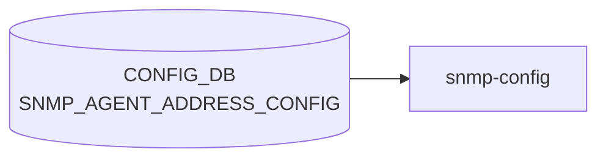

# SNMP_AGENT_ADDRESS_CONFIG / SNMP_USER テーブル (デフォルト詳細)

## 概要

[SNMP](../../reference/glossary.md#term-snmp) 関連の 2 テーブルのフィールド暗黙デフォルトをコード証拠付きで解説する。

- **`SNMP_AGENT_ADDRESS_CONFIG`**: `snmpd` のリッスンアドレス / ポート / [VRF](../../reference/glossary.md#term-vrf) 設定。key 要素に `port` と `vrf_name` の暗黙デフォルトあり。
- **`SNMP_USER`**: SNMPv3 ユーザ設定。auth / encrypt フィールドが `SNMP_USER_TYPE` 値に連動する暗黙デフォルト（空文字フォールバック）を持つ。

<!-- defaults -->
<!-- cdb-mermaid -->
### データフロー (自動生成)



!!! note "凡例"
    CONFIG_DB から SAI までの典型経路を `docs/reference/config-db-orch-map.md` から機械生成したミニ図。詳細・例外は本ページ本文と対応表を参照。
<!-- /cdb-mermaid -->

## フィールド暗黙デフォルト

### SNMP_AGENT_ADDRESS_CONFIG

key は `<agent_ip>|<port>|<vrf_name>` の 3 要素複合。`port` / `vrf_name` は空文字を許容する。

#### `port`

**[YANG](../../reference/glossary.md#term-yang) default**: explicit default 文なし。`type union` で空文字パターン (`pattern ''`) を許容。[^2]

**コード由来デフォルト (minigraph)**: `'161'`

```python
# sonic-buildimage/src/sonic-config-engine/minigraph.py:2314
port = '161'
snmp_key = agent_addr + '|' + port + '|'
results['SNMP_AGENT_ADDRESS_CONFIG'][snmp_key] = {}
```

minigraph 経由（`sonic-cfggen` が [minigraph.xml](../../reference/glossary.md#term-minigraph.xml) を読み込んで生成する初期設定）では `port` を `'161'` でハードコードして key を構築する。[^5] CLI (`config snmp agentaddress add`) では `-p` オプション省略時に port 部が空文字 `''` となり、`snmpd.conf.j2` の `:{{ port }}` で port サフィックスが省略 → snmpd はデフォルトポート 161 で listen する。[^1]

| port 値 | snmpd.conf への展開 |
|---------|-------------------|
| `'161'` | `agentAddress udp:[<ip>]:161` |
| `''` (空文字) | `agentAddress udp:[<ip>]` (snmpd はデフォルト 161 を使用) |

#### `vrf_name`

**[YANG](../../reference/glossary.md#term-yang) default**: explicit default 文なし。`type union` で空文字・`'mgmt'`・`Vrf<name>` パターンを許容。[^2]

**コード由来デフォルト (minigraph)**: `''` (空文字 = default [VRF](../../reference/glossary.md#term-vrf))

minigraph.py は `snmp_key = agent_addr + '|' + port + '|'` — vrf_name 部に空文字を使いキーを構築する。[^5] CLI の `-v` オプションを省略した場合も空文字がキーに入る。

`snmpd.conf.j2` では `@{{ vrf }}` で空文字なら [VRF](../../reference/glossary.md#term-vrf) サフィックスなし（default VRF でリッスン）。[^1]

| vrf_name 値 | snmpd.conf への展開 |
|------------|-------------------|
| `''` (空文字) | VRF サフィックスなし → default VRF |
| `'mgmt'` | `agentAddress udp:[<ip>]@mgmt` |
| `'Vrf<name>'` | `agentAddress udp:[<ip>]@Vrf<name>` |

#### テーブルが空の場合のフォールバック

```jinja
{# snmpd.conf.j2:31-34 #}

agentAddress udp:161
agentAddress udp6:161

```

テーブルにエントリが 1 件もない場合、snmpd は全インタフェース・IPv4/IPv6 ともにポート 161 で listen する。[^1]

---

### SNMP_USER

#### `SNMP_USER_TYPE` (mandatory)

**[YANG](../../reference/glossary.md#term-yang)**: `mandatory true; type enumeration { enum noAuthNoPriv; enum AuthNoPriv; enum Priv; }`[^2]

デフォルトなし。CLI は必須引数として大文字・小文字を正規化して登録する。

```python
# config/main.py:4284
convert_user_type = {'noauthnopriv': 'noAuthNoPriv', 'authnopriv': 'AuthNoPriv', 'priv': 'Priv'}
```

#### `SNMP_USER_PERMISSION` (mandatory)

**YANG**: `mandatory true; type enumeration { enum RO; enum RW; }`[^2]

デフォルトなし。CLI が `upper()` で大文字正規化して DB に書く。

#### `SNMP_USER_AUTH_TYPE`

**YANG default**: `""` (空文字)[^2]

```yang
leaf SNMP_USER_AUTH_TYPE {
  type string;
  default "";
  must "(noAuthNoPriv and current() = '') or
        ((AuthNoPriv or Priv) and (current() = 'SHA' or current() = 'MD5' or current() = 'HMAC-SHA-2'))";
}
```

CLI フォールバック:
```python
# config/main.py:4771-4772
if not user_auth_type:
    user_auth_type = ''
```

| SNMP_USER_TYPE | SNMP_USER_AUTH_TYPE |
|---------------|-------------------|
| `noAuthNoPriv` | `""` (必須) |
| `AuthNoPriv` | `MD5` / `SHA` / `HMAC-SHA-2` のいずれか (必須) |
| `Priv` | `MD5` / `SHA` / `HMAC-SHA-2` のいずれか (必須) |

#### `SNMP_USER_AUTH_PASSWORD`

**YANG default**: explicit default 文なし。`must` 制約で `noAuthNoPriv` の場合は空文字を強制。[^2]

```yang
leaf SNMP_USER_AUTH_PASSWORD {
  type string { length "0..64"; pattern '[^ @:]*'; }
  must "(AuthNoPriv and len >= 8) or (Priv and len >= 8) or (noAuthNoPriv and current() = '')";
}
```

CLI フォールバック: `if not user_auth_password: user_auth_password = ''`（config/main.py:4773-4774）。[^4]

| SNMP_USER_TYPE | 有効な SNMP_USER_AUTH_PASSWORD |
|---------------|-------------------------------|
| `noAuthNoPriv` | `""` (必須) |
| `AuthNoPriv` | 8〜64 文字、`@` `:` ` ` 禁止 |
| `Priv` | 8〜64 文字、`@` `:` ` ` 禁止 |

#### `SNMP_USER_ENCRYPTION_TYPE`

**YANG default**: `""` (空文字)[^2]

```yang
leaf SNMP_USER_ENCRYPTION_TYPE {
  type string;
  default "";
  must "(noAuthNoPriv and current() = '') or
        (AuthNoPriv and current() = '') or
        (Priv and (current() = 'DES' or current() = 'AES'))";
}
```

CLI フォールバック: `if not user_encrypt_type: user_encrypt_type = ''`（config/main.py:4775-4776）。[^4]

| SNMP_USER_TYPE | SNMP_USER_ENCRYPTION_TYPE |
|---------------|--------------------------|
| `noAuthNoPriv` | `""` (必須) |
| `AuthNoPriv` | `""` (必須) |
| `Priv` | `DES` または `AES` (必須) |

#### `SNMP_USER_ENCRYPTION_PASSWORD` (mandatory)

**YANG**: `mandatory true; type string { length "0..64"; }; must (noAuthNoPriv and empty) or (AuthNoPriv and empty) or (Priv and len >= 8)`[^2]

`mandatory true` だが `length "0.."` で空文字を許容。noAuthNoPriv / AuthNoPriv では空文字が MUST 制約で強制される。

CLI フォールバック: `if not user_encrypt_password: user_encrypt_password = ''`（config/main.py:4777-4778）。[^4]

| SNMP_USER_TYPE | SNMP_USER_ENCRYPTION_PASSWORD |
|---------------|------------------------------|
| `noAuthNoPriv` | `""` (必須) |
| `AuthNoPriv` | `""` (必須) |
| `Priv` | 8〜64 文字、`@` `:` ` ` 禁止 |

#### snmpd.conf.j2 での空フィールド展開

```jinja
{# snmpd.conf.j2:70 #}
CreateUser {{ user }} {{ SNMP_USER[user]['SNMP_USER_AUTH_TYPE'] }} {{ SNMP_USER[user]['SNMP_USER_AUTH_PASSWORD'] }} {{ SNMP_USER[user]['SNMP_USER_ENCRYPTION_TYPE'] }} {{ SNMP_USER[user]['SNMP_USER_ENCRYPTION_PASSWORD'] }}
```

フィールドが空文字の場合、テンプレートは空文字をそのまま展開する（スペース区切りで空フィールドが含まれる）。`noAuthNoPriv` ユーザでは `CreateUser alice   ` のような行が生成される。[^1]

---

## 要約表

### SNMP_AGENT_ADDRESS_CONFIG

| フィールド | YANG default | コード由来デフォルト | 備考 |
|-----------|-------------|-------------------|------|
| `agent_ip` | なし | 必須 | CLI 必須引数 |
| `port` | (explicit default 文なし) | `'161'` (minigraph) / `''` (CLI 省略時) | 空文字 → snmpd デフォルト 161 |
| `vrf_name` | (explicit default 文なし) | `''` (空文字 = default VRF) | minigraph・CLI 省略時ともに空文字 |

### SNMP_USER

| フィールド | YANG default | コード由来デフォルト | 条件 |
|-----------|-------------|-------------------|------|
| `SNMP_USER_TYPE` | なし (mandatory) | 必須 | noAuthNoPriv / AuthNoPriv / Priv |
| `SNMP_USER_PERMISSION` | なし (mandatory) | 必須 | RO / RW |
| `SNMP_USER_AUTH_TYPE` | `""` | `""` (CLI フォールバック) | noAuthNoPriv: 必ず空 |
| `SNMP_USER_AUTH_PASSWORD` | (なし) | `""` (CLI フォールバック) | noAuthNoPriv: 必ず空; 認証あり: 8〜64 chars |
| `SNMP_USER_ENCRYPTION_TYPE` | `""` | `""` (CLI フォールバック) | Priv 以外: 必ず空; Priv: DES / AES |
| `SNMP_USER_ENCRYPTION_PASSWORD` | なし (mandatory) | `""` (CLI フォールバック) | Priv のみ: 8〜64 chars |

---

<!-- ordering -->
## 書込み順序依存（Phase B）

`SNMP_AGENT_ADDRESS_CONFIG` および `SNMP_USER` テーブルへの書込みには、以下の順序依存が存在する。

### 1. YANG unique 制約による同一 (ip, port) 重複禁止

`sonic-snmp.yang` の `SNMP_AGENT_ADDRESS_CONFIG_LIST` には `unique "agent_ip port"` 制約があり、同一 `(agent_ip, port)` の組み合わせを異なる `vrf_name` で重複登録することは YANG バリデーション層でリジェクトされる。[^2]

```yang
list SNMP_AGENT_ADDRESS_CONFIG_LIST {
    key "agent_ip port vrf_name";
    unique "agent_ip port";
    ...
}
```

CLI (`config snmp agentaddress add`) は `get_keys` で重複チェックを事前実施し YANG レベル到達前に防ぐ（`config/main.py:4177-4182`）。[^3]

**正しい順序**: 既存の `SNMP_AGENT_ADDRESS_CONFIG|<ip>|<port>|<vrf_old>` を DEL → 新エントリ `|<ip>|<port>|<vrf_new>` を SET。

### 2. MGMT_VRF_CONFIG との順序依存（CLI 経路）

`-v`（VRF）指定なしで `config snmp agentaddress add <ip>` を実行した場合、CLI は `MGMT_VRF_CONFIG|vrf_global.mgmtVrfEnabled` を参照する。Management VRF が有効 (`mgmtVrfEnabled = 'true'`) にもかかわらず VRF 指定を省略するとエラーで CLI がブロックし、[CONFIG_DB](../../reference/glossary.md#term-config_db) への書込みは発生しない。[^3]

```python
# config/main.py:4153-4157
if not vrf:
    entry = config_db.get_entry('MGMT_VRF_CONFIG', "vrf_global")
    if entry and entry['mgmtVrfEnabled'] == 'true':
        click.echo("ManagementVRF is Enabled. Provide vrf.")
        return False
```

**正しい順序**: Management VRF を有効化する場合は `-v mgmt` を明示して追加する。

### 3. NIC への IP 付与確認（CLI 経路）

CLI は `netifaces.interfaces()` で NIC を走査し、指定した IP が実際にアサインされていることを確認する（`config/main.py:4160-4171`）。IP が付与されていない場合は "IP address is not available" で拒否される。[^3]

**正しい順序**: NIC への IP 付与 → `config snmp agentaddress add <ip>`。

### 4. VRF 作成の先行（推奨）

`vrf_name` に `mgmt` や `Vrf<name>` を指定しても、VRF がカーネル上に実在しない場合は [CONFIG_DB](../../reference/glossary.md#term-config_db) への書込みは成功するが snmpd の agentAddress バインドが失敗する。YANG バリデーションは VRF の実在チェックを行わない。

**推奨順序**:
- Management VRF: `config vrf add mgmt` → `config snmp agentaddress add <ip> -v mgmt`
- データ VRF: `config vrf add Vrf<name>` → `config snmp agentaddress add <ip> -v Vrf<name>`

### 5. docker-snmp コンテナ再起動の必要性

`snmpd.conf` は `docker-snmp` コンテナ起動時に `sonic-cfggen` が [CONFIG_DB](../../reference/glossary.md#term-config_db) を読み込んでテンプレートレンダリングする。CONFIG_DB への変更は `systemctl restart snmp` によるコンテナ再起動なしには反映されない。[^1]

CLI の `add_snmp_agent_address()` と `del_snmp_agent_address()` は最後に `os.system("systemctl restart snmp")` を自動実行する（`config/main.py:4188-4190, 4208`）。[^3]

### 6. minigraph 経路: MGMT_INTERFACE / LOOPBACK_INTERFACE 先行書込み

minigraph.py は `MGMT_VRF_CONFIG` を先行して格納後、`mgmt_intf`（MGMT_INTERFACE）と `lo_intfs`（LOOPBACK_INTERFACE）のアドレスを列挙して `SNMP_AGENT_ADDRESS_CONFIG` エントリを生成する。multi-asic 環境または `asic_name` 指定時は常に空辞書になる（L2312-2324）。[^5]

**順序**: `sonic-cfggen` が minigraph 一括処理する場合は自動的に順序保証される（手動介入不要）。

### 書込み順序依存サマリ

| # | 依存関係 | 強制区分 | 違反時の挙動 |
|---|----------|----------|------------|
| 1 | 旧エントリ DEL → 同 `(ip, port)` 新エントリ SET | YANG / CLI 強制 | SET 失敗（unique 制約違反）/ CLI 早期リターン |
| 2 | `MGMT_VRF_CONFIG.mgmtVrfEnabled=true` 時は `-v mgmt` 必須 | CLI 強制 | vrf 指定なしは CLI がブロック |
| 3 | NIC への IP 付与 先行 | CLI 強制 | "IP address is not available" で拒否 |
| 4 | VRF 作成 先行 → `agentaddress add <ip> -v <vrf>` | 推奨 | DB 書込み成功、snmpd bind 失敗 |
| 5 | CONFIG_DB 変更 → `systemctl restart snmp` | 必須後続 | snmpd.conf 未更新（旧設定継続） |
| 6 | `MGMT_INTERFACE`/`LOOPBACK_INTERFACE` 先行 | minigraph 内部保証 | multi-asic では常時空辞書 |
<!-- /ordering -->

<!-- cross-refs -->
## 暗黙参照 — Phase C (cross-table refs)

> **調査根拠**: `dockers/docker-snmp/snmpd.conf.j2`, `supervisord.conf.j2`, `sonic-utilities/config/main.py` L4095–4210 & L4709–4800, `src/sonic-config-engine/minigraph.py` L2308–2324, `sonic-snmp.yang` 全行精読 (2026-05-17)
> 詳細証跡: `meta/_intermediate/cdb-flow/snmp-agent-cross-refs.md`

`SNMP_AGENT_ADDRESS_CONFIG` / `SNMP_USER` は YANG leafref を持たないが、CLI・テンプレートエンジン・minigraph の実装レベルで以下のテーブルを暗黙参照する。

### SNMP_AGENT_ADDRESS_CONFIG の暗黙参照

| 参照先 | DB | 参照方向 | YANG leafref | 実装上の必須度 | 証拠 |
|---|---|---|---|---|---|
| `MGMT_VRF_CONFIG\|vrf_global` (`mgmtVrfEnabled`) | CONFIG_DB | 読み取り (VRF 指定省略時チェック) | なし | CLI 強制 (VRF 未指定時にエラー) | `config/main.py:4154-4157` |
| `MGMT_INTERFACE\|<intf>\|<ip>` | CONFIG_DB | 読み取り (minigraph 自動生成元) | なし | minigraph 内部 (multi-asic は空) | `minigraph.py:2308-2314` |
| `LOOPBACK_INTERFACE\|<intf>\|<ip>` | CONFIG_DB | 読み取り (minigraph 自動生成元) | なし | minigraph 内部 (multi-asic は空) | `minigraph.py:2315-2322` |
| `DEVICE_METADATA\|localhost` (`switch_type`) | CONFIG_DB | 読み取り (snmp-subagent 起動コマンド分岐) | なし | 必須 (不在でコンテナ起動失敗) | `supervisord.conf.j2:53-57` |

#### MGMT_VRF_CONFIG — CLI 経路での VRF チェック

`config snmp agentaddress add <ip>` 実行時に `-v` オプションを省略した場合、CLI は `MGMT_VRF_CONFIG|vrf_global.mgmtVrfEnabled` を読み取る (`config/main.py:4154-4157`)。`mgmtVrfEnabled == 'true'` かつ VRF 未指定の場合は `"ManagementVRF is Enabled. Provide vrf."` を出力して早期リターンし CONFIG_DB への書き込みは発生しない。

#### MGMT_INTERFACE / LOOPBACK_INTERFACE — minigraph 経路での自動生成

`minigraph.py:2308-2322` は `MGMT_INTERFACE` と `LOOPBACK_INTERFACE` のアドレス一覧を元に `SNMP_AGENT_ADDRESS_CONFIG` エントリを自動生成する。エントリの key は `<ip>|161|`（port=161, vrf=空文字）で固定。multi-asic 環境または `asic_name` 指定時は自動生成がスキップされ空辞書となる。

#### DEVICE_METADATA.localhost — docker-snmp コンテナ起動共通前提

`supervisord.conf.j2:53-57` が `DEVICE_METADATA['localhost']['switch_type']` を参照して `snmp-subagent` の起動オプション (`--enable_dynamic_frequency`) を決定する。`DEVICE_METADATA.localhost` が CONFIG_DB に存在しない場合はテンプレート展開が KeyError で失敗し docker-snmp コンテナ全体が起動しない。

---

### SNMP_USER の暗黙参照

| 参照先 | DB | 参照方向 | YANG leafref | 実装上の必須度 | 証拠 |
|---|---|---|---|---|---|
| `SNMP_COMMUNITY\|<name>` | CONFIG_DB | 読み取り (同一 snmpd.conf.j2 テンプレートで v1/v2c と v3 を同時展開) | なし | 任意 (v3 のみ利用時は不要) | `snmpd.conf.j2:48-64, 66-77` |
| `DEVICE_METADATA\|localhost` (`switch_type`) | CONFIG_DB | 読み取り (snmp-subagent 起動コマンド分岐) | なし | 必須 (不在でコンテナ起動失敗) | `supervisord.conf.j2:53-57` |

#### SNMP_COMMUNITY — テンプレートでの隣接展開

`snmpd.conf.j2` は `SNMP_COMMUNITY`（v1/v2c 設定、L48–64）と `SNMP_USER`（v3 設定、L66–77）を同一テンプレートで展開する。両テーブルの有無は独立して判定される (`` / ``)。`SNMP_USER` を登録しても `SNMP_COMMUNITY` が未定義であれば SNMPv1/v2c はすべて拒否される（v3 のみアクセスには影響なし）。

### SAI 参照

なし。`SNMP_AGENT_ADDRESS_CONFIG` / `SNMP_USER` はいずれも snmpd（ユーザ空間デーモン）の設定のみに作用し、[SAI](../../reference/glossary.md#term-sai)・[ASIC](../../reference/glossary.md#term-asic)・[APPL_DB](../../reference/glossary.md#term-appl_db) には一切関与しない。

<!-- /cross-refs -->

<!-- failure -->
## 失敗挙動 (Phase D)

> 詳細証跡: `meta/_intermediate/cdb-flow/snmp-agent-failure.md`

### SNMP_AGENT_ADDRESS_CONFIG の失敗経路

#### key フォーマット不正によるテンプレートレンダリング失敗

`snmpd.conf.j2` L28 は `` で 3 要素タプルをアンパックする。CONFIG_DB の key が `<ip>|<port>|<vrf>` の正規形でない場合、`sonic-cfggen` がテンプレート展開中に例外を送出し `/etc/snmp/snmpd.conf` が生成されない。`start.sh` が non-zero で終了するため supervisord が snmpd を起動しない。[^1]

#### VRF 実在確認なし — サイレント bind 失敗

`vrf_name` に `mgmt` / `Vrf<name>` を設定しても VRF がカーネルに存在しない場合、snmpd は起動後に該当 agentAddress のバインドに失敗する。snmpd は他の agentAddress でのリッスンを継続するため、CONFIG_DB レベル・YANG バリデーション層のいずれでも検知されない。[^2]

#### systemctl restart snmp の失敗が CLI で無視される

CLI の `add_snmp_agent_address()` は `os.system("systemctl restart snmp")` の戻り値をチェックしない（`config/main.py:4189`）。再起動に失敗した場合でも CLI はエラーを報告せず、snmpd.conf は更新されないまま処理を終える。[^3]

### SNMP_USER の失敗経路

#### YANG must 制約違反（直接書き込み時）

`sonic-snmp.yang` L120-163 の `must` 制約は `SNMP_USER_TYPE` の値に連動する。CLI `add_user()` は Python レベルで事前検証するため CLI 経由では YANG 層に到達しない。しかし `sonic-db-cli` で直接書き込む場合はフィールド不整合が YANG バリデーション違反として SET 拒否される。[^2]

| 失敗条件 | 結果 |
|---|---|
| `noAuthNoPriv` ユーザに `SNMP_USER_AUTH_TYPE != ""` | YANG `must` 違反で SET 拒否 |
| `AuthNoPriv` / `Priv` ユーザに `SNMP_USER_AUTH_TYPE = ""` | YANG `must` 違反で SET 拒否 |
| `Priv` ユーザに `SNMP_USER_ENCRYPTION_TYPE` が DES/AES 以外 | YANG `must` 違反で SET 拒否 |
| `noAuthNoPriv` / `AuthNoPriv` ユーザに `SNMP_USER_ENCRYPTION_PASSWORD != ""` | YANG `must` 違反で SET 拒否 |

#### フィールド欠落による snmpd.conf 生成失敗

`snmpd.conf.j2` L70 の `CreateUser` 行は `SNMP_USER_AUTH_TYPE` / `SNMP_USER_AUTH_PASSWORD` / `SNMP_USER_ENCRYPTION_TYPE` / `SNMP_USER_ENCRYPTION_PASSWORD` の 4 フィールドを参照する。YANG バリデーションをバイパスして SET し、フィールドが CONFIG_DB に存在しない場合は `sonic-cfggen` が `UndefinedError` で失敗し snmpd.conf が生成されない。[^1]

### コンテナ起動経路の失敗（全テーブル共通）

| 失敗条件 | 検出箇所 | 結果 |
|---|---|---|
| `/etc/sonic/snmp.yml` の `snmp_location` キー不在 | `snmp_yml_to_configdb.py:55-56` | `sys.exit(1)` → `start.sh` 失敗 → snmpd 未起動 |
| snmpd.conf.j2 レンダリング例外 | `start.sh`（[sonic-cfggen](../../reference/glossary.md#term-sonic-cfggen) 呼び出し） | `start.sh` 失敗 → snmpd 未起動 |
| `DEVICE_METADATA.localhost.switch_type` が CONFIG_DB に不在 | `supervisord.conf.j2:53-57` | supervisord 設定生成失敗 → コンテナ起動不可 |

### 失敗の可観測性

| 確認項目 | コマンド |
|---------|---------|
| docker-snmp コンテナ状態 | `docker ps \| grep snmp` |
| start.sh / snmpd ログ | `docker logs snmp 2>&1 \| grep -iE 'error\|fail'` |
| snmpd agentAddress バインドエラー | `docker exec snmp cat /var/log/supervisor/snmpd.log` |
| 実際の snmpd.conf 確認 | `docker exec snmp cat /etc/snmp/snmpd.conf` |
| CONFIG_DB ユーザ設定確認 | `sonic-db-cli CONFIG_DB hgetall 'SNMP_USER\|<user>'` |

<!-- /failure -->

<!-- constants -->
## ハードコード定数 (Phase E)

> **調査根拠**: `sonic-utilities/config/main.py` L4293-4369, `dockers/docker-snmp/snmpd.conf.j2` L32-33, `src/sonic-config-engine/minigraph.py:2314`, `sonic-snmp.yang` 全行精読 (2026-05-17)
> 詳細証跡: `meta/_intermediate/cdb-flow/snmp-agent-constants.md`

`SNMP_AGENT_ADDRESS_CONFIG` / `SNMP_USER` テーブルに関連して、CONFIG_DB では管理されないハードコード定数の一覧。

### SNMP_AGENT_ADDRESS_CONFIG の定数

| 定数 | 値 | 用途 | ソース |
|------|----|------|--------|
| フォールバック agentAddress (IPv4) | `udp:161` | テーブルが空の場合に全インターフェース公開 | `snmpd.conf.j2` L32 |
| フォールバック agentAddress (IPv6) | `udp6:161` | 同上、IPv6 | `snmpd.conf.j2` L33 |
| minigraph デフォルト port | `'161'` | minigraph 経由で自動生成する際の key の port 部 | `minigraph.py:2314` |

`SNMP_AGENT_ADDRESS_CONFIG` にエントリを 1 件以上登録すると `snmpd.conf.j2` L27-30 が展開され、フォールバックは使われなくなる。listen アドレスを制限したい場合は必ずエントリを明示する。

### SNMP_USER の定数

#### 認証タイプ・暗号化タイプの許容値 (CLI ハードコード)

| 定数 | 値 | 用途 | ソース |
|------|----|------|--------|
| 有効 `SNMP_USER_AUTH_TYPE` | `['MD5', 'SHA', 'HMAC-SHA-2']` | CLI `is_valid_auth_type()` でのホワイトリスト | `config/main.py:4294` |
| 有効 `SNMP_USER_ENCRYPTION_TYPE` | `['DES', 'AES']` | CLI `is_valid_encrypt_type()` でのホワイトリスト | `config/main.py:4302` |

YANG の `SNMP_USER_AUTH_TYPE` は `type string` で明示的な enum 制約を持たないが、CLI が Python レベルで 3 値のみに制限する。`sonic-db-cli` で直接書き込む場合は YANG `must` 制約のみが適用される。

#### パスワード長・文字種制約 (CLI ハードコード)

| 定数 | 値 | 用途 | ソース |
|------|----|------|--------|
| パスワード最小長 | `8` 文字 | `SNMP_USER_AUTH_PASSWORD` / `SNMP_USER_ENCRYPTION_PASSWORD` の最小長 (AuthNoPriv/Priv 時) | `config/main.py:4347` |
| パスワード最大長 | `64` 文字 | 同上の最大長 | `config/main.py:4354` |
| ユーザ名最大長 | `32` 文字 | ユーザ名（キー）の最大長 | `config/main.py:4329` |
| 禁止文字 (パスワード/ユーザ名) | `['@', ':']` | CLI レベルの禁止文字リスト | `config/main.py:4328, 4346` |

#### タイプ正規化定数 (CLI)

| 定数 | 値 | 用途 | ソース |
|------|----|------|--------|
| ユーザタイプ正規化マップ | `{'noauthnopriv': 'noAuthNoPriv', 'authnopriv': 'AuthNoPriv', 'priv': 'Priv'}` | CLI 入力を大文字小文字正規化して DB に書き込む | `config/main.py:4284` |
| 権限タイプ正規化 | `upper()` による大文字変換 | `SNMP_USER_PERMISSION` を `RO`/`RW` に正規化 | `config/main.py:4727` |

> **注意**: `MD5` および `DES` は RFC 8573 で非推奨とされている。可能な限り `HMAC-SHA-2` + `AES` の組み合わせを使用すること。

<!-- /constants -->

---

<!-- side-effects -->
## 副次 DB 書込・ファイル書込 (Phase F)

> **調査根拠**: `dockers/docker-snmp/start.sh` L14-26, `dockers/docker-snmp/snmpd.conf.j2` 全行, `sonic-utilities/config/main.py` L4188-4209, L4786-4813 (2026-05-17)
> 詳細証跡: `meta/_intermediate/cdb-flow/snmp-agent-side-effects.md`

### ファイル書込: `/etc/snmp/snmpd.conf`

`SNMP_AGENT_ADDRESS_CONFIG` / `SNMP_USER` への書込後、CLI は必ず `systemctl restart snmp` を実行する。
コンテナ内の `start.sh` が `sonic-cfggen` を呼び出し、`snmpd.conf.j2` テンプレートから `/etc/snmp/snmpd.conf` を再生成する。[^6]

```bash
# start.sh:19-26 — snmpd.conf 生成フロー
SONIC_CFGGEN_ARGS=" \
    -d \
    -y /etc/sonic/sonic_version.yml \
    -t /usr/share/sonic/templates/sysDescription.j2,/etc/ssw/sysDescription \
    -t /usr/share/sonic/templates/snmpd.conf.j2,/etc/snmp/snmpd.conf \
"
sonic-cfggen $SONIC_CFGGEN_ARGS
```

生成後、`snmpd` → `snmp-subagent (sonic_ax_impl)` の順でプロセスが再起動し、新しい設定が反映される。

| CONFIG_DB テーブル | `/etc/snmp/snmpd.conf` への展開 |
|--------------------|--------------------------------|
| `SNMP_AGENT_ADDRESS_CONFIG` | `agentAddress udp:[<ip>][@vrf][:port]`（エントリ数分出力） |
| `SNMP_USER` | `rouser`/`rwuser` + `CreateUser <user> <auth> <passwd> <enc> <passwd>` |
| `SNMP_COMMUNITY` | `rocommunity`/`rwcommunity` ディレクティブ |
| `SNMP` (LOCATION/CONTACT) | `sysLocation` / `sysContact` |

### CLI 書込後の `systemctl restart snmp` 自動実行

```python
# config/main.py:4188-4190 — SNMP_AGENT_ADDRESS_CONFIG add/del 共通
#Restarting the SNMP service will regenerate snmpd.conf and rerun snmpd
cmd="systemctl restart snmp"
os.system(cmd)

# config/main.py:4787-4791 — SNMP_USER add/del 共通
clicommon.run_command(['systemctl', 'reset-failed', 'snmp.service'], display_cmd=False)
clicommon.run_command(['systemctl', 'restart', 'snmp.service'], display_cmd=False)
```

`SNMP_AGENT_ADDRESS_CONFIG` 経路は `os.system()` で呼ぶため戻り値を検査しない（失敗時サイレント）。
`SNMP_USER` 経路は `SystemExit` 例外をキャッチして `click.Abort()` を返す。[^4]

### Net-SNMP 永続ステート: `/var/lib/snmp/snmpd.conf`

`CreateUser` ディレクティブは Net-[SNMP](../../reference/glossary.md#term-snmp) が処理した後 `usmUser` 行に書き換えて `/var/lib/snmp/snmpd.conf` に自動保存する（Net-[SNMP](../../reference/glossary.md#term-snmp) の内部動作）。
[SONiC](../../reference/glossary.md#term-sonic) の `docker-snmp` コンテナは `/var/lib/snmp/` を永続ボリュームとしてマウントしていないため、コンテナ再起動ごとにリセットされ、常に `snmpd.conf` の `CreateUser` ディレクティブから再構築される。

### APPL_DB / STATE_DB への副次書込

`SNMP_AGENT_ADDRESS_CONFIG` / `SNMP_USER` を購読して [APPL_DB](../../reference/glossary.md#term-appl_db) / [STATE_DB](../../reference/glossary.md#term-state_db) へ転写するハンドラは存在しない。
これらのテーブルは **CONFIG_DB 完結型** であり、`snmpd.conf` を経由して `snmpd` に直接反映される。

| 副次先 | 書込内容 | トリガー |
|--------|----------|----------|
| `/etc/snmp/snmpd.conf` | agentAddress / CreateUser ディレクティブ等 | `systemctl restart snmp` |
| `/var/lib/snmp/snmpd.conf` | Net-SNMP 内部: `CreateUser` → `usmUser` 変換 | `snmpd` 起動時（net-snmp 自動処理） |
| `/var/sonic/config_status` | 固定コメント行 | コンテナ再起動時のみ |
| [APPL_DB](../../reference/glossary.md#term-appl_db) | なし | — |
| [STATE_DB](../../reference/glossary.md#term-state_db) | なし | — |

<!-- /side-effects -->

---

<!-- pubsub -->
## 通信メカニズム (Phase G)

> **調査根拠**: `docker-snmp/start.sh`, `snmpd.conf.j2`, `snmp_yml_to_configdb.py`, `sonic_ax_impl/mibs/__init__.py:497-509`, `config/main.py:4188-4209, 4787-4791`, `hostcfgd` 全行精読 (2026-05-17)
> 詳細証跡: `meta/_intermediate/cdb-flow/snmp-agent-pubsub.md`

### 購読方式: なし (起動時スナップショット読み取りのみ)

`SNMP_AGENT_ADDRESS_CONFIG` / `SNMP_USER` を **リアルタイムで購読するプロセスは存在しない**。
`docker-snmp/start.sh` が起動時に `sonic-cfggen -d` (CONFIG_DB への一括 HGETALL) を実行して
`snmpd.conf.j2` を展開・`/etc/snmp/snmpd.conf` を生成する。
[Redis](../../reference/glossary.md#term-redis) keyspace 通知 (PSUBSCRIBE) / `SubscriberStateTable` / `ConsumerStateTable` はいずれも使用しない。

| コンポーネント | 通信方式 | 対象テーブル | 備考 |
|---|---|---|---|
| `docker-snmp` (`start.sh` + `snmpd.conf.j2`) | `sonic-cfggen -d` (起動時一括読み取り) | `SNMP_AGENT_ADDRESS_CONFIG`, `SNMP_USER` | 起動時のみ。実行中の変更は反映しない |
| `sonic-snmpagent` (`sonic_ax_impl`) | `psubscribe("__keyspace@{db}__:{pattern}")` | [COUNTERS_DB](../../reference/glossary.md#term-counters_db) / [STATE_DB](../../reference/glossary.md#term-state_db) (MIB データ) | `SNMP_AGENT_ADDRESS_CONFIG` / `SNMP_USER` は対象外 |
| `hostcfgd` | 購読なし | — | SNMP_AGENT_ADDRESS_CONFIG / SNMP_USER を購読しない |
| `orchagent` | [ConsumerStateTable](../../reference/glossary.md#term-consumerstatetable) | — | SNMP 系テーブルを処理しない |

### 変更の反映経路

#### SNMP_AGENT_ADDRESS_CONFIG

```
CLI: config snmp agentaddress add <ip>
  ↓ config_db.set_entry('SNMP_AGENT_ADDRESS_CONFIG', key, {})
  ↓ os.system("systemctl restart snmp")      ← config/main.py:4189 (戻り値未検査)
docker-snmp コンテナ再起動
  ↓ start.sh: sonic-cfggen -d -t snmpd.conf.j2,/etc/snmp/snmpd.conf
  ↓ HGETALL で一括読み取り → agentAddress 行を生成 (snmpd.conf.j2 L27–34)
snmpd 起動 → 新しいアドレス/ポートで listen
```

#### SNMP_USER

```
CLI: config snmp user add <user> ...
  ↓ config_db.set_entry('SNMP_USER', user, {...})
  ↓ systemctl reset-failed snmp.service      ← config/main.py:4787
  ↓ systemctl restart snmp.service           ← config/main.py:4788
docker-snmp コンテナ再起動
  ↓ start.sh: sonic-cfggen -d -t snmpd.conf.j2,/etc/snmp/snmpd.conf
  ↓ HGETALL で一括読み取り → CreateUser / rouser / rwuser 行を生成 (snmpd.conf.j2 L66–77)
snmpd 起動 → SNMPv3 ユーザが有効化
```

`sonic-db-cli` / `redis-cli HSET` で直接書き込んだ場合は snmpd.conf は更新されない。
手動で `systemctl restart snmp` が必要。

### APPL_DB / SAI 中継

なし。両テーブルは CONFIG_DB → snmpd.conf（ファイル）で完結し、
APPL_DB / STATE_DB / [ASIC_DB](../../reference/glossary.md#term-asic_db) への伝播も [SAI](../../reference/glossary.md#term-sai) 書き込みも発生しない。

<!-- /pubsub -->

---

<!-- platform -->
## プラットフォーム差 (Phase H)

> **調査根拠**: `sonic-buildimage/src/sonic-config-engine/minigraph.py:2312-2324`, `dockers/docker-snmp/snmpd.conf.j2:16-34`, `dockers/docker-snmp/start.sh`, `sonic-snmpagent/src/sonic_ax_impl/mibs/__init__.py:586-607`, `src/sonic-config-engine/tests/test_cfggen.py:1158-1165` (2026-05-17)
> 詳細証跡: `meta/_intermediate/cdb-flow/snmp-agent-platform.md`

### Single-ASIC vs Multi-ASIC: 初期値生成の分岐

`minigraph.py` は `is_multi_asic()` フラグで `SNMP_AGENT_ADDRESS_CONFIG` の初期値生成を切り替える。

```python
# minigraph.py:2312-2324
if not is_multi_asic() and asic_name is None:
    results['SNMP_AGENT_ADDRESS_CONFIG'] = {}
    port = '161'
    for intf in list(mgmt_intf.keys()) + list(lo_intfs.keys()):
        ip_addr = ipaddress.ip_address(UNICODE_TYPE(intf[1].split('/')[0]))
        if ip_addr.version == 6 and ip_addr.is_link_local:
            agent_addr = str(ip_addr) + '%' + intf[0]
        else:
            agent_addr = str(ip_addr)
        snmp_key = agent_addr + '|' + port + '|'
        results['SNMP_AGENT_ADDRESS_CONFIG'][snmp_key] = {}
else:
    results['SNMP_AGENT_ADDRESS_CONFIG'] = {}
```

| 環境 | minigraph 初期値 | snmpd の listen 動作 |
|------|----------------|---------------------|
| **Single-[ASIC](../../reference/glossary.md#term-asic)** | MGMT IP + Loopback IP を自動列挙。`<ip>\|161\|` 形式でエントリを生成 | 特定の IP アドレスでのみ listen |
| **[Multi-ASIC](../../reference/glossary.md#term-multi-asic)** (`is_multi_asic() == True` または [ASIC](../../reference/glossary.md#term-asic) 分割時) | 空辞書 `{}` のみ。エントリなし | フォールバック: `agentAddress udp:161` / `udp6:161` — 全インタフェースで listen |

`snmpd.conf.j2` の先頭コメントに明示されている:
```
# Listen for connections on all ip addresses, including eth0, ipv4 lo for multi-asic platform
# Listen on managment and loopback0 ips for single asic platform
```

[Multi-ASIC](../../reference/glossary.md#term-multi-asic) では全 ASIC の [COUNTERS_DB](../../reference/glossary.md#term-counters_db) を単一の docker-snmp コンテナで集約するため、snmpd を全インタフェースでリッスンさせる設計になっている。[^5]

### IPv6 リンクローカルアドレスのスコープサフィックス (Single-ASIC のみ)

Management IF / Loopback IF が IPv6 リンクローカルアドレス (`fe80::/10`) を持つ場合、minigraph は key に `%<intf>` スコープサフィックスを付与する。

```python
# minigraph.py:2317-2318
if ip_addr.version == 6 and ip_addr.is_link_local:
    agent_addr = str(ip_addr) + '%' + intf[0]
```

テスト期待値 (`test_cfggen.py:1163`): `'fe80::1%Management0|161|'`

`snmpd.conf.j2` の `protocol()` マクロは `ip_addr.split('%')[0]` でスコープサフィックスを除去してから IPv6 判定するため、スコープサフィックス付き key でも `udp6` が正しく選択される。[Multi-ASIC](../../reference/glossary.md#term-multi-asic) ではこのエントリは生成されない（テーブルが空のため）。

### snmpd.conf.j2 / SNMP_USER: プラットフォーム非依存

`snmpd.conf.j2` はプラットフォーム・ASIC ベンダー固有の分岐を持たない:

- `agentAddress` 行: `SNMP_AGENT_ADDRESS_CONFIG` テーブルの内容をそのまま展開
- `CreateUser` / `rouser` / `rwuser`: SNMPv3 標準プロトコル。ASIC ベンダー非依存
- `master agentx` / `agentxsocket tcp:localhost:3161`: 全プラットフォーム共通

`SNMP_USER` テーブルはプラットフォームに依存しない。認証・暗号化アルゴリズム (`MD5` / `SHA` / `AES` / `DES`) は Net-SNMP ライブラリが処理するため ASIC ベンダーと無関係。

デバイス固有の設定ファイル (`sonic-buildimage/device/` 配下) に SNMP 固有のオーバーライドは存在しない。

### MIB agent (sonic_ax_impl): multi-ASIC DB 接続差異

MIB データ収集のため `sonic_ax_impl` は multi-ASIC 環境で `database_global.json` を使用して全 namespace の DB に接続する。ただし SNMP_AGENT_ADDRESS_CONFIG / SNMP_USER テーブルは MIB agent が直接読まない。MIB agent は [COUNTERS_DB](../../reference/glossary.md#term-counters_db) / STATE_DB / [ASIC_DB](../../reference/glossary.md#term-asic_db) のみを参照する。[^7]

<!-- /platform -->

---

## 関連リファレンス

- [CONFIG_DB: SNMP_AGENT_ADDRESS_CONFIG](snmp-agent-address-config.md)
- [CONFIG_DB: SNMP](snmp.md)
- [YANG: sonic-snmp](../yang/sonic-snmp.md)
- CLI: [`config snmp agentaddress`](../cli/config-snmp.md)

## 引用元

[^1]: `sonic-buildimage/dockers/docker-snmp/snmpd.conf.j2` — agentAddress テンプレートフォールバック (行 27-34) / SNMP_USER CreateUser テンプレート (行 66-77). <https://github.com/sonic-net/sonic-buildimage/blob/master/dockers/docker-snmp/snmpd.conf.j2>

[^2]: `src/sonic-yang-models/yang-models/sonic-snmp.yang` — SNMP_USER / SNMP_AGENT_ADDRESS_CONFIG YANG 定義. <https://github.com/sonic-net/sonic-buildimage/blob/9ea932ec2e18f35e58268ec2e4456b1d4afd65cd/src/sonic-yang-models/yang-models/sonic-snmp.yang>

[^3]: `sonic-utilities/config/main.py:4137-4186` — `add_snmp_agent_address()`. <https://github.com/sonic-net/sonic-utilities/blob/master/config/main.py>

[^4]: `sonic-utilities/config/main.py:4708-4784` — `add_user()`. <https://github.com/sonic-net/sonic-utilities/blob/master/config/main.py>

[^5]: `sonic-buildimage/src/sonic-config-engine/minigraph.py:2310-2324` — SNMP_AGENT_ADDRESS_CONFIG 自動生成. <https://github.com/sonic-net/sonic-buildimage/blob/master/src/sonic-config-engine/minigraph.py>

[^6]: `sonic-buildimage/dockers/docker-snmp/start.sh` L14-26 — snmpd.conf 生成フロー ([sonic-cfggen](../../reference/glossary.md#term-sonic-cfggen) 呼び出し). <https://github.com/sonic-net/sonic-buildimage/blob/master/dockers/docker-snmp/start.sh>

[^7]: `sonic-snmpagent/src/sonic_ax_impl/mibs/__init__.py:580-630` — multi-ASIC DB 接続初期化 (database_global.json). <https://github.com/sonic-net/sonic-snmpagent/blob/master/src/sonic_ax_impl/mibs/__init__.py>

<!-- glossary-links-injected: e509cbc42d7a -->
