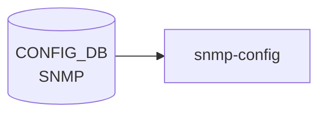

# SNMP テーブル

## 概要

[SNMP](../../reference/glossary.md#term-snmp) エージェント (`snmpd` in `docker-snmp`) のシステム情報 (Contact / Location) を保持するテーブル[^1]。`docker-snmp` 内の起動スクリプトと `hostcfgd` の [SNMP](../../reference/glossary.md#term-snmp) ハンドラが [CONFIG_DB](../../reference/glossary.md#term-config_db) を読み、`/etc/snmp/snmpd.conf` のテンプレ展開で `sysContact` / `sysLocation` 行に反映される。

<!-- cdb-mermaid -->
### データフロー (自動生成)



!!! note "凡例"
    CONFIG_DB から SAI までの典型経路を `docs/reference/config-db-orch-map.md` から機械生成したミニ図。詳細・例外は本ページ本文と対応表を参照。
<!-- /cdb-mermaid -->

## key 構造

```text
SNMP|CONTACT
SNMP|LOCATION
```

container `SNMP` の下に 2 つのシングルトン container (`CONTACT`/`LOCATION`)。各 container にフィールド 1 つだけ。

## フィールド

### `SNMP|CONTACT`

| フィールド | 型 | 説明 |
|-----------|----|------|
| `Contact` | string (1..255 chars, 改行不可) | [SNMP](../../reference/glossary.md#term-snmp) `sysContact` |

### `SNMP|LOCATION`

| フィールド | 型 | 説明 |
|-----------|----|------|
| `Location` | string (1..255 chars, 改行不可) | SNMP `sysLocation` |

## 制約

- 双方の leaf は `length "1..255"` かつ `pattern '[^\n]+'` (改行禁止)
- container 名は `SNMP`、内部 container 名は `CONTACT` / `LOCATION`、フィールド名は **大文字** (`Contact`/`Location`)[^1]

## 購読者

- `docker-snmp` の `snmpd` 起動テンプレ: [CONFIG_DB](../../reference/glossary.md#term-config_db) → `/etc/snmp/snmpd.conf`
- `hostcfgd` の SNMP ハンドラ (`sonic-host-services`)

## 関連 CONFIG_DB / YANG / CLI

- 関連 [CONFIG_DB](../../reference/glossary.md#term-config_db): `SNMP_COMMUNITY` (v1/v2c), `SNMP_USER` (v3), [`SNMP_AGENT_ADDRESS_CONFIG`](snmp-agent-address-config.md)
- 関連 CLI: `config snmp contact { add | modify | del }` / `config snmp location { add | modify | del }`
- 関連 [YANG](../../reference/glossary.md#term-yang): `sonic-snmp`

<!-- ref-triangle:start -->

## 関連リファレンス

- [YANG](../../reference/glossary.md#term-yang): [`sonic-snmp`](../yang/sonic-snmp.md)
- CLI: [`config snmp`](../cli/config-snmp.md)

<!-- ref-triangle:end -->

## 引用元

[^1]: `src/sonic-yang-models/yang-models/sonic-snmp.yang` (container `SNMP` / `CONTACT` / `LOCATION`). <https://github.com/sonic-net/sonic-buildimage/blob/9ea932ec2e18f35e58268ec2e4456b1d4afd65cd/src/sonic-yang-models/yang-models/sonic-snmp.yang>

## 関連ページ
- [CONFIG_DB: SNMP_AGENT_ADDRESS_CONFIG](snmp-agent-address-config.md)

<!-- ops-hint -->
## 運用ヒント

### 典型値

- key 形式: `SNMP|<community>` / `SNMP|LOCATION` / `SNMP|CONTACT`。
- `SNMP_COMMUNITY|<name>` の `TYPE: RO`。

### よくある誤設定

- community 名を default の `public` のまま運用すると外部から read 可能。本番では変更。

### 確認コマンド

```bash
sonic-db-cli CONFIG_DB keys 'SNMP*'
show snmp community
```
<!-- /ops-hint -->

<!-- value-behavior -->
## 値依存挙動マトリクス

### `Contact` / `Location` フィールド挙動
| 状態 | 挙動 |
|------|------|
| 設定済み（1..255 chars） | snmpd.conf の `sysContact` / `sysLocation` 行に展開。`\n` は空白に置換。 |
| 未定義（エントリなし） | テンプレートの `is defined` チェックで該当行を出力しない。snmpd は空の値を使用。 |
| 改行文字を含む | [YANG](../../reference/glossary.md#term-yang) `pattern '[^\n]+'` 制約違反でロード拒否。 |
| 256 chars 以上 | YANG `length "1..255"` 制約違反でロード拒否。 |

### `SNMP_COMMUNITY` テーブルとの関係
| 状態 | 挙動 |
|------|------|
| `SNMP_COMMUNITY` 定義済み | snmpd.conf にコミュニティ設定行を出力。 |
| `SNMP_COMMUNITY` 未定義 | `` チェック失敗。コミュニティ行なし → 全 SNMP アクセスが拒否される。 |
| `SNMP_COMMUNITY.TYPE = RO` | 読み取り専用コミュニティとして展開。 |
| `SNMP_COMMUNITY.TYPE = RW` | 読み取り/書き込みコミュニティとして展開。 |

<!-- /value-behavior -->

<!-- cdb-exceptions -->
## 例外条件・特殊挙動

- **sysContact / sysLocation 未定義時**: テンプレートの `is defined` チェックで未定義の場合は該当行を出力しない。snmpd は空の sysContact / sysLocation を使用する。[^2]
- **SNMP_COMMUNITY が未定義の場合は全アクセス拒否**: snmpd.conf テンプレートは `` で SNMP_COMMUNITY の有無を確認し、存在しない場合はコミュニティ設定行を出力しない。community なしでは全 SNMP アクセスが拒否される。[^2]
- **設定変更の反映はコンテナ再起動時のみ**: テーブル変更は `docker-snmp` コンテナの再起動 / snmpd リロードまで反映されない。[^2]
- **key の大文字/小文字**: `SNMP|LOCATION` / `SNMP|CONTACT` の key 名の大文字/小文字が YANG 定義と実装の間で一致しない場合、テンプレートがその値を参照できずサイレントスキップが発生する可能性がある。[^2]

[^2]: snmpd.conf テンプレート: `sonic-buildimage/dockers/docker-snmp/snmpd.conf.j2`. <https://github.com/sonic-net/sonic-buildimage/blob/master/dockers/docker-snmp/snmpd.conf.j2>


<!-- runtime-trace -->
## CDB → 実コンテナ動作トレース

### 段階 1: Consumer 登録

- **hostcfgd**: `SNMP` / `SNMP_COMMUNITY` テーブルを `ConfigDBConnector` で購読。

### 段階 2: CFG → APPL 翻訳

- hostcfgd が snmpd の community string / v3 ユーザ設定を `/etc/snmp/snmpd.conf` に書き込み再起動。

### 段階 3: APPL → SAI

- SAI 経由なし。snmpd が MIB ツリーを通じてスイッチ統計を提供。

### 段階 4: タイミング + 副作用

- 設定変更後 snmpd 再起動まで数秒。community 変更は即時有効 (再起動後)。
- 副作用: 旧 community string での SNMP ポーリングが失敗するため、NMS 側の設定変更も必要。

<!-- /runtime-trace -->
<!-- entry-points -->
## 書き込み入り口 (Direction A)

SNMP テーブルへの書き込みが発生するコード経路を網羅的に調査した結果。

### CLI

  - `config snmp contact add/del/modify ...` — `config/main.py` が `set_entry('SNMP', 'CONTACT', ...)` を呼ぶ (sonic-utilities/config/main.py:4483–4560)
  - `config snmp location add/del/modify ...` — `config/main.py` が `set_entry('SNMP', 'LOCATION', ...)` を呼ぶ (sonic-utilities/config/main.py:4600–4667)

### minigraph / sonic-cfggen

minigraph.py に SNMP 生成なし

### REST / gNMI

REST/gNMI 書き込み経路なし

### db_migrator

db_migrator.py での SNMP マイグレーションなし

### ビルド時デフォルト (build-time default)

なし

### ハードコードデフォルト / ランタイム注入

なし

### 死活・デッドコード

なし
<!-- /entry-points -->

<!-- glossary-links-injected: d5320e852f7a -->
