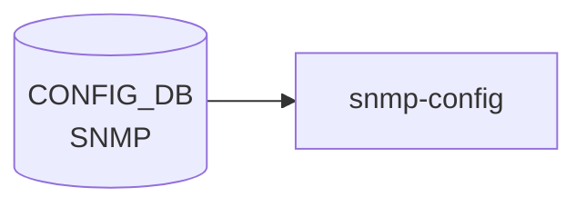

# SNMP テーブル

## 概要

[SNMP](../../reference/glossary.md#term-snmp) エージェント (`snmpd` in `docker-snmp`) のシステム情報 (Contact / Location) を保持するテーブル[^1]。`docker-snmp` 内の起動スクリプトと `hostcfgd` の [SNMP](../../reference/glossary.md#term-snmp) ハンドラが [CONFIG_DB](../../reference/glossary.md#term-config_db) を読み、`/etc/snmp/snmpd.conf` のテンプレ展開で `sysContact` / `sysLocation` 行に反映される。

<!-- cdb-mermaid -->
### データフロー (自動生成)



!!! note "凡例"
    CONFIG_DB から SAI までの典型経路を `docs/reference/config-db-orch-map.md` から機械生成したミニ図。詳細・例外は本ページ本文と対応表を参照。
<!-- /cdb-mermaid -->

## key 構造

```text
SNMP|CONTACT
SNMP|LOCATION
```

container `SNMP` の下に 2 つのシングルトン container (`CONTACT`/`LOCATION`)。各 container にフィールド 1 つだけ。

## フィールド

### `SNMP|CONTACT`

| フィールド | 型 | 説明 |
|-----------|----|------|
| `Contact` | string (1..255 chars, 改行不可) | [SNMP](../../reference/glossary.md#term-snmp) `sysContact` |

### `SNMP|LOCATION`

| フィールド | 型 | 説明 |
|-----------|----|------|
| `Location` | string (1..255 chars, 改行不可) | SNMP `sysLocation` |

## 制約

- 双方の leaf は `length "1..255"` かつ `pattern '[^\n]+'` (改行禁止)
- container 名は `SNMP`、内部 container 名は `CONTACT` / `LOCATION`、フィールド名は **大文字** (`Contact`/`Location`)[^1]

## 購読者

- `docker-snmp` の `snmpd` 起動テンプレ: [CONFIG_DB](../../reference/glossary.md#term-config_db) → `/etc/snmp/snmpd.conf`
- `hostcfgd` の SNMP ハンドラ (`sonic-host-services`)

## 関連 CONFIG_DB / YANG / CLI

- 関連 [CONFIG_DB](../../reference/glossary.md#term-config_db): `SNMP_COMMUNITY` (v1/v2c), `SNMP_USER` (v3), [`SNMP_AGENT_ADDRESS_CONFIG`](snmp-agent-address-config.md)
- 関連 CLI: `config snmp contact { add | modify | del }` / `config snmp location { add | modify | del }`
- 関連 [YANG](../../reference/glossary.md#term-yang): `sonic-snmp`

<!-- ref-triangle:start -->

## 関連リファレンス

- [YANG](../../reference/glossary.md#term-yang): [`sonic-snmp`](../yang/sonic-snmp.md)
- CLI: [`config snmp`](../cli/config-snmp.md)

<!-- ref-triangle:end -->

## 引用元

[^1]: `src/sonic-yang-models/yang-models/sonic-snmp.yang` (container `SNMP` / `CONTACT` / `LOCATION`). <https://github.com/sonic-net/sonic-buildimage/blob/9ea932ec2e18f35e58268ec2e4456b1d4afd65cd/src/sonic-yang-models/yang-models/sonic-snmp.yang>

## 関連ページ
- [CONFIG_DB: SNMP_AGENT_ADDRESS_CONFIG](snmp-agent-address-config.md)

<!-- ops-hint -->
## 運用ヒント

### 典型値

- key 形式: `SNMP|<community>` / `SNMP|LOCATION` / `SNMP|CONTACT`。
- `SNMP_COMMUNITY|<name>` の `TYPE: RO`。

### よくある誤設定

- community 名を default の `public` のまま運用すると外部から read 可能。本番では変更。

### 確認コマンド

```bash
sonic-db-cli CONFIG_DB keys 'SNMP*'
show snmp community
```
<!-- /ops-hint -->

<!-- glossary-links-injected: 1d5df4cb0a92 -->
