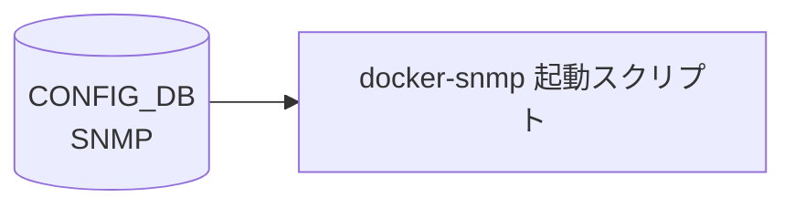

# SNMP テーブル

## 概要

[SNMP](../../reference/glossary.md#term-snmp) エージェント (`snmpd` in `docker-snmp`) のシステム情報 (Contact / Location) を保持するテーブル[^1]。`docker-snmp` 内の起動スクリプト (`start.sh` → `sonic-cfggen -d` → `snmpd.conf.j2`) が起動時に [CONFIG_DB](../../reference/glossary.md#term-config_db) を読み、`/etc/snmp/snmpd.conf` のテンプレ展開で `sysContact` / `sysLocation` 行に反映される（`hostcfgd` は `SNMP` テーブルを購読しない）。

<!-- cdb-mermaid -->
### データフロー (自動生成)



!!! note "凡例"
    CONFIG_DB から SAI までの典型経路を `docs/reference/config-db-orch-map.md` から機械生成したミニ図。詳細・例外は本ページ本文と対応表を参照。
<!-- /cdb-mermaid -->

## key 構造

```text
SNMP|CONTACT
SNMP|LOCATION
```

container `SNMP` の下に 2 つのシングルトン container (`CONTACT`/`LOCATION`)。各 container にフィールド 1 つだけ。

## フィールド

### `SNMP|CONTACT`

| フィールド | 型 | 説明 |
|-----------|----|------|
| `Contact` | string (1..255 chars, 改行不可) | [SNMP](../../reference/glossary.md#term-snmp) `sysContact` |

### `SNMP|LOCATION`

| フィールド | 型 | 説明 |
|-----------|----|------|
| `Location` | string (1..255 chars, 改行不可) | SNMP `sysLocation` |

## 制約

- 双方の leaf は `length "1..255"` かつ `pattern '[^\n]+'` (改行禁止)
- container 名は `SNMP`、内部 container 名は `CONTACT` / `LOCATION`、フィールド名は **大文字** (`Contact`/`Location`)[^1]

## 購読者

- `docker-snmp` の起動スクリプト + `snmpd.conf.j2` テンプレ: [CONFIG_DB](../../reference/glossary.md#term-config_db) → `/etc/snmp/snmpd.conf`（起動時一括レンダリング、リアルタイム購読プロセスなし）

## 関連 CONFIG_DB / YANG / CLI

- 関連 [CONFIG_DB](../../reference/glossary.md#term-config_db): `SNMP_COMMUNITY` (v1/v2c), `SNMP_USER` (v3), [`SNMP_AGENT_ADDRESS_CONFIG`](snmp-agent-address-config.md)
- 関連 CLI: `config snmp contact { add | modify | del }` / `config snmp location { add | modify | del }`
- 関連 [YANG](../../reference/glossary.md#term-yang): `sonic-snmp`

<!-- ref-triangle:start -->

## 関連リファレンス

- [YANG](../../reference/glossary.md#term-yang): [`sonic-snmp`](../yang/sonic-snmp.md)
- CLI: [`config snmp`](../cli/config-snmp.md)

<!-- ref-triangle:end -->

## 引用元

[^1]: `src/sonic-yang-models/yang-models/sonic-snmp.yang` (container `SNMP` / `CONTACT` / `LOCATION`). <https://github.com/sonic-net/sonic-buildimage/blob/9ea932ec2e18f35e58268ec2e4456b1d4afd65cd/src/sonic-yang-models/yang-models/sonic-snmp.yang>

## 関連ページ
- [CONFIG_DB: SNMP_AGENT_ADDRESS_CONFIG](snmp-agent-address-config.md)

<!-- ops-hint -->
## 運用ヒント

### 典型値

- key 形式: `SNMP|LOCATION` / `SNMP|CONTACT`。コミュニティ設定は `SNMP_COMMUNITY|<name>` テーブルで管理。
- `SNMP_COMMUNITY|<name>` の `TYPE: RO`。

### よくある誤設定

- community 名を default の `public` のまま運用すると外部から read 可能。本番では変更。

### 確認コマンド

```bash
sonic-db-cli CONFIG_DB keys 'SNMP*'
show snmp community
```
<!-- /ops-hint -->

<!-- value-behavior -->
## 値依存挙動マトリクス

### `Contact` / `Location` フィールド挙動
| 状態 | 挙動 |
|------|------|
| 設定済み（1..255 chars） | snmpd.conf の `sysContact` / `sysLocation` 行に展開。`\n` は空白に置換。 |
| 未定義（エントリなし） | テンプレートの `is defined` チェックで該当行を出力しない。snmpd は空の値を使用。 |
| 改行文字を含む | [YANG](../../reference/glossary.md#term-yang) `pattern '[^\n]+'` 制約違反でロード拒否。 |
| 256 chars 以上 | YANG `length "1..255"` 制約違反でロード拒否。 |

### `SNMP_COMMUNITY` テーブルとの関係
| 状態 | 挙動 |
|------|------|
| `SNMP_COMMUNITY` 定義済み | snmpd.conf にコミュニティ設定行を出力。 |
| `SNMP_COMMUNITY` 未定義 | `` チェック失敗。コミュニティ行なし → 全 SNMP アクセスが拒否される。 |
| `SNMP_COMMUNITY.TYPE = RO` | 読み取り専用コミュニティとして展開。 |
| `SNMP_COMMUNITY.TYPE = RW` | 読み取り/書き込みコミュニティとして展開。 |

<!-- /value-behavior -->

<!-- cdb-exceptions -->
## 例外条件・特殊挙動

- **sysContact / sysLocation 未定義時**: テンプレートの `is defined` チェックで未定義の場合は該当行を出力しない。snmpd は空の sysContact / sysLocation を使用する。[^2]
- **SNMP_COMMUNITY が未定義の場合は全アクセス拒否**: snmpd.conf テンプレートは `` で SNMP_COMMUNITY の有無を確認し、存在しない場合はコミュニティ設定行を出力しない。community なしでは全 SNMP アクセスが拒否される。[^2]
- **設定変更の反映はコンテナ再起動時のみ**: テーブル変更は `docker-snmp` コンテナの再起動 / snmpd リロードまで反映されない。[^2]
- **key の大文字/小文字**: `SNMP|LOCATION` / `SNMP|CONTACT` の key 名の大文字/小文字が YANG 定義と実装の間で一致しない場合、テンプレートがその値を参照できずサイレントスキップが発生する可能性がある。[^2]

[^2]: snmpd.conf テンプレート: `sonic-buildimage/dockers/docker-snmp/snmpd.conf.j2`. <https://github.com/sonic-net/sonic-buildimage/blob/master/dockers/docker-snmp/snmpd.conf.j2>


<!-- derivation -->
## 派生・条件付き登録

### sysLocation / sysContact の生成

`SNMP` テーブルを購読する常駐サービス（`snmp-config` のような handler / manager）は存在しない。`docker-snmp` 起動時に `start.sh` が `sonic-cfggen -d` を実行し、`snmpd.conf.j2` が CONFIG_DB を一括読み取りして snmpd の `sysLocation` / `sysContact` ディレクティブを生成する。

- `SNMP.LOCATION.Location` が定義済みなら `sysLocation <value>` を出力し、未定義なら `sysLocation public` のハードコードフォールバック（`snmpd.conf.j2:88-91`）。
- `SNMP.CONTACT` が定義済みなら `sysContact <key> <value>` を出力し、未定義なら `sysContact Azure Cloud Switch vteam <linuxnetdev@microsoft.com>` のハードコードフォールバック（`snmpd.conf.j2:93-96`）。

YANG `sonic-snmp.yang` の `SNMP` コンテナが持つのは `CONTACT` / `LOCATION` のみで、`traps` フィールドや `DEVICE_METADATA.hostname` からの `sysName` 自動設定は存在しない。trap 送信先は別テーブル `SNMP_TRAP_CONFIG` 由来の `v1/v2/v3SnmpTrap*` 変数からレンダリングされる（`snmpd.conf.j2:142-173`）。

<!-- /derivation -->

<!-- handler-branching -->
### テンプレート内の条件分岐

handler メソッドではなく `snmpd.conf.j2` のテンプレート式が `SNMP` テーブルの値で出力を分岐させる。

| 条件 | 効果 | evidence |
|---|---|---|
| `SNMP.LOCATION` 定義あり | `sysLocation <value>` を出力 | `snmpd.conf.j2:88-89` |
| `SNMP.LOCATION` 未定義 | `sysLocation public`（ハードコードフォールバック） | `snmpd.conf.j2:91` |
| `SNMP.CONTACT` 定義あり | `sysContact <key> <value>` を出力 | `snmpd.conf.j2:93-94` |
| `SNMP.CONTACT` 未定義 | `sysContact Azure Cloud Switch vteam ...`（ハードコードフォールバック） | `snmpd.conf.j2:96` |

> **裏取り**: `SNMP` テーブルはグローバル SNMP 設定で、保持するのは `CONTACT` / `LOCATION` のみ。リアルタイム購読 handler は無く、起動時に `snmpd.conf.j2` がレンダリングするだけ。trap 設定は `SNMP_TRAP_CONFIG` 側の責務であり `SNMP` テーブルには `traps` フィールドは無い。

<!-- /handler-branching -->

<!-- runtime-trace -->
## CDB → 実コンテナ動作トレース

### 段階 1: Consumer 登録

- **常駐 Consumer なし**: `SNMP` / `SNMP_COMMUNITY` をリアルタイム購読するプロセスは存在しない。`hostcfgd` はこれらのテーブルを購読しない (grep で 0 ヒット)。反映は `docker-snmp` コンテナ起動時のテンプレートレンダリングで行われる。

### 段階 2: CFG → APPL 翻訳

- `docker-snmp` の `start.sh` が `sonic-cfggen -d` で `snmpd.conf.j2` を展開し、community string / sysContact / sysLocation を `/etc/snmp/snmpd.conf` に書き出す。変更反映はコンテナ再起動時。

### 段階 3: APPL → SAI

- [SAI](../../reference/glossary.md#term-sai) 経由なし。snmpd が MIB ツリーを通じてスイッチ統計を提供。

### 段階 4: タイミング + 副作用

- 設定変更後 snmpd 再起動まで数秒。community 変更は即時有効 (再起動後)。
- 副作用: 旧 community string での SNMP ポーリングが失敗するため、NMS 側の設定変更も必要。

<!-- /runtime-trace -->
<!-- entry-points -->
## 書き込み入り口

SNMP テーブルへの書き込みが発生するコード経路を網羅的に調査した結果。

### CLI

  - `config snmp contact add/del/modify ...` — `config/main.py` が `set_entry('SNMP', 'CONTACT', ...)` を呼ぶ ([sonic-utilities](../../reference/glossary.md#term-sonic-utilities)/config/main.py:4483–4560)
  - `config snmp location add/del/modify ...` — `config/main.py` が `set_entry('SNMP', 'LOCATION', ...)` を呼ぶ ([sonic-utilities](../../reference/glossary.md#term-sonic-utilities)/config/main.py:4600–4667)

### minigraph / sonic-cfggen

minigraph.py に SNMP 生成なし

### REST / gNMI

REST/[gNMI](../../reference/glossary.md#term-gnmi) 書き込み経路なし

### db_migrator

db_migrator.py での SNMP マイグレーションなし

### ビルド時デフォルト (build-time default)

なし

### ハードコードデフォルト / ランタイム注入

なし

### 死活・デッドコード

なし
<!-- /entry-points -->

<!-- defaults -->
## コード由来の暗黙デフォルト

`SNMP` テーブルの各フィールドについて、YANG `default` ステートメント外のコード依存デフォルト・ハードコード値・乖離を記録する。

### `SNMP|LOCATION` — `Location` フィールド

| 状態 | 実際の動作 | 証拠 |
|------|-----------|------|
| `SNMP.LOCATION` が CONFIG_DB に存在しない | `sysLocation public` が snmpd.conf に出力される (`"public"` ハードコード) | `snmpd.conf.j2` L91 |
| `SNMP.LOCATION` が存在する | `{{ SNMP.LOCATION.Location \| replace('\n', ' ') }}` で展開。`\n` は空白に置換 | `snmpd.conf.j2` L89 |

**注意**: デフォルト値 `"public"` は community 名と同一文字列だが別物。YANG に `default` ステートメントなし — テンプレート固有のハードコード。

### `SNMP|CONTACT` — `Contact` フィールド

| 状態 | 実際の動作 | 証拠 |
|------|-----------|------|
| `SNMP.CONTACT` が CONFIG_DB に存在しない | `sysContact Azure Cloud Switch vteam <linuxnetdev@microsoft.com>` が出力される (Microsoft/Azure 固有ハードコード) | `snmpd.conf.j2` L96 |
| `SNMP.CONTACT` が存在する | `SNMP.CONTACT.keys()\|first` を連絡先名、`values()\|first` を連絡先情報として展開 | `snmpd.conf.j2` L94 |

**注意**: 本番環境では必ず設定すること。YANG に `default` ステートメントなし。

### YANG-実装 discrepancy — `SNMP|CONTACT` のフィールド構造

YANG は `container CONTACT { leaf Contact { ... } }` と定義するが、CLI (`config/main.py` L4483) は `{contact_name: contact_email}` という任意 key の dict を書き込む。テンプレートも `.keys()|first` / `.values()|first` で参照するため、YANG の `Contact` leaf 名は事実上機能しない。CLI ソースコード自身に `# TODO: ERROR IN YANG MODEL. Contact name is not defined as key` と記されている。YANG validator はこの構造を正しく検証できない。

### `sysServices` ハードコード値

`sysServices 72` (application + end-to-end layers) が `snmpd.conf.j2` L100 に固定記載。CONFIG_DB の `SNMP` テーブルでは管理されず、変更不可。

### `SNMP_AGENT_ADDRESS_CONFIG` 未定義時のフォールバック

`SNMP_AGENT_ADDRESS_CONFIG` テーブルが空の場合、`agentAddress udp:161` / `agentAddress udp6:161` (全インターフェース公開) がデフォルト (`snmpd.conf.j2` L32–33)。

### `snmp.yml` 注入の挙動

`snmp_yml_to_configdb.py` は起動時に `/etc/sonic/snmp.yml` から `SNMP|LOCATION` を注入するが、`snmp_location` キーが存在しない場合は `sys.exit(1)` で終了し LOCATION は未設定のまま。`SNMP|CONTACT` はこのスクリプトでは設定されず CLI のみが書き込み元。

<!-- /defaults -->

<!-- failure -->
## 失敗挙動・エラー処理

### `snmp.yml` 未存在 / `snmp_location` キー不在

`snmp_yml_to_configdb.py` はコンテナ起動時に `/etc/sonic/snmp.yml` の存在チェックを行い、
ファイルが存在しない場合は `sys.exit(1)` で終了する[^3]。
`start.sh` は終了コードをチェックしないため `sonic-cfggen` へ処理が進み、
`SNMP_COMMUNITY` なしの `snmpd.conf` が生成される。
`snmp.yml` に `snmp_location` キーが存在しない場合も同様に `sys.exit(1)` で終了し、
`SNMP|LOCATION` は CONFIG_DB に登録されず `sysLocation public` (ハードコード) が出力される[^3]。

| 障害 | 結果 | 検出方法 |
|------|------|----------|
| `/etc/sonic/snmp.yml` 不在 | community 未設定で全 SNMP アクセス拒否 | syslog: `snmp_location does not exist in snmp.yml file` |
| `snmp_location` キー不在 | `sysLocation public` ハードコード出力 | `show snmp location` で確認 |
| `SNMP_COMMUNITY` 未定義 | 全クライアントの GET/SET を snmpd が拒否 (エラーログなし) | `sonic-db-cli CONFIG_DB keys 'SNMP_COMMUNITY*'` で空を確認 |

### `SNMP_COMMUNITY` 未定義によるサイレント全拒否

`snmpd.conf.j2` は `` チェックで community 行出力を制御する[^2]。
`SNMP_COMMUNITY` テーブルが空の場合、community 設定行は一切出力されず、
snmpd は community なし設定で起動する。全クライアントからの SNMP GET/SET/TRAP が拒否されるが、
snmpd 自体はエラーを出力しないためサイレント障害となる。

### `SNMP|CONTACT` key 構造不一致によるサイレントフォールバック

CLI (`config/main.py`) は `{contact_name: contact_email}` という任意 key の dict を書き込む。
YANG は `leaf Contact` を定義するが、テンプレートは `.keys()|first` / `.values()|first` でアクセスする。
key 名の大文字/小文字が一致しない場合、テンプレートが値を参照できず
`sysContact Azure Cloud Switch vteam <linuxnetdev@microsoft.com>` (Microsoft ハードコード) が出力される[^2]。

### メモリ超過時の monit による snmp-subagent 再起動

snmp コンテナが 4 GiB を超過し続けると monit が `snmp-subagent` のみ再起動する[^4]。
snmpd 本体は継続動作するが、subagent 再起動中は MIB ツリーの一部 ([FRR](../../reference/glossary.md#term-frr) 等の AgentX サブエージェント経由情報) が一時的に応答不能となる。

### 設定変更の反映タイミング

`start.sh` が `sonic-cfggen` で `snmpd.conf` を生成するのはコンテナ起動時のみ。
CONFIG_DB 変更後は `sudo systemctl restart snmp` (または `docker restart snmp`) が必要。ランタイム中のホットリロード機構は存在しない[^3]。

[^3]: `sonic-buildimage/dockers/docker-snmp/snmp_yml_to_configdb.py` / `start.sh`. <https://github.com/sonic-net/sonic-buildimage/blob/master/dockers/docker-snmp/snmp_yml_to_configdb.py>
[^4]: `sonic-buildimage/dockers/docker-snmp/base_image_files/monit_snmp`. <https://github.com/sonic-net/sonic-buildimage/blob/master/dockers/docker-snmp/base_image_files/monit_snmp>

<!-- /failure -->

<!-- ordering -->
## 書込み順依存

### コンテナ起動時シーケンス

docker-snmp コンテナは supervisord が以下の依存順序でプログラムを制御する:

```
1. rsyslogd 起動
2. start.sh 実行 (rsyslogd:running 待機)
   ├─ snmp_yml_to_configdb.py → CONFIG_DB に SNMP_COMMUNITY / SNMP|LOCATION を書き込み
   └─ sonic-cfggen -d -t snmpd.conf.j2 → /etc/snmp/snmpd.conf 生成
3. snmpd 起動 (start:exited 待機)
4. snmp-subagent 起動 (snmpd:running 待機)
```

`snmpd` は `start.sh` の完了を待機する（`dependent_startup_wait_for=start:exited`）。`snmpd.conf.j2` のテンプレート展開は `start.sh` 内で行われるため、CONFIG_DB への書き込みが先行する。

### snmp.yml → CONFIG_DB 注入の条件

`snmp_yml_to_configdb.py` は `/etc/sonic/snmp.yml` から `SNMP|LOCATION` を注入するが、以下の優先ルールがある:

| 条件 | 動作 |
|------|------|
| `/etc/sonic/snmp.yml` に `snmp_location` なし | `snmp_yml_to_configdb.py` が `sys.exit(1)` で終了するが、`start.sh` は終了コードを無視して処理を継続。`SNMP|LOCATION` は CONFIG_DB に登録されず `sysLocation public` (ハードコード) が `snmpd.conf` に出力される |
| CONFIG_DB に `SNMP|LOCATION` が既に存在する | yml からの書き込みをスキップ（**既存エントリが優先**） |
| `SNMP|CONTACT` | `snmp_yml_to_configdb.py` は一切書き込まない。CLI 経由のみ |

### CLI 書込みとサービス再起動

CLI (`config snmp contact/location add/modify/del`) は書き込み後に常に `systemctl restart snmp.service` を実行する（`config/main.py` L4488, L4607 等）。これにより docker-snmp コンテナが再起動し、`start.sh` シーケンスが再実行される。変更反映まで数秒〜十数秒の SNMP 断が発生する。

### テーブル間の書込み順依存

| # | 依存関係 | 強制度 | 備考 |
|---|----------|--------|------|
| 1 | `/etc/sonic/snmp.yml` の `snmp_location` 事前配置 → コンテナ起動成功 | **必須** | 欠如時は `sys.exit(1)` でコンテナ起動失敗 |
| 2 | `SNMP_COMMUNITY` 設定 → SNMP アクセス可能 | **必須** | 未定義時はコミュニティ行なし → 全アクセス拒否 (`snmpd.conf.j2` L48) |
| 3 | `SNMP|LOCATION` / `SNMP|CONTACT` CONFIG_DB 書き込み → snmpd.conf 展開 | 起動時に **順序保証済み** | supervisord `wait_for=start:exited` が保証 |
| 4 | CLI `set_entry` 完了 → `systemctl restart snmp.service` | **CLI が自動実行** | 手動再起動不要 |
| 5 | `SNMP|LOCATION` 既存エントリ → snmp.yml 上書きスキップ | **既存優先** | コンテナ再起動時に yml より DB が優先される |

全フィールド（`SNMP|LOCATION`, `SNMP|CONTACT`, `SNMP_COMMUNITY`, `SNMP_AGENT_ADDRESS_CONFIG`, `SNMP_TRAP_CONFIG`）でランタイム動的更新は不可。変更反映には常に docker-snmp コンテナ再起動が必要。

<!-- /ordering -->

<!-- constants -->
## ハードコード定数

`SNMP` テーブルおよび `docker-snmp` コンテナに存在する、CONFIG_DB で管理されないハードコード定数の一覧。

### agentAddress フォールバック

| 定数 | 値 | 用途 | ソース |
|------|----|------|--------|
| デフォルト agentAddress (IPv4) | `udp:161` | `SNMP_AGENT_ADDRESS_CONFIG` 未定義時に全インターフェースを公開 | `snmpd.conf.j2` L32 |
| デフォルト agentAddress (IPv6) | `udp6:161` | `SNMP_AGENT_ADDRESS_CONFIG` 未定義時に全インターフェースを公開 (IPv6) | `snmpd.conf.j2` L33 |

### システム情報ハードコード

| 定数 | 値 | 用途 | ソース |
|------|----|------|--------|
| `sysLocation` デフォルト | `"public"` | `SNMP.LOCATION` 未定義時のフォールバック (YANG に `default` なし) | `snmpd.conf.j2` L91 |
| `sysContact` デフォルト | `"Azure Cloud Switch vteam <linuxnetdev@microsoft.com>"` | `SNMP.CONTACT` 未定義時の Microsoft/Azure 固有ハードコード | `snmpd.conf.j2` L96 |
| `sysServices` | `72` | Application + End-to-End layers (固定値; CONFIG_DB で管理されない) | `snmpd.conf.j2` L100 |

> **注意**: `sysLocation "public"` は community 名と同一文字列だが無関係。`sysServices 72` = 64 (applications) + 8 (end-to-end/IP)。本番では `SNMP.LOCATION` / `SNMP.CONTACT` を必ず CLI で設定すること。

### AgentX 定数

| 定数 | 値 | 用途 | ソース |
|------|----|------|--------|
| `agentXTimeout` | `5` 秒 | AgentX サブエージェント応答タイムアウト | `snmpd.conf.j2` L197 |
| `agentXRetries` | `4` | AgentX 再試行回数 | `snmpd.conf.j2` L198 |
| `agentxsocket` | `tcp:localhost:3161` | snmp-subagent 内部通信ソケット (固定ポート; コンテナ内部専用) | `snmpd.conf.j2` L207 |

### ディスク・ロードアベレージ監視閾値 (固定)

| 定数 | 値 | 用途 | ソース |
|------|----|------|--------|
| disk `/` 最小空き容量 | `10000` KB (≈ 9.8 MB) | `/` パーティション最小空き容量 | `snmpd.conf.j2` L119 |
| disk `/var` 最小空き率 | `5%` | `/var` パーティション最小空き率 | `snmpd.conf.j2` L120 |
| includeAllDisks 最小空き率 | `10%` | その他全ディスク最小空き率 | `snmpd.conf.j2` L121 |
| load 1 分上限 | `12` | 1 分ロードアベレージ警告閾値 | `snmpd.conf.j2` L131 |
| load 5 分上限 | `10` | 5 分ロードアベレージ警告閾値 | `snmpd.conf.j2` L131 |
| load 15 分上限 | `5` | 15 分ロードアベレージ警告閾値 | `snmpd.conf.j2` L131 |

これらの閾値は UCD-SNMP-MIB で監視され、CONFIG_DB からは変更できない。

### SNMP Trap デフォルトポート

| 定数 | 値 | 用途 | ソース |
|------|----|------|--------|
| trap `DestPort` デフォルト | `"162"` | `config snmptrap modify --port` のデフォルト値 (RFC 3232 well-known ポート) | `config/main.py` L4222 |

### snmp.yml 固定パス・キー

| 定数 | 値 | 用途 | ソース |
|------|----|------|--------|
| snmp.yml パス | `'/etc/sonic/snmp.yml'` | 起動時に読み込む yml ファイルの固定パス (不在時 sys.exit(1)) | `snmp_yml_to_configdb.py` L25 |
| community yml キー | `snmp_rocommunity` / `snmp_rocommunities` / `snmp_rwcommunity` / `snmp_rwcommunities` | yml から読み取るコミュニティ設定キー名 | `snmp_yml_to_configdb.py` L23 |
| location yml キー | `snmp_location` | yml から `SNMP.LOCATION` に注入するキー名 (不在時 sys.exit(1)) | `snmp_yml_to_configdb.py` L51 |

<!-- /constants -->

<!-- cross-refs -->
## 暗黙参照 (cross-table refs)

> **Evidence**: `snmpd.conf.j2`, `supervisord.conf.j2`, `snmp_yml_to_configdb.py`, `start.sh` 全行精読 (2026-05-15)  

`SNMP` テーブルは YANG leafref を持たないが、`docker-snmp` コンテナ起動時テンプレートと [hostcfgd](../../reference/glossary.md#term-hostcfgd) が以下のテーブルを暗黙参照する。

| 参照先 | DB | 参照方向 | YANG leafref | 実装上の必須度 | 証拠 |
|---|---|---|---|---|---|
| `SNMP_COMMUNITY\|<name>` | CONFIG_DB | 読み取り (v1/v2c コミュニティ設定) | なし | 実質必須 (未定義で全 SNMP v1/v2c 拒否) | `snmpd.conf.j2` L48–64 |
| `SNMP_USER\|<name>` | CONFIG_DB | 読み取り (v3 ユーザ設定) | なし | v3 利用時必須 | `snmpd.conf.j2` L66–77 |
| `SNMP_AGENT_ADDRESS_CONFIG\|<ip>\|<port>\|<vrf>` | CONFIG_DB | 読み取り (agentAddress バインド先) | なし | 任意 (未定義で全 IF 公開にフォールバック) | `snmpd.conf.j2` L27–34 |
| `SNMP_TRAP_CONFIG\|<version>TrapDest` | CONFIG_DB | 読み取り (トラップ送信先) | なし | 任意 (未定義でトラップ無効) | `snmpd.conf.j2` L145–173 |
| `DEVICE_METADATA\|localhost` (`switch_type`) | CONFIG_DB | 読み取り (snmp-subagent 起動コマンド分岐) | なし | 必須 (未定義でコンテナ起動失敗) | `supervisord.conf.j2` L53–57 |

### SNMP_COMMUNITY — コミュニティ文字列の前提

snmpd.conf.j2 は `` で SNMP_COMMUNITY の有無を確認し、存在する場合のみ `rocommunity` / `rwcommunity` 行を出力する (`snmpd.conf.j2` L48–64)。**SNMP_COMMUNITY が未定義の場合、SNMPv1/v2c での全アクセスが拒否される**。`snmp_yml_to_configdb.py` が起動時に `/etc/sonic/snmp.yml` からエントリを注入するが、snmp.yml が存在しない場合は注入されない。

### SNMP_USER — SNMPv3 ユーザ設定

v3 アクセスが必要な場合は `SNMP_USER` テーブルにユーザを登録する必要がある。テンプレートが `rouser` / `rwuser` + `CreateUser` 行を生成する (`snmpd.conf.j2` L66–77)。YANG leafref なし。

### SNMP_AGENT_ADDRESS_CONFIG — バインドアドレス前提

未定義の場合は `agentAddress udp:161` / `agentAddress udp6:161` (全インターフェース) にフォールバックする。セキュリティ要件がある場合は `SNMP_AGENT_ADDRESS_CONFIG` で明示的に制限すること。

### SNMP_TRAP_CONFIG — トラップ送信先

v1/v2/v3 トラップ送信先を定義するテーブル。未定義の場合はトラップ設定行が出力されず snmpd はトラップを送出しない。このテーブルは YANG `sonic-snmp.yang` の外部に存在し、`config snmp trap` CLI (`config/main.py:4229-4254`) が直接書き込む。

### DEVICE_METADATA.localhost.switch_type — snmp-subagent 起動モード

`supervisord.conf.j2` L53–57 でテンプレート展開される。`switch_type == 'chassis-packet'` の場合は `--enable_dynamic_frequency` フラグ付きで `sonic_ax_impl` を起動する。`DEVICE_METADATA.localhost` が CONFIG_DB に存在しない場合、テンプレート展開が KeyError で失敗し docker-snmp コンテナが起動しない。

### SAI 参照

なし。snmpd は純粋なユーザ空間デーモンで [SAI](../../reference/glossary.md#term-sai)/[ASIC](../../reference/glossary.md#term-asic) に一切触れない。[APPL_DB](../../reference/glossary.md#term-appl_db) 中継もない。

<!-- /cross-refs -->

<!-- pubsub -->
## 通信メカニズム

> **Evidence**: `dockers/docker-snmp/snmp_yml_to_configdb.py`, `start.sh`, `snmpd.conf.j2`, `sonic-snmpagent/src/sonic_ax_impl/main.py`, `mibs/__init__.py`, `mibs/ietf/rfc1213.py`, `sonic-utilities/config/main.py` 全行精読 (2026-05-15)

`SNMP` テーブル群は **「ランタイム購読なし・コンテナ再起動トリガー型」** で設計されている。`SubscriberStateTable` / `ConfigDBConnector.subscribe()` によるリアルタイム購読は実装されておらず、**起動時一括読み込み + CLI トリガーによる `docker-snmp` 再起動** で設定を反映する。

### 購読メカニズム一覧

| Consumer | メカニズム | 対象テーブル | タイミング |
|----------|-----------|-------------|----------|
| `snmp_yml_to_configdb.py` | `ConfigDBConnector.get_table()` (one-shot) | `SNMP_COMMUNITY`, `SNMP` | コンテナ起動時のみ |
| `sonic-cfggen + snmpd.conf.j2` | `-d` 一括ダンプ → テンプレート展開 | 全 SNMP テーブル | コンテナ起動時のみ |
| `sysNameUpdater` (snmp-subagent) | `get_all(CONFIG_DB, "DEVICE_METADATA\|localhost")` | `DEVICE_METADATA.hostname` | 起動時 `reinit_data()` のみ |
| CLI (`config snmp *`) | 書き込み後 `systemctl restart snmp.service` | 全 SNMP テーブル (書き込み元) | CLI 実行毎 |

### 詳細フロー

**コンテナ起動時シーケンス**:

1. `snmp_yml_to_configdb.py` が `/etc/sonic/snmp.yml` を読み、未設定のエントリのみ `set_entry()` で CONFIG_DB に書き込む (`SNMP_COMMUNITY`, `SNMP|LOCATION`)
2. `sonic-cfggen -d -t snmpd.conf.j2` が CONFIG_DB 全 SNMP テーブルを一括読み込み → `/etc/snmp/snmpd.conf` を生成
3. `snmpd` が生成された `snmpd.conf` を読み込んで起動
4. `sonic-snmpagent` が snmpd に AgentX (TCP `localhost:3161`) で接続し MIB サブツリーを登録

**CLI 変更時**:
- `config snmp contact/location/community/user/trap *` はすべて CONFIG_DB 書き込み後に `systemctl reset-failed && restart snmp.service` を自動実行
- `docker-snmp` コンテナが再起動し、上記起動シーケンスが再実行される
- 変更反映まで数秒〜十数秒の SNMP 断が発生する

### Redis Pub/Sub の使用状況

`sonic-snmpagent` の MIB 実装は [LLDP](../../reference/glossary.md#term-lldp) / トランシーバーセンサーで [Redis](../../reference/glossary.md#term-redis) native `psubscribe` (`__keyspace@{db}__:{pattern}`) を使用するが、**SNMP 設定テーブル自身は対象外**。

| MIB | DB | 用途 |
|-----|----|------|
| `ieee802_1ab.py` ([LLDP](../../reference/glossary.md#term-lldp)) | [APPL_DB](../../reference/glossary.md#term-appl_db) | [LLDP](../../reference/glossary.md#term-lldp) Neighbor テーブル変化検知 |
| `rfc2737.py` (物理テーブル) | [STATE_DB](../../reference/glossary.md#term-state_db) | トランシーバー状態変化検知 |

`SNMP`, `SNMP_COMMUNITY`, `SNMP_USER`, `SNMP_AGENT_ADDRESS_CONFIG`, `SNMP_TRAP_CONFIG` への keyspace notification 購読は実装されていない。

<!-- /pubsub -->

<!-- platform -->
## プラットフォーム差分

> **Evidence**: `supervisord.conf.j2`, `snmpd.conf.j2`, `sysDescription.j2`, `sonic_ax_impl/__main__.py`, `mibs/ietf/rfc4292.py`, `mibs/ietf/rfc1213.py`, `mibs/vendor/cisco/*.py`, `mibs/vendor/dell/force10.py` 全行精読 (2026-05-15)

### 差異 1: switch_type == 'chassis-packet' — snmp-subagent 動的更新周期

`supervisord.conf.j2` L53–57

| `DEVICE_METADATA.localhost.switch_type` | snmp-subagent 起動オプション | 効果 |
|----------------------------------------|---------------------------|------|
| `chassis-packet` | `--enable_dynamic_frequency` あり | [ASIC](../../reference/glossary.md#term-asic) 数・IF 数が多い chassis-packet 構成で CPU 使用率を抑制するため MIB 更新周期を負荷に応じて動的調整 |
| その他 (`npu` / `voq` / `fabric` / `dpu` 等) | オプションなし | 固定周期 (`DEFAULT_UPDATE_FREQUENCY`) で更新 |

`DEVICE_METADATA.localhost` が CONFIG_DB に存在しない場合はテンプレート展開が KeyError で失敗し docker-snmp コンテナが起動しない (全 switch_type 共通の前提条件)。

### 差異 2: multi-ASIC 構成 — inetCidrRouteTable フィルタ (rfc4292)

`sonic_ax_impl/mibs/ietf/rfc4292.py` L56–93

| 構成 | 動作 |
|------|------|
| single-[ASIC](../../reference/glossary.md#term-asic) | デフォルト namespace のみ参照。内部ポートチャネルフィルタはノーオペレーション |
| multi-ASIC | フロントエンド ASIC の namespace のみ経路取得。BackEnd ASIC namespace をスキップし、`INTERNAL_PORT` role のポートチャネルを inetCidrRouteTable から除外 |

### 差異 3: multi-ASIC 構成 — ARP テーブル取得 (rfc1213)

single-ASIC では NEIGH_TABLE のみ参照。multi-ASIC では host kernel [ARP](../../reference/glossary.md#term-arp) テーブルと各 namespace の NEIGH_TABLE を合算し、eth0 (管理 IF) を namespace ごとに除外する。

### 差異 4: ベンダー固有 MIB — 全デプロイ共通登録

以下の vendor MIB サブエージェントは **プラットフォーム条件なく全環境で登録される**。

| MIB | 提供元テーブル |
|-----|--------------|
| `ciscoPfcExtMIB` / `ciscoSwitchQosMIB` / `ciscoEntityFruControlMIB` / Cisco `bgp4` | [COUNTERS_DB](../../reference/glossary.md#term-counters_db) / [STATE_DB](../../reference/glossary.md#term-state_db) |
| Dell Force10 `SSeriesMIB` (`.1.3.6.1.4.1.6027.3.10.1.2.9`) | `/proc` CPU・メモリ |

Cisco / Dell 以外のハードウェアでも AgentX で OID が応答可能な状態になる点に注意。`SNMP` CONFIG_DB テーブルとは直接連携しない。

### 差異 5: MGMT_VRF 環境 — agentAddress / trapsink の VRF バインド

`snmpd.conf.j2` L28–29, L148–170

#### agentAddress の VRF バインド

`SNMP_AGENT_ADDRESS_CONFIG` の `vrf` フィールドが空でない場合、snmpd は指定 [VRF](../../reference/glossary.md#term-vrf) のネットワーク名前空間にバインドされる。

| `SNMP_AGENT_ADDRESS_CONFIG.vrf` | agentAddress 生成結果 | 効果 |
|---------------------------------|----------------------|------|
| 空 (`""` / 未設定) | `agentAddress udp:[<ip>]:<port>` | グローバルルーティングテーブルでバインド |
| `"mgmt"` など MGMT_VRF 名 | `agentAddress udp:[<ip>]@mgmt:<port>` | MGMT_VRF の netns でバインド。管理 IF (`eth0`) 経由のみアクセス可能 |

MGMT_VRF が有効化されている環境 (`MGMT_VRF_CONFIG.mgmtVrfEnabled = "true"`) での推奨構成。SNMP アクセスをデータプレーンから完全に分離できる。

#### トラップ送信先の VRF バインド

`SNMP_TRAP_CONFIG.<version>TrapDest.vrf` が `"None"` (文字列) 以外の場合、`trapsink` / `trap2sink` に `%<vrf>` サフィックスが付加される。

| `SNMP_TRAP_CONFIG.<version>TrapDest.vrf` | trapsink 生成結果 |
|------------------------------------------|-----------------|
| `"None"` (文字列) | `trapsink <ip>:<port> <community>` ([VRF](../../reference/glossary.md#term-vrf) なし) |
| `"mgmt"` など [VRF](../../reference/glossary.md#term-vrf) 名 | `trapsink <ip>:<port>%mgmt <community>` |

### 差異 6: SmartSwitch DPU — switch_type == 'dpu' の挙動

`supervisord.conf.j2` L53–57

[SmartSwitch](../../reference/glossary.md#term-smartswitch) の [DPU](../../reference/glossary.md#term-dpu) ノード (`switch_type = 'dpu'`) は `chassis-packet` 分岐に該当しないため、snmp-subagent は `--enable_dynamic_frequency` **なし**の固定頻度モードで起動する。

| `switch_type` | snmp-subagent 動作 |
|---------------|-------------------|
| `dpu` | 固定頻度 (`DEFAULT_UPDATE_FREQUENCY`) |
| `chassis-packet` | 動的頻度 (`--enable_dynamic_frequency`) |
| `npu` / `voq` / `fabric` | 固定頻度 |

[DPU](../../reference/glossary.md#term-dpu) ノードでも `DEVICE_METADATA.localhost` の存在が必須 (欠如時は KeyError でコンテナ起動失敗)。

<!-- /platform -->

<!-- side-effects -->
## 副次 DB 書込

`SNMP` テーブルへの書き込みが連鎖して発生するファイル書込・systemd 制御・DB 副次書込の一覧。

> **Evidence**: `dockers/docker-snmp/start.sh` L14,20–24、`snmpd.conf.j2`、`config/main.py` L4189,4399–4400,4488–4489、`snmp_yml_to_configdb.py` L36–53 全行精読 (2026-05-16)

### ファイル副次書込

| 副次書込先 | 操作 | 主要フィールド | タイミング | evidence |
|---|---|---|---|---|
| `/etc/snmp/snmpd.conf` | 上書き生成 (`sonic-cfggen -d -t snmpd.conf.j2`) | SNMP 全テーブルを展開 | コンテナ起動時 / `snmp.service` 再起動時 | `start.sh:22–24` |
| `/etc/ssw/sysDescription` | 上書き生成 (`sonic-cfggen -d -t sysDescription.j2`) | `DEVICE_METADATA.localhost.hwsku` / `platform` | コンテナ起動時 / `snmp.service` 再起動時 | `start.sh:20–21` |

`/etc/snmp/snmpd.conf` は Jinja2 テンプレート `snmpd.conf.j2` から `SNMP`・`SNMP_COMMUNITY`・`SNMP_USER`・`SNMP_AGENT_ADDRESS_CONFIG`・`SNMP_TRAP_CONFIG`・`DEVICE_METADATA.localhost` を参照して生成される。
CONFIG_DB に書き込まれた値はこのファイル生成を経て初めて `snmpd` デーモンに反映される。

### systemd 制御

| 操作 | systemd ユニット | 実行タイミング | evidence |
|---|---|---|---|
| `systemctl reset-failed snmp.service` | `snmp.service` (docker-snmp コンテナ) | CLI `config snmp *` 全コマンド書き込み直後 | `config/main.py:4399,4488` |
| `systemctl restart snmp.service` | `snmp.service` (docker-snmp コンテナ) | CLI `config snmp *` 全コマンド書き込み直後 | `config/main.py:4400,4489` |

`systemctl restart snmp.service` により `docker-snmp` コンテナが再起動し、`start.sh` → `snmpd.conf.j2` テンプレート展開 → `snmpd` 起動のシーケンスが再実行される。変更反映まで数秒〜十数秒の SNMP 断が発生する。

### CONFIG_DB への条件付き副次書込 (コンテナ起動時のみ)

| 副次書込先 | テーブル | 操作 | 条件 | evidence |
|---|---|---|---|---|
| CONFIG_DB | `SNMP_COMMUNITY` | set | `/etc/sonic/snmp.yml` に community 定義がありかつ CONFIG_DB に未登録の場合 | `snmp_yml_to_configdb.py:36–49` |
| CONFIG_DB | `SNMP\|LOCATION` | set | `/etc/sonic/snmp.yml` に `snmp_location` がありかつ CONFIG_DB に `SNMP\|LOCATION` が未登録の場合 | `snmp_yml_to_configdb.py:51–53` |
| [APPL_DB](../../reference/glossary.md#term-appl_db) | なし | — | SNMP テーブルは APPL_DB を経由しない | — |
| [STATE_DB](../../reference/glossary.md#term-state_db) | なし | — | SNMP テーブルは STATE_DB を更新しない | — |

### 失敗時挙動

- `snmp_yml_to_configdb.py` が `snmp_location` キー欠如で `sys.exit(1)` → `start.sh` 失敗 → `snmpd` 未起動
- `systemctl restart snmp.service` 失敗時は CLI が `SystemExit` をキャッチして `click.Abort()` を送出。CONFIG_DB 書き込みは完了しているが snmpd への反映は未完
- `/etc/snmp/snmpd.conf` 生成失敗時は前回の設定ファイルが残存し、CONFIG_DB との乖離が発生する可能性がある

<!-- /side-effects -->

<!-- glossary-links-injected: 88a11b84726d -->
