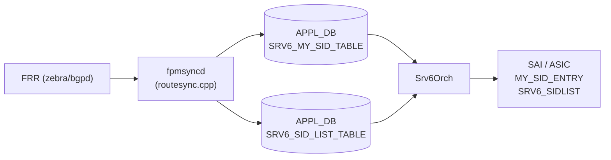

# APPL_DB SRV6 テーブル

## 概要

SONiC の SRv6 制御面は 3 層構造をとる。

1. **CONFIG_DB** (`SRV6_MY_SIDS` / `SRV6_MY_LOCATORS`) — ユーザー設定の起点
2. **APPL_DB** (`SRV6_MY_SID_TABLE` / `SRV6_SID_LIST_TABLE`) — FRR → SAI のパイプライン中継点
3. **ASIC_DB** — SAI が書き込むハードウェア状態

本ページは **APPL_DB 側の 2 テーブル**を解説する。
これらは `fpmsyncd` が FRR の netlink メッセージを受け取って書き込み、
`Srv6Orch`（`sonic-swss/orchagent/srv6orch.cpp`）が消費して SAI オブジェクトを作成する。

<!-- cdb-mermaid -->
### データフロー (自動生成)



!!! note "凡例"
    APPL_DB は FRR と ASIC の橋渡しテーブルであり、直接ユーザー設定するテーブルではない。
<!-- /cdb-mermaid -->

---

## SRV6_MY_SID_TABLE

### key 構造

```
SRV6_MY_SID_TABLE|<block_len>:<node_len>:<func_len>:<arg_len>:<sid_ipv6>
```

例: `SRV6_MY_SID_TABLE|32:16:16:0:fc00:0:1:64::`[^1]

key 内の各長さフィールドはロケータのビット長を示し、`Srv6Orch` がパースして
`sai_my_sid_entry_t` に詰める（`srv6orch.cpp:1453-1456`）。

### フィールド一覧

| フィールド | 型 | 説明 |
|-----------|-----|------|
| `action` | string | SRv6 エンドポイント動作（下表参照）。**必須** |
| `vrf` | string | デカプセル後の VRF 名。行動によって必要・不要が変わる |
| `adj` | string | nexthop 隣接 IPv4/IPv6 アドレス。行動によって必要・不要が変わる |

<!-- defaults -->
### コード由来のデフォルト（Phase A 解析）

| フィールド | 実効デフォルト | コード根拠 |
|-----------|--------------|-----------|
| `action` | **省略不可** | 空文字列だと `sidEntryEndpointBehavior` が false を返し、orch がエントリ拒否（`srv6orch.cpp:1473-1477`） |
| `vrf` | **行動依存**（下記参照） | `mySidVrfRequired(end_behavior)` が真の行動（`end.dt*`/`udt*`）では省略不可。偽の行動では省略可。VRF 名 `"default"` は `gVirtualRouterId` に解決（`srv6orch.cpp:1484-1486`） |
| `adj` | **行動依存**（下記参照） | `mySidNextHopRequired(end_behavior)` が真の行動（`end.x`/`ua` 等）では省略不可。偽の行動では省略可（`srv6orch.cpp:1511-1547`） |

**NB-ZMQ 有効時の差異**:
`fpmsyncd` が NB-ZMQ モード（`nbZmqEnabled=true`）の場合、
`action`/`vrf`/`adj` を常に全フィールド push する（値が空文字列でも）。
これは ZMQ 側の冪等更新要件によるもの（`routesync.cpp:1169-1172`）。
通常モード（ZMQ 無効）では空文字列フィールドは省略される（`routesync.cpp:1174-1182`）。

**`vrf` フィールドの行動別要否**:

| 行動 | `vrf` 必須 | 備考 |
|------|-----------|------|
| `end`, `un`, `ua` | 不要 | SAI VRF 属性を設定しない |
| `end.x`, `end.dx4`, `end.dx6`, `udx4`, `udx6` | 不要 | nexthop (adj) を使用 |
| `end.dt4`, `end.dt6`, `end.dt46`, `udt4`, `udt6`, `udt46` | **必須** | VRF 未指定だとエラー |

**`adj` フィールドの行動別要否**:

| 行動 | `adj` 必須 | 備考 |
|------|-----------|------|
| `end`, `un`, `end.dt*`, `udt*` | 不要 | nexthop 不使用 |
| `end.x`, `end.dx4`, `end.dx6`, `ua`, `udx4`, `udx6` | **必須** | 隣接未解決の場合 pending エントリへ移動 |
<!-- /defaults -->

<!-- ordering -->
## 書込み順依存 (Phase B)

> 根拠: `srv6orch.cpp` `createUpdateMysidEntry()` L1511-1543、`updateNeighbor()` L1212-1341、`doTaskSidTable()` L1146-1186 全行精読。
> evidence: `meta/_intermediate/cdb-flow/srv6-applb-ordering.md`

APPL_DB `SRV6_MY_SID_TABLE` と `SRV6_SID_LIST_TABLE` はそれぞれ独立した Consumer (`m_mysidTable` / `m_sidTable`) で処理されるが、`adj` フィールドを持つ MySID エントリには隣接 (Neighbor) 解決の順序依存がある。

### 検出された順序依存

| # | 依存関係 | 方向 | 緩和策 |
|---|----------|------|--------|
| 1 | `adj` 依存行動の MySID — Neighbor 先行推奨 | **先行推奨**（逆順は pending 自動解決） | `updateNeighbor()` ADD 通知で自動再処理 |
| 2 | Neighbor DEL 時、対応 MySID が SAI から自動削除 → pending 再登録 | **自動**（意図しない削除に注意） | MySID DEL → Neighbor DEL の順序を推奨 |
| 3 | `SRV6_SID_LIST_TABLE` vs `SRV6_MY_SID_TABLE` | 順序依存なし | — |

### adj 依存 MySID のペンディング挙動 (依存 #1)

`mySidNextHopRequired(end_behavior)` が true の行動 (`end.x`, `ua`, `udx4`, `udx6` 等) では
`adj` で指定した IP アドレスを `m_neighOrch->hasNextHop()` で解決する (`srv6orch.cpp:1524`)。
Neighbor が未確立の場合はエントリを `m_pendingSRv6MySIDEntries[nexthop]` に追加して処理を保留する (`srv6orch.cpp:1533-1534`)。
Neighbor ADD 通知が `updateNeighbor()` に届くと、対応する pending エントリが自動再処理されて SAI に登録される (`srv6orch.cpp:1224-1259`)。

### Neighbor DEL 時の自動ロールバック (依存 #2)

`updateNeighbor()` の DEL パス (`srv6orch.cpp:1266-1341`) は隣接 DELETE 通知を受け取ると、その adj を参照する全 MySID エントリを SAI から削除し、`m_pendingSRv6MySIDEntries` に再登録する。Neighbor が再確立された際に自動再 install される。意図しない MySID 削除を防ぐには MySID DEL → Neighbor DEL の順序を推奨する。

<!-- /ordering -->

<!-- cross-refs -->
## 暗黙参照テーブル (Phase C)

> 根拠: `srv6orch.cpp` `createUpdateMysidEntry()` L1480-1547、`deleteMysidEntry()` L1651-1700、`createUpdateSidList()` L1020-1117、コンストラクタ L98-115 全行精読。
> evidence: `meta/_intermediate/cdb-flow/srv6-applb-cross-refs.md`

| 参照元 | 参照先 | 種別 | 必須条件 |
|--------|--------|------|----------|
| `SRV6_MY_SID_TABLE.vrf` | `CONFIG_DB VRF.name` (VrfOrch) | OID 解決 | VRF が先に CONFIG_DB に存在すること。`end.dt*`/`udt*` 行動のみ必須 |
| `SRV6_MY_SID_TABLE.adj` | Neighbor (NeighOrch) | OID 解決 | Neighbor 未解決は自動 pending。`end.x`/`ua` 等の行動のみ必須 |
| `SRV6_MY_SID_TABLE` key | `CONFIG_DB SRV6_MY_LOCATORS` | 直接 HGET (ビット長取得) | ロケータが CONFIG_DB に存在すること |
| SRv6 nexthop | `SRV6_SID_LIST_TABLE` | orch 内部参照カウント | SID リスト DEL 前に参照 nexthop を DEL すること |

### SRV6_MY_SID_TABLE.vrf → VRF の OID 解決

`mySidVrfRequired(end_behavior)` が true の行動 (`end.dt4`, `end.dt6`, `end.dt46`, `udt4`, `udt6`, `udt46`) では `vrf` フィールドを VrfOrch で解決する (`srv6orch.cpp:1480-1502`)。`vrf == "default"` は `gVirtualRouterId` を直接使用する。非デフォルト VRF の場合は `m_vrfOrch->isVRFexists()` → `getVRFid()` で OID を取得し、未存在の場合はエントリ登録を拒否する。MySID 登録成功後 `m_vrfOrch->increaseVrfRefCount()` で参照カウントが増加し、DEL 時に `decreaseVrfRefCount()` で解放される (`srv6orch.cpp:1639`, `1683`)。

### SRV6_MY_SID_TABLE.adj → Neighbor の OID 解決

`mySidNextHopRequired(end_behavior)` が true の行動 (`end.x`, `end.dx4`, `end.dx6`, `ua`, `udx4`, `udx6` 等) では `adj` フィールドを NeighOrch で解決する (`srv6orch.cpp:1511-1543`)。Neighbor が未確立の場合はエントリを `m_pendingSRv6MySIDEntries[nexthop]` に保留し、Neighbor ADD 通知 (`updateNeighbor()`) を受けて自動再処理する。登録成功後 `m_neighOrch->increaseNextHopRefCount()` で参照カウントが増加する (`srv6orch.cpp:1644`)。

### SRV6_SID_LIST_TABLE の DEL 順序

`deleteSidList()` (`srv6orch.cpp:1129-1133`) は `sid_table_[sid_name].nexthops.size() > 0` を確認し、nexthop が残存する場合 `task_need_retry` を返して削除を拒否する。SID リストを削除するには先に参照している SRv6 nexthop を DEL する必要がある。

<!-- /cross-refs -->

<!-- failure -->
## 失敗挙動マトリクス (Phase D)

> 根拠: `srv6orch.cpp` `createUpdateMysidEntry()` L1473-1576、`doTaskMySidTable()` L2228-2234、`createUpdateSidList()` L1044-1117、`deleteSidList()` L1119-1143、`doTaskSidTable()` L1146-1186 全行精読。
> evidence: `meta/_intermediate/cdb-flow/srv6-applb-failure.md`

### SRV6_MY_SID_TABLE の失敗経路

| 失敗条件 | 検出箇所 | 結果 | 自動回復 | ログ出力 |
|----------|----------|------|----------|----------|
| 不正な `action` 値（`end_behavior_map` 未登録） | `sidEntryEndpointBehavior()` `srv6orch.cpp:1473` | SAI 登録失敗・エントリ破棄 | なし | `SWSS_LOG_ERROR("Invalid my_sid action %s")` |
| `end.dt*`/`udt*` 行動で VRF が CONFIG_DB に未存在 | `createUpdateMysidEntry()` `srv6orch.cpp:1498-1502` | SAI 登録失敗・エントリ破棄 | なし | `SWSS_LOG_ERROR("VRF %s doesn't exist in DB")` |
| VRF が CONFIG_DB に存在するが OID が `SAI_NULL_OBJECT_ID` | `createUpdateMysidEntry()` `srv6orch.cpp:1492-1495` | SAI 登録失敗・エントリ破棄 | なし | `SWSS_LOG_ERROR("VRF object not created for DT VRF %s")` |
| `adj` Neighbor 未解決（対象行動のみ） | `createUpdateMysidEntry()` `srv6orch.cpp:1532-1542` | `m_pendingSRv6MySIDEntries` に保留 | あり — Neighbor ADD 通知で自動再処理 | `SWSS_LOG_INFO("Nexthop for adjacency %s doesn't exist in DB yet")` |
| `adj` にカンマ区切りの ECMP 隣接を指定 | `createUpdateMysidEntry()` `srv6orch.cpp:1516-1519` | SAI 登録失敗・エントリ破棄 | なし | `SWSS_LOG_ERROR("ECMP adjacency not yet supported")` |

!!! warning "VRF 欠落は自動回復なし"
    `SRV6_MY_SID_TABLE` の `vrf` フィールドに指定した VRF が CONFIG_DB に存在しない場合、`Srv6Orch` はエントリを retry キューに入れず即時破棄する。VRF を後から作成しても APPL_DB イベントの再発火はなく、fpmsyncd が再 SET を行うまで MySID は ASIC に登録されない。

!!! note "adj 未解決は自動回復あり"
    `adj` フィールドの Neighbor が未解決の場合は `m_pendingSRv6MySIDEntries` に保留され、Neighbor が確立されると `updateNeighbor()` ADD 通知経由で自動再処理される。ログは INFO レベルのみ（silent に近い）。

### SRV6_SID_LIST_TABLE の失敗経路

| 失敗条件 | 検出箇所 | 結果 | 自動回復 | ログ出力 |
|----------|----------|------|----------|----------|
| `path` が空文字列（セグメント数 0） | `createUpdateSidList()` `srv6orch.cpp:1052-1055` | SAI オブジェクト未作成・`task_success` 扱い（サイレントスキップ） | なし | `SWSS_LOG_ERROR("segment list count is zero, skip")` ※ task 失敗扱いにならない |
| SAI `create_srv6_sidlist()` 失敗 | `createUpdateSidList()` `srv6orch.cpp:1091-1095` | `task_failed` 返却・エントリ破棄 | なし | `SWSS_LOG_ERROR("Failed to create srv6 sidlist object, rv %d")` |
| SAI `set_srv6_sidlist_attribute()` 更新失敗 | `createUpdateSidList()` `srv6orch.cpp:1108-1113` | `task_failed` 返却・エントリ破棄 | なし | `SWSS_LOG_ERROR("Failed to set srv6 sidlist object with new segments, rv %d")` |
| DEL 時に nexthop 参照が残存 | `deleteSidList()` `srv6orch.cpp:1129-1133` | `task_need_retry` — Consumer ループで保留 | あり — nexthop DEL 後に自動再試行 | `SWSS_LOG_NOTICE("segment object %s referenced by other nexthops: count %zu, not deleting")` |
| DEL 対象の `sid_name` が内部テーブルに存在しない | `deleteSidList()` `srv6orch.cpp:1123-1126` | `task_failed` 返却 | なし | `SWSS_LOG_ERROR("segment name %s doesn't exist")` |

!!! warning "path 空文字列はサイレントスキップ"
    `SRV6_SID_LIST_TABLE` の `path` が空文字列の場合、`SWSS_LOG_ERROR` が出力されるにもかかわらず `doTaskSidTable()` は `task_success` を返す。SAI への SID リスト作成は行われないが、タスクはエラーとして扱われない。ログを監視しない限り検知が困難な落とし穴。

<!-- /failure -->

<!-- constants -->
## ハードコード定数・上限値 (Phase E)

> 根拠: `srv6orch.cpp` L19-27 (#define 群)、`createUpdateMysidEntry()` L1515-1519、`createMySidIpInIpTunnel()` L502、`getLocatorCfgFromDb()` L347-350 精読。
> evidence: `meta/_intermediate/cdb-flow/srv6-applb-constants.md`

| 定数名 | 値 | 利用箇所 | 設定変更可否 |
|--------|-----|---------|------------|
| `ADJ_DELIMITER` | `','` | `adj` フィールドのトークン化 | 不可（コード変更必須） |
| `OVERLAY_RIF_DEFAULT_MTU` | `9100` bytes | IP-in-IP トンネル用オーバーレイ RIF の MTU | 不可（コード変更必須） |
| `LOCATOR_DEFAULT_BLOCK_LEN` | `"32"` | `SRV6_MY_LOCATORS` 欠落時フォールバック | `SRV6_MY_LOCATORS` で上書き可 |
| `LOCATOR_DEFAULT_NODE_LEN` | `"16"` | `SRV6_MY_LOCATORS` 欠落時フォールバック | `SRV6_MY_LOCATORS` で上書き可 |
| `LOCATOR_DEFAULT_FUNC_LEN` | `"16"` | `SRV6_MY_LOCATORS` 欠落時フォールバック | `SRV6_MY_LOCATORS` で上書き可 |
| `LOCATOR_DEFAULT_ARG_LEN` | `"0"` | `SRV6_MY_LOCATORS` 欠落時フォールバック | `SRV6_MY_LOCATORS` で上書き可 |

### ADJ_DELIMITER と ECMP 非対応制約

`ADJ_DELIMITER = ','` (`srv6orch.cpp:19`) は `adj` フィールドをカンマ区切りでトークン化するために使用される。
`createUpdateMysidEntry()` (`srv6orch.cpp:1515-1519`) はトークン数が 2 以上（ECMP 隣接）の場合、
`"ECMP adjacency not yet supported"` エラーを記録して SAI 登録を失敗させる。
現バージョンでは `adj` には単一 IP アドレスのみ指定可能。

### OVERLAY_RIF_DEFAULT_MTU = 9100

DSCP モード設定を必要とする MySID エントリに対して `createMySidIpInIpTunnel()` がオーバーレイ RIF を作成する際、
MTU は `OVERLAY_RIF_DEFAULT_MTU = 9100` bytes に固定される (`srv6orch.cpp:502`)。
この値は CONFIG_DB / APPL_DB のいずれからも取得されず、実行時に変更する手段はない。

### ロケータビット長フォールバック

`getLocatorCfgFromDb()` (`srv6orch.cpp:347-350`) は `SRV6_MY_LOCATORS` のビット長フィールドが欠落している場合、
`LOCATOR_DEFAULT_{BLOCK,NODE,FUNC,ARG}_LEN` (`32`, `16`, `16`, `0`) をデフォルトとして使用する。
これらは `SRV6_MY_LOCATORS` テーブルのフィールドに明示的な値を設定することで上書きできる。
このデフォルト合計（32+16+16+0=64 ビット）は COUNTERS_DB のカウンタキープレフィックス長にも波及する。

<!-- /constants -->

<!-- side-effects -->
## 副作用マトリクス (Phase F)

> 根拠: `srv6orch.cpp` `createUpdateMysidEntry()` L1589-1654、`deleteMysidEntry()` L1656-1710、`addMySidCounter()` L184-210、`removeMySidCounter()` L212-234、`deleteSidList()` L1119-1143 全行精読。
> evidence: `meta/_intermediate/cdb-flow/srv6-applb-side-effects.md`

### SRV6_MY_SID_TABLE の副作用

| 操作 | 副作用 | 条件 |
|------|--------|------|
| SET（新規） | `COUNTERS_DB.COUNTERS_SRV6_NAME_MAP` にエントリ追加 | SAI `SAI_MY_SID_ENTRY_ATTR_COUNTER_ID` 対応時のみ |
| SET（新規） | CRM `CRM_SRV6_MY_SID_ENTRY` カウンタ +1 | SAI create_my_sid_entry 成功後（`srv6orch.cpp:1612`） |
| SET（新規） | VrfOrch 参照カウント +1（`increaseVrfRefCount`） | `end.dt4`/`end.dt6`/`end.dt46`/`udt*` 行動で VRF 解決成功時（`srv6orch.cpp:1639`） |
| SET（新規） | NeighOrch nexthop 参照カウント +1（`increaseNextHopRefCount`） | `end.x`/`end.dx4`/`end.dx6`/`ua`/`udx4`/`udx6` 行動で Neighbor 解決成功時（`srv6orch.cpp:1644`） |
| SET（新規） | SAI IP-in-IP トンネル + TermEntry 作成 | DSCP モード設定が必要な行動のみ（`mySidTunnelRequired()`、`srv6orch.cpp:1554-1568`） |
| DEL | `COUNTERS_DB.COUNTERS_SRV6_NAME_MAP` からエントリ削除、SAI カウンタ削除 | カウンタが存在する場合（`removeMySidCounter()`） |
| DEL | CRM `CRM_SRV6_MY_SID_ENTRY` カウンタ -1 | SAI remove_my_sid_entry 前（`srv6orch.cpp:1675`） |
| DEL | VrfOrch 参照カウント -1（`decreaseVrfRefCount`） | `end.dt*`/`udt*` 行動で VRF を保持していた場合（`srv6orch.cpp:1683`） |
| DEL | NeighOrch nexthop 参照カウント -1（`decreaseNextHopRefCount`） | `adj` 依存行動で Neighbor を参照していた場合（`srv6orch.cpp:1689`） |
| DEL | SAI IP-in-IP トンネル + TermEntry 削除 | DSCP モードのトンネルが存在した場合（`srv6orch.cpp:1698-1704`） |

!!! note "COUNTERS_DB への書き込みは条件付き"
    `addMySidCounter()` は `getMySidCountersSupported() && getMySidCountersEnabled()` の両方が真の場合のみ実行される。SAI が `SAI_MY_SID_ENTRY_ATTR_COUNTER_ID` を未サポートのプラットフォームでは COUNTERS_DB への副作用は発生しない。

!!! note "VRF / Neighbor 参照カウントの重要性"
    MySID エントリが VRF または Neighbor を参照している間は、VrfOrch / NeighOrch の参照カウントが保持される。この間は参照先の削除がガードされる。MySID を先に DEL してから VRF/Neighbor を DEL しないと、VRF 削除が拒否される場合がある。

### SRV6_SID_LIST_TABLE の副作用

`SRV6_SID_LIST_TABLE` の SET/DEL は SAI `srv6_sidlist` オブジェクトの作成・削除のみを行い、COUNTERS_DB や CRM カウンタへの副作用は発生しない。

DEL 操作では `sid_table_[sid_name].nexthops.size()` が 0 でない限り SAI 削除を実行せず `task_need_retry` を返す。
SRv6 nexthop が SID リストを参照している間は DEL が保留される。SID リスト DEL は参照 nexthop を全て DEL した後でのみ完了する。

<!-- /side-effects -->

<!-- pubsub -->
## Redis 通信メカニズム (Phase G)

> 根拠: `orchdaemon.cpp` L312-324、`orch.cpp` L1186-1196、`srv6orch.cpp` L98-113、`fpmsyncd/routesync.cpp` L1169-1182、L1396-1410 精読。
> evidence: `meta/_intermediate/cdb-flow/srv6-applb-pubsub.md`

### Consumer 構成

`Srv6Orch` は `orchdaemon.cpp:312-324` で以下の 4 テーブルを受け取りコンシューマを登録する。

| テーブル | DB | コンシューマ種別 | 選択根拠 |
|---------|-----|----------------|---------|
| `SRV6_SID_LIST_TABLE` | APPL_DB (db_id=0) | `ConsumerStateTable` (LPOP) | `orch.cpp:1194` — db_id != CONFIG_DB ブランチ |
| `SRV6_MY_SID_TABLE` | APPL_DB (db_id=0) | `ConsumerStateTable` (LPOP) | 同上 |
| `PIC_CONTEXT_TABLE` | APPL_DB (db_id=0) | `ConsumerStateTable` (LPOP) | 同上 |
| `SRV6_MY_SID_TABLE` (CFG側) | CONFIG_DB (db_id=4) | `SubscriberStateTable` (keyspace notification) | `orch.cpp:1190` — db_id == CONFIG_DB ブランチ |

### APPL_DB 経路: ProducerStateTable → ConsumerStateTable

`fpmsyncd` は `ProducerStateTable::set()` / `del()` を使用して `SRV6_MY_SID_TABLE` / `SRV6_SID_LIST_TABLE` に書き込む。`Srv6Orch` は LPOP (`ConsumerStateTable`) でエントリを取得し、`doTask(Consumer&)` → `doTaskMySidTable()` / `doTaskSidTable()` で処理する。

```
fpmsyncd (routesync.cpp)
  → ProducerStateTable::set("SRV6_MY_SID_TABLE|<key>", ...)
  → APPL_DB (Redis, db_id=0)
  → ConsumerStateTable LPOP
  → Srv6Orch::doTaskMySidTable()
  → SAI
```

### CONFIG_DB 経路: SubscriberStateTable (keyspace notification)

CONFIG_DB `SRV6_MY_SID_TABLE` (db_id=4) は `SubscriberStateTable` ブランチが選択される。`SubscriberStateTable` は Redis keyspace notification を `PSUBSCRIBE __keyspace@4__:SRV6_MY_SID_TABLE|*` で購読し、`hset` / `del` 操作を検出後 `HGETALL` でフィールド値を取得する。orchagent 起動時には既存全エントリが `SET_COMMAND` として buffer に積まれ、`doTaskCfgMySidTable()` が初回コールされる。

### Neighbor 通知: Observer パターン (Redis 非使用)

`Srv6Orch` は `m_neighOrch->attach(this)` で NeighOrch の Observer リストに登録する (`srv6orch.cpp:110`)。Neighbor ADD/DEL イベントは Redis チャンネルを経由せず、C++ Observer パターンの直接コールバック `updateNeighbor()` (`srv6orch.cpp:1212`) で受信する。`adj` 依存 MySID の pending/install は全てこのコールバック内で処理される。

### APPL_DB への書き戻しなし

`doTaskMySidTable()` / `doTaskSidTable()` は APPL_DB への書き戻しを一切行わない。処理後は SAI のみに作用し、APPL_DB 側のテーブルへフィールドを書き戻す実装は存在しない。

<!-- /pubsub -->

<!-- platform -->
## プラットフォーム / SAI Capability 差異 (Phase H)

> 根拠: `srv6orch.cpp` `createUpdateMysidEntry()` L1554-1568、`createMySidIpInIpTunnel()` L577-600、`initIpInIpTunnel()` L486-545、`createUpdateSidList()` L1069-1117、`doTask(SelectableTimer&)` L286-313 精読。
> evidence: `meta/_intermediate/cdb-flow/srv6-applb-platform.md`

`SRV6_MY_SID_TABLE` / `SRV6_SID_LIST_TABLE` の処理結果は、プラットフォームの SAI 実装に依存する箇所が複数ある。

### 差異 1: SAI SRv6 API 未実装プラットフォーム

`Srv6Orch` は `sai_srv6_api->create_srv6_sidlist()` / `create_my_sid_entry()` を直接呼び出す。VS (Virtual Switch) など SAI SRv6 API が stub 実装のプラットフォームでは、これらが `SAI_STATUS_NOT_IMPLEMENTED` を返し、`SRV6_SID_LIST_TABLE` SET は `task_failed` で破棄され、`SRV6_MY_SID_TABLE` SET も `false` を返してエントリが ASIC に登録されない。

| プラットフォーム | SAI SRv6 対応 | SRV6_MY_SID_TABLE 処理 |
|----------------|--------------|----------------------|
| HW ASIC（SAI 対応） | あり | 正常に SAI へ登録 |
| VS / stub SAI | なし（多くの場合） | SAI 呼び出し失敗 → エントリ破棄 |

### 差異 2: DSCP モード設定が必要な MySID（IP-in-IP トンネル）

`mySidTunnelRequired()` が true の MySID エントリ（DSCP モードを持つ構成）では、`sai_tunnel_api->create_tunnel()` + `create_tunnel_term_table_entry()` を呼び出して IP-in-IP トンネルを作成する（`srv6orch.cpp:1554-1568`）。

- `SAI_TUNNEL_DSCP_MODE_UNIFORM_MODEL` / `SAI_TUNNEL_DSCP_MODE_PIPE_MODEL` の 2 種類を共有参照カウントで管理
- `initIpInIpTunnel()` が失敗した場合、対応 MySID エントリ自体も SAI に登録されない（トンネル作成失敗でロールバック）
- `sai_tunnel_api` が未実装のプラットフォームでは DSCP モード付き MySID の登録は不可能

### 差異 3: gTraditionalFlexCounter モードと COUNTERS_DB 反映遅延

orchagent 起動引数 `-c traditional` で `gTraditionalFlexCounter = true` になる（デフォルト `false`）。このモードでは MySID 追加後の FLEX_COUNTER_DB への OID 登録が ASIC_DB `VIDTORID` で VID→RID 変換確認を待ってから行われる（`srv6orch.cpp:294-295`）。

| モード | FLEX_COUNTER_DB 登録タイミング |
|--------|-------------------------------|
| デフォルト (`false`) | MySID 追加から最大 1 秒後（タイマー発火で即登録） |
| traditional (`true`) | ASIC_DB VIDTORID 確定後（RID 未確定ならポーリング繰り返し、追加遅延あり） |

### 差異 4: SRV6_SID_LIST_TABLE の sidlist type とプラットフォーム対応

`sidlist_type_map`（`srv6orch.cpp:73-79`）に定義された 4 種類（`insert`, `insert.red`, `encaps`, `encaps.red`）のみ有効。SAI 実装によっては `insert` / `insert.red` が未対応の場合があり、`sai_srv6_api->create_srv6_sidlist()` が `SAI_STATUS_NOT_SUPPORTED` を返して `task_failed` になる。fpmsyncd 経由では常に `type` フィールドが省略されるため `encaps.red`（SAI デフォルト）が使用され、通常は問題ない。

!!! note "DSCP モード未使用が一般的"
    fpmsyncd が書き込む `SRV6_MY_SID_TABLE` エントリには DSCP モード設定フィールドが含まれない。`mySidTunnelRequired()` が true になるのは `CONFIG_DB SRV6_MY_SIDS` の `decap_dscp_mode` フィールドが設定された場合のみ（`srv6orch.cpp:377-400` の CFG キャッシュ処理）。標準的な FRR 経由の設定ではトンネルは作成されない。

<!-- /platform -->

### サポート action 値

`end_behavior_map`（`srv6orch.cpp:41-62`）に定義:

| action 文字列 | SAI 動作 |
|--------------|---------|
| `end` | `SAI_MY_SID_ENTRY_ENDPOINT_BEHAVIOR_E` |
| `end.x` | `SAI_MY_SID_ENTRY_ENDPOINT_BEHAVIOR_X` |
| `end.t` | `SAI_MY_SID_ENTRY_ENDPOINT_BEHAVIOR_T` |
| `end.dx6` | `SAI_MY_SID_ENTRY_ENDPOINT_BEHAVIOR_DX6` |
| `end.dx4` | `SAI_MY_SID_ENTRY_ENDPOINT_BEHAVIOR_DX4` |
| `end.dt4` | `SAI_MY_SID_ENTRY_ENDPOINT_BEHAVIOR_DT4` |
| `end.dt6` | `SAI_MY_SID_ENTRY_ENDPOINT_BEHAVIOR_DT6` |
| `end.dt46` | `SAI_MY_SID_ENTRY_ENDPOINT_BEHAVIOR_DT46` |
| `un` | `SAI_MY_SID_ENTRY_ENDPOINT_BEHAVIOR_UN` |
| `ua` | `SAI_MY_SID_ENTRY_ENDPOINT_BEHAVIOR_UA` |
| `udx4` | `SAI_MY_SID_ENTRY_ENDPOINT_BEHAVIOR_UDX4` |
| `udx6` | `SAI_MY_SID_ENTRY_ENDPOINT_BEHAVIOR_UDX6` |
| `udt4` | `SAI_MY_SID_ENTRY_ENDPOINT_BEHAVIOR_UDT4` |
| `udt6` | `SAI_MY_SID_ENTRY_ENDPOINT_BEHAVIOR_UDT6` |
| `udt46` | `SAI_MY_SID_ENTRY_ENDPOINT_BEHAVIOR_UDT46` |
| `end.b6.encaps` | `SAI_MY_SID_ENTRY_ENDPOINT_BEHAVIOR_B6_ENCAPS` |
| `end.b6.encaps.red` | `SAI_MY_SID_ENTRY_ENDPOINT_BEHAVIOR_B6_ENCAPS_RED` |
| `end.b6.insert` | `SAI_MY_SID_ENTRY_ENDPOINT_BEHAVIOR_B6_INSERT` |
| `end.b6.insert.red` | `SAI_MY_SID_ENTRY_ENDPOINT_BEHAVIOR_B6_INSERT_RED` |

`fpmsyncd` の `mySidAction2Str()`（`routesync.cpp:300-338`）は
FRR netlink action 値を上記文字列に変換してから APPL_DB へ書き込む。

---

## SRV6_SID_LIST_TABLE

### key 構造

```
SRV6_SID_LIST_TABLE|<sid_name>
```

`<sid_name>` は通常 VPN SID の IPv6 アドレス文字列として fpmsyncd が設定する
（`routesync.cpp:1408`）。

### フィールド一覧

| フィールド | 型 | 説明 |
|-----------|-----|------|
| `path` | string (カンマ区切り IPv6 リスト) | SID リスト（セグメントリスト）。**必須** |
| `type` | enum | sidlist タイプ。省略可（デフォルト `encaps.red`） |

<!-- defaults -->
### コード由来のデフォルト（Phase A 解析）

| フィールド | 実効デフォルト | コード根拠 |
|-----------|--------------|-----------|
| `path` | **省略不可（実質）** | 省略または空文字列だと `segment_list.count=0` となり、orch が `segment list count is zero, skip` と記録して SAI 作成をスキップする（サイレント。`srv6orch.cpp:1052-1055`） |
| `type` | `encaps.red` | `sidlist_type_map` にキーが存在しない場合（フィールド未設定を含む）、`SAI_SRV6_SIDLIST_TYPE_ENCAPS_RED` を使用（`srv6orch.cpp:1080-1083` の `SWSS_LOG_INFO("Use default sidlist type: ENCAPS_RED")`） |

**fpmsyncd は `type` フィールドを書かない**:
`Srv6SidListTableFieldValueTupleWrapper::fieldValueTupleVector()` は
`path` のみを設定し、`type` フィールドは push しない（`routesync.cpp:1189-1203`）。
FRR 経由で登録されるすべての SID リストは実質 `type=encaps.red` 相当になる。

テストや手動設定で `type` を明示指定した場合は以下の値が有効:
`insert`, `insert.red`, `encaps`, `encaps.red`（`srv6orch.cpp:73-79`）。
<!-- /defaults -->

---

## 設定例

### SRV6_MY_SID_TABLE エントリ（`end.dt46` 行動）

```json
{
    "SRV6_MY_SID_TABLE": {
        "32:16:16:0:fc00:0:1:64::": {
            "action": "end.dt46",
            "vrf": "VrfDt46"
        }
    }
}
```

### SRV6_SID_LIST_TABLE エントリ

```json
{
    "SRV6_SID_LIST_TABLE": {
        "fc00:0:2:1::": {
            "path": "fc00:0:2:1::"
        }
    }
}
```

`type` フィールドを省略すると Orch が `encaps.red` として処理する。

---

## 関連テーブル

- `SRV6_MY_SIDS` (CONFIG_DB) — ユーザー設定。bgpcfgd / fpmsyncd 経由で本テーブルへ反映
- `SRV6_MY_LOCATORS` (CONFIG_DB) — ロケータ定義
- `VRF` (CONFIG_DB) — `vrf` フィールドで参照する VRF エントリ

[^1]: `sonic-swss/tests/test_srv6.py:837` より実例。
