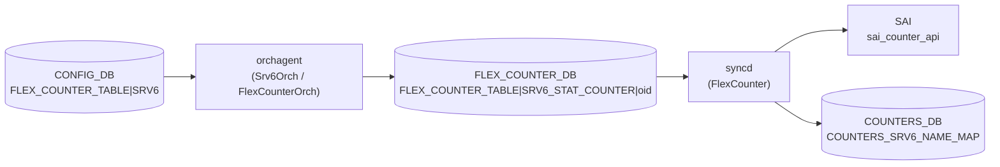

# FLEX_COUNTER_TABLE SRV6 (SRv6 カウンタ)

## 概要

[SRv6](../../reference/glossary.md#term-srv6) MySID エントリごとのパケット / バイトカウンタを収集するための [CONFIG_DB](../../reference/glossary.md#term-config_db) 設定エントリ[^1]。
`FLEX_COUNTER_TABLE|SRV6` に書き込むことで、[orchagent](../../reference/glossary.md#term-orchagent) 内の `Srv6Orch` がカウンタ収集の有効 / 無効を切り替え、[SAI](../../reference/glossary.md#term-sai) カウンタ API 経由でパケット数とバイト数を `COUNTERS_DB` に蓄積する。

`SRV6_MY_SIDS` テーブルで定義された各 MySID エントリに対応する `SAI_OBJECT_TYPE_COUNTER` オブジェクトが自動的に生成・登録される。実際のカウンタ値は `sonic show srv6` コマンドで参照できる。

<!-- cdb-mermaid -->
### データフロー (自動生成)



!!! note "凡例"
    CONFIG_DB の `FLEX_COUNTER_TABLE|SRV6` が orchagent → FLEX_COUNTER_DB → syncd → SAI の経路でカウンタポーリングを制御する。収集値は `COUNTERS_DB` の `COUNTERS_SRV6_NAME_MAP` と `COUNTERS:<oid>` に格納される。
<!-- /cdb-mermaid -->

## key 構造

```text
FLEX_COUNTER_TABLE|SRV6
```

固定キー。サブキーなし。

## フィールド

| フィールド | 型 | 説明 |
|-----------|----|------|
| `FLEX_COUNTER_STATUS` | enum `enable` / `disable` | カウンタポーリング有効化 |
| `FLEX_COUNTER_DELAY_STATUS` | boolean (`true` / `false`) | system-ready まで遅延 |
| `POLL_INTERVAL` | uint32 (100..4294967295) [ms] | ポーリング間隔 |

`BULK_CHUNK_SIZE` / `BULK_CHUNK_SIZE_PER_PREFIX` は SRV6 グループには定義されない（[YANG](../../reference/glossary.md#term-yang) にも orchagent にも実装なし）。

## 収集されるカウンタ

`FLEX_COUNTER_STATUS = enable` 時、[orchagent](../../reference/glossary.md#term-orchagent) は `SRV6_MY_SIDS` に登録された各 MySID エントリに対して `SAI_OBJECT_TYPE_COUNTER` オブジェクトを作成し、以下 2 stat を収集する[^2]:

| SAI stat | 意味 |
|---------|------|
| `SAI_COUNTER_STAT_PACKETS` | 当該 MySID にヒットしたパケット数 |
| `SAI_COUNTER_STAT_BYTES` | 当該 MySID にヒットしたバイト数 |

カウンタは `COUNTERS_DB` の `COUNTERS_SRV6_NAME_MAP`（SID → counter OID マッピング）と `COUNTERS:<oid>` ハッシュに格納される。

## 購読者

- `FlexCounterOrch` ([orchagent](../../reference/glossary.md#term-orchagent) 内): `FLEX_COUNTER_STATUS` 変化を検知し `gSrv6Orch->setCountersState(enable)` を呼び出す[^3]。
- `Srv6Orch` ([orchagent](../../reference/glossary.md#term-orchagent) 内): MySID ごとの SAI カウンタオブジェクトの生成・登録・削除を管理。
- `syncd` の `FlexCounter`: `FLEX_COUNTER_DB` の `SRV6_STAT_COUNTER_ID_LIST`（`SRV6_COUNTER_ID_LIST`）を参照し SAI bulk counter API を周期呼び出し。

<!-- ref-triangle:start -->

## 関連リファレンス

- [FLEX_COUNTER_TABLE テーブル](flex-counter-table.md) — 全グループ共通フィールドの詳細
- [SRV6_MY_SIDS テーブル](srv6-my-sids.md) — カウンタ対象 MySID エントリ定義
- [SRV6_MY_LOCATORS テーブル](srv6-my-locators.md) — ロケータ設定
- [YANG](../../reference/glossary.md#term-yang): [`sonic-flex_counter`](../yang/sonic-flex_counter.md)
- CLI: `counterpoll srv6 enable/disable/interval`

<!-- ref-triangle:end -->

## 引用元

[^1]: YANG 定義: `sonic-flex_counter.yang` container SRV6. <https://github.com/sonic-net/sonic-buildimage/blob/9ea932ec2e18f35e58268ec2e4456b1d4afd65cd/src/sonic-yang-models/yang-models/sonic-flex_counter.yang#L465>

[^2]: `FlowCounterHandler::getGenericCounterStatIdList()` が返す stat リスト (`SAI_COUNTER_STAT_PACKETS`, `SAI_COUNTER_STAT_BYTES`)。`sonic-swss/orchagent/flex_counter/flow_counter_handler.cpp:12-13`. <https://github.com/sonic-net/sonic-swss/blob/master/orchagent/flex_counter/flow_counter_handler.cpp>

[^3]: `FlexCounterOrch::doTask` — `key == SRV6_KEY` 時に `gSrv6Orch->setCountersState(value == "enable")` を呼び出す。`sonic-swss/orchagent/flexcounterorch.cpp:337`. <https://github.com/sonic-net/sonic-swss/blob/master/orchagent/flexcounterorch.cpp>

<!-- topics-back-ref -->
## 関連 Topics

- [Topics: Telemetry / SNMP / Observability](../../topics/09-telemetry-snmp/index.md)

<!-- /topics-back-ref -->

<!-- ops-hint -->
## 運用ヒント

### 典型値

- key: `FLEX_COUNTER_TABLE|SRV6`
- `FLEX_COUNTER_STATUS`: `enable`（デフォルト `disable`）
- `POLL_INTERVAL`: `10000` ms（デフォルト・推奨値）

### 確認コマンド

```bash
# カウンタポーリング状態確認
counterpoll show

# SRv6 MySID カウンタ表示
sonic-clear srv6
show srv6

# CONFIG_DB 直接確認
sonic-db-cli CONFIG_DB hgetall 'FLEX_COUNTER_TABLE|SRV6'
```

### よくある誤設定

- `enable` を設定しても SAI が `SAI_MY_SID_ENTRY_ATTR_COUNTER_ID` をサポートしない ASIC では、カウンタが常にゼロのまま。`"SRv6 counters are not supported on this platform"` ログを確認すること。
- MySID エントリが `SRV6_MY_SIDS` に存在しない状態で enable にしても COUNTERS_DB にエントリは現れない（SID 追加後に自動登録される）。

<!-- /ops-hint -->

<!-- value-behavior -->
## 値依存挙動マトリクス

### `FLEX_COUNTER_STATUS`

| 値 | 挙動 |
|----|------|
| `enable` | `FlexCounterOrch` が `gSrv6Orch->setCountersState(true)` を呼び出し。プラットフォームが SAI 対応の場合、既存の全 MySID エントリに SAI カウンタオブジェクトを作成・登録し `FLEX_COUNTER_DB` に `SRV6_COUNTER_ID_LIST` を書き込む |
| `disable` | `setCountersState(false)` — 全 MySID の SAI カウンタを削除、`FLEX_COUNTER_DB` からエントリを消去。`COUNTERS_DB` の蓄積値は残る |
| 未設定 | デフォルト `disable`（FlexCounterManager コンストラクタ `enabled=false`、init_cfg に SRV6 エントリなし） |

### `POLL_INTERVAL`

| 値 | 挙動 |
|----|------|
| 未設定 | orchagent が起動時に `SRV6_STAT_COUNTER_POLLING_INTERVAL_MS = 10000` ms を syncd に設定 |
| 設定済み (1000〜30000 ms) | 次回ポーリングから新しい間隔で収集。YANG 定義上は 100〜4294967295 ms だが、CLI は 1000〜30000 ms に制限 |

<!-- /value-behavior -->

<!-- cdb-exceptions -->
## 例外条件・特殊挙動

<!-- evidence: sonic-swss/orchagent/srv6orch.cpp -->

| 条件 | 挙動 |
|------|------|
| プラットフォームが SAI 未対応 | `queryMySidCountersCapability()` 失敗 → `m_mysid_counters_supported = false`。`enable` を書いても `"Ignoring SRv6 counters state change as they are not supported"` ログでスキップ |
| MySID 追加後に初めてカウンタ OID が登録される | SAI カウンタ作成後、`m_pending_counters` に積まれ `SRV6_FLEX_COUNTER_UPDATE_TIMER`（1 秒）ごとに syncd へ登録。瞬時には反映されない |
| MySID 削除時 | `removeMySidCounter()` が SAI カウンタを削除し `FLEX_COUNTER_DB` からエントリを消去 |
| `gSrv6Orch` が null の場合 | `FlexCounterOrch` の null チェックにより `setCountersState` が呼ばれず、`enable` が silent drop される |
| `FLEX_COUNTER_DELAY_STATUS` | Srv6Orch コード内では参照なし。syncd 側のみ参照。通常起動では影響なし |

<!-- /cdb-exceptions -->

<!-- defaults -->
## 暗黙デフォルト・コード由来挙動 (Phase A)

<!-- evidence: sonic-swss/orchagent/srv6orch.cpp,
     sonic-swss/orchagent/srv6orch.h,
     sonic-swss/orchagent/flex_counter/flow_counter_handler.cpp,
     sonic-swss/orchagent/flex_counter/flex_counter_manager.cpp,
     sonic-swss/orchagent/flexcounterorch.cpp,
     sonic-sairedis/syncd/FlexCounter.cpp,
     sonic-swss-common/common/schema.h,
     sonic-buildimage/src/sonic-yang-models/yang-models/sonic-flex_counter.yang,
     sonic-utilities/counterpoll/main.py,
     sonic-utilities/utilities_common/srv6stat.py -->

### `FLEX_COUNTER_STATUS` の暗黙デフォルト

YANG に `default` 宣言なし。以下のコードパスがデフォルト `disable` を確定する:

1. `Srv6Orch` の `FlexCounterManager` コンストラクタ引数 `enabled=false` (`srv6orch.cpp:108`) — syncd への初期送信状態が `disable`。
2. `m_mysid_counters_enabled = false` (`srv6orch.h:267`) — ヘッダのメンバ変数デフォルト値。
3. `counterpoll/main.py:841`: `srv6_info.get("FLEX_COUNTER_STATUS", DISABLE)` — CONFIG_DB にエントリなしの場合 `disable` を表示。
4. `init_cfg.json.j2` に SRV6 グループのエントリなし — ビルド時デフォルト書き込みなし。

**暗黙デフォルト: `disable`（カウンタ収集なし）**

### `POLL_INTERVAL` の暗黙デフォルト

| ソース | 値 |
|-------|-----|
| `SRV6_STAT_COUNTER_POLLING_INTERVAL_MS = 10000` (`srv6orch.cpp:27`) | 10000 ms — FlexCounterManager 初期化時に syncd へ送信 |
| counterpoll CLI ソフトデフォルト `DEFLT_10_SEC = "default (10000)"` (`counterpoll/main.py:19`) | 10000 ms — `counterpoll show` 表示上のデフォルト |
| CLI 入力範囲: `click.IntRange(1000, 30000)` (`counterpoll/main.py:695`) | 1000〜30000 ms |
| YANG range | 100〜4294967295 ms（CLI より広い） |

**ハードコードデフォルト: 10000 ms**

### `FLEX_COUNTER_DELAY_STATUS` の暗黙デフォルト

YANG に `default` なし。Srv6Orch コード内に `FLEX_COUNTER_DELAY_STATUS` 参照なし。syncd 側でのみ参照される（fast-reboot 連携用）。通常起動では遅延なし（即時）。

### `SRV6_COUNTER_ID_LIST` の固定 stat リスト

`FlowCounterHandler::getGenericCounterStatIdList()` (`flow_counter_handler.cpp:43-48`) が `SAI_COUNTER_STAT_PACKETS` / `SAI_COUNTER_STAT_BYTES` の 2 stat のみを返す。この 2 stat は固定でユーザー変更不可。

### プラットフォーム能力チェック（起動時一回限り）

`Srv6Orch::initializeCounters()` → `queryMySidCountersCapability()` が起動時に一度だけ `sai_query_attribute_capability()` を呼び出す。失敗時はカウンタ機能全体が無効化され、CONFIG_DB への `enable` 書き込みは以降すべて無視される。再起動なしに状態を変えることはできない。

### 遅延登録メカニズム（1 秒タイマー）

MySID 追加後、SAI カウンタ OID は `m_pending_counters` キューに積まれ、`SRV6_FLEX_COUNTER_UPDATE_TIMER = 1` 秒のタイマーで処理される。`m_pending_counters` が空になるとタイマーが自動停止する。`FLEX_COUNTER_DB` への登録（= syncd によるポーリング開始）は MySID 設定から最大 1 秒遅延する。

<!-- /defaults -->

<!-- ordering -->
## 書込み順依存 (Phase B)

> evidence: `meta/_intermediate/cdb-flow/srv6-counter-ordering.md`
> 根拠: `sonic-swss/orchagent/srv6orch.cpp` L251-283, L120-142, `sonic-swss/orchagent/flexcounterorch.cpp` L337-340

### 検出された順序依存

| # | 依存関係 | 方向 | 緩和策 |
|---|----------|------|--------|
| 1 | `SRV6_MY_SID_TABLE` の SAI 登録完了 → `FLEX_COUNTER_STATUS = enable` | 推奨先行 | 逆順可だが SID 追加後に最大 1 秒の遅延が SID ごとに発生 |
| 2 | `queryMySidCountersCapability()` 成功（起動時一回）→ enable 有効 | 起動時一回・変更不可 | プラットフォーム非対応なら enable は silent drop |
| 3 | `gSrv6Orch` 初期化完了 → `FLEX_COUNTER_TABLE\|SRV6` 書き込み | orchagent 起動後なら保証済み | 起動前の CONFIG_DB 書き込みは orchagent 起動時に再読み込み |
| 4 | `counterpoll srv6 interval <ms>` → `counterpoll srv6 enable` | 推奨先行 | 逆順でも次回ポーリングから反映（初回のみデフォルト 10000 ms が使われる） |

### 主要な制約詳細

**SID 先行推奨 (依存 #1)**: `setCountersState(true)` (srv6orch.cpp:251–283) は `srv6_my_sid_table_` を全走査し、既存の MySID エントリに対して `addMySidCounter()` + `setMySidEntryCounter()` を呼び出す。`SRV6_MY_SIDS` が空の状態で `enable` を書いても `COUNTERS_SRV6_NAME_MAP` へのエントリは追加されない（走査リストが空）。逆順（先に `enable` → 後から SID 追加）でも機能するが、各 SID 追加時に `addMySidCounter()` が個別に呼ばれるため、カウンタ有効化タイミングが SID ごとに最大 `SRV6_FLEX_COUNTER_UPDATE_TIMER = 1` 秒ずれる。

**プラットフォーム能力チェック (依存 #2)**: `initializeCounters()` → `queryMySidCountersCapability()` は起動時 1 度だけ `sai_query_attribute_capability()` を実行する (srv6orch.cpp:122)。`m_mysid_counters_supported = false` になると、以降の `enable` 書き込みは `"Ignoring SRv6 counters state change as they are not supported"` ログでスキップされる。再起動なしに状態を変える手段はない。

**`gSrv6Orch` null チェック (依存 #3)**: `flexcounterorch.cpp:337` で `gSrv6Orch != nullptr` を確認してから `setCountersState()` を呼ぶ。orchagent の初期化順序上、通常のデプロイでは orchagent 起動後に CONFIG_DB を書き込むため問題は発生しない。

<!-- /ordering -->

<!-- glossary-links-injected: srv6-counter-page -->
