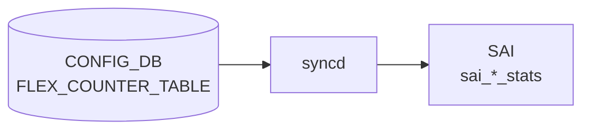

# FLEX_COUNTER_TABLE SRV6 (SRv6 カウンタ)

## 概要

[SRv6](../../reference/glossary.md#term-srv6) MySID エントリごとのパケット / バイトカウンタを収集するための [CONFIG_DB](../../reference/glossary.md#term-config_db) 設定エントリ[^1]。
`FLEX_COUNTER_TABLE|SRV6` に書き込むことで、[orchagent](../../reference/glossary.md#term-orchagent) 内の `Srv6Orch` がカウンタ収集の有効 / 無効を切り替え、[SAI](../../reference/glossary.md#term-sai) カウンタ API 経由でパケット数とバイト数を `COUNTERS_DB` に蓄積する。

`SRV6_MY_SIDS` テーブルで定義された各 MySID エントリに対応する `SAI_OBJECT_TYPE_COUNTER` オブジェクトが自動的に生成・登録される。実際のカウンタ値は `sonic show srv6` コマンドで参照できる。

<!-- cdb-mermaid -->
### データフロー (自動生成)



!!! note "凡例"
    CONFIG_DB から SAI までの典型経路を `docs/reference/config-db-orch-map.md` から機械生成したミニ図。詳細・例外は本ページ本文と対応表を参照。
<!-- /cdb-mermaid -->

## key 構造

```text
FLEX_COUNTER_TABLE|SRV6
```

固定キー。サブキーなし。

## フィールド

| フィールド | 型 | 説明 |
|-----------|----|------|
| `FLEX_COUNTER_STATUS` | enum `enable` / `disable` | カウンタポーリング有効化 |
| `FLEX_COUNTER_DELAY_STATUS` | boolean (`true` / `false`) | system-ready まで遅延 |
| `POLL_INTERVAL` | uint32 (100..4294967295) [ms] | ポーリング間隔 |

`BULK_CHUNK_SIZE` / `BULK_CHUNK_SIZE_PER_PREFIX` は SRV6 グループには定義されない（[YANG](../../reference/glossary.md#term-yang) にも orchagent にも実装なし）。

## 収集されるカウンタ

`FLEX_COUNTER_STATUS = enable` 時、[orchagent](../../reference/glossary.md#term-orchagent) は `SRV6_MY_SIDS` に登録された各 MySID エントリに対して `SAI_OBJECT_TYPE_COUNTER` オブジェクトを作成し、以下 2 stat を収集する[^2]:

| [SAI](../../reference/glossary.md#term-sai) stat | 意味 |
|---------|------|
| `SAI_COUNTER_STAT_PACKETS` | 当該 MySID にヒットしたパケット数 |
| `SAI_COUNTER_STAT_BYTES` | 当該 MySID にヒットしたバイト数 |

カウンタは `COUNTERS_DB` の `COUNTERS_SRV6_NAME_MAP`（SID → counter OID マッピング）と `COUNTERS:<oid>` ハッシュに格納される。

## 購読者

- `FlexCounterOrch` ([orchagent](../../reference/glossary.md#term-orchagent) 内): `FLEX_COUNTER_STATUS` 変化を検知し `gSrv6Orch->setCountersState(enable)` を呼び出す[^3]。
- `Srv6Orch` ([orchagent](../../reference/glossary.md#term-orchagent) 内): MySID ごとの [SAI](../../reference/glossary.md#term-sai) カウンタオブジェクトの生成・登録・削除を管理。
- `syncd` の `FlexCounter`: `FLEX_COUNTER_DB` の `SRV6_STAT_COUNTER_ID_LIST`（`SRV6_COUNTER_ID_LIST`）を参照し SAI bulk counter API を周期呼び出し。

<!-- ref-triangle:start -->

## 関連リファレンス

- [FLEX_COUNTER_TABLE テーブル](flex-counter-table.md) — 全グループ共通フィールドの詳細
- [SRV6_MY_SIDS テーブル](srv6-my-sids.md) — カウンタ対象 MySID エントリ定義
- [SRV6_MY_LOCATORS テーブル](srv6-my-locators.md) — ロケータ設定
- [YANG](../../reference/glossary.md#term-yang): [`sonic-flex_counter`](../yang/sonic-flex_counter.md)
- CLI: `counterpoll srv6 enable/disable/interval`

<!-- ref-triangle:end -->

## 引用元

[^1]: [YANG](../../reference/glossary.md#term-yang) 定義: `sonic-flex_counter.yang` container SRV6. <https://github.com/sonic-net/sonic-buildimage/blob/9ea932ec2e18f35e58268ec2e4456b1d4afd65cd/src/sonic-yang-models/yang-models/sonic-flex_counter.yang#L465>

[^2]: `FlowCounterHandler::getGenericCounterStatIdList()` が返す stat リスト (`SAI_COUNTER_STAT_PACKETS`, `SAI_COUNTER_STAT_BYTES`)。`sonic-swss/orchagent/flex_counter/flow_counter_handler.cpp:12-13`. <https://github.com/sonic-net/sonic-swss/blob/master/orchagent/flex_counter/flow_counter_handler.cpp>

[^3]: `FlexCounterOrch::doTask` — `key == SRV6_KEY` 時に `gSrv6Orch->setCountersState(value == "enable")` を呼び出す。`sonic-swss/orchagent/flexcounterorch.cpp:337`. <https://github.com/sonic-net/sonic-swss/blob/master/orchagent/flexcounterorch.cpp>

<!-- topics-back-ref -->
## 関連 Topics

- [Topics: Telemetry / SNMP / Observability](../../topics/09-telemetry-snmp/index.md)

<!-- /topics-back-ref -->

<!-- ops-hint -->
## 運用ヒント

### 典型値

- key: `FLEX_COUNTER_TABLE|SRV6`
- `FLEX_COUNTER_STATUS`: `enable`（デフォルト `disable`）
- `POLL_INTERVAL`: `10000` ms（デフォルト・推奨値）

### 確認コマンド

```bash
# カウンタポーリング状態確認
counterpoll show

# SRv6 MySID カウンタ表示
sonic-clear srv6
show srv6

# CONFIG_DB 直接確認
sonic-db-cli CONFIG_DB hgetall 'FLEX_COUNTER_TABLE|SRV6'
```

### よくある誤設定

- `enable` を設定しても SAI が `SAI_MY_SID_ENTRY_ATTR_COUNTER_ID` をサポートしない [ASIC](../../reference/glossary.md#term-asic) では、カウンタが常にゼロのまま。`"SRv6 counters are not supported on this platform"` ログを確認すること。
- MySID エントリが `SRV6_MY_SIDS` に存在しない状態で enable にしても [COUNTERS_DB](../../reference/glossary.md#term-counters_db) にエントリは現れない（SID 追加後に自動登録される）。

<!-- /ops-hint -->

<!-- value-behavior -->
## 値依存挙動マトリクス

### `FLEX_COUNTER_STATUS`

| 値 | 挙動 |
|----|------|
| `enable` | `FlexCounterOrch` が `gSrv6Orch->setCountersState(true)` を呼び出し。プラットフォームが SAI 対応の場合、既存の全 MySID エントリに SAI カウンタオブジェクトを作成・登録し `FLEX_COUNTER_DB` に `SRV6_COUNTER_ID_LIST` を書き込む |
| `disable` | `setCountersState(false)` — 全 MySID の SAI カウンタを削除、`FLEX_COUNTER_DB` からエントリを消去。`COUNTERS_DB` の蓄積値は残る |
| 未設定 | デフォルト `disable`（FlexCounterManager コンストラクタ `enabled=false`、init_cfg に SRV6 エントリなし） |

### `POLL_INTERVAL`

| 値 | 挙動 |
|----|------|
| 未設定 | orchagent が起動時に `SRV6_STAT_COUNTER_POLLING_INTERVAL_MS = 10000` ms を [syncd](../../reference/glossary.md#term-syncd) に設定 |
| 設定済み (1000〜30000 ms) | 次回ポーリングから新しい間隔で収集。YANG 定義上は 100〜4294967295 ms だが、CLI は 1000〜30000 ms に制限 |

<!-- /value-behavior -->

<!-- cdb-exceptions -->
## 例外条件・特殊挙動

<!-- evidence: sonic-swss/orchagent/srv6orch.cpp -->

| 条件 | 挙動 |
|------|------|
| プラットフォームが SAI 未対応 | `queryMySidCountersCapability()` 失敗 → `m_mysid_counters_supported = false`。`enable` を書いても `"Ignoring SRv6 counters state change as they are not supported"` ログでスキップ |
| MySID 追加後に初めてカウンタ OID が登録される | SAI カウンタ作成後、`m_pending_counters` に積まれ `SRV6_FLEX_COUNTER_UPDATE_TIMER`（1 秒）ごとに [syncd](../../reference/glossary.md#term-syncd) へ登録。瞬時には反映されない |
| MySID 削除時 | `removeMySidCounter()` が SAI カウンタを削除し `FLEX_COUNTER_DB` からエントリを消去 |
| `gSrv6Orch` が null の場合 | `FlexCounterOrch` の null チェックにより `setCountersState` が呼ばれず、`enable` が silent drop される |
| `FLEX_COUNTER_DELAY_STATUS` | Srv6Orch コード内では参照なし。[syncd](../../reference/glossary.md#term-syncd) 側のみ参照。通常起動では影響なし |

<!-- /cdb-exceptions -->

<!-- defaults -->
## 暗黙デフォルト・コード由来挙動 (Phase A)

<!-- evidence: sonic-swss/orchagent/srv6orch.cpp,
     sonic-swss/orchagent/srv6orch.h,
     sonic-swss/orchagent/flex_counter/flow_counter_handler.cpp,
     sonic-swss/orchagent/flex_counter/flex_counter_manager.cpp,
     sonic-swss/orchagent/flexcounterorch.cpp,
     sonic-sairedis/syncd/FlexCounter.cpp,
     sonic-swss-common/common/schema.h,
     sonic-buildimage/src/sonic-yang-models/yang-models/sonic-flex_counter.yang,
     sonic-utilities/counterpoll/main.py,
     sonic-utilities/utilities_common/srv6stat.py -->

### `FLEX_COUNTER_STATUS` の暗黙デフォルト

YANG に `default` 宣言なし。以下のコードパスがデフォルト `disable` を確定する:

1. `Srv6Orch` の `FlexCounterManager` コンストラクタ引数 `enabled=false` (`srv6orch.cpp:108`) — syncd への初期送信状態が `disable`。
2. `m_mysid_counters_enabled = false` (`srv6orch.h:267`) — ヘッダのメンバ変数デフォルト値。
3. `counterpoll/main.py:841`: `srv6_info.get("FLEX_COUNTER_STATUS", DISABLE)` — [CONFIG_DB](../../reference/glossary.md#term-config_db) にエントリなしの場合 `disable` を表示。
4. `init_cfg.json.j2` に SRV6 グループのエントリなし — ビルド時デフォルト書き込みなし。

**暗黙デフォルト: `disable`（カウンタ収集なし）**

### `POLL_INTERVAL` の暗黙デフォルト

| ソース | 値 |
|-------|-----|
| `SRV6_STAT_COUNTER_POLLING_INTERVAL_MS = 10000` (`srv6orch.cpp:27`) | 10000 ms — FlexCounterManager 初期化時に syncd へ送信 |
| counterpoll CLI ソフトデフォルト `DEFLT_10_SEC = "default (10000)"` (`counterpoll/main.py:19`) | 10000 ms — `counterpoll show` 表示上のデフォルト |
| CLI 入力範囲: `click.IntRange(1000, 30000)` (`counterpoll/main.py:695`) | 1000〜30000 ms |
| YANG range | 100〜4294967295 ms（CLI より広い） |

**ハードコードデフォルト: 10000 ms**

### `FLEX_COUNTER_DELAY_STATUS` の暗黙デフォルト

YANG に `default` なし。Srv6Orch コード内に `FLEX_COUNTER_DELAY_STATUS` 参照なし。syncd 側でのみ参照される（fast-reboot 連携用）。通常起動では遅延なし（即時）。

### `SRV6_COUNTER_ID_LIST` の固定 stat リスト

`FlowCounterHandler::getGenericCounterStatIdList()` (`flow_counter_handler.cpp:43-48`) が `SAI_COUNTER_STAT_PACKETS` / `SAI_COUNTER_STAT_BYTES` の 2 stat のみを返す。この 2 stat は固定でユーザー変更不可。

### プラットフォーム能力チェック（起動時一回限り）

`Srv6Orch::initializeCounters()` → `queryMySidCountersCapability()` が起動時に一度だけ `sai_query_attribute_capability()` を呼び出す。失敗時はカウンタ機能全体が無効化され、CONFIG_DB への `enable` 書き込みは以降すべて無視される。再起動なしに状態を変えることはできない。

### 遅延登録メカニズム（1 秒タイマー）

MySID 追加後、SAI カウンタ OID は `m_pending_counters` キューに積まれ、`SRV6_FLEX_COUNTER_UPDATE_TIMER = 1` 秒のタイマーで処理される。`m_pending_counters` が空になるとタイマーが自動停止する。`FLEX_COUNTER_DB` への登録（= syncd によるポーリング開始）は MySID 設定から最大 1 秒遅延する。

<!-- /defaults -->

<!-- ordering -->
## 書込み順依存 (Phase B)

> evidence: `meta/_intermediate/cdb-flow/srv6-counter-ordering.md`
> 根拠: `sonic-swss/orchagent/srv6orch.cpp` L251-283, L120-142, `sonic-swss/orchagent/flexcounterorch.cpp` L337-340

### 検出された順序依存

| # | 依存関係 | 方向 | 緩和策 |
|---|----------|------|--------|
| 1 | `SRV6_MY_SID_TABLE` の SAI 登録完了 → `FLEX_COUNTER_STATUS = enable` | 推奨先行 | 逆順可だが SID 追加後に最大 1 秒の遅延が SID ごとに発生 |
| 2 | `queryMySidCountersCapability()` 成功（起動時一回）→ enable 有効 | 起動時一回・変更不可 | プラットフォーム非対応なら enable は silent drop |
| 3 | `gSrv6Orch` 初期化完了 → `FLEX_COUNTER_TABLE\|SRV6` 書き込み | orchagent 起動後なら保証済み | 起動前の CONFIG_DB 書き込みは orchagent 起動時に再読み込み |
| 4 | `counterpoll srv6 interval <ms>` → `counterpoll srv6 enable` | 推奨先行 | 逆順でも次回ポーリングから反映（初回のみデフォルト 10000 ms が使われる） |

### 主要な制約詳細

**SID 先行推奨 (依存 #1)**: `setCountersState(true)` (srv6orch.cpp:251–283) は `srv6_my_sid_table_` を全走査し、既存の MySID エントリに対して `addMySidCounter()` + `setMySidEntryCounter()` を呼び出す。`SRV6_MY_SIDS` が空の状態で `enable` を書いても `COUNTERS_SRV6_NAME_MAP` へのエントリは追加されない（走査リストが空）。逆順（先に `enable` → 後から SID 追加）でも機能するが、各 SID 追加時に `addMySidCounter()` が個別に呼ばれるため、カウンタ有効化タイミングが SID ごとに最大 `SRV6_FLEX_COUNTER_UPDATE_TIMER = 1` 秒ずれる。

**プラットフォーム能力チェック (依存 #2)**: `initializeCounters()` → `queryMySidCountersCapability()` は起動時 1 度だけ `sai_query_attribute_capability()` を実行する (srv6orch.cpp:122)。`m_mysid_counters_supported = false` になると、以降の `enable` 書き込みは `"Ignoring SRv6 counters state change as they are not supported"` ログでスキップされる。再起動なしに状態を変える手段はない。

**`gSrv6Orch` null チェック (依存 #3)**: `flexcounterorch.cpp:337` で `gSrv6Orch != nullptr` を確認してから `setCountersState()` を呼ぶ。orchagent の初期化順序上、通常のデプロイでは orchagent 起動後に CONFIG_DB を書き込むため問題は発生しない。

<!-- /ordering -->

<!-- cross-refs -->
## 暗黙参照テーブル (Phase C)

> evidence: `meta/_intermediate/cdb-flow/srv6-counter-cross-refs.md`
> 根拠: `sonic-swss/orchagent/srv6orch.cpp` L120–142, L199, L223, L251–283, L286–313, L300, `sonic-swss/orchagent/flexcounterorch.cpp` L337–340, `sonic-swss-common/common/schema.h` L257, L313

YANG `sonic-flex_counter.yang` の `SRV6` container には leafref 定義が存在しない。以下はすべて実装レベルの暗黙参照。

| 参照先テーブル / リソース | 参照方向 | 条件 | 参照元 evidence |
|--------------------------|---------|------|----------------|
| `SRV6_MY_SIDS`（[APPL_DB](../../reference/glossary.md#term-appl_db) `APP_SRV6_MY_SID_TABLE` / CONFIG_DB `CFG_SRV6_MY_SID_TABLE`） | 走査・OID 管理（カウンタ生成/削除トリガー） | `FLEX_COUNTER_STATUS` が `enable` / `disable` に切り替わるとき。`srv6_my_sid_table_` を全走査し `addMySidCounter()` / `removeMySidCounter()` を呼び出す | `srv6orch.cpp` L251–283 (`setCountersState()`) |
| `COUNTERS_DB` の `COUNTERS_SRV6_NAME_MAP` | 書き込み（SID 文字列 → counter OID マッピング追加/削除） | MySID カウンタ追加時 / 削除時。CLI (`show srv6` / `sonic-clear srv6`) がこのマッピングを参照してカウンタ値を表示・クリアする | `srv6orch.cpp` L199 (`m_mysid_counters_table->set()`), L223 (`->hdel()`) |
| `FLEX_COUNTER_DB` の `FLEX_COUNTER_TABLE\|SRV6_STAT_COUNTER\|<oid>`（`SRV6_COUNTER_ID_LIST`） | 書き込み（syncd 向け counter OID リスト登録/削除） | ペンディング OID が [ASIC_DB](../../reference/glossary.md#term-asic_db) に登録済みと確認できた時点（1 秒タイマー処理時）。syncd の `FlexCounter` がこのリストで SAI bulk counter API を周期呼び出し | `srv6orch.cpp` L300 (`m_counter_manager.setCounterIdList()`), L229 (`clearCounterIdList()`) |
| `ASIC_DB` の `VIDTORID` | 読み取り（VID → RID 変換確認） | `gTraditionalFlexCounter == true` かつ `doTask(SelectableTimer)` 処理時のみ。OID が未登録なら次回タイマーで再試行 | `srv6orch.cpp` L134–136, L294 (`m_vid_to_rid_table->hget()`) |
| SAI `sai_counter_api`（`SAI_OBJECT_TYPE_COUNTER`） | SAI API 呼び出し（create / remove / attribute set） | `addMySidCounter()` / `removeMySidCounter()` / `setMySidEntryCounter()` 呼び出し時。プラットフォームが `queryMySidCountersCapability()` 非対応の場合は呼び出し自体が発生しない | `srv6orch.cpp` — `addMySidCounter()` / `removeMySidCounter()` 内の SAI API 呼び出し群 |

!!! note "leafref がない理由"
    `FLEX_COUNTER_TABLE|SRV6` は `SRV6_MY_SIDS` や `COUNTERS_DB` への参照を YANG モデル上では宣言しない。カウンタ対象 MySID の存在確認は orchagent 内部の `srv6_my_sid_table_` マップ（メモリ上）に対して行われるため、CONFIG_DB 経由の leafref 依存を必要としない。

<!-- /cross-refs -->

<!-- failure -->
## 失敗・エラー処理 (Phase D)

> evidence: `meta/_intermediate/cdb-flow/srv6-counter-failure.md`
> 根拠: `sonic-swss/orchagent/srv6orch.cpp` L144–155, L184–210, L212–234, L236–249, L251–284, L286–312

| 失敗ポイント | 挙動 | ログレベル | リトライ |
|------------|------|-----------|---------|
| `queryMySidCountersCapability()` — SAI API 非成功 | `m_mysid_counters_supported = false`。以降の `enable` 書き込みは常に silent drop | `SWSS_LOG_WARN` | なし（orchagent 再起動が必要） |
| `queryMySidCountersCapability()` — `set_implemented` または `create_implemented` が false | 同上（ログなし） | — | なし |
| `setCountersState()` — プラットフォーム非対応ガード | `"Ignoring SRv6 counters state change as they are not supported on this platform"` で early return | `SWSS_LOG_WARN` | なし |
| `createGenericCounter()` 失敗 (`addMySidCounter`) | 当該 MySID のカウンタ未登録（`COUNTERS_SRV6_NAME_MAP` / `m_pending_counters` に追加されない）。ループは次の MySID へ続行（partial failure）| `SWSS_LOG_ERROR` | なし |
| `set_my_sid_entry_attribute()` 失敗 (`setMySidEntryCounter`) | SAI カウンタ OID は作成済みだが MySID エントリへの紐付けが失敗した孤立状態。syncd はポーリングするがカウンタ値は常にゼロ | `SWSS_LOG_ERROR` | なし |
| [ASIC_DB](../../reference/glossary.md#term-asic_db) `VIDTORID` 未登録（`gTraditionalFlexCounter` 有効時） | `m_pending_counters` に残留し、`SRV6_FLEX_COUNTER_UPDATE_TIMER`（1 秒）ごとに再試行。上限なし | なし | 自動（1 秒タイマー） |
| `removeMySidCounter()` — `counter_oid == SAI_NULL_OBJECT_ID` | 早期リターン。`addMySidCounter` 失敗済みの SID を安全にスキップ | なし | N/A |

### 失敗パスの詳細

**プラットフォーム能力チェック失敗（最重要）**: `initializeCounters()` → `queryMySidCountersCapability()` が起動時 1 度だけ実行される (`srv6orch.cpp:122`)。`sai_query_attribute_capability()` の戻り値が `SAI_STATUS_SUCCESS` でない場合、または `capability.set_implemented && capability.create_implemented` が false の場合、`m_mysid_counters_supported = false` が確定し、以降の `FLEX_COUNTER_STATUS = enable` 書き込みはすべて `SWSS_LOG_WARN` と共に無視される。**orchagent 再起動なしに状態を変える方法はない**。

**SAI カウンタ生成 partial failure**: `setCountersState(true)` は `srv6_my_sid_table_` を for ループで全走査するが、`addMySidCounter()` の戻り値を確認しない。あるSID で `createGenericCounter()` が失敗しても、ループは中断せず次の SID へ進む。結果として一部の MySID にのみカウンタが登録される中間状態が発生しうる (`srv6orch.cpp:275`)。

**孤立カウンタ（`setMySidEntryCounter` 失敗時）**: `addMySidCounter()` が成功（SAI カウンタ OID 取得済み）後に `setMySidEntryCounter()` が失敗した場合、OID は `COUNTERS_SRV6_NAME_MAP` と `m_pending_counters` に登録されているが、MySID エントリの `SAI_MY_SID_ENTRY_ATTR_COUNTER_ID` には紐付けられていない。syncd はポーリングを試みるがハードウェアカウンタは増えない。ログは `SWSS_LOG_ERROR` のみで自動回復処理なし (`srv6orch.cpp:247`)。

**VIDTORID 待機ループ**: `gTraditionalFlexCounter == true` の環境でのみ発生。[ASIC_DB](../../reference/glossary.md#term-asic_db) の `VIDTORID` テーブルに対象 OID が現れるまで `m_pending_counters` に残留し、1 秒ごとの `SelectableTimer` で再確認する。通常は syncd が ASIC_DB に OID を書き込むまでの数百ミリ秒以内に解消されるが、異常時には無限ループ相当になる (`srv6orch.cpp:294`)。

<!-- /failure -->

<!-- constants -->
## ハードコード定数 (Phase E)

<!-- evidence:
     sonic-swss/orchagent/srv6orch.cpp,
     sonic-swss/orchagent/srv6orch.h,
     sonic-swss/orchagent/flexcounterorch.cpp,
     sonic-swss/orchagent/flex_counter/flow_counter_handler.cpp,
     sonic-swss-common/common/schema.h -->

`FLEX_COUNTER_TABLE|SRV6` 周辺で実装に直書きされた定数群。CONFIG_DB / YANG / 環境変数からは変更できず、変更にはソースビルドが必要。

### CONFIG_DB キー / グループ名文字列

| 定数 | 値 | 用途 | ソース |
|------|----|------|--------|
| `SRV6_KEY` | `"SRV6"` | `FLEX_COUNTER_TABLE` の SRV6 エントリキー | `flexcounterorch.cpp:64` |
| `SRV6_STAT_COUNTER_FLEX_COUNTER_GROUP` | `"SRV6_STAT_COUNTER"` | [FLEX_COUNTER_DB](../../reference/glossary.md#term-flex_counter_db) 上の group 名。`FlexCounterManager` 初期化時に指定 | `srv6orch.h:30` |
| `FLEX_COUNTER_STATUS_FIELD` | `"FLEX_COUNTER_STATUS"` | enable/disable を指定するフィールド名 | `schema.h:335` |
| `POLL_INTERVAL_FIELD` | `"POLL_INTERVAL"` | カウンタポーリング間隔フィールド名 | `schema.h:320` |

### ポーリング間隔デフォルト (10 秒)

| 定数 | 値 | 用途 | ソース |
|------|----|------|--------|
| `SRV6_STAT_COUNTER_POLLING_INTERVAL_MS` | `10000` ms | `FlexCounterManager` 初期化時の `POLL_INTERVAL` 初期値。`FLEX_COUNTER_TABLE|SRV6|POLL_INTERVAL` 未設定時に相当 | `srv6orch.cpp:27, 108` |

### 非同期タイマー定数 (1 秒)

| 定数 | 値 | 用途 | ソース |
|------|----|------|--------|
| `SRV6_FLEX_COUNTER_UPDATE_TIMER` | `1` 秒 | `m_counter_update_timer` の周期。`m_pending_counters` が空になるまで 1 秒ごとに VIDTORID 確認を繰り返す | `srv6orch.cpp:26, 138` |
| `"SRV6_FLEX_COUNTER_UPDATE_TIMER"` | (タイマー名文字列) | `ExecutableTimer` の identifier | `srv6orch.cpp:139` |

### COUNTERS_DB キー

| 定数 | 値 | 用途 | ソース |
|------|----|------|--------|
| `COUNTERS_SRV6_NAME_MAP` | `"COUNTERS_SRV6_NAME_MAP"` | MySID エントリ名→カウンタ OID のマッピングテーブル ([COUNTERS_DB](../../reference/glossary.md#term-counters_db)) | `schema.h:257` |
| `SRV6_COUNTER_ID_LIST` | `"SRV6_COUNTER_ID_LIST"` | [FLEX_COUNTER_DB](../../reference/glossary.md#term-flex_counter_db) 上の stat ID リストフィールド名 | `schema.h:313` |

### SAI generic counter stat リスト (固定 2 種)

| stat | 意味 | ソース |
|------|------|--------|
| `SAI_COUNTER_STAT_PACKETS` | パケット数 | `flow_counter_handler.cpp:12` |
| `SAI_COUNTER_STAT_BYTES` | バイト数 | `flow_counter_handler.cpp:13` |

`FlowCounterHandler::getGenericCounterStatIdList()` で取得。SRV6 カウンタは trap/route カウンタと同じ generic_counter_stat_ids を共有する。ユーザによる増減は不可。

### StatsMode (固定)

| 設定 | 値 | 説明 | ソース |
|------|-----|------|--------|
| `StatsMode::READ` | `"STATS_MODE_READ"` | `FlexCounterManager` 初期化時に固定指定。累積カウントのみ読取（クリアなし）| `srv6orch.cpp:108` |

### FlexCounterOrch warm boot 遅延 (共通)

| 定数 | 値 | 用途 | ソース |
|------|----|------|--------|
| `FLEX_COUNTER_DELAY_SEC` | `60` 秒 | warm boot 後、`FlexCounterOrch::doTask` を no-op に保つ秒数。SRV6 の `FLEX_COUNTER_STATUS` 変更もこの遅延の影響を受ける | `flexcounterorch.cpp:44` |

!!! note "ユーザ可変項目との対比"
    `FLEX_COUNTER_TABLE|SRV6` でユーザが変更できるのは `FLEX_COUNTER_STATUS` と `POLL_INTERVAL` のみ。stats_mode・stat ID リスト・group 名・タイマー周期・COUNTERS_DB キー名・warm-up 遅延はすべてビルド時固定。

詳細根拠は `meta/_intermediate/cdb-flow/srv6-counter-constants.md` を参照。

<!-- /constants -->

<!-- side-effects -->
## 副次 DB 書込 (Phase F)

> 詳細証跡: `meta/_intermediate/cdb-flow/srv6-counter-side-effects.md`

`FLEX_COUNTER_TABLE|SRV6` への書込みが引き起こす [CONFIG_DB](../../reference/glossary.md#term-config_db) 以外の DB への書込みと SAI 呼び出しを示す。

### `FLEX_COUNTER_STATUS` 変更 → enable

`FlexCounterOrch` が `Srv6Orch::setCountersState(true)` を呼び出し、全既存 MY_SID エントリに対して以下を実行する (`flexcounterorch.cpp:337-340`):

| 副次 DB / API | キー / 操作 | ソース |
|-------------|-----------|--------|
| [COUNTERS_DB](../../reference/glossary.md#term-counters_db) / `COUNTERS_SRV6_NAME_MAP` | `hset("", sid_prefix, counter_oid)` — MySID ごとのカウンタ OID を登録 | `srv6orch.cpp:196-199` |
| [FLEX_COUNTER_DB](../../reference/glossary.md#term-flex_counter_db) / `SRV6_STAT_COUNTER:<oid>` | `setCounterIdList` — ASIC_DB VIDTORID 確認後に登録（1 秒タイマー経由） | `srv6orch.cpp:300` |
| SAI / `sai_srv6_api` | `set_my_sid_entry_attribute(SAI_MY_SID_ENTRY_ATTR_COUNTER_ID, counter_oid)` — [ASIC](../../reference/glossary.md#term-asic) へのカウンタ紐付け | `srv6orch.cpp:276, 244` |

FLEX_COUNTER_DB への書込みは `gTraditionalFlexCounter` が有効な場合は ASIC_DB `VIDTORID` の VID→RID 解決を確認してから行われる（`srv6orch.cpp:293-295`）。プラットフォームが `SAI_MY_SID_ENTRY_ATTR_COUNTER_ID` を非サポートの場合は `setCountersState` が early-return し、副次書込みは一切発生しない（`srv6orch.cpp:256-260`）。

### `FLEX_COUNTER_STATUS` 変更 → disable

| 副次 DB / API | キー / 操作 | ソース |
|-------------|-----------|--------|
| SAI / `sai_srv6_api` | `set_my_sid_entry_attribute(SAI_MY_SID_ENTRY_ATTR_COUNTER_ID, SAI_NULL_OBJECT_ID)` — [ASIC](../../reference/glossary.md#term-asic) からカウンタ切離し | `srv6orch.cpp:278, 244` |
| COUNTERS_DB / `COUNTERS_SRV6_NAME_MAP` | `hdel("", sid_prefix)` — 名前マップエントリ削除 | `srv6orch.cpp:223` |
| FLEX_COUNTER_DB / `SRV6_STAT_COUNTER:<oid>` | `clearCounterIdList` — FLEX_COUNTER_DB エントリ削除 | `srv6orch.cpp:229` |

`m_mysid_counters_enabled` フラグにより冪等性を保証。同一値の連続書込みは no-op (`srv6orch.cpp:261-263`)。

### `POLL_INTERVAL` 変更

`setFlexCounterGroupPollInterval(SRV6_STAT_COUNTER_FLEX_COUNTER_GROUP, value)` を呼び出す (`flexcounterorch.cpp:202`):

| モード | 副次 DB / API | 操作 |
|-------|-------------|------|
| `gTraditionalFlexCounter=true` | FLEX_COUNTER_DB / `SRV6_STAT_COUNTER` group | `POLL_INTERVAL` フィールドを直接更新 |
| `gTraditionalFlexCounter=false` | SAI [Redis](../../reference/glossary.md#term-redis) 通知 (`notifySyncdCounterOperation`) | `SAI_REDIS_SWITCH_ATTR_FLEX_COUNTER_GROUP` 経由で syncd に伝達 |

### 副次書込みが発生しない DB

[STATE_DB](../../reference/glossary.md#term-state_db)・[APPL_DB](../../reference/glossary.md#term-appl_db)・CONFIG_DB（書き戻し）への書込みはいずれのケースでも発生しない。

<!-- 証跡: sonic-swss/orchagent/srv6orch.cpp, sonic-swss/orchagent/flexcounterorch.cpp, sonic-swss/orchagent/saihelper.cpp -->
<!-- /side-effects -->

<!-- pubsub -->
## 通信メカニズム (Phase G)

`FLEX_COUNTER_TABLE|SRV6` (CONFIG_DB) は orchagent 内の `FlexCounterOrch` が単一スレッドで消費する。変更検出は **[Redis](../../reference/glossary.md#term-redis) keyspace notification (PSUBSCRIBE)** 経由の `SubscriberStateTable` 経路。`ConsumerStateTable` / `NotificationConsumer` は CONFIG_DB 側では**使用しない**。

### Producer/Consumer ペア

| 区間 | 方式 | チャンネル / 仕組み |
|------|------|-------------------|
| CLI/CONFIG_DB → orchagent | `SubscriberStateTable` | `__keyspace@{config_db_id}__:FLEX_COUNTER_TABLE\|*` |
| Srv6Orch 内部 (MySID 追加後) | `SelectableTimer` (1 秒) | `SRV6_FLEX_COUNTER_UPDATE_TIMER` (`srv6orch.cpp:26,138-141`) |
| orchagent → syncd | `ProducerTable` または SAI redis switch attr 直書き | FLEX_COUNTER_DB `FLEX_COUNTER_GROUP_TABLE\|SRV6_STAT_COUNTER` |
| syncd → COUNTERS_DB | SAI generic counter polling | `COUNTERS:<oid>` (HSET) |

### SubscriberStateTable の動作

`FlexCounterOrch` (`orchdaemon.cpp:620-628`) は `Orch(db, tableNames)` 基底経由で `Orch::addConsumer()` を呼ぶ (`orch.cpp:1186-1196`)。db が CONFIG_DB のため `SubscriberStateTable` ブランチが選択される:

```
PSUBSCRIBE __keyspace@{config_db_id}__:FLEX_COUNTER_TABLE|*
PSUBSCRIBE __keyspace@{config_db_id}__:DEVICE_METADATA|*    ← FlexCounterOrch が同居
```

keyspace 通知のペイロードは [Redis](../../reference/glossary.md#term-redis) 操作名 (`hset` / `del` 等) のみ。フィールド値は通知後に `HGETALL` で別途取得する (`subscriberstatetable.cpp:17-43`)。

### 起動時スナップショット

`SubscriberStateTable` ctor は PSUBSCRIBE 直後に `getKeys()` + `get()` で既存全エントリを `SET_COMMAND` として buffer に充填する。orchagent 起動時に `FLEX_COUNTER_TABLE|SRV6` が CONFIG_DB に存在すれば、PSUBSCRIBE 待ちなしで即座に `doTask` に流れる。

### Warm restart 遅延

`FlexCounterOrch` のみ warm start 時に 60 秒の `FLEX_COUNTER_DELAY_SEC` タイマー (`flexcounterorch.cpp:44, 127-137`) が走り、満了まで `doTask(Consumer&)` は即 return する (`flexcounterorch.cpp:156-159`)。コールド起動時は遅延なし。

### doTask の SRV6 ブランチ

`FlexCounterOrch::doTask()` (`flexcounterorch.cpp:337-340`) の SRV6 キー処理:

| フィールド | 処理 | 呼び出し先 |
|---|---|---|
| `FLEX_COUNTER_STATUS = enable/disable` | `gSrv6Orch->setCountersState(enable)` + `setFlexCounterGroupOperation()` | `srv6orch.cpp:251-283`, `saihelper.cpp:918-962` |
| `POLL_INTERVAL` | `setFlexCounterGroupPollInterval(SRV6_STAT_COUNTER_FLEX_COUNTER_GROUP, value)` | `flexcounterorch.cpp:202` |

`gSrv6Orch` が null の場合は silent drop。`SRV6_KEY = "SRV6"` (`flexcounterorch.cpp:64`)。

### Srv6Orch 内部 1 秒タイマー

MySID 追加後、SAI カウンタ OID は `m_pending_counters` に積まれ `SRV6_FLEX_COUNTER_UPDATE_TIMER`（1 秒）ごとに `doTask(SelectableTimer&)` が ASIC_DB `VIDTORID` 解決を確認してから `m_counter_manager.setCounterIdList()` 経由で FLEX_COUNTER_DB に登録する (`srv6orch.cpp:286-313`)。`m_pending_counters` が空になるとタイマーが自動停止。

### 書き込み元 (Publisher 側)

CONFIG_DB への書き込みは **直接 Redis HSET** (`ConfigDBConnector`) で行われ、`ProducerStateTable` は通らない:

| 書き込み元 | 経路 |
|---|---|
| `counterpoll srv6 {enable\|disable\|interval}` | `counterpoll/main.py` → ConfigDBConnector.mod_entry → HSET |
| `config_db.json` 初期投入 | [sonic-cfggen](../../reference/glossary.md#term-sonic-cfggen) による一括 HSET |

### データフロー図

```
admin (counterpoll srv6 enable)
  ↓ ConfigDBConnector.mod_entry()
CONFIG_DB[FLEX_COUNTER_TABLE|SRV6]
  ↓ HSET + keyspace PUBLISH
  ↓   channel: __keyspace@{config_db_id}__:FLEX_COUNTER_TABLE|SRV6
  ↓   message: "hset"
orchagent select() ループ
  ↓ SubscriberStateTable.pops() → HGETALL "FLEX_COUNTER_TABLE|SRV6"
FlexCounterOrch::doTask(Consumer&)
  ├─ flexCounterGroupMap["SRV6"] → SRV6_STAT_COUNTER_FLEX_COUNTER_GROUP
  ├─ gSrv6Orch->setCountersState(true)
  │    └─ (全 MY_SID に) addMySidCounter() → COUNTERS_DB COUNTERS_SRV6_NAME_MAP
  │    └─ setMySidEntryCounter() → SAI set_my_sid_entry_attribute
  │    └─ m_pending_counters 積み
  └─ setFlexCounterGroupOperation(SRV6_STAT_COUNTER_FLEX_COUNTER_GROUP, "enable")
       └─ ProducerTable / SAI redis switch attr
FLEX_COUNTER_DB[FLEX_COUNTER_GROUP_TABLE|SRV6_STAT_COUNTER]
  ↓ syncd FlexCounter スレッドが受信
syncd → 10 秒間隔で SAI get_counter_stats → COUNTERS_DB[COUNTERS:<oid>]

MySID 追加時 (enable 状態で APP_DB に MY_SID SET):
  Srv6Orch::doTask(Consumer) → addMySidCounter() → m_pending_counters
    ↓ SRV6_FLEX_COUNTER_UPDATE_TIMER (1 秒)
  Srv6Orch::doTask(SelectableTimer) → setCounterIdList() → FLEX_COUNTER_DB

NotificationConsumer: なし  /  ConsumerStateTable: なし  /  TTL/expire: なし
```

詳細な PSUBSCRIBE パターン・競合解析は中間メモを参照: `meta/_intermediate/cdb-flow/srv6-counter-pubsub.md`。

<!-- /pubsub -->

<!-- platform -->
## プラットフォーム依存挙動 (Phase H)

<!-- evidence: sonic-swss/orchagent/srv6orch.cpp:120-155,251-259,1595
               sonic-swss/orchagent/main.cpp:84,529-532 -->

### SAI 能力クエリ（起動時一回限り）

`Srv6Orch::initializeCounters()` は `queryMySidCountersCapability()` (`srv6orch.cpp:144-155`) を呼び出し、`sai_query_attribute_capability()` で以下の 2 条件を確認する[^ph1]:

| 確認項目 | SAI 属性 |
|---------|---------|
| MySID エントリへのカウンタ属性セット可否 | `SAI_MY_SID_ENTRY_ATTR_COUNTER_ID` の `set_implemented` |
| MySID エントリ作成時のカウンタ属性指定可否 | `SAI_MY_SID_ENTRY_ATTR_COUNTER_ID` の `create_implemented` |

両方 true かつクエリ成功 → `m_mysid_counters_supported = true`（カウンタ機能全体が有効化）。
それ以外 → `m_mysid_counters_supported = false`（`SWSS_LOG_INFO("SRv6 counters are not supported on this platform")`）。

**このフラグは再起動なしに変更不可**（起動時一回のみ評価）。

### m_mysid_counters_supported が false の場合の挙動

| コードパス | 挙動 |
|-----------|------|
| `setCountersState(enable)` | `SWSS_LOG_WARN("Ignoring SRv6 counters state change as they are not supported on this platform")` → 即 return。CONFIG_DB の `enable` 書き込みは silent drop |
| `doTaskMySidTable()` (MySID 追加時) | `m_mysid_counters_enabled && m_mysid_counters_supported` が false → `addMySidCounter()` を呼ばない |
| `initializeCounters()` | `m_asic_db` / `m_counter_db` / `m_counter_update_timer` の初期化をスキップ |

### gTraditionalFlexCounter モード差異

`orchagent -c traditional` 起動オプション (`main.cpp:529-532`) で `gTraditionalFlexCounter = true`（デフォルト `false`）[^ph2]。

| フラグ | `initializeCounters()` | `doTask(SelectableTimer)` の OID 登録 |
|--------|------------------------|--------------------------------------|
| `false`（デフォルト・現行 master） | `m_vid_to_rid_table` を初期化しない | `m_pending_counters` の全 OID を即座に `setCounterIdList()` で登録 |
| `true`（旧互換） | `m_vid_to_rid_table = Table(ASIC_DB, "VIDTORID")` を初期化 | ASIC_DB `VIDTORID` に OID が現れるまで登録を保留（タイマー次回 tick に再試行） |

`gTraditionalFlexCounter = true` は syncd の SAI redis 通信モードが "traditional" のレガシー構成のみ使用。現行 [SONiC](../../reference/glossary.md#term-sonic) master ではデフォルト `false`。

### 確認方法

```bash
# SAI 能力クエリ結果を orchagent ログで確認
journalctl -u swss --no-pager | grep -i "SRv6 counters"
# → "SRv6 counters are not supported on this platform" が出れば非対応プラットフォーム

# FlexCounter モード確認
ps aux | grep orchagent | grep -o -- '-c [a-z]*'
# → "-c traditional" が出れば gTraditionalFlexCounter = true
```

[^ph1]: `Srv6Orch::queryMySidCountersCapability()` — `sai_query_attribute_capability(gSwitchId, SAI_OBJECT_TYPE_MY_SID_ENTRY, SAI_MY_SID_ENTRY_ATTR_COUNTER_ID, &capability)` の結果で `capability.set_implemented && capability.create_implemented` を返す。`sonic-swss/orchagent/srv6orch.cpp:144-155`. <https://github.com/sonic-net/sonic-swss/blob/master/orchagent/srv6orch.cpp>

[^ph2]: `gTraditionalFlexCounter` — `orchagent/main.cpp:84`（デフォルト `false`）、`main.cpp:529-532`（`-c traditional` 引数で `true`）。`sonic-swss/orchagent/main.cpp`. <https://github.com/sonic-net/sonic-swss/blob/master/orchagent/main.cpp>

<!-- /platform -->

<!-- glossary-links-injected: srv6-counter-page -->

<!-- glossary-links-injected: 865a18402f05 -->
