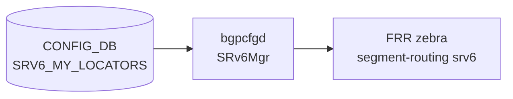

# SRV6_MY_LOCATORS テーブル

## 概要

`SRV6_MY_LOCATORS` は SRv6 ロケータを定義し、SID アドレス空間をブロック・ノード・ファンクション・アーギュメントの各ビット長に分割するテーブル[^1]。`bgpcfgd` の `SRv6Mgr` が CONFIG_DB を購読し、FRR (zebra) の `segment-routing srv6 locators` コマンドへ変換する[^2]。`SRV6_MY_SIDS` テーブルの各エントリは対応するロケータが先に存在していることを必要とする。

<!-- cdb-mermaid -->
### データフロー (自動生成)



!!! note "凡例"
    CONFIG_DB から FRR までの典型経路。詳細・例外は本ページ本文を参照。
<!-- /cdb-mermaid -->

## key 構造

```text
SRV6_MY_LOCATORS|<locator_name>
```

- `<locator_name>`: 任意の文字列（`SRV6_MY_SIDS` の `locator` フィールドから leafref 参照される）

## フィールド

| フィールド | 型 | YANG default | 説明 |
|-----------|----|-----------|----|
| `prefix` | IPv6 アドレス | **必須** (mandatory) | ロケータの IPv6 プレフィックス先頭アドレス。bgpcfgd が `block_len + node_len` ビット長を付加して `/N` を計算する |
| `block_len` | uint8 (1–128) | `32` | SRv6 ロケータブロック部のビット長 |
| `node_len` | uint8 (1–128) | `16` | SRv6 ロケータノード部のビット長 |
| `func_len` | uint8 (0–128) | `16` | SRv6 SID ファンクション部のビット長 |
| `arg_len` | uint8 (0–128) | `0` | SRv6 SID アーギュメント部のビット長 |
| `vrf` | string | `"default"` | VRF 名。bgpcfgd は現時点で FRR コマンドに反映しない（YANG default のみ） |

**YANG 制約**: `block_len + node_len + func_len + arg_len <= 128`

## 制約

- `prefix` は省略不可 (`mandatory true`)。bgpcfgd の `Locator` クラスは `data['prefix']` に直接アクセスするため、欠落時は `KeyError` で処理失敗。
- デフォルト値のみ使用時: ビット長合計は 32 + 16 + 16 + 0 = 64 ≤ 128 で YANG 制約を満たす。
- `SRV6_MY_SIDS` エントリの処理は、対応ロケータが先に `SRV6_MY_LOCATORS` に存在しない場合にペンディングされ、ロケータ登録後に自動再試行される。

## 購読者

- `bgpcfgd` (`SRv6Mgr`): CONFIG_DB `SRV6_MY_LOCATORS` を購読し、`segment-routing srv6 locators locator <name> prefix <p> block-len <b> node-len <n> func-bits <f>` コマンドを FRR へ投入。
- `frrcfgd` (`frrcfgd.py`): `SRV6_MY_LOCATORS` を zebra に転送する経路も存在する。

## 関連 CONFIG_DB / YANG / CLI

- 関連 [CONFIG_DB](../../reference/glossary.md#term-config_db): `SRV6_MY_SIDS`（ロケータを leafref 参照）
- 関連 [YANG](../../reference/glossary.md#term-yang): `sonic-srv6`
- 関連 CLI: なし（config_db.json または RESTCONF で投入）

<!-- defaults -->
## コード由来の暗黙デフォルト (Phase A)

> 根拠: `bgpcfgd/managers_srv6.py` L135-142 (Locator クラス) および `sonic-srv6.yang` L41-91 全行精読。
> evidence: `meta/_intermediate/cdb-flow/srv6-my-locators-defaults.md`

| フィールド | 省略時の実挙動 | 分類 |
|-----------|--------------|------|
| `prefix` | `data['prefix']` への直接アクセスで `KeyError` → bgpcfgd 処理失敗 | 必須欠落 (KeyError crash) |
| `block_len` | Python: `32` (in-data ガード)。YANG: `default 32` | code-fallback = YANG default (一致) |
| `node_len` | Python: `16` (in-data ガード)。YANG: `default 16` | code-fallback = YANG default (一致) |
| `func_len` | Python: `16` (in-data ガード)。YANG: `default 16` | code-fallback = YANG default (一致) |
| `arg_len` | Python: `0` (in-data ガード)。YANG: `default 0` | code-fallback = YANG default (一致) |
| `vrf` | YANG: `default "default"`。bgpcfgd の `Locator` クラスは `vrf` を読み取らず FRR コマンドに含めない | YANG-コード 乖離あり |

### prefix 自動拡張

`managers_srv6.py:142`:
```python
self.prefix = data['prefix'].lower() + "/{}".format(self.block_len + self.node_len)
```

デフォルト (`block_len=32`, `node_len=16`) 使用時は `/48` を自動付加。
例: `prefix: "fcbb:bbbb:20::"` → FRR コマンドでは `fcbb:bbbb:20::/48` として投入。

### vrf フィールドの乖離

`sonic-srv6.yang` は `vrf` に `default "default"` を定義するが、`bgpcfgd/managers_srv6.py` の `Locator` クラスは `vrf` を読み取らない。FRR の locator コマンド (`locator <name> prefix ... block-len ... node-len ... func-bits ... behavior usid`) に vrf オプションは含まれていない。`frrcfgd.py` 側の zebra 購読経路 (`SRV6_MY_LOCATORS: ['zebra']`) では vrf が反映される可能性があるが、`Locator` クラス経由では無効。

<!-- /defaults -->

<!-- ordering -->
## 書込み順依存 (Phase B)

`bgpcfgd` の `SRv6Mgr` は `SRV6_MY_LOCATORS` と `SRV6_MY_SIDS` を個別に購読し、SID 処理時にロケータの存在を確認する。このため書き込み順序が SID の通知タイミングに直接影響する。

> 根拠: `bgpcfgd/managers_srv6.py` `sids_set_handler()` L62-76、`locators_del_handler()` L106-115 全行精読。
> evidence: `meta/_intermediate/cdb-flow/srv6-my-locators-ordering.md`

### 検出された順序依存

| # | 依存関係 | 方向 | 緩和策 |
|---|----------|------|--------|
| 1 | `SRV6_MY_LOCATORS` → `SRV6_MY_SIDS` | **先行推奨**（逆順は自動再試行で最終解決） | `on_deps_change` コールバックでロケータ到着時に自動再試行 |
| 2 | `SRV6_MY_LOCATORS` に `prefix` フィールド必須 | **必須**（欠落時 `KeyError` で処理失敗） | `prefix` を常に含めて書き込む |
| 3 | ロケータ `prefix` 変更時は SID を先に DEL | **推奨**（変更後の SID 整合性は自動検証されない） | SID DEL → ロケータ更新 → SID 再 SET の順序 |
| 4 | ロケータ DEL 前に `SRV6_MY_SIDS` を先に DEL | **推奨**（残存 SID は次回 SET まで zombie 状態） | SID DEL → ロケータ DEL の順序 |

### ロケータ先行必須の詳細 (依存 #1)

`sids_set_handler()` (`managers_srv6.py:62-69`) は SID 処理時に
`self.directory.path_exist(self.db_name, "SRV6_MY_LOCATORS", locator_name)` を確認する。
ロケータが未登録の場合は `return False` で処理を中断し、
`self.directory.subscribe([...], self.on_deps_change)` でロケータの到着を待つ。
ロケータが後から書き込まれると `on_deps_change` コールバックが発火し、保留中の SID が自動再処理される。
ただしロケータ到着までの間、FRR への SID 通知は遅延する。

### ロケータ DEL 時の注意 (依存 #4)

`locators_del_handler()` (`managers_srv6.py:106-115`) は FRR に `no locator <name>` を送信するが、
対応する `SRV6_MY_SIDS` エントリの削除は行わない。ロケータが消えた後に SID の SET イベントが来ると
`path_exist()` チェックで再び `return False` され、SID は FRR へ通知されないまま残存する。
ロケータを削除する際は先に `SRV6_MY_SIDS` の関連エントリを DEL してから操作すること。

<!-- /ordering -->

<!-- cross-refs -->
## テーブル間クロスリファレンス (Phase C)

> 根拠: `sonic-srv6.yang` L81-82, L108-109、`srv6orch.cpp` L107, L331-350、`frrcfgd.py` L121, L2335, L2732 精読。
> evidence: `meta/_intermediate/cdb-flow/srv6-my-locators-cross-refs.md`

| 参照元 | 参照先 | 種別 | 必須条件 |
|--------|--------|------|----------|
| `SRV6_MY_SIDS.locator_name` | `SRV6_MY_LOCATORS.locator_name` | YANG leafref | SID 書き込み前にロケータが存在すること |
| `SRV6_MY_LOCATORS.vrf` | `VRF.name` | YANG leafref | 非 `"default"` VRF 指定時のみ |
| `Srv6Orch` (swss orchagent) | `CONFIG_DB SRV6_MY_LOCATORS` | 直接 DB 参照 | MySID APPL_DB 処理時にビット長を取得 |
| `frrcfgd` | `CONFIG_DB SRV6_MY_LOCATORS` | 購読 → zebra 転送 | bgpcfgd と並立した FRR 通知経路 |

### SRV6_MY_SIDS からの leafref 参照

`sonic-srv6.yang:108-109` が `SRV6_MY_SIDS` の `locator_name` を `SRV6_MY_LOCATORS.locator_name` への leafref として定義している。YANG バリデーションにより、対応するロケータエントリが存在しない `SRV6_MY_SIDS` の書き込みは拒否される。

### VRF テーブルへの leafref

`sonic-srv6.yang:81-82` が `SRV6_MY_LOCATORS` の `vrf` フィールドを `VRF.name` への leafref として定義している。`vrf` に `"default"` 以外の値を指定する場合は `VRF` テーブルに対象 VRF が先に存在しなければならない。bgpcfgd は `vrf` を FRR コマンドに反映しないが、YANG バリデーション層は本制約を強制する。

### srv6orch による CONFIG_DB 直接参照

`Srv6Orch` は `m_locatorCfgTable`（`srv6orch.cpp:107`）で CONFIG_DB の `SRV6_MY_LOCATORS` を直接読み取る。`getLocatorCfgFromDb()`（`srv6orch.cpp:331-350`）は APPL_DB の MySID エントリ処理時にロケータの `block_len` / `node_len` / `func_len` / `arg_len` を取得し、SAI エントリに詰める。ロケータが CONFIG_DB に存在しない場合は `SWSS_LOG_ERROR` を出力してエントリ処理が失敗する。

<!-- /cross-refs -->

<!-- failure -->
## 失敗挙動・retry / recovery (Phase D)

> 根拠: `bgpcfgd/managers_srv6.py` L62-76, L106-115, L136-142 および `srv6orch.cpp` L331-338, L455-468 全行精読。
> evidence: `meta/_intermediate/cdb-flow/srv6-my-locators-failure.md`

| # | 失敗条件 | 検出箇所 | 結果 | 自動回復 | ログ種別 |
|---|----------|----------|------|----------|----------|
| 1 | `prefix` フィールド欠落 | `Locator.__init__():142` | bgpcfgd `KeyError` / ロケータ FRR 通知失敗 | なし | `log_err` / Python traceback |
| 2 | SID 処理時ロケータ未登録 | `sids_set_handler():62-69` | SID FRR 通知保留 | あり (`on_deps_change`) | `log_warn` |
| 3 | SID prefix がロケータ配下外 | `sids_set_handler():74-76` | SID 即時拒否・retry なし | なし | `log_err` |
| 4 | MySID 処理時ロケータ未登録 (Srv6Orch) | `getLocatorCfgFromDb():331-338` | MySID SAI 転送失敗 | なし | `SWSS_LOG_ERROR` |
| 5 | DSCP ロケータ逆引き失敗 (Srv6Orch) | `getMySidEntryDscpMode():468` | DSCP モード未設定 | なし | `SWSS_LOG_ERROR` |

### prefix フィールド欠落 (失敗 #1)

`Locator.__init__()` (`managers_srv6.py:142`) は `data['prefix']` に直接アクセスするため、`prefix` が CONFIG_DB に存在しない場合は Python `KeyError` が発生して `locators_set_handler()` が失敗する。bgpcfgd は FRR へのロケータ通知を行わず、自動回復もない。正しい `prefix` フィールドを付けてエントリを再 SET することで解消する。

### SID 処理時ロケータ未登録 (失敗 #2)

`sids_set_handler()` (`managers_srv6.py:62-69`) はロケータ存在を `directory.path_exist()` で確認し、未登録なら `return False` で保留する。ロケータが後から CONFIG_DB に書き込まれると `on_deps_change` コールバックが発火し、pending SID が自動再処理される。ただしロケータ到着までの間 SID は FRR へ通知されない。

### SID prefix 整合性エラー (失敗 #3)

`sids_set_handler()` (`managers_srv6.py:74-76`) は `IPv6Network.supernet_of()` で SID prefix がロケータ配下に収まるか検証する。不一致の場合は `return False` で即時拒否し、pending キューにも登録しない。SID エントリを修正して再 SET が必要。

### Srv6Orch ロケータ未登録エラー (失敗 #4・#5)

`Srv6Orch::getLocatorCfgFromDb()` (`srv6orch.cpp:331-338`) は CONFIG_DB の `SRV6_MY_LOCATORS` を直接 GET する。ロケータが存在しない場合 `SWSS_LOG_ERROR` を出力して `false` を返す。Orch 側に retry 機構はなく、APPL_DB イベントが再発火するか設定が修正されるまで MySID は SAI へ転送されない。DSCP ロケータ逆引き失敗 (`srv6orch.cpp:468`) も同様に自動回復なし。

<!-- /failure -->

<!-- constants -->
## ハードコード定数・上限値 (Phase E)

> 根拠: `srv6orch.cpp` L19-24, L331-350 および `managers_srv6.py` L6-12, L37-53, L135-142 全行精読。
> evidence: `meta/_intermediate/cdb-flow/srv6-my-locators-constants.md`

### srv6orch.cpp — ロケータ長フォールバック定数

`getLocatorCfgFromDb()` (`srv6orch.cpp:331-350`) が CONFIG_DB のロケータエントリを読み取る際、各フィールドが省略されている場合に `get_value_or()` の引数として使われる固定値。

| 定数名 | 値 | 意味 |
|--------|-----|------|
| `LOCATOR_DEFAULT_BLOCK_LEN` | `"32"` | `block_len` フィールド省略時のフォールバック（ビット）。YANG default・Python Locator クラスの値と一致 |
| `LOCATOR_DEFAULT_NODE_LEN` | `"16"` | `node_len` フィールド省略時のフォールバック（ビット） |
| `LOCATOR_DEFAULT_FUNC_LEN` | `"16"` | `func_len` フィールド省略時のフォールバック（ビット） |
| `LOCATOR_DEFAULT_ARG_LEN` | `"0"` | `arg_len` フィールド省略時のフォールバック（ビット） |

上記 4 定数は YANG `default` 値・Python `Locator.__init__()` のフォールバック値（`managers_srv6.py:138-141`）と完全一致しており、bgpcfgd / Srv6Orch の双方が同一のデフォルト挙動を持つ。

### FRR コマンドへのハードコード埋め込み

`locators_set_handler()` (`managers_srv6.py:37-53`) が生成する FRR vtysh コマンドには 2 つのハードコード要素が存在する:

| 項目 | ハードコード値 | 意味 |
|------|--------------|------|
| `behavior` フラグ | `"usid"` | 全ロケータに無条件付与 (`managers_srv6.py:47`)。uSID（micro-SID, RFC 9252）動作を強制。CONFIG_DB フィールドでは変更不可 |
| プレフィックス長計算 | `block_len + node_len` のみ | FRR に送るプレフィックスは `/<block+node>` に固定 (`managers_srv6.py:142`)。`func_len` / `arg_len` は含まれない |

例: デフォルト値使用時 → `prefix fcbb:bbbb:20::/48 block-len 32 node-len 16 func-bits 16 behavior usid`

### ビット長の有効範囲（YANG 制約）

コード側でビット長の範囲チェックは行わず、YANG バリデーション層に委ねている。

| フィールド | YANG 型 | 有効範囲 |
|-----------|---------|---------|
| `block_len` | `uint8` | 1–128 |
| `node_len` | `uint8` | 1–128 |
| `func_len` | `uint8` | 0–128 |
| `arg_len` | `uint8` | 0–128 |
| 合計制約 | `must` | `block_len + node_len + func_len + arg_len <= 128` |

<!-- /constants -->

<!-- side-effects -->
## 副作用・他テーブルへの波及 (Phase F)

> 根拠: `bgpcfgd/managers_srv6.py` L41-53, L64-68, L106-115 および `frrcfgd/frrcfgd.py` L121, L2335, L2732-2742 全行精読。
> evidence: `meta/_intermediate/cdb-flow/srv6-my-locators-side-effects.md`

`SRV6_MY_LOCATORS` の SET / DEL は CONFIG_DB の単一テーブル操作に留まらず、bgpcfgd・frrcfgd・Srv6Orch の 3 コンポーネントにわたる副作用を持つ。

### SET 時の副作用

| # | 副作用 | 対象コンポーネント |
|---|--------|-----------------|
| 1 | FRR に `locator <name> prefix ...` コマンドを送信 | FRR zebra (bgpcfgd 経由) |
| 2 | pending 状態の `SRV6_MY_SIDS` エントリが自動再試行される | bgpcfgd `on_deps_change` コールバック |
| 3 | FRR に同等コマンドを重複送信（冪等、実害なし） | FRR zebra (frrcfgd 経由) |

**SID 自動再試行の詳細 (副作用 #2)**:
ロケータ未登録のため保留されていた `SRV6_MY_SIDS` エントリは、ロケータ SET によって
`directory.subscribe()` の `on_deps_change` コールバックが発火し、FRR への SID 通知が自動再試行される
(`managers_srv6.py:64-68`)。ロケータを SET するだけで依存 SID の通知遅延が解消する。

**frrcfgd の二重送信 (副作用 #3)**:
`frrcfgd.py` も `SRV6_MY_LOCATORS` を購読し (`frrcfgd.py:2335`、`SRV6_MY_LOCATORS: ['zebra']`)、
bgpcfgd と独立して同一の vtysh コマンドを発行する (`frrcfgd.py:2732-2742`)。
FRR 設定は冪等なため実害はないが、2 つの異なるプロセスが同一コマンドを発行する点に注意。

### DEL 時の副作用

| # | 副作用 | 対象コンポーネント |
|---|--------|-----------------|
| 4 | FRR に `no locator <name>` を送信 | FRR zebra (bgpcfgd 経由) |
| 5 | bgpcfgd 内の in-memory directory からロケータを削除 → 以後の `SRV6_MY_SIDS` SET が全て保留に移行 | bgpcfgd directory |
| 6 | 次回 APPL_DB MySID 処理で Srv6Orch が `getLocatorCfgFromDb()` 失敗 → SAI 転送スキップ | Srv6Orch / SAI |

ロケータを DEL すると当該ロケータに属する全 SID の FRR 通知経路が即座に無効化される（副作用 #5）。
FRR 側では `no locator <name>` によりロケータ設定が削除されるが、`SRV6_MY_SIDS` CONFIG_DB エントリは
そのまま残存するため、オペレーターが手動で SID エントリを DEL するまで zombie 状態が続く。

<!-- /side-effects -->

<!-- pubsub -->
## Redis 通知メカニズム (Phase G)

> 根拠: `bgpcfgd/runner.py` L27,L49-51, L54-73、`bgpcfgd/main.py` L109、`managers_srv6.py` L67-68、`frrcfgd/frrcfgd.py` L121,L2335、`srv6orch.cpp` L107,L331-338、`subscriberstatetable.cpp` L17-43 全行精読。
> evidence: `meta/_intermediate/cdb-flow/srv6-my-locators-pubsub.md`

### 購読者一覧

| 購読者 | 購読方式 | Redis primitive | PSUBSCRIBE パターン |
|--------|---------|-----------------|-------------------|
| bgpcfgd `SRv6Mgr` | `SubscriberStateTable` | keyspace PSUBSCRIBE | `__keyspace@4__:SRV6_MY_LOCATORS|*` |
| frrcfgd | `SubscriberStateTable` | keyspace PSUBSCRIBE | `__keyspace@4__:SRV6_MY_LOCATORS|*` |
| Srv6Orch | `Table.get()` のみ | 直接 HGET（イベント購読なし） | — |

### bgpcfgd パス

`Runner.add_manager()` (`runner.py:49-51`) が `swsscommon.SubscriberStateTable(conn, "SRV6_MY_LOCATORS")` を生成して `swsscommon.Select()` セレクタに登録する。`runner.py:54-73` の主ループは 1000 ms タイムアウトの `selector.select()` でイベントを待受け、受信時に `subscriber.pop()` でキュードレインして `SRv6Mgr.locators_set_handler()` / `SRv6Mgr.locators_del_handler()` を呼び出す。ループ末尾の `cfg_mgr.commit()` で積み上がった FRR vtysh コマンドを一括送信する。

`SRV6_MY_LOCATORS|<locator_name>` への HSET / HDEL 操作が走ると、Redis が `__keyspace@4__:SRV6_MY_LOCATORS|<locator_name>` チャネルへ keyspace notification を自動 PUBLISH する。`SubscriberStateTable.pops()` はフィールド値を通知ペイロードではなく **HGETALL で別途取得**するため、通知→取得の間に更新があれば最新値が読まれる（lost-update 耐性あり）。

bgpcfgd 起動時は `SubscriberStateTable` ctor (`subscriberstatetable.cpp:26-42`) が PSUBSCRIBE 直後に既存全エントリを HGETALL してバッファに積むため、起動順序に関わらず既存ロケータが即座に処理される。

### frrcfgd パス（並立、二重送信）

`frrcfgd.py:121` のマッピング `'SRV6_MY_LOCATORS': ['zebra']` に基づき、frrcfgd も独立して `SRV6_MY_LOCATORS` を SubscriberStateTable で購読する (`frrcfgd.py:2335`)。`bgp_table_handler_common()` が bgpcfgd と同等の vtysh コマンドを zebra に送信するため、実質的に 2 つのプロセスが同一コマンドを発行する。FRR 設定は冪等なため実害はない。

### インプロセス Directory 購読（bgpcfgd 内部）

ロケータ未登録時に `sids_set_handler()` が追加登録する内部サブスクリプション (`managers_srv6.py:67-68`):

```python
self.directory.subscribe([(self.db_name, "SRV6_MY_LOCATORS", locator_name)], self.on_deps_change)
```

これは Redis Pub/Sub ではなく bgpcfgd インプロセスの Directory オブジェクト内通知機構。ロケータが Directory に登録されると `on_deps_change()` が発火し、保留中の `SRV6_MY_SIDS` エントリが自動再処理される。外部プロセスには見えない。

### Srv6Orch の直接 GET（Consumer 購読なし）

`Srv6Orch` は `m_locatorCfgTable`（`srv6orch.cpp:107`）として `SRV6_MY_LOCATORS` を `Table` 型（GET 専用）で保持する。`getLocatorCfgFromDb()` が APPL_DB MySID イベント処理時に必要に応じてその場で HGET する。`SRV6_MY_LOCATORS` の変更イベントを Srv6Orch が受け取ることはなく、Consumer / SubscriberStateTable は使用しない。

<!-- /pubsub -->

<!-- platform -->
## プラットフォーム制約 (Phase H)

> 根拠: `bgpcfgd/managers_srv6.py` L37-53, L47、`frrcfgd/frrcfgd.py` L2732-2744、`srv6orch.cpp` L104-107, L331-350 全行精読。
> evidence: `meta/_intermediate/cdb-flow/srv6-my-locators-platform.md`

### SAI 非依存テーブル（ハードウェア制約なし）

`SRV6_MY_LOCATORS` は CONFIG_DB から FRR (zebra) へのソフトウェア通知専用テーブルであり、SAI / ASIC への書込みを直接引き起こさない。`Srv6Orch` は `m_locatorCfgTable` を GET 専用（`Table` 型）でのみ保持し (`srv6orch.cpp:107`)、ロケータそのものを SAI オブジェクトとして作成・削除しない。

したがって、`SRV6_MY_LOCATORS` の適用可否にプラットフォーム固有のハードウェアケイパビリティ照会は不要。ASIC が SRv6 My-SID をサポートするか否かに関わらず、ロケータエントリは常に FRR へ通知できる。

### `behavior usid` の暗黙強制（bgpcfgd 経路）

`locators_set_handler()` (`managers_srv6.py:47`) は FRR コマンドに `"behavior usid"` を無条件で付加する:

```python
cmd_list += ['locators',
             'locator {}'.format(locator_name),
             'prefix {} block-len {} node-len {} func-bits {}'.format(...),
             "behavior usid"    # ← ハードコード
]
```

これにより FRR は当該ロケータを uSID（Micro-SID、RFC 9252）モードで扱う。CONFIG_DB に `behavior` フィールドは存在せず、変更手段はない。`frrcfgd` 経由の場合は `behavior usid` が付加されないため、2 経路で FRR への通知内容が異なる（後述）。

### bgpcfgd と frrcfgd で FRR コマンドが異なる

| 項目 | bgpcfgd パス | frrcfgd パス |
|------|------------|------------|
| `behavior usid` | **付加あり** (`managers_srv6.py:47`) | **なし**（`frrcfgd.py:2738-2744` — prefix/block/node/func-bits のみ） |
| `arg_len`（`arg_len` > 0 時） | FRR コマンドに含めない | FRR コマンドに含めない（両者とも省略） |
| プレフィックス形式 | `str` — bgpcfgd が `block_len + node_len` ビット長を付加した文字列 | `prefix.data` — swsscommon 型オブジェクトの `.data` 属性（ビット長は別引数） |

FRR 設定の冪等性により両者が同じロケータを設定する場合は実害が出にくいが、bgpcfgd パスのみが `behavior usid` を設定するため、frrcfgd を通じて設定された場合は FRR がロケータを通常 SRv6 モード（非 uSID）として扱う可能性がある。

### IPv6 専用（アドレスファミリ制約）

`prefix` フィールドは `sonic-srv6.yang` で `inet:ipv6-prefix` 型として定義されており、IPv4 アドレスは受け付けない。SRv6 の仕様上 IPv6 のみをサポートするため、プラットフォームは IPv6 フォワーディングが有効である必要がある。

### `arg_len` フィールドの FRR 未対応

`managers_srv6.py` の FRR コマンド生成は `block-len`・`node-len`・`func-bits` の 3 パラメータのみを送信し、`arg_len` を FRR コマンドに含めない。FRR の `locator` コマンドが `args-bits`（または相当オプション）をサポートしているかは FRR バージョン依存であり、SONiC コードは引き渡しを行わない設計となっている。`arg_len` はロケータの SAI エントリ（`srv6orch.cpp:339-349`）でのみ利用される。

### プラットフォーム制約まとめ

| 機能 / 制約 | 内容 | 検出タイミング |
|------------|------|--------------|
| SAI / ASIC ケイパビリティ照会 | 不要（ロケータは FRR 専用、SAI 直接操作なし） | 該当なし |
| `behavior usid` 強制 | bgpcfgd 経路では必ずロケータが uSID モードで設定される | 起動時・設定適用時 |
| IPv6 必須 | `prefix` は `inet:ipv6-prefix` 型のみ | YANG バリデーション時 |
| `arg_len` FRR 未対応 | arg_len は Srv6Orch (SAI) にのみ反映、FRR コマンドには含まれない | なし（サイレント無視） |
| frrcfgd / bgpcfgd コマンド差異 | frrcfgd は `behavior usid` を送らない | FRR locator 設定確認時（`show segment-routing srv6 locator`） |

<!-- /platform -->

## 引用元

[^1]: SRv6 YANG モデル: `sonic-srv6.yang`. <https://github.com/sonic-net/sonic-buildimage/blob/9ea932ec2e18f35e58268ec2e4456b1d4afd65cd/src/sonic-yang-models/yang-models/sonic-srv6.yang>
[^2]: SRv6 bgpcfgd マネージャ: `managers_srv6.py`. <https://github.com/sonic-net/sonic-buildimage/blob/9ea932ec2e18f35e58268ec2e4456b1d4afd65cd/src/sonic-bgpcfgd/bgpcfgd/managers_srv6.py>
