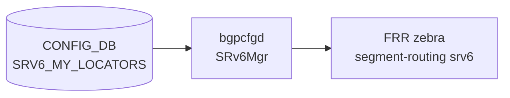

# SRV6_MY_LOCATORS テーブル

## 概要

`SRV6_MY_LOCATORS` は SRv6 ロケータを定義し、SID アドレス空間をブロック・ノード・ファンクション・アーギュメントの各ビット長に分割するテーブル[^1]。`bgpcfgd` の `SRv6Mgr` が CONFIG_DB を購読し、FRR (zebra) の `segment-routing srv6 locators` コマンドへ変換する[^2]。`SRV6_MY_SIDS` テーブルの各エントリは対応するロケータが先に存在していることを必要とする。

<!-- cdb-mermaid -->
### データフロー (自動生成)



!!! note "凡例"
    CONFIG_DB から FRR までの典型経路。詳細・例外は本ページ本文を参照。
<!-- /cdb-mermaid -->

## key 構造

```text
SRV6_MY_LOCATORS|<locator_name>
```

- `<locator_name>`: 任意の文字列（`SRV6_MY_SIDS` の `locator` フィールドから leafref 参照される）

## フィールド

| フィールド | 型 | YANG default | 説明 |
|-----------|----|-----------|----|
| `prefix` | IPv6 アドレス | **必須** (mandatory) | ロケータの IPv6 プレフィックス先頭アドレス。bgpcfgd が `block_len + node_len` ビット長を付加して `/N` を計算する |
| `block_len` | uint8 (1–128) | `32` | SRv6 ロケータブロック部のビット長 |
| `node_len` | uint8 (1–128) | `16` | SRv6 ロケータノード部のビット長 |
| `func_len` | uint8 (0–128) | `16` | SRv6 SID ファンクション部のビット長 |
| `arg_len` | uint8 (0–128) | `0` | SRv6 SID アーギュメント部のビット長 |
| `vrf` | string | `"default"` | VRF 名。bgpcfgd は現時点で FRR コマンドに反映しない（YANG default のみ） |

**YANG 制約**: `block_len + node_len + func_len + arg_len <= 128`

## 制約

- `prefix` は省略不可 (`mandatory true`)。bgpcfgd の `Locator` クラスは `data['prefix']` に直接アクセスするため、欠落時は `KeyError` で処理失敗。
- デフォルト値のみ使用時: ビット長合計は 32 + 16 + 16 + 0 = 64 ≤ 128 で YANG 制約を満たす。
- `SRV6_MY_SIDS` エントリの処理は、対応ロケータが先に `SRV6_MY_LOCATORS` に存在しない場合にペンディングされ、ロケータ登録後に自動再試行される。

## 購読者

- `bgpcfgd` (`SRv6Mgr`): CONFIG_DB `SRV6_MY_LOCATORS` を購読し、`segment-routing srv6 locators locator <name> prefix <p> block-len <b> node-len <n> func-bits <f>` コマンドを FRR へ投入。
- `frrcfgd` (`frrcfgd.py`): `SRV6_MY_LOCATORS` を zebra に転送する経路も存在する。

## 関連 CONFIG_DB / YANG / CLI

- 関連 [CONFIG_DB](../../reference/glossary.md#term-config_db): `SRV6_MY_SIDS`（ロケータを leafref 参照）
- 関連 [YANG](../../reference/glossary.md#term-yang): `sonic-srv6`
- 関連 CLI: なし（config_db.json または RESTCONF で投入）

<!-- defaults -->
## コード由来の暗黙デフォルト (Phase A)

> 根拠: `bgpcfgd/managers_srv6.py` L135-142 (Locator クラス) および `sonic-srv6.yang` L41-91 全行精読。
> evidence: `meta/_intermediate/cdb-flow/srv6-my-locators-defaults.md`

| フィールド | 省略時の実挙動 | 分類 |
|-----------|--------------|------|
| `prefix` | `data['prefix']` への直接アクセスで `KeyError` → bgpcfgd 処理失敗 | 必須欠落 (KeyError crash) |
| `block_len` | Python: `32` (in-data ガード)。YANG: `default 32` | code-fallback = YANG default (一致) |
| `node_len` | Python: `16` (in-data ガード)。YANG: `default 16` | code-fallback = YANG default (一致) |
| `func_len` | Python: `16` (in-data ガード)。YANG: `default 16` | code-fallback = YANG default (一致) |
| `arg_len` | Python: `0` (in-data ガード)。YANG: `default 0` | code-fallback = YANG default (一致) |
| `vrf` | YANG: `default "default"`。bgpcfgd の `Locator` クラスは `vrf` を読み取らず FRR コマンドに含めない | YANG-コード 乖離あり |

### prefix 自動拡張

`managers_srv6.py:142`:
```python
self.prefix = data['prefix'].lower() + "/{}".format(self.block_len + self.node_len)
```

デフォルト (`block_len=32`, `node_len=16`) 使用時は `/48` を自動付加。
例: `prefix: "fcbb:bbbb:20::"` → FRR コマンドでは `fcbb:bbbb:20::/48` として投入。

### vrf フィールドの乖離

`sonic-srv6.yang` は `vrf` に `default "default"` を定義するが、`bgpcfgd/managers_srv6.py` の `Locator` クラスは `vrf` を読み取らない。FRR の locator コマンド (`locator <name> prefix ... block-len ... node-len ... func-bits ... behavior usid`) に vrf オプションは含まれていない。`frrcfgd.py` 側の zebra 購読経路 (`SRV6_MY_LOCATORS: ['zebra']`) では vrf が反映される可能性があるが、`Locator` クラス経由では無効。

<!-- /defaults -->

## 引用元

[^1]: SRv6 YANG モデル: `sonic-srv6.yang`. <https://github.com/sonic-net/sonic-buildimage/blob/9ea932ec2e18f35e58268ec2e4456b1d4afd65cd/src/sonic-yang-models/yang-models/sonic-srv6.yang>
[^2]: SRv6 bgpcfgd マネージャ: `managers_srv6.py`. <https://github.com/sonic-net/sonic-buildimage/blob/9ea932ec2e18f35e58268ec2e4456b1d4afd65cd/src/sonic-bgpcfgd/bgpcfgd/managers_srv6.py>
