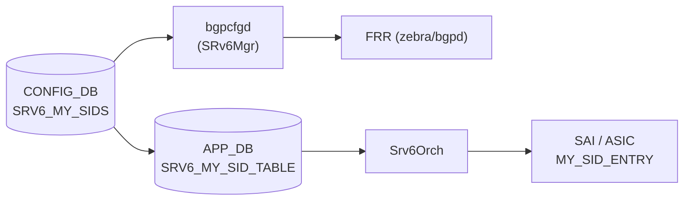

# SRV6_MY_SIDS テーブル

## 概要

ローカル SRv6 SID（Segment Identifier）エントリを保持する CONFIG_DB テーブル[^1]。
各エントリは IPv6 プレフィックスで表現される SID と、それに対応するエンドポイント動作（`uN` / `uDT46`）、
デカプセル化時の VRF、DSCP モードを定義する。

`bgpcfgd` の `SRv6Mgr` が本テーブルを監視し、FRR の `segment-routing srv6 static-sids` ブロックへ反映する。
SAI レイヤでは `sonic-swss` の `Srv6Orch` が `SRV6_MY_SID_TABLE`（APP_DB）を介して
`SAI_OBJECT_TYPE_MY_SID_ENTRY` を作成・更新する。

<!-- cdb-mermaid -->
### データフロー (自動生成)



!!! note "凡例"
    CONFIG_DB から SAI までの典型経路を示すミニ図。詳細・例外は本ページ本文を参照。
<!-- /cdb-mermaid -->

## key 構造

```text
SRV6_MY_SIDS|<locator_name>|<ip_prefix>
```

- `<locator_name>`: `SRV6_MY_LOCATORS` に登録済みのロケータ名
- `<ip_prefix>`: この SID を表す IPv6 プレフィックス（例: `FCBB:BBBB:20::/48`）

## フィールド一覧 (SRV6_MY_SIDS)

| フィールド | 型 | デフォルト | 説明 |
|-----------|----|-----------|------|
| `action` | enum (`uN` / `uDT46`) | **なし（必須）** | SRv6 エンドポイント動作。`uN`: Micro-SID prefix SID、`uDT46`: IPv4/IPv6 デカプセル後 VRF ルックアップ |
| `decap_vrf` | string (VRF 名 または `"default"`) | `"default"` | デカプセル化に使用する VRF 名。省略時は global routing table（default VRF）を使用 |
| `decap_dscp_mode` | enum (`uniform` / `pipe`) | **なし（SAI 依存）** | デカプセル後の DSCP 処理モード。省略時は SAI/プラットフォームのデフォルト動作に委ねる |

<!-- defaults -->
### コード由来のデフォルト（Phase A 解析）

| フィールド | YANG default | コード fallback | 実効デフォルト |
|-----------|-------------|----------------|--------------|
| `action` | なし（mandatory 未定義） | bgpcfgd が省略をエラー拒否 | **省略不可** |
| `decap_vrf` | `"default"` | `DEFAULT_VRF = "default"` (managers_srv6.py:150) | `"default"` (global VRF) |
| `decap_dscp_mode` | なし | `boost::none` — SAI 属性未設定 (srv6orch.cpp:383-386) | プラットフォーム依存（SAI デフォルト） |

**`action` の実質 mandatory 化**:
YANG (`sonic-srv6.yang:113-119`) は `mandatory` を宣言しないが、
`managers_srv6.py:78-83` で `'action' not in data` の場合 `log_err` を出力して `return False`
（エントリ処理を中断）するため、事実上必須フィールドとして扱われる。

**`decap_vrf` の二重保証**:
YANG は `default "default"` を明示 (`sonic-srv6.yang:131`)。
bgpcfgd 側も `data['decap_vrf'] if 'decap_vrf' in data else DEFAULT_VRF` で
Python レベルの fallback を持ち、完全に一致している。
`srv6orch.cpp:1484` では `dt_vrf == "default"` を `gVirtualRouterId` に解決する。

**`decap_dscp_mode` 未指定時の挙動**:
`srv6orch.cpp` の `addMySidCfgCacheEntry` で `boost::optional<sai_tunnel_dscp_mode_t> dscp_mode = boost::none`
に初期化し、フィールド未指定時はそのまま SAI に DSCP mode 属性を送らない。
SAI 実装の多くは `uniform` をデフォルトとするが SONiC コードではハードコードしていない。
<!-- /defaults -->

<!-- ordering -->
## 書込み順依存 (Phase B)

> evidence: `meta/_intermediate/cdb-flow/srv6-my-sids-ordering.md`

### SRV6_MY_LOCATORS が先行必須（bgpcfgd 経路）

`sids_set_handler()` (`managers_srv6.py:62-68`): 対応ロケータが `SRV6_MY_LOCATORS` に存在しない場合、
bgpcfgd は `deps` 購読を登録して `return False`（処理中断）する。
ロケータが登録されると `on_deps_change` コールバックで SID エントリが自動的に再処理される。
**エントリは失われないが、ロケータが登録されるまで FRR への通知が遅延する。**

### SID プレフィックスはロケータのサブネット内であること

`managers_srv6.py:71-75`: `locator_prefix.supernet_of(sid_prefix)` が false の場合は `log_err` を出力して恒久的に失敗する（自動再試行なし）。SID IPv6 プレフィックスが対応ロケータの `prefix + block_len + node_len` ビット範囲内にあることを確認してから投入すること。

### VRF が先行必須（`uDT4` / `uDT6` / `uDT46` 等 VRF 要求行動）

`createUpdateMysidEntry()` (`srv6orch.cpp:1484-1502`): `dt_vrf` が `"default"` 以外の場合、`m_vrfOrch->isVRFexists()` が false だとエラー終了（自動再試行なし）。カスタム VRF を使う場合は `VRF|<name>` を先に登録すること。

### Neighbor (Nexthop) が先行（`end.x` / `ua` 等 Adj 要求行動）

`createUpdateMysidEntry()` (`srv6orch.cpp:1511-1541`): nexthop が未解決の場合、エントリを `m_pendingSRv6MySIDEntries` に追加して保留する。Neighbor ADD イベント受信時 (`srv6orch.cpp:1224-1260`) に自動再インストールされるため、**設定は失われない**。

### SET 操作の推奨順序

```
SET SRV6_MY_LOCATORS|<locator_name>   prefix=... block_len=... node_len=... func_len=... arg_len=...
SET VRF|<vrf_name>   ...                          # カスタム VRF を使う場合のみ
SET SRV6_MY_SIDS|<locator_name>|<ip_prefix>   action=uN
SET SRV6_MY_SIDS|<locator_name>|<ip_prefix2>  action=uDT46 decap_vrf=<vrf_name>
```

### DEL 操作の安全順序

```
DEL SRV6_MY_SIDS|<locator_name>|<ip_prefix>   # SID エントリを先に削除
DEL SRV6_MY_LOCATORS|<locator_name>            # ロケータは後
```

`locators_del_handler()` (`managers_srv6.py:106-115`) はロケータ削除時に bgpcfgd の依存購読を解除するが、対応 SID エントリを自動削除しない。ロケータより先に SID を削除しないと孤立エントリが残る。

<!-- /ordering -->

<!-- cross-refs -->
## テーブル間参照 (Phase C)

> evidence: `meta/_intermediate/cdb-flow/srv6-my-sids-cross-refs.md`

### 読込み元テーブル（SRV6_MY_SIDS が依存するテーブル）

| 参照元フィールド | 参照先テーブル | チェック場所 | 動作 |
|----------------|--------------|------------|------|
| `locator_name`（key） | `SRV6_MY_LOCATORS` | `sonic-srv6.yang:108-110` (YANG leafref) | スキーマ検証で参照整合性を保証 |
| `locator_name`（key） | `SRV6_MY_LOCATORS` | `managers_srv6.py:62-68` (bgpcfgd) | ロケータ未存在時は依存購読を登録して処理を保留（自動再試行あり） |
| `locator_name`（key） | `SRV6_MY_LOCATORS` | `srv6orch.cpp:331-350` (Srv6Orch) | `getLocatorCfgFromDb()` でロケータの block_len/node_len/func_len/arg_len を取得し MY_SID エントリのビット長フィールドを決定 |
| `decap_vrf` | `VRF` | `sonic-srv6.yang:123-125` (YANG leafref) | スキーマ検証で参照整合性を保証 |
| `decap_vrf` | `VRF` (via VRFOrch) | `srv6orch.cpp:1488` (Srv6Orch) | `isVRFexists()` が false の場合はエラーで終了（自動再試行なし） |
| adj（`end.x`/`ua` 等） | `NEIGH_TABLE` (via NeighOrch) | `srv6orch.cpp:1524` (Srv6Orch) | 隣接未解決時は `m_pendingSRv6MySIDEntries` に保留し、隣接 ADD イベントで自動再インストール |

**`decap_vrf = "default"` の特例**:
`srv6orch.cpp:1484-1486` で `dt_vrf == "default"` の場合は `gVirtualRouterId`（グローバル VRF の SAI オブジェクト）に直接解決され、`VRF` テーブルへの実行時参照は発生しない。

### 書込み先・副作用テーブル

| 書込み先 | タイミング | 場所 |
|---------|----------|------|
| FRR `segment-routing srv6 static-sids` | SET/DEL 処理時 | `managers_srv6.py:88-94, 127-131` (bgpcfgd → vtysh) |
| `APP_SRV6_MY_SID_TABLE` (APP_DB) | Srv6Orch が APP_DB から読み取り SAI へ投入 | `srv6orch.cpp:104` (`m_mysidTable`) |
| `SAI_OBJECT_TYPE_MY_SID_ENTRY` | SET 処理完了時 | `srv6orch.cpp:1606` (`create_my_sid_entry`) |
| `SAI_OBJECT_TYPE_TUNNEL` + TERM_ENTRY | uDT46 等デカプセル動作時のみ | `srv6orch.cpp:1551-1576` (`createMySidIpInIpTunnel`) |
| `COUNTERS_SRV6_NAME_MAP` (COUNTERS_DB) | MySID 作成・削除時（カウンタ有効時のみ） | `srv6orch.cpp:199, 223` |
| CRM `CRM_SRV6_MY_SID_ENTRY` | MySID 作成（inc）・削除（dec）時 | `srv6orch.cpp:1612, 1675` |

### 参照カウント管理

SRV6_MY_SIDS のエントリが参照する外部リソースには refcount が付与される。DEL 操作前に参照側（SID）を先に削除することで、参照先リソースの誤削除を防ぐ。

- **VRFOrch refcount**: `srv6orch.cpp:1639` (SET時 inc) / `srv6orch.cpp:1683` (DEL時 dec)。refcount が正のうちは VRF の削除がブロックされる。
- **NeighOrch refcount**: `srv6orch.cpp:1644` (SET時 inc) / `srv6orch.cpp:1689` (DEL時 dec)。`end.x` / `ua` 等 nexthop を持つ action に限定。

### 逆参照（他テーブルから SRV6_MY_SIDS を参照するもの）

なし。SRV6_MY_SIDS は末端テーブルであり、他のテーブルから leafref 参照されない。

<!-- /cross-refs -->

<!-- failure -->
## 失敗挙動マトリクス (Phase D)

> evidence: `meta/_intermediate/cdb-flow/srv6-my-sids-failure.md`

### SET 処理における失敗経路

| 失敗条件 | 検出箇所 | 結果 | ログ | 自動回復 |
|---------|---------|------|------|---------|
| ロケータ名が `SRV6_MY_LOCATORS` に未存在 | `managers_srv6.py:62-69` | `return False`・依存購読登録 | `log_warn` | **あり**（ロケータ登録後に自動再試行） |
| SID プレフィックスがロケータのサブネット外 | `managers_srv6.py:74-76` | `return False`（恒久失敗） | `log_err` | **なし** |
| `action` フィールド未指定 | `managers_srv6.py:78-80` | `return False` | `log_err` | **なし** |
| `action` が `uN`/`uDT46` 以外の未サポート値（bgpcfgd） | `managers_srv6.py:82-84` | `return False` | `log_err` | **なし** |
| `action` が `end_behavior_map` に存在しない（Srv6Orch） | `srv6orch.cpp:1369-1376` | `return false`（MY_SID 未作成） | `SWSS_LOG_ERROR` | **なし** |
| `decap_vrf` が `"default"` 以外かつ VRF 未存在 | `srv6orch.cpp:1498-1502` | `return false`（MY_SID 未作成） | `SWSS_LOG_ERROR("VRF %s doesn't exist in DB")` | **なし** |
| `decap_vrf` の SAI OID が `SAI_NULL_OBJECT_ID` | `srv6orch.cpp:1492-1496` | `return false` | `SWSS_LOG_ERROR("VRF object not created for DT VRF %s")` | **なし** |
| nexthop（`end.x`/`ua` 等）が未解決 | `srv6orch.cpp:1524-1543` | `m_pendingSRv6MySIDEntries` に保留・`return false` | `SWSS_LOG_INFO` | **あり**（Neighbor ADD 時に自動再インストール） |
| ECMP adjacency（カンマ区切り複数 adj） | `srv6orch.cpp:1516-1519` | `return false`（未サポート） | `SWSS_LOG_ERROR("ECMP adjacency not yet supported")` | **なし** |
| `decap_dscp_mode` に `"uniform"`/`"pipe"` 以外の値 | `srv6orch.cpp:388-392` | キャッシュ登録スキップ | `SWSS_LOG_ERROR("Invalid MySID %s DSCP mode: %s")` | **なし** |
| IPinIP トンネル作成失敗（`uN`/`uDT46` + `decap_dscp_mode` 指定時） | `srv6orch.cpp:1554-1565` | `return false`（MY_SID 未作成） | `SWSS_LOG_ERROR("Failed to create … IPinIP tunnel")` | **なし** |
| SAI `create_my_sid_entry` 失敗 | `srv6orch.cpp:1607-1611` | `return false` | `SWSS_LOG_ERROR("Failed to create my_sid entry %s, rv %d")` | **なし** |
| SAI カウンタ作成失敗（カウンタ有効時） | `srv6orch.cpp:1595-1599` | `return false`（MY_SID 未作成） | `SWSS_LOG_ERROR("Failed to create SAI counter for SRv6 MySID entry")` | **なし** |

### DEL 処理における失敗経路

| 失敗条件 | 検出箇所 | 結果 | ログ |
|---------|---------|------|------|
| 存在しない SID の削除要求 | `srv6orch.cpp:1660-1663` | `return false` | `SWSS_LOG_ERROR("My_sid_entry doesn't exist for %s")` |
| SAI `remove_my_sid_entry` 失敗 | `srv6orch.cpp:1670-1673` | `return false`（ASIC に残存） | `SWSS_LOG_ERROR("Failed to delete my_sid entry rv %d")` |
| IPinIP Tunnel Term エントリ削除失敗 | `srv6orch.cpp:1698-1701` | `return false`（テーブル未消去） | `SWSS_LOG_ERROR("Failed to remove tunnel termination entry for MySID entry")` |
| bgpcfgd 側で未存在 SID の削除 | `managers_srv6.py:122-124` | silent skip | `log_warn` |

### 運用上の注意：孤立状態

- **ロケータより先に SID を削除しなかった場合**: `locators_del_handler()` はロケータ削除時に SID エントリを自動削除しない。SID が bgpcfgd キャッシュに残留し FRR 設定が不整合となる（`managers_srv6.py:106-115`）。
- **VRF 削除前に SID が残存する場合**: VRFOrch refcount が正のまま VRF 削除がブロックされる（`srv6orch.cpp:1639, 1683`）。
- **Neighbor 消失時の自動 ASIC 削除**: nexthop が消えると `updateNeighbor()` が MY_SID を ASIC から自動削除し `m_pendingSRv6MySIDEntries` に保留する（`srv6orch.cpp:1272-1342`）。Neighbor 再出現時に自動復元されるためユーザー介入は不要。

<!-- /failure -->

<!-- constants -->
## 定数・上限値 (Phase E)

> evidence: `meta/_intermediate/cdb-flow/srv6-my-sids-constants.md`

### コード埋め込み定数一覧

| 定数 | 値 | 場所 | 意味 |
|------|-----|------|------|
| `OVERLAY_RIF_DEFAULT_MTU` | `9100` | `srv6orch.cpp:20` | IPinIP トンネル用オーバーレイ RIF（ループバック型）の固定 MTU（バイト）。設定変更不可 |
| `LOCATOR_DEFAULT_BLOCK_LEN` | `"32"` | `srv6orch.cpp:21` | ロケータのブロック長デフォルト（ビット）。APPL_DB エントリのビット長未指定時に使用 |
| `LOCATOR_DEFAULT_NODE_LEN` | `"16"` | `srv6orch.cpp:22` | ロケータのノード長デフォルト（ビット） |
| `LOCATOR_DEFAULT_FUNC_LEN` | `"16"` | `srv6orch.cpp:23` | ロケータの関数長デフォルト（ビット） |
| `LOCATOR_DEFAULT_ARG_LEN` | `"0"` | `srv6orch.cpp:24` | ロケータの引数長デフォルト（ビット） |
| `SRV6_FLEX_COUNTER_UPDATE_TIMER` | `1` (秒) | `srv6orch.cpp:26` | FlexCounter タイマー間隔。カウンタ有効時の統計更新サイクル |
| `SRV6_STAT_COUNTER_POLLING_INTERVAL_MS` | `10000` (ms) | `srv6orch.cpp:27` | FlexCounter ポーリング間隔（10 秒固定） |
| `ADJ_DELIMITER` | `','` | `srv6orch.cpp:19` | adjacency フィールドの区切り文字。ECMP 未サポートのため複数指定は即エラー |
| `MY_SID_KEY_DELIMITER` | `':'` | `srv6orch.h:152` | MY_SID の SAI entry key 組み立て区切り文字（`block_len:node_len:func_len:arg_len:IPv6`） |
| `DEFAULT_VRF` | `"default"` | `managers_srv6.py:11` | `decap_vrf` フィールドの比較基準文字列 |
| `supported_SRv6_behaviors` | `{'uN', 'uDT46'}` | `managers_srv6.py:6-8` | bgpcfgd が受理する action 値集合。それ以外は `log_err` + `return False` |

### IPinIP トンネルのハードコード SAI 属性

`decap_dscp_mode` が設定された SID（`uN`/`uDT46` + DSCP mode 指定時）に作成される IPinIP トンネルは、以下の SAI 属性を固定値で設定する（`srv6orch.cpp:490-540`）:

| SAI 属性 | ハードコード値 | 設定変更可否 |
|---------|--------------|------------|
| `SAI_ROUTER_INTERFACE_ATTR_TYPE` | `SAI_ROUTER_INTERFACE_TYPE_LOOPBACK` | 不可 |
| `SAI_ROUTER_INTERFACE_ATTR_MTU` | `9100` | 不可（CONFIG_DB フィールドなし） |
| `SAI_TUNNEL_ATTR_TYPE` | `SAI_TUNNEL_TYPE_IPINIP` | 不可 |
| `SAI_TUNNEL_ATTR_PEER_MODE` | `SAI_TUNNEL_PEER_MODE_P2MP` | 不可 |
| `SAI_TUNNEL_ATTR_DECAP_TTL_MODE` | `SAI_TUNNEL_TTL_MODE_PIPE_MODEL` | **不可**（`decap_dscp_mode` と異なり TTL は設定フィールドなし） |
| `SAI_TUNNEL_ATTR_DECAP_DSCP_MODE` | `uniform` / `pipe`（設定値から決定） | `decap_dscp_mode` フィールドで制御可能 |

!!! warning "TTL モードは pipe 固定"
    `decap_dscp_mode` で DSCP は `uniform`/`pipe` を選択できるが、TTL は常に `PIPE_MODEL` にハードコードされている（`srv6orch.cpp:534-536`）。内部パケットの TTL が外側ヘッダへ伝播しない動作は変更不可。

### bgpcfgd と Srv6Orch の action 受理範囲の乖離

`end_behavior_map`（`srv6orch.cpp:41-62`）は 19 種の action を SAI にマップするが、CONFIG_DB 経由の bgpcfgd パスでは `supported_SRv6_behaviors = {'uN', 'uDT46'}` の 2 種のみが受理される。

| action | bgpcfgd | Srv6Orch (APPL_DB 直書き) |
|--------|---------|--------------------------|
| `uN` / `uDT46` | **受理** | 受理 |
| `end` / `end.x` / `end.t` / `end.dt4` 等 | **拒否**（`log_err` + `return False`） | 受理 |
| `ua` / `udx4` / `udx6` 等 | **拒否** | 受理 |

追加の action を使用する場合は fpmsyncd 等を通じた APPL_DB 直接書込みが必要であり、CONFIG_DB の `SRV6_MY_SIDS` テーブルからの設定では利用できない。

<!-- /constants -->

<!-- side-effects -->
## 副次 DB 書込 (Phase F)

> evidence: `meta/_intermediate/cdb-flow/srv6-my-sids-side-effects.md`

`SRV6_MY_SIDS` テーブルへの書込みは **bgpcfgd パス** と **Srv6Orch パス** の 2 経路で副次書込みを引き起こす。CONFIG_DB への書き戻しは発生しない。

### bgpcfgd パス（SRv6Mgr → FRR）

`SRv6Mgr::sids_set_handler()` (`managers_srv6.py:88-94`) は FRR への vtysh コマンドを `cfg_mgr.push_list()` に積む:

```
segment-routing
 srv6
  static-sids
   sid <ip_prefix> locator <locator_name> behavior <action> [vrf <decap_vrf>]
```

`decap_vrf` が `"default"` の場合 `vrf` オプションは省略される。
DEL 時は `sids_del_handler()` (`managers_srv6.py:127-131`) が `no sid ...` コマンドを発行する。

### Srv6Orch パス（APPL_DB 経由 → SAI / ASIC）

`Srv6Orch` は `APP_SRV6_MY_SID_TABLE`（APP_DB）をサブスクライブし、`createUpdateMysidEntry()` / `deleteMysidEntry()` で処理する。

#### SET 時の副次書込み

| 副次 DB / API | 操作 | 条件 | ソース |
|-------------|------|------|--------|
| SAI / `sai_srv6_api` | `create_my_sid_entry` | 新規エントリ | `srv6orch.cpp:1606` |
| SAI / `sai_srv6_api` | `set_my_sid_entry_attribute`（VRF / NH 更新） | フィールド変更時 | `srv6orch.cpp:1619, 1628` |
| SAI / `sai_router_intfs_api` | `create_router_interface`（loopback RIF, MTU=9100） | `decap_dscp_mode` 指定時のみ | `srv6orch.cpp:505` |
| SAI / `sai_tunnel_api` | `create_tunnel`（IPinIP）+ `create_tunnel_term_table_entry` | `decap_dscp_mode` 指定時のみ | `srv6orch.cpp:538, 1561` |
| CRM | `incCrmResUsedCounter(CRM_SRV6_MY_SID_ENTRY)` | 新規エントリ | `srv6orch.cpp:1612` |
| COUNTERS_DB / `COUNTERS_SRV6_NAME_MAP` | `hset("", sid_key, counter_oid)` | カウンタ有効時のみ | `srv6orch.cpp:199` |

IPinIP Tunnel SAI オブジェクトは `decap_dscp_mode` 値ごとに 1 つ共有（参照カウント管理）。新規 SID のたびに作成されない。

#### DEL 時の副次書込み

| 副次 DB / API | 操作 | 条件 | ソース |
|-------------|------|------|--------|
| SAI / `sai_srv6_api` | `remove_my_sid_entry` | 常時 | `srv6orch.cpp:1669` |
| CRM | `decCrmResUsedCounter(CRM_SRV6_MY_SID_ENTRY)` | 常時 | `srv6orch.cpp:1675` |
| COUNTERS_DB / `COUNTERS_SRV6_NAME_MAP` | `hdel("", sid_key)` | カウンタ有効時のみ | `srv6orch.cpp:223` |
| FLEX_COUNTER_DB | `clearCounterIdList(counter_oid)` | カウンタ有効かつ VID→RID 解決済み | `srv6orch.cpp:229` |
| SAI / `sai_tunnel_api` | `remove_tunnel_term_table_entry` + `remove_tunnel` | tunnel_term_entry が存在する場合 | `srv6orch.cpp:1698-1704` |
| VRFOrch / NeighOrch | refcount dec | VRF 要求 / Nexthop 要求 action の場合 | `srv6orch.cpp:1683, 1689` |

### in-memory 副作用

- `srv6_my_sid_table_[key]` — SET 時に内部キャッシュへ登録、DEL 時に `erase()` (`srv6orch.cpp:1652, 1711`)
- `m_pendingSRv6MySIDEntries` — nexthop 未解決時の保留リスト。Neighbor ADD イベント受信時に自動再インストール (`srv6orch.cpp:1224-1260`)

<!-- /side-effects -->

## 設定例

```json
{
    "SRV6_MY_SIDS": {
        "MAIN|FCBB:BBBB:20::/48": {
            "action": "uN"
        },
        "MAIN|FCBB:BBBB:20:F1::/64": {
            "action": "uDT46",
            "decap_vrf": "Vrf_Customer1",
            "decap_dscp_mode": "uniform"
        }
    }
}
```

## 依存関係

- `SRV6_MY_LOCATORS` に `<locator_name>` が先に存在していること。
  `managers_srv6.py:62-68` でロケータが未定義の場合、依存関係を登録して処理を保留する。
- `decap_vrf` に custom VRF を指定する場合は `VRF` テーブルに対象 VRF が存在していること（leafref 制約）。

## 関連テーブル

- `SRV6_MY_LOCATORS` — ロケータ定義（SID アドレス空間の分割）

[^1]: `sonic-buildimage/src/sonic-yang-models/yang-models/sonic-srv6.yang` (revision 2024-12-05) より。
