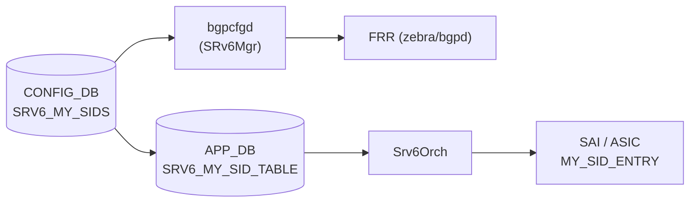

# SRV6_MY_SIDS テーブル

## 概要

ローカル SRv6 SID（Segment Identifier）エントリを保持する CONFIG_DB テーブル[^1]。
各エントリは IPv6 プレフィックスで表現される SID と、それに対応するエンドポイント動作（`uN` / `uDT46`）、
デカプセル化時の VRF、DSCP モードを定義する。

`bgpcfgd` の `SRv6Mgr` が本テーブルを監視し、FRR の `segment-routing srv6 static-sids` ブロックへ反映する。
SAI レイヤでは `sonic-swss` の `Srv6Orch` が `SRV6_MY_SID_TABLE`（APP_DB）を介して
`SAI_OBJECT_TYPE_MY_SID_ENTRY` を作成・更新する。

<!-- cdb-mermaid -->
### データフロー (自動生成)



!!! note "凡例"
    CONFIG_DB から SAI までの典型経路を示すミニ図。詳細・例外は本ページ本文を参照。
<!-- /cdb-mermaid -->

## key 構造

```text
SRV6_MY_SIDS|<locator_name>|<ip_prefix>
```

- `<locator_name>`: `SRV6_MY_LOCATORS` に登録済みのロケータ名
- `<ip_prefix>`: この SID を表す IPv6 プレフィックス（例: `FCBB:BBBB:20::/48`）

## フィールド一覧 (SRV6_MY_SIDS)

| フィールド | 型 | デフォルト | 説明 |
|-----------|----|-----------|------|
| `action` | enum (`uN` / `uDT46`) | **なし（必須）** | SRv6 エンドポイント動作。`uN`: Micro-SID prefix SID、`uDT46`: IPv4/IPv6 デカプセル後 VRF ルックアップ |
| `decap_vrf` | string (VRF 名 または `"default"`) | `"default"` | デカプセル化に使用する VRF 名。省略時は global routing table（default VRF）を使用 |
| `decap_dscp_mode` | enum (`uniform` / `pipe`) | **なし（SAI 依存）** | デカプセル後の DSCP 処理モード。省略時は SAI/プラットフォームのデフォルト動作に委ねる |

<!-- defaults -->
### コード由来のデフォルト（Phase A 解析）

| フィールド | YANG default | コード fallback | 実効デフォルト |
|-----------|-------------|----------------|--------------|
| `action` | なし（mandatory 未定義） | bgpcfgd が省略をエラー拒否 | **省略不可** |
| `decap_vrf` | `"default"` | `DEFAULT_VRF = "default"` (managers_srv6.py:150) | `"default"` (global VRF) |
| `decap_dscp_mode` | なし | `boost::none` — SAI 属性未設定 (srv6orch.cpp:383-386) | プラットフォーム依存（SAI デフォルト） |

**`action` の実質 mandatory 化**:
YANG (`sonic-srv6.yang:113-119`) は `mandatory` を宣言しないが、
`managers_srv6.py:78-83` で `'action' not in data` の場合 `log_err` を出力して `return False`
（エントリ処理を中断）するため、事実上必須フィールドとして扱われる。

**`decap_vrf` の二重保証**:
YANG は `default "default"` を明示 (`sonic-srv6.yang:131`)。
bgpcfgd 側も `data['decap_vrf'] if 'decap_vrf' in data else DEFAULT_VRF` で
Python レベルの fallback を持ち、完全に一致している。
`srv6orch.cpp:1484` では `dt_vrf == "default"` を `gVirtualRouterId` に解決する。

**`decap_dscp_mode` 未指定時の挙動**:
`srv6orch.cpp` の `addMySidCfgCacheEntry` で `boost::optional<sai_tunnel_dscp_mode_t> dscp_mode = boost::none`
に初期化し、フィールド未指定時はそのまま SAI に DSCP mode 属性を送らない。
SAI 実装の多くは `uniform` をデフォルトとするが SONiC コードではハードコードしていない。
<!-- /defaults -->

## 設定例

```json
{
    "SRV6_MY_SIDS": {
        "MAIN|FCBB:BBBB:20::/48": {
            "action": "uN"
        },
        "MAIN|FCBB:BBBB:20:F1::/64": {
            "action": "uDT46",
            "decap_vrf": "Vrf_Customer1",
            "decap_dscp_mode": "uniform"
        }
    }
}
```

## 依存関係

- `SRV6_MY_LOCATORS` に `<locator_name>` が先に存在していること。
  `managers_srv6.py:62-68` でロケータが未定義の場合、依存関係を登録して処理を保留する。
- `decap_vrf` に custom VRF を指定する場合は `VRF` テーブルに対象 VRF が存在していること（leafref 制約）。

## 関連テーブル

- `SRV6_MY_LOCATORS` — ロケータ定義（SID アドレス空間の分割）

[^1]: `sonic-buildimage/src/sonic-yang-models/yang-models/sonic-srv6.yang` (revision 2024-12-05) より。
