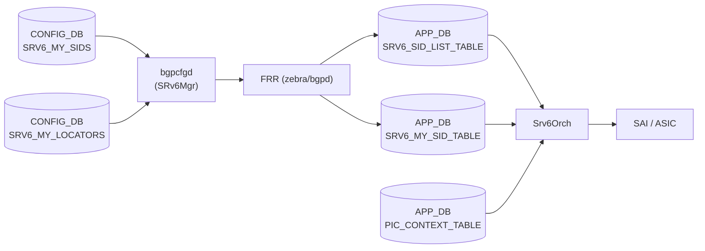

# Srv6Orch — APP_DB SRV6 テーブル

## 概要

`Srv6Orch`（`orchagent/srv6orch.cpp`）は SRv6 のデータプレーン制御を担う Orchestration Agent であり、
以下の 3 つの APP_DB テーブルを購読して SAI 呼び出しを実行する[^1]。

| テーブル名 (APP_DB) | 役割 |
|--------------------|------|
| `SRV6_SID_LIST_TABLE` | SRv6 セグメントリスト（SID リスト）の管理 |
| `SRV6_MY_SID_TABLE` | ローカル SRv6 SID エントリ（My SID）の管理 |
| `PIC_CONTEXT_TABLE` | SRv6 VPN PIC コンテキスト（prefix aggregation ID）の管理 |

なお、CONFIG_DB 側の `SRV6_MY_SIDS` / `SRV6_MY_LOCATORS` は bgpcfgd の `SRv6Mgr` が管理し、
APP_DB 経由または FRR 経由で Srv6Orch へ伝達される。

<!-- cdb-mermaid -->
### データフロー (自動生成)



!!! note "凡例"
    APP_DB テーブルへの書き込みは主に `fpmsyncd` 経由の FRR から行われる。
    `PIC_CONTEXT_TABLE` は ECMP 経路制御コンポーネントが直接書き込む。
<!-- /cdb-mermaid -->

---

## SRV6_SID_LIST_TABLE

### key 構造

```text
SRV6_SID_LIST_TABLE|<seg_name>
```

- `<seg_name>`: セグメントリストの識別名（任意の文字列）

### フィールド一覧

| フィールド | 型 | デフォルト | 説明 |
|-----------|----|-----------|------|
| `path` | string (カンマ区切り IPv6 アドレスリスト) | **なし（実質必須）** | SRv6 SID リスト。カンマ区切り複数 IPv6 アドレス。省略時は空リストで SAI 呼び出しをスキップ |
| `type` | enum | `encaps.red` | SID リストタイプ。有効値: `insert` / `insert.red` / `encaps` / `encaps.red` |

<!-- defaults -->
### コード由来のデフォルト（Phase A 解析）

> 根拠: `srv6orch.cpp` 行 73-79, 1079-1089, 1151-1162 の全行精読。
> evidence: `meta/_intermediate/cdb-flow/srv6-orch-defaults.md`

| フィールド | YANG default | コード fallback | 実効デフォルト |
|-----------|-------------|----------------|--------------|
| `path` | N/A (APP_DB) | 省略時 count=0 → スキップ | **省略不可**（SAI 呼び出し不発） |
| `type` | N/A | `SAI_SRV6_SIDLIST_TYPE_ENCAPS_RED` (`srv6orch.cpp:1083`) | `"encaps.red"` |

**`type` の fallback 挙動**:
`srv6orch.cpp:1080-1088` で `sidlist_type_map.find(sidlist_type) == sidlist_type_map.end()` の場合
（未指定または不正値を含む）、`SWSS_LOG_INFO("Use default sidlist type: ENCAPS_RED")` を出力し
`SAI_SRV6_SIDLIST_TYPE_ENCAPS_RED` を使用する。これはハードコードされた唯一の code-level default。
<!-- /defaults -->

---

## SRV6_MY_SID_TABLE

### key 構造

```text
SRV6_MY_SID_TABLE|<block_len>:<node_len>:<func_len>:<args_len>:<sid_ipv6_addr>
```

- `<block_len>`: ロケータブロック長（ビット）
- `<node_len>`: ロケータノード長（ビット）
- `<func_len>`: ファンクション長（ビット）
- `<args_len>`: アーギュメント長（ビット）
- `<sid_ipv6_addr>`: SID を表す IPv6 アドレス（例: `fc00:0:1:1::`）

キー例: `32:16:16:0:fc00:0:1:1::`

### フィールド一覧

| フィールド | 型 | デフォルト | 説明 |
|-----------|----|-----------|------|
| `action` | enum | **なし（必須）** | SRv6 エンドポイント動作（下表参照）。省略または不正値はエラー |
| `vrf` | string | `""` (action 依存) | デカプセル VRF 名。`"default"` で global VRF。VRF 不要な action では無視 |
| `adj` | string (カンマ区切り) | `""` (action 依存) | L3 Adjacency（nexthop アドレス）。nexthop 不要な action では無視 |

#### action 有効値と VRF/nexthop 要否

| `action` 値 | SAI 動作 | VRF 必要 | Nexthop (adj) 必要 |
|-------------|---------|---------|------------------|
| `end` | PSP/USD endpoint | いいえ | いいえ |
| `end.x` | L3 cross-connect | いいえ | **はい** |
| `end.t` | Table lookup | **はい** | いいえ |
| `end.dx4` | IPv4 decap + cross-connect | いいえ | **はい** |
| `end.dx6` | IPv6 decap + cross-connect | いいえ | **はい** |
| `end.dt4` | IPv4 decap + VRF lookup | **はい** | いいえ |
| `end.dt6` | IPv6 decap + VRF lookup | **はい** | いいえ |
| `end.dt46` | IPv4/6 decap + VRF lookup | **はい** | いいえ |
| `end.b6.encaps` | B6 encaps | いいえ | **はい** |
| `end.b6.encaps.red` | B6 encaps reduced | いいえ | **はい** |
| `end.b6.insert` | B6 insert | いいえ | **はい** |
| `end.b6.insert.red` | B6 insert reduced | いいえ | **はい** |
| `un` | Micro-SID uN | いいえ | いいえ |
| `ua` | Micro-SID uA | いいえ | **はい** |
| `udx4` / `udx6` | uDX (Micro-SID) | いいえ | **はい** |
| `udt4` / `udt6` / `udt46` | uDT (Micro-SID) | **はい** | いいえ |

<!-- defaults -->
### コード由来のデフォルト（Phase A 解析）

> 根拠: `srv6orch.cpp` 行 41-71, 1384-1430, 2204-2248 の全行精読。
> evidence: `meta/_intermediate/cdb-flow/srv6-orch-defaults.md`

| フィールド | YANG default | コード fallback | 実効デフォルト |
|-----------|-------------|----------------|--------------|
| `action` | N/A (APP_DB) | 省略・不正値 → エラー return | **省略不可** |
| `vrf` | N/A | `""` → action 不要時は無視。必要 action で空 → VRF 解決失敗 | action 依存（`"default"` を推奨） |
| `adj` | N/A | `""` → action 不要時は無視。必要 action で空 → pending 状態 | action 依存 |

**`end_flavor` の自動設定**:
`end` / `end.x` / `end.t` は `SAI_MY_SID_ENTRY_ENDPOINT_BEHAVIOR_FLAVOR_PSP_AND_USD`、
`un` は `SAI_MY_SID_ENTRY_ENDPOINT_BEHAVIOR_FLAVOR_NONE`、
`ua` は `SAI_MY_SID_ENTRY_ENDPOINT_BEHAVIOR_FLAVOR_PSP_AND_USD` と
`end_flavor_map` (`srv6orch.cpp:64-71`) で固定される。
その他の action は `end_flavor` を `FLAVOR_NONE` 相当で扱う。

**`adj` のペンディング機構**:
nexthop が未解決時、`m_pendingSRv6MySIDEntries` に保留し (`srv6orch.cpp:1532-1542`)、
NeighOrch から neighbor 追加通知を受けた際に自動で再インストールを試みる。

**`un` / `udt46` の IPinIP トンネル自動生成**:
`mySidTunnelRequired()` (`srv6orch.cpp:1417-1429`) により、`un` / `udt46` で
`decap_dscp_mode` が CONFIG_DB (`SRV6_MY_SIDS`) に設定されている場合のみ
IPinIP トンネル (`SAI_TUNNEL_TYPE_IPINIP`) を自動生成する。
DSCP mode 未設定時はトンネルを生成しない (`boost::none` 判定)。
<!-- /defaults -->

---

## PIC_CONTEXT_TABLE

### key 構造

```text
PIC_CONTEXT_TABLE|<context_id>
```

- `<context_id>`: PIC コンテキスト識別子（任意の文字列）

### フィールド一覧

| フィールド | 型 | デフォルト | 説明 |
|-----------|----|-----------|------|
| `nexthop` | string (カンマ区切り IPv6 アドレスリスト) | `""` (空) | SRv6 VPN の対向エンドポイント IP アドレスリスト |
| `vpn_sid` | string (カンマ区切り IPv6 アドレスリスト) | `""` (空) | 各エンドポイントに対応する VPN SID リスト |

<!-- defaults -->
### コード由来のデフォルト（Phase A 解析）

> 根拠: `srv6orch.cpp` 行 2272-2343 の全行精読。
> evidence: `meta/_intermediate/cdb-flow/srv6-orch-defaults.md`

| フィールド | YANG default | コード fallback | 実効デフォルト |
|-----------|-------------|----------------|--------------|
| `nexthop` | N/A (APP_DB) | 省略時は空ベクタ | 空（整合性エラーなし） |
| `vpn_sid` | N/A | 省略時は空ベクタ | 空（整合性エラーなし） |

**整合性チェック**:
`pci.nexthops.size() != pci.sids.size()` の場合 (`srv6orch.cpp:2298-2303`)、
`SWSS_LOG_ERROR` を出力して `task_failed` を返す。
エントリ数が一致しない `nexthop` / `vpn_sid` の組み合わせは受け付けない。

**参照カウント管理**:
`PIC_CONTEXT_TABLE` エントリは `routeorch` から `increasePicContextIdRefCount()` / `decreasePicContextIdRefCount()`
で参照カウントが管理される。ref_count > 0 の間は DEL 操作をリトライキューに保留する。

**`prefix_agg_id` の自動採番**:
VPN ごとに内部識別子 `prefix_agg_id` を `getAggId()` で採番 (`srv6orch.cpp:1715-1741`)。
初期値 1 から単調増加し、使用中の ID をスキップ。uint32_t オーバーフロー時は 1 に折り返す。
<!-- /defaults -->

---

## Overlay RIF と IPinIP トンネルのデフォルト

MySID の `un` / `udt46` で IPinIP トンネルを使用する際、内部で自動生成される SAI オブジェクトに
以下のハードコード値が使用される（`srv6orch.cpp:486-548`）:

| 属性 | 値 | 根拠 |
|------|----|------|
| Overlay RIF MTU | `9100` (`OVERLAY_RIF_DEFAULT_MTU`) | `srv6orch.cpp:20` |
| Tunnel type | `SAI_TUNNEL_TYPE_IPINIP` | `srv6orch.cpp:515` |
| Peer mode | `SAI_TUNNEL_PEER_MODE_P2MP` | `srv6orch.cpp:527` |
| Decap TTL mode | `SAI_TUNNEL_TTL_MODE_PIPE_MODEL` | `srv6orch.cpp:535` |
| Decap DSCP mode | CONFIG_DB の `decap_dscp_mode` 値 | `srv6orch.cpp:530-532` |

---

## 設定例

### SRV6_SID_LIST_TABLE エントリ（via fpmsyncd）

```json
{
    "SRV6_SID_LIST_TABLE": {
        "seg1": {
            "path": "fc00:0:1::/48,fc00:0:2::/48",
            "type": "encaps.red"
        }
    }
}
```

### SRV6_MY_SID_TABLE エントリ（via fpmsyncd）

```json
{
    "SRV6_MY_SID_TABLE": {
        "32:16:16:0:fc00:0:1:1::": {
            "action": "udt46",
            "vrf": "Vrf_Customer1"
        },
        "32:16:16:0:fc00:0:1:2::": {
            "action": "un"
        }
    }
}
```

---

<!-- side-effects -->
## 副次 DB 書込 (Phase F)

`SRV6_MY_SID_TABLE` の SET/DEL 処理後に `Srv6Orch` が書き込む副次テーブル一覧。
`SRV6_SID_LIST_TABLE` / `PIC_CONTEXT_TABLE` 処理ではカウンタ管理・CRM 更新は行われない。

> 詳細証跡: `meta/_intermediate/cdb-flow/srv6-side-effects.md`

| 副次 DB | テーブル / キー | 操作 | 主要フィールド | evidence |
|---------|----------------|------|---------------|----------|
| COUNTERS_DB | `COUNTERS_SRV6_NAME_MAP` | hset / hdel | `<sid_prefix>` → `counter_oid` | `srv6orch.cpp:199,223` |
| FLEX_COUNTER_DB | `SRV6_STAT_COUNTER:<oid>` | set / del | `SRV6_COUNTER_ID_LIST` = `SAI_COUNTER_STAT_PACKETS,SAI_COUNTER_STAT_BYTES` | `srv6orch.cpp:300,229` |
| ASIC_DB | `VIDTORID` | hget (読み取りのみ) | VID→RID 解決確認（gTraditionalFlexCounter 有効時のみ） | `srv6orch.cpp:294` |
| CRM (COUNTERS_DB) | `CRM_STATS` (CrmOrch 経由) | inc / dec | `CRM_SRV6_MY_SID_ENTRY` 使用カウンタ | `srv6orch.cpp:1612,1675` |

**COUNTERS_DB `COUNTERS_SRV6_NAME_MAP`**:
MY_SID 追加時に `addMySidCounter()` (`srv6orch.cpp:184-210`) が `m_mysid_counters_table->set("", fvs)` で書き込む。
hash フィールドは `getMySidCounterKey()` が返す SID プレフィックス文字列（例: `fc00:0:1:1::/64`）、値は SAI counter OID のシリアライズ文字列。
MY_SID 削除時は `removeMySidCounter()` が `m_mysid_counters_table->hdel("", key)` で削除。
**条件**: `getMySidCountersSupported()` かつ `getMySidCountersEnabled()` が両方 true の場合のみ。
起動時に `sai_query_attribute_capability()` (`srv6orch.cpp:147`) で SAI 能力を確認し、非対応プラットフォームでは全 counter 機能が無効化される。

**FLEX_COUNTER_DB `SRV6_STAT_COUNTER`**:
counter OID は一度 `m_pending_counters` に積まれ、`SRV6_FLEX_COUNTER_UPDATE_TIMER = 1` 秒タイマーが満了するたびに `doTask(SelectableTimer&)` を実行する。
`gTraditionalFlexCounter` 有効時は ASIC_DB `VIDTORID` で VID→RID 変換が確認できた OID のみ FLEX_COUNTER_DB に登録し、未解決分は次周期に持ち越す。`m_pending_counters` が空になるとタイマーは自動停止する。
グループ名: `SRV6_STAT_COUNTER` (`srv6orch.h:30`)、ポーリング間隔: 10 秒 (`srv6orch.cpp:27`)。

**CRM カウンタ**:
`sai_srv6_api->create_my_sid_entry()` 成功後に `gCrmOrch->incCrmResUsedCounter(CRM_SRV6_MY_SID_ENTRY)` (`srv6orch.cpp:1612`)、
`sai_srv6_api->remove_my_sid_entry()` 成功後に `decCrmResUsedCounter` (`srv6orch.cpp:1675`) を呼ぶ。
CrmOrch が定期的に COUNTERS_DB `CRM_STATS` テーブルへ書き出す（書き出し責務は `crmorch.cpp` 側）。
<!-- /side-effects -->

---

## 依存関係

- **SRV6_MY_SID_TABLE** の `vrf` フィールドに custom VRF を指定する場合は、
  VRF テーブルが先に存在している必要がある（`m_vrfOrch->isVRFexists()` チェック）。
- **SRV6_MY_SID_TABLE** の `adj` フィールドは NeighOrch が解決する。
  Neighbor 未解決時はエントリをペンディングし、neighbor ADD 通知で自動再試行。
- **SRV6_SID_LIST_TABLE** エントリは `SRV6_MY_SID_TABLE` の nexthop 作成時に参照される
  (`srv6_segment_id` の解決）。

## 関連テーブル

- `SRV6_MY_SIDS` (CONFIG_DB) — SRv6 SID の設定源
- `SRV6_MY_LOCATORS` (CONFIG_DB) — SRv6 ロケータ設定
- `VRF` (CONFIG_DB) — VRF 定義

[^1]: `sonic-swss/orchagent/srv6orch.cpp` (revision 4305596156d70e9797e8a881b3d19b46de0bce0d) より。
