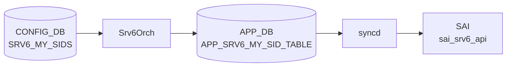

# Srv6Orch — APP_DB SRV6 テーブル

## 概要

`Srv6Orch`（`orchagent/srv6orch.cpp`）は [SRv6](../../reference/glossary.md#term-srv6) のデータプレーン制御を担う Orchestration Agent であり、
以下の 3 つの APP_DB テーブルを購読して [SAI](../../reference/glossary.md#term-sai) 呼び出しを実行する[^1]。

| テーブル名 (APP_DB) | 役割 |
|--------------------|------|
| `SRV6_SID_LIST_TABLE` | [SRv6](../../reference/glossary.md#term-srv6) セグメントリスト（SID リスト）の管理 |
| `SRV6_MY_SID_TABLE` | ローカル [SRv6](../../reference/glossary.md#term-srv6) SID エントリ（My SID）の管理 |
| `PIC_CONTEXT_TABLE` | SRv6 VPN PIC コンテキスト（prefix aggregation ID）の管理 |

なお、[CONFIG_DB](../../reference/glossary.md#term-config_db) 側の `SRV6_MY_SIDS` / `SRV6_MY_LOCATORS` は [bgpcfgd](../../reference/glossary.md#term-bgpcfgd) の `SRv6Mgr` が管理し、
APP_DB 経由または [FRR](../../reference/glossary.md#term-frr) 経由で Srv6Orch へ伝達される。

<!-- cdb-mermaid -->
### データフロー (自動生成)



!!! note "凡例"
    CONFIG_DB から SAI までの典型経路を `docs/reference/config-db-orch-map.md` から機械生成したミニ図。詳細・例外は本ページ本文と対応表を参照。
<!-- /cdb-mermaid -->

<!-- pubsub -->
## 通信メカニズム（Phase G 解析）

> 根拠: `routesync.cpp` 155-164, 1389, 1424, 1562, 1667, 3389, 3441 / `orchdaemon.cpp` 312-324 / `srv6orch.cpp` 98-140, 2352-2386 / `srv6orch.h` 238-242 / `managers_srv6.py` 14-133 の全行精読。
> evidence: `meta/_intermediate/cdb-flow/srv6-pubsub.md`

### 全体データフロー

SRv6 の設定は [CONFIG_DB](../../reference/glossary.md#term-config_db) から [SAI](../../reference/glossary.md#term-sai) まで以下の **非同期パイプライン** を通じて伝達される。
[Redis](../../reference/glossary.md#term-redis) の `ProducerStateTable` / `ConsumerStateTable` は APP_DB 区間のみで使用され、
他の区間は [vtysh](../../reference/glossary.md#term-vtysh) CLI または [FPM](../../reference/glossary.md#term-fpm) TCP ソケットで繋がれる。

```
CONFIG_DB (SRV6_MY_SIDS / SRV6_MY_LOCATORS)
  ↓ Redis keyspace notification (dbId=4)
bgpcfgd — SRv6Mgr (managers_srv6.py)
  ↓ vtysh cfg_mgr.push_list() (TCP, 非 Redis)
FRR zebra / bgpd
  ↓ FPM TCP (port 2620, netlink エンコード, 非 Redis)
fpmsyncd — RouteSync (routesync.cpp)
  ↓ ProducerStateTable + RedisPipeline → APP_DB
    SRV6_SID_LIST_TABLE / SRV6_MY_SID_TABLE / PIC_CONTEXT_TABLE
  ↓ ConsumerStateTable (TableConnector)
Srv6Orch (srv6orch.cpp)
  ↓ SAI C++ API
ASIC
```

### CONFIG_DB → bgpcfgd (SRv6Mgr)

`bgpcfgd` の `SRv6Mgr` は `Manager` 基底クラスを継承し、
`directory.subscribe()` が内部で [CONFIG_DB](../../reference/glossary.md#term-config_db) (dbId=4) の [Redis](../../reference/glossary.md#term-redis) **keyspace notification**
(`PSUBSCRIBE __keyspace@4__:SRV6_MY_SIDS|*` 等) を購読する。

| CONFIG_DB テーブル | コールバック | 処理内容 |
|-------------------|-------------|---------|
| `SRV6_MY_LOCATORS` | `locators_set_handler()` | ロケータ情報をキャッシュし `cfg_mgr.push_list(["segment-routing","srv6","locators",...])` |
| `SRV6_MY_SIDS` | `sids_set_handler()` | ロケータ依存解決後に `cfg_mgr.push_list(["segment-routing","srv6","static-sids",...])` |

- `SRV6_MY_SIDS` エントリは参照するロケータ名 (`SRV6_MY_LOCATORS`) が未到達の場合、
  `directory.subscribe()` でロケータ到着を待ちペンディングする（`managers_srv6.py:62-68`）。
- `cfg_mgr.push_list()` は [vtysh](../../reference/glossary.md#term-vtysh) TCP ソケット経由で [FRR](../../reference/glossary.md#term-frr) bgpd へコマンドを送信する。
  [Redis](../../reference/glossary.md#term-redis) channel は介在しない。

### fpmsyncd → APP_DB (ProducerStateTable)

`RouteSync` クラス (`routesync.cpp`) が [FPM](../../reference/glossary.md#term-fpm) インタフェース（TCP port 2620）経由で
[FRR](../../reference/glossary.md#term-frr) [zebra](../../reference/glossary.md#term-zebra) からのネットリンクメッセージを受信し、APP_DB に `ProducerStateTable` で書き込む。

```cpp
// routesync.cpp:163-164, 159
m_srv6MySidTable(pipeline, APP_SRV6_MY_SID_TABLE_NAME, true),  // "SRV6_MY_SID_TABLE"
m_srv6SidListTable(pipeline, APP_SRV6_SID_LIST_TABLE_NAME, true), // "SRV6_SID_LIST_TABLE"
m_pic_context_groupTable(pipeline, APP_PIC_CONTEXT_TABLE_NAME, true), // "PIC_CONTEXT_TABLE"
```

| APP_DB テーブル | 書き込み操作 | routesync.cpp 行 |
|----------------|------------|-----------------|
| `SRV6_SID_LIST_TABLE` | `m_srv6SidListTable.set()` / `.del()` | 1424 / 1389 |
| `SRV6_MY_SID_TABLE` | `m_srv6MySidTable.set()` / `.del()` | 1667 / 1562 |
| `PIC_CONTEXT_TABLE` | `m_pic_context_groupTable.set()` / `.del()` | 3441 / 3389 |

- `RedisPipeline` でバッチ書き込み。フラッシュ間隔は `gFlushTimeout` で制御。
- Route テーブルと異なり SRv6 テーブルは ZMQ バイパスなし（pipeline 直接書き込み）。

### APP_DB → Srv6Orch (ConsumerStateTable)

`orchdaemon.cpp:312-324` で `TableConnector` を 4 テーブル分設定し、
`Orch(tables)` コンストラクタへ渡すことで `ConsumerStateTable` + `Executor` が自動生成される。

| テーブル | DB | channel (Redis key pattern) |
|---------|----|-----------------------------|
| `SRV6_SID_LIST_TABLE` | APP_DB (dbId=0) | `_QUEUEEVENTS` keyspace 通知 |
| `SRV6_MY_SID_TABLE` | APP_DB (dbId=0) | 同上 |
| `PIC_CONTEXT_TABLE` | APP_DB (dbId=0) | 同上 |
| `SRV6_MY_SIDS` | CONFIG_DB (dbId=4) | 同上 |

`Srv6Orch::doTask(Consumer &consumer)` (`srv6orch.cpp:2352`) がテーブル名で分岐し、
各 `doTaskXxx()` ハンドラへディスパッチする。

```cpp
// srv6orch.cpp:2362-2386
if      (table_name == APP_SRV6_SID_LIST_TABLE_NAME)  doTaskSidTable(t);
else if (table_name == APP_SRV6_MY_SID_TABLE_NAME)    doTaskMySidTable(t);
else if (table_name == APP_PIC_CONTEXT_TABLE_NAME)     doTaskPicContextTable(t);
else if (table_name == CFG_SRV6_MY_SID_TABLE_NAME)    doTaskCfgMySidTable(t);
```

`SelectableTimer` ベースの `doTask()` (`srv6orch.cpp:286`) も存在し、
`PIC_CONTEXT_TABLE` の参照カウント待ちリトライキューを定期処理する。

### ProducerStateTable メンバ（書き込み専用）

`srv6orch.h:238-240` の以下メンバは [SAI](../../reference/glossary.md#term-sai) 処理結果を APP_DB へ書き戻す目的で宣言されている。
[ConsumerStateTable](../../reference/glossary.md#term-consumerstatetable) としての購読とは別チャネルであり、二重登録ではない。

| メンバ | 書き込み先 |
|--------|-----------|
| `m_sidTable` | `SRV6_SID_LIST_TABLE` |
| `m_mysidTable` | `SRV6_MY_SID_TABLE` |
| `m_piccontextTable` | `PIC_CONTEXT_TABLE` |

### NotificationProducer / SubscriberStateTable 非使用確認

- `SRV6_MY_SIDS` / `SRV6_MY_LOCATORS` に対して [orchagent](../../reference/glossary.md#term-orchagent) が `SubscriberStateTable` を直接使う箇所はなし。
- `NotificationProducer` で SRv6 関連の通知を発行する箇所はソース全体になし。
- [STATE_DB](../../reference/glossary.md#term-state_db) への書き戻しは Srv6Orch 自体が行わず、SAI/[ASIC](../../reference/glossary.md#term-asic) 層で完結する。
<!-- /pubsub -->

---

## SRV6_SID_LIST_TABLE

### key 構造

```text
SRV6_SID_LIST_TABLE|<seg_name>
```

- `<seg_name>`: セグメントリストの識別名（任意の文字列）

### フィールド一覧

| フィールド | 型 | デフォルト | 説明 |
|-----------|----|-----------|------|
| `path` | string (カンマ区切り IPv6 アドレスリスト) | **なし（実質必須）** | SRv6 SID リスト。カンマ区切り複数 IPv6 アドレス。省略時は空リストで SAI 呼び出しをスキップ |
| `type` | enum | `encaps.red` | SID リストタイプ。有効値: `insert` / `insert.red` / `encaps` / `encaps.red` |

<!-- defaults -->
### コード由来のデフォルト（Phase A 解析）

> 根拠: `srv6orch.cpp` 行 73-79, 1079-1089, 1151-1162 の全行精読。
> evidence: `meta/_intermediate/cdb-flow/srv6-orch-defaults.md`

| フィールド | [YANG](../../reference/glossary.md#term-yang) default | コード fallback | 実効デフォルト |
|-----------|-------------|----------------|--------------|
| `path` | N/A (APP_DB) | 省略時 count=0 → スキップ | **省略不可**（SAI 呼び出し不発） |
| `type` | N/A | `SAI_SRV6_SIDLIST_TYPE_ENCAPS_RED` (`srv6orch.cpp:1083`) | `"encaps.red"` |

**`type` の fallback 挙動**:
`srv6orch.cpp:1080-1088` で `sidlist_type_map.find(sidlist_type) == sidlist_type_map.end()` の場合
（未指定または不正値を含む）、`SWSS_LOG_INFO("Use default sidlist type: ENCAPS_RED")` を出力し
`SAI_SRV6_SIDLIST_TYPE_ENCAPS_RED` を使用する。これはハードコードされた唯一の code-level default。
<!-- /defaults -->

---

## SRV6_MY_SID_TABLE

### key 構造

```text
SRV6_MY_SID_TABLE|<block_len>:<node_len>:<func_len>:<args_len>:<sid_ipv6_addr>
```

- `<block_len>`: ロケータブロック長（ビット）
- `<node_len>`: ロケータノード長（ビット）
- `<func_len>`: ファンクション長（ビット）
- `<args_len>`: アーギュメント長（ビット）
- `<sid_ipv6_addr>`: SID を表す IPv6 アドレス（例: `fc00:0:1:1::`）

キー例: `32:16:16:0:fc00:0:1:1::`

### フィールド一覧

| フィールド | 型 | デフォルト | 説明 |
|-----------|----|-----------|------|
| `action` | enum | **なし（必須）** | SRv6 エンドポイント動作（下表参照）。省略または不正値はエラー |
| `vrf` | string | `""` (action 依存) | デカプセル [VRF](../../reference/glossary.md#term-vrf) 名。`"default"` で global [VRF](../../reference/glossary.md#term-vrf)。[VRF](../../reference/glossary.md#term-vrf) 不要な action では無視 |
| `adj` | string (カンマ区切り) | `""` (action 依存) | L3 Adjacency（nexthop アドレス）。nexthop 不要な action では無視 |

#### action 有効値と VRF/nexthop 要否

| `action` 値 | SAI 動作 | VRF 必要 | Nexthop (adj) 必要 |
|-------------|---------|---------|------------------|
| `end` | PSP/USD endpoint | いいえ | いいえ |
| `end.x` | L3 cross-connect | いいえ | **はい** |
| `end.t` | Table lookup | **はい** | いいえ |
| `end.dx4` | IPv4 decap + cross-connect | いいえ | **はい** |
| `end.dx6` | IPv6 decap + cross-connect | いいえ | **はい** |
| `end.dt4` | IPv4 decap + VRF lookup | **はい** | いいえ |
| `end.dt6` | IPv6 decap + VRF lookup | **はい** | いいえ |
| `end.dt46` | IPv4/6 decap + VRF lookup | **はい** | いいえ |
| `end.b6.encaps` | B6 encaps | いいえ | **はい** |
| `end.b6.encaps.red` | B6 encaps reduced | いいえ | **はい** |
| `end.b6.insert` | B6 insert | いいえ | **はい** |
| `end.b6.insert.red` | B6 insert reduced | いいえ | **はい** |
| `un` | Micro-SID uN | いいえ | いいえ |
| `ua` | Micro-SID uA | いいえ | **はい** |
| `udx4` / `udx6` | uDX (Micro-SID) | いいえ | **はい** |
| `udt4` / `udt6` / `udt46` | uDT (Micro-SID) | **はい** | いいえ |

<!-- defaults -->
### コード由来のデフォルト（Phase A 解析）

> 根拠: `srv6orch.cpp` 行 41-71, 1384-1430, 2204-2248 の全行精読。
> evidence: `meta/_intermediate/cdb-flow/srv6-orch-defaults.md`

| フィールド | [YANG](../../reference/glossary.md#term-yang) default | コード fallback | 実効デフォルト |
|-----------|-------------|----------------|--------------|
| `action` | N/A (APP_DB) | 省略・不正値 → エラー return | **省略不可** |
| `vrf` | N/A | `""` → action 不要時は無視。必要 action で空 → VRF 解決失敗 | action 依存（`"default"` を推奨） |
| `adj` | N/A | `""` → action 不要時は無視。必要 action で空 → pending 状態 | action 依存 |

**`end_flavor` の自動設定**:
`end` / `end.x` / `end.t` は `SAI_MY_SID_ENTRY_ENDPOINT_BEHAVIOR_FLAVOR_PSP_AND_USD`、
`un` は `SAI_MY_SID_ENTRY_ENDPOINT_BEHAVIOR_FLAVOR_NONE`、
`ua` は `SAI_MY_SID_ENTRY_ENDPOINT_BEHAVIOR_FLAVOR_PSP_AND_USD` と
`end_flavor_map` (`srv6orch.cpp:64-71`) で固定される。
その他の action は `end_flavor` を `FLAVOR_NONE` 相当で扱う。

**`adj` のペンディング機構**:
nexthop が未解決時、`m_pendingSRv6MySIDEntries` に保留し (`srv6orch.cpp:1532-1542`)、
NeighOrch から neighbor 追加通知を受けた際に自動で再インストールを試みる。

**`un` / `udt46` の [IPinIP](../../reference/glossary.md#term-ipinip) トンネル自動生成**:
`mySidTunnelRequired()` (`srv6orch.cpp:1417-1429`) により、`un` / `udt46` で
`decap_dscp_mode` が CONFIG_DB (`SRV6_MY_SIDS`) に設定されている場合のみ
[IPinIP](../../reference/glossary.md#term-ipinip) トンネル (`SAI_TUNNEL_TYPE_IPINIP`) を自動生成する。
[DSCP](../../reference/glossary.md#term-dscp) mode 未設定時はトンネルを生成しない (`boost::none` 判定)。
<!-- /defaults -->

---

## PIC_CONTEXT_TABLE

### key 構造

```text
PIC_CONTEXT_TABLE|<context_id>
```

- `<context_id>`: PIC コンテキスト識別子（任意の文字列）

### フィールド一覧

| フィールド | 型 | デフォルト | 説明 |
|-----------|----|-----------|------|
| `nexthop` | string (カンマ区切り IPv6 アドレスリスト) | `""` (空) | SRv6 VPN の対向エンドポイント IP アドレスリスト |
| `vpn_sid` | string (カンマ区切り IPv6 アドレスリスト) | `""` (空) | 各エンドポイントに対応する VPN SID リスト |

<!-- defaults -->
### コード由来のデフォルト（Phase A 解析）

> 根拠: `srv6orch.cpp` 行 2272-2343 の全行精読。
> evidence: `meta/_intermediate/cdb-flow/srv6-orch-defaults.md`

| フィールド | [YANG](../../reference/glossary.md#term-yang) default | コード fallback | 実効デフォルト |
|-----------|-------------|----------------|--------------|
| `nexthop` | N/A (APP_DB) | 省略時は空ベクタ | 空（整合性エラーなし） |
| `vpn_sid` | N/A | 省略時は空ベクタ | 空（整合性エラーなし） |

**整合性チェック**:
`pci.nexthops.size() != pci.sids.size()` の場合 (`srv6orch.cpp:2298-2303`)、
`SWSS_LOG_ERROR` を出力して `task_failed` を返す。
エントリ数が一致しない `nexthop` / `vpn_sid` の組み合わせは受け付けない。

**参照カウント管理**:
`PIC_CONTEXT_TABLE` エントリは `routeorch` から `increasePicContextIdRefCount()` / `decreasePicContextIdRefCount()`
で参照カウントが管理される。ref_count > 0 の間は DEL 操作をリトライキューに保留する。

**`prefix_agg_id` の自動採番**:
VPN ごとに内部識別子 `prefix_agg_id` を `getAggId()` で採番 (`srv6orch.cpp:1715-1741`)。
初期値 1 から単調増加し、使用中の ID をスキップ。uint32_t オーバーフロー時は 1 に折り返す。
<!-- /defaults -->

---

## Overlay RIF と IPinIP トンネルのデフォルト

MySID の `un` / `udt46` で [IPinIP](../../reference/glossary.md#term-ipinip) トンネルを使用する際、内部で自動生成される SAI オブジェクトに
以下のハードコード値が使用される（`srv6orch.cpp:486-548`）:

| 属性 | 値 | 根拠 |
|------|----|------|
| Overlay [RIF](../../reference/glossary.md#term-rif) MTU | `9100` (`OVERLAY_RIF_DEFAULT_MTU`) | `srv6orch.cpp:20` |
| Tunnel type | `SAI_TUNNEL_TYPE_IPINIP` | `srv6orch.cpp:515` |
| Peer mode | `SAI_TUNNEL_PEER_MODE_P2MP` | `srv6orch.cpp:527` |
| Decap TTL mode | `SAI_TUNNEL_TTL_MODE_PIPE_MODEL` | `srv6orch.cpp:535` |
| Decap [DSCP](../../reference/glossary.md#term-dscp) mode | CONFIG_DB の `decap_dscp_mode` 値 | `srv6orch.cpp:530-532` |

<!-- ordering -->
## 処理順序と依存関係（Phase B 解析）

> 根拠: `srv6orch.cpp` 行 1119–1143, 1384–1543, 2272–2342, `managers_srv6.py` 行 56–115 の全行精読。
> evidence: `meta/_intermediate/cdb-flow/srv6-ordering.md`

### 投入（SET）推奨順序

```
1. VRF テーブル            ← end.t / end.dt* / udt* で decap_vrf に custom VRF を使う場合
2. SRV6_MY_LOCATORS         ← bgpcfgd が FRR へ locator prefix を通知
3. SRV6_SID_LIST_TABLE      ← fpmsyncd / FRR 経由で SID リストを APP_DB に書き込み
4. SRV6_MY_SIDS             ← bgpcfgd がロケータ確認後に FRR へ static-sids を反映
5. SRV6_MY_SID_TABLE        ← Srv6Orch が VRF・Nexthop 確認後に SAI MY_SID_ENTRY を投入
6. PIC_CONTEXT_TABLE        ← VPN 経路が確立した後に PIC コンテキストを登録
```

### 削除（DEL）推奨順序

```
1. PIC_CONTEXT_TABLE 参照ルート  ← ref_count を 0 に下げる
2. PIC_CONTEXT_TABLE エントリ   ← ref_count == 0 でないと task_need_retry (srv6orch.cpp:2328)
3. SRV6_MY_SID_TABLE エントリ   ← SID リストへの nexthop 参照を先に解除
4. SRV6_SID_LIST_TABLE エントリ  ← nexthops.size() > 0 なら task_need_retry (srv6orch.cpp:1133)
5. SRV6_MY_SIDS                 ← FRR 側 SID 削除 (static-sids no コマンド)
6. SRV6_MY_LOCATORS             ← FRR 側ロケータ削除 (SID を先に削除してから)
```

### 各テーブルのペンディング・ブロック機構

| テーブル | 条件 | 挙動 |
|---------|------|------|
| `SRV6_MY_SIDS` ([bgpcfgd](../../reference/glossary.md#term-bgpcfgd) 経由) | ロケータが `SRV6_MY_LOCATORS` に未登録 | `deps` サブスクリプションで保留、ロケータ登録後に自動再試行 (`managers_srv6.py:62–68`) |
| `SRV6_MY_SID_TABLE` (VRF 系 action) | `m_vrfOrch->isVRFexists()` が false | 即時失敗（`return false`）、ペンディング機構なし (`srv6orch.cpp:1500`) |
| `SRV6_MY_SID_TABLE` (nexthop 系 action) | `m_neighOrch->hasNextHop()` が false | `m_pendingSRv6MySIDEntries` に登録、neighbor ADD 通知で自動再インストール (`srv6orch.cpp:1532–1542`) |
| `SRV6_SID_LIST_TABLE` DEL | `nexthops.size() > 0` | `task_need_retry`（参照 nexthop が残っている間はリトライ） |
| `PIC_CONTEXT_TABLE` DEL | `ref_count > 0` | `task_need_retry`（RouteOrch が参照を解放するまで） |

### IPinIP トンネル自動生成の条件

`un` / `udt46` アクションで IPinIP トンネルを自動生成するには、CONFIG_DB `SRV6_MY_SIDS` の
`decap_dscp_mode` が設定されている必要がある（`mySidTunnelRequired()` の `dscp_mode.has_value()` 判定）。
`decap_dscp_mode` 未設定時はトンネルを生成せず、Overlay [RIF](../../reference/glossary.md#term-rif) も作成されない。

### Warm-reboot 非対応

`srv6orch.cpp` / `srv6orch.h` に `WarmStart` / reconcil 実装は存在しない。
warm-reboot 後は swss 再起動時に APP_DB から全エントリを再読み込みして SAI を再プログラムする
（cold-recovery 相当）。FRR (`bgpcfgd`) 側も warm-reboot ガードを持たないため、
**warm-reboot 中は SRv6 フォワーディングが一時的に停止する**点に注意すること。
<!-- /ordering -->

<!-- cross-refs -->
## テーブル間暗黙参照（Phase C 解析）

> 根拠: `srv6orch.cpp` 行 98–117, 331–397, 430–480, 871–924, 1129–1132, 1197–1248, 1484–1542, 1639, 1683, 1644, 1689, 1815–1833, 2312, 2384 の全行精読。
> evidence: `meta/_intermediate/cdb-flow/srv6-orch-cross-refs.md`

### SRV6_MY_SID_TABLE が参照する外部テーブル・Orch

| 参照先 | DB | 参照方向 | 条件 | ブロッキング挙動 |
|--------|----|---------|----|----------------|
| `VRF` | CONFIG_DB | 存在確認 + OID + refcount | `action` が `end.t` / `end.dt*` / `udt*` かつ custom VRF 指定時 | `isVRFexists()` false → 即時失敗（ペンディングなし） |
| `NeighOrch` (NEIGH_TABLE) | — | 存在確認 + OID + refcount + notify | `action` が `end.x` / `end.dx*` / `udx*` / `end.b6.*` / `ua` かつ `adj` 指定時 | `hasNextHop()` false → `m_pendingSRv6MySIDEntries` に保留、neighbor ADD 通知で自動再インストール |
| `SRV6_MY_LOCATORS` | CONFIG_DB | 読み取り（block/node/func 長） | `action` が `un` / `udt46` かつ IPinIP トンネル生成時 | ロケータ不在 → `return false`（ペンディングなし） |
| `SRV6_MY_SIDS` | CONFIG_DB | 読み取り（`decap_dscp_mode`）+ keyspace 通知 | `action` が `un` / `udt46` かつ IPinIP トンネル生成時 | `decap_dscp_mode` 未設定 → トンネル生成スキップ（`mySidTunnelRequired()` が false） |

**VRF 参照の詳細**:

`srv6orch.cpp:1488–1491` で `m_vrfOrch->isVRFexists(dt_vrf)` → `getVRFid(dt_vrf)` の順に確認する。
`isVRFexists()` が true でも SAI OID が null の場合（VrfOrch 初期化中）は別エラーで `return false`。
登録成功時に `increaseVrfRefCount()`、MySID 削除時に `decreaseVrfRefCount()` を呼ぶ。
VRF 欠如は再試行キューに入らないため、VRF を先に作成してから SRV6_MY_SID_TABLE を投入すること。

**NeighOrch 参照の詳細**:

`Srv6Orch` は起動時に `m_neighOrch->attach(this)` でオブザーバ登録し、
neighbor 変化（ADD / DEL）を `updateNeighbor(NeighborUpdate&)` で受け取る。

- **neighbor ADD**: `m_pendingSRv6MySIDEntries` を走査し、解決できる MySID エントリを
  `createUpdateMysidEntry()` で再インストール試行する（`srv6orch.cpp:1212–1248`）。
- **neighbor DEL**: 対象 nexthop を使用するインストール済み SID を [ASIC](../../reference/glossary.md#term-asic) から削除し
  pending に差し戻す（`srv6orch.cpp:1197–1210`）。
- [ECMP](../../reference/glossary.md#term-ecmp) adj（カンマ区切り複数アドレス）は `"ECMP adjacency not yet supported"` エラーで全拒否
  （`srv6orch.cpp:1516–1519`）。全プラットフォーム共通の実装制限。

**CONFIG_DB 直接読み取りの詳細**:

`SRV6_MY_LOCATORS` は `m_locatorCfgTable`、`SRV6_MY_SIDS` は `m_mysidCfgTable` で
起動時に CONFIG_DB (dbId=4) へ直接接続する（`srv6orch.cpp:106–107`）。
[DSCP](../../reference/glossary.md#term-dscp) mode は `doTaskCfgMySidTable()` が keyspace 通知を受け取るたびにキャッシュを更新し、
`getMySidEntryDscpMode()` がキャッシュから解決する（逆引きロケータ照合を含む）。

### SRV6_SID_LIST_TABLE — nexthop 参照カウント

`SRV6_MY_SID_TABLE` の nexthop 系エントリが SID リスト名を参照すると、
`sid_table_[srv6_segment].nexthops` セットに nexthop が追加される（`srv6orch.cpp:875`）。
SRV6_SID_LIST_TABLE への DEL 操作は `nexthops.size() > 0` の間 `task_need_retry` となり、
参照中の MySID エントリが先に削除されるまでブロックされる（`srv6orch.cpp:1129–1132`）。

### PIC_CONTEXT_TABLE — RouteOrch との双方向連携

| 操作 | RouteOrch との連携 | evidence |
|------|--------------------|---------|
| SET 完了後 | `notifyRetry(gRouteOrch, APP_ROUTE_TABLE_NAME, RETRY_CST_PIC)` でルート再試行を起動 | `srv6orch.cpp:2312` |
| DEL（ref_count > 0） | `addToRetry(APP_PIC_CONTEXT_TABLE_NAME, RETRY_CST_PIC_REF)` → ref_count が 0 になるまで保留 | `srv6orch.cpp:2323` |
| ref_count 減算後（0 到達） | `notifyRetry(this, APP_PIC_CONTEXT_TABLE_NAME, RETRY_CST_PIC_REF)` で自動再実行 | `srv6orch.cpp:1833` |

RouteOrch は `increasePicContextIdRefCount()` / `decreasePicContextIdRefCount()` を呼び出して
PIC エントリの参照カウントを管理する。ref_count > 0 の間は RouteOrch がまだ経路を参照中であり、
DEL を強制すると転送テーブルの不整合が生じるため、自動的に保留される。

### 参照関係サマリ

```
SRV6_MY_SID_TABLE (APP_DB)
  ├─ [暗黙] VRF (CONFIG_DB)                    DT 系 action — 存在確認+OID+refcount（欠如→即時失敗）
  ├─ [暗黙] NeighOrch (NEIGH_TABLE)            nexthop 系 action — hasNextHop+OID+refcount+notify
  │                                              （欠如→m_pendingSRv6MySIDEntries に保留、自動再試行）
  ├─ [暗黙] SRV6_MY_LOCATORS (CONFIG_DB)       un/udt46 の IPinIP tunnel — locator block/node/func 長取得
  └─ [暗黙] SRV6_MY_SIDS (CONFIG_DB)           un/udt46 の IPinIP tunnel — decap_dscp_mode 取得+通知

SRV6_SID_LIST_TABLE (APP_DB)
  └─ [暗黙] SRV6_MY_SID_TABLE (APP_DB)         nexthop 参照カウント — DEL は参照中 MySID が先行必須

PIC_CONTEXT_TABLE (APP_DB)
  └─ [暗黙] RouteOrch / APP_ROUTE_TABLE        SET 後 route 再試行通知 + DEL の ref_count ガード
```
<!-- /cross-refs -->

---

## 設定例

### SRV6_SID_LIST_TABLE エントリ（via fpmsyncd）

```json
{
    "SRV6_SID_LIST_TABLE": {
        "seg1": {
            "path": "fc00:0:1::/48,fc00:0:2::/48",
            "type": "encaps.red"
        }
    }
}
```

### SRV6_MY_SID_TABLE エントリ（via fpmsyncd）

```json
{
    "SRV6_MY_SID_TABLE": {
        "32:16:16:0:fc00:0:1:1::": {
            "action": "udt46",
            "vrf": "Vrf_Customer1"
        },
        "32:16:16:0:fc00:0:1:2::": {
            "action": "un"
        }
    }
}
```

---

<!-- side-effects -->
## 副次 DB 書込 (Phase F)

`SRV6_MY_SID_TABLE` の SET/DEL 処理後に `Srv6Orch` が書き込む副次テーブル一覧。
`SRV6_SID_LIST_TABLE` / `PIC_CONTEXT_TABLE` 処理ではカウンタ管理・[CRM](../../reference/glossary.md#term-crm) 更新は行われない。

> 詳細証跡: `meta/_intermediate/cdb-flow/srv6-side-effects.md`

| 副次 DB | テーブル / キー | 操作 | 主要フィールド | evidence |
|---------|----------------|------|---------------|----------|
| [COUNTERS_DB](../../reference/glossary.md#term-counters_db) | `COUNTERS_SRV6_NAME_MAP` | hset / hdel | `<sid_prefix>` → `counter_oid` | `srv6orch.cpp:199,223` |
| [FLEX_COUNTER_DB](../../reference/glossary.md#term-flex_counter_db) | `SRV6_STAT_COUNTER:<oid>` | set / del | `SRV6_COUNTER_ID_LIST` = `SAI_COUNTER_STAT_PACKETS,SAI_COUNTER_STAT_BYTES` | `srv6orch.cpp:300,229` |
| [ASIC_DB](../../reference/glossary.md#term-asic_db) | `VIDTORID` | hget (読み取りのみ) | VID→RID 解決確認（gTraditionalFlexCounter 有効時のみ） | `srv6orch.cpp:294` |
| [CRM](../../reference/glossary.md#term-crm) ([COUNTERS_DB](../../reference/glossary.md#term-counters_db)) | `CRM_STATS` (CrmOrch 経由) | inc / dec | `CRM_SRV6_MY_SID_ENTRY` 使用カウンタ | `srv6orch.cpp:1612,1675` |

**[COUNTERS_DB](../../reference/glossary.md#term-counters_db) `COUNTERS_SRV6_NAME_MAP`**:
MY_SID 追加時に `addMySidCounter()` (`srv6orch.cpp:184-210`) が `m_mysid_counters_table->set("", fvs)` で書き込む。
hash フィールドは `getMySidCounterKey()` が返す SID プレフィックス文字列（例: `fc00:0:1:1::/64`）、値は SAI counter OID のシリアライズ文字列。
MY_SID 削除時は `removeMySidCounter()` が `m_mysid_counters_table->hdel("", key)` で削除。
**条件**: `getMySidCountersSupported()` かつ `getMySidCountersEnabled()` が両方 true の場合のみ。
起動時に `sai_query_attribute_capability()` (`srv6orch.cpp:147`) で SAI 能力を確認し、非対応プラットフォームでは全 counter 機能が無効化される。

**[FLEX_COUNTER_DB](../../reference/glossary.md#term-flex_counter_db) `SRV6_STAT_COUNTER`**:
counter OID は一度 `m_pending_counters` に積まれ、`SRV6_FLEX_COUNTER_UPDATE_TIMER = 1` 秒タイマーが満了するたびに `doTask(SelectableTimer&)` を実行する。
`gTraditionalFlexCounter` 有効時は [ASIC_DB](../../reference/glossary.md#term-asic_db) `VIDTORID` で VID→RID 変換が確認できた OID のみ [FLEX_COUNTER_DB](../../reference/glossary.md#term-flex_counter_db) に登録し、未解決分は次周期に持ち越す。`m_pending_counters` が空になるとタイマーは自動停止する。
グループ名: `SRV6_STAT_COUNTER` (`srv6orch.h:30`)、ポーリング間隔: 10 秒 (`srv6orch.cpp:27`)。

**[CRM](../../reference/glossary.md#term-crm) カウンタ**:
`sai_srv6_api->create_my_sid_entry()` 成功後に `gCrmOrch->incCrmResUsedCounter(CRM_SRV6_MY_SID_ENTRY)` (`srv6orch.cpp:1612`)、
`sai_srv6_api->remove_my_sid_entry()` 成功後に `decCrmResUsedCounter` (`srv6orch.cpp:1675`) を呼ぶ。
CrmOrch が定期的に COUNTERS_DB `CRM_STATS` テーブルへ書き出す（書き出し責務は `crmorch.cpp` 側）。
<!-- /side-effects -->

---

<!-- failure -->
## 失敗挙動・エラーハンドリング

> 根拠: `srv6orch.cpp` 全体の SWSS_LOG_ERROR / task_process_status 精読。
> evidence: `meta/_intermediate/cdb-flow/srv6-failure.md`

### SRV6_SID_LIST_TABLE の失敗ケース

| 条件 | ログ / 挙動 | task_status |
|------|------------|-------------|
| `path` が空（セグメント 0 件） | `SWSS_LOG_ERROR("segment list count is zero, skip")` → SAI 未呼び出しで `return true` | `task_success`（SAI 登録なし） |
| SAI `create_srv6_sidlist` 失敗 | `SWSS_LOG_ERROR("Failed to create srv6 sidlist object, rv %d")` | `task_failed` |
| SAI `set_srv6_sidlist_attribute` 失敗 | `SWSS_LOG_ERROR("Failed to set srv6 sidlist object with new segments, rv %d")` | `task_failed` |
| DEL: 存在しない `seg_name` | `SWSS_LOG_ERROR("segment name %s doesn't exist")` | `task_failed` |
| DEL: nexthop 参照中（refcount > 0） | `SWSS_LOG_NOTICE("referenced by other nexthops: count %zu, not deleting")` | `task_need_retry`（再キュー） |
| DEL: SAI `remove_srv6_sidlist` 失敗 | `SWSS_LOG_ERROR("Failed to delete SRV6 sidlist object for %s")` | `task_failed` |

### SRV6_MY_SID_TABLE の失敗ケース

| 条件 | ログ / 挙動 | 備考 |
|------|------------|------|
| 不正な `action` 値 | `SWSS_LOG_ERROR("Invalid my_sid action %s")` → `return false` | エントリは SAI 未登録 |
| VRF が CONFIG_DB に存在しない（DT 系） | `SWSS_LOG_ERROR("VRF %s doesn't exist in DB")` → `return false` | VRF を先に作成する必要あり |
| VRF が DB に存在するが SAI OID が null | `SWSS_LOG_ERROR("VRF object not created for DT VRF %s")` → `return false` | VRF Orch の初期化待ち |
| [ECMP](../../reference/glossary.md#term-ecmp) adjacency（`adj` にカンマ区切り複数指定） | `SWSS_LOG_ERROR("ECMP adjacency not yet supported")` → `return false` | 現行実装では単一 adj のみ対応 |
| `adj` が NeighOrch に未解決 | `m_pendingSRv6MySIDEntries` に保留 → `return false` | neighbor ADD で自動再インストール |
| IPinIP トンネル作成失敗（`un`/`udt46`） | `SWSS_LOG_ERROR("Failed to create MySID IPinIP tunnel: %d")` → ロールバック後 `return false` | tunnel term entry 失敗時も `removeMySidIpInIpTunnel()` を呼び部分ロールバック |
| ロケータが CONFIG_DB に存在しない | `SWSS_LOG_ERROR("Failed to get the SRv6 locator %s - not present in the CONFIG_DB")` | IPinIP tunnel DSCP 解決不可 |
| 不正な `decap_dscp_mode` 文字列 | `SWSS_LOG_ERROR("Invalid MySID %s DSCP mode: %s")` → キャッシュ未登録で早期 return | CONFIG_DB `SRV6_MY_SIDS` 側の設定ミス |
| SAI `create_my_sid_entry` 失敗 | `SWSS_LOG_ERROR("Failed to create my_sid entry %s, rv %d")` → `return false` | SAI / プラットフォーム起因エラー |
| SAI カウンタ作成失敗 | `SWSS_LOG_ERROR("Failed to create SAI counter for SRv6 MySID entry")` → `return false` | SID エントリ全体の作成を中断 |
| DEL: エントリが存在しない | `SWSS_LOG_ERROR("My_sid_entry doesn't exist for %s")` → `return false` | 二重削除防止 |

**Neighbor pending 機構の詳細**:

1. `adj` に指定された nexthop が NeighOrch に未解決の場合、エントリを `m_pendingSRv6MySIDEntries` に保留する（`srv6orch.cpp:1532-1542`）。
2. NeighOrch から neighbor ADD 通知が届いた時点で `updateNeighbor()` が `createUpdateMysidEntry()` を再呼び出しする（`srv6orch.cpp:1236-1248`）。
3. 再インストールも失敗した場合はエントリを pending に残したまま `continue`（ループ継続）。
4. neighbor DELETE 通知時は、インストール済み SID を [ASIC](../../reference/glossary.md#term-asic) から削除して pending に戻す（`srv6orch.cpp:1197-1210`）。

### PIC_CONTEXT_TABLE の失敗ケース

| 条件 | ログ / 挙動 | task_status |
|------|------------|-------------|
| SET: 既存エントリへの上書き試行 | `SWSS_LOG_ERROR("update is not allowed for pic context table")` | `task_duplicated`（PIC は不変） |
| `nexthop` と `vpn_sid` の件数不一致 | `SWSS_LOG_ERROR("inconsistent number of endpoints(%zu) and vpn sids(%zu)")` | `task_failed`（再試行なし） |
| VPN 作成失敗（P2P トンネル未確立等） | `SWSS_LOG_ERROR("Failed to create SRv6 VPNs for context id %s")` | `task_need_retry` |
| DEL: `ref_count` > 0（routeorch 参照中） | `addToRetry()` でリトライキューへ保留 | `task_need_retry`（ref 解放後に自動再実行） |
| DEL: VPN 削除失敗 | `SWSS_LOG_ERROR("Failed to delete SRv6 VPNs for context id %s")` | `task_need_retry` |

**`task_process_status` の doTask() マッピング**（`srv6orch.cpp:2352-2394`）:

- `task_need_retry` → イテレータを進めて次のイベントループで再処理（エントリは m_toSync に残留）
- `task_failed` / `task_success` / `task_duplicated` / `task_ignore` → m_toSync から削除（失敗はログのみ）

### SAI エラー伝播パターン

`sai_srv6_api->*` の戻り値（`sai_status_t`）を直接チェックし、`SAI_STATUS_SUCCESS` 以外は
`SWSS_LOG_ERROR` に `rv %d` 形式で SAI ステータスコードを記録して `return false` を返す。
複合オブジェクト（IPinIP トンネル + tunnel term entry）の途中失敗時のロールバックは
`createMySidIpInIpTunnelTermEntry` 失敗時のみ実装されており（`srv6orch.cpp:1564`）、
それ以外のケースでは作成済み SAI オブジェクトの自動クリーンアップは行われない。
<!-- /failure -->

## 依存関係

- **SRV6_MY_SID_TABLE** の `vrf` フィールドに custom VRF を指定する場合は、
  VRF テーブルが先に存在している必要がある（`m_vrfOrch->isVRFexists()` チェック）。
- **SRV6_MY_SID_TABLE** の `adj` フィールドは NeighOrch が解決する。
  Neighbor 未解決時はエントリをペンディングし、neighbor ADD 通知で自動再試行。
- **SRV6_SID_LIST_TABLE** エントリは `SRV6_MY_SID_TABLE` の nexthop 作成時に参照される
  (`srv6_segment_id` の解決）。

## 関連テーブル

- `SRV6_MY_SIDS` (CONFIG_DB) — SRv6 SID の設定源
- `SRV6_MY_LOCATORS` (CONFIG_DB) — SRv6 ロケータ設定
- `VRF` (CONFIG_DB) — VRF 定義

<!-- constants -->
## ハードコード定数 (Phase E)

ソース: `sonic-swss/orchagent/srv6orch.cpp`、`sonic-swss/orchagent/srv6orch.h`

### マクロ定義

| 定数名 | 値 | 用途 |
|--------|-----|------|
| `ADJ_DELIMITER` | `','` | `adj` フィールドの複数 nexthop 区切り文字 |
| `OVERLAY_RIF_DEFAULT_MTU` | `9100` | IpInIp Decap 用オーバーレイ [RIF](../../reference/glossary.md#term-rif) の MTU (bytes) |
| `LOCATOR_DEFAULT_BLOCK_LEN` | `"32"` | ロケータ block 長のデフォルト値 (bits) |
| `LOCATOR_DEFAULT_NODE_LEN` | `"16"` | ロケータ node 長のデフォルト値 (bits) |
| `LOCATOR_DEFAULT_FUNC_LEN` | `"16"` | ロケータ function 長のデフォルト値 (bits) |
| `LOCATOR_DEFAULT_ARG_LEN` | `"0"` | ロケータ argument 長のデフォルト値 (bits) |
| `SRV6_FLEX_COUNTER_UPDATE_TIMER` | `1` (秒) | Flex counter 更新タイマー周期 |
| `SRV6_STAT_COUNTER_POLLING_INTERVAL_MS` | `10000` (ms) | カウンタポーリング間隔 |
| `SRV6_STAT_COUNTER_FLEX_COUNTER_GROUP` | `"SRV6_STAT_COUNTER"` | Flex counter グループ名 |
| `COUNTERS_SRV6_NAME_MAP` | `"COUNTERS_SRV6_NAME_MAP"` | COUNTERS_DB 上の SRv6 名前マップキー |

### エンドポイント動作 (action) — SAI enum マッピング

`end_behavior_map` (`srv6orch.cpp` 行 41–61):

| action 文字列 | SAI エンドポイント動作 enum |
|--------------|--------------------------|
| `end` | `SAI_MY_SID_ENTRY_ENDPOINT_BEHAVIOR_E` |
| `end.x` | `SAI_MY_SID_ENTRY_ENDPOINT_BEHAVIOR_X` |
| `end.t` | `SAI_MY_SID_ENTRY_ENDPOINT_BEHAVIOR_T` |
| `end.dx6` | `SAI_MY_SID_ENTRY_ENDPOINT_BEHAVIOR_DX6` |
| `end.dx4` | `SAI_MY_SID_ENTRY_ENDPOINT_BEHAVIOR_DX4` |
| `end.dt4` | `SAI_MY_SID_ENTRY_ENDPOINT_BEHAVIOR_DT4` |
| `end.dt6` | `SAI_MY_SID_ENTRY_ENDPOINT_BEHAVIOR_DT6` |
| `end.dt46` | `SAI_MY_SID_ENTRY_ENDPOINT_BEHAVIOR_DT46` |
| `end.b6.encaps` | `SAI_MY_SID_ENTRY_ENDPOINT_BEHAVIOR_B6_ENCAPS` |
| `end.b6.encaps.red` | `SAI_MY_SID_ENTRY_ENDPOINT_BEHAVIOR_B6_ENCAPS_RED` |
| `end.b6.insert` | `SAI_MY_SID_ENTRY_ENDPOINT_BEHAVIOR_B6_INSERT` |
| `end.b6.insert.red` | `SAI_MY_SID_ENTRY_ENDPOINT_BEHAVIOR_B6_INSERT_RED` |
| `udx6` | `SAI_MY_SID_ENTRY_ENDPOINT_BEHAVIOR_UDX6` |
| `udx4` | `SAI_MY_SID_ENTRY_ENDPOINT_BEHAVIOR_UDX4` |
| `udt6` | `SAI_MY_SID_ENTRY_ENDPOINT_BEHAVIOR_UDT6` |
| `udt4` | `SAI_MY_SID_ENTRY_ENDPOINT_BEHAVIOR_UDT4` |
| `udt46` | `SAI_MY_SID_ENTRY_ENDPOINT_BEHAVIOR_UDT46` |
| `un` | `SAI_MY_SID_ENTRY_ENDPOINT_BEHAVIOR_UN` |
| `ua` | `SAI_MY_SID_ENTRY_ENDPOINT_BEHAVIOR_UA` |

### エンドポイント flavor — SAI enum マッピング

`end_flavor_map` (`srv6orch.cpp` 行 64–70):

| action 文字列 | SAI flavor enum |
|--------------|----------------|
| `end`, `end.x`, `end.t`, `ua` | `SAI_MY_SID_ENTRY_ENDPOINT_BEHAVIOR_FLAVOR_PSP_AND_USD` |
| `un` | `SAI_MY_SID_ENTRY_ENDPOINT_BEHAVIOR_FLAVOR_NONE` |
| 上記以外 | `SAI_MY_SID_ENTRY_ENDPOINT_BEHAVIOR_FLAVOR_NONE` (デフォルト初期値) |

### SID リスト種別 (type) — SAI enum マッピング

`sidlist_type_map` (`srv6orch.cpp` 行 73–78):

| type 文字列 | SAI sidlist type enum | フォールバック |
|------------|----------------------|--------------|
| `insert` | `SAI_SRV6_SIDLIST_TYPE_INSERT` | — |
| `insert.red` | `SAI_SRV6_SIDLIST_TYPE_INSERT_RED` | — |
| `encaps` | `SAI_SRV6_SIDLIST_TYPE_ENCAPS` | — |
| `encaps.red` | `SAI_SRV6_SIDLIST_TYPE_ENCAPS_RED` | — |
| 不明・未指定 | `SAI_SRV6_SIDLIST_TYPE_ENCAPS_RED` | 行 1083 参照 |

### アクション別必須リソース分岐

| 判定関数 | `true` となるアクション |
|----------|----------------------|
| `mySidVrfRequired()` | `end.t`, `end.dt4`, `end.dt6`, `end.dt46`, `udt4`, `udt6`, `udt46` |
| `mySidNextHopRequired()` | `end.x`, `end.dx4`, `end.dx6`, `udx4`, `udx6`, `end.b6.encaps`, `end.b6.encaps.red`, `end.b6.insert`, `end.b6.insert.red`, `ua` |
| `mySidTunnelRequired()` | `un` と `udt46` を除くすべての `u*` 系アクション |

### SAI 属性一覧

| SAI 属性 | 固定値 / 用途 |
|---------|--------------|
| `SAI_MY_SID_ENTRY_ATTR_ENDPOINT_BEHAVIOR` | エンドポイント動作種別 |
| `SAI_MY_SID_ENTRY_ATTR_ENDPOINT_BEHAVIOR_FLAVOR` | PSP/USD flavor |
| `SAI_MY_SID_ENTRY_ATTR_VRF` | VRF OID |
| `SAI_MY_SID_ENTRY_ATTR_NEXT_HOP_ID` | nexthop OID |
| `SAI_MY_SID_ENTRY_ATTR_TUNNEL_ID` | IpInIp tunnel OID |
| `SAI_MY_SID_ENTRY_ATTR_COUNTER_ID` | Flex counter OID（オプション） |
| `SAI_SRV6_SIDLIST_ATTR_TYPE` | SID リスト種別 |
| `SAI_SRV6_SIDLIST_ATTR_SEGMENT_LIST` | IPv6 SID 配列 |
| `SAI_NEXT_HOP_ATTR_TYPE` | `SAI_NEXT_HOP_TYPE_SRV6_SIDLIST` (固定) |
| `SAI_NEXT_HOP_ATTR_SRV6_SIDLIST_ID` | SID リスト OID |
| `SAI_NEXT_HOP_ATTR_TUNNEL_ID` | SRv6 トンネル OID |
| `SAI_TUNNEL_ATTR_TYPE` (SRv6 Encap) | `SAI_TUNNEL_TYPE_SRV6` (固定) |
| `SAI_TUNNEL_ATTR_PEER_MODE` (SRv6) | `SAI_TUNNEL_PEER_MODE_P2MP` (固定) |
| `SAI_TUNNEL_ATTR_TYPE` (IpInIp Decap) | `SAI_TUNNEL_TYPE_IPINIP` (固定) |
| `SAI_TUNNEL_ATTR_DECAP_TTL_MODE` | `SAI_TUNNEL_TTL_MODE_PIPE_MODEL` (固定) |
| `SAI_TUNNEL_ATTR_DECAP_DSCP_MODE` | DSCP mode 設定値依存 (`UNIFORM_MODEL` / `PIPE_MODEL`) |
| `SAI_ROUTER_INTERFACE_ATTR_TYPE` | `SAI_ROUTER_INTERFACE_TYPE_LOOPBACK` (固定) |
| `SAI_ROUTER_INTERFACE_ATTR_MTU` | `9100` (`OVERLAY_RIF_DEFAULT_MTU`) |
<!-- /constants -->

<!-- platform -->
## プラットフォーム差分 (Phase H)

> 根拠: `srv6orch.cpp` (rev 4305596156d70e9797e8a881b3d19b46de0bce0d) 全行精読、`sonic-sairedis/syncd/VendorSai.cpp`、`sonic-sairedis/vslib/vpp/SwitchVppSRv6.cpp`、[SONiC](../../reference/glossary.md#term-sonic) [HLD](../../reference/glossary.md#term-hld) `doc/srv6/srv6_hld.md`、`SRv6_uSID.md`、`srv6_sid_l3adj.md`。
> evidence: `meta/_intermediate/cdb-flow/srv6-platform.md`

### SAI capability — MySID カウンタ非対応 ASIC

`Srv6Orch::initializeCounters()`（`srv6orch.cpp:120-142`）は起動時に
`sai_query_attribute_capability(gSwitchId, SAI_OBJECT_TYPE_MY_SID_ENTRY, SAI_MY_SID_ENTRY_ATTR_COUNTER_ID, &capability)`
を実行し（`srv6orch.cpp:147`）、`capability.set_implemented && capability.create_implemented` が
`false` の場合は [FlexCounter](../../reference/glossary.md#term-flexcounter) 初期化全体をスキップする。

該当 ASIC での挙動:

| 操作 | 結果 |
|------|------|
| `counterpoll srv6 enable` | WARN ログのみ、効果なし |
| `show srv6 mysid counters` | 常にゼロ表示 |
| 起動ログ | `"SRv6 counters are not supported on this platform"` (`srv6orch.cpp:125`) |
| カウンタ変更要求ログ | `"Ignoring SRv6 counters state change as they are not supported on this platform"` (`srv6orch.cpp:257`) |

[SONiC](../../reference/glossary.md#term-sonic) は特定ベンダー名（Mellanox / Broadcom 等）を直接判別せず、SAI capability query の結果のみで動的に判断する。

### SID List タイプの ASIC 非対応

`sidlist_type_map`（`srv6orch.cpp:73-79`）は `insert` / `insert.red` / `encaps` / `encaps.red` の
4 タイプを定義する。ASIC が特定タイプを未実装の場合は SAI から失敗ステータスが返り、
`"Failed to create srv6 sidlist object"` ログが出力される。orch レイヤには
タイプ別 capability チェックは存在せず、SAI エラーが実質的な検出手段となる。

### Micro-SID (uSID) behaviors の対応状況

`un` / `ua` / `udt4` / `udt6` / `udt46` / `udx4` / `udx6` は 202211 リリースで追加され、
SAI 仕様では `SAI_MY_SID_ENTRY_ENDPOINT_BEHAVIOR_UN` / `_UA` 等として定義済み[^2]。
ただし実 ASIC での実装は各ベンダーの SAI SDK バージョンに依存する。
各 endpoint behavior 個別の capability チェックは orch に実装されていない。

### ECMP adj — orchagent 実装制限（全プラットフォーム共通）

`adj` フィールドがカンマ区切りの複数アドレスを持つ場合、`srv6orch.cpp:1516-1519` で
`"ECMP adjacency not yet supported"` エラーを返し処理を拒否する。
これは ASIC 能力に依存しない [orchagent](../../reference/glossary.md#term-orchagent) の実装制限であり、全プラットフォームで同様。

### VOQ Chassis

`srv6orch.cpp` に [VOQ](../../reference/glossary.md#term-voq) Chassis 固有の分岐コードは存在しない。処理ロジックはスタンドアロン構成と共通。
ただし [VOQ](../../reference/glossary.md#term-voq) Chassis では NeighOrch が返す nexthop の実体が [NPU](../../reference/glossary.md#term-npu) 間 system port 経由になるため、
`end.x` / `ua` / `end.dx*` 等の `adj` 解決が遅れる場合があり、
`m_pendingSRv6MySIDEntries` への保留期間が延びる可能性がある。

### SmartSwitch DPU

`srv6orch.cpp` に `switch_type == "dpu"` 固有の分岐は存在しない。
[DPU](../../reference/glossary.md#term-dpu) は独立した [SONiC](../../reference/glossary.md#term-sonic) インスタンスとして動作し、SRv6 サポートは [DPU](../../reference/glossary.md#term-dpu) 側 SAI 実装に依存する。

### VPP ソフトウェアスイッチ

`sonic-sairedis/vslib/vpp/SwitchVppSRv6.cpp` で MySID / SID リスト変換が実装されているが、
VPP には SID リストの最大エントリ数 16 の制約がある（`SwitchVppSRv6.cpp:235`）。
17 個以上の SID を含む SID リストは SAI エラーとなる（ハードウェア ASIC にこの制限はない）。

<!-- /platform -->

[^1]: `sonic-swss/orchagent/srv6orch.cpp` (revision 4305596156d70e9797e8a881b3d19b46de0bce0d) より。
[^2]: SRv6 uSID [HLD](../../reference/glossary.md#term-hld): <https://github.com/sonic-net/SONiC/blob/master/doc/srv6/SRv6_uSID.md>

<!-- glossary-links-injected: 40651b628d90 -->
