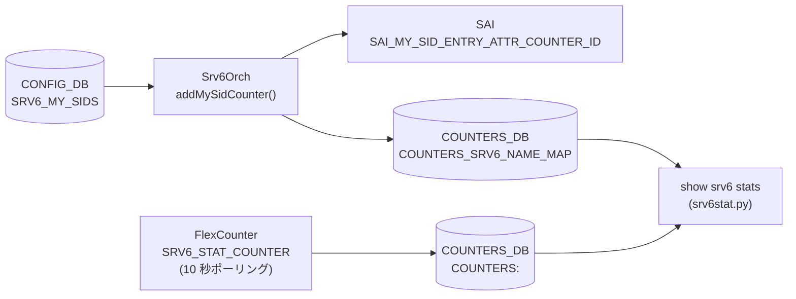

# SRv6 カウンタ状態（COUNTERS_DB SRv6 MySID）

## 概要

SRv6 の MySID エントリに対するパケット・バイトカウンタは `STATE_DB` ではなく **`COUNTERS_DB`** に格納される[^1]。`Srv6Orch` が SAI の `SAI_MY_SID_ENTRY_ATTR_COUNTER_ID` をプラットフォームがサポートしている場合に限りカウンタを作成し、`SRV6_STAT_COUNTER` FlexCounter グループ経由で 10 秒ごとにポーリングする[^2]。

!!! note "STATE_DB について"
    SONiC の SRv6 機能には専用の STATE_DB テーブルが存在しない。MySID の動作状態は COUNTERS_DB（カウンタ）と APP_DB（`SRV6_SID_LIST_TABLE` / `SRV6_MY_SID_TABLE`）の組み合わせで追跡する。

<!-- cdb-mermaid -->
### データフロー (自動生成)



!!! note "凡例"
    CONFIG_DB から COUNTERS_DB までの典型経路。SAI がカウンタ未対応の場合 MAP/CNT は生成されない。
<!-- /cdb-mermaid -->

## テーブル: `COUNTERS_SRV6_NAME_MAP`

```text
COUNTERS_SRV6_NAME_MAP
```

MySID プレフィックス文字列から SAI カウンタ OID へのマッピング。

| フィールド | 型 | 説明 |
|-----------|-----|------|
| `<mysid_prefix>` | string (OID) | MySID IPv6 プレフィックス（例: `fcbb:bbbb:20:f1::/64`）→ SAI カウンタ OID（例: `oid:0x17000000001000`）のマッピング |

- **書き込み**: `Srv6Orch::addMySidCounter()` — MySID エントリを ASIC に追加した直後
- **削除**: `Srv6Orch::removeMySidCounter()` — MySID エントリ削除時

## テーブル: `COUNTERS:<oid>`

```text
COUNTERS|<counter_oid>
```

| フィールド | 型 | デフォルト | 説明 |
|-----------|-----|----------|------|
| `SAI_COUNTER_STAT_PACKETS` | integer (文字列) | `"0"` | 該当 MySID エントリで処理したパケット数（累積） |
| `SAI_COUNTER_STAT_BYTES` | integer (文字列) | `"0"` | 該当 MySID エントリで処理したバイト数（累積） |

- **書き込み**: syncd の FlexCounter — `SRV6_STAT_COUNTER` グループが `SRV6_STAT_COUNTER_POLLING_INTERVAL_MS = 10000` ms 周期で SAI からポーリング
- `<counter_oid>` は `COUNTERS_SRV6_NAME_MAP` の値部分

## カウンタキー生成ロジック

`Srv6Orch::getMySidCounterKey()` (srv6orch.cpp:177-182) が COUNTERS_DB のマップキーを生成する:

```
mysid_addr (IPv6 文字列) + "/" + (block_len + node_len + func_len)
```

デフォルトのビット長 (`block_len=32`, `node_len=16`, `func_len=16`) では `/64` プレフィックスになる。
`arg_len` はカウンタキーに含まれない（プレフィックス長計算から除外）。

## 有効化条件

```cpp
// srv6orch.cpp:144-155
bool Srv6Orch::queryMySidCountersCapability() const {
    sai_attr_capability_t capability;
    sai_status_t status = sai_query_attribute_capability(
        gSwitchId, SAI_OBJECT_TYPE_MY_SID_ENTRY,
        SAI_MY_SID_ENTRY_ATTR_COUNTER_ID, &capability);
    if (status != SAI_STATUS_SUCCESS) { return false; }
    return capability.set_implemented && capability.create_implemented;
}
```

`set_implemented && create_implemented` の両方が true でないとカウンタは有効化されない。
SAI 非対応プラットフォームでは `COUNTERS_SRV6_NAME_MAP` が作成されず、`show srv6 stats` は空のテーブルを返す。

## CLI: `show srv6 stats`

`srv6stat.py` の `SRv6Stat.show()` が以下を実行する:

1. `COUNTERS_SRV6_NAME_MAP` から全 MySID プレフィックス → OID マッピングを取得
2. 各 OID の `COUNTERS:<oid>` から `SAI_COUNTER_STAT_PACKETS` / `SAI_COUNTER_STAT_BYTES` を取得
3. ユーザーキャッシュに保存した前回値との差分を計算して表示
4. 差分が負の場合（カウンタリセット検出）: キャッシュを無効化して累積値を表示

| コマンド | 説明 |
|---------|------|
| `show srv6 stats` | 全 MySID のパケット・バイト統計 |
| `show srv6 stats <sid>` | 指定 MySID のみ表示 |
| `sonic-clear srv6stats` | カウンタキャッシュをクリア（ゼロリセット） |

<!-- defaults -->
## コード由来の暗黙デフォルト (Phase A)

> 根拠: `srv6orch.cpp` L21-24, L144-155, L177-199, L251-283, `srv6stat.py` 全行精読。
> evidence: `meta/_intermediate/cdb-flow/srv6-state-defaults.md`

| フィールド / 状態 | 省略・未対応時の実挙動 | 分類 |
|----------------|----------------------|------|
| `SAI_COUNTER_STAT_PACKETS` | `"0"` — SAI カウンタ作成直後の初期値 | 初期値 (SAI) |
| `SAI_COUNTER_STAT_BYTES` | `"0"` — SAI カウンタ作成直後の初期値 | 初期値 (SAI) |
| `COUNTERS_SRV6_NAME_MAP` フィールド不在 | `queryMySidCountersCapability()` が false → カウンタ未作成 | 機能非対応 (SAI capability) |
| カウンタ差分が負 | キャッシュ無効化 → 累積値表示 (srv6stat.py:get_counter_value) | code-fallback |

### ポーリング間隔

```cpp
#define SRV6_STAT_COUNTER_POLLING_INTERVAL_MS 10000  // srv6orch.cpp:27
#define SRV6_FLEX_COUNTER_UPDATE_TIMER 1             // srv6orch.cpp:26 (OID 登録遅延タイマー, 秒)
```

MySID エントリを追加してから OID が FlexCounter に登録されるまで最大 1 秒の遅延がある。
その後 10 秒ごとにカウンタが更新される。

### ビット長デフォルト (カウンタキー影響)

```cpp
// srv6orch.cpp:21-24 および srv6orch.h 経由で getLocatorCfgFromDb() が参照
#define LOCATOR_DEFAULT_BLOCK_LEN "32"
#define LOCATOR_DEFAULT_NODE_LEN  "16"
#define LOCATOR_DEFAULT_FUNC_LEN  "16"
#define LOCATOR_DEFAULT_ARG_LEN   "0"
```

`SRV6_MY_LOCATORS` のフィールドを省略した場合、`getLocatorCfgFromDb()` の `get_value_or()` が上記デフォルトを使用する。
カウンタキーのプレフィックス長は `32 + 16 + 16 = /64` になる。
`arg_len` はキー計算に含まれない。

<!-- /defaults -->

## 関連リファレンス

- CONFIG_DB: [`SRV6_MY_SIDS`](srv6-my-sids.md) — MySID エントリ定義
- CONFIG_DB: [`SRV6_MY_LOCATORS`](srv6-my-locators.md) — ロケータ定義
- アーキテクチャ: [`SRv6 VPN HLD`](../../routing/srv6-vpn-hld.md)
- CLI: `show srv6 stats` / `show srv6 static-sids`

## 引用元

[^1]: SRv6 カウンタ管理: `srv6orch.cpp`. <https://github.com/sonic-net/sonic-swss/blob/4305596156d70e9797e8a881b3d19b46de0bce0d/orchagent/srv6orch.cpp>
[^2]: FlexCounter スキーマ定義: `schema.h` L257, L313. <https://github.com/sonic-net/sonic-swss-common/blob/master/common/schema.h>
