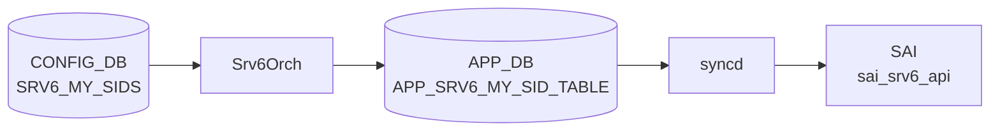

# SRv6 カウンタ状態（COUNTERS_DB SRv6 MySID）

## 概要

[SRv6](../../reference/glossary.md#term-srv6) の MySID エントリに対するパケット・バイトカウンタは `STATE_DB` ではなく **`COUNTERS_DB`** に格納される[^1]。`Srv6Orch` が [SAI](../../reference/glossary.md#term-sai) の `SAI_MY_SID_ENTRY_ATTR_COUNTER_ID` をプラットフォームがサポートしている場合に限りカウンタを作成し、`SRV6_STAT_COUNTER` [FlexCounter](../../reference/glossary.md#term-flexcounter) グループ経由で 10 秒ごとにポーリングする[^2]。

!!! note "STATE_DB について"
    SONiC の SRv6 機能には専用の STATE_DB テーブルが存在しない。MySID の動作状態は COUNTERS_DB（カウンタ）と APP_DB（`SRV6_SID_LIST_TABLE` / `SRV6_MY_SID_TABLE`）の組み合わせで追跡する。

<!-- cdb-mermaid -->
### データフロー (自動生成)



!!! note "凡例"
    CONFIG_DB から SAI までの典型経路を `docs/reference/config-db-orch-map.md` から機械生成したミニ図。詳細・例外は本ページ本文と対応表を参照。
<!-- /cdb-mermaid -->

## テーブル: `COUNTERS_SRV6_NAME_MAP`

```text
COUNTERS_SRV6_NAME_MAP
```

MySID プレフィックス文字列から [SAI](../../reference/glossary.md#term-sai) カウンタ OID へのマッピング。

| フィールド | 型 | 説明 |
|-----------|-----|------|
| `<mysid_prefix>` | string (OID) | MySID IPv6 プレフィックス（例: `fcbb:bbbb:20:f1::/64`）→ [SAI](../../reference/glossary.md#term-sai) カウンタ OID（例: `oid:0x17000000001000`）のマッピング |

- **書き込み**: `Srv6Orch::addMySidCounter()` — MySID エントリを [ASIC](../../reference/glossary.md#term-asic) に追加した直後
- **削除**: `Srv6Orch::removeMySidCounter()` — MySID エントリ削除時

## テーブル: `COUNTERS:<oid>`

```text
COUNTERS|<counter_oid>
```

| フィールド | 型 | デフォルト | 説明 |
|-----------|-----|----------|------|
| `SAI_COUNTER_STAT_PACKETS` | integer (文字列) | `"0"` | 該当 MySID エントリで処理したパケット数（累積） |
| `SAI_COUNTER_STAT_BYTES` | integer (文字列) | `"0"` | 該当 MySID エントリで処理したバイト数（累積） |

- **書き込み**: [syncd](../../reference/glossary.md#term-syncd) の [FlexCounter](../../reference/glossary.md#term-flexcounter) — `SRV6_STAT_COUNTER` グループが `SRV6_STAT_COUNTER_POLLING_INTERVAL_MS = 10000` ms 周期で SAI からポーリング
- `<counter_oid>` は `COUNTERS_SRV6_NAME_MAP` の値部分

## カウンタキー生成ロジック

`Srv6Orch::getMySidCounterKey()` (srv6orch.cpp:177-182) が [COUNTERS_DB](../../reference/glossary.md#term-counters_db) のマップキーを生成する:

```
mysid_addr (IPv6 文字列) + "/" + (block_len + node_len + func_len)
```

デフォルトのビット長 (`block_len=32`, `node_len=16`, `func_len=16`) では `/64` プレフィックスになる。
`arg_len` はカウンタキーに含まれない（プレフィックス長計算から除外）。

## 有効化条件

```cpp
// srv6orch.cpp:144-155
bool Srv6Orch::queryMySidCountersCapability() const {
    sai_attr_capability_t capability;
    sai_status_t status = sai_query_attribute_capability(
        gSwitchId, SAI_OBJECT_TYPE_MY_SID_ENTRY,
        SAI_MY_SID_ENTRY_ATTR_COUNTER_ID, &capability);
    if (status != SAI_STATUS_SUCCESS) { return false; }
    return capability.set_implemented && capability.create_implemented;
}
```

`set_implemented && create_implemented` の両方が true でないとカウンタは有効化されない。
SAI 非対応プラットフォームでは `COUNTERS_SRV6_NAME_MAP` が作成されず、`show srv6 stats` は空のテーブルを返す。

## CLI: `show srv6 stats`

`srv6stat.py` の `SRv6Stat.show()` が以下を実行する:

1. `COUNTERS_SRV6_NAME_MAP` から全 MySID プレフィックス → OID マッピングを取得
2. 各 OID の `COUNTERS:<oid>` から `SAI_COUNTER_STAT_PACKETS` / `SAI_COUNTER_STAT_BYTES` を取得
3. ユーザーキャッシュに保存した前回値との差分を計算して表示
4. 差分が負の場合（カウンタリセット検出）: キャッシュを無効化して累積値を表示

| コマンド | 説明 |
|---------|------|
| `show srv6 stats` | 全 MySID のパケット・バイト統計 |
| `show srv6 stats <sid>` | 指定 MySID のみ表示 |
| `sonic-clear srv6stats` | カウンタキャッシュをクリア（ゼロリセット） |

<!-- defaults -->
## コード由来の暗黙デフォルト (Phase A)

> 根拠: `srv6orch.cpp` L21-24, L144-155, L177-199, L251-283, `srv6stat.py` 全行精読。
> evidence: `meta/_intermediate/cdb-flow/srv6-state-defaults.md`

| フィールド / 状態 | 省略・未対応時の実挙動 | 分類 |
|----------------|----------------------|------|
| `SAI_COUNTER_STAT_PACKETS` | `"0"` — SAI カウンタ作成直後の初期値 | 初期値 (SAI) |
| `SAI_COUNTER_STAT_BYTES` | `"0"` — SAI カウンタ作成直後の初期値 | 初期値 (SAI) |
| `COUNTERS_SRV6_NAME_MAP` フィールド不在 | `queryMySidCountersCapability()` が false → カウンタ未作成 | 機能非対応 (SAI capability) |
| カウンタ差分が負 | キャッシュ無効化 → 累積値表示 (srv6stat.py:get_counter_value) | code-fallback |

### ポーリング間隔

```cpp
#define SRV6_STAT_COUNTER_POLLING_INTERVAL_MS 10000  // srv6orch.cpp:27
#define SRV6_FLEX_COUNTER_UPDATE_TIMER 1             // srv6orch.cpp:26 (OID 登録遅延タイマー, 秒)
```

MySID エントリを追加してから OID が [FlexCounter](../../reference/glossary.md#term-flexcounter) に登録されるまで最大 1 秒の遅延がある。
その後 10 秒ごとにカウンタが更新される。

### ビット長デフォルト (カウンタキー影響)

```cpp
// srv6orch.cpp:21-24 および srv6orch.h 経由で getLocatorCfgFromDb() が参照
#define LOCATOR_DEFAULT_BLOCK_LEN "32"
#define LOCATOR_DEFAULT_NODE_LEN  "16"
#define LOCATOR_DEFAULT_FUNC_LEN  "16"
#define LOCATOR_DEFAULT_ARG_LEN   "0"
```

`SRV6_MY_LOCATORS` のフィールドを省略した場合、`getLocatorCfgFromDb()` の `get_value_or()` が上記デフォルトを使用する。
カウンタキーのプレフィックス長は `32 + 16 + 16 = /64` になる。
`arg_len` はキー計算に含まれない。

<!-- /defaults -->

<!-- ordering -->
## 書込み順依存 (Phase B)

> 根拠: `srv6orch.cpp` L120-132, L184-210, L251-284, L1591-1601, L1660-1680, L286-313。
> evidence: `meta/_intermediate/cdb-flow/srv6-state-ordering.md`

[COUNTERS_DB](../../reference/glossary.md#term-counters_db) の `COUNTERS_SRV6_NAME_MAP` / `COUNTERS:<oid>` は `Srv6Orch` が内部的に管理するため、
ユーザーが直接書き込む必要はない。ただし以下の順序依存・タイミング依存が存在する。

### 検出された順序依存

| # | 依存関係 | 方向 | 緩和策 |
|---|----------|------|--------|
| 1 | SAI 能力チェックは [orchagent](../../reference/glossary.md#term-orchagent) 起動時一回限り (`initializeCounters`) | **強制先行**（後変更不可） | SAI 非対応なら [orchagent](../../reference/glossary.md#term-orchagent) 再起動しか解消手段なし |
| 2 | `FLEX_COUNTER_TABLE\|SRV6 enable` と `SRV6_MY_SID_TABLE` エントリの書き込み順序 | どちらが先でも可 | 後から書いた側が既存エントリへカウンタを自動付与 |
| 3 | `COUNTERS_SRV6_NAME_MAP` 書き込みは即時だが `COUNTERS:<oid>` 初回値は最大 11 秒遅延 | タイミング依存 | 設定直後に空でも正常（最大 1 秒 + 10 秒ポーリング待ち） |
| 4 | MySID DEL → `COUNTERS_SRV6_NAME_MAP` 自動クリーンアップ | 自動（ユーザー操作不要） | `COUNTERS:<oid>` 残留値は `sonic-clear srv6stats` でリセット |

### 主要な制約詳細

**SAI 能力チェックは起動時一回限り (依存 #1)**:
`initializeCounters()` は [orchagent](../../reference/glossary.md#term-orchagent) 起動時に `queryMySidCountersCapability()` を一度だけ呼び出し、
`m_mysid_counters_supported` フラグを確定する。
その後 `setCountersState()` 冒頭で `getMySidCountersSupported()` が false の場合に即 return するため、
**実行中に SAI 対応プラットフォームへ切り替えることはできない**（evidence: `srv6orch.cpp:120-132`, `srv6orch.cpp:251-260`）。

**`FLEX_COUNTER_TABLE` と MySID エントリの順序自由性 (依存 #2)**:
`setCountersState(true)` は `srv6_my_sid_table_` を走査して既存の全 MySID にカウンタを付与する。
一方 `createUpdateMysidEntry` は `getMySidCountersEnabled()` が true なら MySID 追加時点でカウンタを付与する。
どちらが先でも最終的に `COUNTERS_SRV6_NAME_MAP` に反映される（evidence: `srv6orch.cpp:268-282`, `srv6orch.cpp:1591-1601`）。

**`COUNTERS:<oid>` 反映の最大 11 秒遅延 (依存 #3)**:
`addMySidCounter()` は `COUNTERS_SRV6_NAME_MAP` に OID を即時書き込むが、
`FLEX_COUNTER_DB` への `SRV6_COUNTER_ID_LIST` 登録は `SRV6_FLEX_COUNTER_UPDATE_TIMER = 1` 秒のタイマー後。
[syncd](../../reference/glossary.md#term-syncd) がポーリングを開始してから最初の `COUNTERS:<oid>` 値が書き込まれるまでさらに
`SRV6_STAT_COUNTER_POLLING_INTERVAL_MS = 10000` ms 待つ必要がある
（evidence: `srv6orch.cpp:184-210`, `srv6orch.cpp:26-27`）。

<!-- /ordering -->

<!-- cross-refs -->
## テーブル間クロスリファレンス (Phase C)

> 根拠: `srv6orch.cpp` `addMySidCounter()` L184-210、`removeMySidCounter()` L218-232、`getMySidCounterKey()` L177-182、`setCountersState()` L251-283、`schema.h` L257,313、`srv6stat.py` 全行精読。
> evidence: `meta/_intermediate/cdb-flow/srv6-state-cross-refs.md`

| 参照元 | 参照先 | 種別 | 必須条件 |
|--------|--------|------|----------|
| `COUNTERS_SRV6_NAME_MAP` キー | `CONFIG_DB SRV6_MY_LOCATORS` の `block_len`/`node_len`/`func_len` | ビット長計算 (直接 GET) | ロケータが [CONFIG_DB](../../reference/glossary.md#term-config_db) に存在すること（欠落でキー計算失敗） |
| `COUNTERS:<oid>` | `FLEX_COUNTER_DB SRV6_COUNTER_ID_LIST` | FlexCounter 間接トリガー | SAI 対応プラットフォームかつ enable 状態であること |
| `COUNTERS_SRV6_NAME_MAP` (一括) | `FLEX_COUNTER_TABLE\|SRV6` enable/disable | orch 内部連動 | `setCountersState()` 呼び出し |
| `show srv6 stats` CLI | `COUNTERS_DB COUNTERS_SRV6_NAME_MAP` + `COUNTERS:<oid>` | 直接読取 | カウンタ初期化後、最大 11 秒待ちで初回値が出現 |

### COUNTERS_SRV6_NAME_MAP キーと SRV6_MY_LOCATORS の関係

`getMySidCounterKey()` (`srv6orch.cpp:177-182`) は [COUNTERS_DB](../../reference/glossary.md#term-counters_db) に書き込むキーを以下で生成する:

```cpp
return mysid_addr + "/" + to_string(block_len + node_len + func_len)
```

`block_len` / `node_len` / `func_len` は `getLocatorCfgFromDb()` が [CONFIG_DB](../../reference/glossary.md#term-config_db) `SRV6_MY_LOCATORS` から取得する。ロケータを後から変更した場合、既存の `COUNTERS_SRV6_NAME_MAP` エントリのキーが旧プレフィックス長のまま残存し、`show srv6 stats` に孤立エントリが出現する可能性がある。`sonic-clear srv6stats` でキャッシュをクリアして `Srv6Orch` が MySID を再作成するまで解消されない。

### FLEX_COUNTER_TABLE|SRV6 と カウンタの一括制御

`setCountersState(true)` (`srv6orch.cpp:261-283`) は `FLEX_COUNTER_TABLE|SRV6` が enable になったとき既存の全 MySID を `m_mysid_counters_table` (COUNTERS_SRV6_NAME_MAP) に一括登録する。`setCountersState(false)` は逆に全エントリを `hdel` で削除する。`COUNTERS:<oid>` の実値は FlexCounter が次のポーリング（最大 10 秒後）まで更新されない。

<!-- /cross-refs -->

<!-- failure -->
## 失敗挙動マトリクス (Phase D)

> 根拠: `srv6orch.cpp` `initializeCounters()` L120-142、`queryMySidCountersCapability()` L144-155、`addMySidCounter()` L184-210、`setMySidEntryCounter()` L236-248、`setCountersState()` L251-283、`createUpdateMysidEntry()` L1589-1614 全行精読。
> evidence: `meta/_intermediate/cdb-flow/srv6-state-failure.md`

COUNTERS_DB の `COUNTERS_SRV6_NAME_MAP` / `COUNTERS:<oid>` は `Srv6Orch` が自動管理するため、ユーザーが直接失敗操作を行うテーブルではない。ただし以下のエラー経路がある。

### 失敗経路一覧

| 失敗条件 | 検出箇所 | 結果 | 自動回復 | ログ出力 |
|----------|----------|------|----------|----------|
| SAI が `SAI_MY_SID_ENTRY_ATTR_COUNTER_ID` 未対応 | `queryMySidCountersCapability()` `srv6orch.cpp:144-155` | カウンタ機能全体が無効化（起動時一回限り確定） | orchagent 再起動のみ | `SWSS_LOG_INFO("SRv6 counters are not supported on this platform")` |
| `sai_query_attribute_capability()` 呼び出し自体が非 SUCCESS | `queryMySidCountersCapability()` `srv6orch.cpp:147-151` | 同上 | orchagent 再起動のみ | `SWSS_LOG_WARN("Could not query SRv6 MySID entry attribute SAI_MY_SID_ENTRY_ATTR_COUNTER_ID %d")` |
| SAI generic counter 作成失敗 | `addMySidCounter()` `srv6orch.cpp:188-192` | `addMySidCounter` が false → **MySID エントリ自体が [ASIC](../../reference/glossary.md#term-asic) 未作成** | なし | `SWSS_LOG_ERROR("Failed to create SAI counter for SRv6 MySID entry")` |
| `setMySidEntryCounter()` での SAI セット失敗 | `setMySidEntryCounter()` `srv6orch.cpp:244-248` | `COUNTERS_SRV6_NAME_MAP` 書き込み済みだが SAI エントリへのカウンタ紐付けが失敗状態 | なし（ロールバックなし） | `SWSS_LOG_ERROR("Failed to set my_sid entry counter oid to %s, rc: %s")` |
| SAI platform が disable 時の `set_my_sid_entry_attribute` 失敗 | `setCountersState(false)` `srv6orch.cpp:278-280` | エラーログのみ。`removeMySidCounter()` は続行され `COUNTERS_SRV6_NAME_MAP` から削除される | なし | `SWSS_LOG_ERROR` (setMySidEntryCounter 経由) |

!!! warning "SAI カウンタ作成失敗は MySID エントリ未作成に波及"
    `createUpdateMysidEntry()` はカウンタ有効化状態で `addMySidCounter()` が false を返すと、`create_my_sid_entry()` を呼ばずに即 return false する（`srv6orch.cpp:1595-1599`）。つまり **SAI generic counter の枯渇や SAI API エラーは MySID エントリ自体の ASIC 登録失敗を引き起こす**。カウンタ機能を無効化（`FLEX_COUNTER_TABLE|SRV6 disable`）してから再投入することで回避できる。

!!! note "setMySidEntryCounter 失敗時のカウンタ孤立"
    `setMySidEntryCounter()` が SAI セット失敗しても `COUNTERS_SRV6_NAME_MAP` への書き込みはすでに完了している。カウンタ OID は存在するが SAI MySID エントリへの紐付けがないため、`COUNTERS:<oid>` の値は更新されない孤立状態になる。`show srv6 stats` はキー一覧を表示するが、値が 0 のままとなる。

<!-- /failure -->

<!-- constants -->
## ハードコード定数・上限値 (Phase E)

> 根拠: `srv6orch.cpp` L19-27 (#define 群)、`srv6orch.h` L30、`schema.h` L257,313、`srv6orch.cpp` L108,138,201-210 精読。
> evidence: `meta/_intermediate/cdb-flow/srv6-state-constants.md`

| 定数名 | 値 | 利用箇所 | 設定変更可否 |
|--------|-----|---------|------------|
| `SRV6_FLEX_COUNTER_UPDATE_TIMER` | `1` 秒 | MySID 追加後 OID を `FLEX_COUNTER_DB` へ登録するまでの遅延タイマー | 不可（コード変更必須） |
| `SRV6_STAT_COUNTER_POLLING_INTERVAL_MS` | `10000` ms | FlexCounter が SAI からカウンタをポーリングする間隔 | 不可（コード変更必須） |
| `SRV6_STAT_COUNTER_FLEX_COUNTER_GROUP` | `"SRV6_STAT_COUNTER"` | `FLEX_COUNTER_TABLE` のグループキー | 不可（コード変更必須） |
| `LOCATOR_DEFAULT_BLOCK_LEN` | `"32"` | ロケータ未登録時のカウンタキープレフィックス長計算フォールバック | `SRV6_MY_LOCATORS` で上書き可 |
| `LOCATOR_DEFAULT_NODE_LEN` | `"16"` | 同上 | `SRV6_MY_LOCATORS` で上書き可 |
| `LOCATOR_DEFAULT_FUNC_LEN` | `"16"` | 同上 | `SRV6_MY_LOCATORS` で上書き可 |
| `LOCATOR_DEFAULT_ARG_LEN` | `"0"` | 同上（カウンタキー計算には含まれない） | `SRV6_MY_LOCATORS` で上書き可 |

### COUNTERS_DB への反映遅延 (最大 11 秒)

```cpp
// srv6orch.cpp L26-27
#define SRV6_FLEX_COUNTER_UPDATE_TIMER 1            // OID 登録遅延タイマー（秒）
#define SRV6_STAT_COUNTER_POLLING_INTERVAL_MS 10000 // FlexCounter ポーリング間隔（ミリ秒）
```

MySID エントリが [ASIC](../../reference/glossary.md#term-asic) に追加されると `addMySidCounter()` が `m_pending_counters` にカウンタ OID を積む
（`srv6orch.cpp:201-202`）。その後 `SRV6_FLEX_COUNTER_UPDATE_TIMER = 1` 秒のタイマーで
`FLEX_COUNTER_DB SRV6_COUNTER_ID_LIST` に OID が書き込まれ、
[syncd](../../reference/glossary.md#term-syncd) FlexCounter が `SRV6_STAT_COUNTER_POLLING_INTERVAL_MS = 10000` ms 周期で SAI をポーリングして
`COUNTERS:<oid>` を書き込む。
MySID 追加から `COUNTERS:<oid>` 初回値が出現するまでの最大待機時間は **1 + 10 = 11 秒**（`srv6orch.cpp:108,138`）。

### FLEX_COUNTER_TABLE キー固定

`SRV6_STAT_COUNTER_FLEX_COUNTER_GROUP = "SRV6_STAT_COUNTER"` (`srv6orch.h:30`) は
`FLEX_COUNTER_TABLE|SRV6_STAT_COUNTER` の enable/disable で FlexCounter を一括制御するキーである。
`flexcounterorch.cpp:64` の `SRV6_KEY = "SRV6"` が `CounterCheckOrch` に渡す識別子であり、
これを変更することはできない。

### ロケータビット長デフォルトとカウンタキー

`getMySidCounterKey()` (`srv6orch.cpp:177-182`) は `block_len + node_len + func_len` の合計を
カウンタキーの `/N` プレフィックス長として使用する。
`SRV6_MY_LOCATORS` にロケータが未登録の場合、デフォルト合計 `32 + 16 + 16 = /64` が使われる。
`LOCATOR_DEFAULT_ARG_LEN = 0` はキー計算には加算されない（設計上の選択）。

<!-- /constants -->

<!-- side-effects -->
## 副次 DB 書込 (Phase F)

> 根拠: `srv6orch.cpp` `addMySidCounter()` L184-210、`removeMySidCounter()` L212-234、`setMySidEntryCounter()` L236-248、`setCountersState()` L251-283、`doTask(SelectableTimer)` L286-313、`createUpdateMysidEntry()` L1589-1614 全行精読。
> evidence: `meta/_intermediate/cdb-flow/srv6-state-side-effects.md`

COUNTERS_DB の `COUNTERS_SRV6_NAME_MAP` / `COUNTERS:<oid>` はユーザーが直接書き込むテーブルではない。`Srv6Orch` が `SRV6_MY_SIDS` ([CONFIG_DB](../../reference/glossary.md#term-config_db)) および `FLEX_COUNTER_TABLE|SRV6_STAT_COUNTER` の変化を受けて、以下の副次書込みを実行する。

### SRV6_MY_SIDS SET → COUNTERS_DB 書込み

`createUpdateMysidEntry()` は `getMySidCountersSupported() && getMySidCountersEnabled()` が両方真の場合に `addMySidCounter()` を呼び出す（`srv6orch.cpp:1591-1599`）。

| 副次 DB / API | キー / 操作 | タイミング | ソース |
|-------------|-----------|-----------|--------|
| COUNTERS_DB / `COUNTERS_SRV6_NAME_MAP` | `hset("", sid_prefix, counter_oid)` — MySID ごとのカウンタ OID を登録 | 即時 | `srv6orch.cpp:196-199` |
| [FLEX_COUNTER_DB](../../reference/glossary.md#term-flex_counter_db) / `SRV6_STAT_COUNTER:<oid>` | `setCounterIdList` — 1 秒タイマー後に [FLEX_COUNTER_DB](../../reference/glossary.md#term-flex_counter_db) 登録 | 最大 1 秒遅延 | `srv6orch.cpp:300` |
| SAI / `sai_srv6_api` | `set_my_sid_entry_attribute(SAI_MY_SID_ENTRY_ATTR_COUNTER_ID, counter_oid)` — ASIC カウンタ紐付け | SAI 呼び出し直後 | `srv6orch.cpp:244` |

`gTraditionalFlexCounter=true` の場合、[FLEX_COUNTER_DB](../../reference/glossary.md#term-flex_counter_db) への登録は [ASIC_DB](../../reference/glossary.md#term-asic_db) `VIDTORID` の VID→RID 解決確認後に行われる（`srv6orch.cpp:293-295`）。

### SRV6_MY_SIDS DEL → COUNTERS_DB クリーンアップ

`deleteMysidEntry()` が `removeMySidCounter()` を呼び出す（`srv6orch.cpp:1666-1670`）。

| 副次 DB / API | キー / 操作 | ソース |
|-------------|-----------|--------|
| COUNTERS_DB / `COUNTERS_SRV6_NAME_MAP` | `hdel("", sid_prefix)` — OID マッピング削除 | `srv6orch.cpp:223` |
| FLEX_COUNTER_DB / `SRV6_STAT_COUNTER:<oid>` | `clearCounterIdList` — pending に未登録の場合のみ削除 | `srv6orch.cpp:229` |
| SAI / `sai_counter_api` | `remove_counter(counter_oid)` — ASIC generic counter 解放 | `srv6orch.cpp:231` |

### FLEX_COUNTER_TABLE|SRV6_STAT_COUNTER enable / disable → 一括書込み

`setCountersState(true)` は `srv6_my_sid_table_` の全 MySID を走査して `addMySidCounter()` を一括呼び出しし、`COUNTERS_SRV6_NAME_MAP` への一括登録を行う。`setCountersState(false)` は逆方向（`hdel` + ASIC カウンタ切離し）を一括実行する（`srv6orch.cpp:261-283`）。

!!! note "副次書込みが発生しない条件"
    `queryMySidCountersCapability()` が false（プラットフォーム非対応）の場合、`setCountersState()` は冒頭で early-return し、一切の副次書込みを行わない（`srv6orch.cpp:256-260`）。また `getMySidCountersEnabled()` が false（FlexCounter 無効）の場合も `addMySidCounter()` は呼ばれない。

!!! note "STATE_DB / APPL_DB / CONFIG_DB への書き戻しなし"
    このページ（COUNTERS_DB）の書込みは `Srv6Orch` 内で完結する。STATE_DB・APPL_DB・CONFIG_DB への書き戻しはいずれのケースでも発生しない。

<!-- /side-effects -->

<!-- pubsub -->
## Redis 通信メカニズム (Phase G)

> 根拠: `orchdaemon.cpp` L312-324、`orch.cpp` L1186-1196、`flexcounterorch.cpp` L64,96,337-339、`srv6orch.cpp` L98-113,261-283,286-312 精読。
> evidence: `meta/_intermediate/cdb-flow/srv6-state-pubsub.md`

`COUNTERS_SRV6_NAME_MAP` / `COUNTERS:<oid>` (COUNTERS_DB) は `Srv6Orch` と syncd が書き手となる。
それぞれの書き込みがどの [Redis](../../reference/glossary.md#term-redis) 通信メカニズムで駆動されるかを以下に示す。

### Producer/Consumer ペア

| 区間 | 方式 | チャンネル / パターン |
|------|------|--------------------|
| `fpmsyncd` → [APPL_DB](../../reference/glossary.md#term-appl_db) `SRV6_MY_SID_TABLE` | `ProducerStateTable`（SET/DEL） | `SRV6_MY_SID_TABLE_CHANNEL@0` |
| [APPL_DB](../../reference/glossary.md#term-appl_db) `SRV6_MY_SID_TABLE` → `Srv6Orch` | **`ConsumerStateTable`** (LPOP) | `SRV6_MY_SID_TABLE_CHANNEL@0` |
| CONFIG_DB `SRV6_MY_SIDS` → `Srv6Orch` | **`SubscriberStateTable`** (PSUBSCRIBE) | `__keyspace@4__:SRV6_MY_SIDS\|*` |
| `FLEX_COUNTER_TABLE\|SRV6` → `Srv6Orch` | `FlexCounterOrch` コールバック (`setCountersState`) | — |
| `Srv6Orch` → FLEX_COUNTER_DB | `FlexCounterManager::setCounterIdList`（1 秒タイマー後） | `SRV6_STAT_COUNTER:<oid>` |
| FLEX_COUNTER_DB → syncd | `SubscriberStateTable` (syncd 内部) | — |
| syncd → COUNTERS_DB `COUNTERS:<oid>` | SAI ポーリング (`HSET`、直接書込み) | — |

### APPL_DB 消費方式: ConsumerStateTable

`Orch::addConsumer()` (`orch.cpp:1186-1195`) は DB 番号で通信方式を切り替える。[APPL_DB](../../reference/glossary.md#term-appl_db) (db_id=0) は `ConsumerStateTable` ブランチを選択し、[fpmsyncd](../../reference/glossary.md#term-fpmsyncd) が書き込んだ `ProducerStateTable` イベントを LPOP で取得する。`SRV6_SID_LIST_TABLE` / `SRV6_MY_SID_TABLE` / `PIC_CONTEXT_TABLE` の 3 テーブルがこの経路を使用する（evidence: `orchdaemon.cpp:312-324`）。

### CONFIG_DB 消費方式: SubscriberStateTable

`SRV6_MY_SIDS` (CONFIG_DB, db_id=4) は `SubscriberStateTable` ブランチが選択される。`SubscriberStateTable` は [Redis](../../reference/glossary.md#term-redis) keyspace notification を `PSUBSCRIBE __keyspace@4__:SRV6_MY_SIDS|*` で購読し、`hset` / `del` 操作を検出する。フィールド値は通知後に `HGETALL` で取得する。起動時には既存全エントリが `SET_COMMAND` として buffer に積まれ、`doTask` が初回コールされる（evidence: `orch.cpp:1186-1190`）。

### FLEX_COUNTER_TABLE enable/disable: コールバック方式

`FlexCounterOrch::doTask()` が `FLEX_COUNTER_TABLE|SRV6` エントリを処理すると `gSrv6Orch->setCountersState(enable)` を直接呼び出す（`flexcounterorch.cpp:337-339`）。`Srv6Orch` は `FLEX_COUNTER_TABLE` を直接購読しない受動型構造である。`setCountersState(true)` は `srv6_my_sid_table_` 内の全 MySID に対して `addMySidCounter()` を一括実行し `COUNTERS_SRV6_NAME_MAP` を書き込む（evidence: `flexcounterorch.cpp:64,96`）。

### SelectableTimer 経由の FLEX_COUNTER_DB 登録

`addMySidCounter()` は `COUNTERS_SRV6_NAME_MAP` に OID を即時書込みした後、`m_counter_update_timer`（`SRV6_FLEX_COUNTER_UPDATE_TIMER = 1` 秒）を start する。1 秒後に `doTask(SelectableTimer&)` が呼ばれ `m_counter_manager.setCounterIdList()` で FLEX_COUNTER_DB に OID を登録する。syncd は FLEX_COUNTER_DB を購読して `SRV6_STAT_COUNTER_POLLING_INTERVAL_MS = 10000` ms ごとに SAI からポーリングし `COUNTERS|<oid>` を書き込む（evidence: `srv6orch.cpp:286-312`）。

### COUNTERS_DB への書き込みは ProducerStateTable 非経由

`Srv6Orch` は `COUNTERS_SRV6_NAME_MAP` を `Table::set()` / `Table::hdel()` で直接書き込む（`m_mysid_counters_table` は `Table` 型）。syncd も `COUNTERS|<oid>` を SAI ポーリング後 `HSET` で直接書き込む。どちらも `ProducerStateTable` / チャンネル PUBLISH を使用しないため、COUNTERS_DB の変更は [Redis](../../reference/glossary.md#term-redis) keyspace notification のみで追跡可能（pub/sub チャンネルは存在しない）。

<!-- /pubsub -->

<!-- platform -->
## プラットフォーム / SAI Capability 差異 (Phase H)

> 根拠: `srv6orch.cpp` `initializeCounters()` L120-142、`queryMySidCountersCapability()` L144-155、`doTask(SelectableTimer&)` L286-313、`main.cpp` L84,529-531 精読。
> evidence: `meta/_intermediate/cdb-flow/srv6-state-platform.md`

`COUNTERS_SRV6_NAME_MAP` / `COUNTERS:<oid>` への書き込みが発生するかどうかは、プラットフォームの SAI 実装と起動構成によって決まる。

### 差異 1: SAI カウンタ capability 非対応（最大の分岐）

`queryMySidCountersCapability()` (`srv6orch.cpp:144-155`) は orchagent 起動時に `sai_query_attribute_capability()` を呼び出し、`SAI_OBJECT_TYPE_MY_SID_ENTRY` の `SAI_MY_SID_ENTRY_ATTR_COUNTER_ID` 属性が `set_implemented && create_implemented` かを確認する。

| 条件 | `m_mysid_counters_supported` | COUNTERS_DB への影響 |
|------|------------------------------|---------------------|
| SAI が両方 true を返す | `true` | `COUNTERS_SRV6_NAME_MAP` が MySID 追加時に書かれる |
| SAI が非 SUCCESS / どちらか false | `false` | `COUNTERS_SRV6_NAME_MAP` は一切書かれない。`show srv6 stats` は空 |

このフラグは起動時一回限り確定し、実行中の変更手段はない（orchagent 再起動が必要）。

### 差異 2: gTraditionalFlexCounter モード（ASIC_DB 経由 VID 解決）

orchagent 起動引数 `-c traditional` (`main.cpp:529-531`) で `gTraditionalFlexCounter = true` になる。デフォルトは `false`。

| モード | FLEX_COUNTER_DB 登録タイミング |
|--------|-------------------------------|
| デフォルト (`false`) | MySID 追加から 1 秒後（タイマー発火で即登録） |
| traditional (`true`) | タイマー発火時に [ASIC_DB](../../reference/glossary.md#term-asic_db) `VIDTORID` で VID→RID 変換が確認できるまで待機。RID 未確定の場合はポーリングが繰り返されるため `COUNTERS:<oid>` 初回値の出現がさらに遅延する（evidence: `srv6orch.cpp:293-295`） |

traditional モードは古い Broadcom SDK 系 ASIC などで使用されることがある。

### 差異 3: VS / SAI 未実装プラットフォーム

VS (Virtual Switch) など `sai_query_attribute_capability()` 自体が `SAI_STATUS_NOT_IMPLEMENTED` を返す SAI 実装では、`queryMySidCountersCapability()` が false を返して `COUNTERS_SRV6_NAME_MAP` への書き込みは発生しない。

### プラットフォーム別まとめ

| プラットフォーム例 | SAI capability | gTraditionalFlexCounter | COUNTERS_SRV6_NAME_MAP |
|-------------------|----------------|------------------------|------------------------|
| HW ASIC（対応 SAI）+ デフォルト | `true` | `false` | MySID 追加後 ~1 秒で出現 |
| HW ASIC（対応 SAI）+ traditional | `true` | `true` | VIDTORID 確定後に出現（追加遅延あり） |
| HW ASIC（非対応 SAI） | `false` | — | 常に空 |
| VS / ソフトウェア SAI | `false`（多くの場合） | `false` | 常に空 |

`COUNTERS:<oid>` の値は FlexCounter 登録完了後、`SRV6_STAT_COUNTER_POLLING_INTERVAL_MS = 10000 ms` ごとに syncd が更新する。この間隔はプラットフォーム間で変わらない（コード固定値）。

<!-- /platform -->

## 関連リファレンス

- CONFIG_DB: [`SRV6_MY_SIDS`](srv6-my-sids.md) — MySID エントリ定義
- CONFIG_DB: [`SRV6_MY_LOCATORS`](srv6-my-locators.md) — ロケータ定義
- アーキテクチャ: [`SRv6 VPN HLD`](../../routing/srv6-vpn-hld.md)
- CLI: `show srv6 stats` / `show srv6 static-sids`

## 引用元

[^1]: [SRv6](../../reference/glossary.md#term-srv6) カウンタ管理: `srv6orch.cpp`. <https://github.com/sonic-net/sonic-swss/blob/4305596156d70e9797e8a881b3d19b46de0bce0d/orchagent/srv6orch.cpp>
[^2]: FlexCounter スキーマ定義: `schema.h` L257, L313. <https://github.com/sonic-net/sonic-swss-common/blob/master/common/schema.h>

<!-- glossary-links-injected: fdd18c72e6f4 -->
