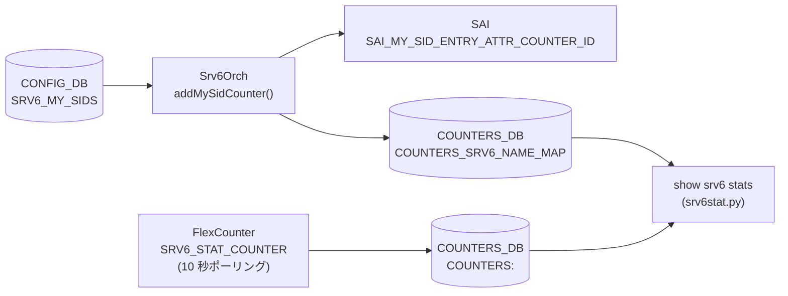

# SRv6 カウンタ状態（COUNTERS_DB SRv6 MySID）

## 概要

SRv6 の MySID エントリに対するパケット・バイトカウンタは `STATE_DB` ではなく **`COUNTERS_DB`** に格納される[^1]。`Srv6Orch` が SAI の `SAI_MY_SID_ENTRY_ATTR_COUNTER_ID` をプラットフォームがサポートしている場合に限りカウンタを作成し、`SRV6_STAT_COUNTER` FlexCounter グループ経由で 10 秒ごとにポーリングする[^2]。

!!! note "STATE_DB について"
    SONiC の SRv6 機能には専用の STATE_DB テーブルが存在しない。MySID の動作状態は COUNTERS_DB（カウンタ）と APP_DB（`SRV6_SID_LIST_TABLE` / `SRV6_MY_SID_TABLE`）の組み合わせで追跡する。

<!-- cdb-mermaid -->
### データフロー (自動生成)



!!! note "凡例"
    CONFIG_DB から COUNTERS_DB までの典型経路。SAI がカウンタ未対応の場合 MAP/CNT は生成されない。
<!-- /cdb-mermaid -->

## テーブル: `COUNTERS_SRV6_NAME_MAP`

```text
COUNTERS_SRV6_NAME_MAP
```

MySID プレフィックス文字列から SAI カウンタ OID へのマッピング。

| フィールド | 型 | 説明 |
|-----------|-----|------|
| `<mysid_prefix>` | string (OID) | MySID IPv6 プレフィックス（例: `fcbb:bbbb:20:f1::/64`）→ SAI カウンタ OID（例: `oid:0x17000000001000`）のマッピング |

- **書き込み**: `Srv6Orch::addMySidCounter()` — MySID エントリを ASIC に追加した直後
- **削除**: `Srv6Orch::removeMySidCounter()` — MySID エントリ削除時

## テーブル: `COUNTERS:<oid>`

```text
COUNTERS|<counter_oid>
```

| フィールド | 型 | デフォルト | 説明 |
|-----------|-----|----------|------|
| `SAI_COUNTER_STAT_PACKETS` | integer (文字列) | `"0"` | 該当 MySID エントリで処理したパケット数（累積） |
| `SAI_COUNTER_STAT_BYTES` | integer (文字列) | `"0"` | 該当 MySID エントリで処理したバイト数（累積） |

- **書き込み**: syncd の FlexCounter — `SRV6_STAT_COUNTER` グループが `SRV6_STAT_COUNTER_POLLING_INTERVAL_MS = 10000` ms 周期で SAI からポーリング
- `<counter_oid>` は `COUNTERS_SRV6_NAME_MAP` の値部分

## カウンタキー生成ロジック

`Srv6Orch::getMySidCounterKey()` (srv6orch.cpp:177-182) が COUNTERS_DB のマップキーを生成する:

```
mysid_addr (IPv6 文字列) + "/" + (block_len + node_len + func_len)
```

デフォルトのビット長 (`block_len=32`, `node_len=16`, `func_len=16`) では `/64` プレフィックスになる。
`arg_len` はカウンタキーに含まれない（プレフィックス長計算から除外）。

## 有効化条件

```cpp
// srv6orch.cpp:144-155
bool Srv6Orch::queryMySidCountersCapability() const {
    sai_attr_capability_t capability;
    sai_status_t status = sai_query_attribute_capability(
        gSwitchId, SAI_OBJECT_TYPE_MY_SID_ENTRY,
        SAI_MY_SID_ENTRY_ATTR_COUNTER_ID, &capability);
    if (status != SAI_STATUS_SUCCESS) { return false; }
    return capability.set_implemented && capability.create_implemented;
}
```

`set_implemented && create_implemented` の両方が true でないとカウンタは有効化されない。
SAI 非対応プラットフォームでは `COUNTERS_SRV6_NAME_MAP` が作成されず、`show srv6 stats` は空のテーブルを返す。

## CLI: `show srv6 stats`

`srv6stat.py` の `SRv6Stat.show()` が以下を実行する:

1. `COUNTERS_SRV6_NAME_MAP` から全 MySID プレフィックス → OID マッピングを取得
2. 各 OID の `COUNTERS:<oid>` から `SAI_COUNTER_STAT_PACKETS` / `SAI_COUNTER_STAT_BYTES` を取得
3. ユーザーキャッシュに保存した前回値との差分を計算して表示
4. 差分が負の場合（カウンタリセット検出）: キャッシュを無効化して累積値を表示

| コマンド | 説明 |
|---------|------|
| `show srv6 stats` | 全 MySID のパケット・バイト統計 |
| `show srv6 stats <sid>` | 指定 MySID のみ表示 |
| `sonic-clear srv6stats` | カウンタキャッシュをクリア（ゼロリセット） |

<!-- defaults -->
## コード由来の暗黙デフォルト (Phase A)

> 根拠: `srv6orch.cpp` L21-24, L144-155, L177-199, L251-283, `srv6stat.py` 全行精読。
> evidence: `meta/_intermediate/cdb-flow/srv6-state-defaults.md`

| フィールド / 状態 | 省略・未対応時の実挙動 | 分類 |
|----------------|----------------------|------|
| `SAI_COUNTER_STAT_PACKETS` | `"0"` — SAI カウンタ作成直後の初期値 | 初期値 (SAI) |
| `SAI_COUNTER_STAT_BYTES` | `"0"` — SAI カウンタ作成直後の初期値 | 初期値 (SAI) |
| `COUNTERS_SRV6_NAME_MAP` フィールド不在 | `queryMySidCountersCapability()` が false → カウンタ未作成 | 機能非対応 (SAI capability) |
| カウンタ差分が負 | キャッシュ無効化 → 累積値表示 (srv6stat.py:get_counter_value) | code-fallback |

### ポーリング間隔

```cpp
#define SRV6_STAT_COUNTER_POLLING_INTERVAL_MS 10000  // srv6orch.cpp:27
#define SRV6_FLEX_COUNTER_UPDATE_TIMER 1             // srv6orch.cpp:26 (OID 登録遅延タイマー, 秒)
```

MySID エントリを追加してから OID が FlexCounter に登録されるまで最大 1 秒の遅延がある。
その後 10 秒ごとにカウンタが更新される。

### ビット長デフォルト (カウンタキー影響)

```cpp
// srv6orch.cpp:21-24 および srv6orch.h 経由で getLocatorCfgFromDb() が参照
#define LOCATOR_DEFAULT_BLOCK_LEN "32"
#define LOCATOR_DEFAULT_NODE_LEN  "16"
#define LOCATOR_DEFAULT_FUNC_LEN  "16"
#define LOCATOR_DEFAULT_ARG_LEN   "0"
```

`SRV6_MY_LOCATORS` のフィールドを省略した場合、`getLocatorCfgFromDb()` の `get_value_or()` が上記デフォルトを使用する。
カウンタキーのプレフィックス長は `32 + 16 + 16 = /64` になる。
`arg_len` はキー計算に含まれない。

<!-- /defaults -->

<!-- ordering -->
## 書込み順依存 (Phase B)

> 根拠: `srv6orch.cpp` L120-132, L184-210, L251-284, L1591-1601, L1660-1680, L286-313。
> evidence: `meta/_intermediate/cdb-flow/srv6-state-ordering.md`

COUNTERS_DB の `COUNTERS_SRV6_NAME_MAP` / `COUNTERS:<oid>` は `Srv6Orch` が内部的に管理するため、
ユーザーが直接書き込む必要はない。ただし以下の順序依存・タイミング依存が存在する。

### 検出された順序依存

| # | 依存関係 | 方向 | 緩和策 |
|---|----------|------|--------|
| 1 | SAI 能力チェックは orchagent 起動時一回限り (`initializeCounters`) | **強制先行**（後変更不可） | SAI 非対応なら orchagent 再起動しか解消手段なし |
| 2 | `FLEX_COUNTER_TABLE\|SRV6 enable` と `SRV6_MY_SID_TABLE` エントリの書き込み順序 | どちらが先でも可 | 後から書いた側が既存エントリへカウンタを自動付与 |
| 3 | `COUNTERS_SRV6_NAME_MAP` 書き込みは即時だが `COUNTERS:<oid>` 初回値は最大 11 秒遅延 | タイミング依存 | 設定直後に空でも正常（最大 1 秒 + 10 秒ポーリング待ち） |
| 4 | MySID DEL → `COUNTERS_SRV6_NAME_MAP` 自動クリーンアップ | 自動（ユーザー操作不要） | `COUNTERS:<oid>` 残留値は `sonic-clear srv6stats` でリセット |

### 主要な制約詳細

**SAI 能力チェックは起動時一回限り (依存 #1)**:
`initializeCounters()` は orchagent 起動時に `queryMySidCountersCapability()` を一度だけ呼び出し、
`m_mysid_counters_supported` フラグを確定する。
その後 `setCountersState()` 冒頭で `getMySidCountersSupported()` が false の場合に即 return するため、
**実行中に SAI 対応プラットフォームへ切り替えることはできない**（evidence: `srv6orch.cpp:120-132`, `srv6orch.cpp:251-260`）。

**`FLEX_COUNTER_TABLE` と MySID エントリの順序自由性 (依存 #2)**:
`setCountersState(true)` は `srv6_my_sid_table_` を走査して既存の全 MySID にカウンタを付与する。
一方 `createUpdateMysidEntry` は `getMySidCountersEnabled()` が true なら MySID 追加時点でカウンタを付与する。
どちらが先でも最終的に `COUNTERS_SRV6_NAME_MAP` に反映される（evidence: `srv6orch.cpp:268-282`, `srv6orch.cpp:1591-1601`）。

**`COUNTERS:<oid>` 反映の最大 11 秒遅延 (依存 #3)**:
`addMySidCounter()` は `COUNTERS_SRV6_NAME_MAP` に OID を即時書き込むが、
`FLEX_COUNTER_DB` への `SRV6_COUNTER_ID_LIST` 登録は `SRV6_FLEX_COUNTER_UPDATE_TIMER = 1` 秒のタイマー後。
syncd がポーリングを開始してから最初の `COUNTERS:<oid>` 値が書き込まれるまでさらに
`SRV6_STAT_COUNTER_POLLING_INTERVAL_MS = 10000` ms 待つ必要がある
（evidence: `srv6orch.cpp:184-210`, `srv6orch.cpp:26-27`）。

<!-- /ordering -->

<!-- cross-refs -->
## テーブル間クロスリファレンス (Phase C)

> 根拠: `srv6orch.cpp` `addMySidCounter()` L184-210、`removeMySidCounter()` L218-232、`getMySidCounterKey()` L177-182、`setCountersState()` L251-283、`schema.h` L257,313、`srv6stat.py` 全行精読。
> evidence: `meta/_intermediate/cdb-flow/srv6-state-cross-refs.md`

| 参照元 | 参照先 | 種別 | 必須条件 |
|--------|--------|------|----------|
| `COUNTERS_SRV6_NAME_MAP` キー | `CONFIG_DB SRV6_MY_LOCATORS` の `block_len`/`node_len`/`func_len` | ビット長計算 (直接 GET) | ロケータが CONFIG_DB に存在すること（欠落でキー計算失敗） |
| `COUNTERS:<oid>` | `FLEX_COUNTER_DB SRV6_COUNTER_ID_LIST` | FlexCounter 間接トリガー | SAI 対応プラットフォームかつ enable 状態であること |
| `COUNTERS_SRV6_NAME_MAP` (一括) | `FLEX_COUNTER_TABLE\|SRV6` enable/disable | orch 内部連動 | `setCountersState()` 呼び出し |
| `show srv6 stats` CLI | `COUNTERS_DB COUNTERS_SRV6_NAME_MAP` + `COUNTERS:<oid>` | 直接読取 | カウンタ初期化後、最大 11 秒待ちで初回値が出現 |

### COUNTERS_SRV6_NAME_MAP キーと SRV6_MY_LOCATORS の関係

`getMySidCounterKey()` (`srv6orch.cpp:177-182`) は COUNTERS_DB に書き込むキーを以下で生成する:

```cpp
return mysid_addr + "/" + to_string(block_len + node_len + func_len)
```

`block_len` / `node_len` / `func_len` は `getLocatorCfgFromDb()` が CONFIG_DB `SRV6_MY_LOCATORS` から取得する。ロケータを後から変更した場合、既存の `COUNTERS_SRV6_NAME_MAP` エントリのキーが旧プレフィックス長のまま残存し、`show srv6 stats` に孤立エントリが出現する可能性がある。`sonic-clear srv6stats` でキャッシュをクリアして `Srv6Orch` が MySID を再作成するまで解消されない。

### FLEX_COUNTER_TABLE|SRV6 と カウンタの一括制御

`setCountersState(true)` (`srv6orch.cpp:261-283`) は `FLEX_COUNTER_TABLE|SRV6` が enable になったとき既存の全 MySID を `m_mysid_counters_table` (COUNTERS_SRV6_NAME_MAP) に一括登録する。`setCountersState(false)` は逆に全エントリを `hdel` で削除する。`COUNTERS:<oid>` の実値は FlexCounter が次のポーリング（最大 10 秒後）まで更新されない。

<!-- /cross-refs -->

<!-- failure -->
## 失敗挙動マトリクス (Phase D)

> 根拠: `srv6orch.cpp` `initializeCounters()` L120-142、`queryMySidCountersCapability()` L144-155、`addMySidCounter()` L184-210、`setMySidEntryCounter()` L236-248、`setCountersState()` L251-283、`createUpdateMysidEntry()` L1589-1614 全行精読。
> evidence: `meta/_intermediate/cdb-flow/srv6-state-failure.md`

COUNTERS_DB の `COUNTERS_SRV6_NAME_MAP` / `COUNTERS:<oid>` は `Srv6Orch` が自動管理するため、ユーザーが直接失敗操作を行うテーブルではない。ただし以下のエラー経路がある。

### 失敗経路一覧

| 失敗条件 | 検出箇所 | 結果 | 自動回復 | ログ出力 |
|----------|----------|------|----------|----------|
| SAI が `SAI_MY_SID_ENTRY_ATTR_COUNTER_ID` 未対応 | `queryMySidCountersCapability()` `srv6orch.cpp:144-155` | カウンタ機能全体が無効化（起動時一回限り確定） | orchagent 再起動のみ | `SWSS_LOG_INFO("SRv6 counters are not supported on this platform")` |
| `sai_query_attribute_capability()` 呼び出し自体が非 SUCCESS | `queryMySidCountersCapability()` `srv6orch.cpp:147-151` | 同上 | orchagent 再起動のみ | `SWSS_LOG_WARN("Could not query SRv6 MySID entry attribute SAI_MY_SID_ENTRY_ATTR_COUNTER_ID %d")` |
| SAI generic counter 作成失敗 | `addMySidCounter()` `srv6orch.cpp:188-192` | `addMySidCounter` が false → **MySID エントリ自体が ASIC 未作成** | なし | `SWSS_LOG_ERROR("Failed to create SAI counter for SRv6 MySID entry")` |
| `setMySidEntryCounter()` での SAI セット失敗 | `setMySidEntryCounter()` `srv6orch.cpp:244-248` | `COUNTERS_SRV6_NAME_MAP` 書き込み済みだが SAI エントリへのカウンタ紐付けが失敗状態 | なし（ロールバックなし） | `SWSS_LOG_ERROR("Failed to set my_sid entry counter oid to %s, rc: %s")` |
| SAI platform が disable 時の `set_my_sid_entry_attribute` 失敗 | `setCountersState(false)` `srv6orch.cpp:278-280` | エラーログのみ。`removeMySidCounter()` は続行され `COUNTERS_SRV6_NAME_MAP` から削除される | なし | `SWSS_LOG_ERROR` (setMySidEntryCounter 経由) |

!!! warning "SAI カウンタ作成失敗は MySID エントリ未作成に波及"
    `createUpdateMysidEntry()` はカウンタ有効化状態で `addMySidCounter()` が false を返すと、`create_my_sid_entry()` を呼ばずに即 return false する（`srv6orch.cpp:1595-1599`）。つまり **SAI generic counter の枯渇や SAI API エラーは MySID エントリ自体の ASIC 登録失敗を引き起こす**。カウンタ機能を無効化（`FLEX_COUNTER_TABLE|SRV6 disable`）してから再投入することで回避できる。

!!! note "setMySidEntryCounter 失敗時のカウンタ孤立"
    `setMySidEntryCounter()` が SAI セット失敗しても `COUNTERS_SRV6_NAME_MAP` への書き込みはすでに完了している。カウンタ OID は存在するが SAI MySID エントリへの紐付けがないため、`COUNTERS:<oid>` の値は更新されない孤立状態になる。`show srv6 stats` はキー一覧を表示するが、値が 0 のままとなる。

<!-- /failure -->

## 関連リファレンス

- CONFIG_DB: [`SRV6_MY_SIDS`](srv6-my-sids.md) — MySID エントリ定義
- CONFIG_DB: [`SRV6_MY_LOCATORS`](srv6-my-locators.md) — ロケータ定義
- アーキテクチャ: [`SRv6 VPN HLD`](../../routing/srv6-vpn-hld.md)
- CLI: `show srv6 stats` / `show srv6 static-sids`

## 引用元

[^1]: SRv6 カウンタ管理: `srv6orch.cpp`. <https://github.com/sonic-net/sonic-swss/blob/4305596156d70e9797e8a881b3d19b46de0bce0d/orchagent/srv6orch.cpp>
[^2]: FlexCounter スキーマ定義: `schema.h` L257, L313. <https://github.com/sonic-net/sonic-swss-common/blob/master/common/schema.h>
