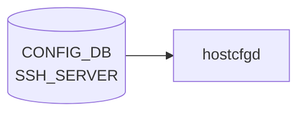

# SSH_SERVER テーブル — base フィールドデフォルト

## 概要

`SSH_SERVER|POLICIES` テーブルの全フィールドについて、[YANG](../../reference/glossary.md#term-yang) モデルが宣言する `default` 値と `hostcfgd` コードが適用する暗黙的な fallback 値を整理したリファレンスページ[^1]。

テーブル未設定時の挙動: `SshServer.load()` が `self.policies = {}` をセットし `set_policies()` を呼ばないため、`/etc/ssh/sshd_config` は変更されない。実効デフォルトは OS（Debian）の sshd 初期値となる。

<!-- cdb-mermaid -->
### データフロー (自動生成)



!!! note "凡例"
    CONFIG_DB から SAI までの典型経路を `docs/reference/config-db-orch-map.md` から機械生成したミニ図。詳細・例外は本ページ本文と対応表を参照。
<!-- /cdb-mermaid -->

## key 構造

```text
SSH_SERVER|POLICIES
```

固定キー `POLICIES` のみのシングルトン container。

<!-- defaults -->
## フィールド暗黙デフォルト (コード由来)

[YANG](../../reference/glossary.md#term-yang) `default` 宣言値と、フィールド不在時にコードまたは sshd が適用する実効デフォルトの対応表。

| フィールド | YANG default | コード由来暗黙デフォルト | 実効 sshd_config 値 | 根拠 |
|-----------|-------------|------------------------|-------------------|------|
| `authentication_retries` | **6** | なし | `MaxAuthTries 6` | `sonic-ssh-server.yang` L27 |
| `login_timeout` | **120** | なし | `LoginGraceTime 120` | `sonic-ssh-server.yang` L34 |
| `ports` | **`"22"`** | なし | `Port 22` | `sonic-ssh-server.yang` L41 |
| `inactivity_timeout` | **15** (分) | 分→秒変換 (×60) → **900** 秒 | `ClientAliveInterval 900` | `sonic-ssh-server.yang` L51; `hostcfgd` L1129 |
| `max_sessions` | **0** | `0` → PAM 設定なし (`None`) | PAM limits 非出力 = 無制限 | `hostcfgd` L1440-1441 |
| `password_authentication` | **`true`** | `"false"`→`"no"`, その他→`"yes"` | `PasswordAuthentication yes` | `sonic-ssh-server.yang` L75; `hostcfgd` L1132 |
| `permit_root_login` | なし | DB 不在 → sshd 組み込みデフォルト | `prohibit-password` (OpenSSH 7.7+) | `sonic-ssh-server.yang` L63-71 |
| `ciphers` | なし | DB 不在 → OpenSSH デフォルト suite | Ciphers 行なし | `sonic-ssh-server.yang` L77-91 |
| `kex_algorithms` | なし | DB 不在 → OpenSSH デフォルト suite | KexAlgorithms 行なし | `sonic-ssh-server.yang` L92-110 |
| `macs` | なし | DB 不在 → OpenSSH デフォルト suite | MACs 行なし | `sonic-ssh-server.yang` L111-131 |

### `inactivity_timeout` — 単位変換 discrepancy

YANG の `description` は "minutes" と明記しているが、変換処理（`× 60`）は [hostcfgd](../../reference/glossary.md#term-hostcfgd) 内部にのみ存在する。YANG 型 `uint32` には単位情報がないため、コードを読まないと単位が分であることが分からない。

```python
# hostcfgd L1129-1131
if key == "inactivity_timeout":
    # translate min to sec.
    value = int(value) * 60
```

### `max_sessions` — sshd_config 非反映 discrepancy

`max_sessions` は `SSH_CONFIG_NAMES` に含まれていないため `sshd_config` の `MaxSessions` には反映されない。代わりに `PamLimitsCfg` が PAM limits（`/etc/security/limits.d/`）に書き込む。

```python
# hostcfgd L1440-1441
max_sess_cfg = ssh_server_policies.get('max_sessions', 0)
self.max_sessions = max_sess_cfg if max_sess_cfg != 0 else None
```

OpenSSH の `MaxSessions`（同時チャンネル数上限）とは別概念であることに注意。

### `authentication_retries` — YANG/hostcfgd min 差異

YANG range は `1..100` だが [hostcfgd](../../reference/glossary.md#term-hostcfgd) の `SSH_MIN_VALUES["authentication_retries"] = 3` が実効最小値。値 1〜2 は YANG バリデーション通過後に [hostcfgd](../../reference/glossary.md#term-hostcfgd) が ERR ログを出してスキップする。

### `permit_root_login` — YANG default 欠如

YANG に `default` 宣言がない。DB に設定しない場合は sshd の組み込みデフォルト（OpenSSH 7.7+ では `prohibit-password`）が有効となる。

<!-- evidence: sonic-host-services/scripts/hostcfgd L61-75 (SSH_CONFIG_NAMES dict) -->
<!-- evidence: sonic-host-services/scripts/hostcfgd L1045-1175 (SshServer.set_policies) -->
<!-- evidence: sonic-host-services/scripts/hostcfgd L1418-1441 (PamLimitsCfg.read_max_sessions_config) -->
<!-- evidence: sonic-buildimage/src/sonic-yang-models/yang-models/sonic-ssh-server.yang L20-135 -->
<!-- /defaults -->

<!-- ordering -->
## 書込み順依存


### 先行必須テーブル

`SSH_SERVER|POLICIES` は他 [CONFIG_DB](../../reference/glossary.md#term-config_db) テーブルへの leafref を持たないため、書き込み前に先行必須テーブルは存在しない。

| テーブル | 要否 | 理由 |
|---------|------|------|
| `DEVICE_METADATA\|localhost` | 任意（実質必須） | `PamLimitsCfg.update_config_file()` は `SSH_SERVER` と `DEVICE_METADATA` の両方が不在の場合に早期 return（`hostcfgd` L1430）。通常の [SONiC](../../reference/glossary.md#term-sonic) デプロイでは常に存在 |
| その他 [CONFIG_DB](../../reference/glossary.md#term-config_db) テーブル | なし | `SshServer.set_policies()` は外部 OID 参照なし |

### 起動時シーケンス

```
hostcfgd 起動
  │
  ├─ PamLimitsCfg.__init__() + update_config_file()   # L2191-2192
  │   └─ SSH_SERVER が存在しなくても KeyError を catch してスキップ
  ├─ SshServer.__init__()                              # L2201
  │   └─ policies = {} のみ。sshd_config は変更しない
  │
  ├─ wait_till_system_init_done()  # systemd target 待機
  │
  ├─ sshscfg.load(ssh_server)   # L2265
  │   └─ modify_conf_file() → set_policies()
  │       ├─ copy2(sshd_config → sshd_config.tmp)
  │       ├─ フィールドごとに modify_single_file_inplace で行内置換/追記
  │       ├─ sshd -T -f sshd_config.tmp  (検証)
  │       │   ├─ OK  → rename tmp→本番, systemctl restart ssh
  │       │   └─ NG  → remove tmp (ロールバック), ERR ログのみ
  │       └─ ※ max_sessions は continue でスキップ（PAM 管理）
  │
  ├─ pamLimitsCfg.update_config_file()   # L2277 (2 回目、確定値で上書き)
  │
  └─ subscribe('SSH_SERVER', ssh_handler)   # L2478
      └─ ssh_handler → policies_update() + update_config_file()
```

### sshd 検証ゲート

`set_policies()` の末尾で `sshd -T -f <tmp>` を実行し、非ゼロの場合は tmp を削除してロールバック（`systemctl restart ssh` もスキップ）。フィールド単位のロールバックは行われない（全フィールド適用 or 全棄却）。

### max_sessions の書込み先分離

`max_sessions` は `SSH_CONFIG_NAMES` に含まれず `set_policies()` 内で `continue`（スキップ）される。代わりに後続の `PamLimitsCfg.update_config_file()` が `/etc/security/limits.conf` に `maxsyslogins` として書き込む。このため `ssh_handler` では sshd_config 更新 → PAM limits 更新の順序が固定されている。

<!-- evidence: sonic-host-services/scripts/hostcfgd L1045-1161 (SshServer クラス) -->
<!-- evidence: sonic-host-services/scripts/hostcfgd L2191-2277 (HostConfigDaemon.__init__ / load) -->
<!-- evidence: sonic-host-services/scripts/hostcfgd L2297-2299 (ssh_handler) -->
<!-- evidence: sonic-host-services/scripts/hostcfgd L2478 (subscribe SSH_SERVER) -->

<!-- /ordering -->

<!-- cross-refs -->
## 暗黙テーブル参照


`SSH_SERVER|POLICIES` テーブルは YANG leafref を持たない。ただし `hostcfgd` の `SshServer` クラスおよび `PamLimitsCfg` クラスが以下の暗黙参照を持つ。

| 参照先 | 方向 | 条件 | 根拠 |
|-------|------|------|------|
| `CONFIG_DB DEVICE_METADATA\|localhost` | 読み取り | PAM limits early-return ガード | `hostcfgd` L1430 |
| `/etc/ssh/sshd_config` | 読み取り + 書き込み | `set_policies()` 実行時 (常時) | `hostcfgd` L1113, L1142 |
| `/etc/security/limits.conf` | 書き込み | `update_config_file()` が early-return しないとき | `hostcfgd` L1468–1475 |
| `/etc/pam.d/pam-limits-conf` | 書き込み | 同上 | `hostcfgd` L1460–1466 |
| `systemd ssh.service` | `systemctl restart` | `sshd -T` 検証成功後 | `hostcfgd` L1152–1155 |
| `/usr/sbin/sshd` バイナリ | 外部実行 | `sshd -T -f <tmp>` 検証 | `hostcfgd` L1150–1160 |

### `DEVICE_METADATA|localhost` — PAM limits ガード

`PamLimitsCfg.update_config_file()` は `SSH_SERVER|POLICIES` と `DEVICE_METADATA|localhost` の両方が不在の場合のみ early-return する（どちらか一方が存在すれば続行）。通常の [SONiC](../../reference/glossary.md#term-sonic) デプロイでは `DEVICE_METADATA|localhost` は必ず存在する。

```python
# hostcfgd L1430
if "localhost" not in device_metadata and "POLICIES" not in ssh_server_policies:
    return
```

### sshd_config — 読み書き両方向

`set_policies()` は既存の `/etc/ssh/sshd_config` を一時ファイルにコピーし、フィールドごとに `modify_single_file_inplace` で行内置換/追記した後、`sshd -T` で検証してから rename する。ファイルが存在しない場合はコピー失敗で例外が発生し、ERR ログのみ記録されて sshd は再起動されない。

### PAM limits ファイル — max_sessions の最終書き込み先

`max_sessions` は `SSH_CONFIG_NAMES` に含まれず `sshd_config` には反映されない。`PamLimitsCfg.render_conf_file()` が Jinja2 テンプレート（`limits.conf.j2`）経由で `/etc/security/limits.conf` に書き込む。書き込み先が存在しない場合は例外をキャッチして ERR ログのみ記録。

<!-- evidence: sonic-host-services/scripts/hostcfgd L1113 (copy2 sshd_config) -->
<!-- evidence: sonic-host-services/scripts/hostcfgd L1142 (modify_single_file_inplace) -->
<!-- evidence: sonic-host-services/scripts/hostcfgd L1150-1160 (sshd -T 検証ゲート) -->
<!-- evidence: sonic-host-services/scripts/hostcfgd L1152-1155 (systemctl restart ssh) -->
<!-- evidence: sonic-host-services/scripts/hostcfgd L1430 (DEVICE_METADATA early-return) -->
<!-- evidence: sonic-host-services/scripts/hostcfgd L1460-1475 (render_conf_file PAM) -->

<!-- /cross-refs -->

<!-- failure -->
## 失敗挙動


### SET 処理における失敗経路（SshServer.set_policies）

| 失敗条件 | 検出箇所 | 結果 | ログ出力 |
|---------|---------|------|---------|
| `ports` リストが空、またはポート番号が整数型 | `handle_ports_set()` L1091-1095 | `set_policies()` がその時点で `return`。**全フィールド**が破棄される（前回の `sshd_config` を維持） | `LOG_ERR`: "Failed to update sshd config files - wrong port configuration" / "port num value {} in wrong format" |
| ポート番号が 1〜65535 の範囲外 | `handle_ports_set()` L1097-1100 | 同上 | `LOG_ERR`: "Ssh port {} out of range" |
| 整数フィールド（`authentication_retries` 等）が min/max 範囲外 | `set_policies()` L1122-1124 | そのフィールドのみ `continue`（スキップ）。残フィールドは適用続行 | `LOG_ERR`: "Ssh {} {} out of range" |
| 未知のキー（`SSH_CONFIG_NAMES` に無く `max_sessions` でもない） | `set_policies()` L1148 | そのフィールドのみスキップ（処理継続） | `LOG_ERR`: "Failed to update sshd config file - wrong key {}" |
| `sshd -T -f sshd_config.tmp` が非ゼロ失敗 | `set_policies()` L1150-1160 | `sshd_config.tmp` を削除してロールバック。今回の**全変更**が破棄される | `LOG_ERR`: "Failed to update sshd config file - sshd -T returned {} with error {}" |
| `systemctl restart ssh` が例外 | `set_policies()` L1152-1157 | 例外を catch して ERR ログのみ。`sshd_config` は書き換え済みだが ssh サービスが未再起動（不整合状態） | `LOG_ERR`: "Failed to update sshd config file" |
| `copy2(SSH_CONFG, SSH_CONFG_TMP)` が `OSError` | `set_policies()` L1113 | 例外が未捕捉で伝播。`set_policies()` 全体が中断 | スタックトレースが syslog へ |

### PAM limits 失敗経路（PamLimitsCfg.render_conf_file）

| 失敗条件 | 検出箇所 | 結果 | ログ出力 |
|---------|---------|------|---------|
| Jinja2 テンプレートレンダリング例外 | `render_conf_file()` L1459-1478 | `except Exception` で捕捉。PAM limits ファイル未更新 | `LOG_ERR`: "modify pam_limits config file failed with exception: {}" |
| PAM limits ファイルへの `open(..., 'w')` が `OSError` | `render_conf_file()` L1469, L1476 | 同上 | 同上 |
| `get_table('SSH_SERVER')` で `KeyError` | `update_config_file()` L1425-1427 | `except KeyError` で silent skip。`max_sessions` は前回値を維持 | なし |

### ロールバック粒度

```
ports 失敗          → set_policies() 全体が return（全フィールド破棄）
sshd -T 失敗        → sshd_config.tmp 削除（全変更ロールバック）
個別フィールド範囲外 → そのフィールドのみ continue（他フィールドは適用）
systemctl 失敗      → sshd_config 書き換え済み・ssh 未再起動（不整合）
PAM limits 例外     → except で吸収・ログのみ・PAM ファイル未変更
```

<!-- evidence: sonic-host-services/scripts/hostcfgd L1091-1100 (handle_ports_set 失敗条件) -->
<!-- evidence: sonic-host-services/scripts/hostcfgd L1110-1160 (set_policies 全体) -->
<!-- evidence: sonic-host-services/scripts/hostcfgd L1117-1119 (ports 失敗 return) -->
<!-- evidence: sonic-host-services/scripts/hostcfgd L1122-1124 (INT_VALUES 範囲外 continue) -->
<!-- evidence: sonic-host-services/scripts/hostcfgd L1148 (unknown key ERR + continue) -->
<!-- evidence: sonic-host-services/scripts/hostcfgd L1150-1160 (sshd -T gate + rollback) -->
<!-- evidence: sonic-host-services/scripts/hostcfgd L1152-1157 (systemctl restart 例外 catch) -->
<!-- evidence: sonic-host-services/scripts/hostcfgd L1459-1478 (render_conf_file 例外 catch) -->
<!-- evidence: sonic-host-services/scripts/hostcfgd L1425-1427 (get_table KeyError catch) -->

<!-- /failure -->

<!-- constants -->
## ハードコード定数


`hostcfgd` の `SshServer` クラスおよび `PamLimitsCfg` クラスが参照するモジュールレベル定数の一覧。これらの値はコードに直書きされており、[CONFIG_DB](../../reference/glossary.md#term-config_db) や YANG から変更できない。

### 整数フィールドの min / max 制約

```python
# hostcfgd L62-66
SSH_INT_VALUES = ["authentication_retries", "login_timeout", "inactivity_timeout", "max_sessions"]

SSH_MIN_VALUES = {
    "authentication_retries": 3,
    "login_timeout": 1,
    "ports": 1,
    "inactivity_timeout": 0,
    "max_sessions": 0,
}

SSH_MAX_VALUES = {
    "authentication_retries": 100,
    "login_timeout": 600,
    "ports": 65535,
    "inactivity_timeout": 35000,
    "max_sessions": 100,
}
```

| フィールド | min | max | 備考 |
|-----------|----:|----:|------|
| `authentication_retries` | **3** | **100** | YANG range は `1..100` だがコード側 min が 3 に切り上げられる |
| `login_timeout` | **1** | **600** | 秒単位 |
| `ports` | **1** | **65535** | ポート番号の有効範囲 |
| `inactivity_timeout` | **0** | **35000** | 分単位（コードが秒に変換）。YANG range は `0..35000` と一致 |
| `max_sessions` | **0** | **100** | `0` は PAM limits 非設定（無制限）を意味する |

### sshd_config フィールド名マッピング

```python
# hostcfgd L67-79
SSH_CONFIG_NAMES = {
    "authentication_retries": "MaxAuthTries",
    "login_timeout":          "LoginGraceTime",
    "ports":                  "Port",
    "inactivity_timeout":     "ClientAliveInterval",
    "permit_root_login":      "PermitRootLogin",
    "password_authentication":"PasswordAuthentication",
    "ciphers":                "Ciphers",
    "kex_algorithms":         "KexAlgorithms",
    "macs":                   "MACs",
}
```

`max_sessions` はこのマッピングに含まれない（PAM limits 経由で書き込まれる）。

### ファイルパス定数

| 定数名 | 値 | 用途 |
|-------|----|------|
| `SSH_CONFG` | `/etc/ssh/sshd_config` | SSH サーバ設定ファイル（読み書き） |
| `SSH_CONFG_TMP` | `/etc/ssh/sshd_config.tmp` | 検証用一時ファイル |
| `PAM_LIMITS_CONF_TEMPLATE` | `/usr/share/sonic/templates/pam_limits.j2` | PAM limits Jinja2 テンプレート |
| `LIMITS_CONF_TEMPLATE` | `/usr/share/sonic/templates/limits.conf.j2` | limits.conf Jinja2 テンプレート |
| `PAM_LIMITS_CONF` | `/etc/pam.d/pam-limits-conf` | PAM pam-limits-conf 出力先 |
| `LIMITS_CONF` | `/etc/security/limits.conf` | PAM limits.conf 出力先 |
| `ETC_PAMD_SSHD` | `/etc/pam.d/sshd` | PAM sshd 設定ファイル（認証バックエンド切替時に使用） |

<!-- evidence: sonic-host-services/scripts/hostcfgd L32-33 (SSH_CONFG / SSH_CONFG_TMP) -->
<!-- evidence: sonic-host-services/scripts/hostcfgd L50 (ETC_PAMD_SSHD) -->
<!-- evidence: sonic-host-services/scripts/hostcfgd L61-84 (SSH_INT_VALUES / SSH_MIN_VALUES / SSH_MAX_VALUES / SSH_CONFIG_NAMES / PAM定数) -->

<!-- /constants -->

<!-- side-effects -->
## 副次 DB 書込


CONFIG_DB `SSH_SERVER|POLICIES` の変更に伴って `hostcfgd` の `SshServer` / `PamLimitsCfg` ハンドラが副次的に書き込む DB エントリは **存在しない**。副作用はすべて Linux ホスト OS のファイル書換とサービス再起動に閉じる。

| 副次 DB | 書込有無 | 根拠 |
|--------|---------|------|
| [APPL_DB](../../reference/glossary.md#term-appl_db) | なし | `SshServer` および `PamLimitsCfg` クラス全域（`hostcfgd` L1020–1490）に `set(` / `hset(` / `Producer` / `Notification` 呼出が 0 件 |
| [STATE_DB](../../reference/glossary.md#term-state_db) | なし | `hostcfgd` の `STATE_DB` 書込は `FipsCfg`（L1759–1821）と `RestartWaiter`（L2160–2162）のみ。SSH 処理パスには存在しない |
| [COUNTERS_DB](../../reference/glossary.md#term-counters_db) | なし | `hostcfgd` 全体に [COUNTERS_DB](../../reference/glossary.md#term-counters_db) 参照なし。SSH は [SAI](../../reference/glossary.md#term-sai) 非経由でスイッチ ASICと無関係 |
| [ASIC_DB](../../reference/glossary.md#term-asic_db) / [FLEX_COUNTER_DB](../../reference/glossary.md#term-flex_counter_db) | なし | [SAI](../../reference/glossary.md#term-sai) 非経由。`orchagent` は `SSH_SERVER` テーブルを購読しない |

### Linux ホスト OS への副次書込（DB 外）

`SshServer.set_policies()` および `PamLimitsCfg` が行うファイルシステム側の副次書込を以下に示す。

| 書込先 | 操作 | 条件 | 根拠 |
|-------|------|------|------|
| `/etc/ssh/sshd_config` | `copy2` → `modify_single_file_inplace` → `os.rename` | `set_policies()` 実行時（フィールド変更のたびに必ず実行） | `hostcfgd` L1113, L1142, L1152 |
| `ssh.service` | `systemctl restart ssh` | `sshd -T` 検証が成功した場合のみ | `hostcfgd` L1154 |
| `/etc/security/limits.conf` | Jinja2 テンプレート (`limits.conf.j2`) から再生成 | `PamLimitsCfg.update_config_file()` 呼出時 | `hostcfgd` L1469–1476 |
| `/etc/pam.d/pam-limits-conf` | Jinja2 テンプレート (`pam_limits.j2`) から再生成 | 同上 | `hostcfgd` L1460–1466 |

`systemctl restart ssh` は既存 SSH セッションを切断しないが、新規接続受付が瞬断する（`sshd -T` 検証付きのため安全）。

<!-- evidence: sonic-host-services/scripts/hostcfgd L1020-1170 (SshServer クラス全体) -->
<!-- evidence: sonic-host-services/scripts/hostcfgd L1410-1490 (PamLimitsCfg クラス全体) -->
<!-- evidence: sonic-host-services/scripts/hostcfgd L1154 (systemctl restart ssh) -->
<!-- evidence: sonic-host-services/scripts/hostcfgd L1460-1476 (render_conf_file PAM) -->
<!-- evidence: sonic-host-services/scripts/hostcfgd L1759-1821 (FipsCfg STATE_DB 参照) -->

<!-- /side-effects -->

<!-- pubsub -->
## 通信メカニズム


### Redis 購読方式

`SSH_SERVER` テーブルへの変更通知は、`hostcfgd` が **`ConfigDBConnector.subscribe()` + `listen()`** で登録する **[Redis](../../reference/glossary.md#term-redis) keyspace 通知 (PSUBSCRIBE `__keyspace@<dbId>__:SSH_SERVER|*`)** によって配信される。`swsscommon.SubscriberStateTable` や `ConsumerStateTable`（channel ベース PUBLISH/SUBSCRIBE）は使用しない。CONFIG_DB は永続前提のため TTL は設定されない。

| 購読者 | 購読 API | 購読テーブル | ハンドラ |
|--------|---------|--------------|---------|
| `hostcfgd` (`SshServer` / `PamLimitsCfg` 経由) | `ConfigDBConnector.subscribe()` | `SSH_SERVER` | `ssh_handler` → `policies_update()` + `update_config_file()` |

`hostcfgd` 以外で `SSH_SERVER` テーブルを購読するプロセスは存在しない（`orchagent` / `syncd` / `mgrd` 等は SSH 設定テーブルを購読しない）。

### keyspace 通知 → ハンドラ呼び出しの流れ

```
config ssh-server policies authentication-retries 5
  ↓ HSET "SSH_SERVER|POLICIES" authentication_retries "5"
Redis keyspace PUBLISH "__keyspace@4__:SSH_SERVER|POLICIES"  "hset"
  ↓ ConfigDBConnector.listen() がパターンマッチ
make_callback() で (key, op, data) を生成
  ↓ HGETALL "SSH_SERVER|POLICIES"  ← 通知後に値を再取得
ssh_handler(key="POLICIES", op=SET, data={authentication_retries:"5"})
  ↓ SshServer.policies_update() → set_policies()
  │   ├─ copy2(sshd_config → sshd_config.tmp)
  │   ├─ modify_single_file_inplace でフィールド行内置換/追記
  │   ├─ sshd -T -f sshd_config.tmp  (検証)
  │   │   ├─ OK  → rename tmp→本番, systemctl restart ssh
  │   │   └─ NG  → remove tmp (ロールバック)
  │   └─ max_sessions は continue でスキップ
  └─ PamLimitsCfg.update_config_file()
      └─ Jinja2 テンプレートで /etc/security/limits.conf を再生成
```

- keyspace 通知のペイロードは操作名（`hset`/`del` 等）のみ。フィールド値は `HGETALL` で取得する。
- `op` は `data is None ? DEL : SET` で 2 値判定。`HDEL` / `HSET` の [Redis](../../reference/glossary.md#term-redis) 操作種別自体は区別しない。
- 起動時は `config_db.listen(init_data_handler=self.load)`（hostcfgd:2534）により、Subscribe ループ開始前に `SshServer.load()` が `init_data['SSH_SERVER']` を一括スナップショットで適用する。

### サービス再起動トリガー

| 契機 | 操作 | コード |
|------|------|--------|
| `SSH_SERVER` 変更 + `sshd -T` 検証成功 | `systemctl restart ssh` | `SshServer.set_policies()` — hostcfgd:1154 |
| `SSH_SERVER` 変更（常時） | `/etc/security/limits.conf` + `/etc/pam.d/pam-limits-conf` 再生成 | `PamLimitsCfg.update_config_file()` — hostcfgd:1460-1476 |
| `sshd -T` 検証失敗 | サービス再起動なし（`sshd_config.tmp` を削除してロールバック） | hostcfgd:1158-1160 |

<!-- evidence: sonic-host-services/scripts/hostcfgd L2478 (subscribe SSH_SERVER) -->
<!-- evidence: sonic-host-services/scripts/hostcfgd L2534 (listen init_data_handler) -->
<!-- evidence: sonic-host-services/scripts/hostcfgd L2244,2265 (init_data SSH_SERVER + sshscfg.load) -->
<!-- evidence: sonic-host-services/scripts/hostcfgd L2297-2299 (ssh_handler) -->
<!-- evidence: sonic-host-services/scripts/hostcfgd L1045-1075 (SshServer.load / policies_update) -->
<!-- evidence: sonic-host-services/scripts/hostcfgd L1110-1162 (set_policies + sshd -T gate) -->
<!-- evidence: sonic-host-services/scripts/hostcfgd L1154 (systemctl restart ssh) -->
<!-- evidence: sonic-host-services/scripts/hostcfgd L1418-1490 (PamLimitsCfg.update_config_file) -->

<!-- /pubsub -->

<!-- platform -->
## プラットフォーム差


`SSH_SERVER|POLICIES` の処理は **全プラットフォームで同一**。`class SshServer` と `class PamLimitsCfg` を `platform|multi_asic|is_multi_npu|chassis|asic[0-9]|namespace|vendor` で grep しても **0 ヒット** であり、機種依存分岐コードが存在しない。

### hostcfgd は host 単一インスタンス（multi-asic 非考慮）

`hostcfgd` (行 2166-2167) は `ConfigDBConnector()` を引数なしで生成し host namespace の CONFIG_DB のみに接続する。`self.is_multi_npu = device_info.is_multi_npu()` (行 2182) は取得されるが `SshServer` / `PamLimitsCfg` 経路には渡されない。

| 構成 | SSH_SERVER テーブルの所在 | SSH 設定適用先 | 備考 |
|------|--------------------------|---------------|------|
| single-[ASIC](../../reference/glossary.md#term-asic) (T0/T1) | host CONFIG_DB のみ | `/etc/ssh/sshd_config`（host） | 標準構成 |
| multi-[ASIC](../../reference/glossary.md#term-asic) (複数 [NPU](../../reference/glossary.md#term-npu)) | host CONFIG_DB のみ（asicN namespace には非存在） | 同上 | `is_multi_npu` は SSH 経路で未参照 |
| [VOQ](../../reference/glossary.md#term-voq) chassis (line card) | 各 line card host の CONFIG_DB | 各 host の sshd_config | line card 独立管理 |
| [VOQ](../../reference/glossary.md#term-voq) chassis (supervisor) | supervisor host の CONFIG_DB | supervisor host の sshd_config | chassis 全体集中管理なし |
| [SmartSwitch](../../reference/glossary.md#term-smartswitch) ([NPU](../../reference/glossary.md#term-npu) 側) | host CONFIG_DB | host の sshd_config | [DPU](../../reference/glossary.md#term-dpu) 側に hostcfgd は別インスタンス |

### YANG スキーマに機種分岐なし

`sonic-ssh-server.yang` を `platform|asic|chassis|namespace|vendor|multi` で grep すると `namespace "http://github.com/sonic-net/sonic-ssh-server"` のみにヒット。deviation・augment によるプラットフォーム別スキーマ差は存在しない。

### sshd バイナリはパッケージ提供（ベンダー非依存）

`sshd` は `openssh-server` Debian パッケージが提供する標準バイナリ。`sonic-buildimage/files/image_config/` に SSH 固有のプラットフォーム別オーバーレイは存在しない（`find files/image_config -iname "*ssh*"` 0 ヒット）。community [SONiC](../../reference/glossary.md#term-sonic) master 全機種で同一バイナリ・同一設定パスが使用される。

<!-- evidence: sonic-host-services/scripts/hostcfgd L1045-1161 (SshServer — platform 分岐なし) -->
<!-- evidence: sonic-host-services/scripts/hostcfgd L1418-1490 (PamLimitsCfg — platform 分岐なし) -->
<!-- evidence: sonic-host-services/scripts/hostcfgd L2166-2201 (hostcfgd.__init__ — is_multi_npu は SshServer に渡されない) -->
<!-- evidence: sonic-buildimage/src/sonic-yang-models/yang-models/sonic-ssh-server.yang (platform deviation なし) -->
<!-- /platform -->

<!-- ref-triangle:start -->

## 関連リファレンス

- [YANG](../../reference/glossary.md#term-yang): [`sonic-ssh-server`](../yang/sonic-ssh-server.md)
- [CONFIG_DB リファレンス: SSH_SERVER](ssh-server.md)

<!-- ref-triangle:end -->

## 引用元

[^1]: `src/sonic-yang-models/yang-models/sonic-ssh-server.yang` (container `SSH_SERVER` / container `POLICIES`). <https://github.com/sonic-net/sonic-buildimage/blob/9ea932ec2e18f35e58268ec2e4456b1d4afd65cd/src/sonic-yang-models/yang-models/sonic-ssh-server.yang>

<!-- glossary-links-injected: 216039880b1a -->
