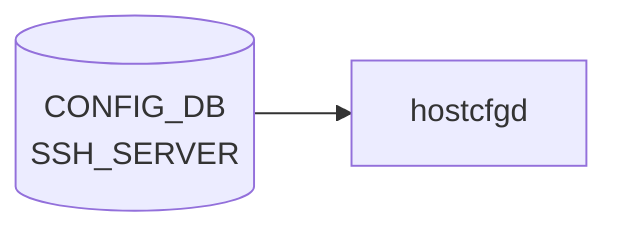

# SSH_SERVER テーブル

## 概要

SSH サーバのグローバル設定を [CONFIG_DB](../../reference/glossary.md#term-config_db) に保持するテーブル[^1]。`hostcfgd` の `SshServer` クラスが変更を検知し、`/etc/ssh/sshd_config` を書き換えて `ssh` サービスを再起動する。最大セッション数 (`max_sessions`) のみ `PamLimitsCfg` が `/etc/security/limits.conf` 経由で制御する。

<!-- cdb-mermaid -->
### データフロー (自動生成)



!!! note "凡例"
    CONFIG_DB から SAI までの典型経路を `docs/reference/config-db-orch-map.md` から機械生成したミニ図。詳細・例外は本ページ本文と対応表を参照。
<!-- /cdb-mermaid -->

## key 構造

```text
SSH_SERVER|POLICIES
```

key は `POLICIES` 固定のシングルトンテーブル。

## フィールド

| フィールド | 型 | デフォルト | 説明 |
|-----------|----|-----------|----|
| `authentication_retries` | uint32 (1–100) | `6` | SSH 接続ごとの最大認証試行回数 |
| `login_timeout` | uint32 (1–600) | `120` | 認証完了までの最大時間 (秒) |
| `ports` | string (コンマ区切りポート番号) | `"22"` | SSH デーモンがリッスンする TCP ポートリスト |
| `inactivity_timeout` | uint32 (0–35000) | `15` | セッション無操作タイムアウト (分, 0=無効) |
| `max_sessions` | uint32 (0–100) | `0` | 同時ログイン最大数 (0=無制限) |
| `permit_root_login` | enum | — | root ログイン可否 (`yes`/`prohibit-password`/`forced-commands-only`/`no`) |
| `password_authentication` | boolean | `true` | パスワード認証を許可するか |
| `ciphers` | list[enum] | — | 許可する暗号アルゴリズムリスト |
| `kex_algorithms` | list[enum] | — | 許可する鍵交換アルゴリズムリスト |
| `macs` | list[enum] | — | 許可する MAC アルゴリズムリスト |

## 制約

- `authentication_retries`: [YANG](../../reference/glossary.md#term-yang) range `1..100`, [hostcfgd](../../reference/glossary.md#term-hostcfgd) 実効最小値 `3` (1–2 は YANG 通過後 [hostcfgd](../../reference/glossary.md#term-hostcfgd) が ERR ログ出力してスキップ)
- `login_timeout`: YANG/[hostcfgd](../../reference/glossary.md#term-hostcfgd) ともに `1..600`
- `inactivity_timeout`: `0..35000` 分 (0 で無効化)
- `max_sessions`: `0..100` (0 で無制限)
- `ports`: カンマ区切り; 各値 `1..65535`
- `permit_root_login`: enum `yes` / `prohibit-password` / `forced-commands-only` / `no`
- `ciphers` / `kex_algorithms` / `macs`: YANG が定義する enumeration 値のみ許可

## 購読者

- `hostcfgd` (`sonic-host-services` の `SshServer` クラス): `CONFIG_DB` 変更を購読 → `/etc/ssh/sshd_config` を書き換え → `systemctl restart ssh`
- `hostcfgd` (`PamLimitsCfg` クラス): `max_sessions` のみ `/etc/security/limits.conf` の `maxsyslogins` に書き込む

## 関連 CONFIG_DB / YANG / CLI

- 関連 [YANG](../../reference/glossary.md#term-yang): `sonic-ssh-server`
- 関連 CLI: `config ssh-server` ([sonic-utilities](../../reference/glossary.md#term-sonic-utilities))

<!-- cdb-exceptions -->
## 例外条件・特殊挙動

| 条件 | 挙動 |
|------|------|
| `SSH_SERVER|POLICIES` が DB に存在しない | `SshServer.load()` が `self.policies = {}` をセット; `set_policies()` は呼ばれず `/etc/ssh/sshd_config` は変更されない (OS デフォルト維持) |
| `authentication_retries` が 1 または 2 | YANG バリデーションは通過するが hostcfgd が ERR ログ出力してそのフィールドの適用をスキップ |
| `max_sessions` が `0` | `PamLimitsCfg.read_max_sessions_config()` が `self.max_sessions = None` にセット; limits.conf に `maxsyslogins` 行を書かない (無制限) |
| `password_authentication` に `"false"` (文字列) | hostcfgd が `value.lower() in ["false"]` を判定して `"no"` に変換 |
| `ciphers` / `kex_algorithms` / `macs` が空リスト | `",".join([])` → 空文字列 → sshd_config に `Ciphers ` (値なし) が書かれる可能性あり; 実際の動作は sshd のバリデーション依存 |
| sshd -T バリデーション失敗 | `set_policies()` が tmp ファイルを削除; `/etc/ssh/sshd_config` は変更されない; syslog ERR のみ |

<!-- /cdb-exceptions -->

<!-- value-behavior -->
## 値依存挙動マトリクス

### `inactivity_timeout` (uint32 — 分単位)

| 値 | 効果 | evidence |
|---|---|---|
| `0` | タイムアウト無効 (`ClientAliveInterval 0`) | `sonic-ssh-server.yang:range 0..35000` |
| `1..35000` | `ClientAliveInterval = 値 × 60` (秒) を sshd_config に書く | `hostcfgd:1129-1131` |

### `max_sessions` (uint32)

| 値 | 挙動 | evidence |
|---|---|---|
| `0` | `self.max_sessions = None` → limits.conf に書かない (無制限) | `hostcfgd:1440-1441` |
| `1..100` | `* - maxsyslogins <値>` を `/etc/security/limits.conf` に書く | `hostcfgd:1473` |

### `permit_root_login` (enum)

| 値 | sshd_config 出力 | 意味 |
|---|---|---|
| `yes` | `PermitRootLogin yes` | root のパスワード/鍵ログイン両方許可 |
| `prohibit-password` | `PermitRootLogin prohibit-password` | root の公開鍵ログインのみ許可 (推奨) |
| `forced-commands-only` | `PermitRootLogin forced-commands-only` | 強制コマンド付き公開鍵のみ許可 |
| `no` | `PermitRootLogin no` | root ログイン完全禁止 |

### `password_authentication` (boolean)

| DB 値 | 変換後 | sshd_config 出力 |
|---|---|---|
| `true` / `"true"` / `"yes"` / 非 `"false"` 文字列 | `"yes"` | `PasswordAuthentication yes` |
| `false` / `"false"` | `"no"` | `PasswordAuthentication no` |

<!-- /value-behavior -->

<!-- ref-triangle:start -->

## 関連リファレンス

- [YANG](../../reference/glossary.md#term-yang): [`sonic-ssh-server`](../yang/sonic-ssh-server.md)

<!-- ref-triangle:end -->

## 引用元

[^1]: `src/sonic-yang-models/yang-models/sonic-ssh-server.yang` (container `SSH_SERVER` / container `POLICIES`). <https://github.com/sonic-net/sonic-buildimage/blob/9ea932ec2e18f35e58268ec2e4456b1d4afd65cd/src/sonic-yang-models/yang-models/sonic-ssh-server.yang>

<!-- ops-hint -->
## 運用ヒント

### 典型設定例

```json
{
    "SSH_SERVER": {
        "POLICIES": {
            "authentication_retries": "6",
            "login_timeout": "120",
            "ports": "22",
            "inactivity_timeout": "15",
            "max_sessions": "0",
            "permit_root_login": "prohibit-password",
            "password_authentication": "true"
        }
    }
}
```

### 確認コマンド

```bash
sonic-db-cli CONFIG_DB hgetall 'SSH_SERVER|POLICIES'
show ssh-server policies
```

### よくある誤設定

- `ports` を変更後に管理端末からの接続が切れる場合: 旧ポートと新ポートを両方 `ports` にカンマ区切りで指定してから移行する
- `max_sessions` を 0 にしても制限されないように見える場合: limits.conf が正しく適用されているか `/etc/security/limits.conf` を確認する
<!-- /ops-hint -->

<!-- runtime-trace -->
## 実コンテナ動作トレース

### 段階 1 — Consumer 登録

`hostcfgd` が起動時に `CONFIG_DB` を購読。

```python
# hostcfgd:2478
self.config_db.subscribe('SSH_SERVER', make_callback(self.ssh_handler))
```

### 段階 2 — 初期ロード

```python
# hostcfgd:2245,2265
ssh_server = init_data['SSH_SERVER']
self.sshscfg.load(ssh_server)
```

`SshServer.load()` が `POLICIES` キーの有無を確認し、存在すれば `policies_update()` → `set_policies()` を呼ぶ。

### 段階 3 — 設定ファイル更新

`SshServer.set_policies()` が `/etc/ssh/sshd_config` を `sshd_tmp` にコピー → 各フィールドを書き換え → `sshd -T -f sshd_tmp` でバリデーション → 成功すれば `rename()` で本番ファイルを置き換え → `systemctl restart ssh`。

### 段階 4 — タイミングと副作用

- [CONFIG_DB](../../reference/glossary.md#term-config_db) の `SSH_SERVER` エントリ変化を `ConfigDBConnector` で検知次第即時反映
- `systemctl restart ssh` によって既存セッションは維持されるが、新規接続から新設定が有効
- `max_sessions` 変更は `PamLimitsCfg` ルートで処理されるため `ssh` サービス再起動なし (PAM limits.conf 再読み込みのみ)
<!-- /runtime-trace -->

<!-- entry-points -->
## 書き込み入り口 (Direction A)

対象テーブル: `SSH_SERVER`

### CLI

- `config ssh-server set authentication-retries <N>`
- `config ssh-server set login-timeout <secs>`
- `config ssh-server set ports <port[,port...]>`
- `config ssh-server set inactivity-timeout <min>`
- `config ssh-server set max-sessions <N>`
- `config ssh-server set permit-root-login <value>`
- `config ssh-server set password-authentication <enable|disable>`
- `config ssh-server set ciphers <cipher,...>`
- `config ssh-server set kex-algorithms <alg,...>`
- `config ssh-server set macs <mac,...>`
  - ソース: `sonic-utilities/config/ssh_config.py` (推定)

### minigraph / sonic-cfggen

- なし

### REST / gNMI (sonic-mgmt-common)

- なし (対応 OpenConfig transformer 未確認)

### db_migrator

- 未確認 (SSH_SERVER 専用マイグレーションなし)

### ビルド時デフォルト (init_cfg / j2 テンプレート)

- `init_cfg.json.j2` にデフォルト値の明示的な SSH_SERVER エントリはなし (OS デフォルトを踏襲)

### ランタイム注入 (デーモン自動書き込み)

- なし
<!-- /entry-points -->

<!-- defaults -->
## フィールド暗黙デフォルト (Phase A — コード由来)

YANG default と hostcfgd コード由来の fallback をまとめる。`SshServer.__init__` では `self.policies = {}` (空 dict) のみ定義。DB に `SSH_SERVER|POLICIES` が存在しない場合、`set_policies()` は呼ばれず `/etc/ssh/sshd_config` は変更されない。実効デフォルトは OS (Debian) の sshd_config 初期値となる。

| フィールド | YANG default | コード由来 fallback | 実効デフォルト (未設定時) | 注記 |
|-----------|-------------|-------------------|----------------------|------|
| `authentication_retries` | `6` | なし | `6` (OS `MaxAuthTries 6`) | hostcfgd min=3, YANG min=1 の差異あり |
| `login_timeout` | `120` | なし | `120` 秒 (OS `LoginGraceTime 120`) | |
| `ports` | `"22"` | なし | `22` (OS `Port 22`) | |
| `inactivity_timeout` | `15` | なし | `15` 分 = `900` 秒 (OS `ClientAliveInterval` 相当) | DB値は分、sshd_config は秒 (×60 変換) |
| `max_sessions` | `0` | `get('max_sessions', 0)` → `None` | 無制限 (limits.conf 非書き込み) | `PamLimitsCfg.read_max_sessions_config():1440` |
| `permit_root_login` | なし | なし | OS 値 (Debian: `prohibit-password`) | YANG に default 文なし |
| `password_authentication` | `true` | なし | `yes` (OS `PasswordAuthentication yes`) | |
| `ciphers` | なし | なし | OS OpenSSH デフォルト暗号スイート | |
| `kex_algorithms` | なし | なし | OS OpenSSH デフォルト kex スイート | |
| `macs` | なし | なし | OS OpenSSH デフォルト MAC スイート | |

### 補足

- `SshServer.load()` (hostcfgd:1049-1055): `POLICIES` キーが存在しない場合、`self.policies = {}` をセットして `modify_conf_file()` は呼ぶが、空 dict のため `set_policies()` は実行されない (`len(ssh_policies) > 0` 判定で skip)。
- `inactivity_timeout` の単位変換: [CONFIG_DB](../../reference/glossary.md#term-config_db) 値 (分) を `int(value) * 60` で秒変換し `ClientAliveInterval` に書く (hostcfgd:1129-1131)。
- `max_sessions = 0` の場合: `PamLimitsCfg.read_max_sessions_config()` が `self.max_sessions = None` とし、`limits.conf.j2` に `maxsyslogins` 行を出力しない。これにより PAM はシステムデフォルト (無制限) で動作する (hostcfgd:1440-1441)。
- `permit_root_login` は YANG に `default` 文が存在しないが、[HLD](../../reference/glossary.md#term-hld) (ssh_config.md) では「Default OS value: Debian の `prohibit-password`」と記載されている。

<!-- /defaults -->

<!-- ordering -->
## 書込み順依存 (Phase B)

### hostcfgd 起動シーケンス

`hostcfgd` が起動してから `SSH_SERVER` 変更を安定して反映するまでの順序:

1. **`__init__` フェーズ** — `PamLimitsCfg.update_config_file()` が最初に呼ばれるが、`SSH_SERVER` エントリが存在しなければ早期 return。`SshServer.__init__()` は `self.policies = {}` のみ（ファイル書き込みなし）。
2. **`load()` フェーズ** — `wait_till_system_init_done()` で systemd target 完了を待機後:
   - `sshscfg.load(ssh_server)` → `set_policies()` が `/etc/ssh/sshd_config` を更新 → `systemctl restart ssh`
   - `pamLimitsCfg.update_config_file()`（2 回目）が `/etc/security/limits.conf` を更新
3. **ランタイムフェーズ** — `CONFIG_DB` 変更を `ssh_handler` が受信 → `sshscfg.policies_update()` → `pamLimitsCfg.update_config_file()` の順で逐次実行

```python
# hostcfgd L2265, L2277 (load フェーズ)
self.sshscfg.load(ssh_server)          # sshd_config 更新 + systemctl restart ssh
self.pamLimitsCfg.update_config_file() # PAM limits 更新 (max_sessions 確定)

# hostcfgd L2297-2299 (ランタイム: ssh_handler)
self.sshscfg.policies_update(key, data)
self.pamLimitsCfg.update_config_file()
```

### フィールドごとの書込み先と処理順

| フィールド | 書込み先 | 処理パス |
|-----------|---------|---------|
| `authentication_retries` | `/etc/ssh/sshd_config` (`MaxAuthTries`) | `set_policies()` → `SSH_CONFIG_NAMES` マッピング |
| `login_timeout` | `/etc/ssh/sshd_config` (`LoginGraceTime`) | 同上 |
| `ports` | `/etc/ssh/sshd_config` (`Port`) | `handle_ports_set()` 経由（既存行削除→挿入） |
| `inactivity_timeout` | `/etc/ssh/sshd_config` (`ClientAliveInterval`) | 分→秒変換（`× 60`）後に書込み |
| `max_sessions` | `/etc/security/limits.conf` (`maxsyslogins`) | `set_policies()` 内で `continue` → `PamLimitsCfg` が処理 |
| `password_authentication` | `/etc/ssh/sshd_config` (`PasswordAuthentication`) | boolean → `yes`/`no` 変換後に書込み |
| `permit_root_login` | `/etc/ssh/sshd_config` (`PermitRootLogin`) | 変換なし |
| `ciphers` / `kex_algorithms` / `macs` | `/etc/ssh/sshd_config` | leaf-list → カンマ区切り文字列変換後に書込み |

### 注意事項

- **起動直後の PAM limits 未確定ウィンドウ**: `load()` フェーズで `sshscfg.load()` 完了前は `max_sessions` 制限が PAM に反映されていない可能性がある（`__init__` 時点での `PamLimitsCfg` 実行は SSH_SERVER 不在の場合スキップされる）。
- **原子性欠如**: `ssh_handler` は `sshd_config` 更新と PAM limits 更新をトランザクションなしで逐次実行する。ディスクフル等で PAM limits 更新のみ失敗した場合、両設定が不整合になる。
- **sshd 検証ゲート**: `sshd -T -f <tmp>` が非ゼロを返した場合、全フィールドの変更をロールバック（`tmp` ファイル削除）。フィールド単位の部分適用はなく、すべて適用 or すべて棄却。
- **`DEVICE_METADATA|localhost` 連動**: `PamLimitsCfg.update_config_file()` は `SSH_SERVER|POLICIES` と `DEVICE_METADATA|localhost` の両エントリ不在時に早期 return（L1430）。通常の [SONiC](../../reference/glossary.md#term-sonic) デプロイでは影響なし。

<!-- /ordering -->

<!-- cross-refs -->
## 暗黙テーブル参照 (Phase D)

`SSH_SERVER` テーブルが直接・間接的に参照するテーブルと参照方向の一覧。

| 参照方向 | 起点フィールド | 相手テーブル | 条件 |
|---------|-------------|-------------|------|
| SSH_SERVER → | `max_sessions` (PamLimitsCfg) | `DEVICE_METADATA` | `update_config_file()` が `DEVICE_METADATA\|localhost` キー存在確認。不在かつ `SSH_SERVER\|POLICIES` も不在なら early return (hostcfgd:L1430) |
| ← SSH_SERVER (間接) | `PasswordAuthentication` (sshd_config) | `AAA` | `AaaCfg.modify_conf_file()` が `/etc/pam.d/sshd` を書き換える。パスワード認証と PAM 認証スタックが実質連動 (hostcfgd:L748-751) |
| ← SSH_SERVER (間接) | SSH 認証経路 | `MGMT_INTERFACE` | TACACS+/[RADIUS](../../reference/glossary.md#term-radius) の `src_intf=eth0` 時に `AaaCfg.get_interface_ip()` が `MGMT_INTERFACE` の IP を解決 (hostcfgd:L596-606) |

### 詳細

**`DEVICE_METADATA|localhost` (暗黙先行必須)**: `PamLimitsCfg.update_config_file()` は `get_table('DEVICE_METADATA')` で `localhost` キーの存在確認を行い、`localhost["hwsku"]` / `localhost["type"]` を PAM limits テンプレートに渡す（hostcfgd:L1422-1430）。`SSH_SERVER|POLICIES.max_sessions` の PAM への反映は `DEVICE_METADATA|localhost` の存在が前提。通常の [SONiC](../../reference/glossary.md#term-sonic) デプロイでは常に存在するため実害なし。

**`AAA` テーブル (/etc/pam.d/sshd 共有)**: `AaaCfg.modify_conf_file()` が `/etc/pam.d/sshd` を直接書き換える（hostcfgd:L748-751）。SSH_SERVER の `password_authentication` フィールドと PAM の認証スタックは独立した設定ファイル管理だが、sshd が両方を参照するため実質的に連動する。`PasswordAuthentication yes` + PAM `common-auth-sonic`（TACACS+）の組み合わせで TACACS+ パスワード認証が有効になる。

**`MGMT_INTERFACE` (間接参照)**: SSH_SERVER テーブルは `MGMT_INTERFACE` を直接参照しないが、SSH 認証バックエンドとして TACACS+/[RADIUS](../../reference/glossary.md#term-radius) を使用する場合、[AAA](../../reference/glossary.md#term-aaa) の `src_intf` → `MGMT_INTERFACE` の IP 解決が SSH 認証経路に影響する（hostcfgd:L596-606）。
<!-- /cross-refs -->

<!-- failure -->
## 失敗挙動マトリクス (Phase D)

ソース: `sonic-net/sonic-host-services/scripts/hostcfgd` (コミット `c5bbbe8b`)

### SET 処理における失敗経路

#### SshServer.set_policies() 内

| 失敗条件 | 検出箇所 | 結果 | ログ出力 | evidence |
|---|---|---|---|---|
| `ports` 値が int 型（文字列でない） | `handle_ports_set()` | LOG_ERR → `set_policies()` が即 `return`・sshd_config 変更なし | `LOG_ERR: "port num value {} in wrong format"` | `hostcfgd:L1097` |
| `ports` 値が `1..65535` 範囲外 | `handle_ports_set()` | LOG_ERR → `set_policies()` が即 `return`・sshd_config 変更なし | `LOG_ERR: "Ssh port {} out of range"` | `hostcfgd:L1100` |
| 整数フィールド (`authentication_retries` / `login_timeout` / `inactivity_timeout`) が設定範囲外 | `set_policies()` L1121 | `continue` でそのフィールドのみスキップ（他フィールドは適用継続） | `LOG_ERR: "Ssh {} {} out of range"` | `hostcfgd:L1123-1124` |
| 未知のキーが `ssh_policies` に含まれる | `set_policies()` L1148 | `continue` でそのフィールドのみスキップ（他フィールドは適用継続） | `LOG_ERR: "Failed to update sshd config file - wrong key {}"` | `hostcfgd:L1148` |
| `sshd -T -f <tmp>` バリデーション失敗（設定文法エラー等） | `set_policies()` L1150 | `os.remove(SSH_CONFG_TMP)` → 全フィールドをロールバック・sshd_config 本番は変更なし | `LOG_ERR: "Failed to update sshd config file - sshd -T returned {} with error {}"` | `hostcfgd:L1159` |
| `systemctl restart ssh` 失敗 | `run_cmd()` L1154 | sshd_config は更新済みだが sshd デーモンは旧設定で継続稼働（設定ファイルと動作の不整合） | `LOG_ERR: "Failed to update sshd config file"` | `hostcfgd:L1157` |

#### PamLimitsCfg.render_conf_file() 内

| 失敗条件 | 検出箇所 | 結果 | ログ出力 | evidence |
|---|---|---|---|---|
| jinja2 テンプレートレンダリング例外（テンプレートファイル不在・権限エラー等） | `render_conf_file()` L1475 | 例外捕捉・PAM limits ファイル (`/etc/security/limits.conf`) 未更新 | `LOG_ERR: "modify pam_limits config file failed with exception: {}"` | `hostcfgd:L1476-1478` |
| PAM limits ファイルへの書き込み `IOError` | `render_conf_file()` L1468 | 上記 `except Exception` に捕捉・LOG_ERR | 同上 | `hostcfgd:L1469-1472` |

### DEL 処理における挙動

`SSH_SERVER|POLICIES` エントリが DEL された場合、`ssh_handler` は空 `data = {}` で `policies_update()` を呼ぶ。`self.policies = {}` となり `modify_conf_file()` は `len(ssh_policies) > 0` が `False` のため `set_policies()` を呼ばない。sshd_config は変更されず**最後に適用された設定が残存**する（DEL でデフォルト値に戻るわけではない）。

### 補足

- **`ports` エラー時の早期 return と tmp ファイル残存**: `set_policies()` は `copy2(SSH_CONFG, SSH_CONFG_TMP)` 後に `ports` を処理する。`handle_ports_set()` が `False` を返すと `return` するが、`SSH_CONFG_TMP` の削除は行わない。ただし次回 `set_policies()` 呼び出し時に `copy2` で上書きされるため実害は限定的。
- **整数フィールドの部分適用**: 範囲外フィールドは `continue` でスキップされるが、他フィールドは `sshd -T` ゲートを通過すれば sshd_config に書き込まれる。YANG バリデーションが範囲チェックを先行して行うため、通常このパスは発生しない。
- **`SshServer` 成功 + `PamLimitsCfg` 失敗の不整合**: `ssh_handler` は両者をトランザクションなしで逐次呼び出す。sshd_config 更新成功後に PAM limits 更新が失敗した場合、`sshd_config` の `max_sessions` は `PamLimitsCfg` が処理しないため sshd_config 側への影響はなく PAM 側のみ古い値が残る。
<!-- /failure -->

<!-- constants -->
## ハードコード定数 (Phase E)

`hostcfgd` (`SshServer` / `PamLimitsCfg` クラス) および `sonic-host-services/scripts/hostcfgd` に存在する、CONFIG_DB / YANG で管理されないハードコード定数の一覧。

### SSH 設定ファイルパス

| 定数 | 値 | 用途 | ソース |
|------|----|------|--------|
| `SSH_CONFG` | `/etc/ssh/sshd_config` | SSH デーモン設定ファイル本番パス | hostcfgd:L32 |
| `SSH_CONFG_TMP` | `/etc/ssh/sshd_config.tmp` | 設定更新時の一時ファイルパス (`copy2` → 書換 → `sshd -T` 検証 → `rename`) | hostcfgd:L33 |

### PAM / limits 設定ファイルパス

| 定数 | 値 | 用途 | ソース |
|------|----|------|--------|
| `PAM_LIMITS_CONF_TEMPLATE` | `/usr/share/sonic/templates/pam_limits.j2` | PAM limits Jinja2 テンプレート | hostcfgd:L81 |
| `LIMITS_CONF_TEMPLATE` | `/usr/share/sonic/templates/limits.conf.j2` | `/etc/security/limits.conf` 用 Jinja2 テンプレート | hostcfgd:L82 |
| `PAM_LIMITS_CONF` | `/etc/pam.d/pam-limits-conf` | PAM limits モジュール設定 (出力先) | hostcfgd:L83 |
| `LIMITS_CONF` | `/etc/security/limits.conf` | Linux PAM limits 設定 (`maxsyslogins` を書込む) | hostcfgd:L84 |

### フィールド値域定数 (hostcfgd 独自検証)

YANG バリデーション通過後に `hostcfgd` が追加で適用する実効値域。YANG 定義と差異があるフィールドに注意。

| フィールド | hostcfgd 最小値 | hostcfgd 最大値 | YANG との差異 |
|-----------|----------------|----------------|--------------|
| `authentication_retries` | `3` | `100` | YANG min=`1`。値 `1` または `2` は YANG を通過するが hostcfgd が ERR ログでスキップ |
| `login_timeout` | `1` | `600` | YANG と一致 |
| `ports` | `1` | `65535` | YANG と一致 |
| `inactivity_timeout` | `0` | `35000` | YANG と一致 (0 で無効) |
| `max_sessions` | `0` | `100` | YANG と一致 (0 で無制限) |

ソース: `hostcfgd:L61-66` (`SSH_INT_VALUES`, `SSH_MIN_VALUES`, `SSH_MAX_VALUES`)

### sshd_config キーマッピング定数 (SSH_CONFIG_NAMES)

CONFIG_DB フィールド名から sshd_config ディレクティブ名へのマッピング。

| CONFIG_DB フィールド | sshd_config ディレクティブ |
|---------------------|--------------------------|
| `authentication_retries` | `MaxAuthTries` |
| `login_timeout` | `LoginGraceTime` |
| `ports` | `Port` |
| `inactivity_timeout` | `ClientAliveInterval` |
| `permit_root_login` | `PermitRootLogin` |
| `password_authentication` | `PasswordAuthentication` |
| `ciphers` | `Ciphers` |
| `kex_algorithms` | `KexAlgorithms` |
| `macs` | `MACs` |

ソース: `hostcfgd:L67-75` (`SSH_CONFIG_NAMES` dict)

> **注意**: `max_sessions` は `SSH_CONFIG_NAMES` に含まれない。`set_policies()` 内で `continue` によりスキップされ、`PamLimitsCfg.update_config_file()` が `LIMITS_CONF` (`/etc/security/limits.conf`) の `maxsyslogins` 行として別経路で処理する (`hostcfgd:L1144-1146`)。

<!-- /constants -->

<!-- side-effects -->
## 副次 DB 書込 (Phase F)

CONFIG_DB `SSH_SERVER` テーブルの変更に伴って `hostcfgd` の `SshServer` / `PamLimitsCfg` ハンドラが副次的に書き込む DB エントリは **存在しない**。副作用はすべて Linux ホスト OS の設定ファイル書き換えに閉じる。

| 副次 DB | 書込有無 | 根拠 |
|---|---|---|
| [APPL_DB](../../reference/glossary.md#term-appl_db) | なし | `SshServer.set_policies()` / `PamLimitsCfg.render_conf_file()` 内に `set(`/`hset`/`Producer`/`Notification` の呼出 0 件 (`hostcfgd:L1110-1479`) |
| [STATE_DB](../../reference/glossary.md#term-state_db) | なし | `SshServer` / `PamLimitsCfg` は `state_db_conn` を保持しない。[STATE_DB](../../reference/glossary.md#term-state_db) 書込は `FipsCfg` のみ (`hostcfgd:L1759-1821`) |
| [COUNTERS_DB](../../reference/glossary.md#term-counters_db) | なし | `hostcfgd` 全体に [COUNTERS_DB](../../reference/glossary.md#term-counters_db) 参照なし |
| [ASIC_DB](../../reference/glossary.md#term-asic_db) / [FLEX_COUNTER_DB](../../reference/glossary.md#term-flex_counter_db) / [LOGLEVEL_DB](../../reference/glossary.md#term-loglevel_db) | なし | [SAI](../../reference/glossary.md#term-sai) 非経由。`SSH_SERVER` を購読する [orchagent](../../reference/glossary.md#term-orchagent) は存在しない |

### ファイルシステムへの副次書込（DB 外）

`ssh_handler` が `sshscfg.policies_update()` および `pamLimitsCfg.update_config_file()` を逐次呼び出すことで以下のホスト OS ファイルが書き換えられる:

| 書込先ファイル | 処理クラス | 契機 |
|-------------|----------|------|
| `/etc/ssh/sshd_config` | `SshServer.set_policies()` | `SSH_SERVER\|POLICIES` SET 時 (全フィールド or ロールバック) |
| `/etc/ssh/sshd_config.tmp` (中間) | `SshServer.set_policies()` | `sshd -T` 検証用一時ファイル (成功時 rename、失敗時削除) |
| `/etc/security/limits.conf` | `PamLimitsCfg.render_conf_file()` | `max_sessions` 変更時 (`ssh_handler` 経由) |
| `/etc/pam.d/pam-limits-conf` | `PamLimitsCfg.render_conf_file()` | 同上 |

> 詳細スキャン手順と grep 結果は `meta/_intermediate/cdb-flow/ssh-config-side.md` を参照。
<!-- /side-effects -->

<!-- pubsub -->
## 通信メカニズム (Phase G)

### Redis 購読方式

`SSH_SERVER` テーブルへの変更通知は、`hostcfgd` が **`ConfigDBConnector.subscribe()` + `listen()`** で登録する **[Redis](../../reference/glossary.md#term-redis) keyspace 通知 (PSUBSCRIBE `__keyspace@<dbId>__:SSH_SERVER|*`)** によって配信される。`swsscommon.SubscriberStateTable` や `ConsumerStateTable` (channel ベース PUBLISH/SUBSCRIBE) は **使用しない**。CONFIG_DB は永続前提のため TTL は設定されない。

| 購読者 | 購読 API | 購読テーブル | ハンドラ |
|--------|---------|--------------|---------|
| `hostcfgd` (`SshServer` + `PamLimitsCfg` 経由) | `ConfigDBConnector.subscribe()` | `SSH_SERVER` | `ssh_handler` → `policies_update` + `update_config_file` |

`hostcfgd` 以外で `SSH_SERVER` テーブルを購読するプロセスは存在しない。`show ssh-server policies` ([sonic-utilities](../../reference/glossary.md#term-sonic-utilities)) は CONFIG_DB を `HGETALL` で直接読むのみで [Redis](../../reference/glossary.md#term-redis) keyspace 通知を購読しない。

### keyspace 通知 → ハンドラ呼び出しの流れ

```
config ssh-server set authentication-retries 5
  ↓ HSET "SSH_SERVER|POLICIES" authentication_retries "5"
Redis keyspace PUBLISH "__keyspace@4__:SSH_SERVER|POLICIES"  "hset"
  ↓ ConfigDBConnector.listen() がパターンマッチ
make_callback() で (key, op, data) を生成
  ↓ HGETALL "SSH_SERVER|POLICIES"  ← 通知後に全フィールドを再取得
ssh_handler(key="POLICIES", op=SET, data={authentication_retries:"5", ...})
  ↓ SshServer.policies_update() → set_policies()
  ↓ /etc/ssh/sshd_config 更新 → systemctl restart ssh
  ↓ PamLimitsCfg.update_config_file() → /etc/security/limits.conf 更新
```

- keyspace 通知のペイロードは操作名 (`hset`/`del` 等) のみ。フィールド値は `HGETALL` で取得する。
- `op` は `data is None ? DEL : SET` で 2 値判定。`HDEL` / `HSET` の [Redis](../../reference/glossary.md#term-redis) 操作種別自体は区別しない。
- 起動時は `config_db.listen(init_data_handler=self.load)` (hostcfgd:2528) により、Subscribe ループ開始前に `sshscfg.load()` が `init_data['SSH_SERVER']` を一括スナップショットで適用する。

### サービス再起動トリガー

| 契機 | 操作 | コード |
|------|------|--------|
| `SSH_SERVER|POLICIES` SET 時 (`set_policies()` 成功) | `systemctl restart ssh` | hostcfgd:L1154 |
| `SSH_SERVER|POLICIES` SET 時 (`max_sessions` 含む) | `/etc/security/limits.conf` 書換 (ssh 再起動なし) | hostcfgd:L1473 (`PamLimitsCfg`) |
| `SSH_SERVER|POLICIES` DEL 時 | `len(ssh_policies) == 0` → `set_policies()` 未呼出 → ssh 再起動なし | hostcfgd:L1053-1055 |

> **Evidence**: `hostcfgd:2478` (`subscribe('SSH_SERVER', ...)`)、`hostcfgd:2528` (`config_db.listen(init_data_handler=self.load)`)、`hostcfgd:2245,2265` (`sshscfg.load(ssh_server)`)、`hostcfgd:2297-2299` (`ssh_handler`)、`hostcfgd:2454-2466` (`make_callback` 定義); 詳細証跡 `meta/_intermediate/cdb-flow/ssh-config-pubsub.md`
<!-- /pubsub -->

<!-- platform -->
## プラットフォーム差 (Phase H)

**プラットフォーム差なし**。`SSH_SERVER` は `hostcfgd` が host namespace の CONFIG_DB のみを購読し、[SAI](../../reference/glossary.md#term-sai) / [ASIC SDK](../../reference/glossary.md#term-asic-sdk) を経由しない純粋な host-only 設定処理のため、[ASIC](../../reference/glossary.md#term-asic) ベンダー・multi-asic / chassis 構成に依存しない。

### 検証結果

| 差異候補 | 実態 | evidence |
|---------|------|----------|
| `hwsku` / `type` ([DEVICE_METADATA](../../reference/glossary.md#term-device_metadata)) の参照 | `PamLimitsCfg.render_conf_file()` がテンプレートに渡すが `limits.conf.j2` / `pam_limits.j2` は未参照 (`max_sessions` のみ条件使用) | `hostcfgd:1460-1476`; `data/templates/limits.conf.j2` |
| multi-asic 構成 | `is_multi_npu()` は `HostconfigDaemon` で取得するが `SshServer` / `PamLimitsCfg` には渡されない。`SSH_SERVER` は host CONFIG_DB のみに存在し `asicN` namespace には置かれない | `hostcfgd:2182,2201,2191` |
| [SAI](../../reference/glossary.md#term-sai) / [ASIC](../../reference/glossary.md#term-asic) capability | 経路なし。`SshServer.set_policies()` は `sshd_config` 直接書換え + `systemctl restart ssh` のみ | `hostcfgd:1045-1186` |
| 暗号スイート (`ciphers` / `kex_algorithms` / `macs`) | YANG enumeration で許容値が固定されており [ASIC](../../reference/glossary.md#term-asic) 非依存 | `sonic-ssh-server.yang` |
| [VOQ](../../reference/glossary.md#term-voq) chassis / line card 分散 | 各 host の `hostcfgd` が独立に同一処理を実行。chassis 集中適用機構なし | 設計上の派生 |

!!! note "プラットフォーム差なしの根拠"
    SSH 設定はカーネル・OpenSSH・PAM の host OS レイヤで完結し、データプレーン ASIC との接点がない。`hostcfgd` が `is_multi_npu()` を取得しても SSH 処理経路では参照されない点がコードで確認されている (`hostcfgd:2182` 取得 → SSH ハンドラへの伝播なし)。

> **証跡**: `hostcfgd:1045-1186` (`SshServer`)、`hostcfgd:1408-1476` (`PamLimitsCfg`)、`data/templates/limits.conf.j2` (platform 分岐なし)、`data/templates/pam_limits.j2` (platform 分岐なし); 詳細分析 `meta/_intermediate/cdb-flow/ssh-config-platform.md`
<!-- /platform -->

<!-- glossary-links-injected: ssh-config-2026-05-14 -->

<!-- glossary-links-injected: d2c51e6c6a9b -->
