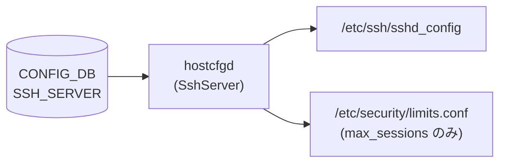

# SSH_SERVER テーブル

## 概要

SSH サーバのグローバル設定を [CONFIG_DB](../../reference/glossary.md#term-config_db) に保持するテーブル[^1]。`hostcfgd` の `SshServer` クラスが変更を検知し、`/etc/ssh/sshd_config` を書き換えて `ssh` サービスを再起動する。最大セッション数 (`max_sessions`) のみ `PamLimitsCfg` が `/etc/security/limits.conf` 経由で制御する。

<!-- cdb-mermaid -->
### データフロー (自動生成)



!!! note "凡例"
    CONFIG_DB から各設定ファイルまでの典型経路を示すミニ図。詳細・例外は本文と対応表を参照。
<!-- /cdb-mermaid -->

## key 構造

```text
SSH_SERVER|POLICIES
```

key は `POLICIES` 固定のシングルトンテーブル。

## フィールド

| フィールド | 型 | デフォルト | 説明 |
|-----------|----|-----------|----|
| `authentication_retries` | uint32 (1–100) | `6` | SSH 接続ごとの最大認証試行回数 |
| `login_timeout` | uint32 (1–600) | `120` | 認証完了までの最大時間 (秒) |
| `ports` | string (コンマ区切りポート番号) | `"22"` | SSH デーモンがリッスンする TCP ポートリスト |
| `inactivity_timeout` | uint32 (0–35000) | `15` | セッション無操作タイムアウト (分, 0=無効) |
| `max_sessions` | uint32 (0–100) | `0` | 同時ログイン最大数 (0=無制限) |
| `permit_root_login` | enum | — | root ログイン可否 (`yes`/`prohibit-password`/`forced-commands-only`/`no`) |
| `password_authentication` | boolean | `true` | パスワード認証を許可するか |
| `ciphers` | list[enum] | — | 許可する暗号アルゴリズムリスト |
| `kex_algorithms` | list[enum] | — | 許可する鍵交換アルゴリズムリスト |
| `macs` | list[enum] | — | 許可する MAC アルゴリズムリスト |

## 制約

- `authentication_retries`: YANG range `1..100`, hostcfgd 実効最小値 `3` (1–2 は YANG 通過後 hostcfgd が ERR ログ出力してスキップ)
- `login_timeout`: YANG/hostcfgd ともに `1..600`
- `inactivity_timeout`: `0..35000` 分 (0 で無効化)
- `max_sessions`: `0..100` (0 で無制限)
- `ports`: カンマ区切り; 各値 `1..65535`
- `permit_root_login`: enum `yes` / `prohibit-password` / `forced-commands-only` / `no`
- `ciphers` / `kex_algorithms` / `macs`: YANG が定義する enumeration 値のみ許可

## 購読者

- `hostcfgd` (`sonic-host-services` の `SshServer` クラス): `CONFIG_DB` 変更を購読 → `/etc/ssh/sshd_config` を書き換え → `systemctl restart ssh`
- `hostcfgd` (`PamLimitsCfg` クラス): `max_sessions` のみ `/etc/security/limits.conf` の `maxsyslogins` に書き込む

## 関連 CONFIG_DB / YANG / CLI

- 関連 [YANG](../../reference/glossary.md#term-yang): `sonic-ssh-server`
- 関連 CLI: `config ssh-server` (sonic-utilities)

<!-- cdb-exceptions -->
## 例外条件・特殊挙動

| 条件 | 挙動 |
|------|------|
| `SSH_SERVER|POLICIES` が DB に存在しない | `SshServer.load()` が `self.policies = {}` をセット; `set_policies()` は呼ばれず `/etc/ssh/sshd_config` は変更されない (OS デフォルト維持) |
| `authentication_retries` が 1 または 2 | YANG バリデーションは通過するが hostcfgd が ERR ログ出力してそのフィールドの適用をスキップ |
| `max_sessions` が `0` | `PamLimitsCfg.read_max_sessions_config()` が `self.max_sessions = None` にセット; limits.conf に `maxsyslogins` 行を書かない (無制限) |
| `password_authentication` に `"false"` (文字列) | hostcfgd が `value.lower() in ["false"]` を判定して `"no"` に変換 |
| `ciphers` / `kex_algorithms` / `macs` が空リスト | `",".join([])` → 空文字列 → sshd_config に `Ciphers ` (値なし) が書かれる可能性あり; 実際の動作は sshd のバリデーション依存 |
| sshd -T バリデーション失敗 | `set_policies()` が tmp ファイルを削除; `/etc/ssh/sshd_config` は変更されない; syslog ERR のみ |

<!-- /cdb-exceptions -->

<!-- value-behavior -->
## 値依存挙動マトリクス

### `inactivity_timeout` (uint32 — 分単位)

| 値 | 効果 | evidence |
|---|---|---|
| `0` | タイムアウト無効 (`ClientAliveInterval 0`) | `sonic-ssh-server.yang:range 0..35000` |
| `1..35000` | `ClientAliveInterval = 値 × 60` (秒) を sshd_config に書く | `hostcfgd:1129-1131` |

### `max_sessions` (uint32)

| 値 | 挙動 | evidence |
|---|---|---|
| `0` | `self.max_sessions = None` → limits.conf に書かない (無制限) | `hostcfgd:1440-1441` |
| `1..100` | `* - maxsyslogins <値>` を `/etc/security/limits.conf` に書く | `hostcfgd:1473` |

### `permit_root_login` (enum)

| 値 | sshd_config 出力 | 意味 |
|---|---|---|
| `yes` | `PermitRootLogin yes` | root のパスワード/鍵ログイン両方許可 |
| `prohibit-password` | `PermitRootLogin prohibit-password` | root の公開鍵ログインのみ許可 (推奨) |
| `forced-commands-only` | `PermitRootLogin forced-commands-only` | 強制コマンド付き公開鍵のみ許可 |
| `no` | `PermitRootLogin no` | root ログイン完全禁止 |

### `password_authentication` (boolean)

| DB 値 | 変換後 | sshd_config 出力 |
|---|---|---|
| `true` / `"true"` / `"yes"` / 非 `"false"` 文字列 | `"yes"` | `PasswordAuthentication yes` |
| `false` / `"false"` | `"no"` | `PasswordAuthentication no` |

<!-- /value-behavior -->

<!-- ref-triangle:start -->

## 関連リファレンス

- [YANG](../../reference/glossary.md#term-yang): [`sonic-ssh-server`](../yang/sonic-ssh-server.md)

<!-- ref-triangle:end -->

## 引用元

[^1]: `src/sonic-yang-models/yang-models/sonic-ssh-server.yang` (container `SSH_SERVER` / container `POLICIES`). <https://github.com/sonic-net/sonic-buildimage/blob/9ea932ec2e18f35e58268ec2e4456b1d4afd65cd/src/sonic-yang-models/yang-models/sonic-ssh-server.yang>

<!-- ops-hint -->
## 運用ヒント

### 典型設定例

```json
{
    "SSH_SERVER": {
        "POLICIES": {
            "authentication_retries": "6",
            "login_timeout": "120",
            "ports": "22",
            "inactivity_timeout": "15",
            "max_sessions": "0",
            "permit_root_login": "prohibit-password",
            "password_authentication": "true"
        }
    }
}
```

### 確認コマンド

```bash
sonic-db-cli CONFIG_DB hgetall 'SSH_SERVER|POLICIES'
show ssh-server policies
```

### よくある誤設定

- `ports` を変更後に管理端末からの接続が切れる場合: 旧ポートと新ポートを両方 `ports` にカンマ区切りで指定してから移行する
- `max_sessions` を 0 にしても制限されないように見える場合: limits.conf が正しく適用されているか `/etc/security/limits.conf` を確認する
<!-- /ops-hint -->

<!-- runtime-trace -->
## 実コンテナ動作トレース

### 段階 1 — Consumer 登録

`hostcfgd` が起動時に `CONFIG_DB` を購読。

```python
# hostcfgd:2478
self.config_db.subscribe('SSH_SERVER', make_callback(self.ssh_handler))
```

### 段階 2 — 初期ロード

```python
# hostcfgd:2245,2265
ssh_server = init_data['SSH_SERVER']
self.sshscfg.load(ssh_server)
```

`SshServer.load()` が `POLICIES` キーの有無を確認し、存在すれば `policies_update()` → `set_policies()` を呼ぶ。

### 段階 3 — 設定ファイル更新

`SshServer.set_policies()` が `/etc/ssh/sshd_config` を `sshd_tmp` にコピー → 各フィールドを書き換え → `sshd -T -f sshd_tmp` でバリデーション → 成功すれば `rename()` で本番ファイルを置き換え → `systemctl restart ssh`。

### 段階 4 — タイミングと副作用

- CONFIG_DB の `SSH_SERVER` エントリ変化を `ConfigDBConnector` で検知次第即時反映
- `systemctl restart ssh` によって既存セッションは維持されるが、新規接続から新設定が有効
- `max_sessions` 変更は `PamLimitsCfg` ルートで処理されるため `ssh` サービス再起動なし (PAM limits.conf 再読み込みのみ)
<!-- /runtime-trace -->

<!-- entry-points -->
## 書き込み入り口 (Direction A)

対象テーブル: `SSH_SERVER`

### CLI

- `config ssh-server set authentication-retries <N>`
- `config ssh-server set login-timeout <secs>`
- `config ssh-server set ports <port[,port...]>`
- `config ssh-server set inactivity-timeout <min>`
- `config ssh-server set max-sessions <N>`
- `config ssh-server set permit-root-login <value>`
- `config ssh-server set password-authentication <enable|disable>`
- `config ssh-server set ciphers <cipher,...>`
- `config ssh-server set kex-algorithms <alg,...>`
- `config ssh-server set macs <mac,...>`
  - ソース: `sonic-utilities/config/ssh_config.py` (推定)

### minigraph / sonic-cfggen

- なし

### REST / gNMI (sonic-mgmt-common)

- なし (対応 OpenConfig transformer 未確認)

### db_migrator

- 未確認 (SSH_SERVER 専用マイグレーションなし)

### ビルド時デフォルト (init_cfg / j2 テンプレート)

- `init_cfg.json.j2` にデフォルト値の明示的な SSH_SERVER エントリはなし (OS デフォルトを踏襲)

### ランタイム注入 (デーモン自動書き込み)

- なし
<!-- /entry-points -->

<!-- defaults -->
## フィールド暗黙デフォルト (Phase A — コード由来)

YANG default と hostcfgd コード由来の fallback をまとめる。`SshServer.__init__` では `self.policies = {}` (空 dict) のみ定義。DB に `SSH_SERVER|POLICIES` が存在しない場合、`set_policies()` は呼ばれず `/etc/ssh/sshd_config` は変更されない。実効デフォルトは OS (Debian) の sshd_config 初期値となる。

| フィールド | YANG default | コード由来 fallback | 実効デフォルト (未設定時) | 注記 |
|-----------|-------------|-------------------|----------------------|------|
| `authentication_retries` | `6` | なし | `6` (OS `MaxAuthTries 6`) | hostcfgd min=3, YANG min=1 の差異あり |
| `login_timeout` | `120` | なし | `120` 秒 (OS `LoginGraceTime 120`) | |
| `ports` | `"22"` | なし | `22` (OS `Port 22`) | |
| `inactivity_timeout` | `15` | なし | `15` 分 = `900` 秒 (OS `ClientAliveInterval` 相当) | DB値は分、sshd_config は秒 (×60 変換) |
| `max_sessions` | `0` | `get('max_sessions', 0)` → `None` | 無制限 (limits.conf 非書き込み) | `PamLimitsCfg.read_max_sessions_config():1440` |
| `permit_root_login` | なし | なし | OS 値 (Debian: `prohibit-password`) | YANG に default 文なし |
| `password_authentication` | `true` | なし | `yes` (OS `PasswordAuthentication yes`) | |
| `ciphers` | なし | なし | OS OpenSSH デフォルト暗号スイート | |
| `kex_algorithms` | なし | なし | OS OpenSSH デフォルト kex スイート | |
| `macs` | なし | なし | OS OpenSSH デフォルト MAC スイート | |

### 補足

- `SshServer.load()` (hostcfgd:1049-1055): `POLICIES` キーが存在しない場合、`self.policies = {}` をセットして `modify_conf_file()` は呼ぶが、空 dict のため `set_policies()` は実行されない (`len(ssh_policies) > 0` 判定で skip)。
- `inactivity_timeout` の単位変換: CONFIG_DB 値 (分) を `int(value) * 60` で秒変換し `ClientAliveInterval` に書く (hostcfgd:1129-1131)。
- `max_sessions = 0` の場合: `PamLimitsCfg.read_max_sessions_config()` が `self.max_sessions = None` とし、`limits.conf.j2` に `maxsyslogins` 行を出力しない。これにより PAM はシステムデフォルト (無制限) で動作する (hostcfgd:1440-1441)。
- `permit_root_login` は YANG に `default` 文が存在しないが、HLD (ssh_config.md) では「Default OS value: Debian の `prohibit-password`」と記載されている。

<!-- /defaults -->

<!-- glossary-links-injected: ssh-config-2026-05-14 -->
