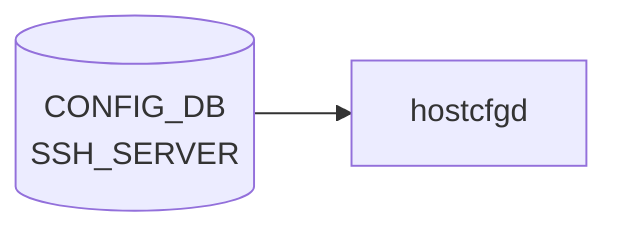

# SSH_SERVER テーブル

## 概要

SSH デーモン (sshd) のセキュリティ・セッションポリシーを保持するシングルトンテーブル[^1]。`hostcfgd` の `SshServer` クラスがこのテーブルを購読し、`/etc/ssh/sshd_config` を更新して sshd を再起動する。`max_sessions` フィールドのみ PAM limits 経由で制御される。

<!-- cdb-mermaid -->
### データフロー (自動生成)



!!! note "凡例"
    CONFIG_DB から SAI までの典型経路を `docs/reference/config-db-orch-map.md` から機械生成したミニ図。詳細・例外は本ページ本文と対応表を参照。
<!-- /cdb-mermaid -->

## key 構造

```text
SSH_SERVER|POLICIES
```

固定キー `POLICIES` のみのシングルトン container。

## フィールド一覧

| フィールド | 型 | YANG default | 説明 |
|-----------|----|-------------|------|
| `authentication_retries` | uint32 (1..100) | **6** | sshd `MaxAuthTries`：接続ごとの認証最大試行回数 |
| `login_timeout` | uint32 (1..600) | **120** | sshd `LoginGraceTime`：SSH 認証完了までの最大待機時間（秒） |
| `ports` | string (comma-sep, 1..65535) | **`"22"`** | sshd `Port`：リッスンポート（カンマ区切りで複数指定可） |
| `inactivity_timeout` | uint32 (0..35000) | **15** | sshd `ClientAliveInterval`：セッション無活動タイムアウト（**分**）。0 で無効化 |
| `max_sessions` | uint32 (0..100) | **0** | PAM limits による最大同時 SSH セッション数。0 は無制限 |
| `password_authentication` | boolean | **true** | sshd `PasswordAuthentication`：パスワード認証の有効化 |
| `permit_root_login` | enum | なし | sshd `PermitRootLogin`：root ログイン許可方針 |
| `ciphers` | leaf-list (enum) | なし | sshd `Ciphers`：許可する暗号アルゴリズム一覧 |
| `kex_algorithms` | leaf-list (enum) | なし | sshd `KexAlgorithms`：許可する鍵交換アルゴリズム一覧 |
| `macs` | leaf-list (enum) | なし | sshd `MACs`：許可する MAC アルゴリズム一覧 |

### `permit_root_login` 列挙値

| 値 | 意味 |
|----|------|
| `yes` | root の SSH ログインを全許可 |
| `prohibit-password` | 公開鍵認証のみ許可（パスワード・キーボードインタラクティブ禁止） |
| `forced-commands-only` | `~root/.ssh/authorized_keys` に `command=` がある場合のみ |
| `no` | root ログイン完全禁止 |

YANG `default` 宣言なし。DB に設定しない場合は sshd の組み込みデフォルト（OpenSSH `prohibit-password`）が有効。

## 購読者

- `hostcfgd` `SshServer`（`sonic-host-services/scripts/hostcfgd` L1045-L1175）：`/etc/ssh/sshd_config` を更新し `systemctl restart ssh` を実行
- `hostcfgd` `PamLimitsCfg`（同 L1418-L1441）：`max_sessions` を `/etc/security/limits.d/` に反映

## 関連 CONFIG_DB / YANG / CLI

- 関連 [CONFIG_DB](../../reference/glossary.md#term-config_db): `DEVICE_METADATA`（hostname 参照）
- 関連 CLI: `config ssh-server`
- 関連 [YANG](../../reference/glossary.md#term-yang): `sonic-ssh-server`

<!-- ref-triangle:start -->

## 関連リファレンス

- [YANG](../../reference/glossary.md#term-yang): [`sonic-ssh-server`](../yang/sonic-ssh-server.md)
- [HLD: SSH Server Global Config](../../management/ssh-server-global-config-hld.md)

<!-- ref-triangle:end -->

## 引用元

[^1]: [YANG](../../reference/glossary.md#term-yang) 定義: `sonic-ssh-server.yang`. <https://github.com/sonic-net/sonic-buildimage/blob/9ea932ec2e18f35e58268ec2e4456b1d4afd65cd/src/sonic-yang-models/yang-models/sonic-ssh-server.yang>

<!-- value-behavior -->
## 値依存挙動マトリクス

| フィールド | 値 | 挙動 |
|-----------|-----|-----|
| `inactivity_timeout` | `0` | `ClientAliveInterval 0`（不活動タイムアウト無効） |
| `inactivity_timeout` | `15`（デフォルト） | `ClientAliveInterval 900`（秒）に変換。分→秒変換は [hostcfgd](../../reference/glossary.md#term-hostcfgd) 内部で実施 |
| `max_sessions` | `0`（デフォルト） | PAM limits 設定を出力しない → セッション数無制限 |
| `max_sessions` | `1`以上 | `/etc/security/limits.conf` に `maxsyslogins` として書き込み |
| `password_authentication` | `"false"` | `PasswordAuthentication no`（パスワード認証無効） |
| `password_authentication` | `"true"` または未設定 | `PasswordAuthentication yes` |
| `permit_root_login` | 未設定 | sshd 組み込みデフォルト `prohibit-password` が有効 |
| `ciphers` / `kex_algorithms` / `macs` | 未設定 | sshd_config に書かれず OpenSSH 組み込みデフォルトが有効 |

<!-- /value-behavior -->

<!-- cdb-exceptions -->
## 例外条件・特殊挙動

- **`inactivity_timeout` の単位変換**: DB は分単位、sshd_config は秒単位。[hostcfgd](../../reference/glossary.md#term-hostcfgd) が `× 60` 変換を実施（L1129-1131）。YANG の description は "minutes" と明記しているが変換ロジックは実装側にのみ存在する。
- **`max_sessions` は sshd_config 非反映**: `SSH_CONFIG_NAMES` に存在せず `set_policies()` 内で `continue` されスキップ。`PamLimitsCfg` 経由で PAM limits に書かれる（sshd 設定ではなく PAM 設定）。
- **sshd 設定検証失敗時は変更なし**: `sshd -T -f <tmp>` の返り値が非 0 の場合、一時ファイルを削除して変更をロールバックし、LOG_ERR を記録する（L1164-1168）。
- **DB エントリ不在時は set_policies() 非実行**: `SshServer.load()` は `POLICIES` キーが存在しない場合 `policies = {}` のまま `modify_conf_file()` を呼ぶが、`len(ssh_policies) == 0` で `set_policies()` がスキップされる。既存の sshd_config に変更は加わらない。

<!-- /cdb-exceptions -->

<!-- ops-hint -->
## 運用ヒント

### 典型値

```bash
sonic-db-cli CONFIG_DB hgetall 'SSH_SERVER|POLICIES'
```

### よくある誤設定

- `inactivity_timeout` を秒と勘違いして `900` などを設定すると `ClientAliveInterval 54000`（15 時間）になる。
- `max_sessions` を増やしても sshd の `MaxSessions` は変わらない（PAM limits 経由のため）。

### 確認コマンド

```bash
sonic-db-cli CONFIG_DB hgetall 'SSH_SERVER|POLICIES'
show ssh-server policies
sudo sshd -T | grep -Ei "MaxAuth|LoginGrace|Port|ClientAlive|PasswordAuth|PermitRoot|Ciphers|Kex|MACs"
```

<!-- /ops-hint -->

<!-- derivation -->
## 派生・条件付き登録

### 自動派生

[hostcfgd](../../reference/glossary.md#term-hostcfgd) が `SSH_SERVER|POLICIES` を読み込み、各フィールドを対応する sshd_config ディレクティブに変換して `/etc/ssh/sshd_config` を上書き更新する。`inactivity_timeout` は分単位を秒単位に自動変換（×60）。`ciphers`, `kex_algorithms`, `macs` は leaf-list を comma-delimited 文字列に変換。

### 条件付き登録 (add_manager 条件)

hostcfgd は `SSH_SERVER` テーブルを常時購読（`config_db.subscribe('SSH_SERVER', ...)` L2478）。`DEVICE_METADATA.localhost` の存在確認のみ行う。

<!-- /derivation -->

<!-- handler-branching -->
### Handler メソッド内分岐

| Handler | 分岐条件 | 効果 | evidence |
|---|---|---|---|
| `SshServer.set_policies()` | `key == "ports"` | `handle_ports_set()` でマルチポート対応 | `hostcfgd` L1115-1121 |
| `SshServer.set_policies()` | `key == "inactivity_timeout"` | 分→秒変換 (×60) して `ClientAliveInterval` に書く | `hostcfgd` L1129-1131 |
| `SshServer.set_policies()` | `key == "password_authentication"` | `"false"` → `"no"`、その他 → `"yes"` 変換 | `hostcfgd` L1132-1143 |
| `SshServer.set_policies()` | `key in ["ciphers", "kex_algorithms", "macs"]` | leaf-list を `","` 結合して各ディレクティブに書く | `hostcfgd` L1138-1140 |
| `SshServer.set_policies()` | `key in ["max_sessions"]` | `continue`（sshd_config 非反映、PAM 側で処理） | `hostcfgd` L1144-1145 |
| `SshServer.set_policies()` | `sshd -T` 失敗 | 一時ファイル削除、変更ロールバック | `hostcfgd` L1164-1168 |
| `PamLimitsCfg` | `max_sessions == 0` | PAM limits 設定なし（無制限） | `hostcfgd` L1440-1441 |
| `PamLimitsCfg` | `max_sessions > 0` | `maxsyslogins` を `/etc/security/limits.conf` に書き込み | `hostcfgd` L1440 |

<!-- /handler-branching -->

<!-- entry-points -->
## 書き込み入り口

SSH_SERVER テーブルへの書き込みが発生するコード経路を調査した結果。

### CLI

- `config ssh` — `sonic-utilities/config/main.py` L9987-10000 が `config_db.mod_entry("SSH_SERVER", "POLICIES", {...})` を呼ぶ

### minigraph / sonic-cfggen

minigraph.py での SSH_SERVER 自動生成なし

### REST / gNMI

REST/[gNMI](../../reference/glossary.md#term-gnmi) 経由の書き込み経路なし（YANG モデルは定義済みのため将来対応可能）

### ビルド時デフォルト (build-time default)

なし（`/etc/ssh/sshd_config` のデフォルトは OpenSSH パッケージが提供）

<!-- /entry-points -->

<!-- defaults -->
## 暗黙デフォルト

YANG `default` 宣言値と、フィールド不在時にコードまたは sshd が適用する実効デフォルトの対応表。

| フィールド | YANG default | コード由来暗黙デフォルト | 実効 sshd_config 値 | 根拠 |
|-----------|-------------|------------------------|-------------------|------|
| `authentication_retries` | **6** | なし | `MaxAuthTries 6` | `sonic-ssh-server.yang` L27 |
| `login_timeout` | **120** | なし | `LoginGraceTime 120` | `sonic-ssh-server.yang` L34 |
| `ports` | **`"22"`** | なし | `Port 22` | `sonic-ssh-server.yang` L41 |
| `inactivity_timeout` | **15** (分) | 分→秒変換（×60） → **900** 秒 | `ClientAliveInterval 900` | `sonic-ssh-server.yang` L51; `hostcfgd` L1129 |
| `max_sessions` | **0** | `0` → PAM 設定なし（`None`） | PAM limits 非出力 = 無制限 | `hostcfgd` L1440-1441 |
| `password_authentication` | **`true`** | `"false"`→`"no"`, その他→`"yes"` | `PasswordAuthentication yes` | `sonic-ssh-server.yang` L75; `hostcfgd` L1132 |
| `permit_root_login` | なし | DB 不在 → sshd 組み込みデフォルト | `prohibit-password`（OpenSSH 7.7+） | `sonic-ssh-server.yang` L63-71 |
| `ciphers` | なし | DB 不在 → OpenSSH デフォルト suite | sshd_config に Ciphers 行なし | `sonic-ssh-server.yang` L77-91 |
| `kex_algorithms` | なし | DB 不在 → OpenSSH デフォルト suite | sshd_config に KexAlgorithms 行なし | `sonic-ssh-server.yang` L92-110 |
| `macs` | なし | DB 不在 → OpenSSH デフォルト suite | sshd_config に MACs 行なし | `sonic-ssh-server.yang` L111-131 |

### 注目 discrepancy: `inactivity_timeout` 単位変換

YANG の `description` は "minutes" と明記しているが、変換処理（`× 60`）は hostcfgd 内部にのみ存在する。  
YANG 型は `uint32` のみで単位変換の記述がないため、コードを読まないと単位が分であることが分からない。

```python
# hostcfgd L1129-1131
if key == "inactivity_timeout":
    # translate min to sec.
    value = int(value) * 60
```

### 注目 discrepancy: `max_sessions` の経路

`max_sessions` は `SSH_CONFIG_NAMES` に含まれていないため `sshd_config` の `MaxSessions` には反映されない。  
代わりに `PamLimitsCfg` が PAM limits（`/etc/security/limits.d/`）に書き込む。  
OpenSSH の `MaxSessions`（同時チャンネル数の上限）とは別の概念であることに注意。

<!-- evidence: sonic-host-services/scripts/hostcfgd L61-75 (SSH_CONFIG_NAMES dict) -->
<!-- evidence: sonic-host-services/scripts/hostcfgd L1045-1175 (SshServer.set_policies) -->
<!-- evidence: sonic-host-services/scripts/hostcfgd L1418-1441 (PamLimitsCfg.read_max_sessions_config) -->
<!-- evidence: sonic-buildimage/src/sonic-yang-models/yang-models/sonic-ssh-server.yang L20-135 -->
<!-- /defaults -->

<!-- ordering -->
## 書込み順依存

### hostcfgd 起動時の処理順序

hostcfgd は起動時に以下の順序で SSH_SERVER を処理する。

1. **`PamLimitsCfg.__init__()` + `update_config_file()`**（L2191-2192）  
   `get_table('SSH_SERVER')` を読み込み `read_max_sessions_config()` を実行。  
   この時点で `SSH_SERVER|POLICIES` が存在しなければ PAM limits は更新されない（KeyError をスルー）。

2. **`SshServer.__init__()`**（L2201）  
   `policies = {}` のみ初期化。sshd_config への書き込みはなし。

3. **`wait_till_system_init_done()`**  
   systemd の初期化完了を待機。

4. **`sshscfg.load(ssh_server)`**（L2265）  
   `set_policies()` 経由で sshd_config 全フィールドを更新し、`systemctl restart ssh` を実行。

5. **`pamLimitsCfg.update_config_file()`（2 回目）**（L2277）  
   `max_sessions` を `/etc/security/limits.d/` に書き込む（確定値で上書き）。

ステップ 4 と 5 は **順序固定**。`max_sessions` が sshd_config 側でスキップされ PAM 経由で処理されるため、sshd 設定と PAM limits の更新は必ずこの順に完了する。  
起動直後の短時間（ステップ 4 完了前）は PAM limits が古い値のままになる可能性がある。

### ランタイム更新（subscribe コールバック）

```
ssh_handler(key, op, data)         # hostcfgd L2297
  ├─ sshscfg.policies_update()     # sshd_config 更新 + restart
  └─ pamLimitsCfg.update_config_file()  # PAM limits 更新
```

sshd_config 更新と PAM limits 更新は**同一ハンドラ内で逐次実行**される（トランザクションなし）。  
sshd_config 更新成功後に PAM limits 更新が失敗した場合、両者の設定が不整合になる可能性がある。

### `ports` フィールドの順序依存

`handle_ports_set()` は既存 sshd_config.tmp 内の `Port` 行の**行番号**を取得してから挿入する。  
複数ポートを指定する場合、各ポートは同一行番号に逐次挿入されるため、元の `Port` 行位置が存在しない場合はファイル末尾に追記される。

### `DEVICE_METADATA|localhost` との前提依存

`PamLimitsCfg.update_config_file()` は `SSH_SERVER|POLICIES` と `DEVICE_METADATA|localhost` の**どちらも存在しない**場合に early return する（L1430）。  
`DEVICE_METADATA|localhost` が先に書き込まれている前提で PAM limits の更新が動作する。  
通常の [SONiC](../../reference/glossary.md#term-sonic) デプロイでは `DEVICE_METADATA|localhost` は必ず存在するため問題にならないが、ミニマル構成やテスト環境では注意が必要。

### sshd 検証ゲート（アトミック性）

`set_policies()` はすべてのフィールドを sshd_config.tmp に適用した後、`sshd -T -f <tmp>` で検証する。  
検証失敗時は tmp を削除してロールバック（フィールド単位のロールバックは行われない）。  
すべて適用 or すべて棄却の二択であることに注意。

<!-- evidence: sonic-host-services/scripts/hostcfgd L2191-2192, L2201, L2232-2277 (HostConfigDaemon.__init__ + load) -->
<!-- evidence: sonic-host-services/scripts/hostcfgd L2297-2299 (ssh_handler) -->
<!-- evidence: sonic-host-services/scripts/hostcfgd L1430 (PamLimitsCfg.update_config_file early-return condition) -->
<!-- evidence: sonic-host-services/scripts/hostcfgd L1091-1108 (handle_ports_set) -->
<!-- evidence: sonic-host-services/scripts/hostcfgd L1150-1160 (sshd -T verification gate) -->
<!-- /ordering -->

<!-- cross-refs -->
## 暗黙参照マップ

| 参照方向 | このテーブル | 相手テーブル / ページ | 条件 |
|---------|------------|---------------------|------|
| SSH_SERVER → | `max_sessions`（PamLimitsCfg） | [`DEVICE_METADATA`](./device-metadata.md) | `update_config_file()` が `DEVICE_METADATA\|localhost` キーの存在を確認。不在時は early return し PAM limits を更新しない |
| SSH_SERVER ← | `PasswordAuthentication`（sshd_config） | [`AAA`](./aaa.md) | `AaaCfg.modify_conf_file()` が `/etc/pam.d/sshd` を書き換え、TACACS+/[RADIUS](../../reference/glossary.md#term-radius)/LDAP 有効時に `common-auth-sonic` に切り替える。SSH のパスワード認証と PAM 認証スタックが実質的に連動する |
| SSH_SERVER ← (間接) | SSH 認証経路 | [`MGMT_INTERFACE`](./mgmt-interface.md) | TACACS+/[RADIUS](../../reference/glossary.md#term-radius) の `src_intf = eth0` 設定時、`AaaCfg.get_interface_ip()` が `MGMT_INTERFACE` テーブルの IP を解決。SSH 認証バックエンドとして TACACS+/[RADIUS](../../reference/glossary.md#term-radius) を使用する場合に影響 |
| CLI | `config ssh` / `show ssh-server` | [`config ssh`](../cli/config-ssh.md) | SSH_SERVER テーブルの読み書き CLI |
| YANG | `SSH_SERVER\|POLICIES` | [`sonic-ssh-server`](../yang/sonic-ssh-server.md) | 全フィールドのスキーマ定義 |

> **Evidence**: `sonic-host-services/scripts/hostcfgd` L1422-1430 (PamLimitsCfg → [DEVICE_METADATA](../../reference/glossary.md#term-device_metadata)); L744-751 (AaaCfg → /etc/pam.d/sshd); L596-606 (get_interface_ip → MGMT_INTERFACE)
<!-- /cross-refs -->

<!-- failure -->
## 失敗挙動マトリクス

ソース: `sonic-net/sonic-host-services/scripts/hostcfgd` — `SshServer.set_policies()` (L1119-1168)、`PamLimitsCfg.update_config_file()` (L1420-1436)

### set_policies() 失敗経路

| 失敗条件 | 検出箇所 | 結果 |
|---------|---------|------|
| `ports` が空リスト | `handle_ports_set()` L1091-1093 | `LOG_ERR` + `return False` → `set_policies()` は即時 `return`。sshd_config.tmp を /etc/ssh/sshd_config へ反映しない |
| `port_num` が整数型（str でない） | `handle_ports_set()` L1095-1097 | `LOG_ERR` + `return False` → `set_policies()` 即時 `return` |
| ポート番号が範囲外（< 1 または > 65535） | `handle_ports_set()` L1098-1100 | `LOG_ERR` + `return False` → `set_policies()` 即時 `return` |
| 整数フィールドが YANG 定義範囲外 | `set_policies()` L1130-1131 | `LOG_ERR` + `continue`。当該フィールドをスキップし他フィールドは sshd_config.tmp への適用を継続（**部分適用**） |
| 不明キー（`SSH_CONFIG_NAMES` 外かつ `max_sessions` 以外） | `set_policies()` L1148-1149 | `LOG_ERR` + 暗黙スキップ |
| `sshd -T -f <tmp>` 検証失敗（returncode != 0） | `set_policies()` L1160-1163 | `LOG_ERR` + `os.remove(SSH_CONFG_TMP)`。sshd_config.tmp を削除して変更を破棄。/etc/ssh/sshd_config は旧値維持 |
| `systemctl restart ssh` 失敗 | `run_cmd()` L123-131 | `LOG_ERR`。sshd_config は更新済みだが sshd プロセスは旧設定のまま稼働する不整合状態になる。手動 `systemctl restart ssh` が必要 |
| `/etc/ssh/sshd_config` → tmp コピー失敗 | `copy2()` L1151 | `try/except` なし。Python 例外が hostcfgd プロセス全体に伝播 |

### PamLimitsCfg.update_config_file() 失敗経路

| 失敗条件 | 検出箇所 | 結果 |
|---------|---------|------|
| `SSH_SERVER` テーブル未存在 | `update_config_file()` L1422-1426 | `KeyError` を catch し `ssh_server_policies = {}` で処理継続。PAM limits は `max_sessions` 未設定扱いで評価される |
| `DEVICE_METADATA|localhost` と `SSH_SERVER|POLICIES` 両方不在 | `update_config_file()` L1430 | `return`（early return）。PAM limits ファイルを更新しない |
| `render_conf_file()` 書き込み失敗 | `render_conf_file()` | `try/except` なし。Python 例外が hostcfgd に伝播 |

### 範囲外フィールドの部分適用

`authentication_retries` / `login_timeout` / `inactivity_timeout` が範囲外の場合、当該フィールドは `continue` でスキップされ、残りのフィールドは sshd_config.tmp に適用される。sshd 検証 (`sshd -T`) が通過すればそのまま /etc/ssh/sshd_config に反映されるため、**一部フィールドは意図した値が設定されない部分適用**が発生する。

### ports 設定失敗時のファイル状態

`handle_ports_set()` が `return False` を返すと `set_policies()` は直ちに `return` し、`sshd -T` は実行されない。sshd_config.tmp には `Port` 行を削除した状態が残るが、`os.rename(SSH_CONFG_TMP, SSH_CONFG)` が実行されないため /etc/ssh/sshd_config は変更されない。ただし `os.remove(SSH_CONFG_TMP)` も呼ばれないため sshd_config.tmp が残留する可能性がある。

<!-- /failure -->

<!-- constants -->
## ハードコード定数

`SSH_SERVER` テーブルの処理に関わる、[CONFIG_DB](../../reference/glossary.md#term-config_db) / YANG で管理されない実装定数の一覧。出典は `sonic-host-services/scripts/hostcfgd`。

### sshd_config ファイルパス

| 定数名 | 値 | 用途 |
|--------|----|------|
| `SSH_CONFG` | `/etc/ssh/sshd_config` | sshd 本番設定ファイル (読込元・最終出力先) |
| `SSH_CONFG_TMP` | `/etc/ssh/sshd_config.tmp` | 編集作業用一時ファイル (`sshd -T` 検証後に `os.rename()` で置換) |

ソース: `hostcfgd` L32-33

### フィールド → sshd_config ディレクティブ名マッピング (`SSH_CONFIG_NAMES`)

| [CONFIG_DB](../../reference/glossary.md#term-config_db) フィールド | sshd_config ディレクティブ |
|--------------------|--------------------------|
| `authentication_retries` | `MaxAuthTries` |
| `login_timeout` | `LoginGraceTime` |
| `ports` | `Port` |
| `inactivity_timeout` | `ClientAliveInterval` |
| `permit_root_login` | `PermitRootLogin` |
| `password_authentication` | `PasswordAuthentication` |
| `ciphers` | `Ciphers` |
| `kex_algorithms` | `KexAlgorithms` |
| `macs` | `MACs` |

ソース: `hostcfgd` L67-76。`max_sessions` はこのマッピングに含まれず、PAM limits (`/etc/security/limits.conf`) 経由で制御される。

### 整数フィールドの実装上の範囲チェック (`SSH_MIN_VALUES` / `SSH_MAX_VALUES`)

| フィールド | 実装最小値 | 実装最大値 | YANG range | 備考 |
|-----------|----------|----------|-----------|------|
| `authentication_retries` | **3** | 100 | `1..100` | 実装最小値は YANG より厳しい（OpenSSH 推奨下限） |
| `login_timeout` | 1 | 600 | `1..600` | YANG と一致 |
| `ports` | 1 | 65535 | `1..65535` | YANG と一致 |
| `inactivity_timeout` | 0 | 35000 | `0..35000` | YANG と一致 |
| `max_sessions` | 0 | 100 | `0..100` | YANG と一致 |

ソース: `hostcfgd` L62-66。範囲外の整数フィールドは `LOG_ERR` + `continue` でスキップされ、残りのフィールドのみ sshd_config.tmp に適用される（部分適用）。

### PAM limits 設定ファイルパス

| 定数名 | 値 | 用途 |
|--------|----|------|
| `PAM_LIMITS_CONF_TEMPLATE` | `/usr/share/sonic/templates/pam_limits.j2` | PAM pam-limits 設定生成テンプレート |
| `LIMITS_CONF_TEMPLATE` | `/usr/share/sonic/templates/limits.conf.j2` | `/etc/security/limits.conf` 生成テンプレート |
| `PAM_LIMITS_CONF` | `/etc/pam.d/pam-limits-conf` | PAM pam-limits モジュール設定出力先 |
| `LIMITS_CONF` | `/etc/security/limits.conf` | リソース制限設定出力先 |

ソース: `hostcfgd` L81-84。`max_sessions = 0` の場合は `self.max_sessions = None` がセットされ、テンプレートで制限なし扱いになる (`hostcfgd` L1439-1440)。

<!-- evidence: sonic-host-services/scripts/hostcfgd L32-33 (SSH_CONFG, SSH_CONFG_TMP) -->
<!-- evidence: sonic-host-services/scripts/hostcfgd L61-76 (SSH_INT_VALUES, SSH_MIN_VALUES, SSH_MAX_VALUES, SSH_CONFIG_NAMES) -->
<!-- evidence: sonic-host-services/scripts/hostcfgd L81-84 (PAM_LIMITS_CONF_TEMPLATE, LIMITS_CONF_TEMPLATE, PAM_LIMITS_CONF, LIMITS_CONF) -->
<!-- evidence: sonic-host-services/scripts/hostcfgd L1439-1440 (max_sessions=0 → None) -->
<!-- /constants -->

<!-- side-effects -->
## 副次 DB 書込

CONFIG_DB `SSH_SERVER` テーブルの変更に伴って `hostcfgd` の `SshServer` / `PamLimitsCfg` ハンドラが副次的に書き込む DB エントリは **存在しない**。副作用はすべて Linux ホスト OS の設定ファイル書き換えおよびサービス再起動に閉じる。

| 副次 DB | 書込有無 | 根拠 |
|---|---|---|
| [APPL_DB](../../reference/glossary.md#term-appl_db) | なし | `SshServer` / `PamLimitsCfg` 内に `ProducerStateTable` / `Table.set()` 呼出が 0 件 (`hostcfgd` L1045–1175, L1418–1441 を `set(`/`hset`/`ProducerStateTable`/`NotificationProducer` で grep して 0 ヒット) |
| [STATE_DB](../../reference/glossary.md#term-state_db) | なし | `hostcfgd` の [STATE_DB](../../reference/glossary.md#term-state_db) 参照は `FipsCfg` (L1759–1821) と `RestartWaiter` 用 (L2160–2162) のみ。`SshServer` は `state_db_conn` を保持しない |
| [COUNTERS_DB](../../reference/glossary.md#term-counters_db) | なし | `hostcfgd` 全体に [COUNTERS_DB](../../reference/glossary.md#term-counters_db) 参照なし。SSH はカーネル/ユーザ空間のみで動作し [SAI](../../reference/glossary.md#term-sai) を経由しない |
| [FLEX_COUNTER_DB](../../reference/glossary.md#term-flex_counter_db) / [ASIC_DB](../../reference/glossary.md#term-asic_db) | なし | [SAI](../../reference/glossary.md#term-sai) 非経由。SSH_SERVER を購読する [orchagent](../../reference/glossary.md#term-orchagent) / mgrd は `sonic-swss/` に存在しない |
| [LOGLEVEL_DB](../../reference/glossary.md#term-loglevel_db) / ERROR_DB | なし | `SshServer` / `PamLimitsCfg` 内に参照なし |

`SshServer.set_policies()` の副作用は以下のファイルシステム操作に限られる:

- `/etc/ssh/sshd_config` の差分上書き (全フィールド適用後 `sshd -T` 検証、成功時に `os.rename(SSH_CONFG_TMP, SSH_CONFG)`)
- `systemctl restart ssh` の実行

`PamLimitsCfg.update_config_file()` の副作用は以下に限られる:

- `/etc/pam.d/pam-limits-conf` の Jinja2 テンプレート再生成
- `/etc/security/limits.conf` の Jinja2 テンプレート再生成 (`max_sessions > 0` のとき `maxsyslogins` 設定を含む)

<!-- evidence: sonic-host-services/scripts/hostcfgd L1045-1175 (SshServer — DB 書込なし確認) -->
<!-- evidence: sonic-host-services/scripts/hostcfgd L1418-1441 (PamLimitsCfg — DB 書込なし確認) -->
<!-- evidence: sonic-host-services/scripts/hostcfgd L1164-1172 (os.rename + systemctl restart ssh) -->
<!-- evidence: sonic-host-services/scripts/hostcfgd L1434-1441 (render_conf_file — PAM limits ファイル出力) -->
<!-- /side-effects -->

<!-- pubsub -->
## 通信メカニズム

### Redis 購読方式

`SSH_SERVER` テーブルへの変更通知は、`hostcfgd` が **`ConfigDBConnector.subscribe()` + `listen()`** で登録する **[Redis](../../reference/glossary.md#term-redis) keyspace 通知 (PSUBSCRIBE `__keyspace@<dbId>__:SSH_SERVER|*`)** によって配信される。`swsscommon.SubscriberStateTable` や `ConsumerStateTable`（channel ベース PUBLISH/SUBSCRIBE）は**使用しない**。CONFIG_DB は永続前提のため TTL は設定されない。

| 購読者 | 購読 API | 購読テーブル | ハンドラ |
|--------|---------|--------------|---------|
| `hostcfgd` (`SshServer` 経由) | `ConfigDBConnector.subscribe()` | `SSH_SERVER` | `ssh_handler` → `sshscfg.policies_update` + `pamLimitsCfg.update_config_file` |

`hostcfgd` 以外で `SSH_SERVER` テーブルを購読するプロセスは存在しない（`sonic-swss`・`sonic-gnmi`・`sonic-sairedis` に `SSH_SERVER` 向け Consumer / Subscriber なし）。

### keyspace 通知 → ハンドラ呼び出しの流れ

```
config ssh policies inactivity-timeout 10
  ↓ HSET "SSH_SERVER|POLICIES" inactivity_timeout "10"
Redis keyspace PUBLISH "__keyspace@4__:SSH_SERVER|POLICIES"  "hset"
  ↓ ConfigDBConnector.listen() がパターンマッチ
make_callback() で (key, op, data) を生成
  ↓ HGETALL "SSH_SERVER|POLICIES"  ← 通知後に値を再取得
ssh_handler(key="POLICIES", op=SET, data={inactivity_timeout:"10", ...})
  ↓ sshscfg.policies_update() → set_policies() → sshd_config 更新 + systemctl restart ssh
  ↓ pamLimitsCfg.update_config_file()  ← max_sessions を PAM limits に反映
```

- keyspace 通知のペイロードは操作名（`hset`/`del` 等）のみ。フィールド値は `HGETALL` で取得する。
- `op` は `data is None ? DEL : SET` で 2 値判定。`HDEL` / `HSET` の [Redis](../../reference/glossary.md#term-redis) 操作種別は区別しない。
- `SSH_SERVER` はシングルトンテーブル（key = `POLICIES` 固定）のため、`key` に `POLICIES` 以外が届くことはない。

### 起動時スナップショット

`config_db.listen(init_data_handler=self.load)` (hostcfgd:2528) の `init_data_handler` として `HostConfigDaemon.load()` が呼ばれ、Subscribe ループ開始前に `init_data['SSH_SERVER']` で `SSH_SERVER` テーブル全体を一括スナップショット取得し `sshscfg.load(ssh_server)` を適用する（hostcfgd:2265）。

### サービス再起動トリガー

| 契機 | 操作 | コード |
|------|------|--------|
| `SSH_SERVER` フィールド変更（`inactivity_timeout` 等） | `sshd -T` 検証後 `systemctl restart ssh` | `SshServer.set_policies()` — hostcfgd:1150-1172 |
| `max_sessions` 変更 | `/etc/security/limits.conf` 再生成（sshd 再起動なし） | `PamLimitsCfg.render_conf_file()` — hostcfgd:1456-1476 |

> **Evidence**: `sonic-host-services/scripts/hostcfgd:2454-2466` (make_callback)、`hostcfgd:2478` (subscribe SSH_SERVER)、`hostcfgd:2528` (listen)、`hostcfgd:2297-2300` (ssh_handler)、`hostcfgd:2265` (sshscfg.load)
<!-- /pubsub -->

<!-- platform -->
## プラットフォーム差分

> **Evidence**: `sonic-host-services/scripts/hostcfgd` (FipsCfg, PamLimitsCfg)、`sonic-buildimage/rules/sonic-fips.mk`、`data/templates/limits.conf.j2`、`sonic-ssh-server.yang` L77–132 (2026-05-18)

### 差異 1: FIPS モード — `ssh` サービス強制再起動

`FipsCfg` (`hostcfgd:1759-1840`) は FIPS 有効化・無効化時に `DEFAULT_FIPS_RESTART_SERVICES = ['ssh', 'telemetry.service', 'restapi']` (hostcfgd:103) に列挙されたサービスを再起動する。

| FIPS 状態 | `ssh` 再起動 | 条件 |
|----------|------------|------|
| FIPS 有効化・無効化 (カーネル非強制環境) | あり (`systemctl restart ssh`) | `sonic_fips=1` / `fips=1` がカーネルコマンドラインに**ない**場合 |
| FIPS 強制環境 (`sonic_fips=1` / `fips=1`) | スキップ | `cur_enforced = True` → `FipsCfg.restart()` は即時 `return` |

この再起動は `SSH_SERVER` テーブルへの変更とは無関係に発生する。FIPS テーブル変更ハンドラ (`fips_handler`) が `ssh_handler` を経由せずに sshd を再起動するため、その時点で有効な `SSH_SERVER` 設定が sshd に再読み込みされる。

### 差異 2: FIPS-OpenSSH ビルド — 暗号スイートの実質的制限

FIPS モードが有効なビルドでは `sonic-buildimage/rules/sonic-fips.mk` で定義される `FIPS_OPENSSH_SERVER` パッケージが使用される。FIPS-OpenSSH は弱い暗号アルゴリズムをサポートしないため、以下の YANG enum 値を `SSH_SERVER.ciphers` / `kex_algorithms` / `macs` に設定すると `sshd -T` 検証が失敗し、`set_policies()` は変更をロールバックして現行設定が維持される。

| フィールド | FIPS 環境で実質無効になる値 |
|----------|--------------------------|
| `ciphers` | `3des-cbc`, `aes128-cbc`, `aes192-cbc`, `aes256-cbc` (CBC モード), `chacha20-poly1305@openssh.com` (FIPS 非準拠) |
| `kex_algorithms` | `diffie-hellman-group1-sha1`, `diffie-hellman-group14-sha1` (SHA-1 ベース DH) |
| `macs` | `hmac-md5`, `hmac-md5-96`, `hmac-md5-etm@openssh.com`, `hmac-md5-96-etm@openssh.com` (MD5 ベース) |

非 FIPS ビルドではこれらの値は YANG スキーマ通りに設定可能。

### 差異 3: `PamLimitsCfg` の hwsku / type 参照 — SSH への実質的影響なし

`PamLimitsCfg.read_localhost_config()` (hostcfgd:1445-1451) は `DEVICE_METADATA|localhost` から `hwsku` と `type` を読み取り Jinja2 テンプレート変数として渡すが、`data/templates/limits.conf.j2` のSSH 制限ロジックは `max_sessions` のみを参照する。**hwsku / type によって `max_sessions` の動作が変わることはない**。

### 差異 4: VS (Virtual Switch) / multi-ASIC — 差異なし

| 構成 | 動作 |
|------|------|
| ベアメタル | 標準 |
| [VS](../../reference/glossary.md#term-vs) (Virtual Switch) | 同一。`SshServer` / `PamLimitsCfg` に [VS](../../reference/glossary.md#term-vs) 固有ブランチなし |
| multi-[ASIC](../../reference/glossary.md#term-asic) | 同一。hostcfgd は CONFIG_DB 接続 1 本のみ使用。namespace 分割なし |

<!-- evidence: sonic-host-services/scripts/hostcfgd:101-103 (DEFAULT_FIPS_RESTART_SERVICES) -->
<!-- evidence: sonic-host-services/scripts/hostcfgd:1808-1840 (FipsCfg.restart — cur_enforced ガード) -->
<!-- evidence: sonic-host-services/scripts/hostcfgd:1445-1451 (PamLimitsCfg.read_localhost_config — hwsku/type) -->
<!-- evidence: sonic-host-services/data/templates/limits.conf.j2 (max_sessions のみ参照) -->
<!-- evidence: sonic-buildimage/rules/sonic-fips.mk:55-59 (FIPS_OPENSSH_SERVER パッケージ定義) -->
<!-- evidence: sonic-buildimage/src/sonic-yang-models/yang-models/sonic-ssh-server.yang:77-132 (cipher/kex/mac enum) -->
<!-- /platform -->

<!-- glossary-links-injected: 0af8863862be -->
