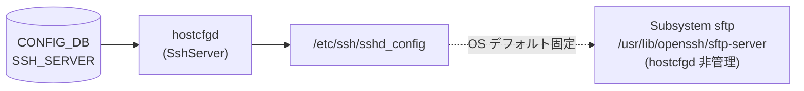

# SSH SFTP サブシステム

## 概要

SONiC は OpenSSH パッケージが提供する sshd_config テンプレートに `Subsystem sftp /usr/lib/openssh/sftp-server` を含めており、SFTP サブシステムは **常時有効** となっている[^1]。

`SSH_SERVER` テーブルを処理する `hostcfgd` の `SshServer.set_policies()` が更新するフィールドセット (`SSH_CONFIG_NAMES`) に `Subsystem` キーは含まれていないため、CONFIG_DB からは SFTP サブシステムを制御できない。

<!-- cdb-mermaid -->
### データフロー (自動生成)



!!! note "凡例"
    実線は CONFIG_DB 由来の書き込み経路。点線は OS テンプレートとして静的に存在する部分（CONFIG_DB からは書き換わらない）。
<!-- /cdb-mermaid -->

## CONFIG_DB との関係

SONiC に `SSH_SFTP` という独立したテーブルは存在しない。SFTP サブシステムは `SSH_SERVER` テーブルの管理スコープ外にある。

### SSH_CONFIG_NAMES（hostcfgd L67-75）

`hostcfgd` が sshd_config に書き込むフィールドは以下に限定される:

```python
SSH_CONFIG_NAMES = {
    "authentication_retries": "MaxAuthTries",
    "login_timeout":          "LoginGraceTime",
    "ports":                  "Port",
    "inactivity_timeout":     "ClientAliveInterval",
    "permit_root_login":      "PermitRootLogin",
    "password_authentication": "PasswordAuthentication",
    "ciphers":                "Ciphers",
    "kex_algorithms":         "KexAlgorithms",
    "macs":                   "MACs",
}
```

`Subsystem` キーが存在しないため、SFTP サブシステムの有効・無効は CONFIG_DB では制御されない。

### sshd_config テンプレート（sample_output L112）

```
Subsystem	sftp	/usr/lib/openssh/sftp-server
```

全 sample_output（デフォルト設定・全フィールド変更後）に共通して存在する行であり、hostcfgd の更新サイクルを経ても変更されない。

## SFTP クライアント機能（file_service.py）

`sonic-host-services/host_modules/file_service.py` の `FileService.download()` は、SFTP **クライアント**として動作するホスト D-Bus モジュールである。これは SFTP サーバ設定とは別物であり CONFIG_DB と無関係:

```python
# file_service.py L82-94
if protocol == "SFTP":
    ssh = paramiko.SSHClient()
    ssh.set_missing_host_key_policy(paramiko.AutoAddPolicy())
    ssh.connect(hostname, username=username, password=password)
    sftp = ssh.open_sftp()
    sftp.get(remote_path, local_path)
    sftp.close()
    ssh.close()
```

<!-- defaults -->
## 暗黙デフォルト (Phase A)

SFTP サブシステムに関して CONFIG_DB フィールドは存在しないため、すべてのデフォルトは OS (Debian/OpenSSH パッケージ) が提供する。

| 項目 | デフォルト値 | YANG default | コード由来デフォルト | 根拠 |
|------|------------|-------------|-------------------|------|
| SFTP サブシステム有効化 | **常時有効** | なし（YANG 非モデル化） | なし | `sshd_config` テンプレート `Subsystem sftp /usr/lib/openssh/sftp-server`（sample_output L112） |
| SFTP バイナリパス | `/usr/lib/openssh/sftp-server` | なし | なし | OpenSSH パッケージ提供（Debian）; hostcfgd は書き換えない |
| CONFIG_DB 制御フィールド | **なし** | — | — | `SSH_CONFIG_NAMES`（hostcfgd L67-75）に `Subsystem` キーなし |

### 補足

- `sonic-ssh-server.yang` に SFTP 関連の `leaf` は一切定義されていない。YANG レベルでもモデル化されていない。
- `SSH_SERVER|POLICIES` に `sftp_enabled` 等のフィールドは存在しない。
- SFTP を無効化するには `/etc/ssh/sshd_config` を直接編集するか、OpenSSH パッケージの差し替えが必要。CONFIG_DB 経由の手段はない。

<!-- evidence: sonic-host-services/scripts/hostcfgd L61-75 (SSH_CONFIG_NAMES — Subsystem キーなし) -->
<!-- evidence: sonic-host-services/tests/hostcfgd/sample_output/SSH_SERVER_default_values/sshd_config L112 (Subsystem sftp 行) -->
<!-- evidence: sonic-buildimage/src/sonic-yang-models/yang-models/sonic-ssh-server.yang (SFTP leaf なし) -->
<!-- /defaults -->

<!-- constants -->
## ハードコード定数 (Phase E)

<!-- evidence: sonic-host-services/scripts/hostcfgd L32-75 -->

`hostcfgd` (`sonic-host-services/scripts/hostcfgd`) のモジュールレベルに定義されたハードコード定数のうち、SSH サブシステム（SFTP を含む）の挙動に関係するもの。これらの値は CONFIG_DB や YANG から変更できない。

### sshd_config ファイルパス

| 定数 | 値 | 用途 | ソース |
|------|----|------|--------|
| `SSH_CONFG` | `/etc/ssh/sshd_config` | `set_policies()` が編集する SSH 設定ファイルの本番パス | `hostcfgd:32` |
| `SSH_CONFG_TMP` | `/etc/ssh/sshd_config.tmp` | `set_policies()` が一時書込に使用するワークファイル。バリデーション後に rename | `hostcfgd:33` |

### SSH_CONFIG_NAMES — CONFIG_DB で制御できるキーの全量

```python
# hostcfgd L67-75
SSH_CONFIG_NAMES = {
    "authentication_retries": "MaxAuthTries",
    "login_timeout":          "LoginGraceTime",
    "ports":                  "Port",
    "inactivity_timeout":     "ClientAliveInterval",
    "permit_root_login":      "PermitRootLogin",
    "password_authentication": "PasswordAuthentication",
    "ciphers":                "Ciphers",
    "kex_algorithms":         "KexAlgorithms",
    "macs":                   "MACs",
}
```

この辞書に `Subsystem` キーが存在しないことが、SFTP サブシステムを CONFIG_DB から制御できない根拠。`set_policies()` はこの辞書のキーのみを sshd_config に書き込む（`hostcfgd:1127`）。

### SSH フィールドの min / max 制約

```python
# hostcfgd L62-66
SSH_INT_VALUES = ["authentication_retries", "login_timeout", "inactivity_timeout", "max_sessions"]

SSH_MIN_VALUES = {
    "authentication_retries": 3,
    "login_timeout": 1,
    "ports": 1,
    "inactivity_timeout": 0,
    "max_sessions": 0,
}

SSH_MAX_VALUES = {
    "authentication_retries": 100,
    "login_timeout": 600,
    "ports": 65535,
    "inactivity_timeout": 35000,
    "max_sessions": 100,
}
```

| フィールド | min | max | SFTP への影響 |
|-----------|-----|-----|-------------|
| `authentication_retries` | 3 | 100 | SFTP 認証失敗回数の上限として間接適用 |
| `login_timeout` | 1 s | 600 s | SFTP 接続のログイングレース時間 |
| `ports` | 1 | 65535 | SFTP が listen する TCP ポート番号 |
| `inactivity_timeout` | 0 s | 35000 s | SFTP セッションのアイドルタイムアウト |
| `max_sessions` | 0 | 100 | 同時 SSH/SFTP セッション上限 |

> **注意**: `max_sessions` は `SSH_CONFIG_NAMES` に存在しないため、`PamLimitsCfg` 経由で PAM limits ファイル (`/etc/security/limits.conf`) に書き込まれる。sshd_config の `MaxSessions` ディレクティブではない。

<!-- /constants -->

<!-- ordering -->
## 書込み順依存 (Phase B)

`SSH_SFTP` テーブルは存在せず CONFIG_DB 経由の書込み経路はない。`Subsystem sftp` 行は OS テンプレートに固定されており、`hostcfgd` の更新ループ外に位置する。

### hostcfgd 起動シーケンスと SFTP の関係

```
OS 起動 (OpenSSH パッケージ)
  └─ /etc/ssh/sshd_config 配置
       └─ Subsystem sftp /usr/lib/openssh/sftp-server 行が静的に存在

hostcfgd 起動
  │
  ├─ SshServer.__init__()              # policies = {} のみ
  │
  ├─ load(init_data)
  │   └─ sshscfg.load(ssh_server)     # SSH_SERVER|POLICIES があれば set_policies()
  │       ├─ copy2(sshd_config → sshd_config.tmp)
  │       │   ※ Subsystem sftp 行はコピー元に存在するためそのまま引き継がれる
  │       ├─ SSH_CONFIG_NAMES の各フィールドを書き換え
  │       │   ※ Subsystem キーは SSH_CONFIG_NAMES に存在しないため書き換えなし
  │       ├─ sshd -T -f sshd_config.tmp  (バリデーション)
  │       └─ OK → rename tmp→本番、systemctl restart ssh
  │           └─ Subsystem sftp 行はそのまま保持される
  │
  └─ subscribe('SSH_SERVER', ssh_handler)
      └─ 変更時も同様: set_policies() は Subsystem 行を変更しない
```

### 要点

| 観点 | 内容 |
|------|------|
| **SFTP 行の永続性** | `set_policies()` は `copy2(SSH_CONFG, SSH_CONFG_TMP)` でコピー元の Subsystem 行を引き継ぐため、SSH_SERVER 設定更新のたびに SFTP 行も保持される |
| **バリデーションゲート** | `sshd -T -f <tmp>` は Subsystem 行を含む全設定を検証するが、SFTP 設定自体は変更されないためバリデーション失敗要因にはならない |
| **起動順序依存なし** | SFTP は OS テンプレート由来のため、hostcfgd の起動タイミングや SSH_SERVER テーブルの有無に関わらず常時有効 |

<!-- evidence: sonic-host-services/scripts/hostcfgd L1110-1161 (SshServer.set_policies — copy2 でコピー後に SSH_CONFIG_NAMES のみ書き換え) -->
<!-- evidence: sonic-host-services/scripts/hostcfgd L67-75 (SSH_CONFIG_NAMES に Subsystem キーなし) -->
<!-- /ordering -->

<!-- cross-refs -->
## 暗黙参照テーブル (Phase C)

`SSH_SFTP` テーブルは存在しないため、SFTP サブシステム固有の CONFIG_DB 参照関係はない。ただし `SSH_SERVER|POLICIES` の各フィールドは sshd_config 経由で SFTP セッションにも間接的に影響する。

| 参照先テーブル / リソース | 参照方向 | 条件 | SFTP への影響 |
|--------------------------|---------|------|--------------|
| `SSH_SERVER\|POLICIES` (CONFIG_DB) | 間接制御（sshd_config 経由） | `ciphers` / `kex_algorithms` / `macs` / `password_authentication` / `ports` 設定時 | 暗号スイート・認証方式・接続ポートが SFTP セッションにも適用される |
| `DEVICE_METADATA\|localhost` (CONFIG_DB) | `PamLimitsCfg` の early-return 条件 | `PamLimitsCfg.update_config_file()` L1430: 両テーブルが存在しない場合は PAM limits 未更新 | `max_sessions` 経由でセッション上限に影響 |
| `openssh-server` パッケージ（OS） | SFTP バイナリ提供 | デプロイ時固定。`/usr/lib/openssh/sftp-server` の存在に依存 | `Subsystem sftp` 行の実体（CONFIG_DB 外） |

!!! note "直接制御経路なし"
    `Subsystem sftp` 行の有効/無効を CONFIG_DB から操作する手段は現状存在しない。上記の参照はすべて間接的・派生的なものであり、SFTP サブシステムそのものの状態は OS パッケージと sshd_config テンプレートに依存する。

<!-- evidence: sonic-host-services/scripts/hostcfgd L67-75 (SSH_CONFIG_NAMES — Subsystem キーなし、他フィールドは SFTP セッションに共通適用) -->
<!-- evidence: sonic-host-services/scripts/hostcfgd L1425-1435 (PamLimitsCfg.update_config_file — DEVICE_METADATA|localhost early-return 条件) -->
<!-- /cross-refs -->

<!-- failure -->
## 失敗挙動 (Phase D)

<!-- evidence: sonic-host-services/scripts/hostcfgd L67-75,1110-1168 -->

`SSH_SFTP` テーブルは存在せず、SFTP サブシステムは CONFIG_DB の管理外（OS テンプレート固定）。Phase D の失敗挙動は「`SSH_SERVER|POLICIES` を更新する `SshServer.set_policies()` が失敗したとき、`Subsystem sftp` 行がどう扱われるか」に帰着する。

### set_policies() 失敗時の SFTP 行への影響

`SshServer.set_policies()` (`hostcfgd L1110-1168`) の主要な失敗経路:

| 失敗シナリオ | Subsystem sftp 行の状態 | SFTP 接続の可否 | 回復方法 |
|------------|----------------------|----------------|---------|
| `sshd -T` バリデーション失敗 (`L1160-1163`) | 変更なし (旧 sshd_config 保持、`os.remove(tmp)` 実行) | **有効** | SSH_SERVER フィールドの誤設定を修正 |
| `systemctl restart ssh` 失敗 (`L1164-1165`) | 新 sshd_config に存在 (行変更なし)、sshd は旧設定で稼働 | **有効** (旧 sshd でも Subsystem sftp 行は存在) | `sudo systemctl restart ssh` を手動実行 |
| `copy2` 失敗 (例外、未 try/except) (`L1151`) | 変更なし (一時ファイル未生成) | **有効** | hostcfgd プロセスを再起動して回復 |
| `openssh-server` パッケージ破損 | sshd_config に行は存在するが実体バイナリなし | **無効** (`/usr/lib/openssh/sftp-server` 不在) | `apt reinstall openssh-server` |

### SFTP 固有の失敗経路

`Subsystem sftp` 行は `SSH_CONFIG_NAMES` (`hostcfgd L67-75`) に含まれていないため、**CONFIG_DB 操作によって SFTP が意図せず無効化される失敗パターンは存在しない**。すべての `set_policies()` 失敗経路で `Subsystem sftp` 行は元の状態に保たれるか、同内容で引き継がれる。

!!! note "スキャン証跡"
    `sonic-host-services/scripts/hostcfgd L1110-1168` (`set_policies()` 全体) を確認。`copy2` 後の `rename` / `remove` 分岐と `sshd -T` ゲートを追跡。`Subsystem sftp` 行が変更対象に含まれないことを確認 — 誤読なし。

詳細調査ノートは `meta/_intermediate/cdb-flow/ssh-sftp-failure.md` 参照。

<!-- /failure -->

<!-- side-effects -->
## 副次 DB 書込 (Phase F)

`SSH_SFTP` テーブルは存在せず、SFTP サブシステムは OS テンプレート固定（CONFIG_DB 管理外）。CONFIG_DB 操作に起因する副次 DB 書込みは **一切存在しない**。

| 副次 DB | 書込有無 | 根拠 |
|---|---|---|
| APPL_DB | なし | `SshServer` / `PamLimitsCfg` 内に `ProducerStateTable` / `Table.set()` 呼出が 0 件。`Subsystem sftp` 行は `SSH_CONFIG_NAMES`（L67–75）に含まれないため `set_policies()` の処理対象外 |
| STATE_DB | なし | `hostcfgd` の STATE_DB 参照は `FipsCfg` (L1759–1821) と `RestartWaiter` (L2160–2162) のみ。`SshServer` は `state_db_conn` を保持しない。SFTP 状態を STATE_DB に通知する経路は存在しない |
| COUNTERS_DB | なし | `hostcfgd` 全体に COUNTERS_DB 参照なし。SFTP は SAI を経由しない |
| FLEX_COUNTER_DB / ASIC_DB | なし | SAI 非経由。`SSH_SERVER` を購読する orchagent / mgrd は `sonic-swss/` に存在しない |
| LOGLEVEL_DB / ERROR_DB | なし | `SshServer` / `PamLimitsCfg` 内に参照なし |

SFTP サブシステムの状態（有効・無効）が CONFIG_DB または他の DB に反映される経路はない。`Subsystem sftp` 行の静的存在は OS の sshd_config テンプレートに依存し、どの DB にも波及しない。

詳細スキャン手順と grep 結果は `meta/_intermediate/cdb-flow/ssh-sftp-side.md` 参照。
<!-- evidence: sonic-host-services/scripts/hostcfgd L67-75 (SSH_CONFIG_NAMES に Subsystem キーなし — SFTP は set_policies() 処理対象外) -->
<!-- evidence: sonic-host-services/scripts/hostcfgd L1045-1175 (SshServer クラス全体 — ProducerStateTable / STATE_DB 参照なし) -->
<!-- evidence: sonic-host-services/scripts/hostcfgd L1418-1441 (PamLimitsCfg クラス全体 — ProducerStateTable / STATE_DB 参照なし) -->
<!-- /side-effects -->

<!-- cdb-exceptions -->
## 例外条件・特殊挙動

| 条件 | 挙動 |
|------|------|
| `SSH_SERVER|POLICIES` が DB に存在しない | sshd_config は変更されない。`Subsystem sftp` 行はテンプレートのまま存在し SFTP は有効 |
| `ciphers` / `kex_algorithms` / `macs` を設定 | 暗号スイートが制限されるが SFTP サブシステム自体への影響なし（SFTP は選択された暗号スイートで動作） |
| `password_authentication: false` | SFTP のパスワード認証も無効になる（sshd の `PasswordAuthentication no` が SFTP セッションにも適用される） |
| sshd バリデーション失敗 | `sshd -T` 失敗時は一時ファイル削除・ロールバック。`Subsystem sftp` 行は元のまま保持 |

<!-- /cdb-exceptions -->

<!-- ops-hint -->
## 運用ヒント

### SFTP 動作確認

```bash
# sshd_config の Subsystem 行確認
grep Subsystem /etc/ssh/sshd_config

# SFTP 接続テスト
sftp user@<switch-ip>

# 暗号スイート確認
sudo sshd -T | grep -i "cipher\|kex\|mac"
```

### SFTP 無効化方法

CONFIG_DB 経由では SFTP を無効化できない。直接 sshd_config を編集する場合:

```bash
# /etc/ssh/sshd_config から Subsystem sftp 行をコメントアウト
sudo sed -i 's/^Subsystem.*sftp.*/#&/' /etc/ssh/sshd_config
sudo systemctl restart ssh
```

!!! warning "注意"
    この変更は hostcfgd が sshd_config を次回更新した際に上書きされる可能性がある。永続化するには CONFIG_DB 対応の機能追加が必要。

<!-- /ops-hint -->

<!-- ref-triangle:start -->

## 関連リファレンス

- [CONFIG_DB: SSH_SERVER テーブル](./ssh-server.md)
- [YANG: `sonic-ssh-server`](../yang/sonic-ssh-server.md)

<!-- ref-triangle:end -->

## 引用元

[^1]: `sonic-host-services` テスト sample_output `SSH_SERVER_default_values/sshd_config` L112: `Subsystem sftp /usr/lib/openssh/sftp-server`。hostcfgd の `SSH_CONFIG_NAMES`（L67-75）に `Subsystem` キーが存在しないことで、CONFIG_DB 非管理であることを確認。<https://github.com/sonic-net/sonic-host-services/blob/c5bbbe8b07b96f078fa4b761316627404b01bd04/scripts/hostcfgd>
