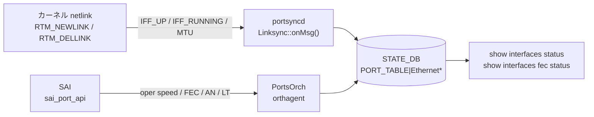

# STATE\_DB PORT\_TABLE（ポート状態テーブル）

## 概要

`STATE_DB` の `PORT_TABLE` は、物理スイッチポート（`Ethernet<N>`）の **oper 状態** を保持する読み取り専用テーブル。設定ではなく、カーネル netlink および SAI から取得した実際の動作状態を反映する。

書き込み主体は 2 つ:

| プロセス | 書き込みトリガー |
|---------|----------------|
| `portsyncd` (`linksync.cpp`) | カーネル netlink RTM\_NEWLINK / RTM\_DELLINK 受信時 |
| `orchagent` (`PortsOrch`) | SAI からのポートステータス通知・初期化・ポーリング時 |

CONFIG_DB の `PORT` テーブル（設定フィールド）とは **別テーブル、別 DB** であることに注意。

<!-- cdb-mermaid -->
### データフロー



<!-- /cdb-mermaid -->

## key 構造

```text
PORT_TABLE|<name>
```

`<name>` は `Ethernet<N>` 形式の物理ポート名。CONFIG_DB `PORT` テーブルのキーと同一。

## フィールド一覧

| フィールド | 書込み主体 | 型 | デフォルト | 説明 |
|-----------|---------|-----|-----------|------|
| `state` | `portsyncd` | string | `"ok"` | netdev 作成完了を示す固定値。`"ok"` のみ |
| `admin_status` | `portsyncd` | `up` / `down` | カーネル IFF\_UP 由来 | カーネル netdev の admin 状態 |
| `mtu` | `portsyncd` | uint (文字列) | カーネル netdev MTU | カーネルの netdev MTU |
| `netdev_oper_status` | `portsyncd` | `up` / `down` | カーネル IFF\_RUNNING 由来 | カーネル netdev の oper 状態 |
| `speed` | `PortsOrch` | uint / `"N/A"` (文字列) | `"N/A"` | SAI oper speed [Mbps]。DOWN 時は stale 残留 |
| `supported_speeds` | `PortsOrch` | string (CSV) | (フィールド不在) | SAI サポート速度一覧。SAI 未対応時は不在 |
| `fec` | `PortsOrch` | string | `"N/A"` | SAI oper FEC モード。詳細は [fec-state.md](fec-state.md) |
| `supported_fecs` | `PortsOrch` | string (CSV) | (フィールド不在) | SAI サポート FEC 一覧。詳細は [fec-state.md](fec-state.md) |
| `host_tx_ready` | `PortsOrch` | `true` / `false` | `"false"` | ホスト TX 送出可否。CMIS 対応システムのみ有効 |
| `rmt_adv_speeds` | `PortsOrch` | string (CSV) / `"N/A"` | `"N/A"` | autoneg 有効時のリモート広告速度 |
| `link_training_status` | `PortsOrch` | string | `"off"` | リンクトレーニング状態 |
| `phy_ctrl_unreliable_los` | `PortsOrch` | `true` / `false` | `"false"` | serdes unreliable LOS フラグ |

## フィールド別詳細

### `state`

`portsyncd` の `LinkSync::onMsg()` (linksync.cpp:197) が RTM\_NEWLINK 受信時に固定値 `"ok"` を書き込む。`"error"` 等の値はコード上存在しない。エントリが存在すること自体が「netdev 作成済み」を意味する。

RTM\_DELLINK 受信時はエントリ全体を `del()` で削除する (linksync.cpp:184)。

### `admin_status` / `netdev_oper_status`

どちらもカーネルの netlink フラグ（`IFF_UP` / `IFF_RUNNING`）から直接取得する。CONFIG\_DB `PORT.admin_status` とは **独立して** 動作する。

```cpp
bool admin = flags & IFF_UP;        // admin_status
bool oper  = flags & IFF_RUNNING;   // netdev_oper_status
```

### `mtu`

`rtnl_link_get_mtu(link)` で取得したカーネル netdev の MTU を文字列化して書き込む。CONFIG\_DB `PORT.mtu` が orchagent 経由で ASIC に設定された結果としてカーネル MTU に反映されるが、あくまでカーネル値を読む。

### `speed`

`PortsOrch::updateDbPortOperSpeed()` (portsorch.cpp:9850):

```cpp
string speedStr = speed != 0 ? to_string(speed) : "N/A";
m_portStateTable.set(port.m_alias, tuples);
```

- ポート UP + SAI 取得成功: `"100000"` のような数値文字列 [Mbps]
- ポート UP + SAI 取得失敗: `"N/A"`
- ポート DOWN: **書き込みが行われない**。最後の値が stale 残留

### `host_tx_ready`

初期化時 (portsorch.cpp:2202) にフィールドが存在しない場合 `"false"` で書き込む。その後:

- admin DOWN または Gearbox 失敗: `"false"`
- admin UP + Gearbox OK + SAI 成功: `"true"`
- `m_cmisModuleAsicSyncSupported = true` の場合: orchagent は直接制御せず、SAI コールバック経由

### `rmt_adv_speeds`

autoneg が無効に設定された場合は `hdel` でフィールドを削除する (portsorch.cpp:4862)。autoneg 有効 + admin UP の場合にのみ値が書き込まれる。

### `link_training_status`

取り得る値:

| 値 | 意味 |
|----|------|
| `"off"` | LT 無効（デフォルト） |
| `"on"` | LT 有効、rx\_status 取得不可 |
| `"trained"` | SAI\_PORT\_LINK\_TRAINING\_RX\_STATUS\_TRAINED |
| `"training"` | rx\_status が TRAINING |
| `"frame_lock"` / `"snr_acq"` | rx ステータス中間状態 |
| LT failure string | SAI failure status 由来 |

<!-- defaults -->
## フィールド暗黙デフォルト（Phase A — コード由来）

YANG/スキーマ定義外の fallback。`linksync.cpp` および `portsorch.cpp` の実装から導出。

| フィールド | コード由来デフォルト | fallback 源 |
|-----------|-------------------|------------|
| `state` | `"ok"` (固定) | linksync.cpp:197 — RTM\_NEWLINK 到着時に必ず `"ok"` を書く。他の値はコードに存在しない |
| `admin_status` | カーネル IFF\_UP 由来 | linksync.cpp:130 — `flags & IFF_UP` が 0 → `"down"` |
| `netdev_oper_status` | カーネル IFF\_RUNNING 由来 | linksync.cpp:131 — `flags & IFF_RUNNING` が 0 → `"down"` |
| `mtu` | カーネル netdev MTU | linksync.cpp:139 — `rtnl_link_get_mtu()` の返り値 |
| `speed` | `"N/A"` | portsorch.cpp:9855 — speed=0 渡し時は `"N/A"` |
| `supported_speeds` | (フィールド不在) | portsorch.cpp:3155 — SAI 取得失敗時は clear() → join → 空文字、または set 自体を呼ばない |
| `fec` | `"N/A"` | portsorch.cpp:9920 — SAI 未対応 / getPortOperFec 失敗 / 変換失敗で `"N/A"` |
| `supported_fecs` | (フィールド不在) | portsorch.cpp:3281 — SAI NOT\_SUPPORTED/NOT\_IMPLEMENTED 時は set() を呼ばない |
| `host_tx_ready` | `"false"` | portsorch.cpp:2202 — initHostTxReadyState でフィールド未設定時に `"false"` 書き込み |
| `rmt_adv_speeds` | `"N/A"` または (フィールド不在) | portsorch.cpp:11327,11334 — admin DOWN 時は `"N/A"`、autoneg OFF 時は hdel |
| `link_training_status` | `"off"` | portsorch.cpp:11351 — ローカル変数初期値が `"off"` |
| `phy_ctrl_unreliable_los` | `"false"` | portsorch.cpp:5191 — setPortSerdesAttribute 失敗時に `m_unreliable_los = false` |

### 検出した挙動乖離・注意点

1. **`state` は事実上 `"ok"` の一択**: RTM\_NEWLINK で固定値を書くため、ネットワーク障害などでも `"ok"` から変わらない。リンクアップ/ダウンは `netdev_oper_status` で確認すること。

2. **DOWN 時の stale 残留**: `speed` / `fec` は ポート DOWN 時に更新されない。最後に UP だった時の値が残留する。`netdev_oper_status != "up"` の場合は参照しないことを推奨。

3. **`admin_status` は CONFIG\_DB と独立**: linksync が書き込む `admin_status` はカーネル IFF\_UP フラグ由来で、CONFIG\_DB `PORT.admin_status` とは非同期で動く。通常は同期しているが、起動シーケンス中は一時的に乖離する可能性がある。

4. **`mtu` の二重管理**: CONFIG\_DB `PORT.mtu` → orchagent → SAI → カーネル netdev という経路で MTU が設定されるが、STATE\_DB `PORT_TABLE.mtu` はカーネル MTU を直接読む。orchagent が ASIC に設定した MTU と STATE\_DB の値は通常一致するが、遅延がある。

5. **`host_tx_ready` の CMIS 依存**: `m_cmisModuleAsicSyncSupported` が true の場合、orchagent は `host_tx_ready` を直接制御しない。SAI コールバック `on_port_host_tx_ready` (portsorch.cpp:977) が代わりに呼ばれる。100G ZR など光トランシーバ環境ではこのフラグが重要。

6. **`supported_speeds` の空文字列**: SAI が対応速度を返したが空集合だった場合、`swss::join(',', ...)` の結果は空文字列 `""` になる（フィールド不在ではなく空文字列として存在する）。フィールド不在（SAI NOT\_SUPPORTED 時）とは区別する必要がある。

<!-- /defaults -->

## 購読者（consumer）

| プロセス | 参照フィールド | 用途 |
|---------|--------------|------|
| `show interfaces status` | `netdev_oper_status` / `admin_status` / `speed` / `mtu` | インタフェース一覧表示 |
| `show interfaces fec status` | `fec` / `supported_fecs` | FEC oper/supported 表示 |
| `intfmgr` | `state` | ポートが STATE\_DB に登録済みか確認してから IP インタフェース処理を進める |
| `buffermgrdyn` | `state` | バッファ動的設定のトリガー |
| `teammgr` | `state` | LAG メンバポートの oper 状態確認 |
| `natmgr` | `state` | NAT エントリのポート有効性確認 |
| `macsecmgr` | `state` | MACsec セッション確立前のポート確認 |

## 関連リファレンス

- CONFIG\_DB: [`PORT` テーブル](port.md) — 物理ポートの設定フィールド
- STATE\_DB: [`FEC ステート`](fec-state.md) — `fec` / `supported_fecs` フィールドの詳細
- CLI: `show interfaces status` — oper speed / admin\_status / mtu の表示
