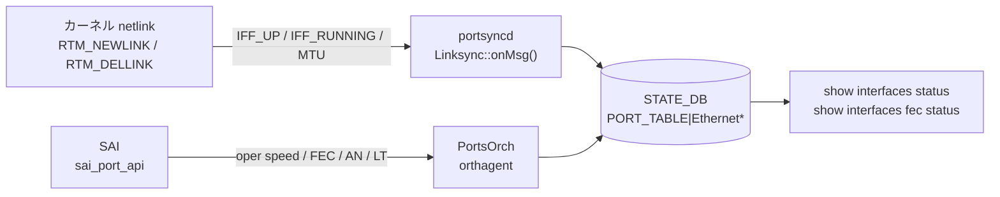

# STATE\_DB PORT\_TABLE（ポート状態テーブル）

## 概要

`STATE_DB` の `PORT_TABLE` は、物理スイッチポート（`Ethernet<N>`）の **oper 状態** を保持する読み取り専用テーブル。設定ではなく、カーネル netlink および SAI から取得した実際の動作状態を反映する。

書き込み主体は 2 つ:

| プロセス | 書き込みトリガー |
|---------|----------------|
| `portsyncd` (`linksync.cpp`) | カーネル netlink RTM\_NEWLINK / RTM\_DELLINK 受信時 |
| `orchagent` (`PortsOrch`) | SAI からのポートステータス通知・初期化・ポーリング時 |

CONFIG_DB の `PORT` テーブル（設定フィールド）とは **別テーブル、別 DB** であることに注意。

<!-- cdb-mermaid -->
### データフロー



<!-- /cdb-mermaid -->

## key 構造

```text
PORT_TABLE|<name>
```

`<name>` は `Ethernet<N>` 形式の物理ポート名。CONFIG_DB `PORT` テーブルのキーと同一。

## フィールド一覧

| フィールド | 書込み主体 | 型 | デフォルト | 説明 |
|-----------|---------|-----|-----------|------|
| `state` | `portsyncd` | string | `"ok"` | netdev 作成完了を示す固定値。`"ok"` のみ |
| `admin_status` | `portsyncd` | `up` / `down` | カーネル IFF\_UP 由来 | カーネル netdev の admin 状態 |
| `mtu` | `portsyncd` | uint (文字列) | カーネル netdev MTU | カーネルの netdev MTU |
| `netdev_oper_status` | `portsyncd` | `up` / `down` | カーネル IFF\_RUNNING 由来 | カーネル netdev の oper 状態 |
| `speed` | `PortsOrch` | uint / `"N/A"` (文字列) | `"N/A"` | SAI oper speed [Mbps]。DOWN 時は stale 残留 |
| `supported_speeds` | `PortsOrch` | string (CSV) | (フィールド不在) | SAI サポート速度一覧。SAI 未対応時は不在 |
| `fec` | `PortsOrch` | string | `"N/A"` | SAI oper FEC モード。詳細は [fec-state.md](fec-state.md) |
| `supported_fecs` | `PortsOrch` | string (CSV) | (フィールド不在) | SAI サポート FEC 一覧。詳細は [fec-state.md](fec-state.md) |
| `host_tx_ready` | `PortsOrch` | `true` / `false` | `"false"` | ホスト TX 送出可否。CMIS 対応システムのみ有効 |
| `rmt_adv_speeds` | `PortsOrch` | string (CSV) / `"N/A"` | `"N/A"` | autoneg 有効時のリモート広告速度 |
| `link_training_status` | `PortsOrch` | string | `"off"` | リンクトレーニング状態 |
| `phy_ctrl_unreliable_los` | `PortsOrch` | `true` / `false` | `"false"` | serdes unreliable LOS フラグ |

## フィールド別詳細

### `state`

`portsyncd` の `LinkSync::onMsg()` (linksync.cpp:197) が RTM\_NEWLINK 受信時に固定値 `"ok"` を書き込む。`"error"` 等の値はコード上存在しない。エントリが存在すること自体が「netdev 作成済み」を意味する。

RTM\_DELLINK 受信時はエントリ全体を `del()` で削除する (linksync.cpp:184)。

### `admin_status` / `netdev_oper_status`

どちらもカーネルの netlink フラグ（`IFF_UP` / `IFF_RUNNING`）から直接取得する。CONFIG\_DB `PORT.admin_status` とは **独立して** 動作する。

```cpp
bool admin = flags & IFF_UP;        // admin_status
bool oper  = flags & IFF_RUNNING;   // netdev_oper_status
```

### `mtu`

`rtnl_link_get_mtu(link)` で取得したカーネル netdev の MTU を文字列化して書き込む。CONFIG\_DB `PORT.mtu` が orchagent 経由で ASIC に設定された結果としてカーネル MTU に反映されるが、あくまでカーネル値を読む。

### `speed`

`PortsOrch::updateDbPortOperSpeed()` (portsorch.cpp:9850):

```cpp
string speedStr = speed != 0 ? to_string(speed) : "N/A";
m_portStateTable.set(port.m_alias, tuples);
```

- ポート UP + SAI 取得成功: `"100000"` のような数値文字列 [Mbps]
- ポート UP + SAI 取得失敗: `"N/A"`
- ポート DOWN: **書き込みが行われない**。最後の値が stale 残留

### `host_tx_ready`

初期化時 (portsorch.cpp:2202) にフィールドが存在しない場合 `"false"` で書き込む。その後:

- admin DOWN または Gearbox 失敗: `"false"`
- admin UP + Gearbox OK + SAI 成功: `"true"`
- `m_cmisModuleAsicSyncSupported = true` の場合: orchagent は直接制御せず、SAI コールバック経由

### `rmt_adv_speeds`

autoneg が無効に設定された場合は `hdel` でフィールドを削除する (portsorch.cpp:4862)。autoneg 有効 + admin UP の場合にのみ値が書き込まれる。

### `link_training_status`

取り得る値:

| 値 | 意味 |
|----|------|
| `"off"` | LT 無効（デフォルト） |
| `"on"` | LT 有効、rx\_status 取得不可 |
| `"trained"` | SAI\_PORT\_LINK\_TRAINING\_RX\_STATUS\_TRAINED |
| `"training"` | rx\_status が TRAINING |
| `"frame_lock"` / `"snr_acq"` | rx ステータス中間状態 |
| LT failure string | SAI failure status 由来 |

<!-- ordering -->
## 書込み順依存 (Phase B)

`STATE_DB PORT_TABLE` への書き込みは `portsyncd`（linksync.cpp）と `PortsOrch`（portsorch.cpp）の 2 プロセスが担う。両者の書き込みタイミングには下記の順序制約がある。

### 検出された順序依存

| # | 依存関係 | 方向 | 緩和策 |
|---|----------|------|--------|
| 1 | APP_DB `PORT_TABLE` の存在 → `portsyncd` の STATE_DB 書き込み許可 | **強制先行** | orchagent が APP_DB を書くまで STATE_DB エントリは不在 |
| 2 | 起動時 `ip link set down` → RTM_NEWLINK 再受信 → STATE_DB 更新 | 起動シーケンス依存 | 旧インタフェースからの RTM は無視ガードで除外 |
| 3 | `portsyncd` 4 フィールドの atomic set | 同一 RTM_NEWLINK イベント内で原子的 | 順序依存なし |
| 4 | PortsOrch ポート初期化完了 → `supported_speeds` / `supported_fecs` 書き込み | **強制先行**（serdes 設定後） | 起動直後は不在。SAI キャッシュ後は変化しない |
| 5 | SAI admin set 成功 → `host_tx_ready = "true"` | **強制先行**（SAI 成功必須） | CMIS 環境は SAI コールバック経由 |
| 6 | oper UP → speed / fec 更新 | oper UP 依存（DOWN 時 stale 残留） | consumer は `netdev_oper_status` で補正 |
| 7 | `CONFIG_DB PORT.autoneg` 変更 → `rmt_adv_speeds` 書き込み/削除 | CONFIG_DB イベント依存 | autoneg OFF で自動 hdel |

### 主要な制約詳細

**APP_DB 先行必須 (依存 #1)**: `LinkSync::onMsg()` は RTM_NEWLINK 受信時に `m_portTable.get(key, temp)` で APP_DB `PORT_TABLE` にエントリが存在するかを確認する（linksync.cpp:193）。APP_DB に未登録のポート名（起動シーケンス中で orchagent が APP_DB 書き込みを完了していない段階）では STATE_DB 書き込みがスキップされる。consumer が `STATE_DB PORT_TABLE|EthernetN` を参照する前に、orchagent の初期化完了を待つ必要がある。

**起動時の中間状態 (依存 #2)**: 非 warm-reboot 起動時に `LinkSync::LinkSync()` は全フロントパネルポートを `ip link set Ethernet* down` で DOWN させる（linksync.cpp:96-107）。これにより再起動前の古い STATE_DB 値が、最初の RTM_NEWLINK 受信まで上書きされない状態が発生する。旧インタフェースの RTM は `m_ifindexOldNameMap` によるガード（linksync.cpp:172-177）で無視されるため、STATE_DB の更新は portsyncd が新しい RTM_NEWLINK を受信した時点まで遅延する。

**host_tx_ready の順序 (依存 #5)**: `initHostTxReadyState()` で `"false"` を初期書き込み後、`setPortAdminStatus()` 内で admin UP + SAI set 成功 + Gearbox OK がそろって初めて `"true"` に更新される（portsorch.cpp:2220-2257）。SAI が失敗している間は `"false"` のまま。`m_cmisModuleAsicSyncSupported = true` の CMIS 対応環境では `setPortAdminStatus()` の直接制御はスキップされ、SAI コールバック `on_port_host_tx_ready`（portsorch.cpp:977）が代わりに書き込む。

**speed / fec の stale 残留 (依存 #6)**: `PortsOrch::refreshPortStatus()` はポート oper UP 確認後にのみ `updateDbPortOperSpeed()` / `updateDbPortOperFec()` を呼ぶ（portsorch.cpp:9905-9930）。ポートが oper DOWN になっても、speed / fec の STATE_DB フィールドは削除も更新もされないため、最後に UP だった時の値が残留する。speed / fec を参照する際は `netdev_oper_status` が `"up"` であることを先に確認すること。

<!-- /ordering -->

<!-- cross-refs -->
## 暗黙テーブル参照 (Phase C)

書き込みデーモン (`portsyncd` / `PortsOrch`) が STATE_DB へ書き込む前に暗黙的に参照・依存する CONFIG_DB / APPL_DB / STATE_DB テーブルおよび外部コンポーネントを示す。

### portsyncd (linksync.cpp) の前提参照

| 参照先テーブル / コンポーネント | 参照方向 | 条件 | evidence |
|--------------------------------|---------|------|---------|
| APPL_DB `PORT_TABLE` (`APP_PORT_TABLE_NAME`) | `m_portTable.get(key, temp)` で RTM_NEWLINK 受信ごとにエントリ存在確認 | キーが存在しないとき STATE_DB への書き込みをスキップ。orchagent の APPL_DB 初期化が完了していない起動初期は STATE_DB 書き込みが発生しない | linksync.cpp:193 |

### PortsOrch (portsorch.cpp) の前提参照

| 参照先テーブル / コンポーネント | 参照方向 | 条件 | evidence |
|--------------------------------|---------|------|---------|
| APPL_DB `PORT_TABLE` (`PortConfigDone` / `PortInitDone`) | `m_portTable->hget("PortConfigDone", "count", value)` / `m_portTable->get("PortInitDone", ...)` | 両エントリが揃うまでポート初期化ループを進めず、STATE_DB への `supported_speeds` / `supported_fecs` 等の書き込みも発生しない | portsorch.cpp:4342–4357 |
| STATE_DB `TRANSCEIVER_INFO` (`STATE_TRANSCEIVER_INFO_TABLE_NAME`) | `SubscriberStateTable` として購読。SET/DEL イベントで `doTransceiverPresenceCheck()` を呼び出す | `m_cmisModuleAsicSyncSupported = true` の CMIS 対応環境のみ有効。このパスを経由して `host_tx_ready` が制御される。CMIS 非対応環境では購読しない | portsorch.cpp:984, 6498–6501 |
| APPL_DB `_GEARBOX_TABLE` | `GearboxUtils::isGearboxEnabled()` で Gearbox 有無を判定し、`hset` で oper speed を書き込み | Gearbox が有効な環境では `setPortAdminStatus()` の成功判定に Gearbox ステータスを含め、STATE_DB `host_tx_ready` の更新タイミングが変化する | portsorch.cpp:775, 2246, 3422, 10375–10376 |
| CONFIG_DB `WARM_RESTART` テーブル | `WarmStart::isWarmStart()` 経由でコンストラクタ時に参照 | warm start モードの場合、既存 APPL_DB エントリから `oper_status` を読み出してポートを復元するフローになる。cold boot 時と初期化順序が異なる | portsorch.cpp:753, 6610–6618 |

!!! note "CMIS 環境での `host_tx_ready` 制御の切り替え"
    `m_cmisModuleAsicSyncSupported` が `true` の場合、`PortsOrch` は `setPortAdminStatus()` 内で `host_tx_ready` を直接書き込まず、SAI コールバック `on_port_host_tx_ready` (portsorch.cpp:977) と `TRANSCEIVER_INFO` 購読経由でのみ書き込む。この切り替えにより `host_tx_ready = "true"` の到達タイミングが非 CMIS 環境と異なるため、consumer は環境依存の遅延を考慮する必要がある。

> 中間調査詳細: `meta/_intermediate/cdb-flow/state-db-port-cross-refs.md`
<!-- /cross-refs -->

<!-- failure -->
## 失敗挙動 (Phase D)

`STATE_DB PORT_TABLE` への書き込みは `portsyncd` と `PortsOrch` の 2 プロセスが担い、それぞれ独立した失敗経路を持つ。本テーブルは STATUS テーブルではないため、フィールドへの書き込み失敗は**サイレント（フィールド不在または旧値残留）**になる場合が多い。`ERROR_TABLE` への書き込みはどちらのプロセスも行わない。

### portsyncd (linksync.cpp) の失敗パターン

| 失敗ケース | 発生箇所 | 挙動 | retry |
|-----------|---------|------|-------|
| RTM_NEWLINK 受信時に APP_DB `PORT_TABLE` にポートが未登録 | linksync.cpp:193 (`m_portTable.get(key, temp)` が false) | STATE_DB への書き込み全体をスキップ。`SWSS_LOG_NOTICE("Cannot find %s in port table")` のみ | なし。次の RTM_NEWLINK まで STATE_DB エントリ不在 |
| RTM_NEWLINK が旧インタフェースの ifindex で届いた | linksync.cpp:172-177 (`m_ifindexOldNameMap` チェック) | 処理全体を無視。STATE_DB の更新なし。エラーログなし | なし |
| RTM_DELLINK 受信 → `m_statePortTable.del(key)` | linksync.cpp:184 | STATE_DB エントリ全体を削除。フィールド単位の partial delete は行わない | なし |

**起動時の書き込み空白期間**: 非 warm-reboot 起動時、portsyncd は既存フロントパネルポートを `ip link set Ethernet* down` し、新しい RTM_NEWLINK を待つ。この間に consumer が STATE_DB を参照すると古い値を読むか（DB が残留）エントリが不在（DB がリセットされた場合）となる。warm-reboot の場合はこの down / up サイクルが発生しないため STATE_DB の空白期間はない（linksync.cpp:45, 74-77）。

### PortsOrch (portsorch.cpp) の失敗パターン

| 失敗ケース | 発生箇所 | 挙動 | retry |
|-----------|---------|------|-------|
| `allPortsReady() == false` 時に port_state_change 通知を受信 | portsorch.cpp:9617-9621 | 通知全体をドロップ。`speed` / `fec` / `link_training_status` の更新なし。通知は消費されキューに残らない | なし。`refreshPortStatus()` によるポーリングで補完される場合あり |
| `getPortOperStatus()` が SAI 失敗を返す | portsorch.cpp:9898-9901 | `throw runtime_error("PortsOrch get port oper status failure")` — orchagent プロセスがクラッシュ。STATE_DB への書き込みが全停止する | プロセス再起動後に復旧 |
| `getPortSupportedSpeeds()` で SAI が `NOT_SUPPORTED` / `NOT_IMPLEMENTED` | portsorch.cpp:3145-3156 | `supported_speeds` に空文字列を書き込む（フィールド不在とは区別）| なし |
| `getPortOperFec()` 成功だが `fecToStr()` が未知 FEC 値を受けた | portsorch.cpp:9920-9928 | `SWSS_LOG_ERROR` 出力 + `fec = "N/A"` で書き込み。フォールバックのため STATE_DB は必ず更新される | なし |
| `initHostTxReadyState()` → SAI または Gearbox 失敗 | portsorch.cpp:2219-2274 | `host_tx_ready = "false"` が残留。"true" への更新は発生しない | なし（再 admin up 操作で再評価） |
| `setPortSerdesAttribute()` が失敗 | portsorch.cpp:5191-5200 | `m_unreliable_los = false` のまま `phy_ctrl_unreliable_los = "false"` を書き込む。SAI エラーはログのみ | なし |
| `rmt_adv_speeds` — autoneg OFF 時に `hdel` | portsorch.cpp:4862 | フィールドを削除。autoneg が再度 ON になれば書き戻される | 自動 |

### 不在・stale 残留のまとめ

- **フィールド不在**: ポートが APP_DB に未登録のうちは STATE_DB エントリそのものが不在。SAI が `NOT_SUPPORTED` を返した場合 `supported_fecs` はフィールド不在のまま。
- **stale 残留**: `speed` / `fec` はポート oper DOWN 時に削除・更新されない。`netdev_oper_status != "up"` 時に参照すると前回 UP 時の値が返る。
- **ERROR_TABLE**: linksync.cpp / portsorch.cpp いずれも失敗時に `ERROR_TABLE` へ書き込まない。失敗検知は syslog (`journalctl -u swss`) の `SWSS_LOG_ERROR` / `SWSS_LOG_NOTICE` のみ。

> 中間調査詳細: `meta/_intermediate/cdb-flow/state-db-port-failure.md`
<!-- /failure -->

<!-- constants -->
## ハードコード定数 (Phase E)

以下の定数は `sonic-swss/orchagent/portsorch.cpp`、`sonic-swss/orchagent/portsorch.h`、`sonic-swss/portsyncd/linksync.cpp` から検出したマジックナンバー・閾値。いずれも CONFIG_DB では変更不可のハードコード値。

| 定数 / マジック値 | 値 | 定義場所 | 意味・影響 |
|------------------|-----|----------|-----------|
| `PORT_STATE_POLLING_SEC` | `5` | `portsorch.cpp:86` | `m_port_state_poller` の SelectableTimer 周期 [秒]。SAI イベント通知が失敗した場合に `refreshPortStatus()` がポート oper 状態を最大 5 秒遅れで STATE_DB に書き込む |
| `PORT_SPEED_LIST_DEFAULT_SIZE` | `16` | `portsorch.cpp:85` | `getPortSupportedSpeeds()` の SAI クエリ用 vector 初期サイズ。サポート速度数が 16 を超える場合は SAI が `SAI_STATUS_BUFFER_OVERFLOW` を返し、vector が自動リサイズされる |
| `MAX_MACSEC_SECTAG_SIZE` | `32` | `portsorch.h:28` | MACsec SecTAG ヘッダのバイトサイズ。`setPortMtu()` 内で MACsec 有効時の SAI MTU 設定値を `requested_mtu - 32` で算出するため、MACsec 環境では STATE_DB `mtu` フィールドがカーネル設定値より 32 大きくなる可能性がある (`portsorch.cpp:6756-6759`) |
| `"ok"` | 文字列リテラル | `linksync.cpp:196` | `state` フィールドの固定値。RTM\_NEWLINK 受信時に必ずこの値が書き込まれ、`"error"` 等の他の値はコードに存在しない |
| `"N/A"` | 文字列リテラル | `portsorch.cpp:9855, 9919, 3292` | `speed` / `fec` / `supported_fecs` のフォールバック文字列。SAI 取得失敗・変換不可時にフィールド不在ではなく `"N/A"` 文字列として書き込まれる |
| `"false"` | 文字列リテラル | `portsorch.cpp:2203, 2274` | `host_tx_ready` の初期値。`initHostTxReadyState()` でフィールド未設定時、および admin DOWN / Gearbox 失敗時に書き込まれる |
| `"off"` | 文字列リテラル | `portsorch.cpp:11351` | `link_training_status` のローカル変数初期値。LT が無効または SAI 取得不可の場合に書き込まれる |

!!! note "PORT_STATE_POLLING_SEC の影響"
    SAI event-driven 通知（`port_state_change` コールバック）が正常に機能している間はポーリングの影響は小さい。ただし通知が欠落した場合、STATE_DB の `speed` / `fec` 更新は最大 5 秒遅延する。consumer が即時性を要求する場合は通知ベースのパス（`SubscriberStateTable` など）を利用すること。

!!! note "MACsec 環境での `mtu` 乖離"
    MACsec が有効なポートでは、orchagent が SAI に設定する MTU は `CONFIG_DB PORT.mtu - 32` になる。一方 STATE_DB `PORT_TABLE.mtu` は `portsyncd` がカーネル netdev の MTU を直接読み出す。カーネル側 MTU を MACsec を考慮した値に設定している場合、STATE_DB 値と CONFIG_DB 設定値が一致しないことがある。

> 調査証跡: `meta/_intermediate/cdb-flow/state-db-port-constants.md`
<!-- /constants -->

<!-- defaults -->
## フィールド暗黙デフォルト（Phase A — コード由来）

YANG/スキーマ定義外の fallback。`linksync.cpp` および `portsorch.cpp` の実装から導出。

| フィールド | コード由来デフォルト | fallback 源 |
|-----------|-------------------|------------|
| `state` | `"ok"` (固定) | linksync.cpp:197 — RTM\_NEWLINK 到着時に必ず `"ok"` を書く。他の値はコードに存在しない |
| `admin_status` | カーネル IFF\_UP 由来 | linksync.cpp:130 — `flags & IFF_UP` が 0 → `"down"` |
| `netdev_oper_status` | カーネル IFF\_RUNNING 由来 | linksync.cpp:131 — `flags & IFF_RUNNING` が 0 → `"down"` |
| `mtu` | カーネル netdev MTU | linksync.cpp:139 — `rtnl_link_get_mtu()` の返り値 |
| `speed` | `"N/A"` | portsorch.cpp:9855 — speed=0 渡し時は `"N/A"` |
| `supported_speeds` | (フィールド不在) | portsorch.cpp:3155 — SAI 取得失敗時は clear() → join → 空文字、または set 自体を呼ばない |
| `fec` | `"N/A"` | portsorch.cpp:9920 — SAI 未対応 / getPortOperFec 失敗 / 変換失敗で `"N/A"` |
| `supported_fecs` | (フィールド不在) | portsorch.cpp:3281 — SAI NOT\_SUPPORTED/NOT\_IMPLEMENTED 時は set() を呼ばない |
| `host_tx_ready` | `"false"` | portsorch.cpp:2202 — initHostTxReadyState でフィールド未設定時に `"false"` 書き込み |
| `rmt_adv_speeds` | `"N/A"` または (フィールド不在) | portsorch.cpp:11327,11334 — admin DOWN 時は `"N/A"`、autoneg OFF 時は hdel |
| `link_training_status` | `"off"` | portsorch.cpp:11351 — ローカル変数初期値が `"off"` |
| `phy_ctrl_unreliable_los` | `"false"` | portsorch.cpp:5191 — setPortSerdesAttribute 失敗時に `m_unreliable_los = false` |

### 検出した挙動乖離・注意点

1. **`state` は事実上 `"ok"` の一択**: RTM\_NEWLINK で固定値を書くため、ネットワーク障害などでも `"ok"` から変わらない。リンクアップ/ダウンは `netdev_oper_status` で確認すること。

2. **DOWN 時の stale 残留**: `speed` / `fec` は ポート DOWN 時に更新されない。最後に UP だった時の値が残留する。`netdev_oper_status != "up"` の場合は参照しないことを推奨。

3. **`admin_status` は CONFIG\_DB と独立**: linksync が書き込む `admin_status` はカーネル IFF\_UP フラグ由来で、CONFIG\_DB `PORT.admin_status` とは非同期で動く。通常は同期しているが、起動シーケンス中は一時的に乖離する可能性がある。

4. **`mtu` の二重管理**: CONFIG\_DB `PORT.mtu` → orchagent → SAI → カーネル netdev という経路で MTU が設定されるが、STATE\_DB `PORT_TABLE.mtu` はカーネル MTU を直接読む。orchagent が ASIC に設定した MTU と STATE\_DB の値は通常一致するが、遅延がある。

5. **`host_tx_ready` の CMIS 依存**: `m_cmisModuleAsicSyncSupported` が true の場合、orchagent は `host_tx_ready` を直接制御しない。SAI コールバック `on_port_host_tx_ready` (portsorch.cpp:977) が代わりに呼ばれる。100G ZR など光トランシーバ環境ではこのフラグが重要。

6. **`supported_speeds` の空文字列**: SAI が対応速度を返したが空集合だった場合、`swss::join(',', ...)` の結果は空文字列 `""` になる（フィールド不在ではなく空文字列として存在する）。フィールド不在（SAI NOT\_SUPPORTED 時）とは区別する必要がある。

<!-- /defaults -->

## 購読者（consumer）

| プロセス | 参照フィールド | 用途 |
|---------|--------------|------|
| `show interfaces status` | `netdev_oper_status` / `admin_status` / `speed` / `mtu` | インタフェース一覧表示 |
| `show interfaces fec status` | `fec` / `supported_fecs` | FEC oper/supported 表示 |
| `intfmgr` | `state` | ポートが STATE\_DB に登録済みか確認してから IP インタフェース処理を進める |
| `buffermgrdyn` | `state` | バッファ動的設定のトリガー |
| `teammgr` | `state` | LAG メンバポートの oper 状態確認 |
| `natmgr` | `state` | NAT エントリのポート有効性確認 |
| `macsecmgr` | `state` | MACsec セッション確立前のポート確認 |

## 関連リファレンス

- CONFIG\_DB: [`PORT` テーブル](port.md) — 物理ポートの設定フィールド
- STATE\_DB: [`FEC ステート`](fec-state.md) — `fec` / `supported_fecs` フィールドの詳細
- CLI: `show interfaces status` — oper speed / admin\_status / mtu の表示
