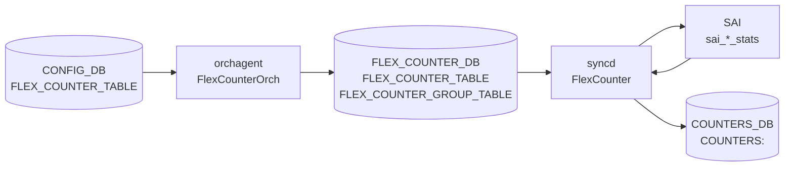

# FLEX_COUNTER_DB ランタイム状態フィールド

## 概要

[SONiC](../../reference/glossary.md#term-sonic) のハードウェアカウンタポーリングは **3 つの DB** にまたがって動作する[^1]:

| DB | 番号 | 役割 |
|----|------|------|
| `CONFIG_DB` | 4 | ユーザー設定（`FLEX_COUNTER_TABLE`）|
| `FLEX_COUNTER_DB` | 5 | orchagent → syncd 制御信号（group 設定 + per-OID ID リスト）|
| `COUNTERS_DB` | 2 | syncd → 外部 読み取り専用の実カウンタ値 |

本ページは **FLEX_COUNTER_DB**（DB 5）のランタイム状態フィールドと、syncd 内 `FlexCounter` モジュールが持つコード由来デフォルト値を記述する。

<!-- cdb-mermaid -->
### データフロー



<!-- /cdb-mermaid -->

## FLEX_COUNTER_DB のテーブル構造

### FLEX_COUNTER_GROUP_TABLE — グループ制御

```text
FLEX_COUNTER_GROUP_TABLE|<group>
```

orchagent が書き込む group-level 制御フィールド:

| フィールド | 型 | 説明 |
|----------|----|------|
| `POLL_INTERVAL` | uint32 (ms) | ポーリング間隔 |
| `FLEX_COUNTER_STATUS` | `enable` / `disable` | ポーリング有効化 |
| `STATS_MODE` | `STATS_MODE_READ` / `STATS_MODE_READ_AND_CLEAR` | カウンタ読み取りモード |
| `BULK_CHUNK_SIZE` | uint32 | 1 回の SAI bulk API で処理するエントリ数 |
| `BULK_CHUNK_SIZE_PER_PREFIX` | string | プレフィクス別チャンクサイズ |

### FLEX_COUNTER_TABLE — per-OID カウンタ ID リスト

```text
FLEX_COUNTER_TABLE|<group>|<oid>
  <COUNTER_ID_LIST_FIELD> = <comma-separated SAI stat enum>
```

orchagent の各 Orch（PortsOrch / IntfsOrch / BufferOrch 等）が、`FLEX_COUNTER_STATUS = enable` を受信すると、ハードウェアオブジェクトごとにエントリを書き込む。詳細は [`counters-flex`](counters-flex.md) を参照。

<!-- defaults -->
## 暗黙デフォルト・コード由来挙動 (Phase A)

<!-- evidence: sonic-sairedis/syncd/FlexCounter.cpp,
     sonic-sairedis/syncd/FlexCounterManager.cpp,
     sonic-swss/orchagent/flexcounterorch.cpp,
     sonic-swss/orchagent/portsorch.cpp,
     sonic-buildimage/files/build_templates/init_cfg.json.j2,
     sonic-buildimage/src/sonic-yang-models/yang-models/sonic-flex_counter.yang,
     sonic-utilities/counterpoll/main.py,
     sonic-utilities/scripts/db_migrator.py -->

### FlexCounter インスタンス初期状態

`FlexCounter::FlexCounter(...)` コンストラクタ（FlexCounter.cpp:3031-3051）の初期値:

| フィールド | 初期値 | 意味 |
|-----------|--------|------|
| `m_enable` | `false` | `FLEX_COUNTER_STATUS = enable` 受信前はポーリング無効 |
| `m_pollInterval` | `0` | 0ms ではポーリングループが実行されない |
| `m_readyToPoll` | `false` | ID リスト未登録状態 |
| `m_isDiscarded` | `false` | インスタンス有効状態 |

**ポーリング実行条件**（FlexCounter.cpp:3538）:

```cpp
if (m_enable && !allIdsEmpty() && (m_pollInterval > 0))
```

3 条件すべてが `true` でないとポーリングしない。config が正しく投入されていても ID リストが空の場合は動作しない。

### `FLEX_COUNTER_STATUS` の暗黙デフォルト

`setStatus()` は `enable` / `disable` のみ受け付ける。その他の値は `SWSS_LOG_WARN` でスキップされ `m_enable` は変更されない（FlexCounter.cpp:3079-3083）:

```cpp
if (cit == statusMap.cend())
{
    SWSS_LOG_WARN("Input value %s is not supported ...", status.c_str());
    return;
}
```

未設定時は `m_enable = false`（ポーリング無効）。

### `STATS_MODE` の暗黙デフォルト

`setStatsMode()` が処理するフィールド:

| 値 | 意味 | 用途 |
|----|------|------|
| `STATS_MODE_READ` | 読み取りのみ（デフォルト） | PORT, QUEUE, PG_DROP 等 |
| `STATS_MODE_READ_AND_CLEAR` | 読み取り後クリア | QUEUE_WATERMARK, PG_WATERMARK |

`portsorch.cpp:866-886` が `QUEUE_WATERMARK` と `PG_WATERMARK` グループに対して `STATS_MODE_READ_AND_CLEAR` を明示投入する。設定なし時は `STATS_MODE_READ` 扱い。

### portsorch.cpp ハードコード初期ポーリング間隔

FlexCounter グループ作成時、portsorch.cpp:87-93 で定義された定数が初期 `POLL_INTERVAL` として FLEX_COUNTER_DB に書き込まれる。CONFIG_DB の `POLL_INTERVAL` 値で後から上書き可能。

| グループ | ハードコード初期値 | 定数名 |
|---------|-------------------|--------|
| `PORT` | 1000 ms | `PORT_STAT_FLEX_COUNTER_POLLING_INTERVAL_MS` |
| `PORT_BUFFER_DROP` | 60000 ms | `PORT_BUFFER_DROP_STAT_POLLING_INTERVAL_MS` |
| `PORT_PHY_ATTR` | 10000 ms | `PORT_PHY_ATTR_FLEX_COUNTER_POLLING_INTERVAL_MS` |
| `QUEUE` | 10000 ms | `QUEUE_STAT_FLEX_COUNTER_POLLING_INTERVAL_MS` |
| `QUEUE_WATERMARK` | 60000 ms | `QUEUE_WATERMARK_STAT_FLEX_COUNTER_POLLING_INTERVAL_MS` |
| `PG_WATERMARK` | 60000 ms | `PG_WATERMARK_STAT_FLEX_COUNTER_POLLING_INTERVAL_MS` |
| `PG_DROP` | 10000 ms | `PG_DROP_STAT_FLEX_COUNTER_POLLING_INTERVAL_MS` |
| `WRED_ECN_PORT` | 1000 ms | `PORT_STAT_FLEX_COUNTER_POLLING_INTERVAL_MS` と共用 |
| `WRED_ECN_QUEUE` | 10000 ms | `QUEUE_STAT_FLEX_COUNTER_POLLING_INTERVAL_MS` と共用 |

**YANG との乖離**: YANG（sonic-flex_counter.yang）の `poll_interval` typedef は `range 100..4294967295` で統一。portsorch のハードコード値は YANG バリデーション対象外。CONFIG_DB `POLL_INTERVAL` が未設定でも portsorch 初期化時に FLEX_COUNTER_DB へ書き込まれるため、`counterpoll show` 表示とは異なる実値になる場合がある。

### FlexCounterOrch m_* フラグ初期値

`flexcounterorch.cpp:433-478` の各 `get*State()` メソッドが返すフラグ:

| フラグ | 対応グループ | 初期値 |
|--------|-------------|--------|
| `m_port_counter_enabled` | `PORT` | `false` |
| `m_port_buffer_drop_counter_enabled` | `PORT_BUFFER_DROP` | `false` |
| `m_queue_enabled` | `QUEUE` | `false` |
| `m_queue_watermark_enabled` | `QUEUE_WATERMARK` | `false` |
| `m_pg_enabled` | `PG_DROP` | `false` |
| `m_pg_watermark_enabled` | `PG_WATERMARK` | `false` |
| `m_wred_port_counter_enabled` | `WRED_ECN_PORT` | `false` |
| `m_wred_queue_counter_enabled` | `WRED_ECN_QUEUE` | `false` |
| `m_route_flow_counter_enabled` | `FLOW_CNT_ROUTE` | `false` |

これらのフラグは portsorch / intfsOrch 等が新しいポート・RIF を追加したときに、カウンタ ID リストを FLEX_COUNTER_DB に書き込むかどうかを制御する。フラグが `false` のままでは `FLEX_COUNTER_STATUS = enable` が書き込まれていても ID リスト登録が行われずポーリングは起動しない（3 条件のうち `allIdsEmpty()` が `true` のため）。

### `BULK_CHUNK_SIZE` / `BULK_CHUNK_SIZE_PER_PREFIX` の挙動

FLEX_COUNTER_DB レベルの bulk 設定:

| 種類 | 内容 |
|------|------|
| 未設定時 fallback | orchagent は `"NULL"` 文字列を FLEX_COUNTER_DB に送信。syncd 側で chunk size 無限（上限なし）として扱われる |
| 片方のみ設定 | 未設定側は `"NULL"` で自動補完（flexcounterorch.cpp:405）。ユーザーへの通知なし |
| 両方省略 UPDATE | `m_groupsWithBulkChunkSize` から erase → `"NULL","NULL"` を送信してリセット |

### warm-reboot / fast-reboot との関係

FLEX_COUNTER_DB は warm-reboot 後に全クリアされ、orchagent 起動時に再構築される。

`db_migrator.py` の migration:

| migration | 条件 | 動作 |
|-----------|------|------|
| `migrate_config_db_flex_counter_delay_status` | fast-reboot 前 | CONFIG_DB `FLEX_COUNTER_TABLE` 全エントリの `FLEX_COUNTER_DELAY_STATUS` を `true` に強制上書き |
| `migrate_flex_counter_delay_status_removal` | cross-branch upgrade 時 | `FLEX_COUNTER_DELAY_STATUS` フィールドを全エントリから削除 |

**FLEX_COUNTER_DELAY_STATUS の通常起動時挙動**: orchagent コンストラクタで `m_delayTimerExpired = true` が即セットされるため、通常起動では遅延なし。フィールドは fast-reboot 専用。

### STATE_DB との関係

STATE_DB（DB 6）に FLEX_COUNTER 専用の独立テーブルはない。FLEX_COUNTER システムが STATE_DB を参照するのは syncd の warm-reboot 状態（`STATE_DB:WARM_RESTART_TABLE`）のみ（Syncd.cpp:5824）。ポーリング状態・カウンタ値は FLEX_COUNTER_DB と COUNTERS_DB で完結する。

<!-- /defaults -->

## 確認コマンド

```bash
# FLEX_COUNTER_DB の group 設定確認
sonic-db-cli FLEX_COUNTER_DB keys 'FLEX_COUNTER_GROUP_TABLE|*'
sonic-db-cli FLEX_COUNTER_DB hgetall 'FLEX_COUNTER_GROUP_TABLE|PORT'

# per-OID カウンタ ID リスト確認
sonic-db-cli FLEX_COUNTER_DB keys 'FLEX_COUNTER_TABLE|PORT|*' | head -5

# CONFIG_DB の設定確認
counterpoll show

# 実カウンタ値確認（COUNTERS_DB）
sonic-db-cli COUNTERS_DB keys 'COUNTERS:*' | head -5
```

<!-- ref-triangle:start -->

## 関連リファレンス

- [FLEX_COUNTER_TABLE テーブル](flex-counter-table.md) — CONFIG_DB グループ設定
- [FLEX_COUNTER 個別カウンタフィールド](counters-flex.md) — FLEX_COUNTER_DB per-OID ID リスト
- [YANG](../../reference/glossary.md#term-yang): [`sonic-flex_counter`](../yang/sonic-flex_counter.md)
- CLI: `counterpoll`

<!-- ref-triangle:end -->

## 引用元

[^1]: `sonic-swss-common/common/schema.h`: `COUNTERS_DB = 2`, `FLEX_COUNTER_DB = 5`, `STATE_DB = 6`. <https://github.com/sonic-net/sonic-swss-common/blob/master/common/schema.h>

<!-- topics-back-ref -->
## 関連 Topics

- [Topics: Telemetry / SNMP / Observability](../../topics/09-telemetry-snmp/index.md)

<!-- /topics-back-ref -->
