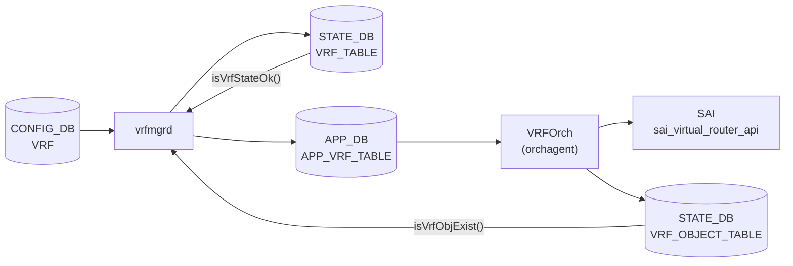

# VRF ステートテーブル（STATE_DB）

## 概要

SONiC の VRF 削除処理は `vrfmgrd`（Linux VRF デバイス管理）と `orchagent/VRFOrch`（SAI VR オブジェクト管理）が非同期に動作するため、両者の完了を同期するための sentinel として STATE_DB に 2 つのテーブルが使われる。

| DB | テーブル名 | 書込み主体 | 意味 |
|----|-----------|-----------|------|
| STATE_DB | `VRF_TABLE\|<name>` | `vrfmgrd` | Linux VRF デバイスが作成済み + APP_DB に書き込み済み |
| STATE_DB | `VRF_OBJECT_TABLE\|<name>` | `VRFOrch` (orchagent) | SAI VR (Virtual Router) オブジェクトが作成済み |

CONFIG_DB の設定フィールドを保持する [`VRF` テーブル](vrf.md) とは別物。このページで説明するテーブルは読み取り専用の状態情報。

<!-- cdb-mermaid -->
### データフロー



!!! note "凡例"
    STATE_DB の 2 テーブルは VRF 削除時の順序保証に使われる。詳細は本文参照。

<!-- /cdb-mermaid -->

## VRF_TABLE

### key 構造

```text
VRF_TABLE|<name>
```

`<name>` は VRF 名（例: `VrfRed`、`mgmt`）。CONFIG_DB `VRF` テーブルのキーと同一。

### フィールド一覧

| フィールド | 型 | 書込み主体 | デフォルト | 説明 |
|-----------|----|-----------|-----------|------|
| `state` | string | `vrfmgrd` | `"ok"` (固定) | VRF が APP_DB に登録済みであることを示す sentinel |

### 書き込みタイミング

- **SET**: CONFIG_DB `VRF` への SET 操作受信後、`setLink()` を呼んで Linux VRF デバイスを作成し、APP_DB `VRF_TABLE` に書き込んだあとに `m_stateVrfTable.set(vrfName, {{"state","ok"}})` を実行 (vrfmgr.cpp:289)
- **DEL**: VRFOrch が SAI VR を削除して `VRF_OBJECT_TABLE|<name>` を消したことを `isVrfObjExist()` で確認してから `m_stateVrfTable.del(vrfName)` を実行 (vrfmgr.cpp:339)

### consumer

| プロセス | 参照方法 | 目的 |
|---------|---------|------|
| `intfmgrd` | `m_stateVrfTable.get(alias, temp)` (intfmgr.cpp:671, 680) | VRF が存在しない間はインタフェースへの VRF バインドを保留 |
| `vxlanmgr` | `isVrfStateOk()` → `m_stateVrfTable.get(vrfName, temp)` (vxlanmgr.cpp:744) | VXLAN VRF マッピング設定の前提条件チェック |

## VRF_OBJECT_TABLE

### key 構造

```text
VRF_OBJECT_TABLE|<name>
```

### フィールド一覧

| フィールド | 型 | 書込み主体 | デフォルト | 説明 |
|-----------|----|-----------|-----------|------|
| `state` | string | `VRFOrch` | `"ok"` (固定) | SAI VR オブジェクトが正常に作成済みであることを示す sentinel |

### 書き込みタイミング

- **SET (hset)**: `sai_virtual_router_api->create_virtual_router()` が `SAI_STATUS_SUCCESS` を返した場合のみ `m_stateVrfObjectTable.hset(vrf_name, "state", "ok")` を実行 (vrforch.cpp:120, 150)
- **DEL**: `remove_virtual_router()` 成功後に `m_stateVrfObjectTable.del(vrf_name)` を実行 (vrforch.cpp:193)

### consumer

| プロセス | 参照方法 | 目的 |
|---------|---------|------|
| `vrfmgrd` | `isVrfObjExist()` → `m_stateVrfObjectTable.get(vrfName, temp)` (vrfmgr.cpp:208, 331) | VRF 削除時に orchagent の SAI VR 削除完了を待機してから Linux VRF デバイスを削除 |

## 削除同期シーケンス

VRF 削除時の正常な順序:

```
1. CONFIG_DB VRF|<name> DEL
       ↓
2. vrfmgrd: doTask で DEL を受信
   → isVrfObjExist() が true の間はループ待機 (VRFOrch がまだ SAI VR を削除していない)
       ↓
3. vrfmgrd: APP_DB VRF_TABLE del → orchagent へ通知
       ↓
4. VRFOrch: APP_DB VRF_TABLE DEL を受信
   → SAI remove_virtual_router() を実行
   → VRF_OBJECT_TABLE del (vrfmgr.cpp の待機ループを unblock)
       ↓
5. vrfmgrd: isVrfObjExist() が false に
   → VRF_TABLE del
   → delLink() で Linux VRF デバイス削除
```

<!-- value-behavior -->
## 値依存挙動マトリクス

| テーブル | フィールド | 値 | 実挙動 |
|---------|-----------|-----|--------|
| `VRF_TABLE` | `state` | `"ok"` | vrfmgrd が SET を受理し APP_DB に書き込み済み |
| `VRF_TABLE` | (エントリなし) | — | VRF が未作成、または削除処理が完了済み |
| `VRF_OBJECT_TABLE` | `state` | `"ok"` | SAI `create_virtual_router()` が成功して VR オブジェクトが存在する |
| `VRF_OBJECT_TABLE` | (エントリなし) | — | orchagent が SAI VR を作成していない（または削除済み）|

<!-- /value-behavior -->

<!-- defaults -->
## 暗黙デフォルト・コード由来挙動 (Phase A)

> 調査日 2026-05-14。ソース: `sonic-swss/cfgmgr/vrfmgr.cpp`, `sonic-swss/orchagent/vrforch.cpp`, `sonic-swss/orchagent/vrforch.h`
> 中間調査: `meta/_intermediate/cdb-flow/state-vrf-defaults.md`

### state フィールドの値はハードコード

両テーブルとも `"ok"` がコードにハードコードされており、他の値（`"error"` 等）は取り得ない。失敗した場合はエントリ自体が存在しないか、書き込み前に処理が中断される。

```cpp
// vrfmgr.cpp:288-289
fvVector.emplace_back("state", "ok");
m_stateVrfTable.set(vrfName, fvVector);

// vrforch.cpp:120
m_stateVrfObjectTable.hset(vrf_name, "state", "ok");
```

### VRF_TABLE の state=ok は Linux VRF 作成成功を保証しない

`setLink()` が失敗（テーブル ID 枯渇、`ip link add` エラー）した場合でも `SWSS_LOG_ERROR` を記録したあと処理を継続し、`m_stateVrfTable.set()` が呼ばれる (vrfmgr.cpp:281-289)。厳密には「SET 操作を vrfmgrd が受理した」を意味する。

### VRF_OBJECT_TABLE は SAI 成功のときのみ書き込まれる

`SAI_STATUS_SUCCESS` 以外のとき `parseHandleSaiStatusFailure(handle_status)` で `false` を返すため hset が呼ばれない (vrforch.cpp:97-120)。`VRF_OBJECT_TABLE` エントリの存在は「SAI VR オブジェクトが実際に存在する」ことの evidence となる。

### mgmt VRF の非対称性

`vrfmgrd` は mgmt VRF についても `m_stateVrfTable.set()` を呼ぶため `VRF_TABLE|mgmt` が存在しうる。一方 `VRFOrch` は mgmt VRF に対して SAI VR を作成しない（起動時のデフォルト VR を使用）ため `VRF_OBJECT_TABLE|mgmt` は存在しない。

### YANG 未定義テーブル

`sonic-vrf.yang` は CONFIG_DB の `VRF` テーブルのみをモデル化する。STATE_DB の `VRF_TABLE` / `VRF_OBJECT_TABLE` に YANG スキーマはなく、フィールド定義はコードのみで保証される。

### 最大 VRF 数制限

`vrfmgrd` は起動時に `VRF_TABLE_START=1001` から `VRF_TABLE_END=5097` の範囲でルーティングテーブル ID を管理する。最大 **4096** 個の VRF を同時に保持でき、超過すると `getFreeTable()` が 0 を返して Linux VRF 作成失敗 → `VRF_TABLE` への書き込みは依然発生する（前述の非保証挙動）。

<!-- /defaults -->

<!-- ordering -->
## 書込み順依存 (Phase B)

> 調査日 2026-05-17。ソース: `sonic-swss/cfgmgr/vrfmgr.cpp`, `sonic-swss/cfgmgr/intfmgr.cpp`, `sonic-swss/cfgmgr/vxlanmgr.cpp`
> 中間調査: `meta/_intermediate/cdb-flow/state-vrf-ordering.md`

### SET 方向の書込み順序

VRF 作成時の書込み順序は以下のとおり固定されている:

```
CONFIG_DB VRF|<name> SET
  ↓
vrfmgrd: Linux VRF デバイス作成 (setLink)
  ↓ (1)
vrfmgrd: STATE_DB VRF_TABLE|<name> SET {state=ok}   ← vrfmgrd が先に書く
  ↓ (2)
vrfmgrd: APP_DB APP_VRF_TABLE|<name> SET             ← その後 APP_DB に通知
  ↓ (3)
VRFOrch: SAI create_virtual_router()
  ↓ (4)
VRFOrch: STATE_DB VRF_OBJECT_TABLE|<name> SET {state=ok}
```

`VRF_TABLE` は APP_DB への書込みと **同時または直前** に書かれる (vrfmgr.cpp:289, 305)。
`VRF_OBJECT_TABLE` は SAI 成功後に orchagent が書くため、必ず `VRF_TABLE` より **後** になる。

### DEL 方向の書込み順序と polling ループ

```
CONFIG_DB VRF|<name> DEL
  ↓
vrfmgrd: isVrfObjExist() → STATE_DB VRF_OBJECT_TABLE|<name> の存在確認
  → false (orchagent 未完了): m_toSync キューに残して次の doTask() で再確認
  → true  (orchagent 完了済み): 削除処理へ進む (vrfmgr.cpp:331)
  ↓
vrfmgrd: APP_DB APP_VRF_TABLE|<name> DEL
vrfmgrd: STATE_DB VRF_TABLE|<name> DEL
  ↓
VRFOrch: SAI remove_virtual_router()
VRFOrch: STATE_DB VRF_OBJECT_TABLE|<name> DEL
```

`VRF_TABLE` の DEL は必ず `VRF_OBJECT_TABLE` の DEL より **先** になる。
これにより fpmsyncd が VRF インタフェース名を参照できる期間を保証する (vrfmgr.cpp:316 コメント)。

### 後続プロセスの待機依存

| 後続プロセス | 参照テーブル | 待機条件 | ソース |
|-------------|------------|---------|--------|
| `intfmgrd` | `VRF_TABLE` | VRF バインドの前提として存在確認。なければ `m_toSync` に残留 | intfmgr.cpp:671, 680 |
| `vxlanmgr` | `VRF_TABLE` | VXLAN VRF マッピング設定前に `isVrfStateOk()` で確認 | vxlanmgr.cpp:744 |
| `vrfmgrd` 自身 | `VRF_OBJECT_TABLE` | DEL 時に orchagent の SAI 削除完了を待機 | vrfmgr.cpp:331, 342 |

<!-- /ordering -->

<!-- cross-refs -->
## 暗黙参照テーブル (Phase C)

> 調査日 2026-05-18。ソース: `sonic-swss/cfgmgr/vrfmgr.cpp`, `sonic-swss/cfgmgr/intfmgr.cpp`, `sonic-swss/cfgmgr/vxlanmgr.cpp`, `sonic-swss/orchagent/vrforch.cpp`
> 中間調査: `meta/_intermediate/cdb-flow/state-vrf-ordering.md`

`VRF_TABLE` / `VRF_OBJECT_TABLE` の書込みトリガ・キー値・フィールド値が暗黙的に依存する入力テーブルとプロセス内状態を示す。

| 参照方向 | このテーブル | 相手テーブル / リソース | 条件 | ソース evidence |
|---------|------------|----------------------|------|----------------|
| vrfmgrd → VRF_TABLE | `VRF_TABLE\|<name>` | `CONFIG_DB:VRF\|<name>` | SET/DEL トリガ。VRF 名はそのまま STATE_DB キーへ転写 | vrfmgr.cpp:289, 339 |
| vrfmgrd → VRF_TABLE | `VRF_TABLE\|<name>` | `CONFIG_DB:MGMT_VRF_CONFIG\|vrf_global` | mgmt VRF 設定も同一 vrfmgrd パスで処理。`mgmt` キーで書込み | vrfmgr.cpp:323-324 |
| vrfmgrd → VRF_TABLE | `VRF_TABLE\|<name>` | `CONFIG_DB:VNET\|<name>` | VNET も vrfmgrd が同ロジックで `VRF_TABLE` 書込み。VNET 名がキー | vrfmgr.cpp:308, 351 |
| VRFOrch → VRF_OBJECT_TABLE | `VRF_OBJECT_TABLE\|<name>` | `APP_DB:VRF_TABLE\|<name>` | APP_DB への VRF_TABLE SET/DEL が VRFOrch の処理トリガ | vrforch.cpp:87-121, orchdaemon.cpp:283 |
| VRFOrch → VRF_OBJECT_TABLE | `VRF_OBJECT_TABLE\|<name>` | SAI `sai_virtual_router_api` | `create_virtual_router()` / `remove_virtual_router()` 成否に直結。SAI 成功時のみ hset | vrforch.cpp:96-120, 173-193 |
| intfmgrd ← VRF_TABLE | — | `VRF_TABLE\|<name>` | intfmgrd が `isIntfStateOk()` で `VRF_TABLE` 存在を gate として参照。エントリなければ VRF バインドを defer | intfmgr.cpp:671, 680 |
| vxlanmgr ← VRF_TABLE | — | `VRF_TABLE\|<name>` | vxlanmgr が `isVrfStateOk()` で `VRF_TABLE` 存在を gate として参照。VXLAN-VRF マッピング設定を defer | vxlanmgr.cpp:328, 744 |
| vrfmgrd ← VRF_OBJECT_TABLE | — | `VRF_OBJECT_TABLE\|<name>` | DEL 時 vrfmgrd が `isVrfObjExist()` で polling。存在する間は `m_toSync` 再キュー | vrfmgr.cpp:331, 342 |

### 参照関係サマリ

```
CONFIG_DB:VRF|<name>  (または MGMT_VRF_CONFIG / VNET)
  │
  ▼ SET/DEL トリガ
vrfmgrd::doTask()
  ├─ [書込み] STATE_DB:VRF_TABLE|<name>  {state="ok"}
  │     ├─ consumer: intfmgrd (isIntfStateOk gate)
  │     └─ consumer: vxlanmgr (isVrfStateOk gate)
  └─ [書込み] APP_DB:VRF_TABLE|<name>
        │
        ▼ Orch 処理トリガ
      VRFOrch::addOperation() / delOperation()
        └─ SAI sai_virtual_router_api
              └─ [書込み] STATE_DB:VRF_OBJECT_TABLE|<name>  {state="ok"}
                    └─ consumer: vrfmgrd (isVrfObjExist polling, DEL 時)
```

<!-- /cross-refs -->

<!-- cdb-exceptions -->
## 例外条件・特殊挙動

<!-- evidence: meta/_intermediate/cdb-flow/state-vrf-defaults.md -->

- **orchagent クラッシュ後の stale エントリ**: orchagent が VRF 削除の途中で落ちた場合、`VRF_OBJECT_TABLE|<name>` が残留し vrfmgrd の削除ループが永続的にブロックされる。再起動 (warm start なし) で解消。
- **VRF_TABLE の DEL タイミング**: `isVrfObjExist()` が false になった瞬間に `m_stateVrfTable.del()` と `delLink()` が連続して実行される。この間に `intfmgrd` や `vxlanmgr` が `VRF_TABLE` を参照すると "VRF not ready" として処理を遅延させる可能性がある。
- **VNET テーブル経由の VRF**: VNET (`m_appVnetTableProducer`) への書き込みも `m_stateVrfTable.set()` を呼ぶ (vrfmgr.cpp:308)。VNET VRF の場合、`VRF_TABLE` は存在するが `VRF_OBJECT_TABLE` は存在しない（VNETOrch は `VRF_OBJECT_TABLE` を書かない）。

<!-- /cdb-exceptions -->

## 確認コマンド

```bash
# VRF_TABLE エントリ一覧
sonic-db-cli STATE_DB keys 'VRF_TABLE|*'

# VRF_TABLE の state フィールド確認
sonic-db-cli STATE_DB hgetall 'VRF_TABLE|VrfRed'

# VRF_OBJECT_TABLE エントリ一覧
sonic-db-cli STATE_DB keys 'VRF_OBJECT_TABLE|*'

# VRF_OBJECT_TABLE の state フィールド確認
sonic-db-cli STATE_DB hgetall 'VRF_OBJECT_TABLE|VrfRed'
```

## 関連リファレンス

- CONFIG_DB: [`VRF` テーブル](vrf.md) — VRF の設定フィールド (`fallback`, `vni`)
- CONFIG_DB: [`MGMT_VRF_CONFIG` テーブル](mgmt-vrf-config.md) — mgmt VRF 設定
- YANG: [`sonic-vrf`](../yang/sonic-vrf.md) — CONFIG_DB スキーマ定義（STATE_DB は未定義）
- CLI: [`config vrf`](../cli/config-vrf.md)
- HLD: [VRF サポート設計](../../routing/sonic-vrf-support-design-spec-draft.md)
