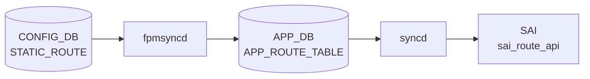

# STATIC_ROUTE テーブル

## 概要

`STATIC_ROUTE` は静的経路を [CONFIG_DB](../../reference/glossary.md#term-config_db) に保持するテーブル。[YANG](../../reference/glossary.md#term-yang) では template 形式 (`STATIC_ROUTE|<prefix>`) と [VRF](../../reference/glossary.md#term-vrf)-aware 形式 (`STATIC_ROUTE|<vrf_name>|<prefix>`) の 2 つの list が定義されている[^1]。nexthop、出力 interface、[BGP](../../reference/glossary.md#term-bgp) への advertise、[BFD](../../reference/glossary.md#term-bfd)、administrative distance、nexthop [VRF](../../reference/glossary.md#term-vrf)、blackhole 指定を扱う。テーブル名の実装側定数は `schema.h` も参照する[^2]。

<!-- cdb-mermaid -->
### データフロー (自動生成)



!!! note "凡例"
    CONFIG_DB から SAI までの典型経路を `docs/reference/config-db-orch-map.md` から機械生成したミニ図。詳細・例外は本ページ本文と対応表を参照。
<!-- /cdb-mermaid -->

## key 構造

```text
STATIC_ROUTE|<prefix>
STATIC_ROUTE|<vrf_name>|<prefix>
```

`<prefix>` は IPv4 / IPv6 prefix。`<vrf_name>` は `default`、`mgmt`、または `Vrf...` 形式。

## 主要フィールド

| フィールド | 型 | 既定値 | 説明 |
|-----------|----|--------|------|
| `nexthop` | string | - | nexthop IP。interface route では `0.0.0.0` を指定する想定 |
| `ifname` | string | - | 出力 interface |
| `advertise` | comma-separated boolean string | `false` | [BGP](../../reference/glossary.md#term-bgp) へ広告するか。nexthop ごとに指定可能 |
| `bfd` | comma-separated boolean string | `false` | nexthop ごとの [BFD](../../reference/glossary.md#term-bfd) 監視有効化。template 形式のみ |
| `distance` | comma-separated uint8 string | `0` | administrative distance。[VRF](../../reference/glossary.md#term-vrf)-aware 形式のみ |
| `nexthop-vrf` | comma-separated VRF string | - | VRF leaking 用 nexthop VRF。VRF-aware 形式のみ |
| `blackhole` | comma-separated boolean string | `false` | 一致パケットを破棄する blackhole route。VRF-aware 形式のみ |

## 制約

- `advertise`、`bfd`、`blackhole` は `true` / `false` のカンマ区切り文字列。
- `distance` は 0..255 のカンマ区切り文字列。
- `nexthop-vrf` は `default`、`mgmt`、`Vrf...` のカンマ区切り文字列。
- [YANG](../../reference/glossary.md#term-yang) の VRF-aware key は `vrf_name prefix`。template 形式には `vrf_name` が無い。

## 購読者

- `staticd` / `zebra` ([FRR](../../reference/glossary.md#term-frr)): SONiC の設定生成パスを通じて static route を [FRR](../../reference/glossary.md#term-frr) に反映する。
- `bgpcfgd` / routing config パス: `advertise` が有効な static route を [BGP](../../reference/glossary.md#term-bgp) 広告対象として扱う。
- `orchagent` / route orch: kernel / [FRR](../../reference/glossary.md#term-frr) から [APPL_DB](../../reference/glossary.md#term-appl_db) 経由で転送経路を [SAI](../../reference/glossary.md#term-sai) route へ反映する。

## 関連 CONFIG_DB / YANG / CLI

- 関連 [CONFIG_DB](../../reference/glossary.md#term-config_db): `VRF`、`INTERFACE`、`PORTCHANNEL_INTERFACE`、`VLAN_INTERFACE`、`LOOPBACK_INTERFACE`
- 関連 CLI: `config route`
- 関連 [YANG](../../reference/glossary.md#term-yang): `sonic-static-route`

<!-- ref-triangle:start -->

## 関連リファレンス

- YANG: [`sonic-static-route`](../yang/sonic-static-route.md)
- CLI: [`config route`](../cli/config-route.md)

<!-- ref-triangle:end -->

## 引用元

[^1]: YANG 定義: `sonic-static-route.yang`. <https://github.com/sonic-net/sonic-buildimage/blob/9ea932ec2e18f35e58268ec2e4456b1d4afd65cd/src/sonic-yang-models/yang-models/sonic-static-route.yang>
[^2]: テーブル名定数参照: `schema.h`. <https://github.com/sonic-net/sonic-swss-common/blob/158de8d3463ff4b841653f6d57190bb142b80d9c/common/schema.h>

<!-- ops-hint -->
## 運用ヒント

### 典型値

- key 形式: `STATIC_ROUTE|<vrf>|<prefix>` (例 `STATIC_ROUTE|default|10.0.0.0/24`)。
- `nexthop`: カンマ区切り（[ECMP](../../reference/glossary.md#term-ecmp) 可）。
- `distance`: 1（規定）。
- `ifname`: 出力 IF（直接接続経路向け）。

### よくある誤設定

- `nexthop` の IP が到達不可だと FRR が経路を選択せず、`show ip route` で表示されない。
- BGP 学習経路と同じ prefix を static で入れると AD 値次第で意図しない切り替わり。

### 確認コマンド

```bash
sonic-db-cli CONFIG_DB keys 'STATIC_ROUTE|*'
show ip route static
vtysh -c 'show ip route'
```
<!-- /ops-hint -->

<!-- glossary-links-injected: 75289c2d3439 -->
