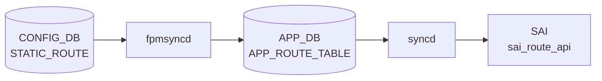

# STATIC_ROUTE テーブル

## 概要

`STATIC_ROUTE` は静的経路を [CONFIG_DB](../../reference/glossary.md#term-config_db) に保持するテーブル。[YANG](../../reference/glossary.md#term-yang) では template 形式 (`STATIC_ROUTE|<prefix>`) と [VRF](../../reference/glossary.md#term-vrf)-aware 形式 (`STATIC_ROUTE|<vrf_name>|<prefix>`) の 2 つの list が定義されている[^1]。nexthop、出力 interface、[BGP](../../reference/glossary.md#term-bgp) への advertise、[BFD](../../reference/glossary.md#term-bfd)、administrative distance、nexthop [VRF](../../reference/glossary.md#term-vrf)、blackhole 指定を扱う。テーブル名の実装側定数は `schema.h` も参照する[^2]。

<!-- cdb-mermaid -->
### データフロー (自動生成)



!!! note "凡例"
    CONFIG_DB から SAI までの典型経路を `docs/reference/config-db-orch-map.md` から機械生成したミニ図。詳細・例外は本ページ本文と対応表を参照。
<!-- /cdb-mermaid -->

## key 構造

```text
STATIC_ROUTE|<prefix>
STATIC_ROUTE|<vrf_name>|<prefix>
```

`<prefix>` は IPv4 / IPv6 prefix。`<vrf_name>` は `default`、`mgmt`、または `Vrf...` 形式。

## 主要フィールド

| フィールド | 型 | 既定値 | 説明 |
|-----------|----|--------|------|
| `nexthop` | string | - | nexthop IP。interface route では `0.0.0.0` を指定する想定 |
| `ifname` | string | - | 出力 interface |
| `advertise` | comma-separated boolean string | `false` | [BGP](../../reference/glossary.md#term-bgp) へ広告するか。nexthop ごとに指定可能 |
| `bfd` | comma-separated boolean string | `false` | nexthop ごとの [BFD](../../reference/glossary.md#term-bfd) 監視有効化。template 形式のみ |
| `distance` | comma-separated uint8 string | `0` | administrative distance。[VRF](../../reference/glossary.md#term-vrf)-aware 形式のみ |
| `nexthop-vrf` | comma-separated VRF string | - | VRF leaking 用 nexthop VRF。VRF-aware 形式のみ |
| `blackhole` | comma-separated boolean string | `false` | 一致パケットを破棄する blackhole route。VRF-aware 形式のみ |

## 制約

- `advertise`、`bfd`、`blackhole` は `true` / `false` のカンマ区切り文字列。
- `distance` は 0..255 のカンマ区切り文字列。
- `nexthop-vrf` は `default`、`mgmt`、`Vrf...` のカンマ区切り文字列。
- [YANG](../../reference/glossary.md#term-yang) の VRF-aware key は `vrf_name prefix`。template 形式には `vrf_name` が無い。

## 購読者

- `staticd` / `zebra` ([FRR](../../reference/glossary.md#term-frr)): SONiC の設定生成パスを通じて static route を [FRR](../../reference/glossary.md#term-frr) に反映する。
- `bgpcfgd` / routing config パス: `advertise` が有効な static route を [BGP](../../reference/glossary.md#term-bgp) 広告対象として扱う。
- `orchagent` / route orch: kernel / [FRR](../../reference/glossary.md#term-frr) から [APPL_DB](../../reference/glossary.md#term-appl_db) 経由で転送経路を [SAI](../../reference/glossary.md#term-sai) route へ反映する。

## 関連 CONFIG_DB / YANG / CLI

- 関連 [CONFIG_DB](../../reference/glossary.md#term-config_db): `VRF`、`INTERFACE`、`PORTCHANNEL_INTERFACE`、`VLAN_INTERFACE`、`LOOPBACK_INTERFACE`
- 関連 CLI: `config route`
- 関連 [YANG](../../reference/glossary.md#term-yang): `sonic-static-route`

<!-- ref-triangle:start -->

## 関連リファレンス

- YANG: [`sonic-static-route`](../yang/sonic-static-route.md)
- CLI: [`config route`](../cli/config-route.md)

<!-- ref-triangle:end -->

## 引用元

[^1]: YANG 定義: `sonic-static-route.yang`. <https://github.com/sonic-net/sonic-buildimage/blob/9ea932ec2e18f35e58268ec2e4456b1d4afd65cd/src/sonic-yang-models/yang-models/sonic-static-route.yang>
[^2]: テーブル名定数参照: `schema.h`. <https://github.com/sonic-net/sonic-swss-common/blob/158de8d3463ff4b841653f6d57190bb142b80d9c/common/schema.h>

<!-- ops-hint -->
## 運用ヒント

### 典型値

- key 形式: `STATIC_ROUTE|<vrf>|<prefix>` (例 `STATIC_ROUTE|default|10.0.0.0/24`)。
- `nexthop`: カンマ区切り（[ECMP](../../reference/glossary.md#term-ecmp) 可）。
- `distance`: 1（規定）。
- `ifname`: 出力 IF（直接接続経路向け）。

### よくある誤設定

- `nexthop` の IP が到達不可だと FRR が経路を選択せず、`show ip route` で表示されない。
- BGP 学習経路と同じ prefix を static で入れると AD 値次第で意図しない切り替わり。

### 確認コマンド

```bash
sonic-db-cli CONFIG_DB keys 'STATIC_ROUTE|*'
show ip route static
vtysh -c 'show ip route'
```
<!-- /ops-hint -->

<!-- value-behavior -->
## 値依存挙動マトリクス

### `advertise` 値別挙動
| 値 | 挙動 |
|----|------|
| `false` | BGP 広告なし（デフォルト）。`ROUTE_ADVERTISE_DISABLE_TAG` を付与して FRR に渡す。 |
| `true` | BGP に経路広告。`ROUTE_ADVERTISE_ENABLE_TAG` を付与。 |

### `bfd` 値別挙動
| 値 | 挙動 |
|----|------|
| `true` | `staticroutebfd` が [BFD](../../reference/glossary.md#term-bfd) セッションを監視。全セッション down で [APPL_DB](../../reference/glossary.md#term-appl_db) から経路削除。`bgpcfgd` の StaticRouteMgr は処理をスキップ（staticroutebfd 側が担う）。 |
| `false` | BFD 監視なし（デフォルト）。`bgpcfgd` が通常処理。 |

### `blackhole` 値別挙動
| 値 | 挙動 |
|----|------|
| `true` | blackhole route（パケット破棄）。nexthop / ifname 不要。FRR に `blackhole` で展開。 |
| `false` | 通常経路（デフォルト）。nexthop が必要。 |

### `distance` 値別挙動
| 値 | 挙動 |
|----|------|
| `0` | デフォルト AD（FRR は static デフォルト AD = 1 を使用）。 |
| 1..255 | 指定の AD で FRR 経路テーブルに挿入。値が小さいほど優先度高。 |

<!-- /value-behavior -->

<!-- cdb-exceptions -->
## 例外条件・特殊挙動

- **IpNextHopSet 構築例外**: ネクストホップ解析中に例外が発生した場合 `log_crit` を出して `return False` でスキップ。その静的経路は FRR に設定されない。[^2]
- **[APPL_DB](../../reference/glossary.md#term-appl_db) の key フォーマット不正**: APPL_DB の key で VRF を含む場合 `<vrf>:<prefix>` 形式を期待し、コロン区切りで 2 要素に分割できない場合は `ValueError` で処理中断。[^2]
- **BFD 有効時の APPL_DB 削除スキップ**: `bfd=true` の静的経路で APPL_DB から削除イベントが来ても、[CONFIG_DB](../../reference/glossary.md#term-config_db) に経路が残っている場合は FRR からの削除をスキップする（staticroutebfd との race condition 防止）。[^2]
- **BGP ASN 未設定時の redistribute 保留**: 最初の静的経路設定時に `bgp_asn` が DEVICE_METADATA に存在しない場合、redistribute static コマンドは `vrf_pending_redistribution` に保留されて後で適用される。[^2]
- **BFD セッション全断時の自動削除**: BFD が有効な nexthop のすべての BFD セッションが down になると APPL_DB から経路エントリが削除されて FRR からも経路が削除される。[^2]

[^2]: [bgpcfgd](../../reference/glossary.md#term-bgpcfgd) StaticRouteMgr 実装: `sonic-buildimage/src/sonic-bgpcfgd/bgpcfgd/managers_static_rt.py`. <https://github.com/sonic-net/sonic-buildimage/blob/master/src/sonic-bgpcfgd/bgpcfgd/managers_static_rt.py>


<!-- derivation -->
## 派生・条件付き登録 (Phase 6/7)

### Phase 6: 自動派生

staticroutemgrd が `ip_prefix` の形式（`:` 含むか否か）から FRR コマンド種別を自動決定する。IPv6 → `ipv6 route`、IPv4 → `ip route`。`distance` 未設定の場合は FRR デフォルト distance (1) を使用する。

### Phase 7: 条件付き登録 (add_manager 条件)

staticroutemgrd は常時起動し `STATIC_ROUTE` テーブルを無条件購読する。VRF が `STATIC_ROUTE|<vrf>|<prefix>` 形式で指定される場合は FRR に VRF 付き static route を設定する。`bfd==true` の場合は BFD セッション連携が有効になる。

<!-- /derivation -->

<!-- handler-branching -->
### Phase 8: Handler メソッド内分岐

| Handler | 分岐条件 | 効果 | evidence |
|---|---|---|---|
| `staticroutemgrd` | IPv6 プレフィクス | `ipv6 route <prefix> <nexthop>` | `staticroutemgrd` |
| `staticroutemgrd` | IPv4 プレフィクス | `ip route <prefix> <nexthop>` | `staticroutemgrd` |
| `staticroutemgrd` | `nexthop_vrf` フィールドあり | `ip route ... nexthop-vrf <vrf>` | `staticroutemgrd` |
| `staticroutemgrd` | `blackhole==true` | `ip route <prefix> blackhole` | `staticroutemgrd` |
| `staticroutemgrd` | `bfd==true` | BFD ダウン時に静的ルートを削除 | `staticroutemgrd` |
| `staticroutemgrd` | `distance` フィールドあり | FRR route distance を設定 | `staticroutemgrd` |
| `staticroutemgrd` | del_handler | FRR に `no ip route` 発行 | `staticroutemgrd` |

> **スキャン証跡**: `STATIC_ROUTE` は FRR 静的ルート設定の直接マッピング。IPv4/IPv6 の自動判定と VRF/BFD オプション分岐が主要。

<!-- /handler-branching -->

<!-- runtime-trace -->
## CDB → 実コンテナ動作トレース

### 段階 1: Consumer 登録

- **orchagent / StaticRouteOrch** または **bgpcfgd**: `STATIC_ROUTE` テーブルを `SubscriberStateTable` で購読。

### 段階 2: CFG → APPL 翻訳

- orchagent が APP_DB `ROUTE_TABLE` / `INTF_TABLE` を更新してルートを RouteOrch に渡す。

### 段階 3: APPL → SAI

- RouteOrch が `sai_route_api->create_route_entry()` でスタティックルートをハードウェアに書き込む。
- nexthop の ARP 解決が必要な場合は NeighOrch と連携。

### 段階 4: タイミング + 副作用

- nexthop が到達可能であれば数十 ms 以内に SAI に反映。
- 副作用: `blackhole` nexthop 設定時はパケットが静かに DROP される。

<!-- /runtime-trace -->
<!-- entry-points -->
## 書き込み入り口 (Direction A)

STATIC_ROUTE テーブルへの書き込みが発生するコード経路を網羅的に調査した結果。

### CLI

  - `config route add/del ...` — `config/main.py` が `set_entry('STATIC_ROUTE', key, route)` を呼ぶ (sonic-utilities/config/main.py:7886–7973)

### minigraph / sonic-cfggen

minigraph.py に STATIC_ROUTE 生成なし

### REST / gNMI

REST/gNMI 書き込み経路なし

### db_migrator

db_migrator.py での STATIC_ROUTE マイグレーションなし

### ビルド時デフォルト (build-time default)

なし

### ハードコードデフォルト / ランタイム注入

**sonic-bgpcfgd** `static_rt_timer.py` が STATIC_ROUTE を監視し staticd に広告 (sonic-buildimage/src/sonic-bgpcfgd/bgpcfgd/static_rt_timer.py); **frrcfgd** も STATIC_ROUTE を監視

### 死活・デッドコード

なし
<!-- /entry-points -->

<!-- pubsub -->
## CONFIG_DB 購読メカニズム (Phase G)

`STATIC_ROUTE` テーブルは `bgpcfgd` の `StaticRouteMgr` が `SubscriberStateTable` 経由で購読し、FRR vtysh コマンドに変換する。

### bgpcfgd — StaticRouteMgr (CONFIG_DB / APPL_DB)

`main.py` が `Runner.add_manager()` で `StaticRouteMgr` を 2 インスタンス登録する。

```python
# sonic-bgpcfgd/bgpcfgd/main.py L98-99
StaticRouteMgr(common_objs, "CONFIG_DB", "STATIC_ROUTE"),
StaticRouteMgr(common_objs, "APPL_DB",  "STATIC_ROUTE"),
```

`Runner.add_manager()` は各テーブルに対して `swsscommon.SubscriberStateTable` を生成し、`swsscommon.Select` に登録する。

```python
# sonic-bgpcfgd/bgpcfgd/runner.py L49-52
subscriber = swsscommon.SubscriberStateTable(conn, table_name)
self.subscribers.add(subscriber)
self.selector.addSelectable(subscriber)
self.callbacks[db][table_name].append(manager.handler)
```

Redis からのイベント到着時、`runner.py` は `subscriber.pop()` でキー・オペレーション・フィールド値を取得し、`StaticRouteMgr.handler(key, op, fvs)` を呼ぶ。

### set_handler → vtysh 経路

`set_handler` は受け取った `data` から nexthop セットを構築し、差分コマンドを生成して FRR に送信する。

```python
# managers_static_rt.py L211-218  generate_command
return '{}{} route {}{}{}{}'.format(
    'no ' if op == self.OP_DELETE else '',
    'ipv6' if ip_nh.af == socket.AF_INET6 else 'ip',
    ip_prefix,
    ip_nh,                                      # nexthop / blackhole / distance / nexthop-vrf
    ' vrf {}'.format(vrf) if vrf != 'default' else '',
    ' tag {}'.format(route_tag)
)
```

生成されたコマンドは `cfg_mgr.push_list(cmd_list)` でバッファに積まれ、`Runner.run()` の `cfg_manager.commit()` で `vtysh -f <tmpfile>` として一括実行される。

**FRR vtysh コマンド例:**

```
ip route 10.0.0.0/24 192.0.2.1 tag 1
ip route 10.0.0.0/24 blackhole tag 2
ipv6 route 2001:db8::/32 2001:db8::1 vrf Vrf-red tag 1
no ip route 10.0.0.0/24 192.0.2.1 tag 1
```

### advertise フラグと route-tag

`advertise=true` → `ROUTE_ADVERTISE_ENABLE_TAG = '1'`、`advertise=false` (デフォルト) → `ROUTE_ADVERTISE_DISABLE_TAG = '2'` を FRR タグとして付与。初回経路設定時に BGP への redistribute を有効化する vtysh コマンドも発行する。

```python
# managers_static_rt.py L221-235  enable_redistribution_command
cmd_list.append("route-map STATIC_ROUTE_FILTER permit 10")
cmd_list.append(" match tag %s" % self.ROUTE_ADVERTISE_ENABLE_TAG)
...
cmd_list.append("  redistribute static route-map STATIC_ROUTE_FILTER")
```

### 購読フロー要約

```
CONFIG_DB STATIC_ROUTE
  └─ bgpcfgd StaticRouteMgr (SubscriberStateTable, CONFIG_DB)
       ├─ set_handler → IpNextHopSet 構築 → generate_command
       │    └─ cfg_mgr.push_list → vtysh ip/ipv6 route <prefix> [nexthop|blackhole] [vrf] tag <tag>
       └─ del_handler → no ip/ipv6 route → vtysh

APPL_DB STATIC_ROUTE
  └─ bgpcfgd StaticRouteMgr (SubscriberStateTable, APPL_DB)
       └─ del_handler（BFD セッション全断時 staticroutebfd が削除したエントリを追従）
            └─ skip_appl_del() で CONFIG_DB 残存確認 → FRR からの削除可否判定
```

<!-- /pubsub -->

<!-- glossary-links-injected: 21a1d1474543 -->
