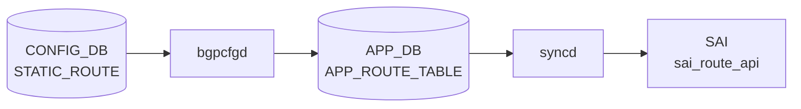

# STATIC_ROUTE テーブル

## 概要

`STATIC_ROUTE` は静的経路を [CONFIG_DB](../../reference/glossary.md#term-config_db) に保持するテーブル。[YANG](../../reference/glossary.md#term-yang) では template 形式 (`STATIC_ROUTE|<prefix>`) と [VRF](../../reference/glossary.md#term-vrf)-aware 形式 (`STATIC_ROUTE|<vrf_name>|<prefix>`) の 2 つの list が定義されている[^1]。nexthop、出力 interface、[BGP](../../reference/glossary.md#term-bgp) への advertise、[BFD](../../reference/glossary.md#term-bfd)、administrative distance、nexthop [VRF](../../reference/glossary.md#term-vrf)、blackhole 指定を扱う。テーブル名の実装側定数は `schema.h` も参照する[^2]。

<!-- cdb-mermaid -->
### データフロー (自動生成)



!!! note "凡例"
    CONFIG_DB から SAI までの典型経路を `docs/reference/config-db-orch-map.md` から機械生成したミニ図。詳細・例外は本ページ本文と対応表を参照。
<!-- /cdb-mermaid -->

## key 構造

```text
STATIC_ROUTE|<prefix>
STATIC_ROUTE|<vrf_name>|<prefix>
```

`<prefix>` は IPv4 / IPv6 prefix。`<vrf_name>` は `default`、`mgmt`、または `Vrf...` 形式。

## 主要フィールド

| フィールド | 型 | 既定値 | 説明 |
|-----------|----|--------|------|
| `nexthop` | string | - | nexthop IP。interface route では `0.0.0.0` を指定する想定 |
| `ifname` | string | - | 出力 interface |
| `advertise` | comma-separated boolean string | `false` | [BGP](../../reference/glossary.md#term-bgp) へ広告するか。nexthop ごとに指定可能 |
| `bfd` | comma-separated boolean string | `false` | nexthop ごとの [BFD](../../reference/glossary.md#term-bfd) 監視有効化。template 形式のみ |
| `distance` | comma-separated uint8 string | `0` | administrative distance。[VRF](../../reference/glossary.md#term-vrf)-aware 形式のみ |
| `nexthop-vrf` | comma-separated VRF string | - | VRF leaking 用 nexthop VRF。VRF-aware 形式のみ |
| `blackhole` | comma-separated boolean string | `false` | 一致パケットを破棄する blackhole route。VRF-aware 形式のみ |

## 制約

- `advertise`、`bfd`、`blackhole` は `true` / `false` のカンマ区切り文字列。
- `distance` は 0..255 のカンマ区切り文字列。
- `nexthop-vrf` は `default`、`mgmt`、`Vrf...` のカンマ区切り文字列。
- [YANG](../../reference/glossary.md#term-yang) の VRF-aware key は `vrf_name prefix`。template 形式には `vrf_name` が無い。

## 購読者

- `staticd` / `zebra` ([FRR](../../reference/glossary.md#term-frr)): [SONiC](../../reference/glossary.md#term-sonic) の設定生成パスを通じて static route を [FRR](../../reference/glossary.md#term-frr) に反映する。
- `bgpcfgd` / routing config パス: `advertise` が有効な static route を [BGP](../../reference/glossary.md#term-bgp) 広告対象として扱う。
- `orchagent` / route orch: kernel / [FRR](../../reference/glossary.md#term-frr) から [APPL_DB](../../reference/glossary.md#term-appl_db) 経由で転送経路を [SAI](../../reference/glossary.md#term-sai) route へ反映する。

## 関連 CONFIG_DB / YANG / CLI

- 関連 [CONFIG_DB](../../reference/glossary.md#term-config_db): `VRF`、`INTERFACE`、`PORTCHANNEL_INTERFACE`、`VLAN_INTERFACE`、`LOOPBACK_INTERFACE`
- 関連 CLI: `config route`
- 関連 [YANG](../../reference/glossary.md#term-yang): `sonic-static-route`

<!-- ref-triangle:start -->

## 関連リファレンス

- YANG: [`sonic-static-route`](../yang/sonic-static-route.md)
- CLI: [`config route`](../cli/config-route.md)

<!-- ref-triangle:end -->

## 引用元

[^1]: YANG 定義: `sonic-static-route.yang`. <https://github.com/sonic-net/sonic-buildimage/blob/9ea932ec2e18f35e58268ec2e4456b1d4afd65cd/src/sonic-yang-models/yang-models/sonic-static-route.yang>
[^2]: テーブル名定数参照: `schema.h`. <https://github.com/sonic-net/sonic-swss-common/blob/158de8d3463ff4b841653f6d57190bb142b80d9c/common/schema.h>

<!-- ops-hint -->
## 運用ヒント

### 典型値

- key 形式: `STATIC_ROUTE|<vrf>|<prefix>` (例 `STATIC_ROUTE|default|10.0.0.0/24`)。
- `nexthop`: カンマ区切り（[ECMP](../../reference/glossary.md#term-ecmp) 可）。
- `distance`: 1（規定）。
- `ifname`: 出力 IF（直接接続経路向け）。

### よくある誤設定

- `nexthop` の IP が到達不可だと FRR が経路を選択せず、`show ip route` で表示されない。
- BGP 学習経路と同じ prefix を static で入れると AD 値次第で意図しない切り替わり。

### 確認コマンド

```bash
sonic-db-cli CONFIG_DB keys 'STATIC_ROUTE|*'
show ip route static
vtysh -c 'show ip route'
```
<!-- /ops-hint -->

<!-- value-behavior -->
## 値依存挙動マトリクス

### `advertise` 値別挙動
| 値 | 挙動 |
|----|------|
| `false` | BGP 広告なし（デフォルト）。`ROUTE_ADVERTISE_DISABLE_TAG` を付与して FRR に渡す。 |
| `true` | BGP に経路広告。`ROUTE_ADVERTISE_ENABLE_TAG` を付与。 |

### `bfd` 値別挙動
| 値 | 挙動 |
|----|------|
| `true` | `staticroutebfd` が [BFD](../../reference/glossary.md#term-bfd) セッションを監視。全セッション down で [APPL_DB](../../reference/glossary.md#term-appl_db) から経路削除。`bgpcfgd` の StaticRouteMgr は処理をスキップ（staticroutebfd 側が担う）。 |
| `false` | BFD 監視なし（デフォルト）。`bgpcfgd` が通常処理。 |

### `blackhole` 値別挙動
| 値 | 挙動 |
|----|------|
| `true` | blackhole route（パケット破棄）。nexthop / ifname 不要。FRR に `blackhole` で展開。 |
| `false` | 通常経路（デフォルト）。nexthop が必要。 |

### `distance` 値別挙動
| 値 | 挙動 |
|----|------|
| `0` | デフォルト AD（FRR は static デフォルト AD = 1 を使用）。 |
| 1..255 | 指定の AD で FRR 経路テーブルに挿入。値が小さいほど優先度高。 |

<!-- /value-behavior -->

<!-- cdb-exceptions -->
## 例外条件・特殊挙動

- **IpNextHopSet 構築例外**: ネクストホップ解析中に例外が発生した場合 `log_crit` を出して `return False` でスキップ。その静的経路は FRR に設定されない。[^2]
- **[APPL_DB](../../reference/glossary.md#term-appl_db) の key フォーマット不正**: APPL_DB の key で VRF を含む場合 `<vrf>:<prefix>` 形式を期待し、コロン区切りで 2 要素に分割できない場合は `ValueError` で処理中断。[^2]
- **BFD 有効時の APPL_DB 削除スキップ**: `bfd=true` の静的経路で APPL_DB から削除イベントが来ても、[CONFIG_DB](../../reference/glossary.md#term-config_db) に経路が残っている場合は FRR からの削除をスキップする（staticroutebfd との race condition 防止）。[^2]
- **BGP ASN 未設定時の redistribute 保留**: 最初の静的経路設定時に `bgp_asn` が [DEVICE_METADATA](../../reference/glossary.md#term-device_metadata) に存在しない場合、redistribute static コマンドは `vrf_pending_redistribution` に保留されて後で適用される。[^2]
- **BFD セッション全断時の自動削除**: BFD が有効な nexthop のすべての BFD セッションが down になると APPL_DB から経路エントリが削除されて FRR からも経路が削除される。[^2]

[^2]: [bgpcfgd](../../reference/glossary.md#term-bgpcfgd) StaticRouteMgr 実装: `sonic-buildimage/src/sonic-bgpcfgd/bgpcfgd/managers_static_rt.py`. <https://github.com/sonic-net/sonic-buildimage/blob/master/src/sonic-bgpcfgd/bgpcfgd/managers_static_rt.py>


<!-- derivation -->
## 派生・条件付き登録 (Phase 6/7)

### Phase 6: 自動派生

staticroutemgrd が `ip_prefix` の形式（`:` 含むか否か）から FRR コマンド種別を自動決定する。IPv6 → `ipv6 route`、IPv4 → `ip route`。`distance` 未設定の場合は FRR デフォルト distance (1) を使用する。

### Phase 7: 条件付き登録 (add_manager 条件)

staticroutemgrd は常時起動し `STATIC_ROUTE` テーブルを無条件購読する。VRF が `STATIC_ROUTE|<vrf>|<prefix>` 形式で指定される場合は FRR に VRF 付き static route を設定する。`bfd==true` の場合は BFD セッション連携が有効になる。

<!-- /derivation -->

<!-- handler-branching -->
### Phase 8: Handler メソッド内分岐

| Handler | 分岐条件 | 効果 | evidence |
|---|---|---|---|
| `staticroutemgrd` | IPv6 プレフィクス | `ipv6 route <prefix> <nexthop>` | `staticroutemgrd` |
| `staticroutemgrd` | IPv4 プレフィクス | `ip route <prefix> <nexthop>` | `staticroutemgrd` |
| `staticroutemgrd` | `nexthop_vrf` フィールドあり | `ip route ... nexthop-vrf <vrf>` | `staticroutemgrd` |
| `staticroutemgrd` | `blackhole==true` | `ip route <prefix> blackhole` | `staticroutemgrd` |
| `staticroutemgrd` | `bfd==true` | BFD ダウン時に静的ルートを削除 | `staticroutemgrd` |
| `staticroutemgrd` | `distance` フィールドあり | FRR route distance を設定 | `staticroutemgrd` |
| `staticroutemgrd` | del_handler | FRR に `no ip route` 発行 | `staticroutemgrd` |

> **スキャン証跡**: `STATIC_ROUTE` は FRR 静的ルート設定の直接マッピング。IPv4/IPv6 の自動判定と VRF/BFD オプション分岐が主要。

<!-- /handler-branching -->

<!-- runtime-trace -->
## CDB → 実コンテナ動作トレース

### 段階 1: Consumer 登録

- **[orchagent](../../reference/glossary.md#term-orchagent) / StaticRouteOrch** または **[bgpcfgd](../../reference/glossary.md#term-bgpcfgd)**: `STATIC_ROUTE` テーブルを `SubscriberStateTable` で購読。

### 段階 2: CFG → APPL 翻訳

- [orchagent](../../reference/glossary.md#term-orchagent) が APP_DB `ROUTE_TABLE` / `INTF_TABLE` を更新してルートを RouteOrch に渡す。

### 段階 3: APPL → SAI

- RouteOrch が `sai_route_api->create_route_entry()` でスタティックルートをハードウェアに書き込む。
- nexthop の [ARP](../../reference/glossary.md#term-arp) 解決が必要な場合は NeighOrch と連携。

### 段階 4: タイミング + 副作用

- nexthop が到達可能であれば数十 ms 以内に [SAI](../../reference/glossary.md#term-sai) に反映。
- 副作用: `blackhole` nexthop 設定時はパケットが静かに DROP される。

<!-- /runtime-trace -->
<!-- entry-points -->
## 書き込み入り口 (Direction A)

STATIC_ROUTE テーブルへの書き込みが発生するコード経路を網羅的に調査した結果。

### CLI

  - `config route add/del ...` — `config/main.py` が `set_entry('STATIC_ROUTE', key, route)` を呼ぶ ([sonic-utilities](../../reference/glossary.md#term-sonic-utilities)/config/main.py:7886–7973)

### minigraph / sonic-cfggen

minigraph.py に STATIC_ROUTE 生成なし

### REST / gNMI

REST/[gNMI](../../reference/glossary.md#term-gnmi) 書き込み経路なし

### db_migrator

db_migrator.py での STATIC_ROUTE マイグレーションなし

### ビルド時デフォルト (build-time default)

なし

### ハードコードデフォルト / ランタイム注入

**sonic-[bgpcfgd](../../reference/glossary.md#term-bgpcfgd)** `static_rt_timer.py` が STATIC_ROUTE を監視し staticd に広告 ([sonic-buildimage](../../reference/glossary.md#term-sonic-buildimage)/src/sonic-bgpcfgd/bgpcfgd/static_rt_timer.py); **frrcfgd** も STATIC_ROUTE を監視

### 死活・デッドコード

なし
<!-- /entry-points -->

<!-- failure -->
## 失敗挙動 (Phase D)

### 失敗パス一覧

| # | トリガー | 発生箇所 | 結果 | retry |
|---|---------|---------|------|-------|
| 1 | nexthop/ifname/blackhole フィールドのリスト長不一致 | `IpNextHopSet.__init__()` → `log_err` + `raise ValueError` | `set_handler()` が `log_crit` + `return False` でエントリをスキップ | なし |
| 2 | nexthop が zero-IP かつ ifname 未指定（blackhole でない） | `IpNextHop.__init__()` → `log_err('Mandatory attribute not found for nexthop')` + `raise ValueError` | 対象 nexthop のみ `IpNextHopSet` に追加されずスキップ | なし |
| 3 | nexthop の IP 文字列が不正 (`socket.inet_pton` 失敗) | `IpNextHop.is_ip_valid()` → `socket.error` | 例外が `set_handler()` の `try/except` でキャッチされ `log_crit` + `return False` | なし |
| 4 | VRF 未解決（APPL_DB key の `:` 区切りが 1 要素以下） | `StaticRouteMgr.split_key()` → `log_debug` + `raise ValueError` | `set_handler()` / `del_handler()` が例外で中断。当該経路は FRR に設定されない | なし |
| 5 | [vtysh](../../reference/glossary.md#term-vtysh) への設定書き込み失敗（FRR デーモン未起動等） | `FRR.write()` → `log_err('can\'t push configuration from file ...')` | コマンドリストは破棄。FRR 設定に反映されない。retcode != 0 を返す | なし |
| 6 | FRR デーモン起動タイムアウト | `FRR.wait_for_daemons()` → `raise RuntimeError` | bgpcfgd プロセスが起動失敗。`systemctl restart bgp` が必要 | なし |
| 7 | [fpmsyncd](../../reference/glossary.md#term-fpmsyncd): VRF ifindex からの名前解決失敗 | `routesync.cpp` → `SWSS_LOG_ERROR("Fail to get the VRF name (ifindex %u)")` + `return` | 当該 netlink メッセージを破棄。APP_DB に反映されない | なし |
| 8 | [fpmsyncd](../../reference/glossary.md#term-fpmsyncd): VRF 名が `Vrf` プレフィクスで始まらない | `routesync.cpp` → `SWSS_LOG_ERROR("Invalid VRF name %s")` + `return` | 同上。APP_DB に反映されない | なし |
| 9 | [fpmsyncd](../../reference/glossary.md#term-fpmsyncd): RTN_BLACKHOLE / RTN_UNREACHABLE / RTN_PROHIBIT 型ルート受信 | `routesync.cpp` → `SWSS_LOG_ERROR("RTN_BLACKHOLE route not expected")` + `return` | static blackhole は FRR → fpmsyncd ではなく bgpcfgd 経路で処理すべき。fpmsyncd 側は破棄 | なし |
| 10 | BGP ASN 未設定時の redistribute static 保留 | `set_handler()` → `vrf_pending_redistribution.add(vrf)` | redistribute static コマンドを保留。`on_bgp_asn_change()` 呼び出しまで BGP 広告が行われない | 自動回復 (ASN 設定後) |

### IpNextHopSet 構築例外の詳細

```python
# managers_static_rt.py (bgpcfgd)
try:
    ip_nh_set = IpNextHopSet(is_ipv6, bkh_list, nh_list, intf_list, dist_list, nh_vrf_list)
    ...
except Exception as exc:
    log_crit("Got an exception %s: Traceback: %s" % (str(exc), traceback.format_exc()))
    return False  # エントリは FRR に設定されない
```

リスト長不一致の具体例: `nexthop=10.0.0.1,10.0.0.2` かつ `ifname=Ethernet0` (1 要素) → `nums = {2, 1}` → `len(nums) != 1` → `ValueError`。

### FRR vtysh 失敗の詳細

```python
# frr.py (bgpcfgd)
ret_code, out, err = run_command(["vtysh", "-f", tmp_filename])
if ret_code != 0:
    log_err("ConfigMgr::commit(): can't push configuration from file='%s', rc='%d', stdout='%s', stderr='%s'" % err_tuple)
return ret_code == 0
```

`push_list()` は `FRR.write()` を呼ぶ。`vtysh` の戻り値が非 0 の場合はエラーログのみで静的経路は FRR に未反映のまま。bgpcfgd プロセスは継続動作するが、内部の `static_routes` キャッシュは更新済みのため再試行されない。

### STATE_DB / ERROR_TABLE への記録

STATIC_ROUTE に関する `STATE_DB` への障害記録はなし。失敗は `syslog`（`log_crit` / `log_err`）への出力のみ。CONFIG_DB のエントリは失敗後も残る。

```bash
# bgpcfgd ログ確認
journalctl -u bgp | grep -i "static route"
# fpmsyncd ログ確認
journalctl -u swss | grep -i "VRF name\|RTN_BLACKHOLE"
```

> 中間調査ファイル: `meta/_intermediate/cdb-flow/static-route-failure.md`
<!-- /failure -->

<!-- pubsub -->
## CONFIG_DB 購読メカニズム (Phase G)

`STATIC_ROUTE` テーブルは `bgpcfgd` の `StaticRouteMgr` が `SubscriberStateTable` 経由で購読し、FRR [vtysh](../../reference/glossary.md#term-vtysh) コマンドに変換する。

### bgpcfgd — StaticRouteMgr (CONFIG_DB / APPL_DB)

`main.py` が `Runner.add_manager()` で `StaticRouteMgr` を 2 インスタンス登録する。

```python
# sonic-bgpcfgd/bgpcfgd/main.py L98-99
StaticRouteMgr(common_objs, "CONFIG_DB", "STATIC_ROUTE"),
StaticRouteMgr(common_objs, "APPL_DB",  "STATIC_ROUTE"),
```

`Runner.add_manager()` は各テーブルに対して `swsscommon.SubscriberStateTable` を生成し、`swsscommon.Select` に登録する。

```python
# sonic-bgpcfgd/bgpcfgd/runner.py L49-52
subscriber = swsscommon.SubscriberStateTable(conn, table_name)
self.subscribers.add(subscriber)
self.selector.addSelectable(subscriber)
self.callbacks[db][table_name].append(manager.handler)
```

[Redis](../../reference/glossary.md#term-redis) からのイベント到着時、`runner.py` は `subscriber.pop()` でキー・オペレーション・フィールド値を取得し、`StaticRouteMgr.handler(key, op, fvs)` を呼ぶ。

### set_handler → vtysh 経路

`set_handler` は受け取った `data` から nexthop セットを構築し、差分コマンドを生成して FRR に送信する。

```python
# managers_static_rt.py L211-218  generate_command
return '{}{} route {}{}{}{}'.format(
    'no ' if op == self.OP_DELETE else '',
    'ipv6' if ip_nh.af == socket.AF_INET6 else 'ip',
    ip_prefix,
    ip_nh,                                      # nexthop / blackhole / distance / nexthop-vrf
    ' vrf {}'.format(vrf) if vrf != 'default' else '',
    ' tag {}'.format(route_tag)
)
```

生成されたコマンドは `cfg_mgr.push_list(cmd_list)` でバッファに積まれ、`Runner.run()` の `cfg_manager.commit()` で `vtysh -f <tmpfile>` として一括実行される。

**FRR [vtysh](../../reference/glossary.md#term-vtysh) コマンド例:**

```
ip route 10.0.0.0/24 192.0.2.1 tag 1
ip route 10.0.0.0/24 blackhole tag 2
ipv6 route 2001:db8::/32 2001:db8::1 vrf Vrf-red tag 1
no ip route 10.0.0.0/24 192.0.2.1 tag 1
```

### advertise フラグと route-tag

`advertise=true` → `ROUTE_ADVERTISE_ENABLE_TAG = '1'`、`advertise=false` (デフォルト) → `ROUTE_ADVERTISE_DISABLE_TAG = '2'` を FRR タグとして付与。初回経路設定時に BGP への redistribute を有効化する vtysh コマンドも発行する。

```python
# managers_static_rt.py L221-235  enable_redistribution_command
cmd_list.append("route-map STATIC_ROUTE_FILTER permit 10")
cmd_list.append(" match tag %s" % self.ROUTE_ADVERTISE_ENABLE_TAG)
...
cmd_list.append("  redistribute static route-map STATIC_ROUTE_FILTER")
```

### 購読フロー要約

```
CONFIG_DB STATIC_ROUTE
  └─ bgpcfgd StaticRouteMgr (SubscriberStateTable, CONFIG_DB)
       ├─ set_handler → IpNextHopSet 構築 → generate_command
       │    └─ cfg_mgr.push_list → vtysh ip/ipv6 route <prefix> [nexthop|blackhole] [vrf] tag <tag>
       └─ del_handler → no ip/ipv6 route → vtysh

APPL_DB STATIC_ROUTE
  └─ bgpcfgd StaticRouteMgr (SubscriberStateTable, APPL_DB)
       └─ del_handler（BFD セッション全断時 staticroutebfd が削除したエントリを追従）
            └─ skip_appl_del() で CONFIG_DB 残存確認 → FRR からの削除可否判定
```

<!-- /pubsub -->

<!-- side-effects -->
## 副次 DB 書込 (Phase F)

`STATIC_ROUTE` テーブルへの書込が発生すると、`bgpcfgd` の `StaticRouteMgr` が以下の副次処理を行う。

### FRR vtysh コマンド発行

`set_handler` / `del_handler` は `generate_command()` で vtysh コマンド文字列を生成し、
`cfg_mgr.push_list()` → `FRR.write()` → `vtysh -f <tmpfile>` で FRR に一括投入する[^F1]。

```
# 追加
ip route <prefix> <nexthop> [<ifname>] [<distance>] [nexthop-vrf <vrf>] tag <route_tag>
ipv6 route <prefix> <nexthop> [<ifname>] [<distance>] [nexthop-vrf <vrf>] tag <route_tag>
ip route <prefix> blackhole tag <route_tag>

# 削除
no ip route <prefix> <nexthop> [...] tag <route_tag>
```

`route_tag`: `advertise=true` → `1`（ROUTE_ADVERTISE_ENABLE_TAG）、`advertise=false` → `2`（ROUTE_ADVERTISE_DISABLE_TAG）。

### BGP redistribute コマンド発行

VRF 初回経路追加時（該当 VRF の静的経路が 0 件 → 1 件）に `enable_redistribution_command()` を発行する[^F1]。

```
route-map STATIC_ROUTE_FILTER permit 10
 match tag 1
router bgp <asn> [vrf <vrf>]
 address-family ipv4
  redistribute static route-map STATIC_ROUTE_FILTER
 exit-address-family
 address-family ipv6
  redistribute static route-map STATIC_ROUTE_FILTER
 exit-address-family
exit
```

最終経路削除時（0 件になるとき）は `disable_redistribution_command()` で `no redistribute static` を発行する。
`bgp_asn` が未設定の場合は `vrf_pending_redistribution` に保留し、`on_bgp_asn_change()` で後適用する。

### kernel FIB 反映

FRR `staticd` が vtysh コマンドを受け取り、`zebra` → `netlink` 経由で kernel FIB を更新する。
nexthop の [ARP](../../reference/glossary.md#term-arp) 解決が必要な場合は [ARP](../../reference/glossary.md#term-arp)/ND 解決完了後に FIB 挿入される。
`ip route show` / `ip -6 route show` で確認可能。

### STATE_DB

`StaticRouteMgr` は [STATE_DB](../../reference/glossary.md#term-state_db) への直接書込を行わない。
BFD 連携時は `staticroutebfd` が APPL_DB `STATIC_ROUTE_TABLE` を更新し、
`bfdmon` が [STATE_DB](../../reference/glossary.md#term-state_db) `BFD_SESSION_TABLE` を管理する。

### APPL_DB 管理 (StaticRouteTimer)

`static_rt_timer.py` の `StaticRouteTimer` は APPL_DB `STATIC_ROUTE:*` の
`refresh` フィールドを監視し、デフォルト 180 秒周期で未更新エントリ（`refresh=false`、`expiry≠false`）を削除する（REST API 経由動的経路の有効期限管理）[^F2]。

[^F1]: `bgpcfgd` StaticRouteMgr 実装: `sonic-buildimage/src/sonic-bgpcfgd/bgpcfgd/managers_static_rt.py`. <https://github.com/sonic-net/sonic-buildimage/blob/master/src/sonic-bgpcfgd/bgpcfgd/managers_static_rt.py>
[^F2]: StaticRouteTimer 実装: `sonic-buildimage/src/sonic-bgpcfgd/bgpcfgd/static_rt_timer.py`. <https://github.com/sonic-net/sonic-buildimage/blob/master/src/sonic-bgpcfgd/bgpcfgd/static_rt_timer.py>

<!-- /side-effects -->

<!-- ordering -->
## 順序依存関係 (Phase B)

静的経路が CONFIG_DB → FRR → kernel FIB → APPL_DB へ伝播する際の処理順序を以下に示す。

### NEXTHOP 解決順序 (bgpcfgd)

`bgpcfgd` の `StaticRouteMgr.set_handler` では、nexthop 解決を次の順で行う。

1. **BFD フラグ確認（最優先）**: `bfd == "true"` の場合は `staticroutebfd` に委譲してここでは即 `return True`（FRR コマンド生成をスキップ）。
2. **`IpNextHopSet` 構築**: `nexthop`・`ifname`・`distance`・`nexthop-vrf`・`blackhole` の各フィールドをカンマ区切りで展開し、すべてのリストが同一サイズであることを検証。サイズ不一致は `ValueError` で中断。
3. **差分計算**: 現行 nexthop セット (`cur_nh_set`) との対称差を取り、削除コマンドを追加コマンドより先に生成（`static_route_commands` 内: `OP_DELETE` リストを先に結合）。
4. **advertise タグ変更時の全置換**: `route_tag != cur_route_tag` の場合、差分ではなく現行全 nexthop を削除してから新 nexthop をすべて追加する。
5. **BGP redistribute 有効化**: VRF 内で初めての静的経路の場合のみ `redistribute static` コマンドを末尾に追加。`bgp_asn` 未設定なら `vrf_pending_redistribution` に積んで `on_bgp_asn_change` コールバックで後追い適用。

> **根拠**: `managers_static_rt.py` `set_handler` (L35–80), `static_route_commands` (L185–209), `IpNextHopSet.__init__` (L310–329)

### VRF 先行原則 (fpmsyncd)

`fpmsyncd` の `RouteSync::onMsg` は [Netlink](../../reference/glossary.md#term-netlink) メッセージ受信時に次の順序で VRF を解決する。

1. **VRF インデックス取得**: `rtnl_route_get_table()` でルートテーブル ID を取得。テーブル ID が 0 以外の場合、`getIfName()` でデバイス名に変換。
2. **[VNET](../../reference/glossary.md#term-vnet) / VRF 振り分け**: デバイス名が `VNET_PREFIX` で始まる場合は `onVnetRouteMsg`、それ以外は `onRouteMsg` に渡す。デフォルト VRF (table_id = 0) は `vrf = NULL` で `onRouteMsg` を呼ぶ。
3. **VRF 名検証**: `onRouteMsg` 内で VRF 名が `VRF_PREFIX`（`"Vrf"`）または `MGMT_VRF_PREFIX`（`"mgmt"`）で始まるか検証。mgmt VRF はスキップ、それ以外の不正 VRF は `SWSS_LOG_ERROR` でドロップ。
4. **key 組み立て**: `<vrf_name>:<prefix>` 形式で `destipprefix` を構築してから `APP_ROUTE_TABLE_NAME` に書き込む。

> **根拠**: `routesync.cpp` `onMsg` (L2053–2103), `onRouteMsg` (L2111–2303)

### kernel FIB 反映順序 (fpmsyncd)

FRR の [zebra](../../reference/glossary.md#term-zebra) が [Netlink](../../reference/glossary.md#term-netlink) RTM_NEWROUTE / RTM_DELROUTE を送出し、fpmsyncd がそれを受信して APPL_DB へ書き込む流れにおける順序制約。

1. **RTM_DELROUTE 優先処理**: `onRouteMsg` は `nlmsg_type == RTM_DELROUTE` を先に評価して即 `delWithWarmRestart` を呼び出す。ADD 処理よりも DELETE が先に評価される。
2. **RTN_BLACKHOLE ショートパス**: route type が `RTN_BLACKHOLE` の場合、nexthop 解決を省略して `blackhole = "true"` フィールドだけを APPL_DB に書き込む。
3. **NHG (NextHop Group) 先行登録**: `rtnl_route_get_nh_id()` が非ゼロの場合、既存の `m_nh_groups` テーブルから NHG を検索する。NHG が未登録の場合は経路をドロップ（エラーログ）。NHG が単一 nexthop の場合は route テーブルに直接展開、複数の場合は `nexthop_group` フィールドを使う。
4. **eth0 / docker0 フィルタリング**: 出力インターフェースが `eth0`、`docker0`、`eth1-midplane` の場合、ADD ではなく DEL を発行（FRR 7.2→7.5 の挙動変化への対処）。
5. **APPL_DB 書き込み**: `setRouteWithWarmRestart` で `APP_ROUTE_TABLE_NAME` に最終書き込み。warm-reboot 中は書き込みを defer する。

> **根拠**: `routesync.cpp` `onRouteMsg` (L2149–2303), `onMsg` (L2053–2103)

<!-- /ordering -->

<!-- defaults -->
## フィールドの暗黙デフォルト (Phase A)

以下はコード精読により判明したコード由来の暗黙デフォルト。YANG の `default` 宣言と実装が乖離している箇所を含む。

### `advertise` — YANG-実装乖離（重大）

| 状態 | YANG デフォルト | 実装挙動 |
|------|------------|------|
| フィールド不在 | `"false"`（広告無効） | `ROUTE_ADVERTISE_ENABLE_TAG='1'`（広告**有効**）が使われる |
| `"false"` を明示 | `"false"` | `ROUTE_ADVERTISE_DISABLE_TAG='2'`（無効）— 正しい |
| `"true"` を明示 | — | `ROUTE_ADVERTISE_ENABLE_TAG='1'`（有効）— 正しい |

`managers_static_rt.py` L46 の条件式 `'advertise' in data and data['advertise'] == "false"` のため、フィールド不在は有効タグになる。`config route add` CLI は `advertise` を書かないので、CLI 経由で追加した静的経路は BGP 広告有効として扱われることがある[^mgr]。

### `distance` — ゼロ値は FRR に渡さない

`IpNextHop.__format__` は `distance == 0` の場合 FRR コマンドに distance を含めない。結果として FRR の static route デフォルト AD=1 が使われる。YANG デフォルト `"0"` は「FRR デフォルトを使え」という意味[^mgr]。

### `blackhole` — フィールド不在は `'false'`

`IpNextHop.__init__` は `blackhole is None` または `''` の場合 `'false'` を設定する。`staticroutebfd` は `blackhole=true` の経路を完全スキップするため、BFD+blackhole の組み合わせは動作しない（dead consumer パス）[^mgr]。

### `nexthop-vrf` — staticroutebfd による自動補完

`staticroutebfd` では `nexthop-vrf` フィールドが不在の場合、route key の VRF 名でリストを自動補完する（`vrf * len(nh_list)`）。空要素も同様に補完される[^bfd]。

### BFD セッションのハードコードデフォルト

`bfd=true` 時に staticroutebfd が作成する BFD セッションの既定値[^bfd]:

| パラメータ | 値 |
|-----------|----|
| `multihop` | `false` |
| `rx_interval` | `50` ms |
| `tx_interval` | `50` ms |
| `multiplier` | `3` |

### ハードコード: route-map 名

BGP redistribute static に使われる route-map 名は `'STATIC_ROUTE_FILTER'`、シーケンス番号は `10` でハードコードされている（`managers_static_rt.py` L224）[^mgr]。

### 静的経路タイマー (APPL_DB)

`static_rt_timer.py` による APPL_DB エントリの有効期限管理:

| パラメータ | 値 |
|-----------|----|
| デフォルト有効期限 | 180秒 |
| タイマーポーリング間隔 | 60秒 |
| 最大有効期限 | 172800秒（2日） |

`expiry="false"` のエントリは削除されない。`refresh="true"` のエントリは次サイクルに持ち越し（`false` に更新）。その他は DELETE[^timer]。

[^mgr]: bgpcfgd StaticRouteMgr 実装: `sonic-buildimage/src/sonic-bgpcfgd/bgpcfgd/managers_static_rt.py`
[^bfd]: staticroutebfd 実装: `sonic-buildimage/src/sonic-bgpcfgd/staticroutebfd/main.py` および `vars.py`
[^timer]: static_rt_timer 実装: `sonic-buildimage/src/sonic-bgpcfgd/bgpcfgd/static_rt_timer.py`
<!-- /defaults -->

<!-- cross-refs -->
## 暗黙参照 (Phase C)

STATIC_ROUTE テーブルは以下の CONFIG_DB テーブルへ暗黙的に依存する。参照はコード上に明示的な lookup なしに行われる。

| 参照先テーブル | 参照元 | 参照の性質 |
|--------------|-------|-----------|
| `VRF` | bgpcfgd `StaticRouteMgr` | key の `<vrf>` 部分を FRR コマンド `router bgp <asn> vrf <vrf>` に直接展開。VRF 存在確認は FRR 任せ |
| `INTERFACE` / `LOOPBACK_INTERFACE` / `VLAN_INTERFACE` / `PORTCHANNEL_INTERFACE` / `VLAN_SUB_INTERFACE` | bgpcfgd `InterfaceMgr`（`main.py` 購読）| bgpcfgd が同一プロセス内で購読。StaticRouteMgr は `ifname` フィールドをそのまま FRR に渡し、IF 存在確認はしない |
| `VRF`（カーネル IF 名） | fpmsyncd `routesync` | [Netlink](../../reference/glossary.md#term-netlink) route の `rta_table` を `getIfName` でカーネル VRF デバイス名 (`Vrf...`) に変換して APP_DB key に付与 |
| `INTERFACE`（カーネル IF 名） | fpmsyncd `routesync` | nexthop の `rtnh_ifindex` を `getIfName` で IF 名に変換して APP_DB `ROUTE_TABLE` の `ifname` フィールドにセット |

詳細エビデンス: `meta/_intermediate/cdb-flow/static-route-cross-refs.md`
<!-- /cross-refs -->

<!-- platform -->
## プラットフォーム差分 (Phase H)

### VOQ Chassis

`bgpcfgd` 起動時に `device_info.is_chassis()` が `True` の場合、`ChassisAppDbMgr` が追加登録され、Supervisor の TSA (Traffic Shift Away) 状態変化を `CHASSIS_APP_DB.BGP_DEVICE_GLOBAL` から購読する[^3]。これにより Line Card 全体の BGP が isolate/unisolate される。`STATIC_ROUTE` テーブルの処理ロジック自体は [VOQ](../../reference/glossary.md#term-voq) 構成でも共通。[VOQ](../../reference/glossary.md#term-voq) Chassis 固有の BGP peer は `BGP_VOQ_CHASSIS_NEIGHBOR` で別管理されており、静的経路の nexthop 到達性に間接的に影響しうる。

### SmartSwitch DPU

`switch_type == "dpu"` の場合、`bfdmon` が BFD プローブ状態を `STATE_DB.DPU_BFD_PROBE_STATE` ではなく `DPU_STATE_DB.DASH_BFD_PROBE_STATE` から取得する[^4]。`bfd=true` を持つ `STATIC_ROUTE` エントリの BFD 監視経路が異なる DB を参照する点に注意。CONFIG_DB 書き込みおよび FRR への静的経路反映ロジックは [DPU](../../reference/glossary.md#term-dpu) 固有差分なし。

### FRR バージョン差

`bgpcfgd` レイヤに FRR バージョン検出・分岐コードは存在しない。`vtysh` へ渡すコマンド文字列（`ip route` / `ipv6 route` 形式）は固定であり、FRR バージョンによる挙動差は bgpcfgd レベルでは吸収されている。

[^3]: bgpcfgd main.py チャーシス分岐: <https://github.com/sonic-net/sonic-buildimage/blob/master/src/sonic-bgpcfgd/bgpcfgd/main.py>
[^4]: bfdmon [DPU](../../reference/glossary.md#term-dpu) 分岐: <https://github.com/sonic-net/sonic-buildimage/blob/master/src/sonic-bgpcfgd/bfdmon/bfdmon.py>

<!-- /platform -->

<!-- constants -->
## ハードコード定数 (Phase E)

ソース: `bgpcfgd/managers_static_rt.py`、`bgpcfgd/static_rt_timer.py`

### StaticRouteMgr クラス定数

| 定数名 | 値 | 用途 |
|--------|-----|------|
| `OP_DELETE` | `'DELETE'` | 差分演算での削除操作識別子 |
| `OP_ADD` | `'ADD'` | 差分演算での追加操作識別子 |
| `ROUTE_ADVERTISE_ENABLE_TAG` | `'1'` | [BGP](../../reference/glossary.md#term-bgp) 広告有効時に FRR へ付与する route-map tag 値 |
| `ROUTE_ADVERTISE_DISABLE_TAG` | `'2'` | [BGP](../../reference/glossary.md#term-bgp) 広告無効時に FRR へ付与する route-map tag 値 |

### IpNextHop デフォルト値

| フィールド | デフォルト値 | コード根拠 |
|-----------|------------|-----------|
| `distance` | `0` | `self.distance = 0 if dist is None else int(dist)` |
| `blackhole` | `'false'` | `'false' if blackhole is None or blackhole == ''` |
| `ip` (IPv4 ゼロ) | `'0.0.0.0'` | `zero_ip = lambda af: '0.0.0.0' if af == socket.AF_INET else '::'` |
| `ip` (IPv6 ゼロ) | `'::'` | 同上 |

### プロトコル enum（FRR コマンド文字列）

| AF | FRR コマンドプレフィクス |
|----|----------------------|
| IPv4 (`socket.AF_INET`) | `'ip'` |
| IPv6 (`socket.AF_INET6`) | `'ipv6'` |

### アドレスファミリ enum（redistribute 対象）

redistribute static コマンドは `["ipv4", "ipv6"]` の両 AF に対して発行される。route-map 名は固定値 `STATIC_ROUTE_FILTER`（permit 10、`match tag 1`）。

### StaticRouteTimer 定数

| 定数名 | 値 | 単位 | 用途 |
|--------|-----|------|------|
| `DEFAULT_TIMER` | `180` | 秒 | 未更新 static route を APPL_DB から削除するデフォルト有効期間 |
| `DEFAULT_SLEEP` | `60` | 秒 | タイマーループのポーリング間隔 |
| `MAX_TIMER` | `172800` | 秒 (48h) | カスタム expiry time の上限値 |

<!-- /constants -->

<!-- glossary-links-injected: 841e6cdca746 -->
