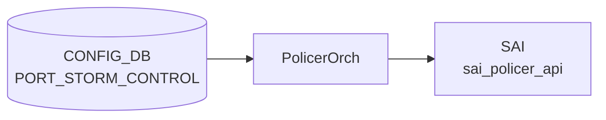

# PORT_STORM_CONTROL テーブル — 暗黙デフォルト詳細

!!! info "ページの位置付け"
    このページは `PORT_STORM_CONTROL` テーブルの **暗黙デフォルト・ハードコード挙動・YANG-実装乖離** を詳述する Phase A 分析ページ。
    テーブル概要・フィールド一覧・運用ヒントは [PORT_STORM_CONTROL テーブル](port-storm-control.md) を参照。

## 概要

BUM (Broadcast / Unknown-unicast / Unknown-multicast) storm control は `PORT_STORM_CONTROL` テーブルで設定される。
`orchagent` の `PolicerOrch::handlePortStormControlTable()` が [CONFIG_DB](../../reference/glossary.md#term-config_db) を購読し、[SAI](../../reference/glossary.md#term-sai) policer を作成・適用する。

[YANG](../../reference/glossary.md#term-yang) と実装の間には複数の乖離 (discrepancy) とハードコード挙動が存在する。以下に詳細を示す。

<!-- defaults -->
<!-- cdb-mermaid -->
### データフロー (自動生成)



!!! note "凡例"
    CONFIG_DB から SAI までの典型経路を `docs/reference/config-db-orch-map.md` から機械生成したミニ図。詳細・例外は本ページ本文と対応表を参照。
<!-- /cdb-mermaid -->

## 暗黙デフォルトとハードコード挙動

<!-- evidence: meta/_intermediate/cdb-flow/storm-control-defaults.md -->

### 1. kbps — YANG optional だが実装は mandatory

[YANG](../../reference/glossary.md#term-yang) (`sonic-storm-control.yang`) の `kbps` leaf に `default` 文および `mandatory true` 宣言はない ([YANG](../../reference/glossary.md#term-yang) 上は optional)。

しかし `orchagent/policerorch.cpp:194-200` では:

```cpp
/*CIR is mandatory parameter*/
if (!cir)
{
    SWSS_LOG_ERROR("Failed to create storm control policer %s,\
            missing mandatory fields", storm_policer_name.c_str());
    return task_process_status::task_failed;
}
```

`kbps` が欠如したエントリは `task_failed` で破棄される。**YANG-実装 discrepancy**: YANG は optional、実装は mandatory。

証跡: `sonic-swss/orchagent/policerorch.cpp:194-200`

---

### 2. SAI policer ハードコード固定属性 (YANG / CLI 非公開)

YANG および CLI には存在しないが、[orchagent](../../reference/glossary.md#term-orchagent) が **常に固定値** で [SAI](../../reference/glossary.md#term-sai) policer を作成する属性:

| [SAI](../../reference/glossary.md#term-sai) 属性 | 固定値 | 変更可否 |
|---|---|---|
| `SAI_POLICER_ATTR_METER_TYPE` | `BYTES` | 不可 (ハードコード) |
| `SAI_POLICER_ATTR_MODE` | `STORM_CONTROL` | 不可 (ハードコード) |
| `SAI_POLICER_ATTR_RED_PACKET_ACTION` | `DROP` | 不可 (ハードコード) |
| `SAI_POLICER_ATTR_GREEN_PACKET_ACTION` | 未設定 → SAI/HW デフォルト依存 | 設定不可 |
| `SAI_POLICER_ATTR_YELLOW_PACKET_ACTION` | 未設定 → SAI/HW デフォルト依存 | 設定不可 |
| `SAI_POLICER_ATTR_CBS` | 未設定 → SAI/HW デフォルト依存 | 設定不可 |
| `SAI_POLICER_ATTR_COLOR_SOURCE` | 未設定 → SAI/HW デフォルト依存 | 設定不可 |

METER_TYPE を `BYTES` 以外 (例: `PACKETS`) にしたい場合は実装変更が必要。

証跡: `policerorch.cpp:156-169`

---

### 3. kbps → SAI CIR 変換: integer truncation (silent rounding)

変換式 (`policerorch.cpp:182`):

```
CIR (bytes/s) = kbps * 1000 / 8
```

C++ 整数演算のため `kbps % 8 != 0` の場合に **切り捨て**が発生する (silent rounding)。
kbps は通常大きな値のため実用影響は限定的だが、低レートでは注意が必要。

テストコードの逆変換 (`test_storm_control.py:178`):

```python
kbps = int(int(bps) / int(1000) * 8)
```

この逆変換も切り捨てを含む。ラウンドトリップで丸め誤差が生じる可能性あり。

証跡: `policerorch.cpp:181-184`, `sonic-swss/tests/test_storm_control.py:178`

---

### 4. update 時 remove-then-reapply による瞬間的 storm control 解除

既存エントリを更新する際の [orchagent](../../reference/glossary.md#term-orchagent) フロー (`policerorch.cpp:273-288`):

1. `port_attr.value.oid = SAI_NULL_OBJECT_ID` で storm control を **一時解除**
2. CIR のみ `set_policer_attribute` で更新 (METER_TYPE / MODE / RED_ACTION は更新対象外)
3. 新 policer oid を再 attach

update 時の CIR のみ更新制約 (`policerorch.cpp:250-255`):

```cpp
if (attr.id != SAI_POLICER_ATTR_CIR)
{
    continue;
}
```

METER_TYPE, MODE, RED_ACTION は作成時のみ設定可能。更新不可 (暗黙制約)。

!!! warning "瞬間 storm control 解除"
    kbps 値を変更すると、remove-then-reapply ウィンドウ中 (ミリ秒オーダー) にポートの storm control が解除される。
    BUM トラフィックが急増するタイミングでの変更は注意が必要。

証跡: `policerorch.cpp:273-288`, `policerorch.cpp:250-270`

---

### 5. allPortsReady ガード: 起動時 silent defer

`policerorch.cpp:379-382`:

```cpp
if (!gPortsOrch->allPortsReady())
{
    return;
}
```

全ポートの初期化完了前に [CONFIG_DB](../../reference/glossary.md#term-config_db) に書き込まれたエントリは `doTask()` が即座リターンするため **処理が遅延される** (silent defer、エラーなし・syslog なし)。

証跡: `policerorch.cpp:379-382`

---

### 6. 非 Ethernet / ポート未発見: silent drop

`policerorch.cpp:131-144`:

| 条件 | 動作 |
|---|---|
| インタフェース名が `Ethernet` で始まらない | `SWSS_LOG_ERROR` → `task_success` 返却 → **erase (silent drop)** |
| `gPortsOrch->getPort()` でポート未発見 | `SWSS_LOG_ERROR` → `task_success` 返却 → **erase (silent drop)** |

`task_success` が返されるためエントリは `consumer.m_toSync` から erase される。**リトライなし**。

[LAG](../../reference/glossary.md#term-lag) (`PortChannel`) や [VLAN](../../reference/glossary.md#term-vlan) を誤って指定した場合も同様に syslog error のみで黙って破棄される。

証跡: `policerorch.cpp:131-144`

---

### 7. BUM_STORM_CAPABILITY チェック: CLI のみ・orchagent は非チェック

`config/main.py:806-814` の `is_storm_control_supported()`:

```python
supported = state_db.get(state_db.STATE_DB, entry_name, "supported")
return supported
```

CLI (`config interface storm-control add`) は `STATE_DB:BUM_STORM_CAPABILITY|<storm_type>` の `supported` フィールドを確認し、非対応プラットフォームでは書き込みをスキップする。

しかし **[orchagent](../../reference/glossary.md#term-orchagent) 側には同様のチェックが存在しない**。`sonic-db-cli` 等で直接 [CONFIG_DB](../../reference/glossary.md#term-config_db) に書き込んだ場合、capability 非対応プラットフォームでも orchagent が SAI call を試みる (SAI エラーで失敗する可能性あり)。

!!! note "プラットフォーム依存"
    BUM storm control の SAI 対応はプラットフォーム (ASIC) 依存。CLI を経由せず直接 DB 書き込みを行う場合は `BUM_STORM_CAPABILITY` を事前確認すること。

証跡: `config/main.py:806-814`

---

### 8. dead field — CBS, Green/Yellow packet action, Color Source

YANG にも CLI にも公開されていない SAI 属性:

| SAI 属性 | 挙動 |
|---|---|
| `SAI_POLICER_ATTR_CBS` | 未設定。SAI/HW デフォルト (多くの [ASIC](../../reference/glossary.md#term-asic) では 0 または HW 最小値) |
| `SAI_POLICER_ATTR_GREEN_PACKET_ACTION` | 未設定。SAI デフォルト (通常 FORWARD) |
| `SAI_POLICER_ATTR_YELLOW_PACKET_ACTION` | 未設定。SAI デフォルト (通常 FORWARD) |
| `SAI_POLICER_ATTR_COLOR_SOURCE` | 未設定。SAI デフォルト (通常 BLIND) |

プラットフォームにより挙動が異なる可能性がある。

---

### 9. policer 削除失敗後のリソースリーク (TODO コメント残存)

`policerorch.cpp:297-310`:

```cpp
/*TODO: Do the below policer cleanup in an API*/
if (SAI_STATUS_SUCCESS != sai_policer_api->remove_policer(...))
{
    SWSS_LOG_ERROR("Failed to remove policer %s, rv:%d", ...);
    /*TODO: Just doing a syslog. */
}
m_syncdPolicers.erase(storm_policer_name);
m_policerRefCounts.erase(storm_policer_name);
```

SAI `set_port_attribute` が失敗した際の cleanup パスで `remove_policer` に失敗した場合、syslog error のみで続行する。
`m_syncdPolicers` / `m_policerRefCounts` はクリアされるが SAI 側のリソースはリークの可能性あり。TODO コメントが未解決のまま残存。

証跡: `policerorch.cpp:297-310`

---

### 10. scripts/storm_control.py の validate バグ (dead validation)

`scripts/storm_control.py:68-86`:

```python
def validate_kbps(self, kbps):
    return True  # 常に True — バリデーションなし

def add_storm_config(self, port, storm_type, kbps):
    if not validate_interface(port):  # ← self なし → NameError
```

`validate_kbps()` は常に `True` を返す dead validation。
`add_storm_config()` / `del_storm_config()` では `validate_interface(port)` を `self.` なしで参照しており、実行時 `NameError` が発生する可能性がある。

正規の CLI パスは `config/main.py` 側の `storm_control_set_entry()` であり、`scripts/storm_control.py` の add/del パスは実質的に動作しない可能性がある。

証跡: `sonic-utilities/scripts/storm_control.py:68-86`

<!-- /defaults -->

<!-- ordering -->
## 書込み順序依存 (Phase B)

<!-- evidence: meta/_intermediate/cdb-flow/storm-control-ordering.md -->

`PolicerOrch::doTask()` / `handlePortStormControlTable()` (`sonic-swss/orchagent/policerorch.cpp`) の実装から導出した順序制約。

### 検出された順序依存

| # | 依存関係 | 方向 | 緩和策 |
|---|---|---|---|
| 1 | `PORT` (PortsOrch allPortsReady) → `PORT_STORM_CONTROL` | **先行必須** (全ポート初期化完了前は doTask が即 return) | 起動後は自動処理; 手動適用時は起動完了を確認 |
| 2 | `PORT_STORM_CONTROL` キー内ポート名が `Ethernet` で始まること | **先行必須** ([PortChannel](../../reference/glossary.md#term-portchannel) / [VLAN](../../reference/glossary.md#term-vlan) は silent drop) | [LAG](../../reference/glossary.md#term-lag) メンバーポートに直接設定すること |
| 3 | 対象 `PORT` エントリが CONFIG_DB に存在すること | **先行必須** (`getPort()` 失敗 → task_success erase、リトライなし) | PORT を先に設定してから STORM_CONTROL を書き込む |
| 4 | 3 種 (broadcast / unknown-unicast / unknown-multicast) は相互独立 | 順不同で設定可 | — |
| 5 | kbps 値を更新する場合: 旧 policer の NULL → CIR 更新 → reapply の順序 | orchagent 内部固定順序 | — (orchagent 自動制御) |

### 主要な制約詳細

**PORT 先行必須 (依存 #1, #3)**:
`doTask()` 冒頭 (`policerorch.cpp:379-382`):

```cpp
if (!gPortsOrch->allPortsReady())
{
    return;
}
```

`gPortsOrch->allPortsReady()` が `false` の間、`doTask` は即 return する。[SONiC](../../reference/glossary.md#term-sonic) 起動シーケンス中は PortsOrch が全ポートを学習し終わるまで PORT_STORM_CONTROL の処理は **自動的にキュー待機**される。

ポートが存在しない場合 (`policerorch.cpp:138-143`):

```cpp
if (!gPortsOrch->getPort(interface_name, port))
{
    SWSS_LOG_ERROR("Failed to apply storm-control %s to port %s. Port not found", ...);
    return task_process_status::task_success;  // サイレント erase
}
```

`task_success` が返されるため `consumer.m_toSync` からエントリが erase される。**リトライなし**。syslog ERROR は出力されるがオペレータ通知手段は限定的。

**Ethernet 以外 silent drop (依存 #2)**:
`policerorch.cpp:131-135` で ETHERNET_PREFIX チェックを行う。`PortChannel`・[VLAN](../../reference/glossary.md#term-vlan) インタフェースは `task_success` で erase される (silent drop)。[HLD](../../reference/glossary.md#term-hld) では「physical interfaces のみ対応」と明記されているが、orchagent 側には YANG/CLI バリデーションへの依存がなく、直接 DB 書き込みの場合は同様に drop される。

証跡: `sonic-swss/orchagent/policerorch.cpp:131-143, 379-382`

### orchlist 起動順序

`orchdaemon.cpp:500` の orchlist 定義:

```
gSwitchOrch → gCrmOrch → gPortsOrch → gBufferOrch → ... → gPolicerOrch → ...
```

`gPortsOrch` は `gPolicerOrch` より先に登録されており、PortsOrch が allPortsReady を設定してから PolicerOrch の処理が有効になる設計。

### 順序フロー図

```
CONFIG_DB|PORT (PortsOrch allPortsReady = true)
  ↓ (先行必須)
CONFIG_DB|PORT_STORM_CONTROL|<Ethernet ifname>|<storm_type>
  kbps 値 (mandatory)
  ↓
PolicerOrch::handlePortStormControlTable()
  ├─ create_policer (meter=BYTES, mode=STORM_CONTROL, red_action=DROP, CIR=kbps*1000/8)
  └─ set_port_attribute (SAI_PORT_ATTR_{BROADCAST|FLOOD|MULTICAST}_STORM_CONTROL_POLICER_ID)
```

<!-- /ordering -->

<!-- cross-refs -->
## 暗黙参照（テーブル間依存）

`PORT_STORM_CONTROL` テーブルを処理する `PolicerOrch::handlePortStormControlTable()` が実行時に参照する他テーブル・Orch 内状態。YANG の leafref 定義は PORT への参照のみで、それ以外は実装レベルの暗黙依存である。コード調査の詳細は `meta/_intermediate/cdb-flow/storm-control-cross-refs.md` に記録した。

### 1. PORT（キーポート名の OID 解決 — 必須依存）

- **参照先**: CONFIG_DB `PORT` / PortsOrch
- **方向**: 読み取り (`gPortsOrch->getPort(interface_name, port)`)
- **参照元**: `policerorch.cpp:138`（PORT OID 解決）、`policerorch.cpp:206-214`（`SAI_PORT_ATTR_*_STORM_CONTROL_POLICER_ID` 設定）
- **意味**: キーの `<interface_name>` を PortsOrch で解決し、SAI ポート属性に policer OID をアタッチ / デタッチする。解決失敗時は `task_success` 返却で `m_toSync` から erase（**リトライなし**）。
- **YANG leafref**: `sonic-storm-control.yang` の `ifname` leaf は `PORT_LIST/name` への leafref を持つ（実装は orchagent 側実行時確認）。

### 2. `m_syncdPolicers`（Orch 内 policer OID キャッシュ）

- **参照先**: `PolicerOrch::m_syncdPolicers`（`unordered_map<string, sai_object_id_t>`）
- **方向**: 読み取り / 書き込み（Orch 内部状態）
- **参照元**: `policerorch.cpp:151`（update 判定）、`policerorch.cpp:239`（create 後登録）、`policerorch.cpp:245`（update 時 OID 取得）、`policerorch.cpp:309, 368`（delete 時消去）
- **意味**: 作成済み policer の OID を `<ifname>|<storm_type>` キーで保持し、update / delete 時に再利用する。Orch 再起動時はリセットされるため、warm-reboot 等でのリカバリはこのキャッシュに依存しない（SAI 再プログラムで復元）。

### 3. STATE_DB `BUM_STORM_CAPABILITY`（CLI のみ参照 — orchagent は非参照）

- **参照先**: `STATE_DB:BUM_STORM_CAPABILITY|<storm_type>` の `supported` フィールド
- **方向**: CLI (`config/main.py:806-813`) が書き込み前に確認
- **参照元**: `is_storm_control_supported()` in `config/main.py:806-813`
- **意味**: CLI が storm control 設定前に [ASIC](../../reference/glossary.md#term-asic) の BUM storm control サポートを確認する。orchagent 側には同等チェックが存在せず、DB に直接書き込んだ場合は SAI 呼び出しが試みられ、非対応時は SAI エラーで記録される（silent な SAI failure）。
- **非対称性**: CLI → [STATE_DB](../../reference/glossary.md#term-state_db) 確認 → スキップ可能。orchagent → 非確認 → SAI fail-through。

### 4. ASIC_DB / SAI（policer と port 属性の書き込み先）

`handlePortStormControlTable()` が呼び出す SAI API と [ASIC_DB](../../reference/glossary.md#term-asic_db) への波及:

| SAI API | 操作 | コード箇所 |
|---------|------|----------|
| `sai_policer_api->create_policer()` | policer オブジェクト作成 | `policerorch.cpp:197-236` |
| `sai_policer_api->set_policer_attribute()` | CIR 値更新（update 時のみ） | `policerorch.cpp:250-263` |
| `sai_port_api->set_port_attribute()` | ポートへの policer OID アタッチ / NULL デタッチ | `policerorch.cpp:206-214, 283-286, 326-347` |
| `sai_policer_api->remove_policer()` | policer オブジェクト削除 | `policerorch.cpp:293-304, 349-361` |

いずれも [syncd](../../reference/glossary.md#term-syncd) 経由で [ASIC_DB](../../reference/glossary.md#term-asic_db) に反映され、物理 [ASIC](../../reference/glossary.md#term-asic) へのプログラムが行われる。

### 参照関係サマリ

```
PORT_STORM_CONTROL テーブル
  |- [必須]  PORT (ifname → port OID → SAI_PORT_ATTR_*_STORM_CONTROL_POLICER_ID)
  |- [内部]  m_syncdPolicers (Orch 内 policer OID キャッシュ)
  |- [CLI側] STATE_DB:BUM_STORM_CAPABILITY (orchagent は非参照 — SAI fail-through)
  `- [出力]  ASIC_DB (SAI create/set/remove_policer, set_port_attribute)
```

<!-- /cross-refs -->

<!-- failure -->
## 失敗挙動 (Phase D)

<!-- evidence: meta/_intermediate/cdb-flow/storm-control-failure.md -->
<!-- source: sonic-swss/orchagent/policerorch.cpp -->

### 失敗パス一覧

| # | 失敗トリガー | `task_` 戻り値 | 再試行 | SAI 影響 |
|---|------------|--------------|--------|---------|
| 1 | `kbps` フィールド欠如 | `task_failed` | なし | SAI 変更なし |
| 2 | 不明 `storm_type` (SET / DEL 共通) | `task_failed` | なし | SAI 変更なし |
| 3 | `sai_policer_api->create_policer()` SAI エラー | `task_need_retry` | あり | SAI 変更なし |
| 4 | `sai_port_api->set_port_attribute()` アタッチ失敗 | `task_need_retry` | あり | 孤立 policer リーク可能性 |
| 5 | DEL: `m_syncdPolicers` に policer 未登録 | `task_success` | なし | SAI 変更なし |
| 6 | DEL: `set_port_attribute` NULL デタッチ失敗 | `task_need_retry` | あり | SAI デタッチ失敗 |
| 7 | DEL: `sai_policer_api->remove_policer()` 失敗 | `task_need_retry` | あり | SAI 孤立 policer 残存 |

### 詳細

#### 1 & 2. kbps 欠如 / 不明 storm_type → `task_failed` (リトライなし)

`policerorch.cpp:194-200, 217-220, 337-340` が `task_failed` を返す。`doTask()` は `task_failed` を `task_success` と同様に `consumer.m_toSync.erase(it)` で処理するため (`policerorch.cpp:398-401`)、エントリは破棄されリトライしない。syslog `ERROR` のみが出力される。

有効な `storm_type` は YANG の enum が `"broadcast"` / `"unknown-unicast"` / `"unknown-multicast"` のみを許可する。ただし orchagent は YANG バリデーションを経由しないため、直接 CONFIG_DB に書き込んだ場合はこの check が実装側で行われる。

#### 3. `create_policer` SAI 失敗 → `task_need_retry`

`policerorch.cpp:226-236`: SAI が失敗した場合 `handleSaiCreateStatus()` が判定し、`task_need_retry` を返す。次回 `doTask()` 呼び出しで `m_toSync` から再処理される。`m_syncdPolicers` への登録は `create_policer` 成功後に行われるため (`policerorch.cpp:239`)、失敗時のキャッシュ汚染はない。

#### 4. `set_port_attribute` アタッチ失敗 → 孤立 policer リスク

`policerorch.cpp:291-312`: ポートへの policer アタッチが SAI で失敗した際、orchagent は作成済み policer の `remove_policer` を試みる。この `remove_policer` が**さらに失敗**した場合、syslog ERROR のみで続行する（`TODO: Just doing a syslog.` コメント残存）。

- `m_syncdPolicers` / `m_policerRefCounts` は `erase` されるが SAI 側に孤立 policer が残る可能性がある
- 最終的に `task_need_retry` を返すため次回に再試行されるが、キャッシュがクリアされているため次回は「新規 create」扱いとなり重複 policer が作成されるリスクがある

#### 5. DEL: policer 未登録 → `task_success` (冪等)

`policerorch.cpp:317-320`: `m_syncdPolicers` に該当 policer が存在しない場合、`task_success` で erase。syslog `ERROR` は出力されるがリトライしない。存在しない storm control の DEL は冪等に扱われる。

#### 6 & 7. DEL: SAI remove 失敗 → `task_need_retry`

DEL パスでは `set_port_attribute(NULL)` でデタッチ後、`remove_policer` でオブジェクトを削除する。いずれかが SAI エラーで `task_need_retry` を返した場合は次回リトライする。最終的に `handleSaiRemoveStatus` が `task_success` を返すと `m_syncdPolicers.erase()` が呼ばれるが、SAI 側で実際に削除できていない場合は孤立 policer が残存する。

!!! warning "孤立 policer リーク"
    `set_port_attribute` によるポートアタッチ / デタッチ失敗 + 後続 `remove_policer` の二重失敗が重なった場合、SAI 側に孤立した policer オブジェクトが残存する可能性がある。この状態は再起動するまで解消されない。`policerorch.cpp:297-304` の `TODO` コメントが未解決のまま残っている。

<!-- /failure -->

<!-- constants -->
## ハードコード定数 (Phase E)

> 調査証跡: `meta/_intermediate/cdb-flow/storm-control-constants.md`

### フィールド名文字列定数 (`policerorch.cpp:29-32`)

storm control エントリ処理で使用されるフィールド名・storm_type 文字列定数:

| 変数名 | 値 | 用途 |
|--------|-----|------|
| `storm_control_kbps` | `"KBPS"` | CONFIG_DB フィールド名。`to_upper(fvField)` との比較で kbps を識別 |
| `storm_broadcast` | `"broadcast"` | key の storm_type → `SAI_PORT_ATTR_BROADCAST_STORM_CONTROL_POLICER_ID` に対応 |
| `storm_unknown_unicast` | `"unknown-unicast"` | key の storm_type → `SAI_PORT_ATTR_FLOOD_STORM_CONTROL_POLICER_ID` に対応 |
| `storm_unknown_mcast` | `"unknown-multicast"` | key の storm_type → `SAI_PORT_ATTR_MULTICAST_STORM_CONTROL_POLICER_ID` に対応 |

`"KBPS"` 以外のフィールドは `SWSS_LOG_ERROR("Unknown storm control attribute %s specified", ...)` を出力して `continue`（無視）される (`policerorch.cpp:188-191`)。`storm_type` が上記 3 値以外の場合は `task_failed` となる (`policerorch.cpp:217-219`)。

### Ethernet プレフィックス定数 (`policerorch.cpp:16`)

```cpp
#define ETHERNET_PREFIX "Ethernet"
```

`strncmp(interface_name.c_str(), ETHERNET_PREFIX, strlen(ETHERNET_PREFIX))` で非 Ethernet インターフェースを検出し、`SWSS_LOG_ERROR` 後 `task_success` で即時スキップする (`policerorch.cpp:132-136`)。[LAG](../../reference/glossary.md#term-lag) / VLAN / [PortChannel](../../reference/glossary.md#term-portchannel) 等には storm control を適用できない。

### policer 名生成パターン (`policerorch.cpp:146`)

```cpp
const auto storm_policer_name = "_" + interface_name + "_" + storm_type;
// 例: "_Ethernet0_broadcast"
```

先頭の `"_"` は POLICER テーブルのユーザ定義 policer 名との衝突を避ける命名規則。`m_syncdPolicers` マップのキーとして使用される。

### kbps → CIR 変換定数 (`policerorch.cpp:182`)

```cpp
attr.value.u64 = (stoul(value) * 1000 / 8);
```

| 変換係数 | 値 | 意味 |
|----------|-----|------|
| `1000` | Kilo 倍率 | kbps → bps 変換 |
| `8` | bits per byte | bps → bytes/s 変換 |

整数演算のため `kbps % 8 != 0` の場合に **切り捨て**が発生する（Phase A に記載）。

### ハードコード SAI 属性値 (`policerorch.cpp:157-168`)

| SAI 属性 ID | ハードコード値 | 変更可否 |
|-------------|--------------|---------|
| `SAI_POLICER_ATTR_METER_TYPE` | `SAI_METER_TYPE_BYTES` (`"BYTES"`) | 不可 |
| `SAI_POLICER_ATTR_MODE` | `SAI_POLICER_MODE_STORM_CONTROL` (`"STORM_CONTROL"`) | 不可 |
| `SAI_POLICER_ATTR_RED_PACKET_ACTION` | `SAI_PACKET_ACTION_DROP` (`"DROP"`) | 不可 |

これらは CONFIG_DB / YANG / CLI から一切変更できない。詳細は Phase A の §2 を参照。

### テーブル名定数

| マクロ / 変数 | 値 | 定義元 |
|--------------|-----|--------|
| `CFG_PORT_STORM_CONTROL_TABLE_NAME` | `"PORT_STORM_CONTROL"` | `sonic-swss-common` (schema) |
| `STORM_TABLE_NAME` (CLI 側) | `"PORT_STORM_CONTROL"` | `sonic-utilities/scripts/storm_control.py:30` |
| `SELECT_TIMEOUT` | `1000` (ms) | `orchdaemon.cpp:23` — PolicerOrch を含む全 Orch の select ループタイムアウト |

### key 区切り文字

`policerorch.cpp:126` で `tokenize(storm_key, config_db_key_delimiter)` を使用。`config_db_key_delimiter` は `orch.h` で `'|'` と定義されており、`PORT_STORM_CONTROL|<interface>|<storm_type>` を `tokens[0]=<interface>` / `tokens[1]=<storm_type>` に分割する。

<!-- /constants -->

<!-- side-effects -->
## 副次 DB 書込 (Phase F)

> 調査証跡: `meta/_intermediate/cdb-flow/storm-control-side-effects.md`
> ソース: `sonic-swss/orchagent/policerorch.cpp`

`PolicerOrch::handlePortStormControlTable()` は CONFIG_DB `PORT_STORM_CONTROL` の SET / DEL を処理するが、**[STATE_DB](../../reference/glossary.md#term-state_db)・[APPL_DB](../../reference/glossary.md#term-appl_db)・[COUNTERS_DB](../../reference/glossary.md#term-counters_db) への明示的な書込みは一切存在しない**。副次変化は [ASIC_DB](../../reference/glossary.md#term-asic_db)（SAI API 経由）と PolicerOrch 内部状態の 2 系統のみ。

### ASIC_DB（SAI API 経由）

| フロー | SAI API | 影響リソース | evidence |
|--------|---------|-------------|----------|
| SET（新規） | `sai_policer_api->create_policer()` | ASIC policer オブジェクト生成 | `policerorch.cpp:227-238` |
| SET（新規） | `sai_port_api->set_port_attribute(policer_id)` | `SAI_PORT_ATTR_{BROADCAST\|FLOOD\|MULTICAST}_STORM_CONTROL_POLICER_ID` | `policerorch.cpp:278-286` |
| SET（更新）| `sai_port_api->set_port_attribute(SAI_NULL_OBJECT_ID)` | 既存 policer を一時デタッチ（storm control 一時解除） | `policerorch.cpp:278-286` |
| SET（更新）| `sai_policer_api->set_policer_attribute(SAI_POLICER_ATTR_CIR)` | CIR 値更新のみ（METER_TYPE / MODE / RED_ACTION は更新不可） | `policerorch.cpp:257-263` |
| SET（更新）| `sai_port_api->set_port_attribute(policer_id)` | 更新後 policer を再アタッチ | `policerorch.cpp:278-286` |
| DEL | `sai_port_api->set_port_attribute(SAI_NULL_OBJECT_ID)` | ポートから policer をデタッチ | `policerorch.cpp:344-347` |
| DEL | `sai_policer_api->remove_policer()` | SAI policer オブジェクト削除 | `policerorch.cpp:349-361` |

### PolicerOrch 内部 map（プロセス内状態）

[STATE_DB](../../reference/glossary.md#term-state_db) ではなく PolicerOrch プロセス内の map が更新される。他の Orch や外部ツールから直接観測不可。

| map | 操作 | タイミング |
|-----|------|-----------|
| `m_syncdPolicers[_<interface>_<storm_type>]` | SET: policer OID 登録 | `create_policer()` 成功後（L239） |
| `m_policerRefCounts[_<interface>_<storm_type>]` | SET: 0 で初期化 | 同上（L240） |
| `m_syncdPolicers[...]` | erase | `remove_policer()` 成功後（L368） |
| `m_policerRefCounts[...]` | erase | 同上（L369） |

storm control 専用 policer の参照カウントは常に `0` で固定される（`POLICER` テーブル経由の共用 policer と異なり、`decrementRefCount` / `incrementRefCount` は storm control パスでは呼ばれない）。

!!! note "STATE_DB 書込なし"
    storm control の適用結果は `show interface storm-control` で確認できるが、これは SAI ポート属性の読み戻しであり STATE_DB には書き込まれない。STATE_DB `BUM_STORM_CAPABILITY` は CLI 側読み取り専用であり、orchagent は書き込まない。

<!-- /side-effects -->

<!-- pubsub -->
## 通信メカニズム (Phase G)

> 調査証跡: `meta/_intermediate/cdb-flow/storm-control-pubsub.md`
> ソース: `sonic-swss/orchagent/orchdaemon.cpp:395-402`, `policerorch.cpp:374-404`

### Redis 購読方式

`PORT_STORM_CONTROL` テーブルへの変更通知は `PolicerOrch` が **`swsscommon::SubscriberStateTable`** (`TableConnector` 経由) で受け取る。`hostcfgd` 等の管理系デーモンは `ConfigDBConnector.subscribe()` を使うが、orchagent 側は `Orch` 基底クラスの select ループで駆動される `SubscriberStateTable` を使用する点が異なる。

| 購読者 | 購読 DB | 購読テーブル | 購読 API |
|--------|---------|------------|---------|
| `PolicerOrch` (`gPolicerOrch`) | CONFIG_DB | `PORT_STORM_CONTROL` | `SubscriberStateTable` (`TableConnector` 経由) |
| `PolicerOrch` (`gPolicerOrch`) | CONFIG_DB | `POLICER` | 同上 |

`gPolicerOrch` 以外に `PORT_STORM_CONTROL` を直接購読するプロセスは存在しない。CLI (`sonic-utilities`) は CONFIG_DB を直接 HGET して表示するのみ。

### 通知フロー

```
CLI: config interface storm-control add Ethernet0 broadcast kbps 1000
  ↓ HSET "PORT_STORM_CONTROL|Ethernet0|broadcast" kbps "1000"
Redis keyspace PUBLISH "__keyspace@4__:PORT_STORM_CONTROL|Ethernet0|broadcast" "hset"
  ↓ SubscriberStateTable が通知受信 → HGETALL で値を再取得
Orch::execute() → consumer.m_toSync にエントリを積む
  ↓
PolicerOrch::doTask(consumer)  — allPortsReady() が true の場合のみ処理
  ↓
handlePortStormControlTable(tuple)
  ↓ SET: create_policer + set_port_attribute (policer アタッチ)
  ↓ DEL: set_port_attribute(SAI_NULL_OBJECT_ID) + remove_policer
SAI API → syncd → ASIC_DB
```

### 起動時スナップショット

`Orch` 基底クラスは SELECT ループ開始前に `getContent()` で既存エントリをスナップショット取得して `m_toSync` に積む。`allPortsReady()` が false の間は `doTask()` が即 return するため、スナップショット分は全ポート ready 後に一括処理される（silent defer）。

> **Evidence**: `orchdaemon.cpp:395-402` (PolicerOrch 生成・TableConnector 登録)、`policerorch.cpp:374-382` (doTask + allPortsReady ガード)
<!-- /pubsub -->

<!-- platform -->
## プラットフォーム差 (Phase H)

> 調査証跡: `meta/_intermediate/cdb-flow/storm-control-platform.md`
> ソース: `sonic-utilities/config/main.py:806-814`, `sonic-swss/orchagent/orchdaemon.cpp:401`, `sonic-swss/orchagent/policerorch.cpp:156-240`

### ASIC 種別依存

`PolicerOrch::handlePortStormControlTable()` の実装にはプラットフォーム識別文字列による条件分岐が存在しない。SAI policer の以下の固定属性は **ASIC ベンダーの SAI 実装に委ねられる**:

| SAI 属性 | 固定値 (orchagent) | ASIC 依存性 |
|---|---|---|
| `SAI_POLICER_ATTR_METER_TYPE` | `BYTES` | ASIC によっては `PACKETS` 不可 — orchagent はそもそも設定しない |
| `SAI_POLICER_ATTR_MODE` | `STORM_CONTROL` | 一部 ASIC は storm control モードを SAI でサポートしない (SAI create_policer エラー) |
| `SAI_POLICER_ATTR_RED_PACKET_ACTION` | `DROP` | ASIC 依存。DROP 以外の action を要求する ASIC では SAI エラーとなる可能性あり |
| `SAI_POLICER_ATTR_CBS` / Green / Yellow packet action / Color source | 未設定 → SAI/HW デフォルト | **プラットフォームにより挙動が異なる**。一部 ASIC では BYTES + STORM_CONTROL の組み合わせ自体を未サポートの場合がある |

storm control の SAI 対応有無は ASIC ベンダーに依存する。SAI create_policer が失敗した場合、orchagent は `task_need_retry` で再試行し続けるか `SWSS_LOG_ERROR` を出力するが、機能が利用可能かどうかの事前チェックは行わない。

### BUM_STORM_CAPABILITY — プラットフォーム対応能力の非対称な参照

`STATE_DB:BUM_STORM_CAPABILITY|<storm_type>` の `supported` フィールドはプラットフォーム固有デーモン（ベンダー提供）が書き込む。orchdaemon.cpp L401 では `TableConnector stateDbStorm(m_stateDb, "BUM_STORM_CAPABILITY")` を生成しているが、このコネクタは `PolicerOrch` コンストラクタに渡されず **実質的に未使用** (dead code)。

```cpp
// orchdaemon.cpp:401 — stateDbStorm は生成されるが PolicerOrch に渡されない
TableConnector stateDbStorm(m_stateDb, "BUM_STORM_CAPABILITY");
gPolicerOrch = new PolicerOrch(policer_tables, gPortsOrch);  // stateDbStorm を使わない
```

| 参照者 | 挙動 |
|--------|------|
| CLI (`config/main.py:is_storm_control_supported()`) | `STATE_DB:BUM_STORM_CAPABILITY|<storm_type>` の `supported` を確認し、0 なら設定をスキップ |
| `PolicerOrch` (orchagent) | `BUM_STORM_CAPABILITY` を参照しない。SAI `create_policer` の成否のみで動作 |

`BUM_STORM_CAPABILITY` が STATE_DB に存在しないプラットフォームでは `is_storm_control_supported()` が `None` を返し、CLI は `"Storm-control is not supported on this namespace"` を表示して設定を中断する。一方 `sonic-db-cli` 等で直接 CONFIG_DB に書き込んだ場合、orchagent は capability チェックなしで SAI を呼び出す。

### multi-asic

storm control の CONFIG_DB 参照は `namespace` 単位で独立している。`is_storm_control_supported()` (`config/main.py:807`) は `multi_asic.get_asic_index_from_namespace(namespace)` で対象 asic を特定し、各 asic の `STATE_DB` にある `BUM_STORM_CAPABILITY` を確認する。multi-asic 環境では asic ごとに capability が異なる場合があり、`PORT_STORM_CONTROL` も各 asic の CONFIG_DB に独立して書き込まれる。

| 観点 | 結果 |
|------|------|
| ASIC 種別 (Broadcom / Mellanox / Marvell 等) | SAI の storm control / policer 実装に依存。orchagent に ASIC 固有分岐なし |
| BUM_STORM_CAPABILITY | プラットフォームデーモン書き込み。CLI のみ参照、orchagent は非参照 |
| multi-asic | 各 namespace/asic で独立。`namespace` パラメータで asic を特定 |

<!-- /platform -->

## 発見された discrepancy / 暗黙デフォルト サマリー

| # | 種別 | 対象 | 内容 |
|---|---|---|---|
| 1 | YANG-実装 discrepancy | `kbps` | YANG optional、実装 mandatory |
| 2 | ハードコード | SAI_POLICER_ATTR_METER_TYPE | 常に BYTES、変更不可 |
| 3 | ハードコード | SAI_POLICER_ATTR_MODE | 常に STORM_CONTROL、変更不可 |
| 4 | ハードコード | SAI_POLICER_ATTR_RED_PACKET_ACTION | 常に DROP、変更不可 |
| 5 | dead field (HW 依存) | CBS, Green/Yellow action, Color Source | YANG/CLI 非公開、HW デフォルト依存 |
| 6 | silent rounding | kbps → CIR 変換 | `kbps * 1000 / 8` の整数切り捨て |
| 7 | 書込み順依存 | update 時 remove-reapply | SAI NULL → CIR 更新 → reapply の間 storm control 解除 |
| 8 | silent drop | 非 Ethernet / ポート未発見 | `task_success` で erase、リトライなし |
| 9 | silent defer | 起動時 allPortsReady ガード | 全ポート初期化前は処理遅延 (エラーなし) |
| 10 | プラットフォーム依存 | capability チェック非対称 | CLI のみチェック、orchagent は非チェック |
| 11 | dead validation | scripts/storm_control.py | validate_kbps 常に True, add/del で NameError 可能性 |
| 12 | リソースリーク TODO | policer remove 失敗後 | SAI リソースリーク可能性、TODO 未解決 |

## 引用元

- [`orchagent/policerorch.cpp`](https://github.com/sonic-net/sonic-swss/blob/master/orchagent/policerorch.cpp) — `PolicerOrch::handlePortStormControlTable()` / `doTask()`。kbps mandatory チェック・SAI policer ハードコード属性・kbps→CIR 変換・remove-then-reapply・allPortsReady ガード・silent drop・リソースリーク TODO の全証跡 (本文 §1–§9 / Phase B–H)
- [`orchagent/orchdaemon.cpp`](https://github.com/sonic-net/sonic-swss/blob/master/orchagent/orchdaemon.cpp) — orchlist 起動順序 (`gPortsOrch` → `gPolicerOrch`)、`BUM_STORM_CAPABILITY` TableConnector の dead code 化 (Phase B / H)
- [`config/main.py`](https://github.com/sonic-net/sonic-utilities/blob/master/config/main.py) — `is_storm_control_supported()`。CLI 側の `STATE_DB:BUM_STORM_CAPABILITY` capability チェック (本文 §7 / Phase H)
- [`scripts/storm_control.py`](https://github.com/sonic-net/sonic-utilities/blob/master/scripts/storm_control.py) — `validate_kbps()` dead validation・`validate_interface()` NameError (本文 §10)
- [`tests/test_storm_control.py`](https://github.com/sonic-net/sonic-swss/blob/master/tests/test_storm_control.py) — kbps↔CIR 逆変換の丸め検証 (本文 §3)
- [`yang-models/sonic-storm-control.yang`](https://github.com/sonic-net/sonic-buildimage/blob/9ea932ec2e18f35e58268ec2e4456b1d4afd65cd/src/sonic-yang-models/yang-models/sonic-storm-control.yang) — `kbps` leaf が optional (実装は mandatory)・`storm_type` enum・`ifname` leafref (本文 §1)

## 関連ページ

- [PORT_STORM_CONTROL テーブル (概要)](port-storm-control.md)
- [CONFIG_DB: PORT](port.md)
- [CONFIG_DB: POLICER](policer.md)

<!-- glossary-links-injected: 07d24e4e47ef -->
