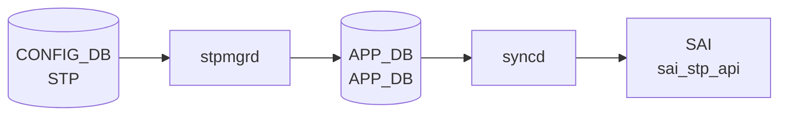

# STP_PORT テーブル — 暗黙デフォルト詳細

!!! info "ページの位置付け"
    このページは `STP_PORT` テーブルの **コード由来デフォルト値・ハードコード挙動・PVST/MST モード別差異** を詳述する Phase A 分析ページ。
    `STP`・`STP_VLAN`・`STP_VLAN_PORT` テーブルを含む全体像は [STP / STP_VLAN / STP_PORT テーブル](stp.md) を参照。

## 概要

`STP_PORT` テーブルはインタフェースごとの STP 設定を保持する。キーは `<intf_name>` (例: `Ethernet0`, `PortChannel1`)。
`stpmgrd` (`sonic-swss/cfgmgr/stpmgrd.cpp`) が [CONFIG_DB](../../reference/glossary.md#term-config_db) の変更を購読し、`processStpPortAttr()` でフィールドを解析して Unix Domain Socket 経由で STP デーモンに IPC メッセージを送信する。

PVST (Per-[VLAN](../../reference/glossary.md#term-vlan) STP) と MST (Multiple STP) でフィールドセットが異なる。

<!-- defaults -->
<!-- cdb-mermaid -->
### データフロー (自動生成)



!!! note "凡例"
    CONFIG_DB から SAI までの典型経路を `docs/reference/config-db-orch-map.md` から機械生成したミニ図。詳細・例外は本ページ本文と対応表を参照。
<!-- /cdb-mermaid -->

## 暗黙デフォルトとハードコード挙動

### 1. PVST 有効化時の STP_PORT 初期書き込み

`interface_enable_stp()` (`config/stp.py:292-301`) および `enable_stp_for_interfaces()` (`config/stp.py:361-379`) で、[VLAN](../../reference/glossary.md#term-vlan) メンバのインタフェースに対して以下が一括書き込まれる:

```python
fvs = {
    'enabled': 'true',
    'root_guard': 'false',
    'bpdu_guard': 'false',
    'bpdu_guard_do_disable': 'false',
    'portfast': 'false',
    'uplink_fast': 'false'
}
```

| フィールド | デフォルト値 | 有効範囲 | 備考 |
|---|---|---|---|
| `enabled` | `"true"` | `true` / `false` | STP 有効化フラグ |
| `root_guard` | `"false"` | `true` / `false` | Root Guard |
| `bpdu_guard` | `"false"` | `true` / `false` | BPDU Guard |
| `bpdu_guard_do_disable` | `"false"` | `true` / `false` | BPDU Guard 発動時にポート shutdown するか |
| `portfast` | `"false"` | `true` / `false` | PortFast (MST では設定不可) |
| `uplink_fast` | `"false"` | `true` / `false` | UplinkFast (MST では設定不可) |
| `path_cost` | **未設定** | 1–200,000,000 | PVST 初期化時には書き込まれない |
| `priority` | **未設定** | 0–240 | PVST 初期化時には書き込まれない |

`path_cost` および `priority` は PVST 初期化時に `STP_PORT` へ書き込まれない。後から `config spanning-tree interface cost` / `config spanning-tree interface priority` で設定するまでフィールド自体が存在しない。

証跡: `config/stp.py:292-301, 361-379, 1580-1584`

---

### 2. MST 有効化時の STP_PORT 初期書き込み

`enable_mst_for_interfaces()` (`config/stp.py:441-470`) で書き込まれる:

```python
fvs_port = {
    'edge_port': 'false',
    'link_type': 'auto',           # MST_AUTO_LINK_TYPE
    'enabled': 'true',
    'bpdu_guard': 'false',
    'bpdu_guard_do': 'false',      # PVST の bpdu_guard_do_disable とは別フィールド名
    'root_guard': 'false',
    'path_cost': 1,                # MST_DEFAULT_PORT_PATH_COST
    'priority': 128                # MST_DEFAULT_PORT_PRIORITY
}
```

定数定義 (`config/stp.py:90-110`):

```python
MST_DEFAULT_PORT_PRIORITY = 128     # range: 0-240
MST_DEFAULT_PORT_PATH_COST = 1      # range: 1-200000000
MST_AUTO_LINK_TYPE = 'auto'         # 他に 'p2p', 'shared'
```

| フィールド | デフォルト値 | 有効範囲 | 備考 |
|---|---|---|---|
| `enabled` | `"true"` | `true` / `false` | |
| `root_guard` | `"false"` | `true` / `false` | |
| `bpdu_guard` | `"false"` | `true` / `false` | |
| `bpdu_guard_do` | `"false"` | `true` / `false` | PVST の `bpdu_guard_do_disable` とは別フィールド |
| `edge_port` | `"false"` | `true` / `false` | MST のみ; PVST では設定不可 |
| `link_type` | `"auto"` | `auto` / `p2p` / `shared` | MST のみ |
| `path_cost` | `1` | 1–200,000,000 | MST 有効化時に初期値として書き込まれる |
| `priority` | `128` | 0–240 | MST 有効化時に初期値として書き込まれる |

証跡: `config/stp.py:90-112, 441-470`

---

### 3. PVST / MST フィールド対比

| フィールド | PVST | MST | 備考 |
|---|---|---|---|
| `enabled` | `"true"` | `"true"` | 両モード共通 |
| `root_guard` | `"false"` | `"false"` | 両モード共通 |
| `bpdu_guard` | `"false"` | `"false"` | 両モード共通 |
| `bpdu_guard_do_disable` | `"false"` | — | PVST のみ |
| `bpdu_guard_do` | — | `"false"` | MST のみ (フィールド名が異なる) |
| `portfast` | `"false"` | — | PVST のみ |
| `uplink_fast` | `"false"` | — | PVST のみ |
| `edge_port` | — | `"false"` | MST のみ |
| `link_type` | — | `"auto"` | MST のみ |
| `path_cost` | **未設定** | `1` | PVST は明示設定が必要 |
| `priority` | **未設定** | `128` | PVST は明示設定が必要 |

---

### 4. stpmgrd でのフィールド処理 — `processStpPortAttr()`

`stpmgr.cpp:519-624` が [CONFIG_DB](../../reference/glossary.md#term-config_db) の `STP_PORT` エントリ変更を受信して IPC メッセージ `STP_PORT_CONFIG` を組み立てる:

| フィールド | 処理条件 | 変換方式 |
|---|---|---|
| `enabled` | 常時 | `"true"` → `1`, `"false"` → `0` |
| `root_guard` | 常時 | bool → uint8_t |
| `bpdu_guard` | 常時 | bool → uint8_t |
| `bpdu_guard_do_disable` | 常時 | bool → uint8_t |
| `path_cost` | 常時 | `stoi(value)` |
| `priority` | 常時 | `stoi(value)` (default sentinel: `-1`) |
| `portfast` | `L2_PVSTP` 時のみ | bool → uint8_t |
| `uplink_fast` | `L2_PVSTP` 時のみ | bool → uint8_t |
| `edge_port` | `L2_MSTP` 時のみ | bool → uint8_t |
| `link_type` | `L2_MSTP` 時のみ | (後述 discrepancy 参照) |

証跡: `stpmgr.cpp:519-624`

---

### 5. discrepancy: `bpdu_guard_do_disable` vs `bpdu_guard_do`

PVST と MST でフィールド名が異なる:

| モード | フィールド名 |
|---|---|
| PVST | `bpdu_guard_do_disable` |
| MST | `bpdu_guard_do` |

`stpmgr.cpp:processStpPortAttr()` が解析するのは `bpdu_guard_do_disable` のみ (`stpmgr.cpp:587-590`)。
MST 時に書き込まれる `bpdu_guard_do` は stpmgrd の IPC 変換から漏れる可能性がある。

証跡: `config/stp.py:294-298, 441-451`, `stpmgr.cpp:586-590`

---

### 6. discrepancy: `link_type` の処理バグ疑い

`stpmgr.cpp:611-613`:

```cpp
else if (field == "link_type" && l2ProtoEnabled == L2_MSTP)
    msg->link_type = static_cast<LinkType>(stoi(field.c_str()));
    //                                           ^^^^^ field でなく value を渡すべき
```

`stoi(field.c_str())` は文字列 `"link_type"` を整数変換しようとして `std::invalid_argument` 例外が発生する疑いがある。
正しくは `stoi(value.c_str())` が想定実装だが、`value` が `"auto"` / `"p2p"` / `"shared"` の文字列であるため、そのままでも `stoi` 例外が発生する可能性がある。

証跡: `stpmgr.cpp:611-613`

<!-- /defaults -->

<!-- ordering -->
## 処理順序・依存関係

`stpmgrd` (`sonic-swss/cfgmgr/stpmgr.cpp`) は `STP_PORT` テーブルの処理に対してガード条件を実装しており、前提テーブルが受信済みでなければ SET を **silent defer** または **silent skip** する。

### 1. stpGlobalTask ガード — STP_PORT 処理の前提

`doStpPortTask()` (`stpmgr.cpp:630-634`):

```cpp
if (stpGlobalTask == false)
    return;
```

`stpGlobalTask` フラグは `STP|GLOBAL` の最初の SET 受信時に `true` になる。
`STP_PORT` のイベントは `STP|GLOBAL` が受信済みでなければ即 `return`（silent defer）。
`stpPortTask` フラグはこの関数内で `true` にセットされる (`stpmgr.cpp:637-638`)。

!!! warning "STP|GLOBAL より先に STP_PORT を書き込まないこと"
    `stpGlobalTask` が立っていない状態で `STP_PORT` SET が到達しても、
    `doStpPortTask()` は即 `return` する（エラーログなし）。
    `STP|GLOBAL` 受信後の次 SELECT ループで自動的に再処理される。

証跡: `stpmgr.cpp:630-638`

---

### 2. l2ProtoEnabled ガード — STP モード確定が先行必須

`doStpPortTask()` 内:

```cpp
if (l2ProtoEnabled == L2_NONE)
{
    it++;   // SET を defer (DEL は即消費・ドロップ)
    continue;
}
```

`l2ProtoEnabled` は `STP|GLOBAL` の `mode` フィールド (`pvst` / `mst`) を受け取った時点で `L2_PVSTP` / `L2_MSTP` に確定する。
`L2_NONE` のまま `STP_PORT` SET が届いた場合はイテレータを進めて次ループへ持ち越す（silent skip）。
DEL イベントは `L2_NONE` であっても即座に消費される（適用なし）。

証跡: `stpmgr.cpp:119, 127, doStpPortTask()`

---

### 3. stpPortTask フラグが後段テーブルに与える影響

`stpPortTask` が `true` になると、`STP_VLAN` および `STP_VLAN_PORT` の処理が解禁される:

- `doStpVlanTask()` (`stpmgr.cpp:183`): `stpPortTask == false && !isStpPortEmpty()` の場合 defer
- `doStpVlanPortTask()` (`stpmgr.cpp:448`): `stpPortTask == false` の場合 defer
- `doStpMstInstPortTask()` (`stpmgr.cpp:1160`): `stpPortTask == false` の場合 defer

つまり `STP_PORT` は他テーブルのゲートキーパーとして機能する。

証跡: `stpmgr.cpp:183-188, 448-450, 1160-1162`

---

### 推奨書き込み順序

#### PVST

```
1. STP|GLOBAL       → stpGlobalTask + l2ProtoEnabled 確定
2. STP_PORT         → stpPortTask フラグ
3. STP_VLAN         → stpVlanTask フラグ
4. STP_VLAN_PORT    → 全フラグ揃い後
```

#### MST

```
1. STP|GLOBAL       → stpGlobalTask + l2ProtoEnabled 確定
2. STP_PORT         → stpPortTask フラグ
3. STP_MST          → stpMstGlobalTask フラグ
4. STP_MST_INST     → stpMstInstTask フラグ
5. STP_MST_PORT     → stpPortTask + stpMstInstTask の両方が必要
```

---

### 順序依存サマリ

| # | 依存関係 | 方向 | 緩和策 |
|---|----------|------|--------|
| 1 | `STP\|GLOBAL` → `STP_PORT` 受信 | 先行必須（欠如時 silent defer） | `STP\|GLOBAL` 受信後の SELECT ループで自動処理 |
| 2 | `STP\|GLOBAL.mode` 受信 → `l2ProtoEnabled` 確定 → `STP_PORT` SET | 先行必須（欠如時 silent skip） | `mode` フィールド受信後に自動復旧 |
| 3 | `STP_PORT` 受信 → `STP_VLAN` / `STP_VLAN_PORT` / `STP_MST_PORT` 受信 | `stpPortTask` が後段ゲート | PVST: GLOBAL→PORT→[VLAN](../../reference/glossary.md#term-vlan)→VLAN_PORT 順を維持 |

<!-- /ordering -->

<!-- cross-refs -->
## 暗黙参照（テーブル間依存）

`doStpPortTask()` / `processStpPortAttr()` (`stpmgr.cpp`) が `STP_PORT` SET を処理する際に暗黙的に参照するテーブル・Orch 内状態。

### 1. STP|GLOBAL — stpGlobalTask フラグ + l2ProtoEnabled（必須依存）

- **参照先**: [CONFIG_DB](../../reference/glossary.md#term-config_db) `STP|GLOBAL` / stpmgrd 内部フラグ `stpGlobalTask`・`l2ProtoEnabled`
- **方向**: 読み取り（内部フラグ経由）
- **参照元**: `stpmgr.cpp:630-634`
- **意味**: `doStpPortTask()` の先頭で `stpGlobalTask == false` なら即 `return`。`STP|GLOBAL.mode` が未受信のうちは `l2ProtoEnabled == L2_NONE` のため SET がすべて defer される。

### 2. m_lagMap — PortChannel メンバー存在確認（暗黙 silent drop）

- **参照先**: stpmgrd 内部 `m_lagMap`（`doLagMemUpdateTask()` が `PORTCHANNEL_MEMBER` 変更を受信するたびに更新）
- **方向**: 読み取り（内部 map）
- **参照元**: `stpmgr.cpp:648-653`, `isLagEmpty()` (`stpmgr.cpp:1306-1325`)
- **意味**: キーが `PortChannel` を含む場合に `m_lagMap` にエントリがなければ（[LAG](../../reference/glossary.md#term-lag) にメンバーがいない）SET を **即消去**（silent drop、エラーなし）。[PortChannel](../../reference/glossary.md#term-portchannel) にメンバーが追加された際に `doLagMemUpdateTask()` が STP_PORT 設定を再プッシュする仕組み。

### 3. STATE_DB:STATE_VLAN_MEMBER_TABLE — ポート所属 VLAN 列挙

- **参照先**: `STATE_VLAN_MEMBER_TABLE`（`vlanmgrd` が VLAN メンバー状態を書き込む）
- **方向**: 読み取り（`m_stateVlanMemberTable` 接続）
- **参照元**: `getAllPortVlan()` (`stpmgr.cpp:978-1025`) ← `processStpPortAttr()` (`stpmgr.cpp:527`) から呼ばれる
- **意味**: SET 処理時にインタフェースが所属する VLAN 一覧を取得し `STP_PORT_CONFIG` IPC メッセージの `vlan_list` に付加する。STATE_VLAN_MEMBER_TABLE にエントリがなければ VLAN リストが空のメッセージが stpd に送信される。

### 4. CONFIG_DB:VLAN_MEMBER — tagging_mode 取得

- **参照先**: CONFIG_DB `VLAN_MEMBER` テーブルの `tagging_mode` フィールド
- **方向**: 読み取り（`m_cfgVlanMemberTable` 接続）
- **参照元**: `getVlanMemMode()` (`stpmgr.cpp:1361-1379`) ← `getAllPortVlan()` から呼ばれる
- **意味**: `TAGGED_MODE` / `UNTAGGED_MODE` を判定し IPC メッセージの `vlan.mode` に設定。`tagging_mode` が存在しない場合 `SWSS_LOG_ERROR` 後に `INVALID_MODE` (-1) を返し、該当 VLAN はリストから除外。

### 5. m_vlanInstMap — STP インスタンス割当状態（内部配列）

- **参照先**: stpmgrd 内部配列 `m_vlanInstMap[MAX_VLANS]`（`doStpVlanTask()` が stpd の `allocL2Instance()` 呼び出し後に更新）
- **方向**: 読み取り（内部配列）
- **参照元**: `getAllPortVlan()` (`stpmgr.cpp:1002-1010`)
- **意味**: `m_vlanInstMap[vlan_id] == INVALID_INSTANCE` の VLAN は VLAN リストに含まれない。STP_VLAN 処理が完了していない VLAN は自動的に除外される。

### 参照関係サマリ

```
STP_PORT テーブル処理
  |- [必須フラグ]  STP|GLOBAL → stpGlobalTask + l2ProtoEnabled (欠如時 silent defer)
  |- [暗黙 drop]   m_lagMap (PortChannel メンバー未存在時 silent drop → 再プッシュ待ち)
  |- [VLAN 列挙]   STATE_DB:STATE_VLAN_MEMBER_TABLE (ポート所属 VLAN 一覧)
  |- [タグ確認]    CONFIG_DB:VLAN_MEMBER.tagging_mode (TAGGED / UNTAGGED 判定)
  |- [インスタンス] m_vlanInstMap[] (STP_VLAN 処理後に有効化される内部状態)
  `- [出力]        stpd IPC socket (STP_PORT_CONFIG メッセージ)
```

<!-- /cross-refs -->

<!-- failure -->
## 失敗挙動マトリクス

ソース: `sonic-net/sonic-swss/cfgmgr/stpmgr.cpp`

### SET 処理における失敗経路

| 失敗条件 | 検出箇所 | 結果 | ログ出力 | evidence |
|---|---|---|---|---|
| `calloc` 失敗（`STP_PORT_CONFIG_MSG` 確保不能） | `processStpPortAttr()` `stpmgr.cpp:537` | 即 `return`（IPC メッセージ未送信）・consumer エントリは呼び出し側で消去 | `SWSS_LOG_ERROR("calloc failed for interface ...")` | `stpmgr.cpp:537-540` |
| `path_cost` / `priority` フィールドが数値でない文字列 | `processStpPortAttr()` `stpmgr.cpp:590-597`（`stoi()` 使用） | `std::invalid_argument` / `std::out_of_range` 例外が未捕捉 → **stpmgrd プロセスクラッシュ** | なし（例外伝播） | `stpmgr.cpp:590-597` |
| `link_type` フィールドが設定された MST 環境 | `processStpPortAttr()` `stpmgr.cpp:611-613`（`stoi(field)` バグ） | `stoi("link_type")` → `std::invalid_argument` → **stpmgrd プロセスクラッシュ** | なし（例外伝播） | `stpmgr.cpp:611-613` |
| `sendMsgStpd()` 内で `tx_msg` calloc 失敗 | `sendMsgStpd()` `stpmgr.cpp:1231` | IPC 送信中断・`return -1`（呼び出し元は戻り値無視）・consumer エントリは消去済み | `SWSS_LOG_ERROR("tx_msg mem alloc error")` | `stpmgr.cpp:1231-1232` |
| `sendto()` 失敗（stpd socket 送信エラー） | `sendMsgStpd()` `stpmgr.cpp:1246` | IPC 送信失敗・エラーログのみ・consumer エントリは消去済み（**再送なし**） | `SWSS_LOG_ERROR("tx_msg send error")` | `stpmgr.cpp:1246-1248` |
| [PortChannel](../../reference/glossary.md#term-portchannel) にメンバーが存在しない（`isLagEmpty()` == true） | `doStpPortTask()` `stpmgr.cpp:648-653` | エントリを即消去（silent drop）。[LAG](../../reference/glossary.md#term-lag) メンバー追加時に `doLagMemUpdateTask()` が再プッシュ | なし | `stpmgr.cpp:648-653`, `doLagMemUpdateTask()` |

### DEL 処理における失敗経路

| 失敗条件 | 検出箇所 | 結果 | ログ出力 | evidence |
|---|---|---|---|---|
| `l2ProtoEnabled == L2_NONE` の状態で DEL 受信 | `doStpPortTask()` `stpmgr.cpp:663-669` | エントリを即消去（**defer ではなく permanent discard**）。SET と異なり次ループで復旧しない | なし | `stpmgr.cpp:663-669` |

### 補足

- **calloc 失敗は非復旧**: `processStpPortAttr()` の calloc 失敗後、consumer エントリは `doStpPortTask()` の `erase()` で消去される。次回 SELECT ループでの自動再試行はない。
- **link_type バグの実害**: `stoi(field.c_str())` は文字列 `"link_type"` を整数変換しようとするため、MST 環境で `STP_PORT` に `link_type` フィールドが含まれる SET が来ると stpmgrd がクラッシュする。`stpd` は IPC メッセージを受け取れないが stpmgrd 再起動後は再処理が可能。
- **IPC 送信失敗は永久消失**: `sendto()` 失敗時の consumer エントリはすでに消去済みであり、CONFIG_DB の次回変更がない限り再送は行われない。

<!-- /failure -->

<!-- constants -->
## ハードコード定数

`STP_PORT` テーブルのフィールド値バリデーションおよび MST 初期化時に使用される、コードに直接埋め込まれた定数の一覧。
出典は `sonic-net/sonic-utilities/config/stp.py` および `sonic-net/sonic-swss/cfgmgr/stpmgr.h`。

### PVST インタフェース定数 (`config/stp.py`)

| 定数名 | 値 | 対象フィールド | 役割 | ソース |
|--------|-----|--------------|------|--------|
| `STP_INTERFACE_MIN_PRIORITY` | `0` | `priority` | 最小値（バリデーション） | stp.py:1018 |
| `STP_INTERFACE_MAX_PRIORITY` | `240` | `priority` | 最大値（バリデーション） | stp.py:1019 |
| `STP_INTERFACE_DEFAULT_PRIORITY` | `128` | `priority` | CLI デフォルト（DB には書き込まれない） | stp.py:1020 |
| `STP_INTERFACE_MIN_PATH_COST` | `1` | `path_cost` | 最小値（バリデーション） | stp.py:1029 |
| `STP_INTERFACE_MAX_PATH_COST` | `200000000` | `path_cost` | 最大値（バリデーション） | stp.py:1030 |
| `STP_INTERFACE_DEFAULT_COST` | `0` | `path_cost` | 未設定センチネル値（有効範囲外） | stp.py:1584 |

!!! note "`STP_INTERFACE_DEFAULT_COST = 0` の意味"
    有効な `path_cost` は 1–200,000,000 であり、`0` は「フィールドが未設定であること」を示すセンチネル値。
    CONFIG_DB に `STP_PORT.path_cost` が存在しない状態を表すため、SONiC CLI 内部でのみ使用され、DB に書き込まれることはない。

### MST インタフェース定数 (`config/stp.py`)

| 定数名 | 値 | 対象フィールド | 役割 | ソース |
|--------|-----|--------------|------|--------|
| `MST_MIN_PORT_PRIORITY` | `0` | `priority` | 最小値（バリデーション） | stp.py:90 |
| `MST_MAX_PORT_PRIORITY` | `240` | `priority` | 最大値（バリデーション） | stp.py:91 |
| `MST_DEFAULT_PORT_PRIORITY` | `128` | `priority` | MST 有効化時の STP_PORT 初期書き込み値 | stp.py:92 |
| `MST_MIN_PORT_PATH_COST` | `1` | `path_cost` | 最小値（バリデーション） | stp.py:106 |
| `MST_MAX_PORT_PATH_COST` | `200000000` | `path_cost` | 最大値（バリデーション） | stp.py:107 |
| `MST_DEFAULT_PORT_PATH_COST` | `1` | `path_cost` | MST 有効化時の STP_PORT 初期書き込み値 | stp.py:108 |
| `MST_AUTO_LINK_TYPE` | `'auto'` | `link_type` | MST 有効化時の `link_type` 初期値 | stp.py:110 |
| `MST_P2P_LINK_TYPE` | `'p2p'` | `link_type` | P2P リンクタイプ文字列 | stp.py:111 |
| `MST_SHARED_LINK_TYPE` | `'shared'` | `link_type` | 共有リンクタイプ文字列 | stp.py:112 |

### stpmgr — `LinkType` enum と IPC コマンド定数 (`stpmgr.h`)

| 定数 | 値 | 用途 | ソース |
|------|-----|------|--------|
| `LinkType::AUTO` | `0` | `link_type = "auto"` に対応する enum 値 | stpmgr.h:60 |
| `LinkType::POINT_TO_POINT` | `1` | `link_type = "point-to-point"` / `"p2p"` に対応 | stpmgr.h:61 |
| `LinkType::SHARED` | `2` | `link_type = "shared"` に対応 | stpmgr.h:62 |
| `STP_SET_COMMAND` | `1` | `STP_PORT_CONFIG` IPC メッセージの SET opcode | stpmgr.h:107 |
| `STP_DEL_COMMAND` | `0` | `STP_PORT_CONFIG` IPC メッセージの DEL opcode | stpmgr.h:108 |

!!! warning "`link_type` 文字列とenum の不一致"
    CLI の `stp_interface_link_type_point_to_point()` (stp.py:1235) は `'point-to-point'` を DB に書き込む。
    一方 stpmgr.h:61 の `POINT_TO_POINT` は `stoi()` による整数変換で使用されており、
    文字列 `"point-to-point"` からの直接マッピングは存在しない。
    さらに `stpmgr.cpp:612` の `stoi(field.c_str())` バグ（失敗挙動の節を参照）により、MST `link_type` の処理は実質機能していない可能性がある。

<!-- /constants -->

<!-- side-effects -->
## 副次 DB 書込

`stpmgrd` (`sonic-swss/cfgmgr/stpmgr.cpp`) は `STP_PORT` SET/DEL イベントを `doStpPortTask()` → `processStpPortAttr()` で処理する。
CONFIG_DB 以外の永続ストレージ（[STATE_DB](../../reference/glossary.md#term-state_db) / [APPL_DB](../../reference/glossary.md#term-appl_db) / [ASIC_DB](../../reference/glossary.md#term-asic_db)）への直接書き込みは発生しない。
副次効果は **stpd への IPC 送信** と **内部フラグ `stpPortTask` の立て上げ** の 2 種類のみ。

### 1. stpd への IPC 送信（STP_PORT_CONFIG メッセージ）

`processStpPortAttr()` (`stpmgr.cpp:624`) の末尾:

```cpp
sendMsgStpd(STP_PORT_CONFIG, len, reinterpret_cast<void *>(msg));
```

| メッセージ型 | ソケットパス | 送信タイミング |
|---|---|---|
| `STP_PORT_CONFIG` | `/var/run/stpipc.sock` (STPD_SOCK_NAME) | SET/DEL いずれも calloc 成功後 |

stpd への IPC 送信はベストエフォートで、`sendto()` 失敗時はエラーログのみで再送なし。
CONFIG_DB エントリはすでに消費済みのため設定が永久消失する（失敗挙動の節を参照）。

証跡: `stpmgr.cpp:519-628`

---

### 2. stpPortTask フラグの true 化（後段テーブルのゲート解除）

`doStpPortTask()` (`stpmgr.cpp:637-638`):

```cpp
if (stpPortTask == false)
    stpPortTask = true;
```

このフラグが立つことで後段テーブルの処理が解禁される:

| 影響を受けるタスク | ガード参照箇所 | 解禁される処理 |
|---|---|---|
| `doStpVlanTask()` | `stpmgr.cpp:183` | `stpPortTask == false && !isStpPortEmpty()` の場合 defer → 解除 |
| `doStpVlanPortTask()` | `stpmgr.cpp:448` | `stpPortTask == false` の場合 defer → 解除 |
| `doStpMstInstPortTask()` | `stpmgr.cpp:1160` | `stpPortTask == false` の場合 defer → 解除 |

`STP_PORT` の最初の SET/DEL 受信が `STP_VLAN`・`STP_VLAN_PORT`・`STP_MST_PORT` のゲートキーパーとして機能する。

証跡: `stpmgr.cpp:637-638, 183, 448, 1160`

---

### STATE_DB の利用（読み取り専用）

`stpmgrd` は [STATE_DB](../../reference/glossary.md#term-state_db) を読み取りにのみ使用し、書き込みは行わない:

| [STATE_DB](../../reference/glossary.md#term-state_db) テーブル | 用途 | 参照箇所 |
|---|---|---|
| `STATE_VLAN_MEMBER_TABLE` | `getAllPortVlan()` — SET 処理時にポート所属 VLAN 一覧を取得 | `stpmgr.cpp:978-1025` |
| `STATE_VLAN_TABLE` | `isVlanStateOk()` — VLAN ready 確認 | 各 task 関数 |
| `STATE_LAG_TABLE` | `isLagStateOk()` — [LAG](../../reference/glossary.md#term-lag) ready 確認 | 各 task 関数 |
| `STATE_STP_TABLE` | `getStpMaxInstances()` — MST 最大インスタンス数取得（60秒ポーリング） | MST 処理 |

### 副次効果サマリ

```
STP_PORT SET/DEL
  ├── sendMsgStpd(STP_PORT_CONFIG) → /var/run/stpipc.sock (stpd へ IPC)
  └── stpPortTask = true          → STP_VLAN / STP_VLAN_PORT / STP_MST_PORT の defer 解除
```

CONFIG_DB 以外の永続 DB への書き込みは **発生しない**。

<!-- /side-effects -->

---

<!-- pubsub -->
## Redis 通知メカニズム (Phase G)

### 書き込み側の通信構造

`CONFIG_DB` の `STP_PORT` テーブルへの書き込み元は **[SONiC](../../reference/glossary.md#term-sonic) CLI (`config/stp.py`)** のみ。`ProducerStateTable` / ZMQ は使用されず、click フレームワーク経由で CONFIG_DB に直接書き込まれる。

| テーブル | 書き込み元 | 書き込み方式 |
|---------|-----------|------------|
| `STP_PORT` (CONFIG_DB) | [SONiC](../../reference/glossary.md#term-sonic) CLI (`config/stp.py`) | CONFIG_DB 直接書き込み |

### 購読方式: SubscriberStateTable (keyspace PSUBSCRIBE)

`StpMgr` は `Orch(tables)` コンストラクタ経由で `STP_PORT` テーブルを購読する。`Orch::Orch(const vector<TableConnector>& tables)` が各 `TableConnector` に対して `addConsumer()` を呼び (`orchagent/orch.cpp:127-133`)、内部で `SubscriberStateTable` を生成する (`orchagent/orch.cpp:1190`):

```cpp
// orchagent/orch.cpp:1190
addExecutor(new Consumer(
    new SubscriberStateTable(db, tableName,
        TableConsumable::DEFAULT_POP_BATCH_SIZE, pri),
    this, tableName));
```

`SubscriberStateTable` は [Redis](../../reference/glossary.md#term-redis) keyspace notification を PSUBSCRIBE する (`subscriberstatetable.cpp:20-24`):

```cpp
m_keyspace = "__keyspace@";
m_keyspace += to_string(db->getDbId()) + "__:" + tableName + m_table.getTableNameSeparator() + "*";
psubscribe(m_db, m_keyspace);
```

CONFIG_DB は DB ID = 4 (`schema.h:16`)、テーブルセパレータは `"|"` のため、実際の PSUBSCRIBE パターンは `__keyspace@4__:STP_PORT|*` となる。

### stpmgrd の主ループ

`stpmgrd.cpp:46` で `TableConnector conf_stp_port_table(&conf_db, CFG_STP_PORT_TABLE_NAME)` を生成し `StpMgr` に渡す。主ループの SELECT_TIMEOUT は **1000 ms** (`stpmgrd.cpp:17`)。タイムアウト時は `stpmgr.doTask()` を直接呼んでキューに残ったエントリを再処理する:

```
CONFIG_DB: CLI が STP_PORT|<interface> を書き込む
  → SubscriberStateTable: PSUBSCRIBE __keyspace@4__:STP_PORT|* で通知受信
  → stpmgrd 主ループ: s.select(&sel, SELECT_TIMEOUT=1000ms)
  → Executor::execute() → StpMgr::doTask() → doStpPortTask()
      stpGlobalTask チェック → isLagEmpty チェック → l2ProtoEnabled チェック
      → processStpPortAttr() → sendMsgStpd(STP_PORT_CONFIG)  (stpd へ IPC)
```

### doStpPortTask の処理順序と保留条件

`StpMgr::doStpPortTask()` (`stpmgr.cpp:630-677`) は以下の順に処理する:

1. `stpGlobalTask == false` → 即 `return`（STP グローバル設定の先行が必要）
2. `isLagEmpty(key)` → `erase(it)` で破棄（LAG が空）
3. SET 操作かつ `l2ProtoEnabled == L2_NONE` → `++it` で保留（STP 未有効化の間キューに残留）
4. DEL 操作かつ `l2ProtoEnabled == L2_NONE` → `erase(it)` で破棄
5. それ以外 → `processStpPortAttr()` → `sendMsgStpd(STP_PORT_CONFIG)` で stpd へ IPC 送信 → `erase(it)`

保留エントリは次の SELECT_TIMEOUT 発火 (`stpmgrd.cpp:103`) で `stpmgr.doTask()` が呼ばれる際に再処理される。

### 主なパラメータ

| パラメータ | 値 | ソース |
|-----------|-----|--------|
| CONFIG_DB ID | `4` | `schema.h:16` |
| PSUBSCRIBE パターン | `__keyspace@4__:STP_PORT\|*` | `subscriberstatetable.cpp:20-24` |
| SELECT_TIMEOUT | `1000` ms | `stpmgrd.cpp:17` |
| DEFAULT_POP_BATCH_SIZE | `128` | `common/table.h:164` |

<!-- /pubsub -->

<!-- platform -->
## プラットフォーム差異

`STP_PORT` テーブルの処理に [ASIC](../../reference/glossary.md#term-asic) ベンダー固有のコード分岐は存在しない。
stpmgrd は [SAI](../../reference/glossary.md#term-sai) を直接呼ばず、Unix Domain Socket 経由で stpd に IPC を送信する設計であり、
[ASIC](../../reference/glossary.md#term-asic) 差異は stpd 内部で吸収される。
ただし以下 3 点においてプラットフォーム依存の挙動が観測される。

### 1. STP プロトコルモード (L2_PVSTP vs L2_MSTP)

`STP_PORT` は PVST / MST 両モードで使用されるが、処理されるフィールドセットがモードによって異なる。

```cpp
// stpmgr.cpp:doStpPortTask()
if (l2ProtoEnabled == L2_NONE)
{
    it++;   // SET を defer (DEL は即消費・ドロップ)
    continue;
}
```

| モード | 有効フィールド | 備考 |
|--------|--------------|------|
| `L2_PVSTP` | `portfast`, `uplink_fast`, `bpdu_guard_do_disable` | PVST 専用フィールド |
| `L2_MSTP` | `edge_port`, `link_type`, `bpdu_guard_do` | MST 専用フィールド。`link_type` は `stoi(field)` バグ (失敗挙動の節を参照) のためクラッシュ発生 |
| `L2_NONE` | なし | SET はキューに残留、DEL は即消去 |

プロトコルモードはプラットフォームではなく CLI 設定 (`STP|GLOBAL.mode`) で決まる。
[DPU](../../reference/glossary.md#term-dpu) / [SmartSwitch](../../reference/glossary.md#term-smartswitch) [NPU](../../reference/glossary.md#term-npu) 側では `stpmgrd` が起動しないため `STP_PORT` は実質的に無効となる。

証跡: `stpmgr.cpp:119-127, 630-677`

---

### 2. ASIC ごとの最大 STP インスタンス数 (SAI_SWITCH_ATTR_MAX_STP_INSTANCE)

`StpOrch` 初期化時に [SAI](../../reference/glossary.md#term-sai) 属性 `SAI_SWITCH_ATTR_MAX_STP_INSTANCE` を照会し、
`STATE_DB:STP_TABLE|GLOBAL.max_stp_inst` に書き込む (`stporch.cpp:29-40, 603-615`)。

```cpp
// stporch.cpp:32-38
attr.id = SAI_SWITCH_ATTR_MAX_STP_INSTANCE;
status = sai_switch_api->get_switch_attribute(gSwitchId, (uint32_t)attrs.size(), attrs.data());
if (status == SAI_STATUS_SUCCESS)
    updateMaxStpInstance(attrs[1].value.u32);  // STATE_DB に max_stp_inst を書き込み
```

`stpmgrd` 起動時に `getStpMaxInstances()` (`stpmgr.cpp:1381-1413`) がこの値を読み取り `max_stp_instances` に設定する。最大 60 秒ポーリングし、取得できない場合は `STP_DEFAULT_MAX_INSTANCES = 255` にフォールバックする。

```cpp
// stpmgr.cpp:1407-1410
if (max_stp_instances == 0)
    max_stp_instances = STP_DEFAULT_MAX_INSTANCES;  // = 255
```

| プラットフォーム例 | [SAI](../../reference/glossary.md#term-sai) 照会結果 | `max_stp_instances` 実効値 |
|-------------------|-------------|---------------------------|
| 多くの Broadcom [ASIC](../../reference/glossary.md#term-asic) | 成功 (255 以上) | SAI 値 - 1 |
| 一部 Marvell / 低グレード ASIC | 成功 (少ない値) | SAI 値 - 1 |
| [VS](../../reference/glossary.md#term-vs) (仮想スイッチ) | 失敗 または 0 | `STP_DEFAULT_MAX_INSTANCES` = 255 (フォールバック) |

この制限は `STP_PORT` を直接は参照しないが、`doStpVlanTask()` の `IS_INST_ID_AVAILABLE()` マクロが
インスタンス割り当て上限をチェックすることで間接的に有効化可能な VLAN 数（= STP_PORT が関連付けられる VLAN 数）を制限する。

証跡: `stpmgr.h:38, 47`, `stpmgr.cpp:1381-1413`, `stporch.cpp:29-40, 603-615`

---

### 3. ebtables PVST マルチキャストフィルタ

PVST モード有効化時、stpmgr が Cisco PVST+ マルチキャストアドレス (`01:00:0c:cc:cc:cd`) を遮断する
ebtables ルールをカーネルに挿入する。`STP_PORT` 処理自体は ebtables に依存しないが、
PVST が有効な環境でのみ `STP_PORT` が stpd に到達するため間接的に環境依存となる。

| 環境 | 挙動 |
|------|------|
| 標準 [SONiC](../../reference/glossary.md#term-sonic) (物理 ASIC) | ebtables 有効。PVST+ マルチキャストが遮断され STP_PORT 設定が stpd に反映される |
| [VS](../../reference/glossary.md#term-vs) (仮想スイッチ) | ebtables 呼び出しは成功するが、仮想環境ではハードウェアフラッディングが発生しないため実効影響なし |
| ebtables 非存在環境 (コンテナ) | `system()` 失敗。`SWSS_LOG_DEBUG` のみ出力され stpmgrd は継続動作する |
| [SmartSwitch](../../reference/glossary.md#term-smartswitch) [DPU](../../reference/glossary.md#term-dpu) | stpmgrd 通常非起動のため対象外 |

証跡: `stpmgr.cpp:47-48, 113-117, 161-165`

---

### プラットフォーム別サマリ

| プラットフォーム | STP_PORT 処理 | max_stp_instances | ebtables |
|----------------|--------------|------------------|----------|
| 物理 ASIC (PVST) | PVST フィールドセット | SAI 照会値 - 1 | 有効 |
| 物理 ASIC (MSTP) | MST フィールドセット | SAI 照会値 - 1 | 無効 |
| [VS](../../reference/glossary.md#term-vs) (仮想スイッチ) | 動作 | 255 (フォールバック) | no-op の場合あり |
| [SmartSwitch](../../reference/glossary.md#term-smartswitch) [DPU](../../reference/glossary.md#term-dpu) | 非起動 | N/A | N/A |

<!-- /platform -->

## 発見された discrepancy / 暗黙デフォルト サマリー

| # | 種別 | フィールド | 内容 |
|---|---|---|---|
| 1 | 未設定フィールド | `path_cost` (PVST) | PVST 有効化時に書き込みなし、明示 CLI 設定が必要 |
| 2 | 未設定フィールド | `priority` (PVST) | PVST 有効化時に書き込みなし、明示 CLI 設定が必要 |
| 3 | コードデフォルト | `path_cost` (MST) | MST 有効化時に `1` を書き込み (リンク速度非考慮) |
| 4 | コードデフォルト | `priority` (MST) | MST 有効化時に `128` を書き込み |
| 5 | コードデフォルト | `link_type` (MST) | MST 有効化時に `"auto"` を書き込み |
| 6 | 実装 discrepancy | `bpdu_guard_do_disable` vs `bpdu_guard_do` | PVST/MST でフィールド名が異なり stpmgrd 処理が非対称 |
| 7 | 実装バグ疑い | `link_type` 処理 | `stpmgr.cpp:612` で `stoi(field)` を使用 (`value` が正しい) |

## 引用元

- STP CLI 実装: `config/stp.py` — <https://github.com/sonic-net/sonic-utilities/blob/39732bceb8bdefe706518ab40623bbbba6ff33b9/config/stp.py>
- STP Manager 実装: `stpmgr.cpp` — <https://github.com/sonic-net/sonic-swss/blob/4305596156d70e9797e8a881b3d19b46de0bce0d/cfgmgr/stpmgr.cpp>

## 関連ページ

- [CONFIG_DB: STP / STP_VLAN / STP_PORT テーブル（全体）](stp.md)
- [CONFIG_DB: VLAN](vlan.md)
- [CONFIG_DB: PORT](port.md)
- [CONFIG_DB: PORTCHANNEL](portchannel.md)

<!-- glossary-links-injected: ca6bc30b1f0e -->
