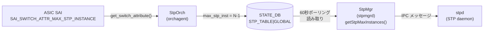

# STATE\_DB STP\_TABLE（STP 状態テーブル）

## 概要

`STATE_DB` の `STP_TABLE` は、スイッチ ASIC のハードウェア STP インスタンス上限を格納する **読み取り専用** の状態テーブル。`orchagent` の `StpOrch` が SAI 属性 `SAI_SWITCH_ATTR_MAX_STP_INSTANCE` から取得した値を書き込み、`stpmgrd` がこの値を読み取って STP インスタンス数を管理する。

テーブルには `GLOBAL` キーの 1 エントリのみが存在し、フィールドは `max_stp_inst` の 1 本のみ。

書き込み主体:

| プロセス | 書き込みトリガー | ファイル |
|---------|----------------|---------|
| `orchagent` (`StpOrch`) | 起動時に SAI から `SAI_SWITCH_ATTR_MAX_STP_INSTANCE` 取得成功時 | `orchagent/stporch.cpp` |

<!-- cdb-mermaid -->
### データフロー



<!-- /cdb-mermaid -->

## key 構造

```text
STP_TABLE|GLOBAL
```

エントリは `GLOBAL` キーの 1 件のみ。

## フィールド一覧

| フィールド | 書込み主体 | 型 | コード由来デフォルト | 説明 |
|-----------|---------|-----|---------------------|------|
| `max_stp_inst` | `orchagent/StpOrch` | uint16 (文字列) | **HW 依存** (`SAI_SWITCH_ATTR_MAX_STP_INSTANCE - 1`) | スイッチ ASIC がサポートする最大 STP インスタンス数 |

<!-- defaults -->
## コード由来の暗黙デフォルト

<!-- evidence: meta/_intermediate/cdb-flow/stp-state-defaults.md -->

### 1. max_stp_inst — SAI 由来 HW 能力値

`StpOrch::updateMaxStpInstance()` (`stporch.cpp:603-617`) が SAI から取得した最大インスタンス数から **-1** した値を書き込む:

```cpp
bool StpOrch::updateMaxStpInstance(uint32_t max_stp_instances)
{
    m_maxStpInstance = (sai_uint16_t)max_stp_instances - 1;
    // STP インスタンス ID が 0-indexed であるため -1 補正

    vector<FieldValueTuple> tuples;
    FieldValueTuple tuple("max_stp_inst", to_string(m_maxStpInstance));
    tuples.push_back(tuple);
    m_stpTable->set("GLOBAL", tuples);
    return true;
}
```

| フィールド | YANG default | コード実装デフォルト | 出典 |
|-----------|-------------|---------------------|------|
| `max_stp_inst` | なし (STATE_DB に YANG 定義なし) | HW 依存: `SAI_SWITCH_ATTR_MAX_STP_INSTANCE - 1` | `stporch.cpp:603-617` |

証跡: `stporch.cpp:28-40, 603-617`

---

### 2. stpmgrd フォールバック — 60 秒ポーリング後の固定値

`StpMgr::getStpMaxInstances()` (`stpmgr.cpp:1381-1413`) は起動時に `STP_TABLE|GLOBAL` を最大 60 秒ポーリングする。タイムアウトした場合は `STP_DEFAULT_MAX_INSTANCES = 255` をフォールバック値として使用する:

```cpp
// stpmgr.cpp:1407-1410
if(max_stp_instances == 0)
{
    max_stp_instances = STP_DEFAULT_MAX_INSTANCES;  // = 255
}
```

| 条件 | 値 | 出典 |
|------|-----|------|
| SAI 取得成功 (`orchagent` が先に起動) | `SAI_SWITCH_ATTR_MAX_STP_INSTANCE - 1` (HW 依存) | `stporch.cpp:603-617` |
| 60 秒タイムアウト (`orchagent` 未起動など) | `255` (固定フォールバック) | `stpmgr.h:38` |

証跡: `stpmgr.cpp:1381-1413`, `stpmgr.h:38`

---

### 3. SAI 取得失敗時 — STATE_DB 未書き込み

`StpOrch` コンストラクタで `SAI_SWITCH_ATTR_MAX_STP_INSTANCE` 取得に失敗した場合、`updateMaxStpInstance()` は呼ばれず、`STP_TABLE|GLOBAL` エントリは作成されない。この場合 `stpmgrd` は 60 秒待機後にフォールバック値 `255` を使用する。

証跡: `stporch.cpp:34-41`

<!-- /defaults -->

<!-- ordering -->
## 書込み順依存・タイミング依存 (Phase B)

`STATE_DB STP_TABLE` は `orchagent` (`StpOrch`) が書き込み、`stpmgrd` (`StpMgr`) がポーリング読み取りする。書き込み側と読み取り側が別プロセスであるため、起動順序・タイミングに依存する動作が存在する。

### 1. orchagent → STATE_DB → stpmgrd の前提順序

`StpOrch` コンストラクタ (`stporch.cpp:17-43`) は起動時に SAI から `SAI_SWITCH_ATTR_MAX_STP_INSTANCE` を取得し、即時 `updateMaxStpInstance()` で `STP_TABLE|GLOBAL` を書き込む:

```cpp
// stporch.cpp:34-39
status = sai_switch_api->get_switch_attribute(gSwitchId, (uint32_t)attrs.size(), attrs.data());
if (status == SAI_STATUS_SUCCESS)
{
    m_defaultStpId = attrs[0].value.oid;
    updateMaxStpInstance(attrs[1].value.u32);  // → STATE_DB 書き込み
}
```

`StpMgr::getStpMaxInstances()` (`stpmgr.cpp:1381-1413`) は 60 秒のポーリングループで読み取りを試みる:

```cpp
while(max_delay)
{
    if (m_stateStpTable.get(key, vmEntry))  // STP_TABLE|GLOBAL を読む
    { break; }
    sleep(1);
    max_delay--;
}
```

→ **順序依存**: `orchagent` (`StpOrch`) の初期化が `stpmgrd` の `getStpMaxInstances()` 呼び出しより先行するか、60 秒以内に完了する必要がある。先行しない場合はフォールバック値 `255` が使われる。

### 2. SAI 取得失敗時 — STATE_DB 書き込みスキップ

SAI の `get_switch_attribute()` が `SAI_STATUS_SUCCESS` 以外を返した場合、`updateMaxStpInstance()` は呼ばれず `STP_TABLE|GLOBAL` エントリは作成されない (`stporch.cpp:35-40`)。

`stpmgrd` は 60 秒のポーリングでエントリが見つからないまま最終的にフォールバック値 `255` を使用する。この場合エラーログは `stporch.cpp` 側にのみ出力される（`stpmgrd` 側はフォールバックへの切替のみ通知）。

→ **タイミング依存**: SAI 属性取得の成否が STATE_DB への書き込み有無を決定し、stpmgrd のインスタンス上限値に影響する。

### 3. 書き込みは起動時の 1 回のみ

`updateMaxStpInstance()` は `StpOrch` コンストラクタからのみ呼ばれ、実行中の再書き込みは行われない。`doTask()` による動的更新の仕組みは存在しない (`stporch.cpp` 全体に他の呼び出し箇所なし)。

→ `STP_TABLE|GLOBAL` は orchagent 起動後に固定され、その後 CONFIG_DB の変更によって更新されることはない。

### 書込み順依存のまとめ

| 依存関係 | 条件 | 不成立時の挙動 |
|---------|------|--------------|
| orchagent (StpOrch) 起動 → STATE_DB 書き込み | SAI 取得成功 | `STP_TABLE|GLOBAL` に `max_stp_inst` を書き込み |
| orchagent 起動失敗 / SAI エラー | SAI 取得失敗 | STATE_DB 未書き込み、stpmgrd は 60 秒待機後フォールバック `255` を使用 |
| stpmgrd の読み取りタイミング | orchagent が 60 秒以内に起動完了 | 成功: SAI 由来の実 HW 値を使用 |
| stpmgrd の読み取りタイムアウト | orchagent が 60 秒以内に未起動 | フォールバック `255` を使用 (エラーログなし、no-op) |

証跡: `stporch.cpp:17-43`, `stporch.cpp:603-617`, `stpmgr.cpp:1381-1413`
<!-- /ordering -->

## 例外条件・特殊挙動

- **-1 補正**: `max_stp_inst` は SAI の返す最大数から -1 した値。STP インスタンス ID が 0 始まりのため、使用可能な最大インスタンス ID が `max_stp_inst` と一致する。
- **起動レース**: `stpmgrd` が `orchagent` より先に起動した場合、60 秒の待機ループが発動する。プロダクション環境では通常 orchagent が先に起動するためタイムアウトは稀。
- **フォールバック値 `255` との関係**: CONFIG_DB `STP_VLAN` の上限 `PVST_MAX_INSTANCES = 255` (`config/stp.py:136`) および stpmgrd の `STP_DEFAULT_MAX_INSTANCES = 255` (`stpmgr.h:38`) と整合する設計。実 HW の SAI 値が 255 以下の場合は SAI 値が優先される。
- **フィールドは 1 本のみ**: `STP_TABLE|GLOBAL` には `max_stp_inst` のみ存在し、他のフィールドは書かれない。

## 確認コマンド

```bash
# STP_TABLE のエントリ確認
sonic-db-cli STATE_DB hgetall 'STP_TABLE|GLOBAL'
# 出典: https://github.com/sonic-net/sonic-swss/blob/4305596156d70e9797e8a881b3d19b46de0bce0d/orchagent/stporch.cpp#L603-L617
```

## 関連リファレンス

- CONFIG_DB: [`STP`](stp.md) — グローバル STP 設定 (PVST/MST タイマー、コード由来デフォルト詳細)
- CONFIG_DB: [`STP_VLAN`](stp-vlan.md) — VLAN ごとの STP 設定
- CONFIG_DB: [`STP_PORT`](stp-port.md) — インタフェースごとの STP 設定
- CONFIG_DB: [`STP_MST`](stp-mst.md) — MST 設定

<!-- topics-back-ref -->
## 関連 Topics

- [Topics: L2 / VLAN / LAG / MC-LAG](../../topics/06-l2-vlan-lag/index.md)

<!-- /topics-back-ref -->
