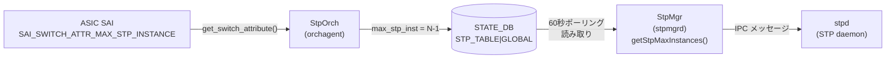

# STATE\_DB STP\_TABLE（STP 状態テーブル）

## 概要

`STATE_DB` の `STP_TABLE` は、スイッチ ASIC のハードウェア STP インスタンス上限を格納する **読み取り専用** の状態テーブル。`orchagent` の `StpOrch` が SAI 属性 `SAI_SWITCH_ATTR_MAX_STP_INSTANCE` から取得した値を書き込み、`stpmgrd` がこの値を読み取って STP インスタンス数を管理する。

テーブルには `GLOBAL` キーの 1 エントリのみが存在し、フィールドは `max_stp_inst` の 1 本のみ。

書き込み主体:

| プロセス | 書き込みトリガー | ファイル |
|---------|----------------|---------|
| `orchagent` (`StpOrch`) | 起動時に SAI から `SAI_SWITCH_ATTR_MAX_STP_INSTANCE` 取得成功時 | `orchagent/stporch.cpp` |

<!-- cdb-mermaid -->
### データフロー



<!-- /cdb-mermaid -->

## key 構造

```text
STP_TABLE|GLOBAL
```

エントリは `GLOBAL` キーの 1 件のみ。

## フィールド一覧

| フィールド | 書込み主体 | 型 | コード由来デフォルト | 説明 |
|-----------|---------|-----|---------------------|------|
| `max_stp_inst` | `orchagent/StpOrch` | uint16 (文字列) | **HW 依存** (`SAI_SWITCH_ATTR_MAX_STP_INSTANCE - 1`) | スイッチ ASIC がサポートする最大 STP インスタンス数 |

<!-- defaults -->
## コード由来の暗黙デフォルト

<!-- evidence: meta/_intermediate/cdb-flow/stp-state-defaults.md -->

### 1. max_stp_inst — SAI 由来 HW 能力値

`StpOrch::updateMaxStpInstance()` (`stporch.cpp:603-617`) が SAI から取得した最大インスタンス数から **-1** した値を書き込む:

```cpp
bool StpOrch::updateMaxStpInstance(uint32_t max_stp_instances)
{
    m_maxStpInstance = (sai_uint16_t)max_stp_instances - 1;
    // STP インスタンス ID が 0-indexed であるため -1 補正

    vector<FieldValueTuple> tuples;
    FieldValueTuple tuple("max_stp_inst", to_string(m_maxStpInstance));
    tuples.push_back(tuple);
    m_stpTable->set("GLOBAL", tuples);
    return true;
}
```

| フィールド | YANG default | コード実装デフォルト | 出典 |
|-----------|-------------|---------------------|------|
| `max_stp_inst` | なし (STATE_DB に YANG 定義なし) | HW 依存: `SAI_SWITCH_ATTR_MAX_STP_INSTANCE - 1` | `stporch.cpp:603-617` |

証跡: `stporch.cpp:28-40, 603-617`

---

### 2. stpmgrd フォールバック — 60 秒ポーリング後の固定値

`StpMgr::getStpMaxInstances()` (`stpmgr.cpp:1381-1413`) は起動時に `STP_TABLE|GLOBAL` を最大 60 秒ポーリングする。タイムアウトした場合は `STP_DEFAULT_MAX_INSTANCES = 255` をフォールバック値として使用する:

```cpp
// stpmgr.cpp:1407-1410
if(max_stp_instances == 0)
{
    max_stp_instances = STP_DEFAULT_MAX_INSTANCES;  // = 255
}
```

| 条件 | 値 | 出典 |
|------|-----|------|
| SAI 取得成功 (`orchagent` が先に起動) | `SAI_SWITCH_ATTR_MAX_STP_INSTANCE - 1` (HW 依存) | `stporch.cpp:603-617` |
| 60 秒タイムアウト (`orchagent` 未起動など) | `255` (固定フォールバック) | `stpmgr.h:38` |

証跡: `stpmgr.cpp:1381-1413`, `stpmgr.h:38`

---

### 3. SAI 取得失敗時 — STATE_DB 未書き込み

`StpOrch` コンストラクタで `SAI_SWITCH_ATTR_MAX_STP_INSTANCE` 取得に失敗した場合、`updateMaxStpInstance()` は呼ばれず、`STP_TABLE|GLOBAL` エントリは作成されない。この場合 `stpmgrd` は 60 秒待機後にフォールバック値 `255` を使用する。

証跡: `stporch.cpp:34-41`

<!-- /defaults -->

<!-- ordering -->
## 書込み順依存・タイミング依存 (Phase B)

`STATE_DB STP_TABLE` は `orchagent` (`StpOrch`) が書き込み、`stpmgrd` (`StpMgr`) がポーリング読み取りする。書き込み側と読み取り側が別プロセスであるため、起動順序・タイミングに依存する動作が存在する。

### 1. orchagent → STATE_DB → stpmgrd の前提順序

`StpOrch` コンストラクタ (`stporch.cpp:17-43`) は起動時に SAI から `SAI_SWITCH_ATTR_MAX_STP_INSTANCE` を取得し、即時 `updateMaxStpInstance()` で `STP_TABLE|GLOBAL` を書き込む:

```cpp
// stporch.cpp:34-39
status = sai_switch_api->get_switch_attribute(gSwitchId, (uint32_t)attrs.size(), attrs.data());
if (status == SAI_STATUS_SUCCESS)
{
    m_defaultStpId = attrs[0].value.oid;
    updateMaxStpInstance(attrs[1].value.u32);  // → STATE_DB 書き込み
}
```

`StpMgr::getStpMaxInstances()` (`stpmgr.cpp:1381-1413`) は 60 秒のポーリングループで読み取りを試みる:

```cpp
while(max_delay)
{
    if (m_stateStpTable.get(key, vmEntry))  // STP_TABLE|GLOBAL を読む
    { break; }
    sleep(1);
    max_delay--;
}
```

→ **順序依存**: `orchagent` (`StpOrch`) の初期化が `stpmgrd` の `getStpMaxInstances()` 呼び出しより先行するか、60 秒以内に完了する必要がある。先行しない場合はフォールバック値 `255` が使われる。

### 2. SAI 取得失敗時 — STATE_DB 書き込みスキップ

SAI の `get_switch_attribute()` が `SAI_STATUS_SUCCESS` 以外を返した場合、`updateMaxStpInstance()` は呼ばれず `STP_TABLE|GLOBAL` エントリは作成されない (`stporch.cpp:35-40`)。

`stpmgrd` は 60 秒のポーリングでエントリが見つからないまま最終的にフォールバック値 `255` を使用する。この場合エラーログは `stporch.cpp` 側にのみ出力される（`stpmgrd` 側はフォールバックへの切替のみ通知）。

→ **タイミング依存**: SAI 属性取得の成否が STATE_DB への書き込み有無を決定し、stpmgrd のインスタンス上限値に影響する。

### 3. 書き込みは起動時の 1 回のみ

`updateMaxStpInstance()` は `StpOrch` コンストラクタからのみ呼ばれ、実行中の再書き込みは行われない。`doTask()` による動的更新の仕組みは存在しない (`stporch.cpp` 全体に他の呼び出し箇所なし)。

→ `STP_TABLE|GLOBAL` は orchagent 起動後に固定され、その後 CONFIG_DB の変更によって更新されることはない。

### 書込み順依存のまとめ

| 依存関係 | 条件 | 不成立時の挙動 |
|---------|------|--------------|
| orchagent (StpOrch) 起動 → STATE_DB 書き込み | SAI 取得成功 | `STP_TABLE|GLOBAL` に `max_stp_inst` を書き込み |
| orchagent 起動失敗 / SAI エラー | SAI 取得失敗 | STATE_DB 未書き込み、stpmgrd は 60 秒待機後フォールバック `255` を使用 |
| stpmgrd の読み取りタイミング | orchagent が 60 秒以内に起動完了 | 成功: SAI 由来の実 HW 値を使用 |
| stpmgrd の読み取りタイムアウト | orchagent が 60 秒以内に未起動 | フォールバック `255` を使用 (エラーログなし、no-op) |

証跡: `stporch.cpp:17-43`, `stporch.cpp:603-617`, `stpmgr.cpp:1381-1413`
<!-- /ordering -->

<!-- cross-refs -->
## 暗黙参照テーブル (Phase C)

> **調査根拠**: `sonic-swss/orchagent/stporch.cpp` L17–43, L603–617、`sonic-swss/cfgmgr/stpmgrd.cpp` L68–88、`sonic-swss/cfgmgr/stpmgr.cpp` L1257–1274, L1381–1413 精読 (2026-05-19)
> 詳細証跡: `meta/_intermediate/cdb-flow/stp-state-cross-refs.md`

`STP_TABLE|GLOBAL` は他の CONFIG_DB テーブルを leafref で参照しない独立した STATE_DB エントリである。
書き込み側 (`StpOrch`) は SAI のみを入力とし、読み取り側 (`stpmgrd`) は `PORT_TABLE|PortInitDone` を先行確認してから `STP_TABLE` を参照する。

| 参照先テーブル / リソース | DB | 参照タイミング | 依存方向 | evidence |
|---|---|---|---|---|
| SAI `SAI_SWITCH_ATTR_MAX_STP_INSTANCE` | SAI | orchagent 起動時 1 回 | **書き側の入力**。この SAI 属性値 −1 が `max_stp_inst` として STATE_DB に書き込まれる | `stporch.cpp:30–41, 609` |
| `PORT_TABLE\|PortInitDone` | APPL_DB | stpmgrd 起動時、`STP_TABLE` 読み取りの**前** | **読み側ガード**。`isPortInitDone()` が `PortInitDone` エントリの存在を確認するまでポーリングし、確認後に `getStpMaxInstances()` を呼ぶ | `stpmgr.cpp:1257–1273`, `stpmgrd.cpp:72` |
| `DEVICE_METADATA\|localhost` | CONFIG_DB | stpmgrd 起動時、`STP_TABLE` 読み取りの**直後** | **読み側の後続処理**（MAC アドレス取得）。`STP_TABLE` の値には影響しない | `stpmgrd.cpp:81–88` |

!!! note "STP_TABLE は純粋な「SAI → STATE_DB」ブリッジ"
    `StpOrch::updateMaxStpInstance()` (`stporch.cpp:603–617`) は SAI 属性値を計算して `m_stpTable->set("GLOBAL", ...)` を呼ぶだけで、他のテーブルを読み取らない。CONFIG_DB 上のどの STP 設定テーブル (`STP` / `STP_VLAN` / `STP_PORT`) の値も `max_stp_inst` の決定に関与しない。

!!! note "「ポート初期化完了ガード」が唯一の実質的な順序制約"
    `stpmgrd` が `STP_TABLE|GLOBAL` を読み取る前に `APPL_DB PORT_TABLE|PortInitDone` の存在を確認することで、`StpOrch` が orchagent として起動し SAI 初期化が完了するまでの間接的な待機が実現される。直接の leafref や YANG 制約ではなく、コード上の起動シーケンス設計による暗黙依存である。

<!-- /cross-refs -->

<!-- failure -->
## 失敗挙動 (Phase D)

`STP_TABLE|GLOBAL` の書込みパスは `SAI → StpOrch::updateMaxStpInstance() → swss::Table::set()` の 1 段構成であり、書込み失敗は (A) SAI 取得失敗による書込みスキップ、(B) Redis 接続失敗による例外、の 2 系統に集約される。読み取り側 `stpmgrd` は (C) 60 秒タイムアウト後のフォールバック、(D) 例外による stpmgrd プロセス終了、を持つ。

### A. SAI 取得失敗 → STATE_DB 書込みスキップ

| 失敗条件 | 結果 | ログ | evidence |
|---|---|---|---|
| `sai_switch_api->get_switch_attribute()` が `SAI_STATUS_SUCCESS` 以外を返す | `updateMaxStpInstance()` 未呼び出し → `STP_TABLE\|GLOBAL` エントリ未作成 | `SWSS_LOG_NOTICE` "StpOrch initialization failure" (ERROR ではない) | `stporch.cpp:34-43` |

!!! note "ログレベルに注意"
    SAI 取得失敗は `SWSS_LOG_NOTICE` レベルの "failure" 文字列で出力される。`SWSS_LOG_ERROR` は出力されないため、アラート監視のしきい値設定によっては見落とされる可能性がある。

### B. Redis (STATE_DB) 書込み失敗 → orchagent abort

`updateMaxStpInstance()` 内の `m_stpTable->set("GLOBAL", tuples)` は `swss::Table::set()` を呼ぶ (戻り値 void)。Redis I/O エラー時は `system_error` / `runtime_error` 例外が `swss::DBConnector` から送出され、`stporch.cpp` に try/catch がないため `orchdaemon` まで伝播し orchagent プロセスが abort する。systemd による再起動で自己回復する (`stporch.cpp:603-615`)。

### C. stpmgrd 側のタイムアウトフォールバック

| 失敗条件 | 結果 | ログ | evidence |
|---|---|---|---|
| `STP_TABLE\|GLOBAL` が 60 秒以内に読み取れない（orchagent 未起動 / SAI 失敗で未書込み） | `max_stp_instances = STP_DEFAULT_MAX_INSTANCES = 255` をフォールバック値として使用 | `SWSS_LOG_NOTICE` "set default max stp instance 255" (ERROR なし) | `stpmgr.cpp:1381-1413`, `stpmgr.h:38` |

フォールバック動作はサイレント (ERROR ログなし)。実 HW の SAI 上限が 255 を下回る場合はオーバープロビジョニングとなりうるが、STP インスタンス作成時の SAI エラーで顕在化する。

### D. stpmgrd プロセスの例外終了

`stpmgrd.cpp:119-122` は `catch (const exception &e)` でトップレベルの例外を捕捉し、`SWSS_LOG_ERROR("Runtime error: %s", e.what())` をログ出力した後 `-1` で終了する (自動再試行なし)。起動シーケンス中に `DEVICE_METADATA|localhost` の `mac` フィールドが見つからない場合 (`stpmgrd.cpp:86`) も `runtime_error` を throw してこの経路を通る。supervisord による再起動が回復経路となる。

### 失敗系統まとめ

| 失敗条件 | 書込み可否 | 回復経路 | ログ |
|---|---|---|---|
| SAI 属性取得失敗 | 未書込み | orchagent 再起動 → 再 SAI クエリ | NOTICE "initialization failure" |
| Redis 接続失敗 (STATE_DB) | 途中 abort | orchagent abort → systemd 再起動 | `system_error` 例外メッセージ |
| stpmgrd が 60 秒タイムアウト | 読取り失敗 → フォールバック 255 | なし (フォールバックで続行) | NOTICE "set default max stp instance" |
| stpmgrd 起動中例外 | 読取り未到達 | supervisord 再起動 | ERROR "Runtime error" |

> **証跡**: `stporch.cpp:17-43, 603-615`、`stpmgr.cpp:1381-1413`、`stpmgrd.cpp:70-122`、`stpmgr.h:38`。詳細は `meta/_intermediate/cdb-flow/stp-state-failure.md` を参照。

<!-- /failure -->

<!-- constants -->
## ハードコード定数 (Phase E)

<!-- evidence: sonic-swss/orchagent/stporch.h (ref: master), sonic-swss/cfgmgr/stpmgr.h (ref: master), sonic-swss/cfgmgr/stpmgr.cpp (ref: master) -->

`STP_TABLE|GLOBAL` の書き込みと読み取りに関与するハードコード定数の一覧。いずれも CONFIG_DB / YANG では設定不可。

| 定数 | 値 | 定義箇所 | 用途 |
|-----|----|---------|------|
| `STP_INVALID_INSTANCE` | `0xFFFF` (65535) | `stporch.h:8` | 未割り当て STP インスタンス ID のセンチネル値。`updateMaxStpInstance()` 前に `m_defaultStpId` が未解決の場合に使用される |
| `-1` 補正 (`max_stp_instance - 1`) | SAI 値 − 1 | `stporch.cpp:605` | SAI `SAI_SWITCH_ATTR_MAX_STP_INSTANCE` の戻り値から 1 を減算した値を `max_stp_inst` として STATE_DB に書き込む。STP インスタンス ID が 0 始まりのため最大 ID = 上限数 − 1 |
| `STP_DEFAULT_MAX_INSTANCES` | `255` | `stpmgr.h:38` | `stpmgrd` が STATE_DB から 60 秒以内に `max_stp_inst` を読み取れなかった場合のフォールバック値。実 HW の SAI 上限に依存しない安全値として使われる |
| `max_delay` (タイムアウト上限) | `60` 秒 | `stpmgr.cpp:1384` | `getStpMaxInstances()` のポーリングループ上限。1 秒 × 60 回のビジーウェイトで `STP_TABLE|GLOBAL` の出現を待機する |
| `L2_INSTANCE_MAX` | `MAX_VLANS` = `4096` | `stpmgr.h:34,37` | `stpmgrd` 内 `l2InstPool` (bitset) のサイズ上限。`max_stp_instances` が 4096 を超えることは想定されない |

### 定数の影響詳細

**`-1` 補正の意味**: `updateMaxStpInstance(uint32_t max_stp_instances)` (`stporch.cpp:605`) は `m_maxStpInstance = (sai_uint16_t)max_stp_instances - 1` で補正した値を STATE_DB に書き込む。例えば SAI が `max_stp_instance = 256` を返すと、STATE_DB には `max_stp_inst = 255` が書き込まれる。`stpmgrd` はこの値を上限 ID（0 始まりインデックスの最大値）として扱う。

**フォールバック `255` と SAI 値の関係**: 実 HW の SAI 値が 255 以下の場合、SAI 値 − 1 = フォールバック値以下となるため問題は顕在化しない。SAI 値が 256 以上の HW では `orchagent` 起動に成功した場合のみ本来の最大インスタンス数が利用できる。`orchagent` が 60 秒以内に起動しない場合は HW 能力を下回る `255` がフォールバックとして使用される。

**ポーリング間隔固定**: `getStpMaxInstances()` (`stpmgr.cpp:1389-1407`) の `sleep(1)` は固定値でチューニング不可。CONFIG_DB 上のタイムアウト設定も存在しない。

<!-- /constants -->

## 例外条件・特殊挙動

- **-1 補正**: `max_stp_inst` は SAI の返す最大数から -1 した値。STP インスタンス ID が 0 始まりのため、使用可能な最大インスタンス ID が `max_stp_inst` と一致する。
- **起動レース**: `stpmgrd` が `orchagent` より先に起動した場合、60 秒の待機ループが発動する。プロダクション環境では通常 orchagent が先に起動するためタイムアウトは稀。
- **フォールバック値 `255` との関係**: CONFIG_DB `STP_VLAN` の上限 `PVST_MAX_INSTANCES = 255` (`config/stp.py:136`) および stpmgrd の `STP_DEFAULT_MAX_INSTANCES = 255` (`stpmgr.h:38`) と整合する設計。実 HW の SAI 値が 255 以下の場合は SAI 値が優先される。
- **フィールドは 1 本のみ**: `STP_TABLE|GLOBAL` には `max_stp_inst` のみ存在し、他のフィールドは書かれない。

## 確認コマンド

```bash
# STP_TABLE のエントリ確認
sonic-db-cli STATE_DB hgetall 'STP_TABLE|GLOBAL'
# 出典: https://github.com/sonic-net/sonic-swss/blob/4305596156d70e9797e8a881b3d19b46de0bce0d/orchagent/stporch.cpp#L603-L617
```

## 関連リファレンス

- CONFIG_DB: [`STP`](stp.md) — グローバル STP 設定 (PVST/MST タイマー、コード由来デフォルト詳細)
- CONFIG_DB: [`STP_VLAN`](stp-vlan.md) — VLAN ごとの STP 設定
- CONFIG_DB: [`STP_PORT`](stp-port.md) — インタフェースごとの STP 設定
- CONFIG_DB: [`STP_MST`](stp-mst.md) — MST 設定

<!-- topics-back-ref -->
## 関連 Topics

- [Topics: L2 / VLAN / LAG / MC-LAG](../../topics/06-l2-vlan-lag/index.md)

<!-- /topics-back-ref -->
