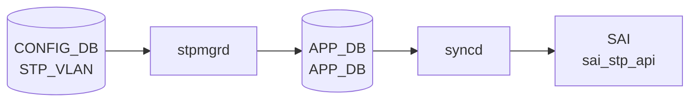

# STP_VLAN / STP_VLAN_PORT テーブル

## 概要

`STP_VLAN` は PVST (Per-VLAN Spanning Tree) における VLAN ごとのブリッジパラメータ (タイマー・優先度・有効化フラグ) を保持する。
`STP_VLAN_PORT` は per-VLAN per-port の path_cost / priority を保持し、CLI で明示設定した場合のみエントリが作成される。

`stpmgrd` (`sonic-swss/cfgmgr/stpmgrd.cpp`) が CONFIG_DB を購読し、Unix Domain Socket 経由で STP デーモンに IPC メッセージを送信する。
CLI は `config/stp.py` の `config spanning-tree` コマンド群が担当する。

| テーブル | キー形式 | 役割 |
|---|---|---|
| `STP_VLAN` | `Vlan<vid>` | VLAN ごとのブリッジタイマー・プライオリティ |
| `STP_VLAN_PORT` | `Vlan<vid>\|<intf_name>` | per-VLAN per-port の path_cost / priority |

<!-- defaults -->
<!-- cdb-mermaid -->
### データフロー (自動生成)



!!! note "凡例"
    CONFIG_DB から SAI までの典型経路を `docs/reference/config-db-orch-map.md` から機械生成したミニ図。詳細・例外は本ページ本文と対応表を参照。
<!-- /cdb-mermaid -->

## 暗黙デフォルトとハードコード挙動

<!-- evidence: meta/_intermediate/cdb-flow/stp-vlan-defaults.md -->

### 1. STP_VLAN — デフォルト定数

`config/stp.py:114–136` で定義される PVST 定数:

```python
STP_DEFAULT_FORWARD_DELAY   = 15    # 有効範囲: 4–30 秒
STP_DEFAULT_HELLO_INTERVAL  = 2     # 有効範囲: 1–10 秒
STP_DEFAULT_MAX_AGE         = 20    # 有効範囲: 6–40 秒
STP_DEFAULT_BRIDGE_PRIORITY = 32768 # 有効範囲: 0–61440 (4096 の倍数)
PVST_MAX_INSTANCES          = 255
```

証跡: `config/stp.py:114-136`

---

### 2. STP_VLAN — PVST 有効化時の一括書き込み

`config spanning-tree enable pvst` 実行時に `enable_stp_for_vlans(db)` (`config/stp.py:251-266`) が全 VLAN に対して実行される。
各 VLAN エントリの値は `STP|GLOBAL` から継承する:

```python
fvs = {
    'enabled':       'true',
    'forward_delay': get_global_stp_forward_delay(db),  # -> 15
    'hello_time':    get_global_stp_hello_time(db),     # -> 2
    'max_age':       get_global_stp_max_age(db),        # -> 20
    'priority':      get_global_stp_priority(db)        # -> 32768
}
db.set_entry('STP_VLAN', vlan_key, fvs)
```

| フィールド | デフォルト値 | 有効範囲 | 備考 |
|---|---|---|---|
| `enabled` | `"true"` | `true` / `false` | VLAN STP 有効化フラグ |
| `forward_delay` | `15` (秒) | 4–30 | `STP|GLOBAL` から継承 |
| `hello_time` | `2` (秒) | 1–10 | `STP|GLOBAL` から継承 |
| `max_age` | `20` (秒) | 6–40 | `STP|GLOBAL` から継承 |
| `priority` | `32768` | 0–61440 (4096 倍数) | VLAN ブリッジプライオリティ |

証跡: `config/stp.py:251-266`

---

### 3. STP_VLAN — 個別 VLAN 有効化

`config spanning-tree vlan enable <vid>` → `vlan_enable_stp(db, vlan_name)` (`config/stp.py:278-289`):

- `STP_VLAN` エントリが**存在しない**場合: 全フィールドを `STP|GLOBAL` 値で `set_entry`
- `STP_VLAN` エントリが**既存**の場合: `enabled: 'true'` のみ `mod_entry` で更新

既存エントリのタイマー・priority は上書きされない (設定済み値を保護)。

証跡: `config/stp.py:278-289, 846-855`

---

### 4. STP_VLAN — グローバル変更時の条件付き同期

`config spanning-tree forward_delay` 等でグローバル値を変更すると、`update_stp_vlan_parameter()` (`config/stp.py:228-242`) が全 VLAN を走査する:

```python
current_global_value = stp_global_entry.get("forward_delay")
for vlan in db.get_table('STP_VLAN'):
    current_vlan_value = vlan_entry.get(param_type)
    if current_global_value == current_vlan_value:
        # グローバルと同値の VLAN のみ新値に更新
        db.mod_entry('STP_VLAN', vlan, {param_type: new_value})
```

!!! note "VLAN 個別変更済みは同期されない"
    VLAN ごとに個別変更されたフィールドはグローバル変更に追随しない (意図的設計)。

証跡: `config/stp.py:228-242`

---

### 5. STP_VLAN — タイマー整合性制約

`validate_params()` (`config/stp.py:183-187`) により以下の不等式を強制する:

```
2 * (forward_delay - 1) >= max_age >= 2 * (hello_time + 1)
```

デフォルト値での検証: `2*(15-1)=28 >= 20 >= 2*(2+1)=6` → 満足

この制約は `STP|GLOBAL` と `STP_VLAN` の両方で個別にチェックされる。
stpmgrd 側での検証はなく、CONFIG_DB に不正値が書き込まれた場合の動作は未定義。

証跡: `config/stp.py:183-207`

---

### 6. STP_VLAN — 最大インスタンス制限 (silent truncation)

`PVST_MAX_INSTANCES = 255` を超えた VLAN への STP 適用は `logging.warning` のみで停止する。

```python
if vlan_count >= max_stp_instances:  # 255
    logging.warning("Exceeded maximum STP configurable VLAN instances for {}".format(vlan_key))
    break
```

stpmgr.h 側の `STP_DEFAULT_MAX_INSTANCES = 255` と整合。エラー・例外は発生しない。

証跡: `config/stp.py:136, 260-265`, `stpmgr.h:38`

---

### 7. STP_VLAN_PORT — 初期書き込みなし

`STP_VLAN_PORT` テーブルはデフォルト状態では**自動的に書き込まれない**。
PVST 有効化・VLAN 有効化のいずれの処理でも `STP_VLAN_PORT` への初期エントリ作成はない。

| フィールド | デフォルト値 | 有効範囲 | 備考 |
|---|---|---|---|
| `path_cost` | **未設定** | 1–200,000,000 | 明示 CLI コマンドでのみ作成 |
| `priority` | **未設定** | 0–240 | 明示 CLI コマンドでのみ作成 |

証跡: `config/stp.py:1285-1321`

---

### 8. STP_VLAN_PORT — 明示 CLI コマンドによる書き込み

```bash
# per-VLAN per-port priority
config spanning-tree vlan interface priority <vid> <intf> <0-240>
# -> db.mod_entry('STP_VLAN_PORT', "Vlan<vid>|<intf>", {'priority': <value>})

# per-VLAN per-port path_cost
config spanning-tree vlan interface cost <vid> <intf> <1-200000000>
# -> db.mod_entry('STP_VLAN_PORT', "Vlan<vid>|<intf>", {'path_cost': <value>})
```

`config spanning-tree interface cost <intf> <cost>` でインタフェースレベルの cost を変更すると、
同一インタフェースの既存 `STP_VLAN_PORT` エントリの `path_cost` も追随して更新される。

証跡: `config/stp.py:1043-1060, 1285-1321`

---

### 9. STP_VLAN_PORT — stpmgrd 側の sentinel 値

`doStpVlanPortTask()` (`stpmgr.cpp:411-442`) における IPC メッセージ初期値:

```cpp
STP_VLAN_PORT_CONFIG_MSG msg;
memset(&msg, 0, sizeof(STP_VLAN_PORT_CONFIG_MSG));  // path_cost の初期値は 0
msg.priority = -1;  // sentinel: 未設定を示す
```

`priority` の `-1` は STP デーモン側で「プライオリティ未指定」として扱われる sentinel 値。
`path_cost` は `0` (memset) がデフォルトで送信される (未設定の意味)。

証跡: `stpmgr.cpp:411-442`

---

### 10. STP_VLAN_PORT — 起動順序ガード (silent defer)

`doStpVlanPortTask()` (`stpmgr.cpp:448-450`) は 3 タスクが全て完了するまで処理を保留する:

```cpp
if (stpGlobalTask == false || stpVlanTask == false || stpPortTask == false)
    return;  // silent defer — エラーなし、syslog なし
```

グローバル・VLAN・PORT 設定の受信完了前に `STP_VLAN_PORT` 設定が届いても処理されない。
起動時の書き込み順序ずれで設定が遅延適用される (エラーなし)。

証跡: `stpmgr.cpp:448-450`

---

### 11. STP_VLAN_PORT — VLAN 有効化時の no-op refresh

`config spanning-tree vlan enable <vid>` では既存 `STP_VLAN_PORT` エントリを読み取って同値で `mod_entry` する (`config/stp.py:857-861`)。
実質的な値変更はなく、stpmgrd に SET イベントを再送するための refresh 操作。

証跡: `config/stp.py:857-861`

<!-- /defaults -->

<!-- ordering -->
## 処理順序・依存関係 (Phase B)

<!-- evidence: meta/_intermediate/cdb-flow/stp-vlan-ordering.md -->

`stpmgrd` (`sonic-swss/cfgmgr/stpmgr.cpp`) は `STP_VLAN` / `STP_VLAN_PORT` テーブルの処理に対して複数段のガード条件を実装しており、前提テーブルが受信済みでなければ SET を **silent defer** または **silent skip** する。

### 1. stpGlobalTask + stpPortTask — STP_VLAN ガード条件

`doStpVlanTask()` (`stpmgr.cpp:183-185`):

```cpp
if (stpGlobalTask == false || (stpPortTask == false && !isStpPortEmpty()))
    return;
```

`stpGlobalTask` は `STP|GLOBAL` の最初の SET 受信時、`stpPortTask` は `STP_PORT` の最初の SET 受信時に `true` になる。
ポートが存在しない場合 (`isStpPortEmpty()` = true) は `stpPortTask` 待ちをスキップする。

!!! warning "STP_VLAN より先に STP|GLOBAL / STP_PORT を書き込むこと"
    `stpGlobalTask` または `stpPortTask` が立っていない状態で `STP_VLAN` SET が到達しても、
    `doStpVlanTask()` は即 `return` する（消費キューに残りエラーログなし）。
    次の SELECT ループで再試行されるが、前提フラグが立つまで何度でも defer が続く。

証跡: `stpmgr.cpp:179-188, 85-86, 637-638`

---

### 2. l2ProtoEnabled ガード — STP モード確定が先行必須

SET ハンドラ内 (`stpmgr.cpp:210`):

```cpp
if (l2ProtoEnabled == L2_NONE || !isVlanStateOk(key))
{
    it++;
    continue;
}
```

`l2ProtoEnabled` は `STP|GLOBAL` の `mode` フィールド (`pvst` / `mst`) を受け取った時点で `L2_PVSTP` / `L2_MSTP` に設定される。
`L2_NONE` のまま `STP_VLAN` SET が届いた場合はイテレータを進めて次ループへ持ち越す（silent skip）。

証跡: `stpmgr.cpp:119, 127, 207-214`

---

### 3. isVlanStateOk — STATE_VLAN 存在確認が先行必須

`isVlanStateOk(key)` は `STATE_DB:STATE_VLAN_TABLE` に対象 VLAN のエントリが存在するか確認する (`stpmgr.cpp:1276-1290`)。
`vlanmgrd` が VLAN を ASIC に適用してから `STATE_VLAN_TABLE|Vlan<vid>` を書き込む。

!!! warning "VLAN が STATE_VLAN_TABLE に登録される前に STP_VLAN を書くと設定が適用されない"
    `config spanning-tree enable pvst` を実行した直後など、`vlanmgrd` が STATE_VLAN を未書込の
    タイミングでは `doStpVlanTask()` が全件スキップする（エラーなし）。
    `vlanmgrd` が STATE_VLAN を書き込んだ後、次 SELECT ループで自動的に処理される。

証跡: `stpmgr.cpp:210, 1276-1290`

---

### 4. stpGlobalTask + stpVlanTask + stpPortTask — STP_VLAN_PORT ガード条件

`doStpVlanPortTask()` (`stpmgr.cpp:448`):

```cpp
if (stpGlobalTask == false || stpVlanTask == false || stpPortTask == false)
    return;
```

`stpVlanTask` は `STP_VLAN` の最初の SET を受け取った時点で `true` になる。
`STP_VLAN_PORT` は 3 フラグ全て立つまで処理されない。

#### PVST 推奨書き込み順序

```
1. STP|GLOBAL       → stpGlobalTask フラグ + l2ProtoEnabled 設定
2. STP_PORT         → stpPortTask フラグ
3. STP_VLAN         → stpVlanTask フラグ + m_vlanInstMap 設定
4. STP_VLAN_PORT    → 全フラグが揃った後
```

証跡: `stpmgr.cpp:444-450`

---

### 5. m_vlanInstMap — STP_VLAN_PORT は VLAN→インスタンスマップが必須

```cpp
if ((l2ProtoEnabled == L2_NONE) || (m_vlanInstMap[vlan_id] == INVALID_INSTANCE))
{
    it++;
    continue;
}
```

`m_vlanInstMap[vlan_id]` は `doStpVlanTask()` 内で stpd からの IPC 応答 (`allocateStpVlanInstance()`) によって設定される。
`STP_VLAN` エントリの処理が完了するまで同 VLAN の `STP_VLAN_PORT` は `INVALID_INSTANCE` チェックにより silent skip される。

証跡: `stpmgr.cpp:483-503`

---

### 順序依存サマリ

| # | 依存関係 | 方向 | 緩和策 |
|---|----------|------|--------|
| 1 | `STP\|GLOBAL` + `STP_PORT` → `STP_VLAN` 受信 | 先行必須（欠如時 silent defer） | 全フラグ揃い次第 SELECT ループで自動処理 |
| 2 | `STP\|GLOBAL.mode` 受信 → `l2ProtoEnabled` 確定 → `STP_VLAN` SET | 先行必須（欠如時 silent skip） | `mode` フィールド受信後に自動復旧 |
| 3 | `STATE_VLAN_TABLE\|Vlan<vid>` 書込み → `STP_VLAN\|Vlan<vid>` 処理 | 先行必須（欠如時 silent skip） | `vlanmgrd` の STATE_VLAN 書込み後に自動復旧 |
| 4 | `STP\|GLOBAL` + `STP_PORT` + `STP_VLAN` → `STP_VLAN_PORT` 受信 | 先行必須（欠如時 silent defer） | PVST: GLOBAL→PORT→VLAN→VLAN_PORT 順で書き込む |
| 5 | `STP_VLAN` 処理完了（stpd インスタンス割当） → `STP_VLAN_PORT` 処理 | 先行必須（欠如時 silent skip） | stpd IPC 応答後に `m_vlanInstMap` が設定される |

<!-- /ordering -->

<!-- cross-refs -->
## 暗黙参照（テーブル間依存）

<!-- evidence: meta/_intermediate/cdb-flow/stp-vlan-cross-refs.md -->

`STP_VLAN` / `STP_VLAN_PORT` テーブルを処理する `StpMgr::doStpVlanTask()` / `doStpVlanPortTask()` が実行時に参照する他テーブル・Orch 内状態。YANG の leafref 定義は VLAN への参照のみで、それ以外は実装レベルの暗黙依存である。コード調査の詳細は `meta/_intermediate/cdb-flow/stp-vlan-cross-refs.md` に記録した。

### 1. `STP|GLOBAL` — l2ProtoEnabled フラグ源（必須依存）

- **参照先**: CONFIG_DB `STP|GLOBAL` → stpmgrd 内部変数 `l2ProtoEnabled`
- **方向**: 読み取り（`stpmgr.cpp:210`）
- **意味**: `doStpGlobalTask()` が `STP|GLOBAL.mode` (`pvst` / `mst`) を受信し `l2ProtoEnabled` を `L2_PVSTP` / `L2_MSTP` に設定する。`l2ProtoEnabled == L2_NONE` のまま `STP_VLAN` SET が届いた場合はイテレータを進めて silent skip される。
- **非対称性**: `STP|GLOBAL` 受信前に書き込んだ `STP_VLAN` エントリはキューに残りモードが確定後のループで自動処理される。

### 2. `STP_PORT` — stpPortTask フラグ源（条件付き必須）

- **参照先**: CONFIG_DB `STP_PORT` → stpmgrd 内部フラグ `stpPortTask`
- **方向**: 読み取り（`stpmgr.cpp:183-185`）
- **意味**: `doStpPortTask()` が `STP_PORT` の最初の SET を受け取ると `stpPortTask = true` に設定する。ポートが存在しない場合（`isStpPortEmpty()` = true、`m_cfgStpPortTable.getKeys()` が空）はフラグなしで通過可能。
- **参照コード**:
  ```cpp
  if (stpGlobalTask == false || (stpPortTask == false && !isStpPortEmpty()))
      return;
  ```
  `stpmgr.cpp:1326-1335`

### 3. `STATE_DB:STATE_VLAN_TABLE` — VLAN 準備確認（必須依存）

- **参照先**: STATE_DB `STATE_VLAN_TABLE|Vlan<vid>` (vlanmgrd が書き込む)
- **方向**: 読み取り（`stpmgr.cpp:1276-1290`、`isVlanStateOk()`）
- **意味**: `doStpVlanTask()` SET ハンドラ内 (`stpmgr.cpp:210`) で `isVlanStateOk(key)` を確認する。対象 VLAN が STATE_VLAN_TABLE に存在しない場合 SET はイテレータを進めて持ち越し（silent skip）。`vlanmgrd` が ASIC 適用後に STATE_VLAN_TABLE を書き込むまで繰り返される。

!!! warning "vlanmgrd との順序依存"
    `config spanning-tree enable pvst` 直後など、対象 VLAN の `STATE_VLAN_TABLE` エントリが未書込の状態で `STP_VLAN` SET が到達しても処理されない。エラーログは出力されず、次の SELECT ループで自動リトライされる。

### 4. `STATE_DB:STATE_VLAN_MEMBER_TABLE` — PVST インスタンス割当時のポートメンバー参照

- **参照先**: STATE_DB `STATE_VLAN_MEMBER_TABLE` (vlanmgrd が管理)
- **方向**: 読み取り（`stpmgr.cpp:938`、`getAllVlanMem()`）
- **意味**: PVST 新規 VLAN インスタンス割当時 (`newInstance = 1`、`m_vlanInstMap[vlan_id] == INVALID_INSTANCE`)、`getAllVlanMem()` が `STATE_VLAN_MEMBER_TABLE` から当該 VLAN の全メンバーポートを取得し `STP_VLAN_CONFIG` IPC メッセージに付加する。MST モードでは参照されない。

### 5. stpmgrd 内部 `m_vlanInstMap[]` — `STP_VLAN_PORT` への暗黙連鎖

- **参照先**: stpmgrd 内部配列 `m_vlanInstMap[MAX_VLANS]`
- **方向**: `STP_VLAN` 処理時に書き込み → `STP_VLAN_PORT` 処理時に読み取り
- **意味**: `allocL2Instance(vlan_id)` / `deallocL2Instance(vlan_id)` が `m_vlanInstMap[vlan_id]` を設定する。`doStpVlanPortTask()` は `m_vlanInstMap[vlan_id] == INVALID_INSTANCE` の間、同 VLAN の全 SET を silent skip する。
- **参照コード** (`stpmgr.cpp:486-495`):
  ```cpp
  if ((l2ProtoEnabled == L2_NONE) || (m_vlanInstMap[vlan_id] == INVALID_INSTANCE))
  {
      it++;
      continue;
  }
  ```

### 6. `STP_VLAN_PORT` (cfg) — VlanMember 変化時の遅延再送

- **参照先**: CONFIG_DB `STP_VLAN_PORT` (m_cfgStpVlanPortTable)
- **方向**: 読み取り（`stpmgr.cpp:732, 844`）
- **意味**: `doVlanMemUpdateTask()` が `STATE_VLAN_MEMBER_TABLE` 変化（ポートの VLAN 参加/離脱）を検知した際、既存の `STP_VLAN_PORT` エントリを参照して path_cost / priority の設定済み値を stpd へ再送する。

### 7. stpd IPC socket — STP デーモンへの通知（出力）

- **参照先**: Unix Domain Socket `/var/run/stpipc.sock` (stpd が待ち受け)
- **方向**: 書き込み（`stpmgr.cpp:332`、`sendMsgStpd(STP_VLAN_CONFIG, ...)`）
- **意味**: `STP_VLAN` SET 処理後に `STP_VLAN_CONFIG` IPC メッセージを stpd に送信する。`STP_VLAN_PORT` は `STP_VLAN_PORT_CONFIG` として送信される。CONFIG_DB から APPL_DB / ASIC_DB への書き込みは行わず、IPC 経由で stpd が直接 ASIC を制御する構成になっている。

### 参照関係サマリ

```
STP_VLAN / STP_VLAN_PORT
  |- [必須フラグ]  STP|GLOBAL → l2ProtoEnabled (stpmgrd 内部; 欠如時 silent skip)
  |- [条件必須]    STP_PORT → stpPortTask (stpmgrd 内部; ポートなし時は不要)
  |- [必須状態]    STATE_DB:STATE_VLAN_TABLE|Vlan<vid> (vlanmgrd が書込; 欠如時 silent skip)
  |- [PVST限定]    STATE_DB:STATE_VLAN_MEMBER_TABLE (インスタンス初回割当時のみ参照)
  |- [内部連鎖]    m_vlanInstMap[] (STP_VLAN 処理後 → STP_VLAN_PORT の silent skip 解除)
  |- [遅延再送]    STP_VLAN_PORT cfg (VlanMem 変化時の path_cost/priority 再送)
  `- [出力先]      stpd IPC socket (CONFIG_DB→ASIC 経路は IPC のみ; APPL_DB 書込なし)
```

<!-- /cross-refs -->

---

<!-- failure -->
## 失敗挙動 (Phase D)

<!-- evidence: meta/_intermediate/cdb-flow/stp-vlan-failure.md -->
<!-- source: sonic-swss/cfgmgr/stpmgr.cpp ref:4305596156d70e9797e8a881b3d19b46de0bce0d -->

`stpmgrd` は orchagent の `task_need_retry` / `task_failed` 戻り値機構を持たない。
代わりに「エントリを `m_toSync` に残す（保留）」か「`m_toSync.erase()` する（消費）」かで
リトライ有無が決まる。`SELECT_TIMEOUT = 1000ms` で次のループ実行まで最大 1 秒待機する。

### 失敗パス一覧

| # | 失敗トリガー | ハンドラ | 処置 | リトライ |
|---|---|---|---|---|
| 1 | 起動ガード未満足 (`stpGlobalTask` / `stpPortTask` 未到達) | `doStpVlanTask` | `return`（保留） | あり（1秒後ループ） |
| 2 | `l2ProtoEnabled == L2_NONE`（モード未確定）| `doStpVlanTask` SET | `it++`（保留） | あり |
| 3 | `isVlanStateOk()` 失敗（STATE_VLAN 未書込み） | `doStpVlanTask` SET | `it++`（保留） | あり |
| 4 | `allocL2Instance()` 失敗（インスタンス枯渇） | `doStpVlanTask` SET | `SWSS_LOG_ERROR` + `erase` | なし |
| 5 | `calloc` 失敗（SET `STP_VLAN_CONFIG_MSG`） | `doStpVlanTask` | `SWSS_LOG_ERROR`, `return`（保留） | あり |
| 6 | `calloc` 失敗（DEL `STP_VLAN_CONFIG_MSG`） | `doStpVlanTask` | `SWSS_LOG_ERROR`, `return`（保留） | あり |
| 7 | `sendMsgStpd` calloc 失敗 | `sendMsgStpd` 共通 | `SWSS_LOG_ERROR`, `return -1`（呼び元無視） | なし（エントリ消費済み） |
| 8 | `sendMsgStpd` `sendto` 失敗 | `sendMsgStpd` 共通 | `SWSS_LOG_ERROR`, `return -1`（呼び元無視） | なし（エントリ消費済み） |
| 9 | 起動ガード未満足（全 3 フラグ未到達） | `doStpVlanPortTask` | `return`（保留） | あり |
| 10 | 無効キー形式（`Vlan<vid>\|<intf>` セパレータなし） | `doStpVlanPortTask` | `SWSS_LOG_ERROR` + `erase` | なし |
| 11 | SET: `l2ProtoEnabled == L2_NONE` または `m_vlanInstMap[vid] == INVALID_INSTANCE` | `doStpVlanPortTask` | `it++`（保留） | あり |
| 12 | DEL: `l2ProtoEnabled == L2_NONE` または `m_vlanInstMap[vid] == INVALID_INSTANCE` | `doStpVlanPortTask` | `erase`（ログなし） | なし |
| 13 | `isLagEmpty()` = true（LAG メンバーなし） | `doStpVlanPortTask` | `erase`（ログなし） | なし |
| 14 | `stoi` 例外（不正 vlan_id 文字列） | `doStpVlanTask` | 未キャッチ → `stpmgrd` プロセス終了 | なし（プロセス再起動要） |

### 詳細

#### 1〜3. 保留パターン（自動リトライ）

```cpp
// doStpVlanTask — stpmgr.cpp:183-185
if (stpGlobalTask == false || (stpPortTask == false && !isStpPortEmpty()))
    return;  // キューに残り 1 秒後に再試行

// stpmgr.cpp:210
if (l2ProtoEnabled == L2_NONE || !isVlanStateOk(key))
{
    it++;    // イテレータ進め、次の SELECT で再試行
    continue;
}
```

`stpGlobalTask` / `stpPortTask` が立つか、STP モード確定・VLAN STATE 登録が行われるまで
エントリが蓄積され続ける（エラーログなし）。

#### 4. インスタンス枯渇 → エントリ破棄

PVST モードで VLAN STP 有効化時、空き STP インスタンス (`allocL2Instance()`) が存在しない場合:

```cpp
// stpmgr.cpp:263-269
instId = allocL2Instance(vlan_id);
if (instId == -1)
{
    SWSS_LOG_ERROR("Couldnt allocate instance to VLAN %d", vlan_id);
    it = consumer.m_toSync.erase(it);  // エントリを破棄
    continue;
}
```

`IS_INST_ID_AVAILABLE()` が `false` の場合（最大 255 インスタンス到達）に発生する。
リトライされないため、該当 VLAN の STP は有効化されないまま残る。

#### 5〜6. calloc 失敗 → キュー保留（全エントリ影響）

`STP_VLAN_CONFIG_MSG` の `calloc` 失敗は SET / DEL 両方で `return` するため、
失敗した時点でキューの残りエントリも処理されずに保留される。

```cpp
// stpmgr.cpp:278-283
msg = (STP_VLAN_CONFIG_MSG *)calloc(1, len);
if (!msg)
{
    SWSS_LOG_ERROR("mem failed for vlan %d", vlan_id);
    return;  // 処理途中で全エントリが保留
}
```

#### 7〜8. sendMsgStpd 失敗 → サイレントドロップ

`sendMsgStpd()` の戻り値はすべての呼び出し元でチェックされない。
calloc / `sendto` 失敗でも呼び元は `m_toSync.erase(it)` でエントリを破棄する。
IPC 送信失敗はサイレントに失われ、stpd への通知が届かない。

```cpp
// stpmgr.cpp:333-336 (典型パターン)
sendMsgStpd(STP_VLAN_CONFIG, len, (void *)msg);
if (msg)
    free(msg);
it = consumer.m_toSync.erase(it);  // 戻り値チェックなし
```

#### 11〜12. STP_VLAN_PORT — l2ProtoEnabled / m_vlanInstMap ガード

SET の場合はキュー保留（自動リトライ）、DEL の場合はサイレントドロップで非対称な挙動:

```cpp
// stpmgr.cpp:483-503
if (op == SET_COMMAND)
{
    if ((l2ProtoEnabled == L2_NONE) || (m_vlanInstMap[vlan_id] == INVALID_INSTANCE))
    {
        it++;   // SET: 保留
        continue;
    }
}
else
{
    if (l2ProtoEnabled == L2_NONE || (m_vlanInstMap[vlan_id] == INVALID_INSTANCE))
    {
        it = consumer.m_toSync.erase(it);  // DEL: 破棄
        continue;
    }
}
```

#### 13. LAG メンバーなし → サイレントドロップ

`isLagEmpty(intfName)` が `true` の場合（PortChannel に物理ポートが参加していない）、
`STP_VLAN_PORT` SET/DEL のエントリはログなしで `erase` される。
LAG にメンバーが追加された時点で `doVlanMemUpdateTask()` が stpd への再送を担当する設計。

#### 14. stoi 例外 → stpmgrd プロセス終了

`doStpVlanTask()` (`stpmgr.cpp:205`) で `vlanKey` に非数値文字列が含まれる場合、
`stoi(vlanKey.c_str())` が `std::invalid_argument` / `std::out_of_range` をスローする。
stpmgr.cpp 内では例外がキャッチされないため、`stpmgrd.cpp:119` のトップレベル catch まで
伝播し `stpmgrd` プロセスが終了する。systemd により自動再起動されるが、
再起動まで STP 設定変更は一切処理されない。CLI 経由ではキー形式が `Vlan<vid>` に強制
されるため通常は発生しない。

!!! warning "直接 DB 操作による stpmgrd クラッシュ"
    `STP_VLAN` テーブルのキーを CLI 外から不正な形式（`Vlan` プレフィックスなし等）で
    書き込むと `stpmgrd` がクラッシュする。CLI 経由の操作では発生しない。

<!-- /failure -->

<!-- constants -->
## ハードコード定数 (Phase E)

<!-- evidence: meta/_intermediate/cdb-flow/stp-vlan-constants.md -->
<!-- source: sonic-swss/cfgmgr/stpmgr.h ref:4305596156d70e9797e8a881b3d19b46de0bce0d -->
<!-- source: sonic-swss/cfgmgr/stpmgrd.cpp ref:4305596156d70e9797e8a881b3d19b46de0bce0d -->

`stpmgr.h` と `stpmgrd.cpp` にハードコードされた定数の一覧。YANG 定義や CONFIG_DB スキーマには現れないが、挙動境界値として実装に埋め込まれている。

### 1. VLAN・インスタンス上限定数

`stpmgr.h:34–39`:

```c
#define MAX_VLANS               4096   // VLAN ID 最大数 / m_vlanInstMap 配列サイズ
#define L2_INSTANCE_MAX         MAX_VLANS  // L2 インスタンスプール論理上限 = 4096
#define STP_DEFAULT_MAX_INSTANCES  255  // STP 有効 VLAN 上限のデフォルト値
#define INVALID_INSTANCE        -1     // m_vlanInstMap 未割当マーカー
```

`STP_DEFAULT_MAX_INSTANCES = 255` は DB (`max_stp_instances`) から読み取れない場合のフォールバック値として `stpmgr.cpp:1409` で使用される:

```cpp
if (max_stp_instances == 0)
{
    max_stp_instances = STP_DEFAULT_MAX_INSTANCES;
    SWSS_LOG_NOTICE("set default max stp instance %d", max_stp_instances);
}
```

証跡: `stpmgr.h:34-39`, `stpmgr.cpp:1409`

---

### 2. m_vlanInstMap — VLAN→インスタンスマッピング配列

```cpp
// stpmgr.h:261
int m_vlanInstMap[MAX_VLANS];  // サイズ 4096 の固定長配列

// stpmgr.cpp:45 (コンストラクタ)
fill_n(m_vlanInstMap, MAX_VLANS, INVALID_INSTANCE);  // 起動時に全要素を -1 で初期化
```

`m_vlanInstMap[vlan_id]` が `INVALID_INSTANCE (-1)` のまま `STP_VLAN_PORT` SET が届いても silent skip される（Phase B / C で記載）。
配列は 4096 要素固定で動的拡張は不可。VLAN ID が範囲外の場合の境界チェックはコード上では行われない。

証跡: `stpmgr.h:261`, `stpmgr.cpp:45`

---

### 3. ソケットパス定数

```c
#define STPMGRD_SOCK_NAME  "/var/run/stpmgrd.sock"  // stpmgrd 制御ソケット
#define STPD_SOCK_NAME     "/var/run/stpipc.sock"   // stpd IPC ソケット
```

どちらもコンパイル時固定。実行時の変更・環境変数での上書きは不可。

証跡: `stpmgr.h:28, 49`

---

### 4. VLAN タグモード定数

```c
#define TAGGED_MODE    1
#define UNTAGGED_MODE  0
#define INVALID_MODE  -1
```

`doVlanMemUpdateTask()` (`stpmgr.cpp:687-689`) でポートの VLAN メンバーシップモード (`tagged` / `untagged`) を整数に変換するために使用。CONFIG_DB の文字列フィールドとコードレベルの整数定数の対応関係。

証跡: `stpmgr.h:30-32`

---

### 5. SELECT_TIMEOUT — swssdk ループタイムアウト

```c
// stpmgrd.cpp:17
#define SELECT_TIMEOUT 1000  // ミリ秒
```

stpmgrd のメインループが `s.select(&sel, SELECT_TIMEOUT)` で最大 1000 ms 待機する。
「保留エントリ（silent defer）」は最大 1 秒後の次ループで再試行される（Phase D 参照）。

証跡: `stpmgrd.cpp:17, 103`

---

### 定数一覧サマリ

| 定数 | 値 | 定義場所 | 役割 |
|------|-----|----------|------|
| `MAX_VLANS` | 4096 | `stpmgr.h:34` | VLAN ID 最大数・配列サイズ |
| `L2_INSTANCE_MAX` | 4096 | `stpmgr.h:37` | L2 インスタンスプール上限 |
| `STP_DEFAULT_MAX_INSTANCES` | 255 | `stpmgr.h:38` | STP 有効 VLAN 上限デフォルト |
| `INVALID_INSTANCE` | -1 | `stpmgr.h:39` | m_vlanInstMap 未割当マーカー |
| `STPMGRD_SOCK_NAME` | `/var/run/stpmgrd.sock` | `stpmgr.h:28` | stpmgrd 制御ソケット |
| `STPD_SOCK_NAME` | `/var/run/stpipc.sock` | `stpmgr.h:49` | stpd IPC ソケット |
| `TAGGED_MODE` | 1 | `stpmgr.h:30` | VLAN タグ付きモード |
| `UNTAGGED_MODE` | 0 | `stpmgr.h:31` | VLAN タグなしモード |
| `INVALID_MODE` | -1 | `stpmgr.h:32` | 不正タグモードマーカー |
| `SELECT_TIMEOUT` | 1000 ms | `stpmgrd.cpp:17` | swssdk Select ループタイムアウト |

<!-- /constants -->

<!-- side-effects -->
## 副作用・波及挙動 (Phase F)

<!-- evidence: meta/_intermediate/cdb-flow/stp-vlan-side-effects.md -->
<!-- source: sonic-swss/cfgmgr/stpmgr.cpp ref:4305596156d70e9797e8a881b3d19b46de0bce0d -->

`stpmgrd` は CONFIG_DB への書き込みをトリガーとして、stpmgrd 内部状態（`m_vlanInstMap[]`）の更新と
stpd プロセスへの IPC 送信を行う。APPL_DB / ASIC_DB への直接書き込みはなく、ASIC 反映は stpd 経由となる。

### 1. STP_VLAN SET (PVST 初回有効化) — m_vlanInstMap へのインスタンス割当

PVST モードで `STP_VLAN.enabled=true` の SET が処理され、`m_vlanInstMap[vlan_id] == INVALID_INSTANCE`
の場合、`allocL2Instance(vlan_id)` が呼ばれてインスタンス ID が確定する:

```cpp
// stpmgr.cpp:263-269
instId = allocL2Instance(vlan_id);
// → GET_FIRST_FREE_INST_ID(idx); m_vlanInstMap[vlan_id] = idx;
```

この副作用として、`STP_VLAN_PORT` の silent skip ガード (`m_vlanInstMap[vlan_id] == INVALID_INSTANCE`)
が解除され、同 VLAN の `STP_VLAN_PORT` SET が次の SELECT ループで処理可能になる。

証跡: `stpmgr.cpp:257-269`, `stpmgr.cpp:486-495`

---

### 2. STP_VLAN SET — stpd への STP_VLAN_CONFIG IPC 送信

```cpp
// stpmgr.cpp:332
sendMsgStpd(STP_VLAN_CONFIG, len, (void *)msg);
```

`STP_VLAN_CONFIG_MSG` を Unix Domain Socket 経由で stpd に送信する。主なフィールド:

| フィールド | 内容 |
|---|---|
| `opcode` | SET=1 / DEL=0 |
| `vlan_id` | VLAN ID |
| `newInstance` | 初回割当時=1、更新時=0 |
| `inst_id` | 割当済み STP インスタンス ID |
| `forward_delay`, `hello_time`, `max_age`, `priority` | CONFIG_DB フィールドの値 |
| `count`, `port_list[]` | PVST 初回時のみ: VLAN メンバーポート一覧 |

CONFIG_DB → stpd → ASIC という経路で ASIC_DB には直接書き込まれない。

証跡: `stpmgr.cpp:278-336`

---

### 3. STP_VLAN SET (PVST 初回) — STATE_VLAN_MEMBER_TABLE 読み取りとポート一覧付加

PVST 初回割当時（`newInstance=1`）、`getAllVlanMem()` (`stpmgr.cpp:933-973`) が
`STATE_DB:STATE_VLAN_MEMBER_TABLE` から当該 VLAN の全メンバーポートを取得し、
`STP_VLAN_CONFIG_MSG.port_list[]` に付加して stpd へ送信する:

```cpp
// stpmgr.cpp:259-266
if (l2ProtoEnabled == L2_PVSTP)
{
    newInstance = 1;
    instId = allocL2Instance(vlan_id);
    portCnt = getAllVlanMem(key, port_list);  // STATE_VLAN_MEMBER_TABLE を参照
}
```

`STP_VLAN` の変更が `STATE_VLAN_MEMBER_TABLE` の読み取りを引き起こす（MST モードでは発生しない）。

証跡: `stpmgr.cpp:253-266`, `stpmgr.cpp:933-973`

---

### 4. STP_VLAN DEL — m_vlanInstMap リセット（インスタンス解放）

DEL 処理時は `deallocL2Instance(vlan_id)` でインスタンスが解放され、`m_vlanInstMap[vlan_id]`
が `INVALID_INSTANCE(-1)` に戻る:

```cpp
// stpmgr.cpp:913-928
void StpMgr::deallocL2Instance(uint32_t vlan_id) {
    idx = m_vlanInstMap[vlan_id];
    FREE_INST_ID(idx);                   // インスタンスビットマップを更新
    m_vlanInstMap[vlan_id] = INVALID_INSTANCE;
}
```

この結果、同 VLAN の `STP_VLAN_PORT` SET は再び silent skip されるようになる。
DEL と同時に stpd へ `STP_DEL_COMMAND` の `STP_VLAN_CONFIG` IPC が送信され、stpd が ASIC のポート状態を初期化する。

証跡: `stpmgr.cpp:311-333`, `stpmgr.cpp:913-928`

---

### 5. STATE_VLAN_MEMBER_TABLE 変化 — STP_VLAN_PORT 値の stpd 再送（間接副作用）

ポートの VLAN 参加/離脱 (`STATE_VLAN_MEMBER_TABLE` 変化) を `doVlanMemUpdateTask()`
(`stpmgr.cpp:679-757`) が検知した際:

1. `m_cfgStpVlanPortTable.get(key, ...)` で `STP_VLAN_PORT` の既存 `path_cost` / `priority` を取得
2. `STP_VLAN_MEM_CONFIG_MSG` に含めて `sendMsgStpd(STP_VLAN_MEM_CONFIG, ...)` を送信

`STP_VLAN_PORT` テーブルを直接変更していなくても、ポートが VLAN に参加/離脱するたびに
`STP_VLAN_PORT` の設定値が stpd に再送される。

証跡: `stpmgr.cpp:727-753`

---

### 副作用サマリー

| # | トリガー | 副作用 | 対象 |
|---|---------|-------|------|
| 1 | `STP_VLAN` SET (enabled=true, PVST 初回) | `m_vlanInstMap[vlan_id]` にインスタンス割当 → `STP_VLAN_PORT` SET ブロック解除 | stpmgrd 内部状態 |
| 2 | `STP_VLAN` SET | `STP_VLAN_CONFIG` IPC を stpd に送信 | stpd (ASIC へ波及) |
| 3 | `STP_VLAN` SET (PVST 初回) | `STATE_VLAN_MEMBER_TABLE` を参照し全メンバーポート一覧を IPC に付加 | STATE_DB 読み取り |
| 4 | `STP_VLAN` DEL | `m_vlanInstMap[vlan_id]` を INVALID_INSTANCE に解放 → `STP_VLAN_PORT` SET が再ブロック | stpmgrd 内部状態 |
| 5 | `STP_VLAN` DEL | `STP_VLAN_CONFIG` DEL IPC を stpd に送信 → ASIC ポート状態初期化 | stpd (ASIC へ波及) |
| 6 | `STATE_VLAN_MEMBER_TABLE` 変化 | `STP_VLAN_PORT` 設定値を stpd に再送 (`STP_VLAN_MEM_CONFIG`) | stpd (VLAN_PORT 未変更でも発生) |

<!-- /side-effects -->

<!-- pubsub -->
## 通信メカニズム (Phase G)

<!-- evidence: meta/_intermediate/cdb-flow/stp-vlan-pubsub.md -->

### 購読方式: TableConnector + ConsumerStateTable

`stpmgrd` は swsscommon の `Orch` + `TableConnector` フレームワークを使用する。
`TableConnector` は内部で `ConsumerStateTable` (PUBLISH/SUBSCRIBE チャネルベース) を使い、
各テーブルへの書き込みを keyspace 通知ではなく専用チャネル (`<TABLE>_KEY_CHANNEL@<db>`) 経由で受け取る。

### 購読テーブル一覧 (stpmgrd.cpp:43–65)

| 購読者 | DB | テーブル名 | スキーマ定数 |
|--------|----|-----------|-------------|
| `stpmgrd` | CONFIG_DB | `STP` | `CFG_STP_GLOBAL_TABLE_NAME` |
| `stpmgrd` | CONFIG_DB | `STP_VLAN` | `CFG_STP_VLAN_TABLE_NAME` |
| `stpmgrd` | CONFIG_DB | `STP_VLAN_PORT` | `CFG_STP_VLAN_PORT_TABLE_NAME` |
| `stpmgrd` | CONFIG_DB | `STP_PORT` | `CFG_STP_PORT_TABLE_NAME` |
| `stpmgrd` | CONFIG_DB | `LAG_MEMBER` | `CFG_LAG_MEMBER_TABLE_NAME` |
| `stpmgrd` | STATE_DB | `VLAN_MEMBER_TABLE` | `STATE_VLAN_MEMBER_TABLE_NAME` |
| `stpmgrd` | CONFIG_DB | `STP_MST` / `STP_MST_INST` / `STP_MST_PORT` | (直書き文字列) |

`STP_VLAN` を購読するプロセスは `stpmgrd` のみ。
`stporch` (`orchagent`) は `STP_VLAN` を CONFIG_DB から直接読まず、
`stpmgrd` → `stpd` → `stporch` の IPC 経路を介して情報を受け取る。

### イベントループ (stpmgrd.cpp:92–117)

```cpp
while (true)
{
    int ret = s.select(&sel, SELECT_TIMEOUT);  // SELECT_TIMEOUT = 1000 ms
    if (ret == Select::TIMEOUT)
    {
        stpmgr.doTask();  // タイムアウト時: pending キューを再スキャン
        continue;
    }
    auto *c = (Executor *)sel;
    c->execute();
}
```

`SELECT_TIMEOUT = 1000 ms` (`stpmgrd.cpp:17`)。タイムアウトごとに `doTask()` が呼ばれ、
silent defer されたエントリが最大 1 秒以内に再試行される。

### stpmgrd が参照する STATE_DB テーブル（読み取り専用）

| STATE_DB テーブル | スキーマ定数 | 用途 |
|-----------------|------------|------|
| `VLAN_TABLE` | `STATE_VLAN_TABLE_NAME` | `isVlanStateOk()` — VLAN の ASIC 適用確認 |
| `VLAN_MEMBER_TABLE` | `STATE_VLAN_MEMBER_TABLE_NAME` | ポート VLAN 参加/離脱イベント受信 |
| `LAG_TABLE` | `STATE_LAG_TABLE_NAME` | LAG 状態確認 |
| `STP_TABLE` | `STATE_STP_TABLE_NAME` | 起動時の `max_stp_instances` 取得 |

!!! note "stpmgrd は STATE_DB に書き込まない"
    `stpmgrd` は STATE_DB を読み取り専用で使用する。`STATE_STP_TABLE` (`STP_TABLE`) は
    `stporch` (`orchagent/stporch.cpp:26`) が書き込み、stpmgrd は起動時のスナップショット取得のみ利用する。
    CONFIG_DB 変更の最終反映は `stpmgrd` → Unix Domain Socket → `stpd` → `stporch` → ASIC_DB の経路を辿る。

### 通知フロー（STP_VLAN 変更の場合）

```
config spanning-tree vlan enable <vid>
  ↓ db.set_entry('STP_VLAN', 'Vlan<vid>', {...})
CONFIG_DB: HSET STP_VLAN|Vlan<vid> ...
  ↓ ConsumerStateTable チャネル PUBLISH
stpmgrd の s.select() がイベント検知
  ↓ c->execute() → StpMgr::doTask(consumer)
doStpVlanTask(consumer) — ガード条件チェック後 IPC メッセージ送信
  ↓ sendMsgStpd(STP_VLAN_CONFIG, ...)
stpd が Unix Domain Socket (/var/run/stpipc.sock) でメッセージ受信
  ↓ stpd → stporch → ASIC_DB → SAI
```

TTL は設定されない（CONFIG_DB は永続ストレージ前提）。

証跡: `stpmgrd.cpp:17, 43-65, 92-117`, `stpmgr.cpp:22-48`, `stpmgr.h:28, 49`, `schema.h:374-377, 423-424, 445`

<!-- /pubsub -->

<!-- platform -->
## プラットフォーム差異 (Phase H)

<!-- evidence: meta/_intermediate/cdb-flow/stp-vlan-platform.md -->

`STP_VLAN` / `STP_VLAN_PORT` テーブルの処理に ASIC ベンダー固有の条件分岐は存在しない。`stpmgrd` は SAI を直接呼ばず Unix Domain Socket 経由で `stpd` に IPC を送信する設計で、ASIC 差異は `stpd` 内部で吸収される。ただし以下 3 点でプラットフォームに依存した挙動が観測される。

### A. STP プロトコルモード (PVST vs MSTP)

`STP_VLAN` / `STP_VLAN_PORT` は **PVST モード (`L2_PVSTP`) 専用** のテーブルである。

```cpp
// stpmgr.cpp:260
if (l2ProtoEnabled == L2_PVSTP)
{
    newInstance = 1;
    instId = allocL2Instance(vlan_id);
}
```

| モード | `STP_VLAN` SET 処理 | per-VLAN インスタンス割当 |
|--------|--------------------|-----------------------|
| `L2_PVSTP` | `allocL2Instance()` → IPC 送信 | 実行 |
| `L2_MSTP` | IPC 送信するが `newInstance = 0` (割当なし) | スキップ。`STP_MST_INST` が担う |
| `L2_NONE` | ガード条件で skip / erase のみ | 実行せず |

`l2ProtoEnabled` は ASIC ではなく CLI で設定する `STP|GLOBAL.mode`（`"pvst"` / `"mst"`）で決まる[^2]。

### B. ASIC ごとの最大 STP インスタンス数

`stporch` 起動時に SAI 属性 `SAI_SWITCH_ATTR_MAX_STP_INSTANCE` を照会して `STATE_STP|GLOBAL.max_stp_inst` に書き込む[^4]。`stpmgrd` はこの値を読み取って `max_stp_instances` に設定し、超過 VLAN は silent truncation する (Phase E 参照)。

```cpp
// stporch.cpp:32-38
attr.id = SAI_SWITCH_ATTR_MAX_STP_INSTANCE;
status = sai_switch_api->get_switch_attribute(gSwitchId, ...);
if (status == SAI_STATUS_SUCCESS)
    m_maxStpInstance = (sai_uint16_t)max_stp_instances - 1;
    m_stpTable->set("GLOBAL", {{"max_stp_inst", to_string(m_maxStpInstance)}});
```

| プラットフォーム | SAI 照会結果 | `max_stp_instances` 実効値 |
|-----------------|-------------|--------------------------|
| Broadcom 等物理 ASIC | 成功 (255 以上が多い) | `SAI 値 - 1` (デフォルト STP インスタンスを除く) |
| 一部 Marvell / 低グレード ASIC | 成功 (値が少ない) | `SAI 値 - 1`。STP_VLAN 有効化数が制限される |
| VS (仮想スイッチ) | 失敗または 0 返却 | `STP_DEFAULT_MAX_INSTANCES` = 255 (フォールバック)[^2] |

### C. ebtables PVST マルチキャストフィルタ

PVST モード有効化時に `stpmgr` は Cisco PVST+ マルチキャストアドレス (`01:00:0c:cc:cc:cd`) をブロックする ebtables ルールをカーネルに挿入する[^2]。

```cpp
// stpmgr.cpp:113-117 (PVST 有効化時)
"ebtables -A FORWARD -d 01:00:0c:cc:cc:cd -j DROP"
// stpmgr.cpp:161-165 (STP 無効化時)
"ebtables -D FORWARD -d 01:00:0c:cc:cc:cd -j DROP"
```

- **物理 ASIC (Broadcom / Mellanox 等)**: ebtables が有効なため PVST マルチキャストが適切に遮断される。
- **VS (仮想スイッチ)**: `ebtables` バイナリが存在しない場合は `system()` が失敗し `SWSS_LOG_DEBUG` のみ出力される。PVST マルチキャストの遮断は機能しないが、VS 環境ではハードウェアフラッディングがないため実害なし。
- **SmartSwitch DPU**: DPU 側では `stpmgrd` は通常起動しないため非適用。

### プラットフォーム差異要約

| 観点 | 物理 ASIC (PVST モード) | 物理 ASIC (MSTP モード) | VS / コンテナ | SmartSwitch DPU |
|------|------------------------|------------------------|--------------|-----------------|
| `STP_VLAN` per-VLAN 割当 | `allocL2Instance` 実行 | スキップ (`newInstance=0`) | 実行 | N/A (非起動) |
| `max_stp_instances` 上限 | SAI 照会値 − 1 | N/A | 255 (フォールバック) | N/A |
| ebtables PVST フィルタ | 有効 | STP 無効化時に削除 | no-op (バイナリ非存在時) | N/A |

[^4]: `sonic-swss/orchagent/stporch.cpp` <https://github.com/sonic-net/sonic-swss/blob/4305596156d70e9797e8a881b3d19b46de0bce0d/orchagent/stporch.cpp>

<!-- /platform -->

## 発見された discrepancy / 暗黙デフォルト サマリー

| # | 種別 | 対象 | 内容 |
|---|---|---|---|
| 1 | コードデフォルト | `STP_VLAN.enabled` | PVST 有効化時に `"true"` を書き込み |
| 2 | 継承動作 | `STP_VLAN.forward_delay` | `STP\|GLOBAL` の値 (`15`) を継承して書き込み |
| 3 | 継承動作 | `STP_VLAN.hello_time` | `STP\|GLOBAL` の値 (`2`) を継承して書き込み |
| 4 | 継承動作 | `STP_VLAN.max_age` | `STP\|GLOBAL` の値 (`20`) を継承して書き込み |
| 5 | 継承動作 | `STP_VLAN.priority` | `STP\|GLOBAL` の値 (`32768`) を継承して書き込み |
| 6 | 条件付き同期 | `STP_VLAN` 全タイマー | グローバルと同値の場合のみグローバル変更に追随 |
| 7 | silent truncation | `STP_VLAN` 最大数 | 255 VLAN 超過時に warning のみで打ち切り |
| 8 | 未初期化テーブル | `STP_VLAN_PORT` | 自動書き込みなし; 明示 CLI 設定前はエントリなし |
| 9 | sentinel 値 | `STP_VLAN_PORT.priority` (IPC) | stpmgrd が `-1` を「未設定」として送信 |
| 10 | sentinel 値 | `STP_VLAN_PORT.path_cost` (IPC) | stpmgrd が `0` (memset) を送信 |
| 11 | silent defer | stpmgrd 起動順序 | global/vlan/port 全タスク完了まで STP_VLAN_PORT 処理を保留 |

## 引用元

[^2]: STP Manager 実装: `stpmgr.cpp`. <https://github.com/sonic-net/sonic-swss/blob/4305596156d70e9797e8a881b3d19b46de0bce0d/cfgmgr/stpmgr.cpp>
[^4]: STP Orch 実装: `stporch.cpp`. <https://github.com/sonic-net/sonic-swss/blob/4305596156d70e9797e8a881b3d19b46de0bce0d/orchagent/stporch.cpp>

## 関連ページ

- [CONFIG_DB: STP](stp.md)
- [CONFIG_DB: VLAN](vlan.md)
- [CONFIG_DB: PORT](port.md)
