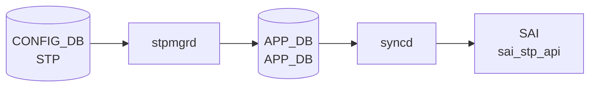

# STP / STP_VLAN / STP_PORT テーブル — 暗黙デフォルト詳細

!!! info "ページの位置付け"
    このページは `STP`・`STP_VLAN`・`STP_PORT`・`STP_VLAN_PORT` テーブルの **コード由来デフォルト値・ハードコード挙動・モード別差異** を詳述する Phase A 分析ページ。
    SONiC は PVST (Per-VLAN Spanning Tree) と MSTP (Multiple Spanning Tree Protocol) の 2 モードをサポートする。

## 概要

STP 設定は `stpmgrd` ([sonic-swss](../../reference/glossary.md#term-sonic-swss)/cfgmgr/stpmgrd.cpp) が [CONFIG_DB](../../reference/glossary.md#term-config_db) を購読し、Unix Domain Socket (`/var/run/stpipc.sock`) 経由で STP デーモンに IPC メッセージを送信する。
CLI の `config spanning-tree` コマンド ([sonic-utilities](../../reference/glossary.md#term-sonic-utilities)/config/stp.py) が [CONFIG_DB](../../reference/glossary.md#term-config_db) に書き込みを行う。

テーブル構成:

| テーブル | キー形式 | 役割 |
|---|---|---|
| `STP` | `GLOBAL` | グローバル STP 設定 (mode, タイマー, rootguard_timeout) |
| `STP_VLAN` | `Vlan<vid>` | [VLAN](../../reference/glossary.md#term-vlan) ごとの STP 設定 (タイマー, priority) |
| `STP_PORT` | `<intf_name>` | インタフェースごとの STP 設定 (guard, portfast 等) |
| `STP_VLAN_PORT` | `Vlan<vid>\|<intf>` | per-[VLAN](../../reference/glossary.md#term-vlan) per-port の path_cost / priority |

<!-- defaults -->
<!-- cdb-mermaid -->
### データフロー (自動生成)



!!! note "凡例"
    CONFIG_DB から SAI までの典型経路を `docs/reference/config-db-orch-map.md` から機械生成したミニ図。詳細・例外は本ページ本文と対応表を参照。
<!-- /cdb-mermaid -->

## 暗黙デフォルトとハードコード挙動

<!-- evidence: meta/_intermediate/cdb-flow/stp-defaults.md -->

### 1. STP|GLOBAL — PVST 有効化時の書き込みデフォルト

`config spanning-tree enable pvst` 実行時に `config/stp.py:520-528` で以下が一括書き込まれる:

```python
fvs = {
    'mode': 'pvst',
    'rootguard_timeout': 30,   # STP_DEFAULT_ROOT_GUARD_TIMEOUT
    'forward_delay': 15,       # STP_DEFAULT_FORWARD_DELAY
    'hello_time': 2,           # STP_DEFAULT_HELLO_INTERVAL
    'max_age': 20,             # STP_DEFAULT_MAX_AGE
    'priority': 32768          # STP_DEFAULT_BRIDGE_PRIORITY
}
```

| フィールド | デフォルト値 | 有効範囲 | 備考 |
|---|---|---|---|
| `mode` | `"pvst"` | `pvst` / `mst` | PVST か MSTP を選択 |
| `rootguard_timeout` | `30` (秒) | 5–600 | PVST のみ有効 |
| `forward_delay` | `15` (秒) | 4–30 | |
| `hello_time` | `2` (秒) | 1–10 | |
| `max_age` | `20` (秒) | 6–40 | |
| `priority` | `32768` | 0–61440 (4096 の倍数) | ブリッジプライオリティ |

証跡: `config/stp.py:116-134, 520-528`

---

### 2. STP|GLOBAL — MST 有効化時は `mode` のみ書き込み

`config spanning-tree enable mst` 実行時 (`config/stp.py:533-539`) は `mode: "mst"` のみ書き込まれる。
タイマー類 (`forward_delay`, `hello_time`, `max_age`, `max_hops`) は `STP_MST|GLOBAL` テーブルに保存される。

!!! note "PVST と MST でテーブルが異なる"
    グローバルタイマーの格納先が PVST は `STP|GLOBAL`、MST は `STP_MST|GLOBAL` と分かれている。

証跡: `config/stp.py:533-539`

---

### 3. STP_VLAN — PVST 有効化時に全 VLAN へ自動適用

PVST 有効化時に `enable_stp_for_vlans()` (`config/stp.py:251-266`) が全 [VLAN](../../reference/glossary.md#term-vlan) に対して実行される。
各 VLAN エントリのデフォルト値は `STP|GLOBAL` の値を継承する:

```python
fvs = {
    'enabled': 'true',
    'forward_delay': <STP|GLOBAL の値>,
    'hello_time': <STP|GLOBAL の値>,
    'max_age': <STP|GLOBAL の値>,
    'priority': <STP|GLOBAL の値>
}
```

| フィールド | デフォルト値 | 有効範囲 | 備考 |
|---|---|---|---|
| `enabled` | `"true"` | `true` / `false` | VLAN STP 有効化フラグ |
| `forward_delay` | `15` | 4–30 | グローバルから継承 |
| `hello_time` | `2` | 1–10 | グローバルから継承 |
| `max_age` | `20` | 6–40 | グローバルから継承 |
| `priority` | `32768` | 0–61440 (4096 の倍数) | VLAN ブリッジプライオリティ |

**最大 VLAN 数**: `PVST_MAX_INSTANCES = 255` (config/stp.py:136)。255 VLAN を超えると `logging.warning` のみで警告なく追加が打ち切られる (silent truncation)。

証跡: `config/stp.py:136, 251-266, 278-289`

---

### 4. STP_VLAN — グローバルパラメータ変更時の同期ルール

`update_stp_vlan_parameter()` (`config/stp.py:228-242`) によりグローバル値を変更すると、**各 VLAN のフィールドがグローバルの旧値と一致する場合のみ** 新値に更新される:

```python
if current_global_value == current_vlan_value:
    db.mod_entry('STP_VLAN', vlan, {param_type: new_value})
```

個別に変更された VLAN は同期されない (意図的な設計)。

証跡: `config/stp.py:228-242`

---

### 5. STP_PORT — PVST 時のデフォルト

`enable_stp_for_interfaces()` (`config/stp.py:361-379`) で L2 インタフェース (VLAN メンバ) に対して書き込まれる:

```python
fvs = {
    'enabled': 'true',
    'root_guard': 'false',
    'bpdu_guard': 'false',
    'bpdu_guard_do_disable': 'false',
    'portfast': 'false',
    'uplink_fast': 'false'
}
```

| フィールド | デフォルト | モード | 備考 |
|---|---|---|---|
| `enabled` | `"true"` | PVST / MST | |
| `root_guard` | `"false"` | PVST / MST | |
| `bpdu_guard` | `"false"` | PVST / MST | |
| `bpdu_guard_do_disable` | `"false"` | PVST のみ | MST では `bpdu_guard_do` |
| `portfast` | `"false"` | PVST のみ | MST 時は設定不可 (fail) |
| `uplink_fast` | `"false"` | PVST のみ | MST 時は設定不可 (fail) |
| `path_cost` | **未設定** | PVST | 明示設定が必要 (range: 1-200000000) |
| `priority` | **未設定** | PVST | 明示設定が必要 (range: 0-240) |

証跡: `config/stp.py:292-301, 361-379`

---

### 6. STP_PORT — MST 時のデフォルト

`enable_mst_for_interfaces()` (`config/stp.py:441-470`) で書き込まれる:

```python
fvs_port = {
    'edge_port': 'false',
    'link_type': 'auto',
    'enabled': 'true',
    'bpdu_guard': 'false',
    'bpdu_guard_do': 'false',     # ← PVST の bpdu_guard_do_disable とは別フィールド
    'root_guard': 'false',
    'path_cost': 1,               # MST_DEFAULT_PORT_PATH_COST
    'priority': 128               # MST_DEFAULT_PORT_PRIORITY
}
```

| フィールド | デフォルト | 備考 |
|---|---|---|
| `edge_port` | `"false"` | MST のみ; PVST 時は設定不可 |
| `link_type` | `"auto"` | MST のみ; `auto` / `p2p` / `shared` |
| `bpdu_guard_do` | `"false"` | MST フィールド名 (PVST は `bpdu_guard_do_disable`) |
| `path_cost` | `1` | MST 有効化時のみ初期値設定 (range: 1-200000000) |
| `priority` | `128` | MST 有効化時のみ初期値設定 (range: 0-240) |

証跡: `config/stp.py:441-470`

---

### 7. STP_VLAN_PORT — per-VLAN per-port 設定

`STP_VLAN_PORT` テーブルはデフォルト値では **初期書き込みされない**。
CLI コマンドで明示設定した場合のみエントリが作成される:

| フィールド | 有効範囲 | 設定コマンド |
|---|---|---|
| `path_cost` | 1–200000000 | `config spanning-tree vlan interface cost <vid> <intf> <cost>` |
| `priority` | 0–240 | `config spanning-tree vlan interface priority <vid> <intf> <prio>` |

`doStpVlanPortTask()` (`stpmgr.cpp:408-442`) では `priority` のデフォルトが `-1` (未設定を示す sentinel) として IPC メッセージに設定される。

証跡: `config/stp.py:1285-1321`, `stpmgr.cpp:408-442`

---

### 8. bpdu_guard_do_disable vs bpdu_guard_do — フィールド名 discrepancy

PVST と MST でフィールド名が異なる:

| モード | フィールド名 |
|---|---|
| PVST | `bpdu_guard_do_disable` |
| MST | `bpdu_guard_do` |

同一の物理的機能 (BPDU guard 発動時にポートを shutdown するか否か) にもかかわらず、フィールド名が統一されていない。
`stpmgr.cpp:processStpPortAttr()` では `bpdu_guard_do_disable` のみ処理しており、MST の `bpdu_guard_do` は現在の実装では **処理されない可能性がある** ([YANG](../../reference/glossary.md#term-yang)-実装 discrepancy)。

証跡: `config/stp.py:294-298, 441-451`, `stpmgr.cpp:586-590`

---

### 9. タイマー整合性制約: 2*(fd-1) >= max_age >= 2*(ht+1)

STP タイマーは `validate_params()` (`config/stp.py:183-187`) により以下の不等式を強制する:

```
2 * (forward_delay - 1) >= max_age >= 2 * (hello_time + 1)
```

デフォルト値での検証: `2*(15-1)=28 >= 20 >= 2*(2+1)=6` → 満足

この制約は `STP|GLOBAL` と `STP_VLAN` の両方で個別にチェックされる。
stpmgrd 側での検証はなく、[CONFIG_DB](../../reference/glossary.md#term-config_db) に不正値が書き込まれた場合の動作は未定義。

証跡: `config/stp.py:183-207`

---

### 10. stpmgrd 起動順序ガード — silent defer

`doStpVlanTask()` (`stpmgr.cpp:182-184`) は `stpGlobalTask == false` (グローバル設定未受信) または STP_PORT タスク未完の場合に `return` する (silent defer)。

同様に `doStpVlanPortTask()` は `stpGlobalTask`, `stpVlanTask`, `stpPortTask` すべてが `true` になるまで処理を保留する。

**起動時の書き込み順序がずれると設定が遅延適用される** (エラーなし、syslog なし)。

証跡: `stpmgr.cpp:81-86, 182-184, 448-450`

---

### 11. PVST 最大インスタンス制限 — silent truncation

`PVST_MAX_INSTANCES = 255` (`config/stp.py:136`) を超えた VLAN への STP 適用は `logging.warning` のみで停止する。
stpmgrd 側の `STP_DEFAULT_MAX_INSTANCES = 255` (`stpmgr.h:38`) と整合している。

255 を超えるカウントは `get_stp_enabled_vlan_count()` で判定されるが、`get_max_stp_instances()` から返る値は常に固定値 255 である。
実行時の最大インスタンス数は State DB から取得可能 (`getStpMaxInstances()`)。

証跡: `config/stp.py:136, 260-265`, `stpmgr.h:38`

<!-- /defaults -->

## 発見された discrepancy / 暗黙デフォルト サマリー

| # | 種別 | 対象 | 内容 |
|---|---|---|---|
| 1 | コードデフォルト | `STP\|GLOBAL` `rootguard_timeout` | PVST 有効化時に `30` を書き込み |
| 2 | コードデフォルト | `STP\|GLOBAL` `forward_delay` | PVST 有効化時に `15` を書き込み |
| 3 | コードデフォルト | `STP\|GLOBAL` `hello_time` | PVST 有効化時に `2` を書き込み |
| 4 | コードデフォルト | `STP\|GLOBAL` `max_age` | PVST 有効化時に `20` を書き込み |
| 5 | コードデフォルト | `STP\|GLOBAL` `priority` | PVST 有効化時に `32768` を書き込み |
| 6 | 継承動作 | `STP_VLAN` 全フィールド | PVST 有効化時に `STP\|GLOBAL` から値を継承 |
| 7 | silent truncation | `STP_VLAN` 最大数 | 255 VLAN 超過時に警告のみで打ち切り |
| 8 | 未設定フィールド | `STP_PORT` `path_cost` (PVST) | PVST 初期化時に書き込みなし、明示設定が必要 |
| 9 | 未設定フィールド | `STP_PORT` `priority` (PVST) | PVST 初期化時に書き込みなし、明示設定が必要 |
| 10 | コードデフォルト | `STP_PORT` `path_cost` (MST) | MST 有効化時に `1` を書き込み |
| 11 | コードデフォルト | `STP_PORT` `priority` (MST) | MST 有効化時に `128` を書き込み |
| 12 | 実装 discrepancy | `bpdu_guard_do_disable` vs `bpdu_guard_do` | PVST/MST でフィールド名が異なり stpmgrd 処理が非対称 |
| 13 | 未初期化テーブル | `STP_VLAN_PORT` | 明示 CLI 設定前はエントリなし |
| 14 | silent defer | stpmgrd 起動順序 | グローバル/VLAN/PORT タスク順序に依存した暗黙処理遅延 |
| 15 | MST モード差異 | `STP\|GLOBAL` タイマー | MST では STP|GLOBAL にタイマー不在 (`STP_MST\|GLOBAL` を使用) |

## 引用元

[^1]: STP CLI 実装: `config/stp.py`. <https://github.com/sonic-net/sonic-utilities/blob/39732bceb8bdefe706518ab40623bbbba6ff33b9/config/stp.py>
[^2]: STP Manager 実装: `stpmgr.cpp`. <https://github.com/sonic-net/sonic-swss/blob/4305596156d70e9797e8a881b3d19b46de0bce0d/cfgmgr/stpmgr.cpp>
[^3]: STP Manager ヘッダ: `stpmgr.h`. <https://github.com/sonic-net/sonic-swss/blob/4305596156d70e9797e8a881b3d19b46de0bce0d/cfgmgr/stpmgr.h>

<!-- ordering -->
## 処理順序・依存関係・warm-reboot 挙動

<!-- evidence: meta/_intermediate/cdb-flow/stp-ordering.md -->

### 1. 起動前提条件 — PORT_INIT_DONE 待機

`stpmgrd` は起動直後に `isPortInitDone()` (`stpmgr.cpp:1257-1273`) を呼び出し、
[APPL_DB](../../reference/glossary.md#term-appl_db) の `APP_PORT_TABLE` に `PortInitDone` キーが出現するまで **1 秒ポーリングでブロッキング待機** する。
`portsyncd` / `orchagent` が PORT テーブルを初期化しない限り、stpmgrd は STP 処理を開始できない。

```
APPL_DB:APP_PORT_TABLE|PortInitDone が存在する → 処理開始
```

証跡: `stpmgr.cpp:1257-1273`, `stpmgrd.cpp:72`

---

### 2. CONFIG_DB 購読テーブルと処理依存グラフ

`stpmgrd.cpp:43-64` が以下の TableConnector を生成し、`doTask()` でディスパッチする:

- `STP|GLOBAL` (`CFG_STP_GLOBAL_TABLE_NAME`)
- `STP_VLAN` (`CFG_STP_VLAN_TABLE_NAME`)
- `STP_VLAN_PORT` (`CFG_STP_VLAN_PORT_TABLE_NAME`)
- `STP_PORT` (`CFG_STP_PORT_TABLE_NAME`)
- `STP_MST` / `STP_MST_INST` / `STP_MST_PORT`
- `PORTCHANNEL_MEMBER` ([LAG](../../reference/glossary.md#term-lag) メンバー更新)
- `STATE_VLAN_MEMBER` (State DB)

各タスク関数には **bool フラグによるガード** が実装されており、
前提タスクのフラグが立つ前の消費は `return` (silent defer) となる:

| タスク関数 | guard 条件 (stpmgr.cpp) |
|---|---|
| `doStpGlobalTask()` | なし (最初の受信でフラグ立て) |
| `doStpPortTask()` | `stpGlobalTask == true` |
| `doStpMstGlobalTask()` | `stpGlobalTask == true` |
| `doStpVlanTask()` | `stpGlobalTask && (stpPortTask || isStpPortEmpty())` |
| `doStpMstInstTask()` | `stpGlobalTask && (stpPortTask || isStpPortEmpty())` |
| `doStpMstInstPortTask()` | `stpGlobalTask && stpMstInstTask && stpPortTask` |
| `doStpVlanPortTask()` | `stpGlobalTask && stpVlanTask && stpPortTask` |

#### PVST 推奨書き込み順序

```
1. STP|GLOBAL       ← stpGlobalTask フラグを立てる
2. STP_PORT         ← stpPortTask フラグを立てる
3. STP_VLAN         ← STATE_VLAN 存在確認後に処理
4. STP_VLAN_PORT    ← 全フラグが揃った後
```

#### MST 推奨書き込み順序

```
1. STP|GLOBAL       ← stpGlobalTask フラグを立てる
2. STP_PORT         ← stpPortTask フラグを立てる
3. STP_MST          ← stpGlobalTask 依存のみ
4. STP_MST_INST     ← stpMstInstTask フラグを立てる
5. STP_MST_PORT     ← 全フラグが揃った後
```

証跡: `stpmgr.cpp:51-86, 179-188, 340-346, 444-450, 630-638, 1023-1031, 1155-1160`

---

### 3. VLAN 依存 — STATE_VLAN 存在確認

`doStpVlanTask()` は SET 操作ごとに `isVlanStateOk(key)` (`stpmgr.cpp:1276-1290`) を呼び出す。
`STATE_VLAN_TABLE` に対象 VLAN のエントリが存在しない場合、その SET を **スキップ (`it++`) して次ループへ持ち越す**。

!!! warning "VLAN が State DB に登録される前に STP_VLAN を書き込むと設定が適用されない"
    `vlanmgrd` が STATE_VLAN を書き込む前に `config spanning-tree enable pvst` を実行した場合、
    `doStpVlanTask()` が無限に defer し、エラーログも出力されない (silent skip)。

証跡: `stpmgr.cpp:210, 1276-1290`

---

### 4. LAG (PortChannel) 依存

`doStpPortTask()` はキーが `PortChannel` を含む場合に `isLagEmpty(key)` を確認する。
[LAG](../../reference/glossary.md#term-lag) にメンバーが存在しない場合、SET をスキップする (`stpmgr.cpp:648-653`)。
この場合の再試行は `doLagMemUpdateTask()` による `m_lagMap` 更新後、次回 SELECT ループに依存する。

証跡: `stpmgr.cpp:648-653, doLagMemUpdateTask()`

---

### 5. warm-reboot 挙動

`stpmgrd.cpp:39-40` で `WarmStart::initialize("stpmgrd", "stpd")` と `WarmStart::checkWarmStart()` を呼び出すが、
`stpmgr.cpp` 内に **reconciliation ロジックや `setWarmStartState()` 呼び出しは実装されていない**。

warm reboot 時も cold reboot と同一フロー（PORT_INIT_DONE 待機 → CONFIG_DB 全件再処理）で動作する。
STP トポロジ情報の保持・復旧は `stpd`（STP デーモン）側に委ねられている設計であり、
stpmgrd 自身の warm-reboot reconcile フェーズは **事実上スタブ** となっている。

!!! note "warm reboot 時のトポロジ収束"
    stpmgrd が warm reboot 宣言のみで reconcile を実装していないため、
    warm reboot 後の BPDU 送受信再開タイミングは stpd の実装に依存する。
    CONFIG_DB → stpmgrd → stpd IPC が完了するまでの間、
    STP ポート状態は stpd の内部状態に基づき継続される。

証跡: `stpmgrd.cpp:39-40`, `stpmgr.cpp`（setWarmStartState 呼び出しなし）

<!-- /ordering -->

<!-- cross-refs -->
## 暗黙参照テーブル (Phase C)

`stpmgrd` が CONFIG_DB の STP テーブル群を購読・処理する際に参照する外部テーブルを示す。
これらは CONFIG_DB への書き込み有無に関わらず、**ガード条件・フィールド値解決・処理可否判定**に影響する。

<!-- evidence: meta/_intermediate/cdb-flow/stp-cross-refs.md -->

| 参照先テーブル / リソース | DB | 参照方向 | 条件 | 参照元 evidence |
|---|---|---|---|---|
| `APP_PORT_TABLE\|PortInitDone` | [APPL_DB](../../reference/glossary.md#term-appl_db) | 起動ガード（存在確認） | 常時。stpmgrd 起動直後に 1 秒ポーリング。`portsyncd`/`orchagent` が書き込むまで全 STP 処理が停止 | `stpmgr.cpp:1257-1273`, `stpmgrd.cpp:72` |
| `STATE_VLAN_TABLE\|<vlan>` | [STATE_DB](../../reference/glossary.md#term-state_db) | 存在確認 → SET/スキップ判定 | `STP_VLAN` の各 SET 前に `isVlanStateOk()` で参照。エントリなしなら silent skip | `stpmgr.cpp:210, 1276-1290` |
| `STATE_LAG_TABLE\|<lag>` | [STATE_DB](../../reference/glossary.md#term-state_db) | 存在確認 → SET/スキップ判定 | `STP_PORT` / `STP_VLAN_PORT` でキーが [PortChannel](../../reference/glossary.md#term-portchannel) の場合に `isLagStateOk()` で参照 | `stpmgr.cpp:1291-1305` |
| `STATE_STP_TABLE\|<key>` | [STATE_DB](../../reference/glossary.md#term-state_db) | 既存エントリ確認 | `doStpVlanPortTask()` 内でポート STP 状態確認 | `stpmgr.cpp:1391` |
| `VLAN_MEMBER\|<vlan>\|<port>` | CONFIG_DB | VLAN メンバーシップ解決 | `doStpVlanPortTask()` での VLAN メンバー確認。未所属ポートは設定遅延 | `stpmgr.cpp:1366` |
| `LAG_MEMBER\|<lag>\|<port>` | CONFIG_DB | [LAG](../../reference/glossary.md#term-lag) メンバー数管理 | `doLagMemUpdateTask()` が `m_lagMap` を更新。メンバーなし LAG は STP_PORT SET がスキップ | `stpmgr.cpp:648-653, doLagMemUpdateTask()` |
| `STP_MST` / `STP_MST_INST` / `STP_MST_PORT` | CONFIG_DB | MST モード時の主購読 | `mode = "mst"` 時のみ使用。PVST 時はこれらのテーブルが処理されない | `stpmgrd.cpp:47-54`, `stpmgr.cpp:1023-1031, 1155-1160` |

!!! note "STATE_DB 参照は silent skip のトリガ"
    `isVlanStateOk()` / `isLagStateOk()` が `false` を返した場合、stpmgrd はエラーログを出力せずイベントをキューに残す。
    `vlanmgrd` や `teamd` が STATE_DB にエントリを書き込んだ後、次回 SELECT ループで再処理される。

!!! note "CONFIG_DB と STATE_DB の両方に依存"
    STP は CONFIG_DB の書き込み内容だけで動作が決まらず、STATE_DB（`STATE_VLAN_TABLE` / `STATE_LAG_TABLE`）の状態が揃うまで適用が遅延する。
    この依存は YANG モデルには記述されていない暗黙の前提条件である。

<!-- /cross-refs -->

<!-- failure -->
## 失敗挙動 (Phase D)

`stpmgrd` は CONFIG_DB を購読して stpd デーモンへ UDS (Unix Domain Socket) 経由で IPC メッセージを送信する設計であり、失敗は (A) IPC ソケット初期化失敗、(B) IPC 送信失敗 (silent discard)、(C) PVST インスタンス枯渇、(D) メモリ割り当て失敗、(E) ebtables / 不正フィールド、(F) 前提条件未達による defer の 6 系統に整理される。

<!-- evidence: meta/_intermediate/cdb-flow/stp-failure.md -->

### A. IPC ソケット初期化失敗 (`ipcInitStpd`)

`ipcInitStpd()` (`stpmgr.cpp:859-884`) は起動時に UDS ソケットを作成・bind する。

| 失敗条件 | 結果 | 回復経路 |
|---|---|---|
| `socket()` 失敗 | `SWSS_LOG_ERROR` + `return`。`stpd_fd` が 0 のまま残り、以降の全 `sendMsgStpd()` は `sendto(0, ...)` となる | stpmgrd プロセス再起動のみ |
| `bind()` 失敗 | `SWSS_LOG_ERROR` + `close(stpd_fd)` + `return`。ソケットはクローズされるが fd は更新されないため全 IPC 無効 | stpmgrd プロセス再起動のみ |

どちらの場合も **stpmgrd プロセス自体は継続**するが、CONFIG_DB の変更内容は stpd に一切届かない。systemd がプロセスを再起動するまで STP 設定が適用されない状態となる。

---

### B. IPC 送信失敗 (`sendMsgStpd`) — silent discard

`sendMsgStpd()` (`stpmgr.cpp:1218-1255`) の失敗分岐:

| 失敗条件 | 結果 |
|---|---|
| `calloc` 失敗 | `SWSS_LOG_ERROR("tx_msg mem alloc error")` + `return -1` |
| `sendto` 失敗 | `SWSS_LOG_ERROR("tx_msg send error")` + `rc == -1` を返す |

**全呼出し元 (`doStpGlobalTask`, `doStpVlanTask`, `doStpPortTask`, `doStpVlanPortTask`, `doVlanMemUpdateTask`, `doLagMemUpdateTask`) は `sendMsgStpd` の戻り値を検査しない**。
IPC 送信失敗後もエントリは `consumer.m_toSync.erase(it)` で消費され、**リトライなし・silent discard** となる。

!!! warning "IPC 失敗は CONFIG_DB 書込み成功後に発生する"
    `config spanning-tree` CLI は CONFIG_DB 書込みで正常終了するが、stpmgrd → stpd の IPC 送信が失敗した場合はエラーがユーザーに通知されない。BPDU 挙動や STP ポート状態が CONFIG_DB と乖離したまま syslog にのみ ERROR が記録される。

---

### C. PVST インスタンス枯渇 (`allocL2Instance` 失敗)

`doStpVlanTask()` 内 (`stpmgr.cpp:263-269`) で PVST 新規 VLAN への STP 適用時に `allocL2Instance(vlan_id)` が `-1` を返した場合:

- `SWSS_LOG_ERROR("Couldnt allocate instance to VLAN %d", vlan_id)`
- `it = consumer.m_toSync.erase(it)` + `continue` → **恒久スキップ**

`PVST_MAX_INSTANCES = 255` を超えると新規 VLAN には STP インスタンスが割り当てられず、設定は永続的に無視される。回復はSTP 無効化 → 再有効化によるインスタンス解放が必要。

---

### D. メモリ割り当て失敗 (`calloc`)

`STP_VLAN_CONFIG_MSG` の `calloc` 失敗 (`stpmgr.cpp:278-283, 319-324`):

- `SWSS_LOG_ERROR("mem failed for vlan %d", vlan_id)` + `return`
- タスク関数全体が中断され、未処理キューエントリは次回 SELECT ループに残る

`processStpPortAttr()` 内の `calloc` 失敗 (`stpmgr.cpp:534-538`):

- `SWSS_LOG_ERROR("calloc failed for interface %s", intfName.c_str())` + `return`
- 呼出し元 `doStpPortTask` は戻り値を確認せず `erase(it)` するため **silent discard** になる点に注意

---

### E. ebtables 失敗 / 不正フィールド

`doStpGlobalTask()` 内:

| 失敗条件 | 結果 |
|---|---|
| PVST 有効化時 `ebtables -A` 失敗 | `SWSS_LOG_ERROR("ebtables add failed for PVST %d", ret)` のみ。IPC は送信される (stpmgr.cpp:116-119) |
| STP|GLOBAL DEL 時 `ebtables -D` 失敗 | 同上 (stpmgr.cpp:164-165) |
| `mode` フィールドが `pvst`/`mst` 以外 | `SWSS_LOG_ERROR("Error: Invalid mode %s")` のみ。`msg.stp_mode = 0` のまま IPC 送信 (stpmgr.cpp:136) |

---

### F. 前提条件未達による defer / discard

各タスク関数の defer / discard 挙動の整理:

| 条件 | 操作 | 処理 | エラーログ |
|---|---|---|---|
| `l2ProtoEnabled == L2_NONE` + STP_VLAN SET | `it++` (defer) | 次回ループで再試行 | なし |
| `!isVlanStateOk()` (STATE_VLAN 未登録) + STP_VLAN SET | `it++` (defer) | 次回ループで再試行 | なし |
| `l2ProtoEnabled == L2_NONE` + STP_VLAN DEL | `erase(it)` (discard) | 回復なし | なし |
| `isLagEmpty(key)` (LAG にメンバーなし) + STP_PORT | `erase(it)` (discard) | `doLagMemUpdateTask` 経由で再実行 | なし |
| `l2ProtoEnabled == L2_NONE` + STP_PORT SET | `it++` (defer) | 次回ループで再試行 | なし |
| `l2ProtoEnabled == L2_NONE` + STP_PORT DEL | `erase(it)` (discard) | 回復なし | なし |
| 前提フラグ未達 + STP_VLAN_PORT | `return` (タスク全体 defer) | フラグが揃った後に再処理 | なし |
| `m_vlanInstMap[vlan_id] == INVALID_INSTANCE` + STP_VLAN_PORT SET | `it++` (defer) | 次回ループで再試行 | なし |
| `isLagEmpty(intfName)` + STP_VLAN_PORT | `erase(it)` (discard) | `doLagMemUpdateTask` 経由で再実行 | なし |
| 不正キー形式 | `erase(it)` (discard) | 回復なし | ERROR |

!!! note "defer と discard の非対称性"
    SET 操作の多くは `it++` による defer（次回 SELECT で再試行）だが、DEL 操作の多くは `erase(it)` による silent discard となる。STP 無効化・削除操作は前提条件が揃っていない場合に黙って捨てられる設計であり、実際に stpd 側に削除が届かない可能性がある。

> **証跡**: `stpmgr.cpp:116-119, 136, 164-165, 210-214, 246-250, 263-283, 319-324, 448-449, 477-479, 486-498, 502-507, 534-539, 634-635, 648-670, 784-795, 824, 859-884, 1218-1255`。詳細 grep 証跡は `meta/_intermediate/cdb-flow/stp-failure.md` を参照。

<!-- /failure -->

<!-- constants -->
## ハードコード定数 (Phase E)

`stpmgrd` / `config/stp.py` が設定・運用で使う固定値の一覧。CONFIG_DB・DEVICE_METADATA 等の外部入力では変更不能。

<!-- evidence: meta/_intermediate/cdb-flow/stp-constants.md -->

### 1. PVST タイマーデフォルト定数（`config/stp.py`）

| 定数名 | 値 | DB フィールド | 出典 |
|---|---|---|---|
| `STP_DEFAULT_ROOT_GUARD_TIMEOUT` | `30` (秒) | `STP\|GLOBAL.rootguard_timeout` | `stp.py:118` |
| `STP_DEFAULT_FORWARD_DELAY` | `15` (秒) | `STP\|GLOBAL.forward_delay` | `stp.py:122` |
| `STP_DEFAULT_HELLO_INTERVAL` | `2` (秒) | `STP\|GLOBAL.hello_time` | `stp.py:126` |
| `STP_DEFAULT_MAX_AGE` | `20` (秒) | `STP\|GLOBAL.max_age` | `stp.py:130` |
| `STP_DEFAULT_BRIDGE_PRIORITY` | `32768` | `STP\|GLOBAL.priority` | `stp.py:134` |
| `PVST_MAX_INSTANCES` | `255` | PVST VLAN 数上限（silent truncation） | `stp.py:136` |

PVST 有効化コマンド (`config spanning-tree enable pvst`) 実行時に `config/stp.py:520-528` でこれら定数がそのまま CONFIG_DB へ書き込まれる。

---

### 2. MST タイマーデフォルト定数（`config/stp.py`）

| 定数名 | 値 | 役割 | 出典 |
|---|---|---|---|
| `MST_DEFAULT_HOPS` | `20` | `STP_MST\|GLOBAL.max_hops` | `stp.py:72` |
| `MST_DEFAULT_HELLO_TIME` | `2` (秒) | `STP_MST\|GLOBAL.hello_time` | `stp.py:76` |
| `MST_DEFAULT_MAX_AGE` | `20` (秒) | `STP_MST\|GLOBAL.max_age` | `stp.py:80` |
| `MST_DEFAULT_REVISION` | `0` | `STP_MST\|GLOBAL.revision` | `stp.py:84` |
| `MST_DEFAULT_BRIDGE_PRIORITY` | `32768` | `STP_MST\|GLOBAL.bridge_priority` | `stp.py:88` |
| `MST_DEFAULT_PORT_PRIORITY` | `128` | `STP_PORT.<intf>.priority` (MST 有効化時) | `stp.py:92` |
| `MST_DEFAULT_FORWARD_DELAY` | `15` (秒) | `STP_MST\|GLOBAL.forward_delay` | `stp.py:96` |
| `MST_DEFAULT_ROOT_GUARD_TIMEOUT` | `30` (秒) | `STP_MST\|GLOBAL.rootguard_timeout` | `stp.py:100` |
| `MST_DEFAULT_INSTANCE` | `0` | デフォルト MST インスタンス番号 | `stp.py:104` |
| `MST_DEFAULT_PORT_PATH_COST` | `1` | `STP_PORT.<intf>.path_cost` (MST 有効化時) | `stp.py:108` |

PVST と MST で `forward_delay` / `max_age` / `hello_time` のデフォルト値は同一だが、格納テーブルが異なる (`STP|GLOBAL` vs `STP_MST|GLOBAL`)。

---

### 3. `stpmgr.h` — デーモン内部固定値

| 定数 | 値 | 役割 |
|---|---|---|
| `STPMGRD_SOCK_NAME` | `"/var/run/stpmgrd.sock"` | stpmgrd が bind する Unix ドメインソケット |
| `STPD_SOCK_NAME` | `"/var/run/stpipc.sock"` | stpd (STP デーモン) IPC ソケット |
| `MAX_VLANS` | `4096` | `m_vlanInstMap[]` 配列サイズ（VLAN ID 最大数） |
| `L2_INSTANCE_MAX` | `4096` (`= MAX_VLANS`) | `l2InstPool` bitset サイズ（インスタンスプール論理上限） |
| `STP_DEFAULT_MAX_INSTANCES` | `255` | STATE_DB 未取得時の PVST インスタンス数フォールバック |
| `INVALID_INSTANCE` | `-1` | `m_vlanInstMap[]` 未割当マーカー（sentinel） |
| `TAGGED_MODE` | `1` | VLAN メンバのタグ付きモード値 |
| `UNTAGGED_MODE` | `0` | VLAN メンバのアンタグモード値 |
| `INVALID_MODE` | `-1` | タグモード取得失敗時のセンチネル |
| `STP_SET_COMMAND` | `1` | stpd IPC メッセージの SET opcode |
| `STP_DEL_COMMAND` | `0` | stpd IPC メッセージの DEL opcode |

証跡: `stpmgr.h:28, 34, 37-39, 49, 107-108`

---

### 4. `stpmgrd.cpp` — Select ループタイムアウト

```c
// stpmgrd.cpp:17
#define SELECT_TIMEOUT 1000  // ms
```

`swsslib::Select::select()` に渡すタイムアウト値。未処理イベントのリトライ間隔でもある。

---

### 5. `getStpMaxInstances()` — STATE_DB ポーリング上限

```cpp
// stpmgr.cpp:1384
uint16_t max_delay = 60;  // 最大 60 回 × sleep(1) = 60 秒
```

起動時に `STATE_STP_TABLE|GLOBAL` の `max_stp_inst` フィールドを最大 60 秒ポーリングする。
タイムアウト時または値が `0` の場合は `STP_DEFAULT_MAX_INSTANCES = 255` を使用。
`STATE_STP_TABLE_NAME` は `schema.h:445` で `"STP_TABLE"` に固定されている。

---

### 6. PVST BPDU マルチキャスト MAC — ebtables DROP ルール

PVST 有効化時に stpmgrd は以下の ebtables ルールをハードコードで挿入する:

```
ebtables -A FORWARD -d 01:00:0c:cc:cc:cd -j DROP
```

`01:00:0c:cc:cc:cd` は Cisco PVST+ BPDU マルチキャストアドレス。このアドレスは定数化されておらず、`stpmgr.cpp:113` にリテラルで埋め込まれている。設定変更不可。

証跡: `stpmgr.cpp:47, 113, 161`

<!-- /constants -->

<!-- side-effects -->
## 副次 DB 書込・システム副作用 (Phase F)

<!-- evidence: meta/_intermediate/cdb-flow/stp-side-effects.md -->
<!-- source: sonic-swss/cfgmgr/stpmgr.cpp, sonic-swss/orchagent/stporch.cpp -->

STP CONFIG_DB テーブルへの書き込みは、DB への副次書き込みよりも **Unix ドメインソケット IPC** と **カーネル ebtables** を主な副作用経路として使用する。

### 1. `stpd` への IPC メッセージ (`stpmgr.cpp`)

`StpMgr` は CONFIG_DB 変更を検知すると `sendMsgStpd()` 経由で `stpd` プロセスに Unix ドメインソケット (`/var/run/stpipc.sock`) 宛て `STP_IPC_MSG` を送信する。

| CONFIG_DB テーブル | 送信メッセージ型 | evidence |
|---|---|---|
| `STP\|GLOBAL` (SET, PVST) | `STP_BRIDGE_CONFIG` | `stpmgr.cpp:171` |
| `STP\|GLOBAL` (SET, MST モード) | `STP_MST_GLOBAL_CONFIG` | `stpmgr.cpp:402` |
| `STP_VLAN` (SET) | `STP_VLAN_CONFIG` | `stpmgr.cpp:332` |
| `STP_VLAN_PORT` (SET) | `STP_VLAN_PORT_CONFIG` | `stpmgr.cpp:441` |
| `STP_PORT` (SET) | `STP_PORT_CONFIG` | `stpmgr.cpp:624` |
| `STP_MST_INST` (SET) | `STP_MST_INST_CONFIG` | `stpmgr.cpp:1108` |
| `STP_MST_PORT` (SET) | `STP_MST_INST_PORT_CONFIG` | `stpmgr.cpp:1152` |

これらは DB への書き込みではなく `stpd` への通知。`stpd` が BPDU 送受信と STP ステートマシンを管理し、port state 変更結果を APP_DB (`APP_STP_PORT_STATE_TABLE` 等) に書き戻す。

### 2. `ebtables` ルール追加・削除 (`stpmgr.cpp:47, 113, 161`)

PVST モード切替時に `stpmgr` が `ebtables` をシステムコールで直接操作する。

| CONFIG_DB 変化 | 副作用 |
|---|---|
| `STP\|GLOBAL.mode = "pvst"` 設定時 | `ebtables -A FORWARD -d 01:00:0c:cc:cc:cd -j DROP` |
| `STP\|GLOBAL` DEL または STP 無効化時 | `ebtables -D FORWARD -d 01:00:0c:cc:cc:cd -j DROP` |

`01:00:0c:cc:cc:cd` は Cisco PVST+ BPDU マルチキャスト MAC。カーネルのブリッジレイヤーでドロップすることで PVST+ BPDU のリークを防ぐ。DB を介さないカーネル状態変更。

### 3. STATE_DB `STP_TABLE|GLOBAL.max_stp_inst` 書込 (`stporch.cpp:612`)

`StpOrch` は [orchagent](../../reference/glossary.md#term-orchagent) 起動時に [SAI](../../reference/glossary.md#term-sai) から `sai_switch_attr_max_stp_instance` を取得し、STATE_DB の `STP_TABLE|GLOBAL` に `max_stp_inst` フィールドを 1 回書き込む。

| 副次キー | DB | 書込タイミング | 読み手 |
|---------|-----|---------------|--------|
| `STP_TABLE\|GLOBAL.max_stp_inst` | STATE_DB | [orchagent](../../reference/glossary.md#term-orchagent) 起動時 1 回のみ | `stpmgr.cpp:1391` — PVST インスタンス数上限として使用 |

CONFIG_DB の STP 設定変更によるこのキーの再書込みはない。[SAI](../../reference/glossary.md#term-sai) 取得失敗時は `255` を書き込む。

### CONFIG_DB / APP_DB への直接書込みなし

`stpmgr.cpp` は CONFIG_DB への書き込みを行わない（`setEntry` / `del` 呼び出しゼロ件）。APP_DB へも `APP_PORT_TABLE` の読み取りのみ。STP 変化が間接的に引き起こす APP_DB の port state 書き込みはすべて `stpd` → `StpOrch` → `sai_stp_api` 経路を介する。

> **Evidence**: `stpmgr.cpp` 全行走査で DB 書き込み呼び出しゼロ件を確認。`stporch.cpp:612` の `m_stpTable->set("GLOBAL", ...)` および `stpmgrd.cpp:36-37` のコネクション確認。

<!-- /side-effects -->

<!-- pubsub -->
## 通知メカニズム (Phase G)

`STP` / `STP_VLAN` / `STP_PORT` / `STP_VLAN_PORT` (CONFIG_DB) への変更は、**keyspace 通知** ベースの `SubscriberStateTable` で `stpmgrd` に配送され、さらに Unix Domain Socket (UDS) 経由で STP デーモン (`stpd`) に転送される。その後 `stpd` が [APPL_DB](../../reference/glossary.md#term-appl_db) に書き込んだエントリを [orchagent](../../reference/glossary.md#term-orchagent) の `StpOrch` が **[ConsumerStateTable](../../reference/glossary.md#term-consumerstatetable)** (channel PUBLISH/SUBSCRIBE) で消費する。

> 調査証跡: `meta/_intermediate/cdb-flow/stp-pubsub.md`

### 全体フロー

```
config stp ... (sonic-utilities/config/stp.py)
  ↓ CONFIG_DB: HSET STP|GLOBAL / STP_VLAN|Vlan<vid> / ...
  ↓ Redis keyspace通知 __keyspace@4__:<TABLE>|<key>
stpmgrd (cfgmgr/stpmgrd.cpp) ← SubscriberStateTable で CONFIG_DB 購読
  ↓ doTask() → sendMsgStpd(STP_BRIDGE_CONFIG / STP_VLAN_CONFIG / ...)
  ↓ AF_UNIX SOCK_DGRAM: sendto(/var/run/stpipc.sock)
stpd (sonic-stp, APPL_DB 書き込み)
  ↓ ProducerStateTable → APPL_DB STP_VLAN_INSTANCE_TABLE / STP_PORT_STATE_TABLE 等
  ↓ Redis PUBLISH STP_VLAN_INSTANCE_TABLE_CHANNEL@0 / ...
orchagent StpOrch (orchagent/stporch.cpp) ← ConsumerStateTable で APPL_DB 購読
  ↓ doStpTask() / doStpPortStateTask()
  ↓ SAI: sai_stp_api->set_stp_port_state()
```

### CONFIG_DB → stpmgrd: SubscriberStateTable

`stpmgrd` は `StpMgr(&conf_db, &app_db, &state_db, tables)` で `Orch(tables)` を継承する。`Orch` コンストラクタが各 `TableConnector` に対して `addConsumer()` を呼ぶ (orch.cpp:127-133)。CONFIG_DB (dbId=4) は `addConsumer()` の分岐で **SubscriberStateTable** が選択され、内部で keyspace 通知 PSUBSCRIBE が設定される (orch.cpp:1188-1190):

| DB | テーブル | PSUBSCRIBE パターン |
|----|---------|-------------------|
| CONFIG_DB (4) | `STP` | `__keyspace@4__:STP\|*` |
| CONFIG_DB (4) | `STP_VLAN` | `__keyspace@4__:STP_VLAN\|*` |
| CONFIG_DB (4) | `STP_PORT` | `__keyspace@4__:STP_PORT\|*` |
| CONFIG_DB (4) | `STP_VLAN_PORT` | `__keyspace@4__:STP_VLAN_PORT\|*` |
| CONFIG_DB (4) | `LAG_MEMBER` | `__keyspace@4__:LAG_MEMBER_TABLE\|*` |
| STATE_DB (6) | `VLAN_MEMBER_TABLE` | `__keyspace@6__:VLAN_MEMBER_TABLE\|*` |
| CONFIG_DB (4) | `STP_MST`, `STP_MST_INST`, `STP_MST_PORT` | (MSTP 拡張) |

実装: `stpmgrd.cpp:43-65` (TableConnector リスト)、`orch.cpp:1188-1190` (addConsumer 分岐)。

**select ループ** (stpmgrd.cpp:98-116):

```cpp
while (true) {
    ret = s.select(&sel, SELECT_TIMEOUT);   // SELECT_TIMEOUT = 1000 ms
    if (ret == Select::TIMEOUT) { stpmgr.doTask(); continue; }
    auto *c = (Executor *)sel;
    c->execute();                           // → StpMgr::doTask(Consumer&)
}
```

タイムアウト時 (`1000 ms`) は `stpmgr.doTask()` (引数なし) で内部保留タスクをフラッシュする (stpmgrd.cpp:110-112)。

### stpmgrd → stpd: Unix Domain Socket IPC

`StpMgr::doTask(Consumer&)` はテーブル変化を受けて `sendMsgStpd()` を呼ぶ。

```cpp
// stpmgr.h:28,49
#define STPMGRD_SOCK_NAME  "/var/run/stpmgrd.sock"   // 自分のソケット (bind)
#define STPD_SOCK_NAME     "/var/run/stpipc.sock"    // stpd の受信ソケット (sendto 先)
```

`sendMsgStpd()` は `AF_UNIX / SOCK_DGRAM` で `sendto(stpd_fd, ..., /var/run/stpipc.sock)` を実行する (stpmgr.cpp:1241-1243)。送信失敗 (rc=-1) はエラーログのみで再送処理はない (stpmgr.cpp:1244-1249)。

| CONFIG_DB テーブル | IPC メッセージ型 |
|-------------------|----------------|
| `STP` | `STP_BRIDGE_CONFIG` (stpmgr.cpp:171) |
| `STP_VLAN` | `STP_VLAN_CONFIG` (stpmgr.cpp:332) |
| `STP_PORT` | `STP_PORT_CONFIG` (stpmgr.cpp:624) |
| `STP_VLAN_PORT` | `STP_VLAN_PORT_CONFIG` (stpmgr.cpp:441) |
| `STP_MST` | `STP_MST_GLOBAL_CONFIG` (stpmgr.cpp:402) |

### APPL_DB → StpOrch: ConsumerStateTable

`StpOrch` は `Orch(db, tableNames)` (APPL_DB, dbId=0) として初期化される (stporch.cpp:17-18)。APPL_DB は `addConsumer()` の else 分岐 → **[ConsumerStateTable](../../reference/glossary.md#term-consumerstatetable)** (channel PUBLISH/SUBSCRIBE) が使用される:

| APPL_DB テーブル | 処理ハンドラ | [SAI](../../reference/glossary.md#term-sai) 操作 |
|----------------|------------|---------|
| `STP_VLAN_INSTANCE_TABLE` | `doStpTask()` (stporch.cpp:380) | `sai_vlan_api` VLAN-STP インスタンス関連付け |
| `STP_PORT_STATE_TABLE` | `doStpPortStateTask()` (stporch.cpp:429) | `sai_stp_api->set_stp_port_state()` |
| `STP_FASTAGEING_FLUSH_TABLE` | `doStpFastAgeFlushTask()` | `gFdbOrch->flushFdbByVlan()` |
| `STP_INST_PORT_FLUSH_TABLE` | (flush ハンドラ) | [FDB](../../reference/glossary.md#term-fdb) flush |

orchdaemon の select timeout: `SELECT_TIMEOUT = 1000` ms (orchdaemon.cpp:23,959)。

### retry セマンティクス

- **stpmgrd**: `StpMgr::doStpTask()` 内で `addVlanToStpInstance()` が `!getPort()` (ポート未準備) で失敗した場合は `it++; continue` でエントリを `m_toSync` に残置し次 select サイクルで再評価 (stporch.cpp:411-413)。
- **sendMsgStpd の IPC 失敗**: リトライなし。エラーログのみ。次に CONFIG_DB が変化したときに再試行される。
- **StpOrch**: `doStpTask()` でポート/VLAN 未解決の場合は `it++; continue` で `m_toSync` 残置、正常完了時は `erase(it)` で破棄 (stporch.cpp:411-425)。

<!-- /pubsub -->

<!-- platform -->
## プラットフォーム差 (Phase H)

`stpmgrd` は SAI / [ASIC SDK](../../reference/glossary.md#term-asic-sdk) を一切経由しない純粋なソフトウェア STP 実装。プラットフォーム依存の挙動は以下の 2 点に集約される。

<!-- evidence: meta/_intermediate/cdb-flow/stp-platform.md -->

| 観点 | 結果 | 根拠 |
|------|------|------|
| ASIC 種別 (Broadcom / Mellanox / Marvell 等) | PVST インスタンス上限のみ影響 | `getStpMaxInstances()` が `STATE_STP_TABLE\|GLOBAL.max_stp_inst` を読み取り、ASIC 能力 (`sai_switch_attr_max_stp_instance`) が実効上限になる。stpmgrd の処理ロジック自体は ASIC 非依存 (`stpmgr.cpp:1381-1413`) |
| multi-asic (`is_multi_npu() == True`) | 非対応 | `stpmgrd.cpp:35-37` は `DBConnector` をすべて `DEFAULT_UNIXSOCKET`（ホスト namespace）で生成。`is_multi_npu()` / CHASSIS_APP_DB 参照なし。asicN namespace の STP は管理されない |
| [VOQ](../../reference/glossary.md#term-voq) chassis (supervisor + line cards) | 各 host で独立適用 | stpmgrd はホスト単体スコープ。他カードとの PVST 状態同期機構は存在しない |
| VS（仮想スイッチ） | `max_stp_instances` がフォールバック 255 | VS では `StpOrch` が `STATE_STP_TABLE\|GLOBAL.max_stp_inst` を書き込まない場合が多く、`STP_DEFAULT_MAX_INSTANCES = 255` が使われる |
| warm-reboot | 全プラットフォーム共通スタブ | `WarmStart::initialize/checkWarmStart` を呼ぶが `setWarmStartState()` および reconcile ロジックは未実装。cold reboot と同一フロー |
| PVST BPDU ebtables ルール | ASIC 非依存（カーネル依存のみ） | `ebtables -A FORWARD -d 01:00:0c:cc:cc:cd -j DROP` はカーネルの ebtables モジュール使用。ASIC ベンダー固有処理なし (`stpmgr.cpp:113`) |

!!! note "max_stp_instances の実効上限"
    CLI の `PVST_MAX_INSTANCES = 255` チェックより ASIC 能力値が小さい場合、ASIC 側の値が実効上限となる。たとえば ASIC が 64 インスタンスしかサポートしない場合、65 番目の VLAN への STP 適用は `allocL2Instance()` 内の `IS_INST_ID_AVAILABLE()` チェックで失敗し、`SWSS_LOG_ERROR` + 恒久スキップとなる。この値は `stporch.cpp:612` が SAI から取得して `STATE_STP_TABLE|GLOBAL.max_stp_inst` に書き込む。

詳細根拠は `meta/_intermediate/cdb-flow/stp-platform.md` を参照。

<!-- /platform -->

## 関連ページ

- [CONFIG_DB: VLAN](vlan.md)
- [CONFIG_DB: PORT](port.md)
- [CONFIG_DB: PORTCHANNEL](portchannel.md)

<!-- glossary-links-injected: e4d74f79dda7 -->
